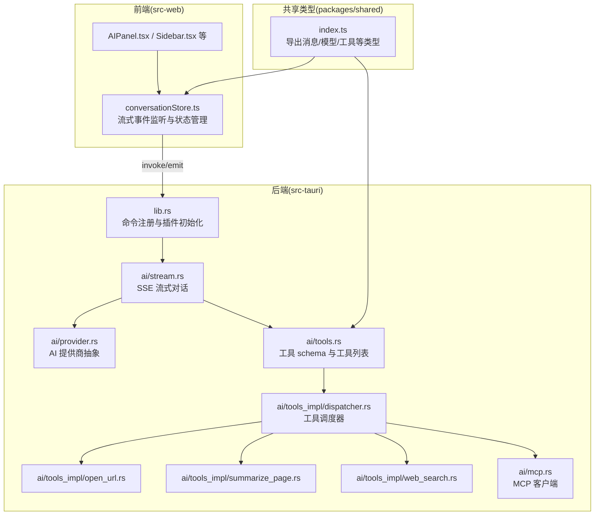
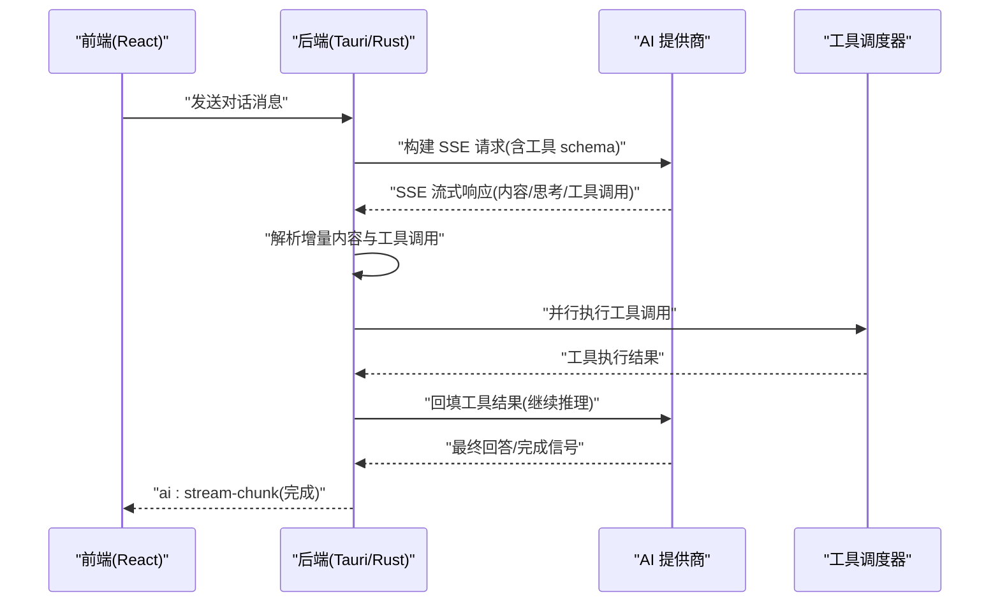
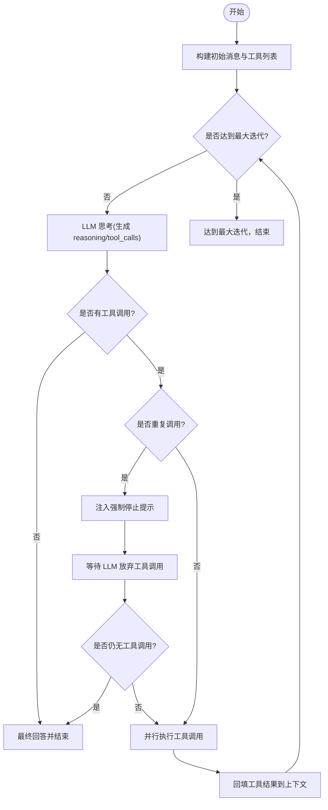
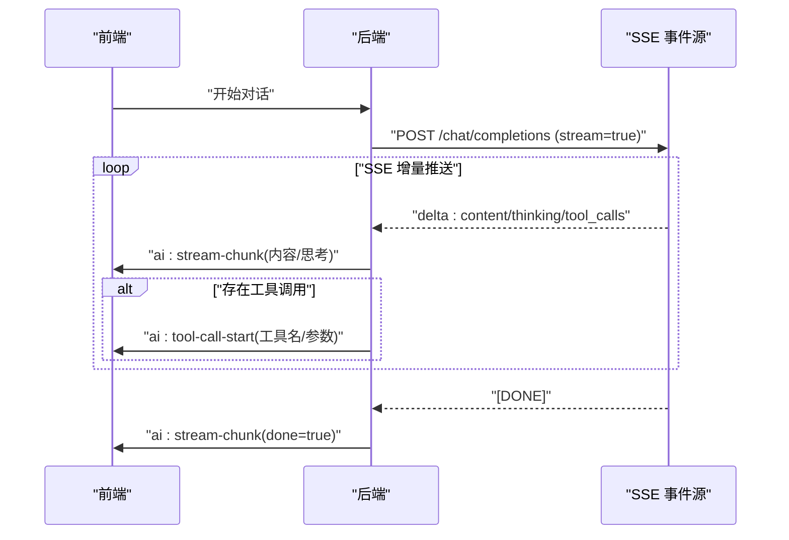
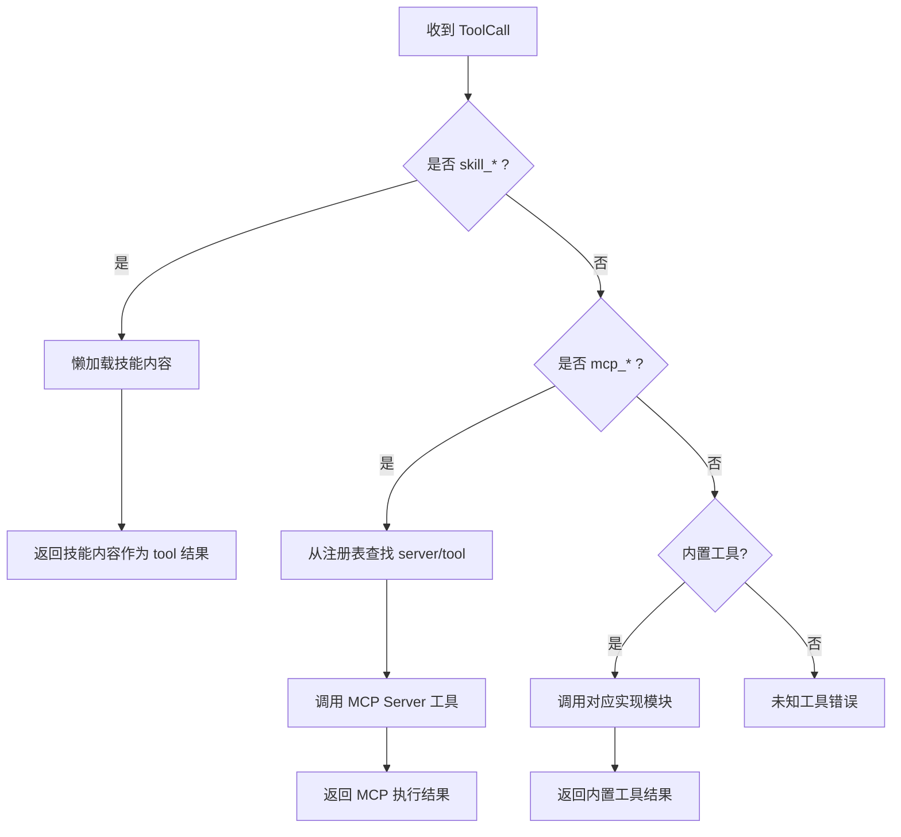
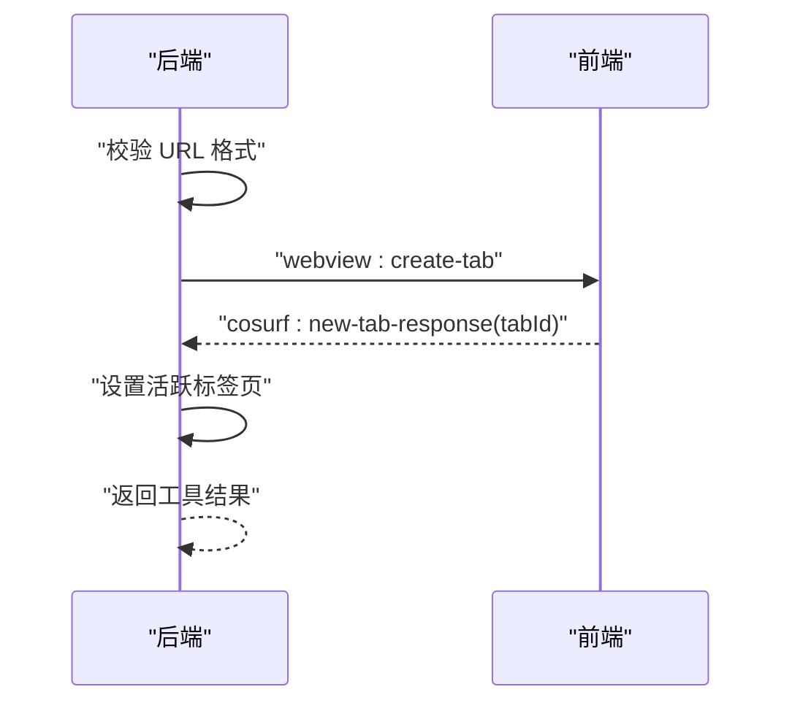
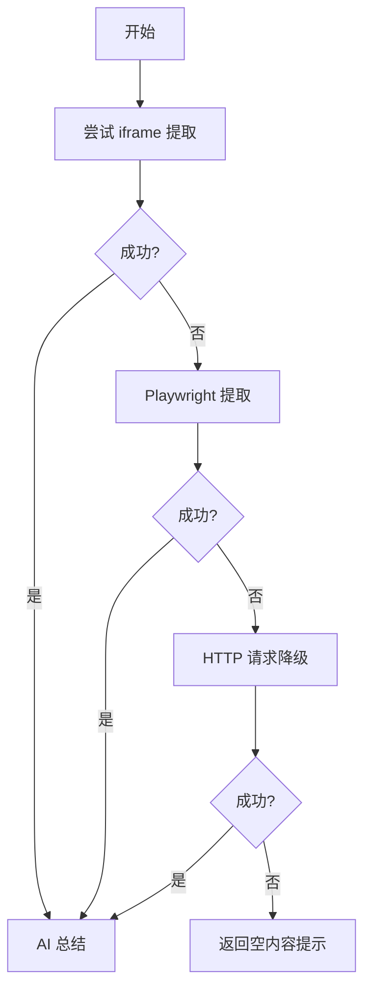
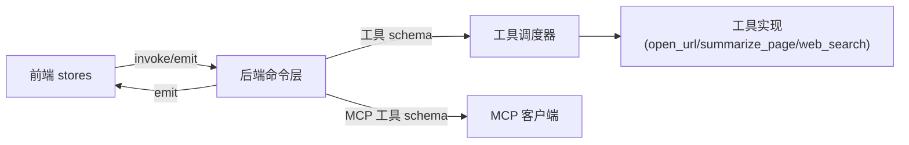

# AI 代理系统

<cite>
**本文引用的文件**
- [README.md](file://README.md)
- [agent.md](file://agent.md)
- [src-tauri/src/lib.rs](file://src-tauri/src/lib.rs)
- [src-tauri/src/ai/stream.rs](file://src-tauri/src/ai/stream.rs)
- [src-tauri/src/ai/provider.rs](file://src-tauri/src/ai/provider.rs)
- [src-tauri/src/ai/tools.rs](file://src-tauri/src/ai/tools.rs)
- [src-tauri/src/ai/tools_impl/dispatcher.rs](file://src-tauri/src/ai/tools_impl/dispatcher.rs)
- [src-tauri/src/ai/tools_impl/open_url.rs](file://src-tauri/src/ai/tools_impl/open_url.rs)
- [src-tauri/src/ai/tools_impl/summarize_page.rs](file://src-tauri/src/ai/tools_impl/summarize_page.rs)
- [src-tauri/src/ai/tools_impl/web_search.rs](file://src-tauri/src/ai/tools_impl/web_search.rs)
- [src-tauri/src/ai/mcp.rs](file://src-tauri/src/ai/mcp.rs)
- [src-web/src/stores/conversationStore.ts](file://src-web/src/stores/conversationStore.ts)
- [packages/shared/src/index.ts](file://packages/shared/src/index.ts)
</cite>

## 目录
1. [简介](#简介)
2. [项目结构](#项目结构)
3. [核心组件](#核心组件)
4. [架构总览](#架构总览)
5. [详细组件分析](#详细组件分析)
6. [依赖关系分析](#依赖关系分析)
7. [性能考量](#性能考量)
8. [故障排查指南](#故障排查指南)
9. [结论](#结论)
10. [附录](#附录)

## 简介
CoSurf AI 代理系统是一个桌面级 AI 阅读与思考助手，具备多模型支持、流式对话、ReAct Agent Loop、MCP 工具集成与 Skills 扩展能力。其核心目标是帮助用户在浏览网页时获得“读懂—记住—想起—决策”的完整认知闭环，支持 OpenAI、Anthropic、Google Gemini 等多家模型提供商，通过 SSE 实现实时流式响应，并通过工具调度器统一管理内置工具、MCP 工具与 Skills。

## 项目结构
项目采用前后端分离架构：
- 前端（React + TypeScript）：负责 UI、事件监听、流式渲染与状态管理
- 后端（Tauri + Rust）：负责 AI 对话、Agent Loop、工具调度、数据库与系统集成
- 共享类型（TypeScript）：前后端共用的数据模型与接口定义

图表来源
- [src-tauri/src/lib.rs:108-214](file://src-tauri/src/lib.rs#L108-L214)
- [src-tauri/src/ai/stream.rs:77-283](file://src-tauri/src/ai/stream.rs#L77-L283)
- [src-tauri/src/ai/tools.rs:197-225](file://src-tauri/src/ai/tools.rs#L197-L225)
- [src-tauri/src/ai/tools_impl/dispatcher.rs:14-55](file://src-tauri/src/ai/tools_impl/dispatcher.rs#L14-L55)
- [src-web/src/stores/conversationStore.ts:172-243](file://src-web/src/stores/conversationStore.ts#L172-L243)
- [packages/shared/src/index.ts:1-9](file://packages/shared/src/index.ts#L1-L9)

章节来源
- [README.md:213-328](file://README.md#L213-L328)
- [agent.md:31-122](file://agent.md#L31-L122)

## 核心组件
- Agent Loop（ReAct 思维与行动循环）：通过流式对话持续推理与调用工具，最多迭代若干轮，支持重复调用检测与强制终止
- 流式对话（SSE）：后端以 SSE 推送增量内容，前端实时渲染，支持 thinking 与 content 分离
- 工具调度器：统一路由内置工具、MCP 工具与 Skills 工具，支持并行执行与结果回填
- AI 提供商抽象层：统一构建请求、头部与 URL，适配 OpenAI、Anthropic、Google 等
- 工具 schema 与工具调用：内置工具参数校验与 OpenAI function calling 格式转换，异步聚合 Skills 与 MCP 工具

章节来源
- [src-tauri/src/ai/stream.rs:77-283](file://src-tauri/src/ai/stream.rs#L77-L283)
- [src-tauri/src/ai/tools_impl/dispatcher.rs:14-55](file://src-tauri/src/ai/tools_impl/dispatcher.rs#L14-L55)
- [src-tauri/src/ai/provider.rs:102-134](file://src-tauri/src/ai/provider.rs#L102-L134)
- [src-tauri/src/ai/tools.rs:197-225](file://src-tauri/src/ai/tools.rs#L197-L225)

## 架构总览
CoSurf 的整体交互链路如下：
- 前端发起对话请求，后端构建 SSE 请求并流式接收
- 后端解析增量响应，识别工具调用并并行执行
- 工具执行完成后，结果以 tool 消息形式回填上下文
- Agent Loop 根据上下文继续推理，直至无工具调用或达到最大迭代

图表来源
- [src-tauri/src/ai/stream.rs:301-602](file://src-tauri/src/ai/stream.rs#L301-L602)
- [src-tauri/src/ai/tools_impl/dispatcher.rs:14-55](file://src-tauri/src/ai/tools_impl/dispatcher.rs#L14-L55)
- [src-web/src/stores/conversationStore.ts:172-243](file://src-web/src/stores/conversationStore.ts#L172-L243)

## 详细组件分析

### Agent Loop（ReAct 思维与行动循环）
- 迭代控制：最大迭代次数限制，避免无限循环
- 重复调用检测：记录工具签名，连续重复时注入“强制停止”提示，必要时强制结束
- 工具调用解析：标准化不同提供商返回的工具调用格式，支持并行执行
- 结果回填：将工具结果以 tool 消息形式加入上下文，继续下一轮推理

图表来源
- [src-tauri/src/ai/stream.rs:94-283](file://src-tauri/src/ai/stream.rs#L94-L283)

章节来源
- [src-tauri/src/ai/stream.rs:94-283](file://src-tauri/src/ai/stream.rs#L94-L283)

### 流式对话机制（SSE）
- SSE 连接：使用 reqwest-eventsource 建立事件流，逐块推送 delta
- 内容分发：区分 thinking 与 content，分别保存与渲染
- 工具调用处理：累积工具调用，SSE [DONE] 前若存在工具调用，先通知前端再进入工具执行阶段
- 错误处理：网络异常时发送 ai:stream-error，并标记消息状态

图表来源
- [src-tauri/src/ai/stream.rs:379-602](file://src-tauri/src/ai/stream.rs#L379-L602)
- [src-web/src/stores/conversationStore.ts:172-243](file://src-web/src/stores/conversationStore.ts#L172-L243)

章节来源
- [src-tauri/src/ai/stream.rs:379-602](file://src-tauri/src/ai/stream.rs#L379-L602)
- [src-web/src/stores/conversationStore.ts:172-243](file://src-web/src/stores/conversationStore.ts#L172-L243)

### 工具调度器设计
- 路由策略：
  - 以前缀 skill_ 路由至 Skills 系统（懒加载完整技能内容）
  - 以前缀 mcp_ 路由至 MCP 工具（通过注册表映射 server/tool）
  - 其余内置工具：open_url、summarize_page、web_search、web_agent、run_command
- 并行执行：工具调用使用 join_all 并行执行，提升吞吐
- 结果回填：工具结果以 tool 消息形式加入上下文，继续下一轮

图表来源
- [src-tauri/src/ai/tools_impl/dispatcher.rs:14-55](file://src-tauri/src/ai/tools_impl/dispatcher.rs#L14-L55)
- [src-tauri/src/ai/tools.rs:211-225](file://src-tauri/src/ai/tools.rs#L211-L225)

章节来源
- [src-tauri/src/ai/tools_impl/dispatcher.rs:14-55](file://src-tauri/src/ai/tools_impl/dispatcher.rs#L14-L55)
- [src-tauri/src/ai/tools.rs:211-225](file://src-tauri/src/ai/tools.rs#L211-L225)

### AI 提供商抽象层
- 统一构建请求体与头部：
  - OpenAI/兼容：Authorization: Bearer
  - Anthropic：x-api-key + 特定版本头
  - Google：基础路径拼接
- 统一工具调用格式：支持不同提供商的 function calling 差异，统一为 OpenAI 格式
- 流式响应：统一 DeltaContent 结构，支持 reasoning_content 与 tool_calls

章节来源
- [src-tauri/src/ai/provider.rs:102-134](file://src-tauri/src/ai/provider.rs#L102-L134)
- [src-tauri/src/ai/stream.rs:18-61](file://src-tauri/src/ai/stream.rs#L18-L61)

### 工具 schema 定义与工具调用机制
- 内置工具 schema：summarize_page、web_agent、open_url、translate、export_markdown、web_search、run_command
- 异步聚合：
  - 内置工具：固定 schema
  - Skills：仅暴露 description，实际内容在工具执行时懒加载
  - MCP：连接各 Server 拉取 tools/list，按 server/tool 注册为独立 function
- 调用格式标准化：将不同提供商返回的 function.name/function.arguments 提升到顶层，便于统一解析

章节来源
- [src-tauri/src/ai/tools.rs:197-225](file://src-tauri/src/ai/tools.rs#L197-L225)
- [src-tauri/src/ai/tools.rs:274-396](file://src-tauri/src/ai/tools.rs#L274-L396)
- [src-tauri/src/ai/stream.rs:18-61](file://src-tauri/src/ai/stream.rs#L18-L61)

### 典型工具实现示例

#### 打开网页工具（open_url）
- 参数校验：URL 必须以 http/https 开头
- 去重控制：5 秒内相同 URL 不重复打开
- 前后端协作：向前端发出创建标签页事件，等待新标签页 ID 并设为活跃

图表来源
- [src-tauri/src/ai/tools_impl/open_url.rs:17-100](file://src-tauri/src/ai/tools_impl/open_url.rs#L17-L100)

章节来源
- [src-tauri/src/ai/tools_impl/open_url.rs:17-100](file://src-tauri/src/ai/tools_impl/open_url.rs#L17-L100)

#### 页面总结工具（summarize_page）
- 多策略提取：iframe -> Playwright -> HTTP 降级
- 内容清洗与长度限制：提取正文文本，限制最大长度
- AI 总结：调用模型生成中文摘要

图表来源
- [src-tauri/src/ai/tools_impl/summarize_page.rs:140-202](file://src-tauri/src/ai/tools_impl/summarize_page.rs#L140-L202)

章节来源
- [src-tauri/src/ai/tools_impl/summarize_page.rs:140-202](file://src-tauri/src/ai/tools_impl/summarize_page.rs#L140-L202)

#### 联网搜索工具（web_search）
- 参数：query、engine_type、time_range、max_results
- IQS API：鉴权、超时、结果解析与格式化输出

章节来源
- [src-tauri/src/ai/tools_impl/web_search.rs:14-179](file://src-tauri/src/ai/tools_impl/web_search.rs#L14-L179)

### 前端流式处理与状态管理
- 事件监听：ai:stream-chunk、ai:stream-error、ai:tool-call-start
- 状态更新：区分 thinking 与 content，工具调用后重置为 streaming
- 标题生成：对话轮数达到阈值时自动生成会话标题

章节来源
- [src-web/src/stores/conversationStore.ts:172-304](file://src-web/src/stores/conversationStore.ts#L172-L304)

## 依赖关系分析
- 命令注册：后端通过 generate_handler 注册所有命令，前端通过 invoke 调用
- 流式事件：后端通过 emit 发送 ai:stream-chunk、ai:stream-error、ai:tool-call-start，前端监听并更新状态
- 工具注册：工具 schema 通过异步加载 Skills 与 MCP 动态注入，Dispatcher 路由到具体实现
- 数据类型：packages/shared 提供前后端共用的消息、模型、工具等类型

图表来源
- [src-tauri/src/lib.rs:108-214](file://src-tauri/src/lib.rs#L108-L214)
- [src-tauri/src/ai/tools_impl/dispatcher.rs:14-55](file://src-tauri/src/ai/tools_impl/dispatcher.rs#L14-L55)
- [src-web/src/stores/conversationStore.ts:172-243](file://src-web/src/stores/conversationStore.ts#L172-L243)
- [packages/shared/src/index.ts:1-9](file://packages/shared/src/index.ts#L1-L9)

章节来源
- [src-tauri/src/lib.rs:108-214](file://src-tauri/src/lib.rs#L108-L214)
- [packages/shared/src/index.ts:1-9](file://packages/shared/src/index.ts#L1-L9)

## 性能考量
- 并行工具执行：使用 join_all 并行调用多个工具，减少总耗时
- SSE 流式渲染：前端即时渲染，降低感知延迟
- 重复调用抑制：通过签名检测与强制提示，避免无效循环
- 超时与重试：MCP 工具发现设置超时；工具调用失败返回 fake result，保证 Agent Loop 不中断
- 内容提取降级：多策略提取失败时快速降级，避免阻塞

## 故障排查指南
- SSE 错误：查看 ai:stream-error 事件，检查网络、API Key、Base URL 与模型配置
- 工具调用失败：查看工具执行日志与 fake result 输出，确认参数与权限
- MCP 工具不可用：检查 MCP Server 配置、传输模式与连接状态
- 重复调用：关注重复检测日志与强制停止提示，调整提示词或工具参数
- 前端无响应：确认事件监听是否绑定到当前会话 ID，检查 cancel_flag 与 done 信号

章节来源
- [src-tauri/src/ai/stream.rs:547-568](file://src-tauri/src/ai/stream.rs#L547-L568)
- [src-tauri/src/ai/tools_impl/dispatcher.rs:125-204](file://src-tauri/src/ai/tools_impl/dispatcher.rs#L125-L204)

## 结论
CoSurf 通过 ReAct Agent Loop、SSE 流式对话与统一工具调度器，实现了“思考—行动—反馈”的闭环。其多模型抽象与 MCP/Skills 扩展机制，使得系统具备强大的可扩展性与跨平台工具集成能力。通过完善的错误处理、重复调用抑制与并行执行策略，系统在复杂任务场景下仍能保持稳定与高效。

## 附录

### 扩展现有工具与功能的步骤
- 新增内置工具：
  - 在工具 schema 定义中添加新工具的 OpenAI schema
  - 在 tools_impl 下创建实现模块并导出路由
  - 在 dispatcher.rs 中注册路由
- 新增 MCP 工具：
  - 在设置中配置 MCP Server（支持 stdio/http/sse/streamableHttp）
  - Agent Loop 会自动拉取 tools/list 并注册为独立 function
- 新增 Skills：
  - 在设置中导入或放置到技能目录，Agent Loop 会懒加载并暴露 description
  - 工具调用 skill_{id} 后，返回完整技能内容供模型决策

章节来源
- [agent.md:517-533](file://agent.md#L517-L533)
- [src-tauri/src/ai/tools.rs:197-225](file://src-tauri/src/ai/tools.rs#L197-L225)
- [src-tauri/src/ai/tools_impl/dispatcher.rs:22-31](file://src-tauri/src/ai/tools_impl/dispatcher.rs#L22-L31)