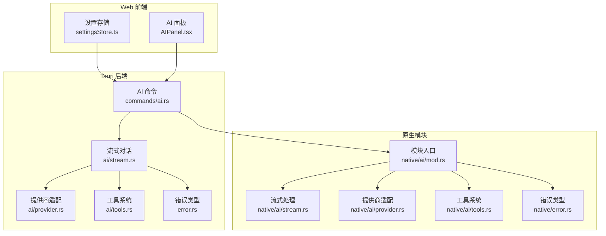
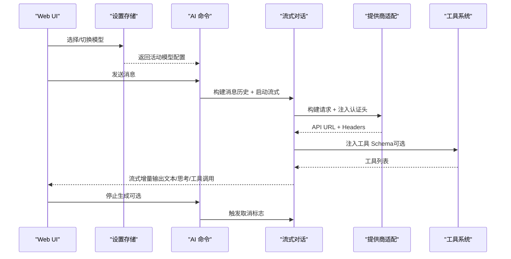
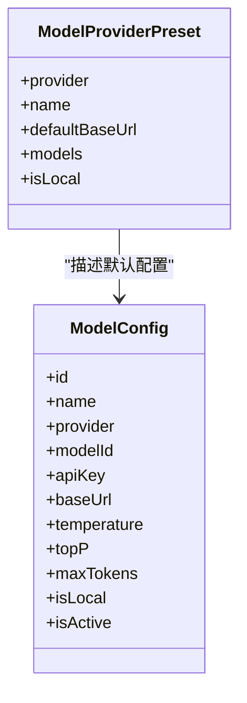
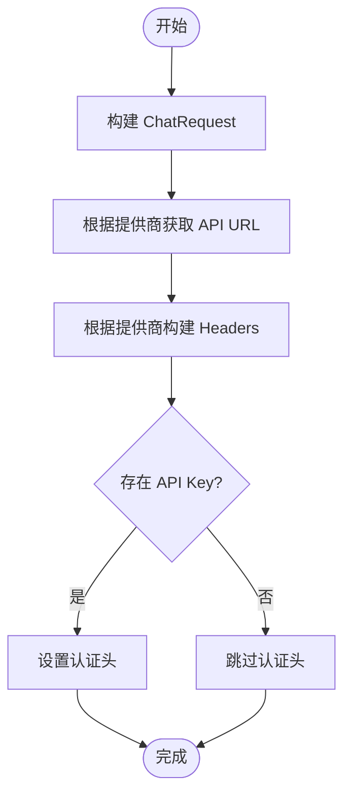
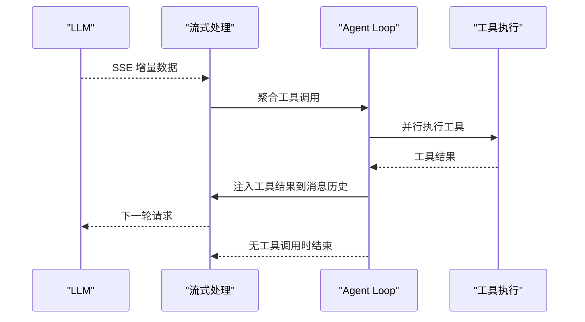
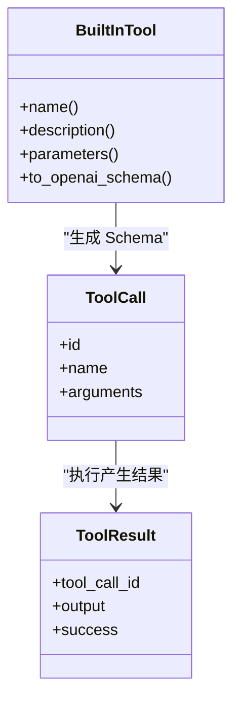
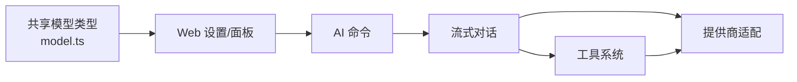

# AI 模型提供商

<cite>
**本文引用的文件**
- [native 模块入口](file://native/src/ai/mod.rs)
- [共享模型类型定义](file://packages/shared/src/model.ts)
- [原生 AI 提供商与请求构建](file://native/src/ai/provider.rs)
- [原生流式对话与工具执行](file://native/src/ai/stream.rs)
- [原生工具系统](file://native/src/ai/tools.rs)
- [原生错误类型](file://native/src/error.rs)
- [Tauri AI 提供商与请求构建](file://src-tauri/src/ai/provider.rs)
- [Tauri 流式对话与工具执行](file://src-tauri/src/ai/stream.rs)
- [Tauri 工具系统](file://src-tauri/src/ai/tools.rs)
- [Tauri AI 命令](file://src-tauri/src/commands/ai.rs)
- [Tauri 错误类型](file://src-tauri/src/error.rs)
- [Web 设置与模型选择](file://src-web/src/stores/settingsStore.ts)
- [Web AI 面板与模型选择](file://src-web/src/components/layout/AIPanel.tsx)
- [Web 模型配置示例](file://src-web/src/lib/mock.ts)
- [MCP 速率限制参考](file://docs/MCP_SKILL_IMPLEMENTATION.md)
</cite>

## 目录
1. [简介](#简介)
2. [项目结构](#项目结构)
3. [核心组件](#核心组件)
4. [架构总览](#架构总览)
5. [详细组件分析](#详细组件分析)
6. [依赖关系分析](#依赖关系分析)
7. [性能考量](#性能考量)
8. [故障排查指南](#故障排查指南)
9. [结论](#结论)
10. [附录](#附录)

## 简介
本文件面向 CoSurf 的 AI 模型提供商抽象层，系统性阐述多模型提供商（OpenAI、Anthropic、Google Gemini 等）统一接口封装的设计与实现，覆盖模型配置管理、API 密钥管理、请求参数适配、响应格式标准化、模型切换与工具调用、错误处理与重试、以及扩展新提供商的方法论。文档同时给出架构图、流程图与类图，帮助开发者快速理解与维护。

## 项目结构
CoSurf 的 AI 抽象层横跨原生 Rust 模块与 Tauri 后端，以及 Web 前端设置与面板组件：
- 原生模块（Electron/N-API 调用）：提供无 Tauri 依赖的 AI 抽象与流式处理
- Tauri 后端：提供完整的 AI 流式对话、工具发现与执行、事件派发
- Web 前端：模型配置、切换、流式事件监听与 UI 展示

图表来源
- [Tauri AI 命令](file://src-tauri/src/commands/ai.rs)
- [Tauri 流式对话与工具执行](file://src-tauri/src/ai/stream.rs)
- [Tauri AI 提供商与请求构建](file://src-tauri/src/ai/provider.rs)
- [Tauri 工具系统](file://src-tauri/src/ai/tools.rs)
- [原生模块入口](file://native/src/ai/mod.rs)
- [原生流式对话与工具执行](file://native/src/ai/stream.rs)
- [原生 AI 提供商与请求构建](file://native/src/ai/provider.rs)
- [原生工具系统](file://native/src/ai/tools.rs)

章节来源
- [Tauri AI 命令](file://src-tauri/src/commands/ai.rs)
- [原生模块入口](file://native/src/ai/mod.rs)

## 核心组件
- 模型配置与提供商预设：前端共享类型定义与默认提供商预设，便于统一管理与扩展
- 提供商适配层：统一构建请求、选择 API 路径、注入认证头、判断工具调用能力
- 流式对话引擎：基于 SSE 的流式响应解析，支持工具调用聚合与 Agent Loop 循环
- 工具系统：内置工具 Schema 与执行、Skills 与 MCP 工具动态注入
- 错误与事件：统一错误类型、事件派发与取消机制

章节来源
- [共享模型类型定义](file://packages/shared/src/model.ts)
- [原生 AI 提供商与请求构建](file://native/src/ai/provider.rs)
- [原生流式对话与工具执行](file://native/src/ai/stream.rs)
- [原生工具系统](file://native/src/ai/tools.rs)
- [Tauri 流式对话与工具执行](file://src-tauri/src/ai/stream.rs)
- [Tauri 工具系统](file://src-tauri/src/ai/tools.rs)

## 架构总览
CoSurf 的 AI 抽象层采用“前端配置 + 后端流式 + 原生适配”的分层设计：
- 前端负责模型选择与设置持久化
- 后端负责消息历史构建、流式请求、工具发现与执行、事件派发
- 原生模块提供无 Tauri 依赖的流式处理与工具执行能力，便于 Electron/N-API 场景

图表来源
- [Tauri AI 命令](file://src-tauri/src/commands/ai.rs)
- [Tauri 流式对话与工具执行](file://src-tauri/src/ai/stream.rs)
- [Tauri AI 提供商与请求构建](file://src-tauri/src/ai/provider.rs)
- [Tauri 工具系统](file://src-tauri/src/ai/tools.rs)

## 详细组件分析

### 模型配置与提供商预设
- 前端共享类型定义了模型提供商枚举、模型配置结构与提供商预设数组，包含默认 Base URL 与模型列表
- 预设覆盖 OpenAI、Anthropic、Google Gemini、智谱、月之暗面、DeepSeek、豆包、通义千问、Ollama 等
- Web 设置存储负责加载/保存模型配置与活动模型

图表来源
- [共享模型类型定义](file://packages/shared/src/model.ts)

章节来源
- [共享模型类型定义](file://packages/shared/src/model.ts)
- [Web 设置与模型选择](file://src-web/src/stores/settingsStore.ts)
- [Web AI 面板与模型选择](file://src-web/src/components/layout/AIPanel.tsx)
- [Web 模型配置示例](file://src-web/src/lib/mock.ts)

### 提供商适配层（请求构建与认证）
- 统一构建 ChatRequest 与流式请求体，注入温度、Top-P、MaxTokens 等参数
- 根据提供商选择 API 路径（Anthropic 使用 /messages，其他使用 /chat/completions）
- 根据提供商注入认证头（Anthropic 使用 x-api-key，其他使用 Authorization Bearer）

图表来源
- [原生 AI 提供商与请求构建](file://native/src/ai/provider.rs)
- [Tauri AI 提供商与请求构建](file://src-tauri/src/ai/provider.rs)

章节来源
- [原生 AI 提供商与请求构建](file://native/src/ai/provider.rs)
- [Tauri AI 提供商与请求构建](file://src-tauri/src/ai/provider.rs)

### 流式对话与工具调用（Agent Loop）
- 流式对话基于 SSE 接收增量数据，解析工具调用 delta 并聚合为完整工具调用
- 支持“思考内容”与“回复内容”区分，分别派发事件
- Agent Loop 机制：若模型返回工具调用，先执行工具，再将结果注入消息历史，循环直到无工具调用或达到最大迭代
- 重复调用检测：连续多次相同工具调用时注入“强制停止”提示，防止无限循环

图表来源
- [原生流式对话与工具执行](file://native/src/ai/stream.rs)
- [Tauri 流式对话与工具执行](file://src-tauri/src/ai/stream.rs)

章节来源
- [原生流式对话与工具执行](file://native/src/ai/stream.rs)
- [Tauri 流式对话与工具执行](file://src-tauri/src/ai/stream.rs)

### 工具系统（Schema 与执行）
- 内置工具：总结页面、网页代理、打开链接、翻译、导出 Markdown、联网搜索、执行命令
- 工具 Schema：统一转换为 OpenAI function calling 格式，注入到模型请求中
- 工具执行：内置工具直接执行；部分需要 Electron 主进程桥接的工具通过特殊标记交由主进程处理
- 动态工具：支持从 Skills 与 MCP 服务器动态发现工具 Schema 并注入 Agent Loop

图表来源
- [原生工具系统](file://native/src/ai/tools.rs)
- [Tauri 工具系统](file://src-tauri/src/ai/tools.rs)

章节来源
- [原生工具系统](file://native/src/ai/tools.rs)
- [Tauri 工具系统](file://src-tauri/src/ai/tools.rs)

### 错误处理与事件派发
- 统一错误类型：数据库、HTTP、JSON、AI 提供商、配置、未找到、内部错误
- 事件派发：流式对话过程中遇到错误时，派发错误事件并标记消息完成状态
- 取消机制：支持用户触发取消，流式处理在检测到取消标志后中断并清理状态

章节来源
- [原生错误类型](file://native/src/error.rs)
- [Tauri 错误类型](file://src-tauri/src/error.rs)
- [Tauri 流式对话与工具执行](file://src-tauri/src/ai/stream.rs)

## 依赖关系分析
- 前端设置存储与面板组件依赖共享模型类型与后端命令
- 后端命令依赖流式对话、提供商适配与工具系统
- 原生模块提供无 Tauri 依赖的流式与工具能力，便于 Electron 场景复用

图表来源
- [共享模型类型定义](file://packages/shared/src/model.ts)
- [Tauri AI 命令](file://src-tauri/src/commands/ai.rs)
- [Tauri 流式对话与工具执行](file://src-tauri/src/ai/stream.rs)
- [Tauri 工具系统](file://src-tauri/src/ai/tools.rs)

章节来源
- [共享模型类型定义](file://packages/shared/src/model.ts)
- [Tauri AI 命令](file://src-tauri/src/commands/ai.rs)

## 性能考量
- 流式处理：SSE 增量输出降低首包延迟，提升用户体验
- 工具并行执行：Agent Loop 中并发执行多个工具，缩短整体响应时间
- 重复调用检测：避免模型陷入工具调用循环，减少无效请求
- 取消机制：及时中断长耗时请求，释放资源
- 本地模型：Ollama 等本地模型可显著降低网络延迟与隐私风险

[本节为通用指导，无需特定文件引用]

## 故障排查指南
常见问题与定位思路：
- API Key/URL 配置错误：检查模型配置中的 Base URL 与 API Key，确认提供商路径与认证头正确
- 工具调用失败：查看工具执行结果与错误事件，确认工具参数与权限
- 流式连接异常：关注 SSE 错误事件与日志，检查网络连通性与速率限制
- 取消无效：确认取消标志设置与事件派发逻辑

章节来源
- [Tauri 流式对话与工具执行](file://src-tauri/src/ai/stream.rs)
- [原生流式对话与工具执行](file://native/src/ai/stream.rs)

## 结论
CoSurf 的 AI 抽象层通过统一的提供商适配、流式对话引擎与工具系统，实现了对多家主流 AI 服务的一致接入。其设计兼顾易扩展与高可用，既支持本地模型，也支持云端服务；既支持静态工具，也支持动态工具注入。通过完善的错误处理与事件机制，系统在复杂场景下仍能保持稳定与可观的性能。

[本节为总结，无需特定文件引用]

## 附录

### 如何添加新的 AI 模型提供商
步骤概览：
1. 在前端共享类型中新增提供商枚举值与默认预设
2. 在提供商适配层增加 API 路径与认证头逻辑
3. 若需要工具调用能力，在工具系统中确认兼容性
4. 在前端设置中提供配置入口与校验
5. 在流式处理中确保 SSE 解析与事件派发正常

参考实现位置：
- 新增提供商枚举与预设：[共享模型类型定义](file://packages/shared/src/model.ts)
- 请求构建与认证：[原生 AI 提供商与请求构建](file://native/src/ai/provider.rs)、[Tauri AI 提供商与请求构建](file://src-tauri/src/ai/provider.rs)
- 工具注入与执行：[原生工具系统](file://native/src/ai/tools.rs)、[Tauri 工具系统](file://src-tauri/src/ai/tools.rs)
- 流式处理与事件：[原生流式对话与工具执行](file://native/src/ai/stream.rs)、[Tauri 流式对话与工具执行](file://src-tauri/src/ai/stream.rs)

章节来源
- [共享模型类型定义](file://packages/shared/src/model.ts)
- [原生 AI 提供商与请求构建](file://native/src/ai/provider.rs)
- [Tauri AI 提供商与请求构建](file://src-tauri/src/ai/provider.rs)
- [原生工具系统](file://native/src/ai/tools.rs)
- [Tauri 工具系统](file://src-tauri/src/ai/tools.rs)
- [原生流式对话与工具执行](file://native/src/ai/stream.rs)
- [Tauri 流式对话与工具执行](file://src-tauri/src/ai/stream.rs)

### 模型提供商特点与选择建议
- OpenAI：生态完善，工具调用成熟，适合复杂任务与高质量输出
- Anthropic：推理能力强，工具调用与思考内容支持较好
- Google Gemini：多模态潜力大，适合图文混合场景
- 通义千问/智谱/月之暗面：国内服务，合规与低延迟优势明显
- DeepSeek/豆包：性价比高，适合成本敏感场景
- Ollama：本地部署，隐私与离线能力突出

选择建议：
- 高质量与稳定性优先：OpenAI/Anthropic
- 国内合规与低延迟：通义/智谱/月之暗面
- 成本敏感与多模态：Google Gemini/DeepSeek
- 隐私与离线：Ollama 本地模型

章节来源
- [共享模型类型定义](file://packages/shared/src/model.ts)

### 可靠性保障措施（错误处理、重试、速率限制）
- 错误处理：统一错误类型与事件派发，出现异常时发送错误事件并标记消息状态
- 取消机制：支持用户随时停止生成，流式处理检测取消标志并清理状态
- 速率限制：MCP 客户端可参考速率限制实现思路（每分钟请求数限制与重置逻辑）

章节来源
- [Tauri 流式对话与工具执行](file://src-tauri/src/ai/stream.rs)
- [原生流式对话与工具执行](file://native/src/ai/stream.rs)
- [MCP 速率限制参考](file://docs/MCP_SKILL_IMPLEMENTATION.md)