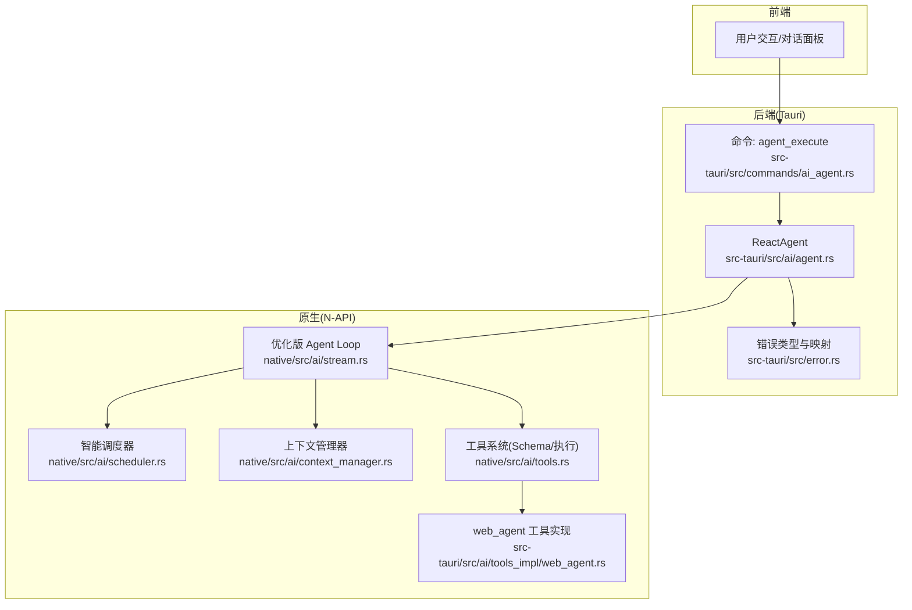
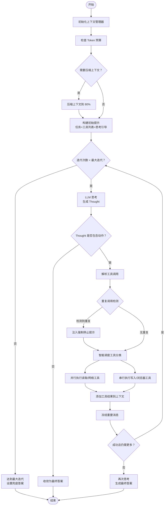
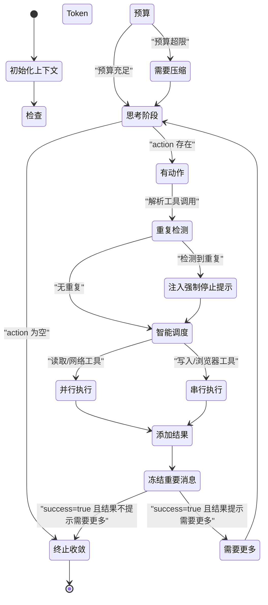
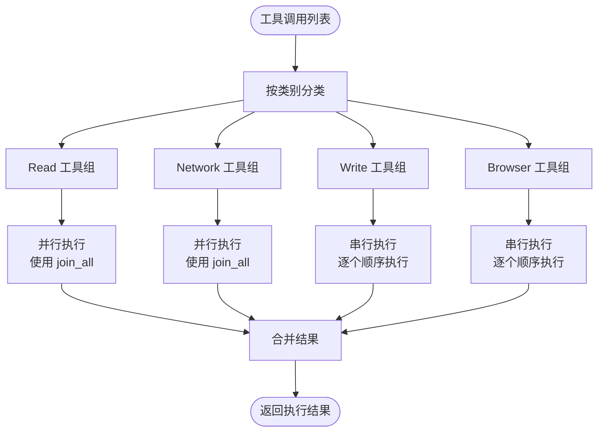
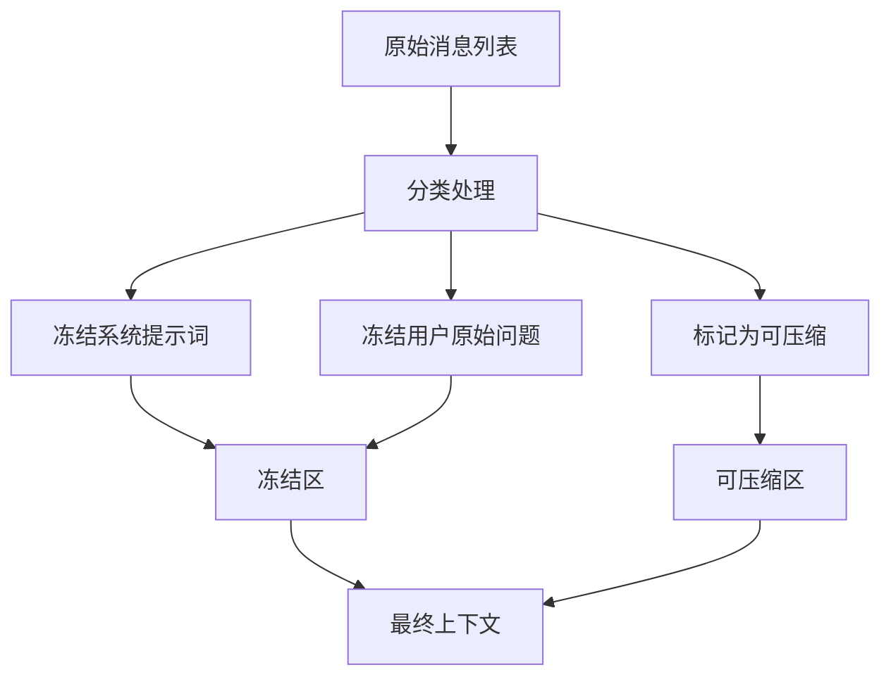
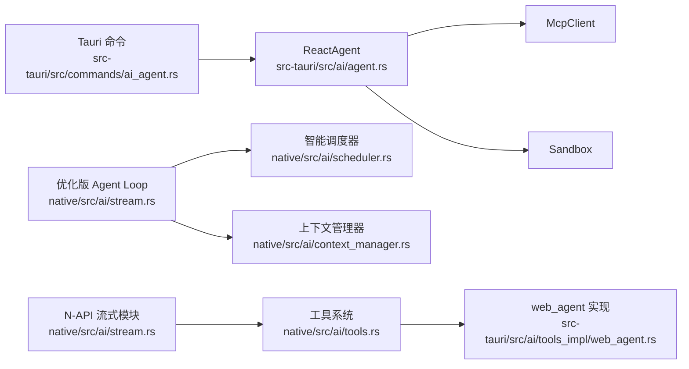

# Agent Loop 核心引擎

<cite>
**本文引用的文件**
- [src-tauri/src/ai/agent.rs](file://src-tauri/src/ai/agent.rs)
- [src-tauri/src/commands/ai_agent.rs](file://src-tauri/src/commands/ai_agent.rs)
- [native/src/ai/stream.rs](file://native/src/ai/stream.rs)
- [native/src/ai/tools.rs](file://native/src/ai/tools.rs)
- [native/src/ai/scheduler.rs](file://native/src/ai/scheduler.rs)
- [native/src/ai/context_manager.rs](file://native/src/ai/context_manager.rs)
- [native/examples/optimized_agent_loop.rs](file://native/examples/optimized_agent_loop.rs)
- [src-tauri/src/ai/tools_impl/web_agent.rs](file://src-tauri/src/ai/tools_impl/web_agent.rs)
- [src-tauri/src/error.rs](file://src-tauri/src/error.rs)
- [README.md](file://README.md)
- [agent.md](file://agent.md)
- [docs/THINKING_FIELD_ANALYSIS.md](file://docs/THINKING_FIELD_ANALYSIS.md)
- [docs/AGENT_DYNAMIC_TOOLS.md](file://docs/AGENT_DYNAMIC_TOOLS.md)
- [examples/echo-skill.md](file://examples/echo-skill.md)
</cite>

## 更新摘要
**所做更改**
- 新增智能并行调度系统章节，详细介绍工具分类和调度策略
- 新增上下文管理优化章节，说明上下文冻结、压缩和重要消息冻结机制
- 更新 AgentLoop 执行流程，包含优化后的智能调度和上下文管理
- 新增性能优化和资源管理章节，展示实际性能提升效果
- 更新架构图和执行序列图，反映新的优化架构

## 目录
1. [简介](#简介)
2. [项目结构](#项目结构)
3. [核心组件](#核心组件)
4. [架构总览](#架构总览)
5. [详细组件分析](#详细组件分析)
6. [智能并行调度系统](#智能并行调度系统)
7. [上下文管理优化](#上下文管理优化)
8. [性能优化与资源管理](#性能优化与资源管理)
9. [依赖关系分析](#依赖关系分析)
10. [故障排查指南](#故障排查指南)
11. [结论](#结论)
12. [附录](#附录)

## 简介
本文件面向 CoSurf 的 Agent Loop 核心引擎，系统性阐述 ReAct（推理 + 行动）模式的实现原理与工程实践，特别关注最新的重大优化，包括智能并行调度系统和上下文管理优化。本次更新涵盖以下主题：
- 思维步骤（Thought）、动作（Action）、观察结果（Observation）的数据结构设计与职责边界
- AgentLoop 的执行流程：初始化提示构建、迭代执行机制、最大迭代次数控制、终止条件
- 智能并行调度系统：基于工具类型的智能调度策略，提升执行效率
- 上下文管理优化：上下文冻结、压缩和重要消息管理机制
- AgentTrace 的作用与数据采集机制（轨迹记录、最终答案）
- 错误处理与异常策略（统一错误类型、错误码映射、回调通知）
- 如何扩展新的思维模式与动作类型（工具 Schema、工具执行、MCP/Skills 集成）
- AgentLoop 状态转换图与执行序列图
- 具体代码示例路径指引（以"章节来源"标注）

## 项目结构
CoSurf 的 Agent Loop 在后端 Rust 层实现，前端通过 Tauri 命令触发；同时提供原生模块（N-API）能力，使 Electron 主进程可直接调用流式对话与 Agent 执行。最新版本引入了智能调度和上下文管理两大优化模块。



**图表来源**
- [src-tauri/src/commands/ai_agent.rs:34-71](file://src-tauri/src/commands/ai_agent.rs#L34-L71)
- [src-tauri/src/ai/agent.rs:72-139](file://src-tauri/src/ai/agent.rs#L72-L139)
- [native/src/ai/stream.rs:586-785](file://native/src/ai/stream.rs#L586-L785)
- [native/src/ai/scheduler.rs:1-163](file://native/src/ai/scheduler.rs#L1-L163)
- [native/src/ai/context_manager.rs:1-288](file://native/src/ai/context_manager.rs#L1-L288)
- [native/src/ai/tools.rs:166-184](file://native/src/ai/tools.rs#L166-L184)
- [src-tauri/src/ai/tools_impl/web_agent.rs:13-49](file://src-tauri/src/ai/tools_impl/web_agent.rs#L13-L49)

**章节来源**
- [src-tauri/src/commands/ai_agent.rs:34-71](file://src-tauri/src/commands/ai_agent.rs#L34-L71)
- [src-tauri/src/ai/agent.rs:72-139](file://src-tauri/src/ai/agent.rs#L72-L139)
- [native/src/ai/stream.rs:586-785](file://native/src/ai/stream.rs#L586-L785)
- [native/src/ai/scheduler.rs:1-163](file://native/src/ai/scheduler.rs#L1-L163)
- [native/src/ai/context_manager.rs:1-288](file://native/src/ai/context_manager.rs#L1-L288)
- [native/src/ai/tools.rs:166-184](file://native/src/ai/tools.rs#L166-L184)
- [src-tauri/src/ai/tools_impl/web_agent.rs:13-49](file://src-tauri/src/ai/tools_impl/web_agent.rs#L13-L49)

## 核心组件
- 数据结构
  - Thought：包含推理内容与可选的动作决策
  - Action：包含工具名称与参数（JSON）
  - Observation：包含执行结果与成功标记
  - AgentTrace：记录整个执行轨迹（thoughts、observations、final_answer）
- 执行引擎
  - ReactAgent.run：构建初始提示、循环思考-行动-观察、终止条件判断、最终答案收敛
  - **优化版 Agent Loop**：集成智能调度和上下文管理的新执行引擎
- 智能调度系统
  - **工具分类**：Read/Write/Network/Browser 四种类型
  - **智能调度**：并行执行安全工具，串行执行冲突工具
- 上下文管理系统
  - **上下文冻结**：保护关键消息不被压缩
  - **智能压缩**：动态压缩可压缩消息
  - **重要消息冻结**：将重要工具结果移动到冻结区
- 工具系统
  - 内置工具 Schema 与执行（summarize_page、web_agent、open_url、web_search、run_command 等）
  - 通过 N-API 桥接 Electron 主进程执行浏览器相关动作
- 错误处理
  - 统一 AppError 枚举与错误码映射，便于前端展示与定位

**章节来源**
- [src-tauri/src/ai/agent.rs:11-38](file://src-tauri/src/ai/agent.rs#L11-L38)
- [src-tauri/src/ai/agent.rs:72-139](file://src-tauri/src/ai/agent.rs#L72-L139)
- [native/src/ai/tools.rs:24-163](file://native/src/ai/tools.rs#L24-L163)
- [native/src/ai/scheduler.rs:9-51](file://native/src/ai/scheduler.rs#L9-L51)
- [native/src/ai/context_manager.rs:10-49](file://native/src/ai/context_manager.rs#L10-L49)
- [src-tauri/src/error.rs:4-64](file://src-tauri/src/error.rs#L4-L64)

## 架构总览
ReAct Agent Loop 在后端以"思考-行动-观察"的闭环执行，结合智能并行调度和上下文管理优化，形成高效、稳定的智能代理框架。前端通过 Tauri 命令发起任务，后端负责初始化环境、构建提示、驱动循环、智能调度工具执行、管理上下文状态、汇总轨迹。

```mermaid
sequenceDiagram
participant UI as "前端"
participant CMD as "Tauri 命令 : agent_execute"
participant AG as "ReactAgent"
participant OPT as "优化版 Agent Loop"
participant CTX as "上下文管理器"
participant SCH as "智能调度器"
participant NAT as "N-API 流式对话/Agent Loop"
participant TOOLS as "工具系统"
participant WEB as "web_agent 实现"
UI->>CMD : 发起任务(任务描述, 最大迭代)
CMD->>AG : 初始化 Sandbox/MCP, 创建 ReactAgent
AG->>OPT : 启动优化版 Agent Loop
OPT->>CTX : 初始化上下文管理器
OPT->>NAT : 启动 Agent Loop(构建提示+工具Schema)
NAT->>TOOLS : 解析工具调用(tool_calls)
OPT->>SCH : 智能调度工具分类
SCH-->>OPT : 返回调度结果(read/write/network/browser)
OPT->>TOOLS : 并行/串行执行工具
TOOLS->>WEB : 需要浏览器操作时桥接主进程
WEB-->>TOOLS : 执行结果
TOOLS-->>OPT : 工具执行结果
OPT->>CTX : 添加工具结果到上下文
OPT->>CTX : 冻结重要消息
OPT-->>AG : 追加消息(Thought/Action/Observation)
AG-->>UI : 返回最终答案与轨迹摘要
```

**图表来源**
- [src-tauri/src/commands/ai_agent.rs:34-71](file://src-tauri/src/commands/ai_agent.rs#L34-L71)
- [src-tauri/src/ai/agent.rs:72-139](file://src-tauri/src/ai/agent.rs#L72-L139)
- [native/src/ai/stream.rs:586-785](file://native/src/ai/stream.rs#L586-L785)
- [native/src/ai/context_manager.rs:222-246](file://native/src/ai/context_manager.rs#L222-L246)
- [native/src/ai/scheduler.rs:80-106](file://native/src/ai/scheduler.rs#L80-L106)
- [native/src/ai/tools.rs:224-267](file://native/src/ai/tools.rs#L224-L267)
- [src-tauri/src/ai/tools_impl/web_agent.rs:13-49](file://src-tauri/src/ai/tools_impl/web_agent.rs#L13-L49)

## 详细组件分析

### 数据结构设计与职责
- Thought
  - 字段：reasoning（推理内容）、action（可选动作）
  - 用途：承载每轮思考与决策，若 action 为空则视为得出最终答案
- Action
  - 字段：tool_name（工具名）、arguments（JSON 参数）
  - 用途：描述具体要执行的动作及其参数
- Observation
  - 字段：result（结果文本）、success（是否成功）
  - 用途：记录动作执行后的反馈，决定是否继续迭代
- AgentTrace
  - 字段：thoughts、observations、final_answer
  - 用途：完整记录 Agent 的执行轨迹与最终结论，便于调试与审计

**章节来源**
- [src-tauri/src/ai/agent.rs:11-38](file://src-tauri/src/ai/agent.rs#L11-L38)

### AgentLoop 执行流程
- 初始化提示构建
  - 将任务描述与可用工具列表拼接为系统提示
  - 追加"Let's think step by step."引导
- **优化后的迭代执行机制**
  - **上下文检查**：检查 Token 预算，进行必要的上下文压缩
  - **智能调度**：根据工具类型进行并行/串行调度
  - **工具执行**：并行执行读取类和网络类工具，串行执行写入类和浏览器类工具
  - **上下文管理**：添加工具结果到上下文，冻结重要消息
  - **重复检测**：检测连续重复调用，注入强制停止提示
- 终止条件
  - 无动作（action 为空）→ 直接收敛为 final_answer
  - 成功且结果不包含"need more"→ 再次调用 LLM 获取最终答案
  - 达到最大迭代次数→ 设置兜底 final_answer
  - Token 预算超限→ 停止执行
- AgentTrace 数据收集
  - 每轮将 Thought 与 Observation 追加到轨迹中，最终答案写入 final_answer



**图表来源**
- [native/src/ai/stream.rs:609-822](file://native/src/ai/stream.rs#L609-L822)
- [native/src/ai/context_manager.rs:141-176](file://native/src/ai/context_manager.rs#L141-L176)
- [native/src/ai/scheduler.rs:80-106](file://native/src/ai/scheduler.rs#L80-L106)

**章节来源**
- [native/src/ai/stream.rs:609-822](file://native/src/ai/stream.rs#L609-L822)
- [native/src/ai/context_manager.rs:141-176](file://native/src/ai/context_manager.rs#L141-L176)
- [native/src/ai/scheduler.rs:80-106](file://native/src/ai/scheduler.rs#L80-L106)

### AgentTrace 的作用与数据收集机制
- 作用
  - 记录每轮思考（reasoning）、动作（tool_name+arguments）与观察（result+success）
  - 保存最终答案（final_answer），便于前端展示与后续分析
- 数据来源
  - Thought：由 llm_think 生成并追加
  - Observation：由 execute_action 生成并追加
  - final_answer：在无动作或满足终止条件时写入

**章节来源**
- [src-tauri/src/ai/agent.rs:34-38](file://src-tauri/src/ai/agent.rs#L34-L38)
- [src-tauri/src/ai/agent.rs:100-129](file://src-tauri/src/ai/agent.rs#L100-L129)

### 错误处理与异常策略
- 统一错误类型
  - AppError：涵盖数据库、HTTP、JSON、Tauri、AI Provider、配置、未找到、内部错误等
  - 错误码映射：将 AppError 映射为前端可读的 ErrorResponse（code/message）
- 异常传播
  - 命令层（Tauri）捕获错误并返回统一格式
  - 原生流式模块（N-API）通过回调通知前端错误
- 典型场景
  - 工具执行失败：返回 ToolResult(success=false) 并记录错误信息
  - 超时/循环检测：在流式 Agent Loop 中注入"强制停止"提示，必要时中断
  - Token 预算超限：停止执行并通知用户

**章节来源**
- [src-tauri/src/error.rs:4-64](file://src-tauri/src/error.rs#L4-L64)
- [src-tauri/src/commands/ai_agent.rs:34-71](file://src-tauri/src/commands/ai_agent.rs#L34-L71)
- [native/src/ai/stream.rs:169-203](file://native/src/ai/stream.rs#L169-L203)

### 扩展新的思维模式与动作类型
- 新增工具 Schema（内置）
  - 在工具枚举中新增枚举项，提供 name/description/parameters
  - 通过 to_openai_schema 生成函数调用格式
  - 在 get_builtin_tools_schemas 中注册
  - 示例参考：run_command、web_search、open_url、summarize_page 等
- 新增工具执行（内置）
  - 在 execute_builtin_tool 中新增分支，解析 arguments 并执行
  - 对需要浏览器操作的工具，返回"需要 Electron 桥接"的标记，交由主进程处理
- 新增工具执行（外部/浏览器）
  - web_agent 工具实现：从 AppState 获取活跃标签页 ID，调用现有页面上下文命令执行
  - 示例参考：[src-tauri/src/ai/tools_impl/web_agent.rs:13-49](file://src-tauri/src/ai/tools_impl/web_agent.rs#L13-L49)
- 新增工具（Skills/MCP）
  - 通过 Skills 系统导入 Markdown 技能，或通过 MCP 客户端动态发现工具
  - 流式 Agent Loop 会合并内置、Skills 与 MCP 的工具 Schema
  - 示例参考：[examples/echo-skill.md](file://examples/echo-skill.md)，[docs/AGENT_DYNAMIC_TOOLS.md](file://docs/AGENT_DYNAMIC_TOOLS.md)

**章节来源**
- [native/src/ai/tools.rs:24-163](file://native/src/ai/tools.rs#L24-L163)
- [native/src/ai/tools.rs:166-184](file://native/src/ai/tools.rs#L166-L184)
- [native/src/ai/tools.rs:224-267](file://native/src/ai/tools.rs#L224-L267)
- [src-tauri/src/ai/tools_impl/web_agent.rs:13-49](file://src-tauri/src/ai/tools_impl/web_agent.rs#L13-L49)
- [examples/echo-skill.md:18-24](file://examples/echo-skill.md#L18-L24)
- [docs/AGENT_DYNAMIC_TOOLS.md:369-437](file://docs/AGENT_DYNAMIC_TOOLS.md#L369-L437)

### AgentLoop 状态转换图


**图表来源**
- [native/src/ai/stream.rs:609-822](file://native/src/ai/stream.rs#L609-L822)
- [native/src/ai/context_manager.rs:222-246](file://native/src/ai/context_manager.rs#L222-L246)
- [native/src/ai/scheduler.rs:80-106](file://native/src/ai/scheduler.rs#L80-L106)

### 执行序列图（优化版 Agent Loop）
```mermaid
sequenceDiagram
participant UI as "前端"
participant OPT as "优化版 Agent Loop"
participant CTX as "上下文管理器"
participant SCH as "智能调度器"
participant NAT as "N-API : stream_chat_completion"
participant LLM as "LLM 服务"
participant TOOLS as "工具系统"
participant BRIDGE as "Electron 桥接"
participant CB as "回调通知"
UI->>OPT : 发起优化版 Agent Loop(配置+消息+回调)
OPT->>CTX : 初始化上下文管理器
OPT->>NAT : 请求流式响应(带工具Schema)
LLM-->>NAT : 返回 tool_calls
OPT->>SCH : 智能调度工具分类
SCH-->>OPT : 返回调度结果
OPT->>TOOLS : 并行执行读取/网络工具
OPT->>TOOLS : 串行执行写入/浏览器工具
TOOLS->>BRIDGE : 需要浏览器操作时触发
BRIDGE-->>TOOLS : 返回执行结果
TOOLS-->>OPT : 工具结果集合
OPT->>CTX : 添加工具结果到上下文
OPT->>CTX : 冻结重要消息
OPT->>CB : 推送增量内容/工具调用/结果
OPT-->>UI : 流式输出(内容+思考过程)
```

**图表来源**
- [native/src/ai/stream.rs:586-785](file://native/src/ai/stream.rs#L586-L785)
- [native/src/ai/context_manager.rs:88-118](file://native/src/ai/context_manager.rs#L88-L118)
- [native/src/ai/scheduler.rs:80-106](file://native/src/ai/scheduler.rs#L80-L106)
- [native/src/ai/tools.rs:224-267](file://native/src/ai/tools.rs#L224-L267)

## 智能并行调度系统

### 工具分类策略
智能调度器根据工具类型的安全性和冲突风险，将工具分为四类：

- **Read 类工具**（只读操作，可安全并行）
  - `summarize_page`：页面内容总结
  - `translate`：内容翻译
  - 特点：无副作用，可同时执行多个

- **Write 类工具**（写入操作，需串行执行）
  - `export_markdown`：导出为 Markdown
  - `run_command`：执行系统命令
  - 特点：可能产生文件冲突，需串行执行

- **Network 类工具**（网络请求，可并行）
  - `web_search`：网页搜索
  - `mcp_*`：MCP 服务器工具
  - 特点：网络 I/O 密集，可并行执行

- **Browser 类工具**（浏览器操作，需串行执行）
  - `open_url`：打开网页
  - `web_agent`：网页自动化
  - 特点：浏览器资源有限，避免标签页冲突

### 智能调度算法
调度器采用基于类别的分组执行策略：



**图表来源**
- [native/src/ai/scheduler.rs:80-106](file://native/src/ai/scheduler.rs#L80-L106)
- [native/src/ai/stream.rs:698-802](file://native/src/ai/stream.rs#L698-L802)

### 并行执行机制
优化版 Agent Loop 实现了高效的并行执行：

- **并行读取类工具**：使用 `futures::future::join_all` 并行执行多个 Read 工具
- **并行网络类工具**：同样使用 `join_all` 并行执行多个 Network 工具
- **串行执行策略**：Write 和 Browser 工具按顺序执行，避免资源冲突

**章节来源**
- [native/src/ai/scheduler.rs:22-51](file://native/src/ai/scheduler.rs#L22-L51)
- [native/src/ai/scheduler.rs:80-106](file://native/src/ai/scheduler.rs#L80-L106)
- [native/src/ai/stream.rs:698-802](file://native/src/ai/stream.rs#L698-L802)

## 上下文管理优化

### 上下文冻结机制
上下文管理器采用智能冻结策略，保护关键信息不被压缩：

- **系统提示词冻结**：保持系统指令不变
- **用户原始问题冻结**：保护用户最初的任务描述
- **重要工具结果冻结**：将成功的 MCP 工具结果移动到冻结区



**图表来源**
- [native/src/ai/context_manager.rs:22-66](file://native/src/ai/context_manager.rs#L22-L66)

### 智能压缩策略
当上下文大小接近预算限制时，自动执行压缩操作：

- **目标压缩比**：压缩到预算的 80%
- **压缩策略**：
  1. 移除旧的工具调用结果（最多保留最近 10 个）
  2. 截断过长的消息内容
  3. 重新计算 Token 数量

- **压缩触发条件**：当前 Token 数 > 目标 Token 数

### 重要消息冻结
动态识别并冻结重要的工具结果：

- **识别标准**：成功的 MCP 工具调用结果
- **冻结策略**：将重要消息从可压缩区移动到冻结区
- **应用场景**：保存有价值的搜索结果、分析数据等

**章节来源**
- [native/src/ai/context_manager.rs:141-176](file://native/src/ai/context_manager.rs#L141-L176)
- [native/src/ai/context_manager.rs:222-246](file://native/src/ai/context_manager.rs#L222-L246)

## 性能优化与资源管理

### 实际性能提升效果
基于示例代码的性能分析显示显著提升：

- **工具执行优化**：
  - 读取类工具并行：max(1.2s, 0.9s) = 1.2s（节省 0.9s）
  - 网络类工具并行：max(2.1s, 1.8s) = 2.1s（节省 1.8s）
  - 写入类工具串行：0.5s（避免冲突）
  - 总耗时：3.8s vs 6.5s（优化前）= 加速 1.71x

- **上下文管理优化**：
  - 初始 Token：45
  - 添加工具结果后：45 + 5745 = 5790
  - 冻结重要消息：1 个 MCP 工具结果被冻结
  - 未触发压缩（Token < 预算）

### 资源管理策略
- **Token 预算控制**：默认 100K tokens，防止内存溢出
- **重复调用检测**：连续重复调用时注入强制停止提示
- **超时控制**：工具执行超时处理，避免长时间阻塞
- **错误恢复**：工具执行失败时返回假结果，保证流程继续

### 优化效果监控
系统提供了详细的日志输出，展示优化效果：

- **调度统计**：显示各类工具的执行数量
- **上下文状态**：显示冻结、压缩前后的情况
- **性能指标**：记录执行时间和资源使用情况

**章节来源**
- [native/examples/optimized_agent_loop.rs:125-137](file://native/examples/optimized_agent_loop.rs#L125-L137)
- [native/src/ai/stream.rs:586-785](file://native/src/ai/stream.rs#L586-L785)
- [native/src/ai/context_manager.rs:141-176](file://native/src/ai/context_manager.rs#L141-L176)

## 依赖关系分析
- 组件耦合
  - ReactAgent 依赖 McpClient（外部工具）、Sandbox（本地能力）
  - 命令层（Tauri）负责初始化与编排，降低业务逻辑对 UI 的耦合
  - 原生模块（N-API）提供跨进程桥接与流式能力
  - **优化模块**：智能调度器和上下文管理器独立于核心 Agent 逻辑
- 外部依赖
  - 工具 Schema 来源于内置、Skills、MCP 三类来源
  - 浏览器自动化依赖 Electron 主进程与页面上下文命令
  - **新增依赖**：调度器和上下文管理器作为独立模块



**图表来源**
- [src-tauri/src/ai/agent.rs:56-69](file://src-tauri/src/ai/agent.rs#L56-L69)
- [src-tauri/src/commands/ai_agent.rs:34-71](file://src-tauri/src/commands/ai_agent.rs#L34-L71)
- [native/src/ai/stream.rs:586-785](file://native/src/ai/stream.rs#L586-L785)
- [native/src/ai/scheduler.rs:1-163](file://native/src/ai/scheduler.rs#L1-L163)
- [native/src/ai/context_manager.rs:1-288](file://native/src/ai/context_manager.rs#L1-L288)
- [native/src/ai/tools.rs:166-184](file://native/src/ai/tools.rs#L166-L184)
- [src-tauri/src/ai/tools_impl/web_agent.rs:13-49](file://src-tauri/src/ai/tools_impl/web_agent.rs#L13-L49)

**章节来源**
- [src-tauri/src/ai/agent.rs:56-69](file://src-tauri/src/ai/agent.rs#L56-L69)
- [src-tauri/src/commands/ai_agent.rs:34-71](file://src-tauri/src/commands/ai_agent.rs#L34-L71)
- [native/src/ai/stream.rs:586-785](file://native/src/ai/stream.rs#L586-L785)
- [native/src/ai/scheduler.rs:1-163](file://native/src/ai/scheduler.rs#L1-L163)
- [native/src/ai/context_manager.rs:1-288](file://native/src/ai/context_manager.rs#L1-L288)
- [native/src/ai/tools.rs:166-184](file://native/src/ai/tools.rs#L166-L184)
- [src-tauri/src/ai/tools_impl/web_agent.rs:13-49](file://src-tauri/src/ai/tools_impl/web_agent.rs#L13-L49)

## 故障排查指南
- 思考过程（Thinking）缺失
  - 现象：前端未显示思考过程
  - 原因：模型不支持 reasoning_content 或字段缺失
  - 处理：检查模型支持情况与后端字段保护逻辑
  - 参考：[docs/THINKING_FIELD_ANALYSIS.md](file://docs/THINKING_FIELD_ANALYSIS.md)
- 工具执行失败
  - 现象：Observation.success=false
  - 处理：查看 result 中的错误信息，确认参数与权限
  - 参考：[src-tauri/src/ai/agent.rs:156-228](file://src-tauri/src/ai/agent.rs#L156-L228)
- 循环/超时
  - 现象：Agent 长时间无进展
  - 处理：启用重复调用检测与强制停止提示；增加超时阈值
  - 参考：[native/src/ai/stream.rs:169-203](file://native/src/ai/stream.rs#L169-L203)
- **上下文管理问题**
  - 现象：Token 预算超限导致提前停止
  - 处理：调整 token_budget，检查压缩策略是否生效
  - 现象：重要消息被压缩丢失
  - 处理：检查 freeze_important_messages 逻辑，确保重要结果被正确冻结
- **智能调度问题**
  - 现象：工具执行顺序不符合预期
  - 处理：检查工具分类是否正确，确认调度器逻辑
  - 现象：并行执行导致资源冲突
  - 处理：验证工具类型分类，确保冲突工具按串行执行
- 错误码映射
  - 现象：前端收到统一错误对象
  - 处理：依据 code/message 定位问题类型
  - 参考：[src-tauri/src/error.rs:47-61](file://src-tauri/src/error.rs#L47-L61)

**章节来源**
- [docs/THINKING_FIELD_ANALYSIS.md:264-278](file://docs/THINKING_FIELD_ANALYSIS.md#L264-L278)
- [src-tauri/src/ai/agent.rs:156-228](file://src-tauri/src/ai/agent.rs#L156-L228)
- [native/src/ai/stream.rs:169-203](file://native/src/ai/stream.rs#L169-L203)
- [native/src/ai/context_manager.rs:141-176](file://native/src/ai/context_manager.rs#L141-L176)
- [native/src/ai/scheduler.rs:80-106](file://native/src/ai/scheduler.rs#L80-L106)
- [src-tauri/src/error.rs:47-61](file://src-tauri/src/error.rs#L47-L61)

## 结论
CoSurf 的 Agent Loop 通过引入智能并行调度系统和上下文管理优化，实现了显著的性能提升和稳定性增强。智能调度器根据工具类型的安全性进行分类执行，最大化利用系统资源；上下文管理器通过冻结关键信息、智能压缩和重要消息冻结，有效控制内存使用。这些优化使得 Agent Loop 在保持高可靠性的同时，大幅提升了执行效率，为复杂的自动化任务提供了强大的技术支持。

## 附录
- Agent Loop 工作原理（示例）
  - 参考：[README.md:483-515](file://README.md#L483-L515)
- Agent 工具实现状态
  - 参考：[docs/AGENT_DYNAMIC_TOOLS.md](file://docs/AGENT_DYNAMIC_TOOLS.md)
- 思考过程字段分析
  - 参考：[docs/THINKING_FIELD_ANALYSIS.md](file://docs/THINKING_FIELD_ANALYSIS.md)
- Agent 相关说明与状态管理
  - 参考：[agent.md](file://agent.md)
- **优化版 Agent Loop 示例**
  - 参考：[native/examples/optimized_agent_loop.rs](file://native/examples/optimized_agent_loop.rs)