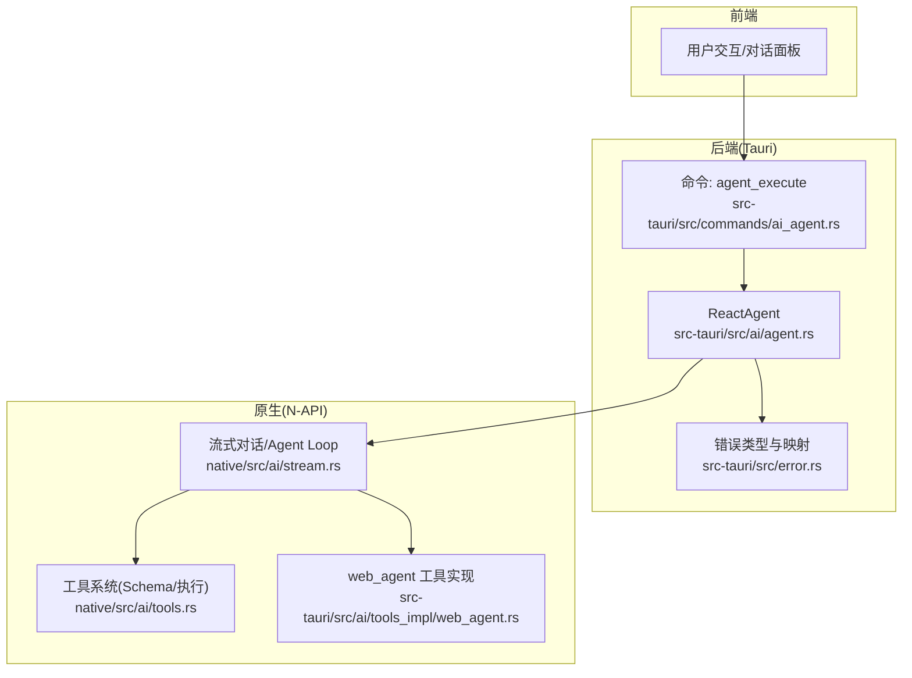
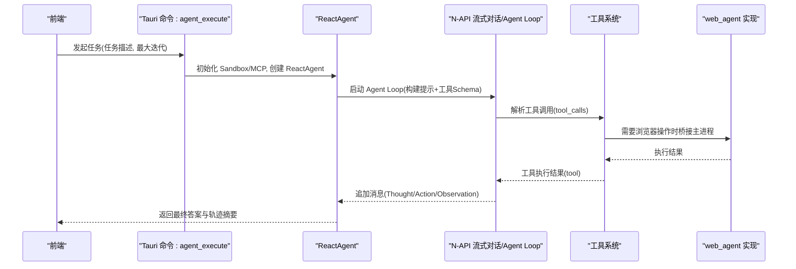
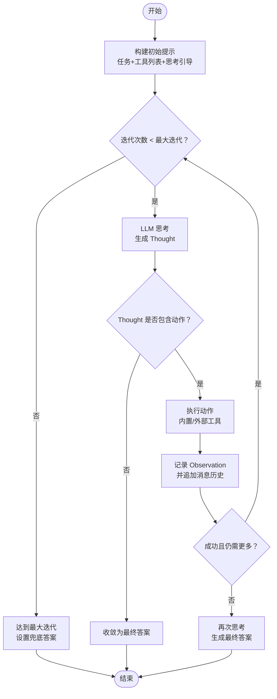
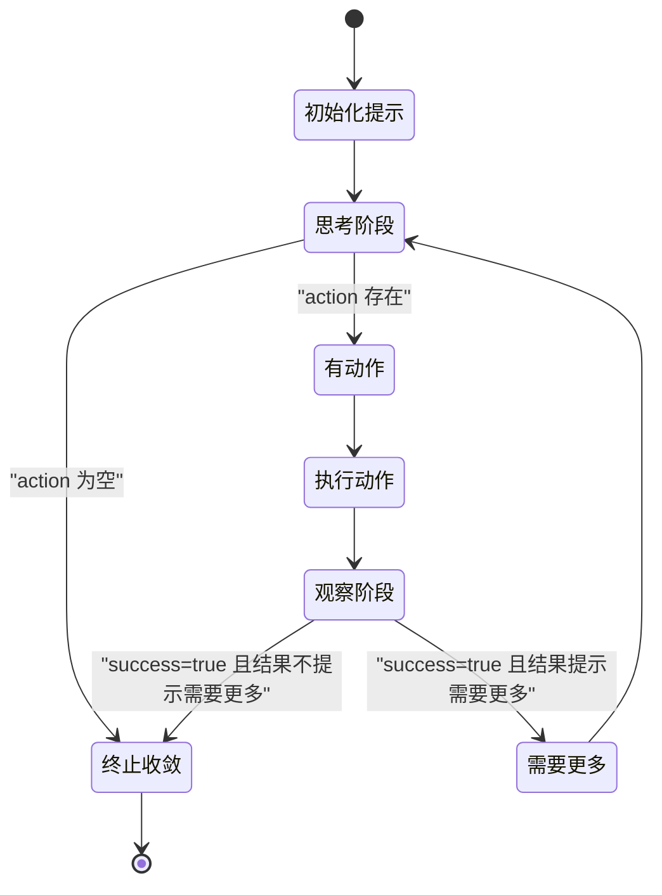
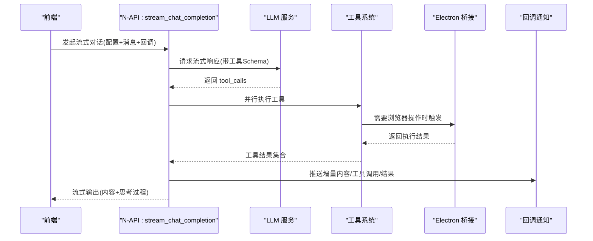
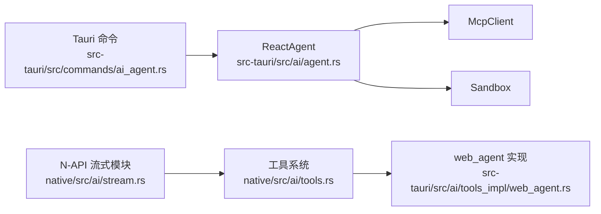

# Agent Loop 核心引擎

<cite>
**本文引用的文件**
- [src-tauri/src/ai/agent.rs](file://src-tauri/src/ai/agent.rs)
- [src-tauri/src/commands/ai_agent.rs](file://src-tauri/src/commands/ai_agent.rs)
- [native/src/ai/stream.rs](file://native/src/ai/stream.rs)
- [native/src/ai/tools.rs](file://native/src/ai/tools.rs)
- [src-tauri/src/ai/tools_impl/web_agent.rs](file://src-tauri/src/ai/tools_impl/web_agent.rs)
- [src-tauri/src/error.rs](file://src-tauri/src/error.rs)
- [README.md](file://README.md)
- [agent.md](file://agent.md)
- [docs/THINKING_FIELD_ANALYSIS.md](file://docs/THINKING_FIELD_ANALYSIS.md)
- [docs/AGENT_DYNAMIC_TOOLS.md](file://docs/AGENT_DYNAMIC_TOOLS.md)
- [examples/echo-skill.md](file://examples/echo-skill.md)
</cite>

## 目录
1. [简介](#简介)
2. [项目结构](#项目结构)
3. [核心组件](#核心组件)
4. [架构总览](#架构总览)
5. [详细组件分析](#详细组件分析)
6. [依赖关系分析](#依赖关系分析)
7. [性能考量](#性能考量)
8. [故障排查指南](#故障排查指南)
9. [结论](#结论)
10. [附录](#附录)

## 简介
本文件面向 CoSurf 的 Agent Loop 核心引擎，系统性阐述 ReAct（推理 + 行动）模式的实现原理与工程实践，覆盖以下主题：
- 思维步骤（Thought）、动作（Action）、观察结果（Observation）的数据结构设计与职责边界
- AgentLoop 的执行流程：初始化提示构建、迭代执行机制、最大迭代次数控制、终止条件
- AgentTrace 的作用与数据采集机制（轨迹记录、最终答案）
- 错误处理与异常策略（统一错误类型、错误码映射、回调通知）
- 如何扩展新的思维模式与动作类型（工具 Schema、工具执行、MCP/Skills 集成）
- AgentLoop 状态转换图与执行序列图
- 具体代码示例路径指引（以“章节来源”标注）

## 项目结构
CoSurf 的 Agent Loop 在后端 Rust 层实现，前端通过 Tauri 命令触发；同时提供原生模块（N-API）能力，使 Electron 主进程可直接调用流式对话与 Agent 执行。

图表来源
- [src-tauri/src/commands/ai_agent.rs:34-71](file://src-tauri/src/commands/ai_agent.rs#L34-L71)
- [src-tauri/src/ai/agent.rs:72-139](file://src-tauri/src/ai/agent.rs#L72-L139)
- [native/src/ai/stream.rs:125-288](file://native/src/ai/stream.rs#L125-L288)
- [native/src/ai/tools.rs:166-184](file://native/src/ai/tools.rs#L166-L184)
- [src-tauri/src/ai/tools_impl/web_agent.rs:13-49](file://src-tauri/src/ai/tools_impl/web_agent.rs#L13-L49)

章节来源
- [src-tauri/src/commands/ai_agent.rs:34-71](file://src-tauri/src/commands/ai_agent.rs#L34-L71)
- [src-tauri/src/ai/agent.rs:72-139](file://src-tauri/src/ai/agent.rs#L72-L139)
- [native/src/ai/stream.rs:125-288](file://native/src/ai/stream.rs#L125-L288)
- [native/src/ai/tools.rs:166-184](file://native/src/ai/tools.rs#L166-L184)
- [src-tauri/src/ai/tools_impl/web_agent.rs:13-49](file://src-tauri/src/ai/tools_impl/web_agent.rs#L13-L49)

## 核心组件
- 数据结构
  - Thought：包含推理内容与可选的动作决策
  - Action：包含工具名称与参数（JSON）
  - Observation：包含执行结果与成功标记
  - AgentTrace：记录整个执行轨迹（thoughts、observations、final_answer）
- 执行引擎
  - ReactAgent.run：构建初始提示、循环思考-行动-观察、终止条件判断、最终答案收敛
- 工具系统
  - 内置工具 Schema 与执行（summarize_page、web_agent、open_url、web_search、run_command 等）
  - 通过 N-API 桥接 Electron 主进程执行浏览器相关动作
- 错误处理
  - 统一 AppError 枚举与错误码映射，便于前端展示与定位

章节来源
- [src-tauri/src/ai/agent.rs:11-38](file://src-tauri/src/ai/agent.rs#L11-L38)
- [src-tauri/src/ai/agent.rs:72-139](file://src-tauri/src/ai/agent.rs#L72-L139)
- [native/src/ai/tools.rs:24-163](file://native/src/ai/tools.rs#L24-L163)
- [src-tauri/src/error.rs:4-64](file://src-tauri/src/error.rs#L4-L64)

## 架构总览
ReAct Agent Loop 在后端以“思考-行动-观察”的闭环执行，结合工具 Schema 与并行工具执行，形成可扩展的智能代理框架。前端通过 Tauri 命令发起任务，后端负责初始化环境、构建提示、驱动循环、汇总轨迹。

图表来源
- [src-tauri/src/commands/ai_agent.rs:34-71](file://src-tauri/src/commands/ai_agent.rs#L34-L71)
- [src-tauri/src/ai/agent.rs:72-139](file://src-tauri/src/ai/agent.rs#L72-L139)
- [native/src/ai/stream.rs:125-288](file://native/src/ai/stream.rs#L125-L288)
- [native/src/ai/tools.rs:224-267](file://native/src/ai/tools.rs#L224-L267)
- [src-tauri/src/ai/tools_impl/web_agent.rs:13-49](file://src-tauri/src/ai/tools_impl/web_agent.rs#L13-L49)

## 详细组件分析

### 数据结构设计与职责
- Thought
  - 字段：reasoning（推理内容）、action（可选动作）
  - 用途：承载每轮思考与决策，若 action 为空则视为得出最终答案
- Action
  - 字段：tool_name（工具名）、arguments（JSON 参数）
  - 用途：描述具体要执行的动作及其参数
- Observation
  - 字段：result（结果文本）、success（是否成功）
  - 用途：记录动作执行后的反馈，决定是否继续迭代
- AgentTrace
  - 字段：thoughts、observations、final_answer
  - 用途：完整记录 Agent 的执行轨迹与最终结论，便于调试与审计

章节来源
- [src-tauri/src/ai/agent.rs:11-38](file://src-tauri/src/ai/agent.rs#L11-L38)

### AgentLoop 执行流程
- 初始化提示构建
  - 将任务描述与可用工具列表拼接为系统提示
  - 追加“Let's think step by step.”引导
- 迭代执行机制
  - 思考阶段：调用 LLM 生成 Thought（reasoning + action）
  - 行动阶段：根据 action.tool_name 调用内置工具或 MCP 工具
  - 观察阶段：记录 Observation，并将 Thought/Action/Observation 追加到消息历史
- 终止条件
  - 无动作（action 为空）→ 直接收敛为 final_answer
  - 成功且结果不包含“need more”→ 再次调用 LLM 获取最终答案
  - 达到最大迭代次数→ 设置兜底 final_answer
- AgentTrace 数据收集
  - 每轮将 Thought 与 Observation 追加到轨迹中，最终答案写入 final_answer

图表来源
- [src-tauri/src/ai/agent.rs:82-139](file://src-tauri/src/ai/agent.rs#L82-L139)

章节来源
- [src-tauri/src/ai/agent.rs:82-139](file://src-tauri/src/ai/agent.rs#L82-L139)

### AgentTrace 的作用与数据收集机制
- 作用
  - 记录每轮思考（reasoning）、动作（tool_name+arguments）与观察（result+success）
  - 保存最终答案（final_answer），便于前端展示与后续分析
- 数据来源
  - Thought：由 llm_think 生成并追加
  - Observation：由 execute_action 生成并追加
  - final_answer：在无动作或满足终止条件时写入

章节来源
- [src-tauri/src/ai/agent.rs:34-38](file://src-tauri/src/ai/agent.rs#L34-L38)
- [src-tauri/src/ai/agent.rs:100-129](file://src-tauri/src/ai/agent.rs#L100-L129)

### 错误处理与异常策略
- 统一错误类型
  - AppError：涵盖数据库、HTTP、JSON、Tauri、AI Provider、配置、未找到、内部错误等
  - 错误码映射：将 AppError 映射为前端可读的 ErrorResponse（code/message）
- 异常传播
  - 命令层（Tauri）捕获错误并返回统一格式
  - 原生流式模块（N-API）通过回调通知前端错误
- 典型场景
  - 工具执行失败：返回 Observation(success=false) 并记录错误信息
  - 超时/循环检测：在流式 Agent Loop 中注入“强制停止”提示，必要时中断

章节来源
- [src-tauri/src/error.rs:4-64](file://src-tauri/src/error.rs#L4-L64)
- [src-tauri/src/commands/ai_agent.rs:34-71](file://src-tauri/src/commands/ai_agent.rs#L34-L71)
- [native/src/ai/stream.rs:169-203](file://native/src/ai/stream.rs#L169-L203)

### 扩展新的思维模式与动作类型
- 新增工具 Schema（内置）
  - 在工具枚举中新增枚举项，提供 name/description/parameters
  - 通过 to_openai_schema 生成函数调用格式
  - 在 get_builtin_tools_schemas 中注册
  - 示例参考：run_command、web_search、open_url、summarize_page 等
- 新增工具执行（内置）
  - 在 execute_builtin_tool 中新增分支，解析 arguments 并执行
  - 对需要浏览器操作的工具，返回“需要 Electron 桥接”的标记，交由主进程处理
- 新增工具执行（外部/浏览器）
  - web_agent 工具实现：从 AppState 获取活跃标签页 ID，调用现有页面上下文命令执行
  - 示例参考：[src-tauri/src/ai/tools_impl/web_agent.rs:13-49](file://src-tauri/src/ai/tools_impl/web_agent.rs#L13-L49)
- 新增工具（Skills/MCP）
  - 通过 Skills 系统导入 Markdown 技能，或通过 MCP 客户端动态发现工具
  - 流式 Agent Loop 会合并内置、Skills 与 MCP 的工具 Schema
  - 示例参考：[examples/echo-skill.md](file://examples/echo-skill.md)，[docs/AGENT_DYNAMIC_TOOLS.md](file://docs/AGENT_DYNAMIC_TOOLS.md)

章节来源
- [native/src/ai/tools.rs:24-163](file://native/src/ai/tools.rs#L24-L163)
- [native/src/ai/tools.rs:166-184](file://native/src/ai/tools.rs#L166-L184)
- [native/src/ai/tools.rs:224-267](file://native/src/ai/tools.rs#L224-L267)
- [src-tauri/src/ai/tools_impl/web_agent.rs:13-49](file://src-tauri/src/ai/tools_impl/web_agent.rs#L13-L49)
- [examples/echo-skill.md:18-24](file://examples/echo-skill.md#L18-L24)
- [docs/AGENT_DYNAMIC_TOOLS.md:369-437](file://docs/AGENT_DYNAMIC_TOOLS.md#L369-L437)

### AgentLoop 状态转换图

图表来源
- [src-tauri/src/ai/agent.rs:99-131](file://src-tauri/src/ai/agent.rs#L99-L131)

### 执行序列图（流式 Agent Loop）

图表来源
- [native/src/ai/stream.rs:125-288](file://native/src/ai/stream.rs#L125-L288)
- [native/src/ai/tools.rs:224-267](file://native/src/ai/tools.rs#L224-L267)

## 依赖关系分析
- 组件耦合
  - ReactAgent 依赖 McpClient（外部工具）、Sandbox（本地能力）
  - 命令层（Tauri）负责初始化与编排，降低业务逻辑对 UI 的耦合
  - 原生模块（N-API）提供跨进程桥接与流式能力
- 外部依赖
  - 工具 Schema 来源于内置、Skills、MCP 三类来源
  - 浏览器自动化依赖 Electron 主进程与页面上下文命令

图表来源
- [src-tauri/src/ai/agent.rs:56-69](file://src-tauri/src/ai/agent.rs#L56-L69)
- [src-tauri/src/commands/ai_agent.rs:34-71](file://src-tauri/src/commands/ai_agent.rs#L34-L71)
- [native/src/ai/stream.rs:125-288](file://native/src/ai/stream.rs#L125-L288)
- [native/src/ai/tools.rs:166-184](file://native/src/ai/tools.rs#L166-L184)
- [src-tauri/src/ai/tools_impl/web_agent.rs:13-49](file://src-tauri/src/ai/tools_impl/web_agent.rs#L13-L49)

章节来源
- [src-tauri/src/ai/agent.rs:56-69](file://src-tauri/src/ai/agent.rs#L56-L69)
- [src-tauri/src/commands/ai_agent.rs:34-71](file://src-tauri/src/commands/ai_agent.rs#L34-L71)
- [native/src/ai/stream.rs:125-288](file://native/src/ai/stream.rs#L125-L288)
- [native/src/ai/tools.rs:166-184](file://native/src/ai/tools.rs#L166-L184)
- [src-tauri/src/ai/tools_impl/web_agent.rs:13-49](file://src-tauri/src/ai/tools_impl/web_agent.rs#L13-L49)

## 性能考量
- 并行工具执行：在流式 Agent Loop 中对多个 tool_calls 并行执行，提升吞吐
- 重复调用检测：连续重复调用时注入“强制停止”提示，避免无效循环
- 最大迭代限制：防止无限循环，保障系统稳定性
- 超时控制：命令执行具备超时保护，避免阻塞

章节来源
- [native/src/ai/stream.rs:163-207](file://native/src/ai/stream.rs#L163-L207)
- [native/src/ai/tools.rs:269-320](file://native/src/ai/tools.rs#L269-L320)
- [docs/AGENT_DYNAMIC_TOOLS.md:369-377](file://docs/AGENT_DYNAMIC_TOOLS.md#L369-L377)

## 故障排查指南
- 思考过程（Thinking）缺失
  - 现象：前端未显示思考过程
  - 原因：模型不支持 reasoning_content 或字段缺失
  - 处理：检查模型支持情况与后端字段保护逻辑
  - 参考：[docs/THINKING_FIELD_ANALYSIS.md](file://docs/THINKING_FIELD_ANALYSIS.md)
- 工具执行失败
  - 现象：Observation.success=false
  - 处理：查看 result 中的错误信息，确认参数与权限
  - 参考：[src-tauri/src/ai/agent.rs:156-228](file://src-tauri/src/ai/agent.rs#L156-L228)
- 循环/超时
  - 现象：Agent 长时间无进展
  - 处理：启用重复调用检测与强制停止提示；增加超时阈值
  - 参考：[native/src/ai/stream.rs:169-203](file://native/src/ai/stream.rs#L169-L203)
- 错误码映射
  - 现象：前端收到统一错误对象
  - 处理：依据 code/message 定位问题类型
  - 参考：[src-tauri/src/error.rs:47-61](file://src-tauri/src/error.rs#L47-L61)

章节来源
- [docs/THINKING_FIELD_ANALYSIS.md:264-278](file://docs/THINKING_FIELD_ANALYSIS.md#L264-L278)
- [src-tauri/src/ai/agent.rs:156-228](file://src-tauri/src/ai/agent.rs#L156-L228)
- [native/src/ai/stream.rs:169-203](file://native/src/ai/stream.rs#L169-L203)
- [src-tauri/src/error.rs:47-61](file://src-tauri/src/error.rs#L47-L61)

## 结论
CoSurf 的 Agent Loop 以 ReAct 模式为核心，结合工具 Schema 与并行执行，实现了可扩展、可观测、可诊断的智能代理引擎。通过统一的数据结构、清晰的执行流程与完善的错误处理机制，开发者可以快速扩展新的动作类型与思维模式，满足多样化的自动化需求。

## 附录
- Agent Loop 工作原理（示例）
  - 参考：[README.md:483-515](file://README.md#L483-L515)
- Agent 工具实现状态
  - 参考：[docs/AGENT_DYNAMIC_TOOLS.md](file://docs/AGENT_DYNAMIC_TOOLS.md)
- 思考过程字段分析
  - 参考：[docs/THINKING_FIELD_ANALYSIS.md](file://docs/THINKING_FIELD_ANALYSIS.md)
- Agent 相关说明与状态管理
  - 参考：[agent.md](file://agent.md)