# Agent Loop 检查点机制

<cite>
**本文档引用的文件**
- [checkpoint.rs](file://native/src/ai/checkpoint.rs)
- [stream.rs](file://native/src/ai/stream.rs)
- [tools.rs](file://native/src/ai/tools.rs)
- [context_manager.rs](file://native/src/ai/context_manager.rs)
- [scheduler.rs](file://native/src/ai/scheduler.rs)
- [agent.rs](file://native/src/ai/agent.rs)
- [error.rs](file://native/src/error.rs)
- [db/mod.rs](file://native/src/db/mod.rs)
- [agent.md](file://native/prompts/agent.md)
- [main.ts](file://electron/main.ts)
- [ipc-handlers.ts](file://electron/ipc-handlers.ts)
- [verify_checkpoint.ps1](file://scripts/verify_checkpoint.ps1)
- [check.ps1](file://scripts/check.ps1)
- [CHECKPOINT_VERIFICATION.md](file://docs/CHECKPOINT_VERIFICATION.md)
</cite>

## 更新摘要
**变更内容**
- 新增完整的检查点验证基础设施，包括 PowerShell 验证脚本和验证文档
- 增强了系统可靠性与调试能力
- 添加了详细的检查点验证流程和故障排除指南

## 目录
1. [简介](#简介)
2. [项目结构](#项目结构)
3. [核心组件](#核心组件)
4. [架构概览](#架构概览)
5. [详细组件分析](#详细组件分析)
6. [检查点验证基础设施](#检查点验证基础设施)
7. [依赖关系分析](#依赖关系分析)
8. [性能考虑](#性能考虑)
9. [故障排除指南](#故障排除指南)
10. [结论](#结论)

## 简介

Agent Loop 检查点机制是 CoSurf 项目中实现 AI Agent 智能循环的核心功能。该机制通过创建和管理检查点来实现以下关键能力：

- **状态持久化**：保存 Agent Loop 中间状态，包括消息历史、工具执行结果和文件变更
- **智能回滚**：在出现错误或异常时能够回滚到稳定的检查点状态
- **容错恢复**：通过检查点机制提高系统的鲁棒性和可靠性
- **增量记录**：只记录变化的部分，减少存储开销

该机制特别适用于需要长时间运行的 AI 代理任务，如网页内容分析、自动化操作和复杂的数据处理流程。

**新增** 完整的检查点验证基础设施，包括 PowerShell 脚本和验证文档，显著增强了系统的可靠性与调试能力。

## 项目结构

CoSurf 项目采用模块化的 Rust + Electron 架构，Agent Loop 检查点机制主要分布在以下模块中：

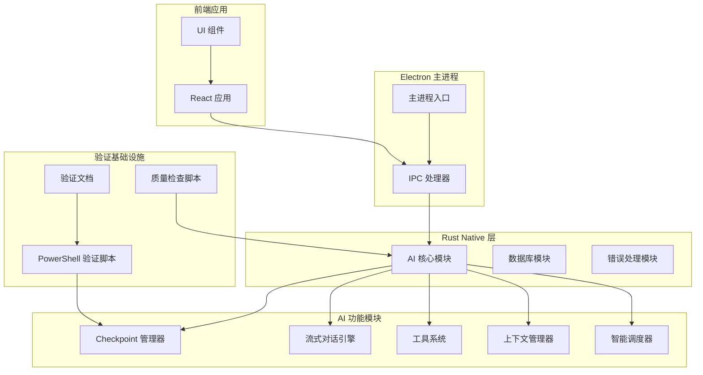

**图表来源**
- [main.ts:1-200](file://electron/main.ts#L1-L200)
- [ipc-handlers.ts:1-200](file://electron/ipc-handlers.ts#L1-L200)
- [checkpoint.rs:1-714](file://native/src/ai/checkpoint.rs#L1-L714)
- [verify_checkpoint.ps1:1-130](file://scripts/verify_checkpoint.ps1#L1-L130)

**章节来源**
- [main.ts:1-200](file://electron/main.ts#L1-L200)
- [ipc-handlers.ts:1-200](file://electron/ipc-handlers.ts#L1-L200)

## 核心组件

### Checkpoint 管理器

Checkpoint 管理器是检查点机制的核心组件，负责：

- **检查点创建**：保存 Agent Loop 的中间状态
- **状态恢复**：回滚到指定的检查点
- **数据清理**：自动清理过期的检查点和备份文件
- **文件变更跟踪**：监控和回滚文件系统变更

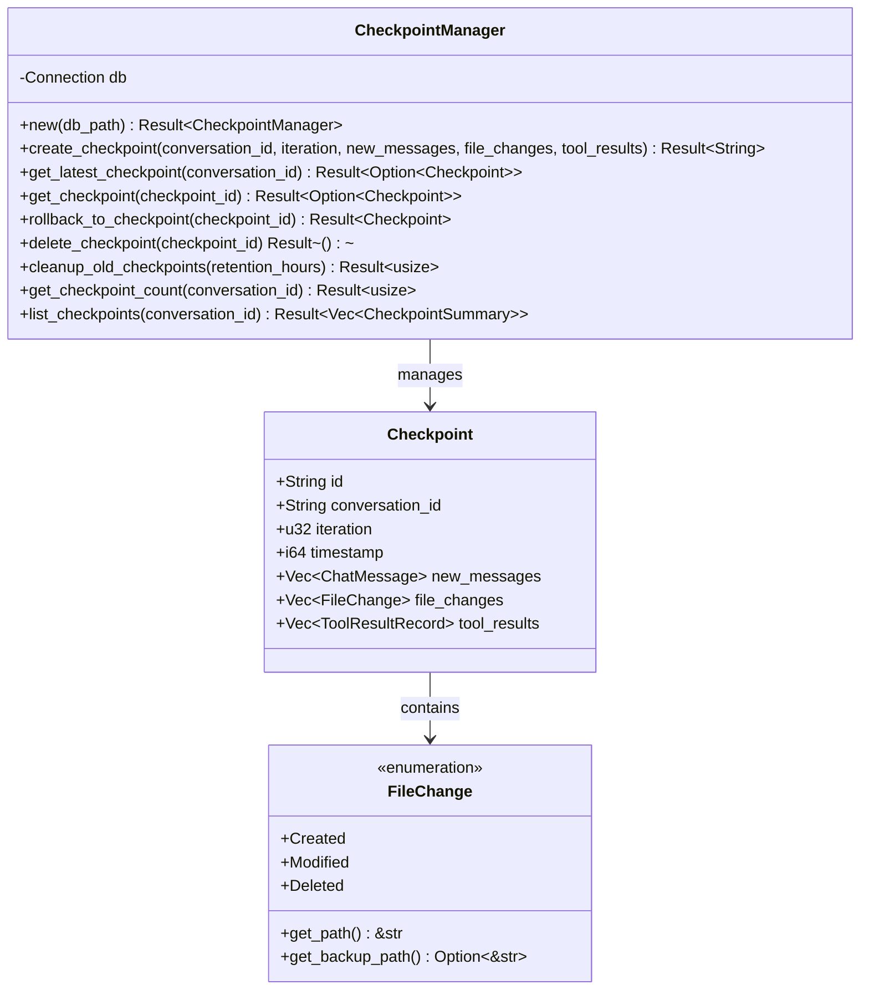

**图表来源**
- [checkpoint.rs:96-301](file://native/src/ai/checkpoint.rs#L96-L301)
- [checkpoint.rs:17-94](file://native/src/ai/checkpoint.rs#L17-L94)

### 流式对话引擎

流式对话引擎负责执行 Agent Loop，并集成检查点机制：

- **迭代控制**：管理 Agent Loop 的执行次数和状态
- **工具执行**：并行执行工具调用
- **状态监控**：检测重复调用和连续失败
- **回滚触发**：在异常情况下触发检查点回滚

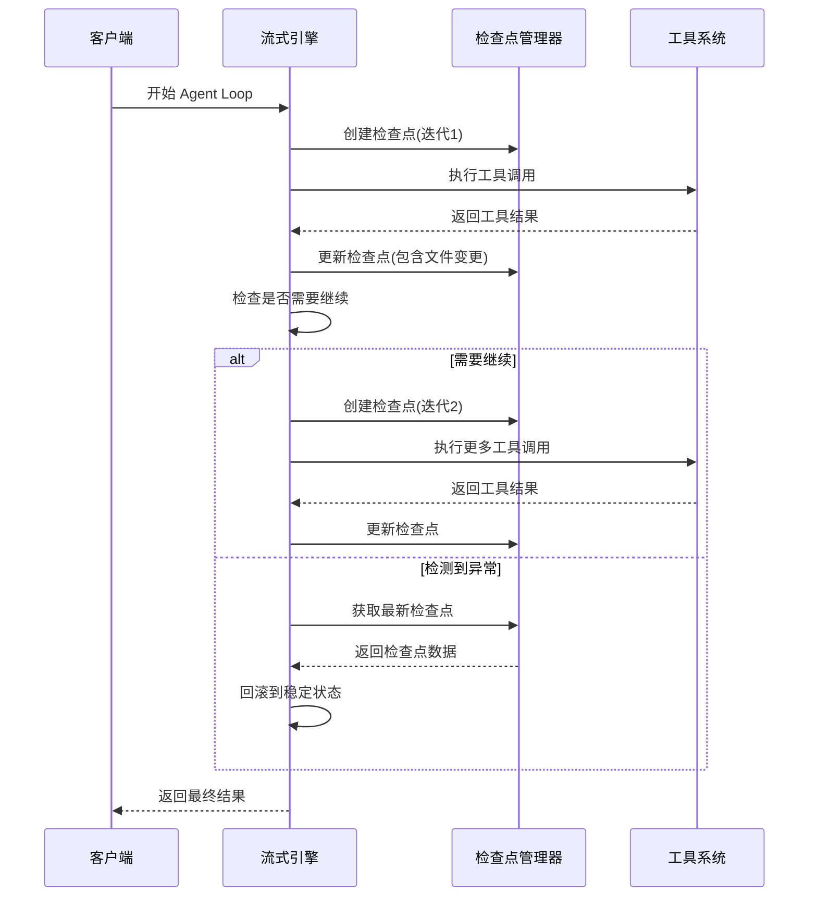

**图表来源**
- [stream.rs:125-426](file://native/src/ai/stream.rs#L125-L426)
- [checkpoint.rs:138-181](file://native/src/ai/checkpoint.rs#L138-L181)

**章节来源**
- [checkpoint.rs:1-714](file://native/src/ai/checkpoint.rs#L1-L714)
- [stream.rs:1-800](file://native/src/ai/stream.rs#L1-L800)

## 架构概览

Agent Loop 检查点机制的整体架构如下：

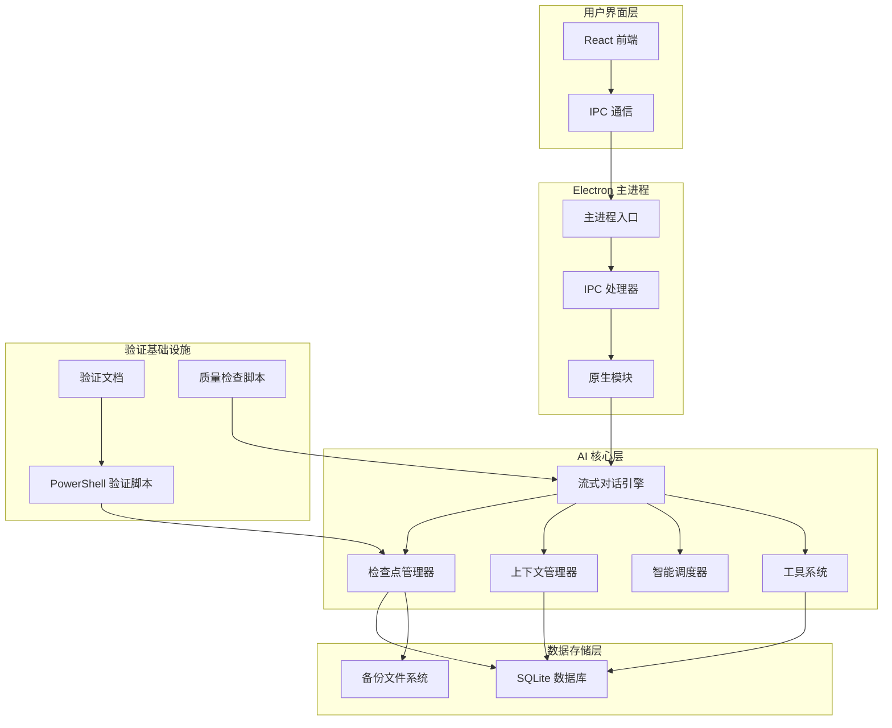

**图表来源**
- [main.ts:1-200](file://electron/main.ts#L1-L200)
- [ipc-handlers.ts:1-200](file://electron/ipc-handlers.ts#L1-L200)
- [stream.rs:125-426](file://native/src/ai/stream.rs#L125-L426)
- [verify_checkpoint.ps1:1-130](file://scripts/verify_checkpoint.ps1#L1-L130)

## 详细组件分析

### 检查点数据结构

检查点机制的核心数据结构设计精巧，能够有效保存 Agent Loop 的中间状态：

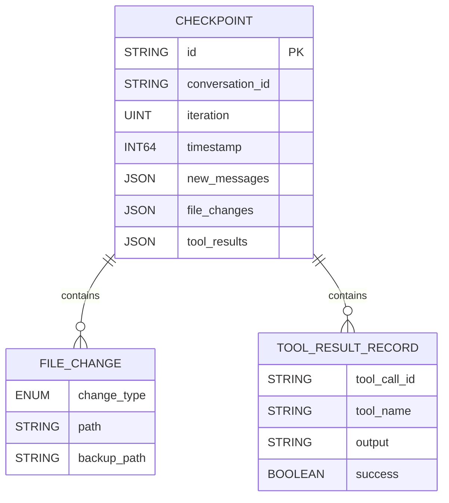

**图表来源**
- [checkpoint.rs:17-94](file://native/src/ai/checkpoint.rs#L17-L94)

检查点数据结构的关键特性：

1. **增量记录**：只保存新增的消息和变更，避免重复存储
2. **序列化存储**：使用 JSON 格式便于持久化和传输
3. **时间戳追踪**：精确记录检查点创建时间
4. **文件变更跟踪**：完整记录文件系统变更历史

### 文件变更管理系统

文件变更管理系统提供了完整的文件备份和回滚能力：

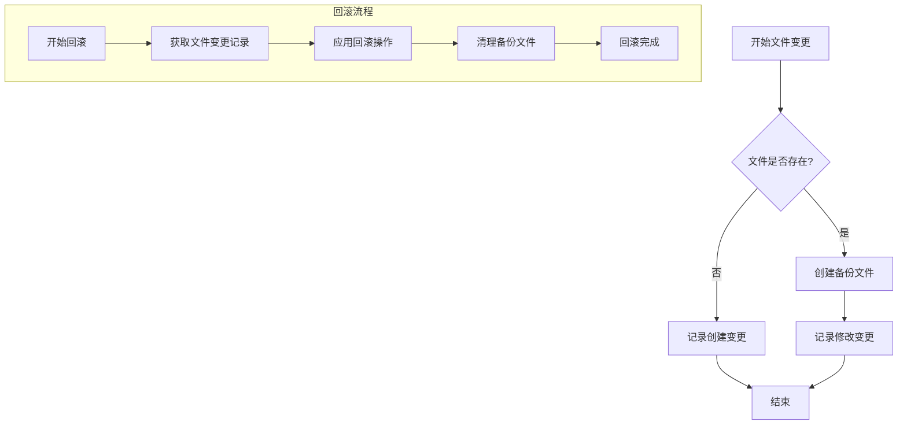

**图表来源**
- [checkpoint.rs:307-395](file://native/src/ai/checkpoint.rs#L307-L395)

文件变更管理的关键功能：

- **智能备份**：只对存在的文件进行备份
- **多种变更类型**：支持创建、修改、删除三种文件变更
- **批量回滚**：支持同时回滚多个文件变更
- **备份清理**：自动清理过期的备份文件

### Agent Loop 执行流程

Agent Loop 的执行流程集成了检查点机制，实现了智能的状态管理和容错恢复：

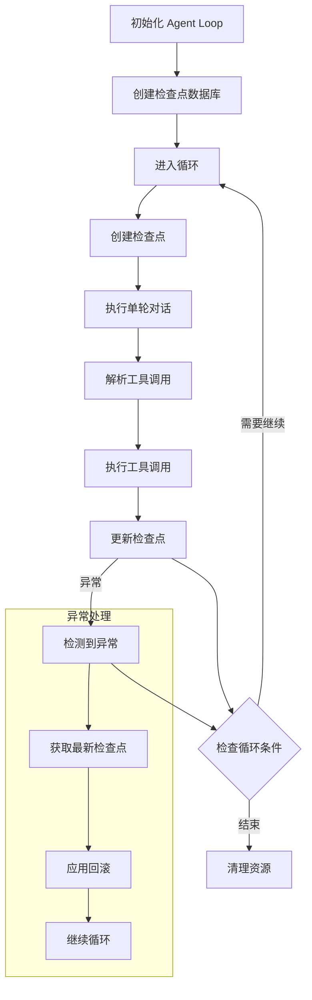

**图表来源**
- [stream.rs:154-399](file://native/src/ai/stream.rs#L154-L399)

Agent Loop 的关键特性：

- **迭代控制**：最多执行 30 次迭代，防止无限循环
- **重复检测**：检测连续重复的工具调用并发出警告
- **强制停止**：当检测到 3 次连续重复时强制停止
- **智能回滚**：在连续失败时自动回滚到稳定状态

### 上下文管理器

上下文管理器与检查点机制协同工作，确保 Agent Loop 的状态完整性：

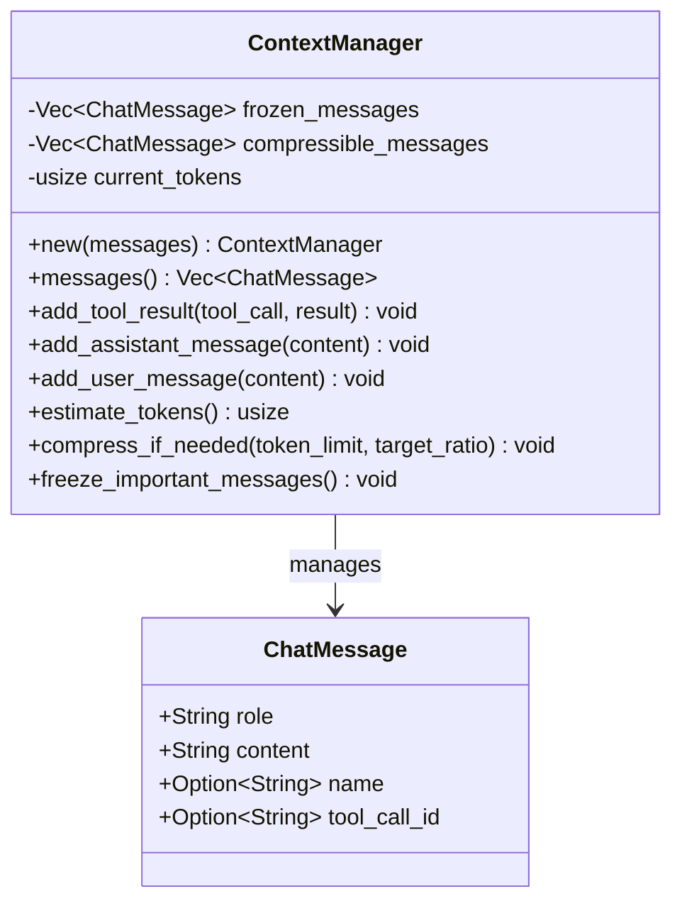

**图表来源**
- [context_manager.rs:10-247](file://native/src/ai/context_manager.rs#L10-L247)

上下文管理器的功能特性：

- **消息冻结**：保护重要的系统消息和用户原始问题
- **智能压缩**：在 Token 预算不足时自动压缩上下文
- **动态冻结**：将重要的工具结果移动到冻结区
- **Token 估算**：准确估算上下文的 Token 数量

**章节来源**
- [context_manager.rs:1-288](file://native/src/ai/context_manager.rs#L1-L288)
- [stream.rs:740-800](file://native/src/ai/stream.rs#L740-L800)

## 检查点验证基础设施

**新增** 检查点验证基础设施是本次更新的核心内容，提供了完整的检查点机制验证和调试能力。

### PowerShell 验证脚本

PowerShell 验证脚本提供了自动化检查点状态的能力：

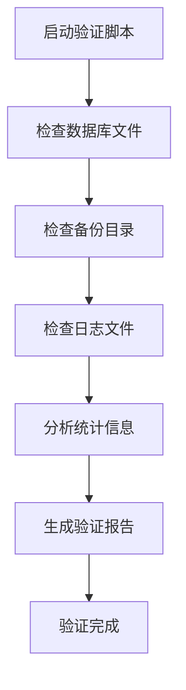

**图表来源**
- [verify_checkpoint.ps1:1-130](file://scripts/verify_checkpoint.ps1#L1-L130)

验证脚本的主要功能：

1. **数据库文件检查**：扫描 `%APPDATA%\cosurf\cosurf-data` 目录下的所有检查点数据库
2. **备份文件检查**：验证 `%TEMP%\cosurf-checkpoint-backups` 目录中的备份文件
3. **日志分析**：搜索并统计关键日志条目，如检查点创建、文件备份、清理操作等
4. **状态报告**：提供详细的验证结果和诊断建议

### 验证文档

详细的验证文档提供了完整的使用指南和故障排除方法：

- **使用方法**：逐步指导如何运行验证脚本
- **预期结果**：定义正常工作状态的判断标准
- **异常诊断**：提供常见问题的识别和解决方法
- **调试技巧**：包含启用详细日志和手动触发检查点的方法

### 质量检查脚本

质量检查脚本确保代码质量和一致性：

- **TypeScript 类型检查**：验证前端代码类型安全性
- **ESLint 检查**：检查代码风格和潜在问题
- **Rust Clippy 检查**：确保 Rust 代码符合最佳实践

**章节来源**
- [verify_checkpoint.ps1:1-130](file://scripts/verify_checkpoint.ps1#L1-L130)
- [CHECKPOINT_VERIFICATION.md:1-294](file://docs/CHECKPOINT_VERIFICATION.md#L1-L294)
- [check.ps1:1-17](file://scripts/check.ps1#L1-L17)

## 依赖关系分析

Agent Loop 检查点机制涉及多个模块之间的复杂依赖关系：

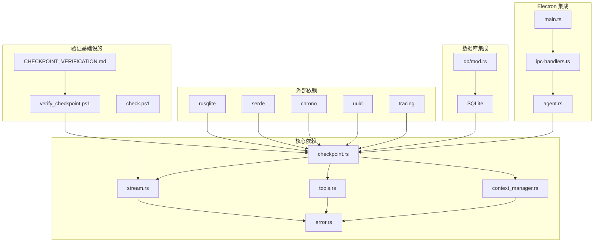

**图表来源**
- [checkpoint.rs:8-15](file://native/src/ai/checkpoint.rs#L8-L15)
- [stream.rs:16-19](file://native/src/ai/stream.rs#L16-L19)
- [main.ts:95-115](file://electron/main.ts#L95-L115)
- [verify_checkpoint.ps1:1-130](file://scripts/verify_checkpoint.ps1#L1-L130)

依赖关系的关键特点：

- **模块化设计**：各组件职责明确，耦合度低
- **错误传播**：统一的错误处理机制
- **异步支持**：充分利用 Rust 的异步特性
- **类型安全**：严格的类型检查确保运行时安全
- **验证集成**：检查点机制与验证基础设施无缝集成

**章节来源**
- [checkpoint.rs:1-714](file://native/src/ai/checkpoint.rs#L1-L714)
- [stream.rs:1-800](file://native/src/ai/stream.rs#L1-L800)
- [main.ts:95-115](file://electron/main.ts#L95-L115)

## 性能考虑

Agent Loop 检查点机制在设计时充分考虑了性能因素：

### 存储优化

- **增量存储**：只保存变化的部分，减少存储空间占用
- **索引优化**：为查询建立适当的数据库索引
- **序列化优化**：使用高效的 JSON 序列化格式

### 内存管理

- **分页存储**：避免一次性加载大量检查点数据
- **智能清理**：定期清理过期的检查点和备份文件
- **内存映射**：对于大型文件使用内存映射技术

### 并发处理

- **异步操作**：所有 I/O 操作都是异步的
- **线程安全**：使用适当的同步机制保证线程安全
- **资源池**：复用数据库连接和文件句柄

### 验证性能优化

**新增** 验证基础设施也考虑了性能因素：

- **选择性检查**：验证脚本只检查必要的文件和目录
- **缓存机制**：避免重复的文件系统访问
- **并发验证**：支持并行验证多个检查点数据库

## 故障排除指南

### 常见问题及解决方案

#### 检查点创建失败

**症状**：Agent Loop 执行时报错，无法创建检查点

**可能原因**：
- 数据库文件权限问题
- 磁盘空间不足
- 文件路径无效

**解决步骤**：
1. 检查数据库文件权限
2. 确认磁盘空间充足
3. 验证文件路径有效性

#### 回滚失败

**症状**：系统尝试回滚但失败

**可能原因**：
- 备份文件丢失
- 文件权限不足
- 文件已被其他进程占用

**解决步骤**：
1. 检查备份文件是否存在
2. 确认文件权限设置正确
3. 关闭占用文件的进程

#### 性能问题

**症状**：Agent Loop 执行缓慢

**可能原因**：
- 检查点数量过多
- 数据库查询性能问题
- 文件系统 I/O 瓶颈

**解决步骤**：
1. 清理过期的检查点
2. 优化数据库查询
3. 检查文件系统性能

#### 验证脚本问题

**新增** 验证脚本相关的故障排除：

**症状**：验证脚本无法正常运行

**可能原因**：
- PowerShell 执行策略限制
- 缺少必要的依赖（如 sqlite3）
- 权限不足访问系统目录

**解决步骤**：
1. 运行 `Set-ExecutionPolicy -ExecutionPolicy Bypass -Scope CurrentUser`
2. 确认 sqlite3 命令可用（可选）
3. 以管理员权限运行验证脚本

### 检查点验证流程

**新增** 详细的检查点验证流程：

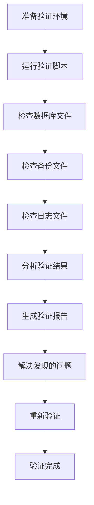

**图表来源**
- [verify_checkpoint.ps1:1-130](file://scripts/verify_checkpoint.ps1#L1-L130)
- [CHECKPOINT_VERIFICATION.md:205-245](file://docs/CHECKPOINT_VERIFICATION.md#L205-L245)

**章节来源**
- [error.rs:1-37](file://native/src/error.rs#L1-L37)
- [checkpoint.rs:254-269](file://native/src/ai/checkpoint.rs#L254-L269)
- [verify_checkpoint.ps1:1-130](file://scripts/verify_checkpoint.ps1#L1-L130)
- [CHECKPOINT_VERIFICATION.md:246-282](file://docs/CHECKPOINT_VERIFICATION.md#L246-L282)

## 结论

Agent Loop 检查点机制是 CoSurf 项目中的关键创新，它通过以下方式提升了系统的可靠性和用户体验：

### 技术优势

1. **高可靠性**：通过检查点机制实现了智能容错和自动恢复
2. **高效性**：增量存储和智能清理机制减少了资源消耗
3. **可扩展性**：模块化设计支持功能扩展和性能优化
4. **易用性**：透明的检查点管理，无需用户干预
5. **可验证性**：完整的验证基础设施确保机制正确性

### 应用价值

- **复杂任务执行**：支持长时间运行的 AI 代理任务
- **容错处理**：在出现异常时能够自动恢复到稳定状态
- **状态追踪**：完整记录 Agent Loop 的执行历史
- **调试支持**：为开发者提供详细的执行状态信息
- **质量保证**：通过验证脚本确保系统稳定性

### 未来发展方向

1. **分布式支持**：支持多节点部署和状态同步
2. **性能优化**：进一步提升检查点创建和恢复的性能
3. **监控增强**：增加更详细的性能指标和监控功能
4. **配置管理**：提供更灵活的检查点策略配置选项
5. **自动化验证**：集成到 CI/CD 流程中进行自动化测试

**新增** 检查点验证基础设施的加入，使得该机制不仅具备强大的功能，还具备了完善的质量保障体系，是 CoSurf 项目的重要技术亮点。