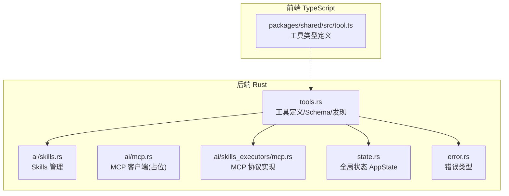
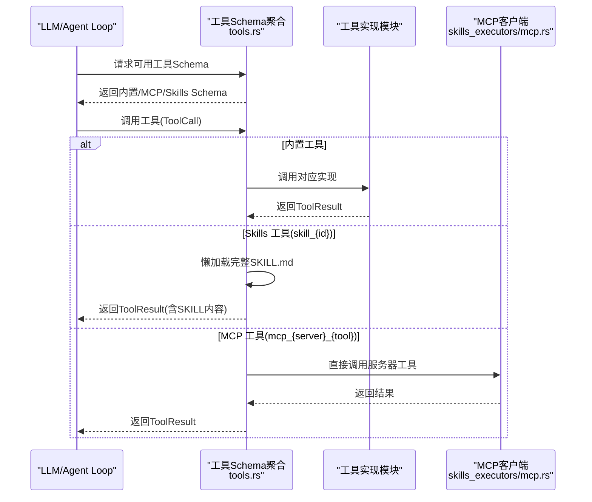
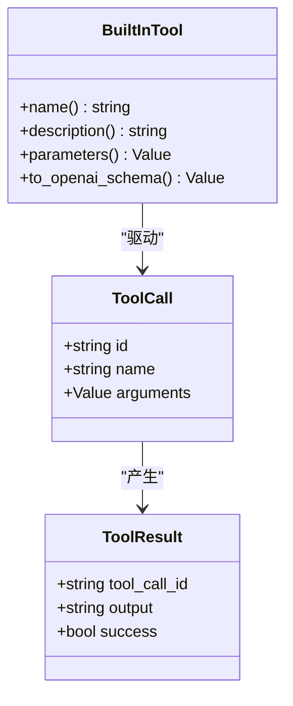
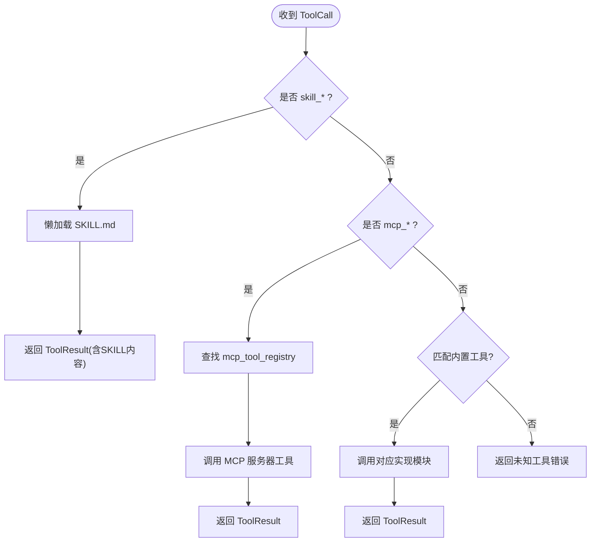
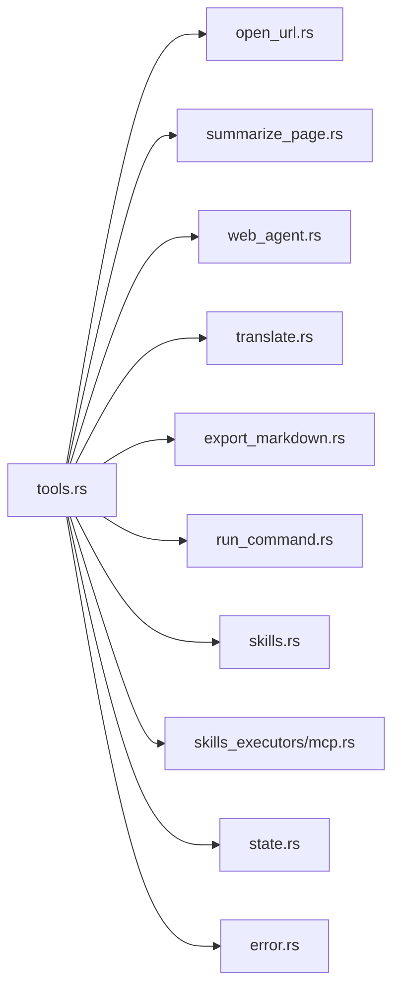

# 工具调度器

<cite>
**本文引用的文件**
- [tools.rs](file://src-tauri/src/ai/tools.rs)
- [skills.rs](file://src-tauri/src/ai/skills.rs)
- [mcp.rs](file://src-tauri/src/ai/mcp.rs)
- [skills_executors/mcp.rs](file://src-tauri/src/ai/skills_executors/mcp.rs)
- [state.rs](file://src-tauri/src/state.rs)
- [error.rs](file://src-tauri/src/error.rs)
- [tool.ts](file://packages/shared/src/tool.ts)
</cite>

## 更新摘要
**所做更改**
- 移除了 IQS API Key 相关的 WebSearch 工具实现
- 简化了工具分类系统，移除了 search 类别
- 更新了内置工具枚举，移除了 web_search 工具
- 调整了前端工具定义，移除了 web-search 工具配置

## 目录
1. [简介](#简介)
2. [项目结构](#项目结构)
3. [核心组件](#核心组件)
4. [架构总览](#架构总览)
5. [详细组件分析](#详细组件分析)
6. [依赖关系分析](#依赖关系分析)
7. [性能考量](#性能考量)
8. [故障排查指南](#故障排查指南)
9. [结论](#结论)
10. [附录](#附录)

## 简介
本文件面向 CoSurf 工具调度器，系统性阐述工具路由与分发机制的设计与实现，涵盖工具注册、路由匹配、参数解析、执行分发、上下文管理与状态维护、错误处理与超时控制、资源管理以及与 MCP 协议的集成方式。文档同时给出内置工具与外部工具（Skills、MCP）的统一接口设计，包括工具 schema 定义、参数验证、返回值标准化等，并提供扩展与注册新工具的实践指引。

**重要更新**：本次更新反映了 IQS API Key 相关的 WebSearch 工具已被移除，工具分类系统得到简化，移除了专门的搜索类别。

## 项目结构
围绕工具调度器的关键目录与文件如下：
- Rust 后端（src-tauri）：
  - 工具定义与统一 schema：tools.rs
  - Skills 管理：ai/skills.rs
  - MCP 客户端与协议实现：ai/mcp.rs、ai/skills_executors/mcp.rs
  - 全局状态：state.rs
  - 错误类型：error.rs
- TypeScript 前端共享类型：packages/shared/src/tool.ts

图表来源
- [tools.rs:1-585](file://src-tauri/src/ai/tools.rs#L1-L585)
- [skills.rs:1-567](file://src-tauri/src/ai/skills.rs#L1-L567)
- [mcp.rs:1-151](file://src-tauri/src/ai/mcp.rs#L1-L151)
- [skills_executors/mcp.rs:1-555](file://src-tauri/src/ai/skills_executors/mcp.rs#L1-L555)
- [state.rs:1-77](file://src-tauri/src/state.rs#L1-L77)
- [error.rs:1-64](file://src-tauri/src/error.rs#L1-L64)
- [tool.ts:1-88](file://packages/shared/src/tool.ts#L1-L88)

## 核心组件
- 工具定义与 Schema
  - ToolCall/ToolResult：统一的工具调用与结果结构。
  - BuiltInTool：内置工具枚举，提供 name/description/parameters/to_openai_schema。
  - 工具 Schema 发现：同步（内置）与异步（内置+Skills+MCP）聚合。
- 工具分发器
  - execute：根据工具名路由到具体实现；支持 skill_* 与 mcp_* 前缀。
- 内置工具实现
  - open_url、summarize_page、web_agent、run_command、translate、export_markdown。
- Skills 管理
  - 渐进式加载：仅解析 frontmatter，调用时懒加载完整内容。
- MCP 集成
  - 支持 Streamable HTTP 与 SSE 传输，JSON-RPC 2.0 协议。
- 全局状态与错误
  - AppState：数据库、活跃标签页、Skills 管理器、MCP 注册表、最近打开 URL 等。
  - AppError：统一错误类型与序列化。

**更新**：移除了 web_search 工具，简化了工具分类系统。

## 架构总览
工具调度器采用"统一 Schema + 分发器 + 多来源实现"的架构：
- 工具注册：内置工具直接注册；Skills 仅暴露简短描述；MCP 工具动态拉取并注册。
- 路由匹配：分发器按前缀与名称匹配，分别委派至内置实现、Skills 懒加载或 MCP 客户端。
- 上下文与状态：通过 AppState 管理活跃标签页、最近打开 URL、MCP 注册表等。
- 错误与超时：各工具实现内置超时与安全检查；统一错误类型向上抛出。

图表来源
- [tools.rs:162-189](file://src-tauri/src/ai/tools.rs#L162-L189)
- [tools.rs:174-236](file://src-tauri/src/ai/tools.rs#L174-L236)
- [skills_executors/mcp.rs:200-246](file://src-tauri/src/ai/skills_executors/mcp.rs#L200-L246)

## 详细组件分析

### 工具定义与 Schema 设计
- 统一数据结构
  - ToolCall：包含 id、name、arguments。
  - ToolResult：包含 tool_call_id、output、success。
- 内置工具枚举 BuiltInTool
  - 提供 name/description/parameters/to_openai_schema，便于与 LLM 对接。
  - 参数 schema 使用 JSON Schema，包含必填字段、枚举、数值范围等约束。
- Schema 聚合
  - 同步：仅内置工具。
  - 异步：内置 + Skills（仅暴露 description）+ MCP（动态拉取 tools/list）。

**更新**：移除了 web_search 工具，内置工具现在包括 summarize_page、web_agent、open_url、translate、export_markdown、run_command。

图表来源
- [tools.rs:4-160](file://src-tauri/src/ai/tools.rs#L4-L160)

**章节来源**
- [tools.rs:1-585](file://src-tauri/src/ai/tools.rs#L1-L585)

### 工具分发器与路由匹配
- 路由逻辑
  - skill_*：调用 execute_skill_tool，懒加载完整 SKILL.md。
  - mcp_*：通过 mcp_tool_registry 查找服务器与原始工具名，直接调用 MCP。
  - 内置工具：按名称匹配 open_url/summarize_page/web_agent/translate/export_markdown/run_command。
- 上下文与状态
  - 通过 AppState 访问数据库、Skills 管理器、MCP 注册表等。
- 错误处理
  - 未知工具返回错误；MCP 未注册或服务器不可达返回友好提示。

**更新**：移除了 web_search 工具的路由分支，简化了内置工具匹配逻辑。

图表来源
- [tools.rs:162-189](file://src-tauri/src/ai/tools.rs#L162-L189)
- [tools.rs:174-236](file://src-tauri/src/ai/tools.rs#L174-L236)

**章节来源**
- [tools.rs:1-585](file://src-tauri/src/ai/tools.rs#L1-L585)
- [state.rs:19-22](file://src-tauri/src/state.rs#L19-L22)

### 内置工具实现要点

#### open_url 工具
- 参数解析：校验 URL 必填且以 http/https 开头。
- 去重控制：最近 5 秒内相同 URL 不重复打开。
- 前后端交互：通过事件创建新标签页，等待前端返回新标签页 ID 并设为活跃。
- 超时与错误：前端响应超时（15 秒）时返回错误；主窗体缺失时报错。

**章节来源**
- [tools.rs:93-104](file://src-tauri/src/ai/tools.rs#L93-L104)

#### summarize_page 工具
- 混合提取策略：iframe -> Playwright -> HTTP fallback。
- 前端交互：通过事件请求页面 URL 与内容，设置合理超时。
- AI 总结：构建系统提示词与用户消息，调用模型 API 获取总结。
- 错误提示：针对跨域/反爬场景提供友好引导。

**章节来源**
- [tools.rs:61-71](file://src-tauri/src/ai/tools.rs#L61-L71)

#### web_agent 工具
- 参数解析：action、selector、value（可选）。
- 执行：调用现有页面上下文命令执行网页自动化操作。
- 错误处理：无活跃标签页时返回错误。

**章节来源**
- [tools.rs:72-92](file://src-tauri/src/ai/tools.rs#L72-L92)

#### translate 工具
- 参数解析：target_language（目标语言）。
- 功能：翻译当前页面内容为指定语言。
- 错误处理：语言代码无效时返回错误。

**章节来源**
- [tools.rs:105-116](file://src-tauri/src/ai/tools.rs#L105-L116)

#### export_markdown 工具
- 功能：将当前页面内容导出为 Markdown 格式。
- 实现：调用现有的 Markdown 导出功能。

**章节来源**
- [tools.rs:117-122](file://src-tauri/src/ai/tools.rs#L117-L122)

#### run_command 工具
- 参数解析：command、working_dir、timeout。
- 安全检查：黑名单拦截危险命令（大小写无关）。
- 执行与超时：使用 tokio::process::Command，超时强制终止。
- 输出截断：stdout/stderr 截断，避免过长文本影响性能与稳定性。
- 返回值：组合 stdout/stderr/exit_code，success=0 表示成功。

**章节来源**
- [tools.rs:123-147](file://src-tauri/src/ai/tools.rs#L123-L147)

### Skills 管理与渐进式加载
- 目录结构：skills/{skill-id}/SKILL.md（frontmatter 为 name/description/enabled/tags）。
- 初始加载：仅解析 frontmatter，不加载正文，降低启动成本。
- 懒加载：调用 skill_{id} 时读取完整 SKILL.md 内容作为 ToolResult 返回。
- 导入/导出：支持从目录或 Markdown 导入，更新 enabled 字段到文件。
- 示例同步：启动时将 examples/skills 同步到用户目录，保证示例可用。

**章节来源**
- [skills.rs:1-567](file://src-tauri/src/ai/skills.rs#L1-L567)

### MCP 协议集成
- 客户端能力
  - Streamable HTTP 与 SSE 两种传输模式，JSON-RPC 2.0。
  - 支持 initialize/initialized 生命周期与 tools/list/tools/call 方法。
- 工具发现与注册
  - Agent Loop 启动时连接 MCP 服务器，拉取 tools/list，将每个工具注册为独立 function（命名 mcp_{server}_{tool}），并建立 registry 映射。
- 工具调用
  - 直接调用对应服务器工具，arguments 透传，结果标准化为 ToolResult。
- 错误处理
  - 服务器错误、SSE 超时、JSON 解析失败等均转换为 AppError。

**章节来源**
- [skills_executors/mcp.rs:168-246](file://src-tauri/src/ai/skills_executors/mcp.rs#L168-L246)
- [tools.rs:238-377](file://src-tauri/src/ai/tools.rs#L238-L377)

### 前端工具类型定义
- ToolDefinition/ToolConfigField：描述工具的元信息、分类、图标、启用状态与配置 schema。
- 工具分类：webpage、knowledge、search、custom 四个类别。
- 与后端工具 Schema 的映射关系：前端用于 UI 展示与配置，后端用于 LLM 推荐与调用。

**更新**：移除了 web-search 工具的配置，简化了工具分类系统。

**章节来源**
- [tool.ts:1-88](file://packages/shared/src/tool.ts#L1-L88)

## 依赖关系分析
- 组件耦合
  - tools.rs 与 tools_impl/*：通过名称与参数解耦，便于扩展新工具。
  - dispatcher.rs 与各实现模块：仅通过名称匹配，低耦合高内聚。
  - skills.rs 与 tools.rs：仅在工具 Schema 聚合阶段交互。
  - skills_executors/mcp.rs 与 tools.rs：在工具发现阶段交互，后续通过分发器直连。
- 外部依赖
  - reqwest：HTTP 请求（MCP）。
  - tokio：异步运行时（超时、进程执行、事件等待）。
  - tracing：日志与可观测性。
- 循环依赖
  - 未见循环依赖；各模块职责清晰。

**更新**：移除了 web_search.rs 依赖，简化了工具实现模块。

图表来源
- [tools.rs:1-585](file://src-tauri/src/ai/tools.rs#L1-L585)
- [skills.rs:1-567](file://src-tauri/src/ai/skills.rs#L1-L567)
- [skills_executors/mcp.rs:1-555](file://src-tauri/src/ai/skills_executors/mcp.rs#L1-L555)
- [state.rs:1-77](file://src-tauri/src/state.rs#L1-L77)
- [error.rs:1-64](file://src-tauri/src/error.rs#L1-L64)

## 性能考量
- 懒加载与渐进式加载
  - Skills 仅解析 frontmatter，调用时再加载正文，降低冷启动成本。
- 超时与资源限制
  - open_url/summarize_page 等关键流程设置超时，避免阻塞。
  - run_command 设置超时与输出截断，防止资源耗尽。
- 并发与锁
  - AppState 使用 Mutex 保护共享状态；注意避免长时间持有锁。
- I/O 优化
  - 多种内容提取策略（iframe/Playwright/HTTP）按成功率与性能权衡。

## 故障排查指南
- 工具未找到
  - 检查工具名是否正确；确认是否为 skill_* 或 mcp_* 前缀。
  - 若为 MCP 工具，确认服务器已连接且工具已注册。
- MCP 服务器问题
  - 检查服务器 URL、传输模式（Streamable HTTP/SSE）、认证头。
  - 关注初始化与 tools/list 拉取超时与错误。
- open_url 重复请求
  - 系统内置 5 秒去重，避免重复打开同一 URL。
- summarize_page 内容为空
  - 可能为跨域/反爬限制；建议使用系统浏览器复制内容或改用 web_agent。
- run_command 安全拦截
  - 命令包含黑名单关键字将被拦截；请调整命令或使用更安全的方式。
- 错误类型
  - 使用 AppError 统一错误码与消息，便于前端展示与日志定位。

**更新**：移除了 web_search 工具相关的故障排查项。

**章节来源**
- [error.rs:1-64](file://src-tauri/src/error.rs#L1-L64)
- [tools.rs:93-104](file://src-tauri/src/ai/tools.rs#L93-L104)
- [tools.rs:61-71](file://src-tauri/src/ai/tools.rs#L61-L71)
- [tools.rs:123-147](file://src-tauri/src/ai/tools.rs#L123-L147)
- [skills_executors/mcp.rs:168-198](file://src-tauri/src/ai/skills_executors/mcp.rs#L168-L198)

## 结论
CoSurf 工具调度器通过统一的工具定义与 Schema、灵活的分发器路由、渐进式加载与 MCP 动态发现，实现了内置工具、Skills 与外部 MCP 工具的统一接口。配合完善的错误处理、超时控制与资源管理，系统在易扩展的同时保证了可靠性与用户体验。

**更新**：本次更新移除了 IQS API Key 相关的 WebSearch 工具，简化了工具分类系统，使整体架构更加简洁高效。未来可进一步完善 MCP 占位客户端、增强工具权限控制与审计日志。

## 附录

### 如何注册新的内置工具
- 在 BuiltInTool 中新增枚举项，并实现 name/description/parameters/to_openai_schema。
- 在 tools.rs 的 get_available_tools_schemas/get_available_tools_schemas_async 中注册新工具 Schema。
- 在对应工具目录实现 execute 函数，遵循 ToolCall/ToolResult 规范。

**更新**：移除了 web_search 工具的注册步骤，简化了内置工具注册流程。

**章节来源**
- [tools.rs:19-160](file://src-tauri/src/ai/tools.rs#L19-L160)

### 如何扩展现有工具（以 translate 为例）
- 在 tools.rs 的 BuiltInTool::parameters 中完善 JSON Schema。
- 在 tools.rs 的 BuiltInTool::to_openai_schema 中更新描述与参数。
- 在 tools.rs 的 get_available_tools_schemas/get_available_tools_schemas_async 中同步更新。

**章节来源**
- [tools.rs:105-116](file://src-tauri/src/ai/tools.rs#L105-L116)

### 工具执行上下文与状态维护
- 全局状态 AppState：活跃标签页、Skills 管理器、MCP 注册表、最近打开 URL 等。
- 分发器在执行前锁定所需状态，完成后释放，避免长时间占用。

**章节来源**
- [state.rs:9-77](file://src-tauri/src/state.rs#L9-L77)

### 工具分类系统简化说明
- 新的工具分类：webpage、knowledge、custom 三个类别。
- 移除了专门的 search 类别，将搜索功能整合到 webpage 类别中。
- 前端工具定义相应更新，移除了 web-search 工具配置。

**章节来源**
- [tool.ts:1-88](file://packages/shared/src/tool.ts#L1-L88)