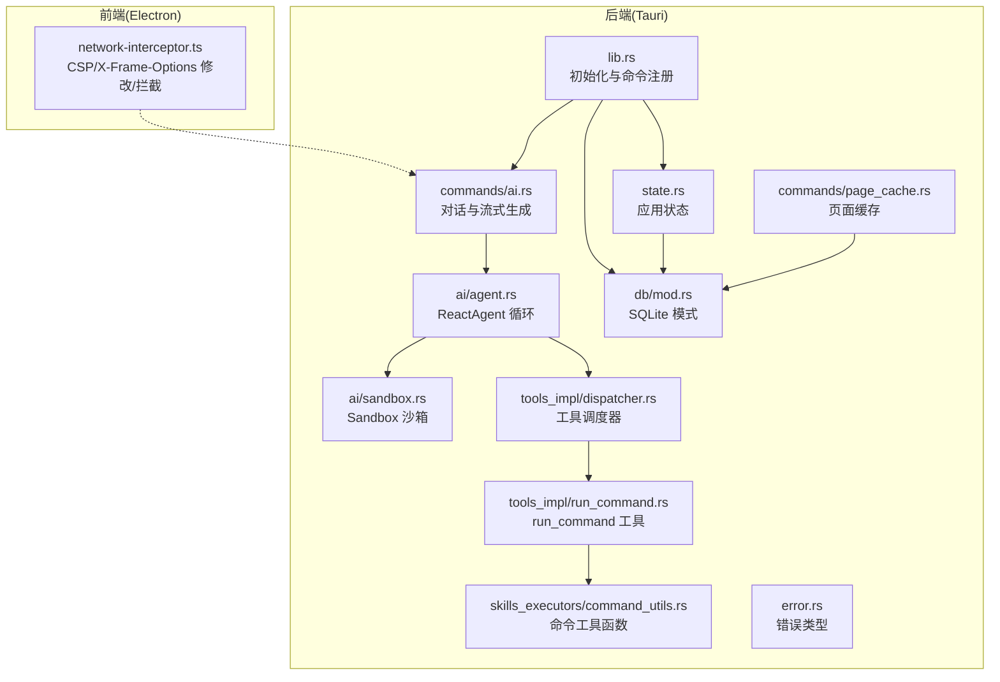
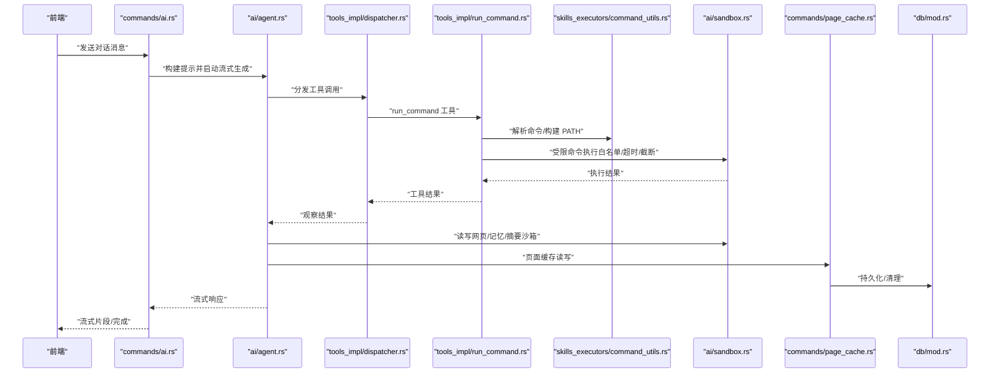
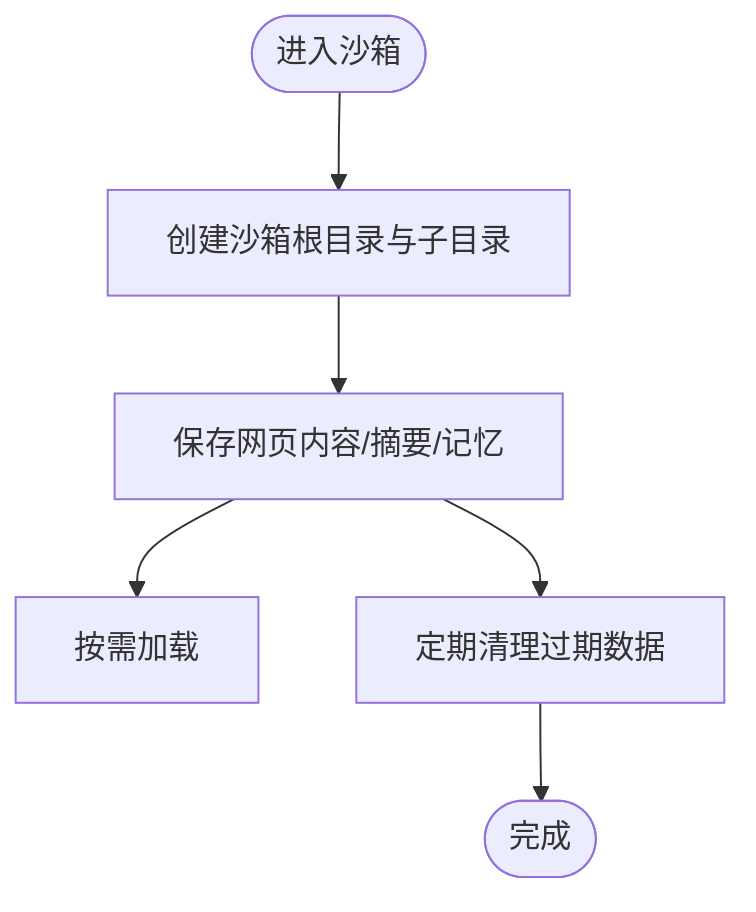
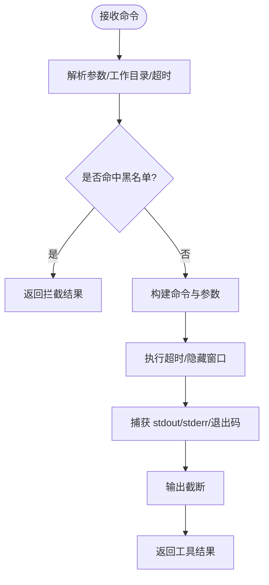
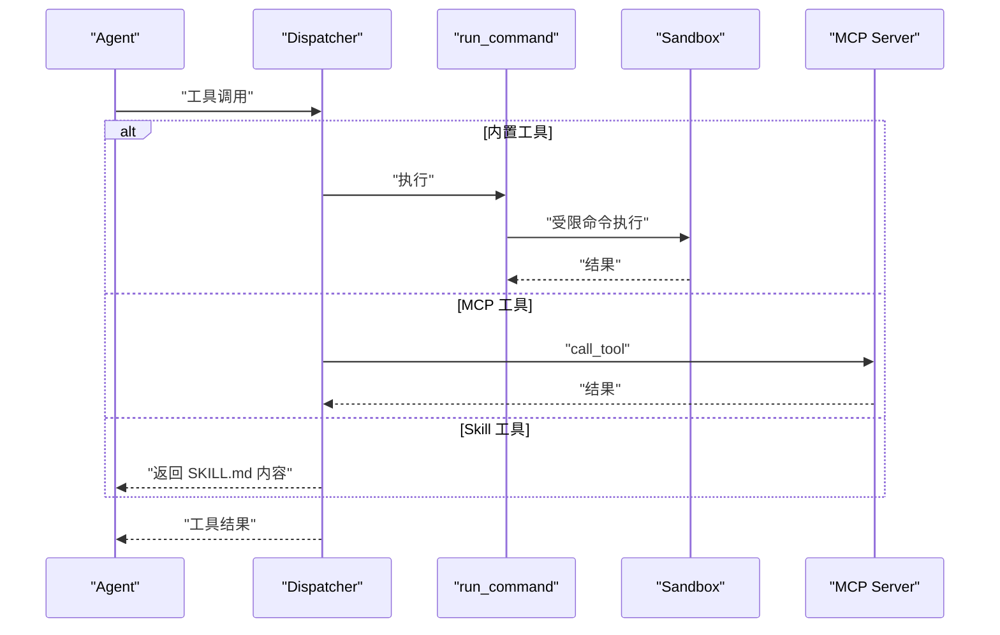
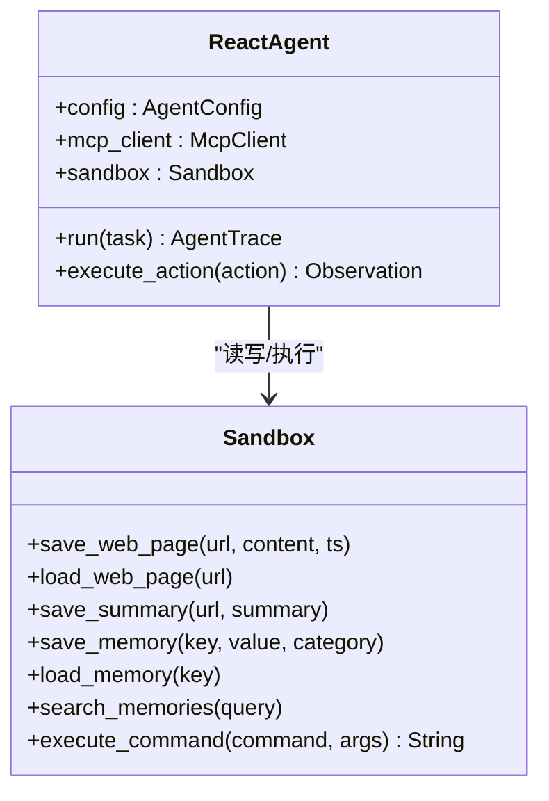
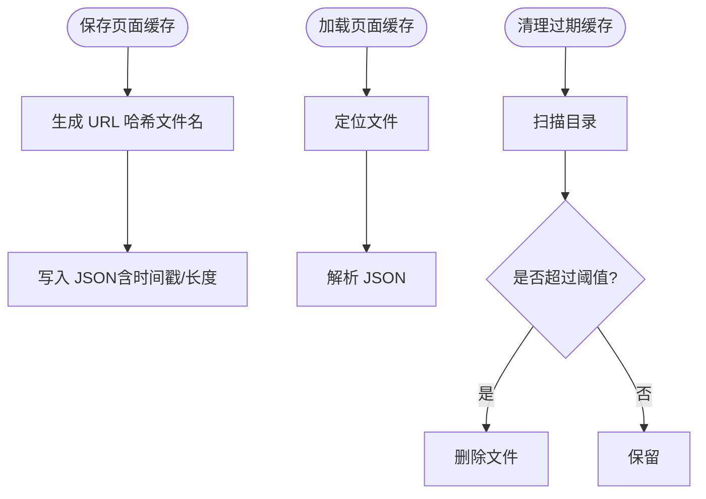
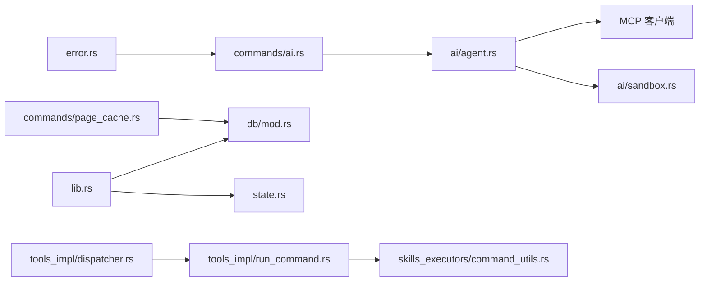

# 沙箱安全执行

<cite>
**本文引用的文件**
- [src-tauri/src/ai/sandbox.rs](file://src-tauri/src/ai/sandbox.rs)
- [src-tauri/src/ai/tools_impl/run_command.rs](file://src-tauri/src/ai/tools_impl/run_command.rs)
- [src-tauri/src/ai/tools_impl/dispatcher.rs](file://src-tauri/src/ai/tools_impl/dispatcher.rs)
- [src-tauri/src/ai/skills_executors/command_utils.rs](file://src-tauri/src/ai/skills_executors/command_utils.rs)
- [src-tauri/src/ai/agent.rs](file://src-tauri/src/ai/agent.rs)
- [src-tauri/src/commands/ai.rs](file://src-tauri/src/commands/ai.rs)
- [src-tauri/src/commands/page_cache.rs](file://src-tauri/src/commands/page_cache.rs)
- [src-tauri/src/db/mod.rs](file://src-tauri/src/db/mod.rs)
- [src-tauri/src/error.rs](file://src-tauri/src/error.rs)
- [src-tauri/src/state.rs](file://src-tauri/src/state.rs)
- [src-tauri/src/lib.rs](file://src-tauri/src/lib.rs)
- [electron/network-interceptor.ts](file://electron/network-interceptor.ts)
- [docs/SKILLS_ENGINE_REFACTORING.md](file://docs/SKILLS_ENGINE_REFACTORING.md)
- [SUMMARIZE_PAGE_OPTIMIZATION.md](file://SUMMARIZE_PAGE_OPTIMIZATION.md)
</cite>

## 目录
1. [引言](#引言)
2. [项目结构](#项目结构)
3. [核心组件](#核心组件)
4. [架构总览](#架构总览)
5. [详细组件分析](#详细组件分析)
6. [依赖关系分析](#依赖关系分析)
7. [性能考量](#性能考量)
8. [故障排查指南](#故障排查指南)
9. [结论](#结论)
10. [附录](#附录)

## 引言
本文件面向 CoSurf 的“沙箱安全执行”目标，系统化梳理后端 Rust 模块中的沙箱机制、命令执行安全策略、工具调度与监控、以及与外部工具的安全边界设计。重点覆盖：
- 进程隔离与资源限制：命令执行白名单、超时与输出截断、隐藏窗口等
- 文件系统保护：沙箱根目录与专用子目录、URL 安全命名、缓存持久化与清理
- 网络访问控制：Electron 层面的 CSP/X-Frame-Options 修改与拦截策略
- 安全审计与异常检测：日志、重复调用检测、错误统一映射
- 性能优化与资源管理：缓存、清理策略、并发与超时控制

## 项目结构
CoSurf 的沙箱与安全相关能力主要集中在 Tauri 后端（Rust）与 Electron 网络拦截层：
- Tauri 后端
  - 沙箱与工具：ai/sandbox.rs、tools_impl/run_command.rs、skills_executors/command_utils.rs、tools_impl/dispatcher.rs、ai/agent.rs
  - 命令入口与流式对话：commands/ai.rs
  - 页面缓存：commands/page_cache.rs
  - 数据库与状态：db/mod.rs、state.rs、lib.rs
  - 错误类型：error.rs
- Electron 网络拦截：electron/network-interceptor.ts
- 文档与优化参考：docs/SKILLS_ENGINE_REFACTORING.md、SUMMARIZE_PAGE_OPTIMIZATION.md

图表来源
- [src-tauri/src/ai/agent.rs:55-69](file://src-tauri/src/ai/agent.rs#L55-L69)
- [src-tauri/src/ai/sandbox.rs:48-51](file://src-tauri/src/ai/sandbox.rs#L48-L51)
- [src-tauri/src/ai/tools_impl/dispatcher.rs:14-55](file://src-tauri/src/ai/tools_impl/dispatcher.rs#L14-L55)
- [src-tauri/src/ai/tools_impl/run_command.rs:35-150](file://src-tauri/src/ai/tools_impl/run_command.rs#L35-L150)
- [src-tauri/src/ai/skills_executors/command_utils.rs:5-95](file://src-tauri/src/ai/skills_executors/command_utils.rs#L5-L95)
- [src-tauri/src/commands/ai.rs:16-274](file://src-tauri/src/commands/ai.rs#L16-L274)
- [src-tauri/src/commands/page_cache.rs:1-275](file://src-tauri/src/commands/page_cache.rs#L1-L275)
- [src-tauri/src/db/mod.rs:11-272](file://src-tauri/src/db/mod.rs#L11-L272)
- [src-tauri/src/state.rs:9-81](file://src-tauri/src/state.rs#L9-L81)
- [src-tauri/src/lib.rs:50-217](file://src-tauri/src/lib.rs#L50-L217)
- [src-tauri/src/error.rs:4-64](file://src-tauri/src/error.rs#L4-L64)
- [electron/network-interceptor.ts:40-113](file://electron/network-interceptor.ts#L40-L113)

章节来源
- [src-tauri/src/lib.rs:50-217](file://src-tauri/src/lib.rs#L50-L217)
- [src-tauri/src/state.rs:25-81](file://src-tauri/src/state.rs#L25-L81)
- [src-tauri/src/db/mod.rs:41-148](file://src-tauri/src/db/mod.rs#L41-L148)

## 核心组件
- 沙箱管理器（Sandbox）
  - 提供受限的文件系统空间与数据持久化（网页、摘要、记忆、历史）
  - 提供受控命令执行（白名单、工作目录、输出截断、超时）
- 工具调度器（Tools Dispatcher）
  - 将工具名称路由到具体实现（内置工具与 MCP 工具）
- 命令执行工具（run_command）
  - 跨平台命令执行、超时、输出截断、危险命令拦截
- 命令工具函数（command_utils）
  - 增强 PATH、跨平台命令解析
- React Agent（ai/agent.rs）
  - ReAct 循环，结合沙箱与工具执行
- 页面缓存（commands/page_cache.rs）
  - 基于 URL 的哈希缓存、清理策略
- 数据库与状态（db/mod.rs、state.rs）
  - SQLite 模式与迁移、应用状态与注册表
- 错误类型（error.rs）
  - 统一错误映射与序列化
- 网络拦截（electron/network-interceptor.ts）
  - 移除 CSP/X-Frame-Options、拦截追踪与电商 API 请求

章节来源
- [src-tauri/src/ai/sandbox.rs:12-251](file://src-tauri/src/ai/sandbox.rs#L12-L251)
- [src-tauri/src/ai/tools_impl/dispatcher.rs:14-238](file://src-tauri/src/ai/tools_impl/dispatcher.rs#L14-L238)
- [src-tauri/src/ai/tools_impl/run_command.rs:35-161](file://src-tauri/src/ai/tools_impl/run_command.rs#L35-L161)
- [src-tauri/src/ai/skills_executors/command_utils.rs:5-95](file://src-tauri/src/ai/skills_executors/command_utils.rs#L5-L95)
- [src-tauri/src/ai/agent.rs:55-230](file://src-tauri/src/ai/agent.rs#L55-L230)
- [src-tauri/src/commands/page_cache.rs:1-275](file://src-tauri/src/commands/page_cache.rs#L1-L275)
- [src-tauri/src/db/mod.rs:11-272](file://src-tauri/src/db/mod.rs#L11-L272)
- [src-tauri/src/state.rs:9-81](file://src-tauri/src/state.rs#L9-L81)
- [src-tauri/src/error.rs:4-64](file://src-tauri/src/error.rs#L4-L64)
- [electron/network-interceptor.ts:40-113](file://electron/network-interceptor.ts#L40-L113)

## 架构总览
下图展示了从对话入口到工具执行、再到沙箱与缓存的完整链路，以及与 Electron 网络层的协作。

图表来源
- [src-tauri/src/commands/ai.rs:16-274](file://src-tauri/src/commands/ai.rs#L16-L274)
- [src-tauri/src/ai/agent.rs:71-139](file://src-tauri/src/ai/agent.rs#L71-L139)
- [src-tauri/src/ai/tools_impl/dispatcher.rs:14-55](file://src-tauri/src/ai/tools_impl/dispatcher.rs#L14-L55)
- [src-tauri/src/ai/tools_impl/run_command.rs:35-161](file://src-tauri/src/ai/tools_impl/run_command.rs#L35-L161)
- [src-tauri/src/ai/skills_executors/command_utils.rs:5-95](file://src-tauri/src/ai/skills_executors/command_utils.rs#L5-L95)
- [src-tauri/src/ai/sandbox.rs:215-244](file://src-tauri/src/ai/sandbox.rs#L215-L244)
- [src-tauri/src/commands/page_cache.rs:54-159](file://src-tauri/src/commands/page_cache.rs#L54-L159)
- [src-tauri/src/db/mod.rs:41-148](file://src-tauri/src/db/mod.rs#L41-L148)

## 详细组件分析

### 沙箱机制与安全隔离
- 沙箱根目录与子目录
  - 根目录位于应用数据目录下的 sandbox，包含 web_pages、summaries、memories、history 子目录，用于隔离持久化数据
  - 通过统一的文件命名规则（URL 安全化）避免路径穿越与非法字符
- 受限命令执行
  - 白名单机制：仅允许 ls、cat、echo、pwd、find 等基础命令
  - 工作目录固定在沙箱根目录，避免越权访问
  - 输出截断与超时控制（见 run_command 工具）
- 数据持久化与清理
  - 网页内容、摘要、记忆均以 JSON/MARKDOWN 形式保存，带时间戳
  - 提供过期清理（如网页内容保留 30 天）

图表来源
- [src-tauri/src/ai/sandbox.rs:23-46](file://src-tauri/src/ai/sandbox.rs#L23-L46)
- [src-tauri/src/ai/sandbox.rs:58-119](file://src-tauri/src/ai/sandbox.rs#L58-L119)
- [src-tauri/src/ai/sandbox.rs:121-187](file://src-tauri/src/ai/sandbox.rs#L121-L187)

章节来源
- [src-tauri/src/ai/sandbox.rs:12-251](file://src-tauri/src/ai/sandbox.rs#L12-L251)

### 命令执行沙箱与内存访问控制
- run_command 工具安全策略
  - 超时限制（默认 30 秒）、输出截断（stdout 8000 字符，stderr 4000 字符）
  - 危险命令黑名单（rm -rf /、格式化磁盘、fork bomb 等）
  - 跨平台执行：Windows 使用 cmd /C，类 Unix 使用 sh -c
  - 隐藏窗口（Windows）避免弹窗干扰
- 命令工具函数
  - 构建增强 PATH，包含 nvm/fnm/volta/pnpm 等常见运行时路径
  - Windows 上对内建命令与 .cmd 包装器进行适配

图表来源
- [src-tauri/src/ai/tools_impl/run_command.rs:35-161](file://src-tauri/src/ai/tools_impl/run_command.rs#L35-L161)
- [src-tauri/src/ai/skills_executors/command_utils.rs:5-95](file://src-tauri/src/ai/skills_executors/command_utils.rs#L5-L95)

章节来源
- [src-tauri/src/ai/tools_impl/run_command.rs:16-161](file://src-tauri/src/ai/tools_impl/run_command.rs#L16-L161)
- [src-tauri/src/ai/skills_executors/command_utils.rs:5-95](file://src-tauri/src/ai/skills_executors/command_utils.rs#L5-L95)

### 工具调度与安全边界
- 工具调度器
  - 内置工具：open_url、web_search、summarize_page、web_agent、run_command
  - MCP 工具：通过注册表映射 mcp_{server}_{tool} 到具体服务器与工具
  - Skill 工具：懒加载 SKILL.md 内容，作为后续决策依据
- 安全边界
  - 所有工具调用均经调度器校验与路由
  - MCP 工具调用前进行服务器与工具存在性校验
  - 未知工具返回明确错误，避免未授权调用

图表来源
- [src-tauri/src/ai/tools_impl/dispatcher.rs:14-238](file://src-tauri/src/ai/tools_impl/dispatcher.rs#L14-L238)
- [src-tauri/src/ai/tools_impl/run_command.rs:35-161](file://src-tauri/src/ai/tools_impl/run_command.rs#L35-L161)
- [src-tauri/src/ai/sandbox.rs:215-244](file://src-tauri/src/ai/sandbox.rs#L215-L244)

章节来源
- [src-tauri/src/ai/tools_impl/dispatcher.rs:14-238](file://src-tauri/src/ai/tools_impl/dispatcher.rs#L14-L238)

### React Agent 循环与沙箱交互
- Agent 通过 ReAct 思考-行动-观察循环，结合沙箱读写与工具调用
- 支持加载网页、读取记忆、搜索记忆、执行受限命令
- 与 MCP 工具协同，形成统一的外部能力边界

图表来源
- [src-tauri/src/ai/agent.rs:55-230](file://src-tauri/src/ai/agent.rs#L55-L230)
- [src-tauri/src/ai/sandbox.rs:48-251](file://src-tauri/src/ai/sandbox.rs#L48-L251)

章节来源
- [src-tauri/src/ai/agent.rs:55-230](file://src-tauri/src/ai/agent.rs#L55-L230)

### 页面缓存与资源管理
- 基于 URL 的 SHA256 哈希生成文件名，避免冲突与路径注入
- 保存时记录时间戳与内容长度；加载时计算年龄
- 提供清理过期缓存（默认 24 小时）功能
- 通过 Tauri 命令暴露保存/加载/清理接口

图表来源
- [src-tauri/src/commands/page_cache.rs:46-159](file://src-tauri/src/commands/page_cache.rs#L46-L159)

章节来源
- [src-tauri/src/commands/page_cache.rs:1-275](file://src-tauri/src/commands/page_cache.rs#L1-L275)

### 数据库与状态管理
- 数据库初始化与迁移：创建会话、消息、书签、历史、设置、模型配置、MCP 服务器等表
- 状态管理：应用状态、取消标志、活动标签、页面内容响应缓存、Skills 管理器、MCP 工具注册表
- 初始化流程：创建应用数据目录、数据库、状态对象、注册全局快捷键与命令

章节来源
- [src-tauri/src/db/mod.rs:41-272](file://src-tauri/src/db/mod.rs#L41-L272)
- [src-tauri/src/state.rs:25-81](file://src-tauri/src/state.rs#L25-L81)
- [src-tauri/src/lib.rs:50-107](file://src-tauri/src/lib.rs#L50-L107)

### 网络访问控制与安全边界
- Electron 层拦截与修改
  - 移除 CSP 与 X-Frame-Options，便于脚本注入与 BrowserView 加载
  - 阻止追踪域名请求，减少第三方数据泄露
  - 拦截特定电商 API 请求，用于 AI 分析与业务场景
- 与后端协作
  - 前端页面内容提取受限于同源策略，后端通过缓存与 IPC 协作规避
  - 网络拦截器为 AI 提供更宽松的页面访问环境

章节来源
- [electron/network-interceptor.ts:40-113](file://electron/network-interceptor.ts#L40-L113)
- [SUMMARIZE_PAGE_OPTIMIZATION.md:87-156](file://SUMMARIZE_PAGE_OPTIMIZATION.md#L87-L156)

## 依赖关系分析
- 组件耦合
  - ReactAgent 依赖 Sandbox 与 MCP 客户端，体现“思考-行动-观察”的闭环
  - Dispatcher 作为工具入口，解耦具体实现
  - run_command 依赖 command_utils 提供跨平台命令解析
  - page_cache 与 db 模块共同承担数据持久化职责
- 外部依赖
  - tracing 日志框架
  - tokio 异步运行时与超时控制
  - reqwest（在 AI 命令中用于非流式请求）
  - rusqlite（数据库）

图表来源
- [src-tauri/src/ai/agent.rs:55-230](file://src-tauri/src/ai/agent.rs#L55-L230)
- [src-tauri/src/ai/tools_impl/dispatcher.rs:14-238](file://src-tauri/src/ai/tools_impl/dispatcher.rs#L14-L238)
- [src-tauri/src/ai/tools_impl/run_command.rs:35-161](file://src-tauri/src/ai/tools_impl/run_command.rs#L35-L161)
- [src-tauri/src/ai/skills_executors/command_utils.rs:5-95](file://src-tauri/src/ai/skills_executors/command_utils.rs#L5-L95)
- [src-tauri/src/commands/page_cache.rs:1-275](file://src-tauri/src/commands/page_cache.rs#L1-L275)
- [src-tauri/src/db/mod.rs:11-272](file://src-tauri/src/db/mod.rs#L11-L272)
- [src-tauri/src/state.rs:9-81](file://src-tauri/src/state.rs#L9-L81)
- [src-tauri/src/lib.rs:50-217](file://src-tauri/src/lib.rs#L50-L217)
- [src-tauri/src/error.rs:4-64](file://src-tauri/src/error.rs#L4-L64)

章节来源
- [src-tauri/src/lib.rs:108-217](file://src-tauri/src/lib.rs#L108-L217)

## 性能考量
- 命令执行
  - 超时与输出截断避免长时间阻塞与内存膨胀
  - Windows 隐藏窗口减少 UI 干扰
- 缓存与清理
  - 页面缓存采用哈希文件名，避免目录膨胀
  - 清理策略按时间阈值批量删除，降低 IO 压力
- 并发与流式
  - 流式对话与工具调用并行执行，提升吞吐
  - 重复调用检测与强制停止提示，避免无效循环

章节来源
- [src-tauri/src/ai/tools_impl/run_command.rs:16-161](file://src-tauri/src/ai/tools_impl/run_command.rs#L16-L161)
- [src-tauri/src/commands/page_cache.rs:126-159](file://src-tauri/src/commands/page_cache.rs#L126-L159)
- [src-tauri/src/ai/stream.rs:111-137](file://src-tauri/src/ai/stream.rs#L111-L137)

## 故障排查指南
- 常见错误类型
  - 数据库错误、HTTP 请求错误、JSON 序列化错误、Tauri 错误、AI Provider 错误、配置错误、未找到、内部错误
  - 统一映射为 ErrorResponse，便于前端处理
- 日志与审计
  - tracing 记录工具调用、命令执行、缓存读写、清理过程
  - 重复调用检测与警告日志，辅助定位循环问题
- 异常处理
  - run_command 对超时、失败、危险命令进行明确反馈
  - Dispatcher 对未知工具返回错误，避免未授权调用

章节来源
- [src-tauri/src/error.rs:4-64](file://src-tauri/src/error.rs#L4-L64)
- [src-tauri/src/ai/tools_impl/run_command.rs:133-149](file://src-tauri/src/ai/tools_impl/run_command.rs#L133-L149)
- [src-tauri/src/ai/tools_impl/dispatcher.rs:50-54](file://src-tauri/src/ai/tools_impl/dispatcher.rs#L50-L54)

## 结论
CoSurf 的沙箱安全执行体系通过“受限命令执行 + 沙箱文件系统 + 工具调度 + 缓存与清理 + 日志与异常检测”形成闭环。Electron 网络拦截层补充了浏览器层面的安全边界。整体设计兼顾安全性与可用性，适合在桌面应用中安全地执行用户代码与外部工具调用。

## 附录
- 沙箱执行与缓存优化（参考文档）
  - 沙箱执行：系统调用限制、内存上限、超时控制
  - 缓存执行结果：基于 moka 的异步缓存
  - 并发限流：信号量控制并发数

章节来源
- [docs/SKILLS_ENGINE_REFACTORING.md:520-584](file://docs/SKILLS_ENGINE_REFACTORING.md#L520-L584)