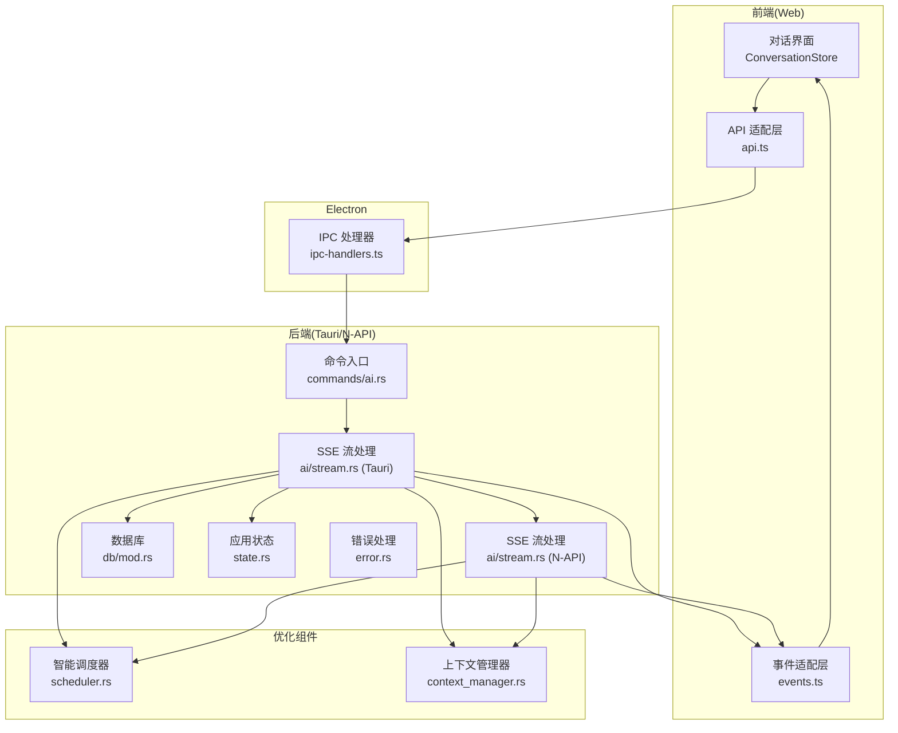
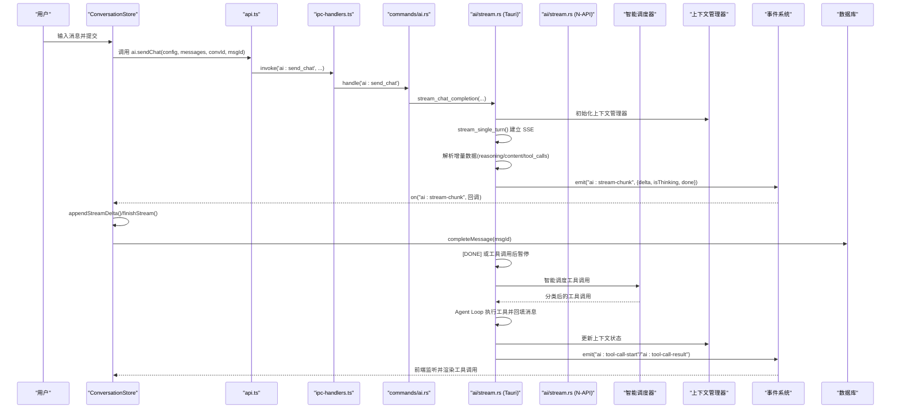
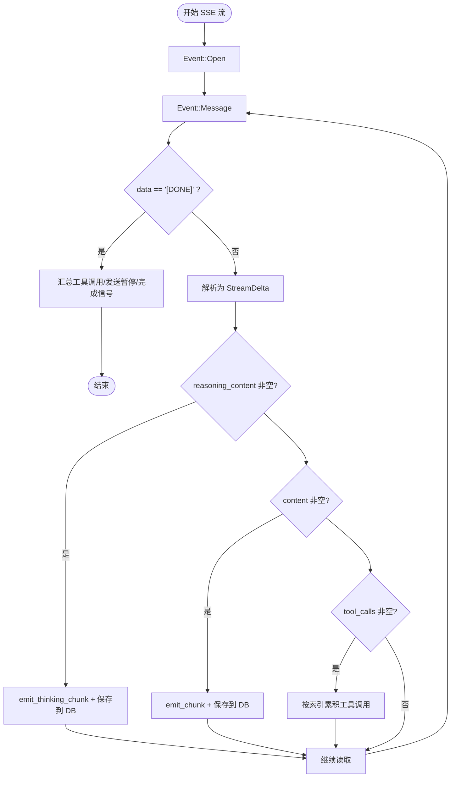
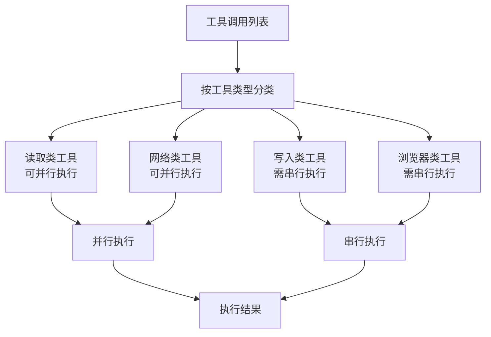
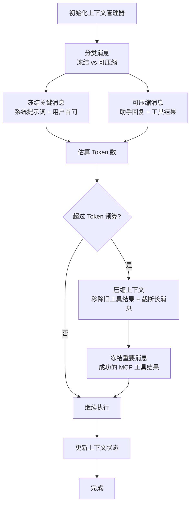
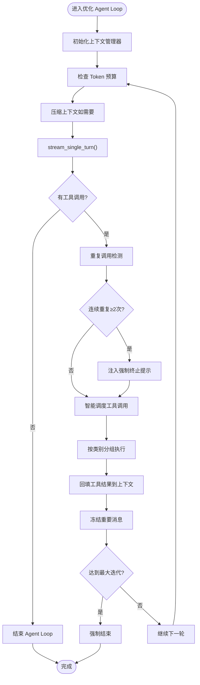
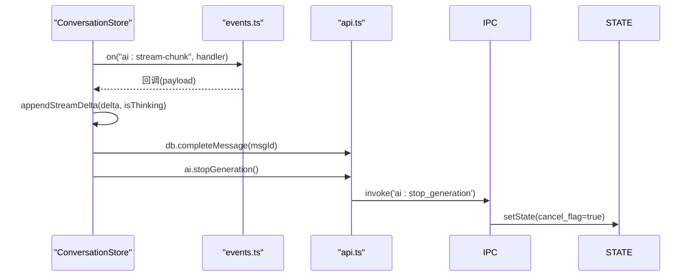
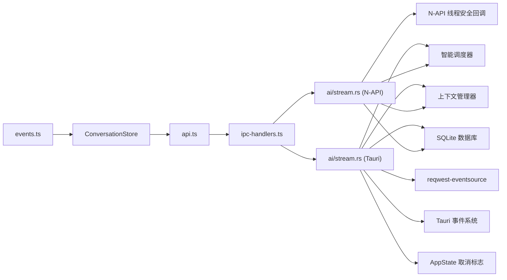

# 流式对话机制

<cite>
**本文引用的文件**
- [native/src/ai/stream.rs](file://native/src/ai/stream.rs)
- [native/src/ai/scheduler.rs](file://native/src/ai/scheduler.rs)
- [native/src/ai/context_manager.rs](file://native/src/ai/context_manager.rs)
- [src-tauri/src/ai/stream.rs](file://src-tauri/src/ai/stream.rs)
- [src-tauri/src/commands/ai.rs](file://src-tauri/src/commands/ai.rs)
- [src-web/src/stores/conversationStore.ts](file://src-web/src/stores/conversationStore.ts)
- [src-web/src/lib/api.ts](file://src-web/src/lib/api.ts)
- [src-web/src/lib/events.ts](file://src-web/src/lib/events.ts)
- [electron/ipc-handlers.ts](file://electron/ipc-handlers.ts)
- [src-tauri/src/state.rs](file://src-tauri/src/state.rs)
- [src-tauri/src/error.rs](file://src-tauri/src/error.rs)
- [native/src/db/mod.rs](file://native/src/db/mod.rs)
- [src-tauri/src/ai/skills_executors/mcp.rs](file://src-tauri/src/ai/skills_executors/mcp.rs)
</cite>

## 更新摘要
**变更内容**
- 新增智能调度器模块，支持按工具类型进行智能并行调度
- 新增上下文管理器模块，实现对话上下文的智能压缩与管理
- 优化 Agent Loop 实现，集成智能调度和上下文管理功能
- 在 N-API 层实现优化版本的流式对话处理

## 目录
1. [简介](#简介)
2. [项目结构](#项目结构)
3. [核心组件](#核心组件)
4. [架构总览](#架构总览)
5. [详细组件分析](#详细组件分析)
6. [依赖关系分析](#依赖关系分析)
7. [性能考虑](#性能考虑)
8. [故障排查指南](#故障排查指南)
9. [结论](#结论)
10. [附录](#附录)

## 简介
本文件面向 CoSurf 的流式对话机制，系统性阐述基于 SSE（Server-Sent Events）的实时响应生成流程，涵盖连接建立、事件发送、数据分块传输、工具调用与回路控制、智能调度与上下文管理、前后端集成与渲染优化、性能优化策略与错误恢复机制。文档同时提供可扩展的自定义流式响应处理器实现思路与最佳实践，帮助开发者在现有框架基础上快速扩展与定制。

## 项目结构
CoSurf 的流式对话由四部分协同实现：
- 后端（Tauri/N-API）：负责与大模型 API 建立 SSE 连接，解析增量数据，聚合工具调用，触发工具执行与回路控制，并通过事件向前端推送增量内容。
- 智能调度器：根据工具类型智能决定并行策略，将工具调用按读取/写入/网络/浏览器类别分组执行。
- 上下文管理器：智能管理对话上下文，冻结关键消息，压缩可压缩消息，控制 Token 预算。
- 前端（Web Store/IPC）：负责发起流式请求、监听事件、渲染增量内容、维护会话状态、触发停止与标题生成。
- Electron IPC：在原生与渲染进程之间桥接事件与回调，支撑跨平台运行。

**图表来源**
- [src-web/src/stores/conversationStore.ts:172-243](file://src-web/src/stores/conversationStore.ts#L172-L243)
- [src-web/src/lib/api.ts:250-267](file://src-web/src/lib/api.ts#L250-L267)
- [src-web/src/lib/events.ts:51-66](file://src-web/src/lib/events.ts#L51-L66)
- [electron/ipc-handlers.ts:282-317](file://electron/ipc-handlers.ts#L282-L317)
- [src-tauri/src/commands/ai.rs:17-274](file://src-tauri/src/commands/ai.rs#L17-L274)
- [src-tauri/src/ai/stream.rs:301-602](file://src-tauri/src/ai/stream.rs#L301-L602)
- [native/src/ai/stream.rs:301-473](file://native/src/ai/stream.rs#L301-L473)
- [native/src/ai/scheduler.rs:80-106](file://native/src/ai/scheduler.rs#L80-L106)
- [native/src/ai/context_manager.rs:10-48](file://native/src/ai/context_manager.rs#L10-L48)
- [src-tauri/src/state.rs:9-23](file://src-tauri/src/state.rs#L9-L23)
- [src-tauri/src/error.rs:4-39](file://src-tauri/src/error.rs#L4-L39)
- [native/src/db/mod.rs:418-435](file://native/src/db/mod.rs#L418-L435)

**章节来源**
- [src-web/src/stores/conversationStore.ts:172-243](file://src-web/src/stores/conversationStore.ts#L172-L243)
- [src-tauri/src/commands/ai.rs:17-274](file://src-tauri/src/commands/ai.rs#L17-L274)
- [src-tauri/src/ai/stream.rs:301-602](file://src-tauri/src/ai/stream.rs#L301-L602)
- [native/src/ai/stream.rs:301-473](file://native/src/ai/stream.rs#L301-L473)

## 核心组件
- SSE 流式解析与聚合：从大模型 API 接收增量数据，解析 reasoning/thinking 与 content，累积工具调用片段，识别 [DONE] 结束信号。
- 智能调度器：根据工具类型（读取/写入/网络/浏览器）智能决定并行策略，避免资源冲突。
- 上下文管理器：冻结关键消息（系统提示词、用户原始问题），智能压缩可压缩消息，控制 Token 预算。
- Agent Loop 控制：检测重复工具调用，注入强制终止提示，限制最大迭代次数，协调工具执行与消息回填。
- 事件推送与前端渲染：通过 Tauri/Electron 事件向前端推送增量内容、工具调用开始/结果、错误信息；前端 Store 负责本地状态与渲染。
- 数据持久化：增量内容实时写入数据库，消息完成后标记完成状态。
- 取消与错误处理：支持用户中断、网络错误、解析错误的统一处理与恢复。

**章节来源**
- [src-tauri/src/ai/stream.rs:301-602](file://src-tauri/src/ai/stream.rs#L301-L602)
- [native/src/ai/stream.rs:301-473](file://native/src/ai/stream.rs#L301-L473)
- [native/src/ai/scheduler.rs:80-106](file://native/src/ai/scheduler.rs#L80-L106)
- [native/src/ai/context_manager.rs:10-48](file://native/src/ai/context_manager.rs#L10-L48)
- [src-web/src/stores/conversationStore.ts:172-243](file://src-web/src/stores/conversationStore.ts#L172-L243)
- [src-tauri/src/commands/ai.rs:10-14](file://src-tauri/src/commands/ai.rs#L10-L14)

## 架构总览
下面的时序图展示了从用户输入到前端渲染的完整链路，以及 SSE 增量数据的处理与事件推送，包括新增的智能调度和上下文管理组件。

**图表来源**
- [src-web/src/stores/conversationStore.ts:172-243](file://src-web/src/stores/conversationStore.ts#L172-L243)
- [src-web/src/lib/api.ts:254-260](file://src-web/src/lib/api.ts#L254-L260)
- [electron/ipc-handlers.ts:282-317](file://electron/ipc-handlers.ts#L282-L317)
- [src-tauri/src/commands/ai.rs:210-265](file://src-tauri/src/commands/ai.rs#L210-L265)
- [src-tauri/src/ai/stream.rs:301-602](file://src-tauri/src/ai/stream.rs#L301-L602)
- [native/src/ai/stream.rs:301-473](file://native/src/ai/stream.rs#L301-L473)
- [native/src/ai/scheduler.rs:80-106](file://native/src/ai/scheduler.rs#L80-L106)
- [native/src/ai/context_manager.rs:10-48](file://native/src/ai/context_manager.rs#L10-L48)

## 详细组件分析

### SSE 连接与事件发送
- 连接建立：通过 reqwest-eventsource 创建 EventSource，POST 请求携带流式参数与工具 schema。
- 事件解析：逐条读取 Event::Message，遇到 [DONE] 结束；否则解析为 StreamDelta，分别处理 reasoning/thinking 与 content。
- 工具调用累积：按索引累积 tool_calls 片段，最终汇总为完整工具调用列表，交由 Agent Loop 处理。
- 事件推送：通过 emit_chunk/emit_thinking_chunk/emit_error 向前端推送增量内容与错误。

**图表来源**
- [src-tauri/src/ai/stream.rs:379-570](file://src-tauri/src/ai/stream.rs#L379-L570)
- [native/src/ai/stream.rs:338-453](file://native/src/ai/stream.rs#L338-L453)

**章节来源**
- [src-tauri/src/ai/stream.rs:301-602](file://src-tauri/src/ai/stream.rs#L301-L602)
- [native/src/ai/stream.rs:301-473](file://native/src/ai/stream.rs#L301-L473)

### 智能调度器与上下文管理器

#### 智能调度器
- 工具分类：根据工具类型智能决定并行策略，将工具调用分为读取类（可并行）、写入类（需串行）、网络类（可并行）、浏览器类（需串行）。
- 并行策略：读取类和网络类工具可并行执行，写入类和浏览器类工具需串行执行，避免资源冲突。
- 调度结果：返回分类后的工具调用集合，支持批量执行和错误处理。

**图表来源**
- [native/src/ai/scheduler.rs:80-106](file://native/src/ai/scheduler.rs#L80-L106)

#### 上下文管理器
- 消息分类：冻结关键消息（系统提示词、用户原始问题），智能压缩可压缩消息。
- Token 预算：估算消息 Token 数，控制上下文大小，避免超出模型限制。
- 压缩策略：移除旧的工具调用结果，截断过长消息，动态调整上下文大小。
- 动态冻结：识别重要的工具结果（如成功的 MCP 工具调用）并冻结到上下文中。

**图表来源**
- [native/src/ai/context_manager.rs:10-48](file://native/src/ai/context_manager.rs#L10-L48)
- [native/src/ai/context_manager.rs:146-176](file://native/src/ai/context_manager.rs#L146-L176)
- [native/src/ai/context_manager.rs:222-246](file://native/src/ai/context_manager.rs#L222-L246)

**章节来源**
- [native/src/ai/scheduler.rs:80-106](file://native/src/ai/scheduler.rs#L80-L106)
- [native/src/ai/context_manager.rs:10-48](file://native/src/ai/context_manager.rs#L10-L48)
- [native/src/ai/context_manager.rs:146-176](file://native/src/ai/context_manager.rs#L146-L176)
- [native/src/ai/context_manager.rs:222-246](file://native/src/ai/context_manager.rs#L222-L246)

### 优化的 Agent Loop 与工具调用
- 优化 Agent Loop：在单轮流式结束后，集成上下文管理和智能调度，若发现工具调用，则按类别分组并行执行，回填工具结果到消息历史，再进入下一轮；若无工具调用则结束。
- 重复调用检测：计算工具签名，连续重复多次时注入强制终止提示，防止无限循环。
- 工具执行：支持内置工具与 Electron Bridge 工具（通过 IPC 通知主进程执行）。

**图表来源**
- [src-tauri/src/ai/stream.rs:94-283](file://src-tauri/src/ai/stream.rs#L94-L283)
- [native/src/ai/stream.rs:586-823](file://native/src/ai/stream.rs#L586-L823)

**章节来源**
- [src-tauri/src/ai/stream.rs:77-283](file://src-tauri/src/ai/stream.rs#L77-L283)
- [native/src/ai/stream.rs:586-823](file://native/src/ai/stream.rs#L586-L823)

### 前端渲染与事件监听
- 事件监听：统一事件适配层 on() 监听 ai:stream-chunk、ai:stream-error、ai:tool-call-start 等事件。
- 渲染策略：区分 thinking 与 content，分别拼接到 thinkingContent 与 content；工具调用后重置状态为 streaming。
- 停止生成：调用 ai.stopGeneration，触发后端取消标志，发送完成信号并标记消息完成。

**图表来源**
- [src-web/src/stores/conversationStore.ts:172-243](file://src-web/src/stores/conversationStore.ts#L172-L243)
- [src-web/src/lib/events.ts:51-66](file://src-web/src/lib/events.ts#L51-L66)
- [src-web/src/lib/api.ts:262-263](file://src-web/src/lib/api.ts#L262-L263)
- [src-tauri/src/state.rs:12-12](file://src-tauri/src/state.rs#L12-L12)

**章节来源**
- [src-web/src/stores/conversationStore.ts:172-243](file://src-web/src/stores/conversationStore.ts#L172-L243)
- [src-web/src/lib/events.ts:51-66](file://src-web/src/lib/events.ts#L51-L66)
- [src-web/src/lib/api.ts:262-263](file://src-web/src/lib/api.ts#L262-L263)

### 数据持久化与状态管理
- 增量写入：每次收到增量内容即写入数据库，thinking 与 content 分别更新对应字段。
- 完成标记：SSE 结束或工具调用暂停后，发送完成信号并标记消息状态为 complete。
- 取消处理：用户中断时，发送完成信号并清理状态。

**章节来源**
- [src-tauri/src/ai/stream.rs:641-648](file://src-tauri/src/ai/stream.rs#L641-L648)
- [native/src/db/mod.rs:418-435](file://native/src/db/mod.rs#L418-L435)
- [src-tauri/src/commands/ai.rs:238-262](file://src-tauri/src/commands/ai.rs#L238-L262)

### 自定义流式响应处理器实现思路
以下为可扩展的自定义处理器实现步骤（概念性指导，不直接映射具体源码）：
- 事件源接入：使用 EventSource 或自定义 SSE 客户端，解析 data 字段为 JSON。
- 增量聚合：维护 content 与 reasoning 的累积缓冲区，按需 emit 到前端。
- 工具调用处理：识别工具调用片段并按索引累积，最终汇总为完整工具调用列表。
- 智能调度：实现工具类型分类和并行策略，避免资源冲突。
- 上下文管理：实现消息分类、Token 预算控制、智能压缩。
- 回路控制：实现重复调用检测与强制终止策略，限制最大迭代次数。
- 事件推送：通过事件系统向前端推送增量内容、工具调用开始/结果、错误信息。
- 数据持久化：将增量内容写入数据库，消息完成后标记完成状态。
- 取消与错误：监听取消标志，捕获网络与解析错误，统一上报。

**章节来源**
- [src-tauri/src/ai/stream.rs:301-602](file://src-tauri/src/ai/stream.rs#L301-L602)
- [native/src/ai/stream.rs:301-473](file://native/src/ai/stream.rs#L301-L473)
- [native/src/ai/scheduler.rs:80-106](file://native/src/ai/scheduler.rs#L80-L106)
- [native/src/ai/context_manager.rs:10-48](file://native/src/ai/context_manager.rs#L10-L48)

## 依赖关系分析
- 后端依赖：reqwest-eventsource 用于 SSE；Tauri/Electron 用于事件与 IPC；SQLite 用于消息持久化。
- 优化组件依赖：智能调度器依赖工具类型定义；上下文管理器依赖消息结构和 Token 估算。
- 前端依赖：统一事件适配层封装 Electron IPC；Zustand 管理会话状态；API 适配层封装 IPC 调用。
- 跨进程通信：IPC 处理器桥接渲染进程与主进程，N-API 模块桥接原生与渲染进程。

**图表来源**
- [src-tauri/src/ai/stream.rs:1-14](file://src-tauri/src/ai/stream.rs#L1-L14)
- [native/src/ai/stream.rs:1-27](file://native/src/ai/stream.rs#L1-L27)
- [native/src/ai/scheduler.rs:7-8](file://native/src/ai/scheduler.rs#L7-L8)
- [native/src/ai/context_manager.rs:8](file://native/src/ai/context_manager.rs#L8)
- [electron/ipc-handlers.ts:282-317](file://electron/ipc-handlers.ts#L282-L317)
- [src-web/src/lib/api.ts:13-19](file://src-web/src/lib/api.ts#L13-L19)
- [src-web/src/lib/events.ts:51-66](file://src-web/src/lib/events.ts#L51-L66)

**章节来源**
- [src-tauri/src/ai/stream.rs:1-14](file://src-tauri/src/ai/stream.rs#L1-L14)
- [native/src/ai/stream.rs:1-27](file://native/src/ai/stream.rs#L1-L27)
- [native/src/ai/scheduler.rs:7-8](file://native/src/ai/scheduler.rs#L7-L8)
- [native/src/ai/context_manager.rs:8](file://native/src/ai/context_manager.rs#L8)
- [electron/ipc-handlers.ts:282-317](file://electron/ipc-handlers.ts#L282-L317)

## 性能考虑
- 智能并行调度：根据工具类型智能决定并行策略，读取类和网络类工具可并行执行，写入类和浏览器类工具串行执行，提升整体吞吐。
- 上下文压缩：智能压缩可压缩消息，移除旧的工具调用结果，截断过长消息，控制 Token 预算，避免超出模型限制。
- 增量写入：每条增量均写入数据库，减少一次性写入压力，提高稳定性。
- 取消与超时：用户可随时中断生成；工具执行设置超时，避免阻塞。
- 重复调用抑制：通过签名检测与强制终止提示，降低无效往返。
- SSE 解析健壮性：忽略解析失败的非数据行，保证流式传输的鲁棒性。

**章节来源**
- [native/src/ai/scheduler.rs:80-106](file://native/src/ai/scheduler.rs#L80-L106)
- [native/src/ai/context_manager.rs:146-176](file://native/src/ai/context_manager.rs#L146-L176)
- [src-tauri/src/ai/stream.rs:180-221](file://src-tauri/src/ai/stream.rs#L180-L221)
- [src-tauri/src/ai/stream.rs:547-568](file://src-tauri/src/ai/stream.rs#L547-L568)
- [src-tauri/src/state.rs:12-12](file://src-tauri/src/state.rs#L12-L12)

## 故障排查指南
- 网络与认证问题：SSE 错误时统一发送 ai:stream-error 事件，前端显示错误提示并标记消息为 error。
- 解析错误：忽略空行与解析失败的数据行，避免中断流式传输。
- 取消与中断：前端调用 ai.stopGeneration，后端设置取消标志，发送完成信号并清理状态。
- 工具执行失败：捕获工具执行异常，构造假结果回填消息历史，保证 Agent Loop 继续推进。
- SSE 未结束：若流结束未收到 [DONE]，仍会返回累积的工具调用，避免数据丢失。
- Token 预算超限：当上下文 Token 数超过预算时，自动停止执行并提示用户。

**章节来源**
- [src-tauri/src/ai/stream.rs:547-568](file://src-tauri/src/ai/stream.rs#L547-L568)
- [src-tauri/src/commands/ai.rs:231-263](file://src-tauri/src/commands/ai.rs#L231-L263)
- [src-web/src/stores/conversationStore.ts:199-209](file://src-web/src/stores/conversationStore.ts#L199-L209)
- [native/src/ai/context_manager.rs:146-176](file://native/src/ai/context_manager.rs#L146-L176)

## 结论
CoSurf 的流式对话机制以 SSE 为核心，结合智能调度器、上下文管理器与工具调用回路控制，实现了高实时性、强鲁棒性和智能化的对话体验。通过事件驱动的前后端解耦、智能上下文管理与统一错误处理，系统在复杂场景下仍能保持稳定与可扩展。新增的智能调度器根据工具类型提供最优的并行策略，上下文管理器有效控制 Token 预算，显著提升了系统的性能和可靠性。开发者可在现有框架基础上，按需扩展自定义处理器、工具与前端渲染组件，进一步增强功能与性能。

## 附录
- SSE 协议要点：后端以 text/event-stream 形式推送事件，前端通过 EventSource 逐条读取；[DONE] 标识流结束。
- 事件格式规范：ai:stream-chunk 包含 conversation_id、message_id、delta、is_thinking、done；ai:stream-error 包含 conversation_id 与 error。
- 前端集成：通过统一事件适配层 on() 监听事件，结合 ConversationStore 状态管理与渲染逻辑。
- 工具类型分类：读取类（可并行）、写入类（需串行）、网络类（可并行）、浏览器类（需串行）。
- 上下文管理策略：冻结关键消息、智能压缩、Token 预算控制、动态冻结重要消息。

**章节来源**
- [src-tauri/src/ai/stream.rs:650-771](file://src-tauri/src/ai/stream.rs#L650-L771)
- [src-web/src/lib/events.ts:15-35](file://src-web/src/lib/events.ts#L15-L35)
- [src-web/src/stores/conversationStore.ts:172-243](file://src-web/src/stores/conversationStore.ts#L172-L243)
- [native/src/ai/scheduler.rs:80-106](file://native/src/ai/scheduler.rs#L80-L106)
- [native/src/ai/context_manager.rs:146-176](file://native/src/ai/context_manager.rs#L146-L176)