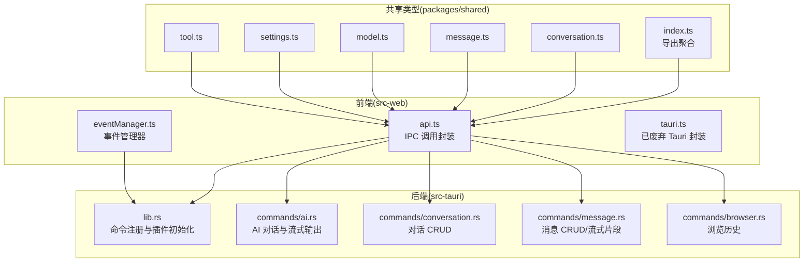
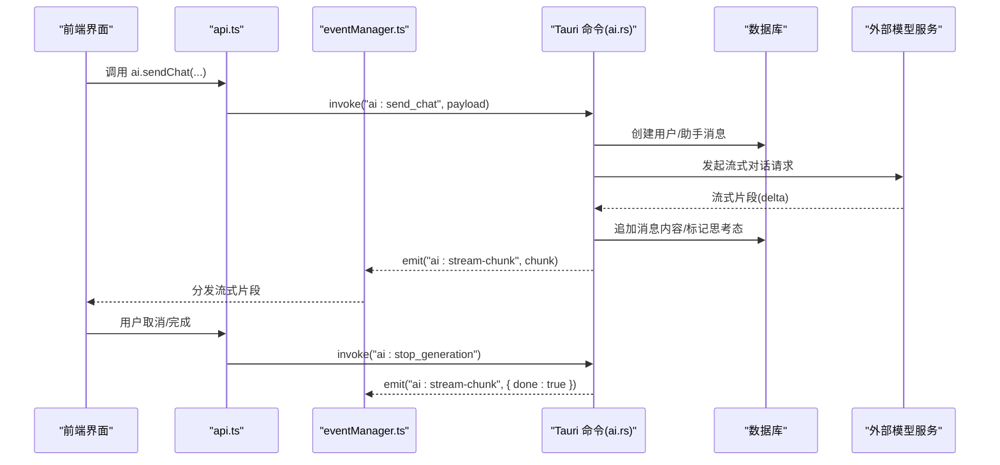
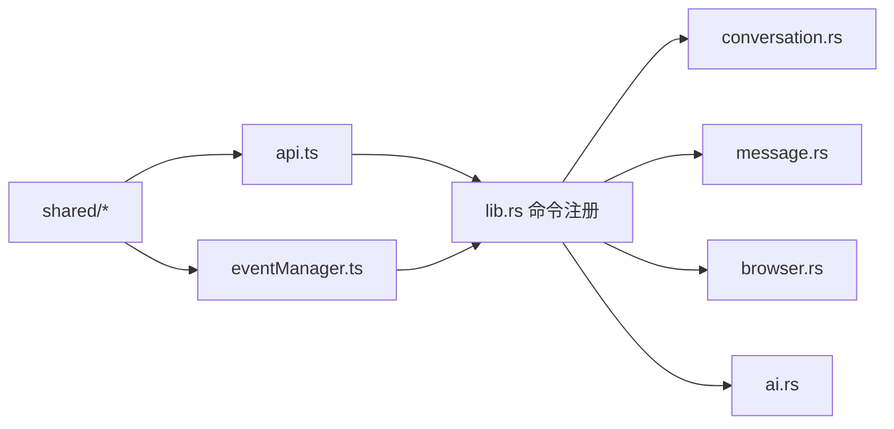

# API 参考

<cite>
**本文引用的文件**
- [src-tauri/src/lib.rs](file://src-tauri/src/lib.rs)
- [src-tauri/src/main.rs](file://src-tauri/src/main.rs)
- [src-tauri/src/commands/conversation.rs](file://src-tauri/src/commands/conversation.rs)
- [src-tauri/src/commands/message.rs](file://src-tauri/src/commands/message.rs)
- [src-tauri/src/commands/browser.rs](file://src-tauri/src/commands/browser.rs)
- [src-tauri/src/commands/ai.rs](file://src-tauri/src/commands/ai.rs)
- [src-web/src/lib/api.ts](file://src-web/src/lib/api.ts)
- [src-web/src/lib/eventManager.ts](file://src-web/src/lib/eventManager.ts)
- [src-web/src/lib/tauri.ts](file://src-web/src/lib/tauri.ts)
- [packages/shared/src/index.ts](file://packages/shared/src/index.ts)
- [packages/shared/src/conversation.ts](file://packages/shared/src/conversation.ts)
- [packages/shared/src/message.ts](file://packages/shared/src/message.ts)
- [packages/shared/src/model.ts](file://packages/shared/src/model.ts)
- [packages/shared/src/settings.ts](file://packages/shared/src/settings.ts)
- [packages/shared/src/tool.ts](file://packages/shared/src/tool.ts)
</cite>

## 目录
1. [简介](#简介)
2. [项目结构](#项目结构)
3. [核心组件](#核心组件)
4. [架构总览](#架构总览)
5. [详细组件分析](#详细组件分析)
6. [依赖关系分析](#依赖关系分析)
7. [性能考量](#性能考量)
8. [故障排查指南](#故障排查指南)
9. [结论](#结论)
10. [附录](#附录)

## 简介
本文件为 CoSurf 项目的 API 参考文档，覆盖前端 API（Electron IPC 封装与事件管理）、后端命令 API（Rust Tauri 命令）、共享类型定义（TypeScript），以及配置项与 JSON Schema。文档同时提供 API 使用示例、版本与兼容性说明、安全与认证考虑、测试与调试指南，以及常见使用场景。

## 项目结构
CoSurf 采用前后端分离的架构：
- 前端位于 src-web，使用 Electron 作为宿主，通过 window.electronAPI.invoke 与后端通信，并通过事件管理器统一处理请求/响应与事件订阅。
- 后端位于 src-tauri，基于 Tauri 注册大量命令，涵盖对话、消息、浏览器历史、AI 对话与流式输出、页面上下文、截图、技能管理等。
- 共享类型定义位于 packages/shared，供前端与后端共享，确保类型一致性。

图表来源
- [src-web/src/lib/api.ts:1-429](file://src-web/src/lib/api.ts#L1-L429)
- [src-web/src/lib/eventManager.ts:1-108](file://src-web/src/lib/eventManager.ts#L1-L108)
- [src-web/src/lib/tauri.ts:1-20](file://src-web/src/lib/tauri.ts#L1-L20)
- [src-tauri/src/lib.rs:108-214](file://src-tauri/src/lib.rs#L108-L214)
- [src-tauri/src/commands/ai.rs:1-397](file://src-tauri/src/commands/ai.rs#L1-L397)
- [src-tauri/src/commands/conversation.rs:1-73](file://src-tauri/src/commands/conversation.rs#L1-L73)
- [src-tauri/src/commands/message.rs:1-99](file://src-tauri/src/commands/message.rs#L1-L99)
- [src-tauri/src/commands/browser.rs:1-64](file://src-tauri/src/commands/browser.rs#L1-L64)
- [packages/shared/src/index.ts:1-9](file://packages/shared/src/index.ts#L1-L9)

章节来源
- [src-tauri/src/lib.rs:1-258](file://src-tauri/src/lib.rs#L1-L258)
- [src-web/src/lib/api.ts:1-429](file://src-web/src/lib/api.ts#L1-L429)
- [packages/shared/src/index.ts:1-9](file://packages/shared/src/index.ts#L1-L9)

## 核心组件
- 前端 API 封装（api.ts）：提供统一的 IPC 调用封装，按功能域分组（数据库、AI、Agent、标签页、页面、截图、技能、缓存、对话框、Shell、窗口），并对 Rust 返回的 JSON 字符串进行解析。
- 事件管理器（eventManager.ts）：实现请求-响应模式，支持超时、错误回传、清理；用于与后端事件（如 AI 流式片段、错误）进行双向通信。
- 后端命令注册（lib.rs）：集中注册所有命令，包括对话、消息、书签、设置、AI、浏览器导航、页面上下文、截图、技能等。
- 共享类型（packages/shared）：定义对话、消息、模型、设置、工具等类型，保证前后端一致的数据契约。

章节来源
- [src-web/src/lib/api.ts:1-429](file://src-web/src/lib/api.ts#L1-L429)
- [src-web/src/lib/eventManager.ts:1-108](file://src-web/src/lib/eventManager.ts#L1-L108)
- [src-tauri/src/lib.rs:108-214](file://src-tauri/src/lib.rs#L108-L214)
- [packages/shared/src/index.ts:1-9](file://packages/shared/src/index.ts#L1-L9)

## 架构总览
前端通过 Electron IPC 调用后端命令；后端命令访问数据库与外部服务，必要时通过事件向前端推送流式片段或错误。AI 对话流程采用异步任务与事件驱动，支持停止生成、流式增量、完成标记与标题生成。

图表来源
- [src-web/src/lib/api.ts:250-267](file://src-web/src/lib/api.ts#L250-L267)
- [src-web/src/lib/eventManager.ts:40-82](file://src-web/src/lib/eventManager.ts#L40-L82)
- [src-tauri/src/commands/ai.rs:16-274](file://src-tauri/src/commands/ai.rs#L16-L274)

## 详细组件分析

### 前端 API 封装（api.ts）
- 统一的 invoke 封装与 JSON 解析工具，确保 Rust 返回的 JSON 字符串在 JS 侧被正确解析。
- 按功能域分组导出模块：
  - db：对话、消息、书签、设置、模型配置、MCP 服务器、历史、Agent 提示词等 CRUD。
  - ai：发送聊天消息（流式）、停止生成、生成标题。
  - agent：Agent 执行、Qwen 配置、页面总结、记忆抽取。
  - tab/page/screenshot/cache/dialog/shell/win：标签页、页面、截图、缓存、对话框、Shell、窗口控制等。
- 参数与返回值：
  - 大多数命令返回 Promise，成功时解析为对象或数组，失败时抛出错误。
  - 流式场景通过事件监听接收增量数据（见“事件管理器”）。

章节来源
- [src-web/src/lib/api.ts:1-429](file://src-web/src/lib/api.ts#L1-L429)

### 事件管理器（eventManager.ts）
- 请求-响应模式：生成唯一 requestId，监听对应响应事件，支持超时与清理。
- 支持注册处理器与清理未完成请求，避免内存泄漏。
- 与后端事件配合（如 ai:stream-chunk、ai:stream-error），实现流式对话与错误传播。

章节来源
- [src-web/src/lib/eventManager.ts:1-108](file://src-web/src/lib/eventManager.ts#L1-L108)

### 后端命令 API（Rust）

#### 对话相关命令（conversation.rs）
- 列出对话、获取对话、创建对话、更新对话、删除对话、获取对话及消息列表。
- 错误：数据库锁错误、业务异常映射为 ErrorResponse。

章节来源
- [src-tauri/src/commands/conversation.rs:1-73](file://src-tauri/src/commands/conversation.rs#L1-L73)

#### 消息相关命令（message.rs）
- 列出消息、获取消息、创建消息、更新消息、删除消息。
- 流式相关：追加消息内容（支持“思考中”标记）、完成消息、设置反馈（like/dislike/取消）。

章节来源
- [src-tauri/src/commands/message.rs:1-99](file://src-tauri/src/commands/message.rs#L1-L99)

#### 浏览器历史命令（browser.rs）
- 列出历史、搜索历史、新增历史、清空历史、删除历史条目。
- 支持分页参数（limit/offset）与查询参数。

章节来源
- [src-tauri/src/commands/browser.rs:1-64](file://src-tauri/src/commands/browser.rs#L1-L64)

#### AI 对话命令（ai.rs）
- send_chat_message：创建用户/助手消息，构建系统提示词与历史消息，启动异步流式生成，通过事件推送流式片段与错误，最后完成标记。
- stop_generation：设置取消标志，中断生成。
- append_stream_chunk：追加流式片段到消息内容。
- complete_stream：完成流式消息。
- generate_conversation_title：非流式生成标题，使用当前激活模型配置。

章节来源
- [src-tauri/src/commands/ai.rs:1-397](file://src-tauri/src/commands/ai.rs#L1-L397)

### 共享类型定义（packages/shared）

#### 对话与消息（conversation.ts、message.ts）
- Conversation：包含 id、title、是否置顶、模型 id、消息数量、创建/更新时间。
- ConversationWithMessages：扩展包含消息数组。
- Message：角色（user/assistant/system）、内容、思考内容、状态（pending/streaming/complete/error）、附件、反馈、时间戳。
- StreamChunk：流式片段（对话 id、消息 id、增量、是否思考、完成标记）。

章节来源
- [packages/shared/src/conversation.ts:1-14](file://packages/shared/src/conversation.ts#L1-L14)
- [packages/shared/src/message.ts:1-35](file://packages/shared/src/message.ts#L1-L35)

#### 模型配置（model.ts）
- ModelProvider：支持的提供商枚举。
- ModelConfig：模型配置（id、name、provider、modelId、apiKey、baseUrl、temperature、topP、maxTokens、是否本地、是否激活）。
- ModelProviderPreset：提供商预设（默认 Base URL、模型列表、是否本地）。
- 预设集合：包含多家提供商与 Ollama 本地模型。

章节来源
- [packages/shared/src/model.ts:1-104](file://packages/shared/src/model.ts#L1-L104)

#### 设置（settings.ts）
- AppSettings：主题、语言、字体大小、用户名、面板高度、面板覆盖模式、隐私模式、AI 数据隐私、快捷键、用户数据路径。
- ShortcutConfig：各功能快捷键。
- DEFAULT_SETTINGS：默认设置值。

章节来源
- [packages/shared/src/settings.ts:1-47](file://packages/shared/src/settings.ts#L1-L47)

#### 工具（tool.ts）
- ToolCategory：工具分类（网页、知识、搜索、自定义）。
- ToolDefinition：工具定义（id、name、description、category、icon、enabled、可选配置 Schema）。
- ToolConfigField：工具配置字段（类型、标签、描述、默认值、选项、是否必填、是否密文）。
- ToolInstance：工具实例（工具 id、是否启用、配置）。
- 内置工具集合：网页总结、网页操作 Agent、截图与视觉理解、导出 Markdown、联网搜索（含配置 Schema）。

章节来源
- [packages/shared/src/tool.ts:1-88](file://packages/shared/src/tool.ts#L1-L88)

### 配置选项与 JSON Schema
- 模型配置（ModelConfig）：通过设置 API 进行增删改查与激活切换。
- MCP 服务器配置：支持创建/更新/删除、测试连通性、从 JSON 导入。
- 技能配置：技能目录设置、导入 Markdown/目录、列出文件与内容。
- 工具配置 Schema：工具定义中的 configSchema 字段，用于描述工具参数（类型、选项、是否必填、是否密文）。

章节来源
- [src-web/src/lib/api.ts:118-244](file://src-web/src/lib/api.ts#L118-L244)
- [packages/shared/src/tool.ts:69-86](file://packages/shared/src/tool.ts#L69-L86)

## 依赖关系分析

图表来源
- [src-web/src/lib/api.ts:1-429](file://src-web/src/lib/api.ts#L1-L429)
- [src-web/src/lib/eventManager.ts:1-108](file://src-web/src/lib/eventManager.ts#L1-L108)
- [src-tauri/src/lib.rs:108-214](file://src-tauri/src/lib.rs#L108-L214)
- [src-tauri/src/commands/conversation.rs:1-73](file://src-tauri/src/commands/conversation.rs#L1-L73)
- [src-tauri/src/commands/message.rs:1-99](file://src-tauri/src/commands/message.rs#L1-L99)
- [src-tauri/src/commands/browser.rs:1-64](file://src-tauri/src/commands/browser.rs#L1-L64)
- [src-tauri/src/commands/ai.rs:1-397](file://src-tauri/src/commands/ai.rs#L1-L397)
- [packages/shared/src/index.ts:1-9](file://packages/shared/src/index.ts#L1-L9)

章节来源
- [src-tauri/src/lib.rs:108-214](file://src-tauri/src/lib.rs#L108-L214)
- [src-web/src/lib/api.ts:1-429](file://src-web/src/lib/api.ts#L1-L429)

## 性能考量
- 流式传输：AI 对话采用流式片段推送，前端逐块渲染，降低首帧延迟。
- 异步任务：AI 生成在后台线程执行，避免阻塞主线程。
- 数据库锁：命令中对数据库加锁，注意避免长时间持有锁；批量操作建议合并。
- 事件超时：事件管理器提供超时控制，防止请求悬挂。

## 故障排查指南
- IPC 不可用：确认 window.electronAPI 是否存在；若不存在，检查 Electron 桥接初始化。
- 请求超时：事件管理器默认超时 10 秒，可根据场景调整；检查后端是否正常处理请求。
- 数据库锁错误：命令返回 LOCK_ERROR，重试或减少并发。
- AI 流式错误：后端通过 ai:stream-error 事件上报错误，前端监听并提示用户。
- 截图失败：检查全局快捷键注册与权限；确认截图命令返回结果。

章节来源
- [src-web/src/lib/eventManager.ts:40-82](file://src-web/src/lib/eventManager.ts#L40-L82)
- [src-tauri/src/lib.rs:75-103](file://src-tauri/src/lib.rs#L75-L103)
- [src-tauri/src/commands/ai.rs:227-265](file://src-tauri/src/commands/ai.rs#L227-L265)

## 结论
CoSurf 的 API 体系以 Electron IPC 为核心，结合事件驱动实现高效的流式交互；后端命令围绕对话、消息、浏览器历史、AI 对话与页面上下文展开；共享类型确保前后端一致的数据契约。通过完善的错误处理与事件管理，系统具备良好的可维护性与扩展性。

## 附录

### API 使用示例（概念性说明）
- 发送聊天消息（流式）
  - 前端：调用 ai.sendChat(...)，监听 ai:stream-chunk 事件，收到 done=true 结束。
  - 后端：ai.rs 接收请求，创建消息，构建历史与系统提示词，发起外部模型请求，推送流式片段。
- 获取对话与消息
  - 前端：调用 db.getConversationWithMessages(id)，解析返回对象。
  - 后端：conversation.rs 与 message.rs 组合查询。
- 设置模型配置
  - 前端：调用 db.createModelConfig/updateModelConfig/setActiveModel/deleteModelConfig。
  - 共享类型：ModelConfig、ModelProviderPreset。

章节来源
- [src-web/src/lib/api.ts:250-267](file://src-web/src/lib/api.ts#L250-L267)
- [src-tauri/src/commands/ai.rs:16-274](file://src-tauri/src/commands/ai.rs#L16-L274)
- [src-tauri/src/commands/conversation.rs:60-72](file://src-tauri/src/commands/conversation.rs#L60-L72)
- [src-tauri/src/commands/message.rs:7-14](file://src-tauri/src/commands/message.rs#L7-L14)
- [packages/shared/src/model.ts:13-25](file://packages/shared/src/model.ts#L13-L25)

### API 版本管理与向后兼容
- 类型层面：packages/shared 提供稳定的 TypeScript 接口，建议在新增字段时保留可选属性，避免破坏既有客户端。
- 命令层面：新增命令应保持现有命令签名不变，避免破坏 Electron IPC 调用方。
- 事件层面：新增事件时提供默认字段，确保旧版前端仍可解析。

### 安全与认证
- 模型 API Key：通过 ModelConfig.apiKey 传递，建议在设置中以密文形式存储与传输。
- IQS API Key：独立配置项，前端通过设置 API 读写。
- 工具配置：ToolConfigField 支持 secret 字段，敏感参数在 UI 中隐藏输入。

章节来源
- [packages/shared/src/model.ts:18-18](file://packages/shared/src/model.ts#L18-L18)
- [packages/shared/src/tool.ts:20-20](file://packages/shared/src/tool.ts#L20-L20)
- [src-web/src/lib/api.ts:168-176](file://src-web/src/lib/api.ts#L168-L176)

### 测试与调试工具
- 日志：后端使用 tracing 输出调试信息（模型配置、提示词、流式片段等）。
- 更新：内置自动更新检查与事件通知（updater:update-available）。
- 截图：全局快捷键触发全屏截图，便于验证 UI 与页面上下文。

章节来源
- [src-tauri/src/lib.rs:16-103](file://src-tauri/src/lib.rs#L16-L103)
- [src-tauri/src/lib.rs:219-257](file://src-tauri/src/lib.rs#L219-L257)