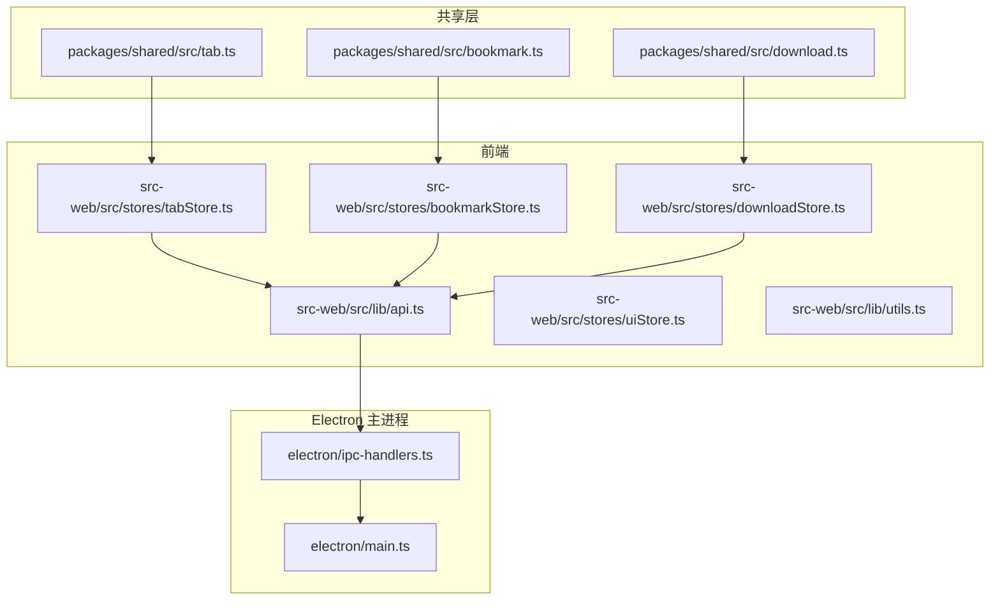
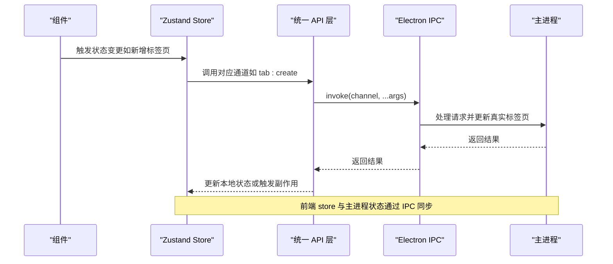
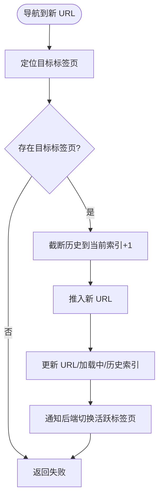
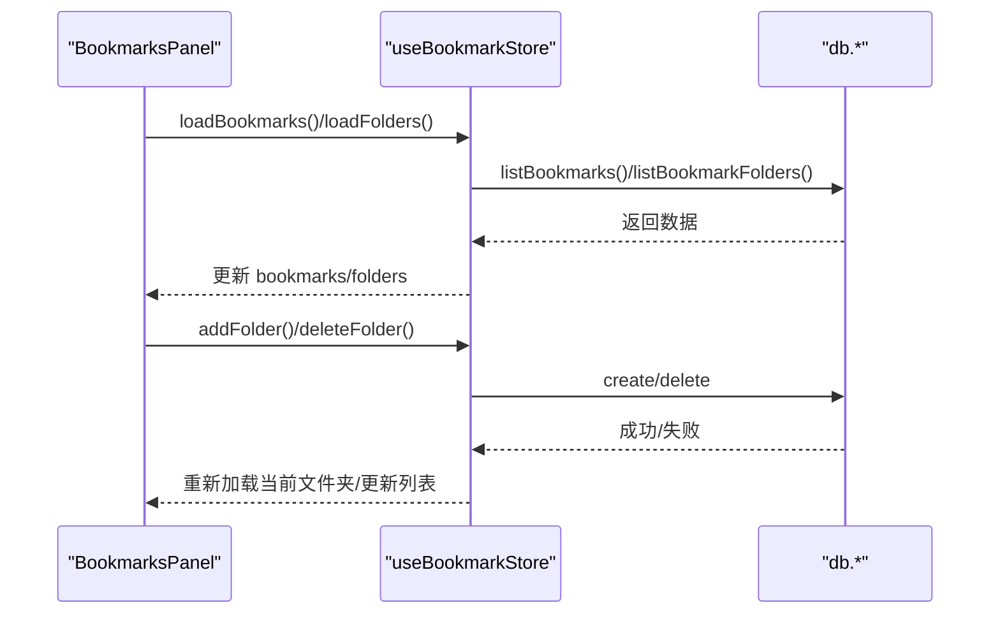
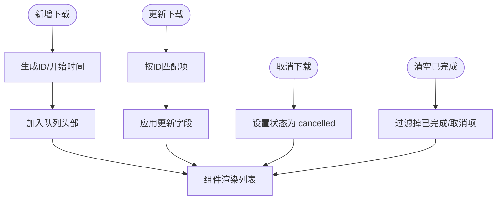
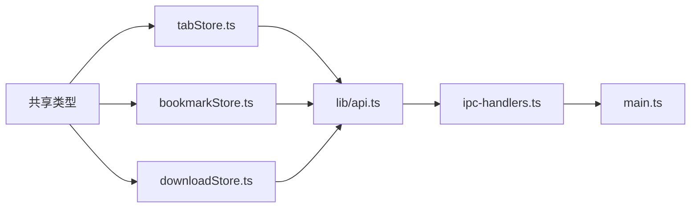

# UI 状态模型

<cite>
**本文档引用的文件**
- [packages/shared/src/tab.ts](file://packages/shared/src/tab.ts)
- [packages/shared/src/bookmark.ts](file://packages/shared/src/bookmark.ts)
- [packages/shared/src/download.ts](file://packages/shared/src/download.ts)
- [src-web/src/stores/tabStore.ts](file://src-web/src/stores/tabStore.ts)
- [src-web/src/stores/bookmarkStore.ts](file://src-web/src/stores/bookmarkStore.ts)
- [src-web/src/stores/downloadStore.ts](file://src-web/src/stores/downloadStore.ts)
- [src-web/src/lib/api.ts](file://src-web/src/lib/api.ts)
- [src-web/src/components/sidebar/BookmarksPanel.tsx](file://src-web/src/components/sidebar/BookmarksPanel.tsx)
- [src-web/src/components/sidebar/DownloadsPanel.tsx](file://src-web/src/components/sidebar/DownloadsPanel.tsx)
- [src-web/src/components/layout/TabBar.tsx](file://src-web/src/components/layout/TabBar.tsx)
- [src-web/src/components/layout/NavigationBar.tsx](file://src-web/src/components/layout/NavigationBar.tsx)
- [src-web/src/lib/utils.ts](file://src-web/src/lib/utils.ts)
- [src-web/src/stores/uiStore.ts](file://src-web/src/stores/uiStore.ts)
- [electron/ipc-handlers.ts](file://electron/ipc-handlers.ts)
- [electron/main.ts](file://electron/main.ts)
</cite>

## 目录
1. [简介](#简介)
2. [项目结构](#项目结构)
3. [核心组件](#核心组件)
4. [架构总览](#架构总览)
5. [详细组件分析](#详细组件分析)
6. [依赖分析](#依赖分析)
7. [性能考量](#性能考量)
8. [故障排查指南](#故障排查指南)
9. [结论](#结论)

## 简介
本文件系统性梳理 CoSurf UI 的状态模型，聚焦用户界面状态相关的类型定义与实现，包括标签页、书签、下载等模块。内容涵盖：
- 类型定义：Tab、Bookmark、Download 等接口字段与层级关系
- 状态管理：标签页的打开/关闭/导航、书签的增删改查、下载任务的进度与状态
- 前端状态与组件通信：Zustand store 的使用模式与组件订阅策略
- 与后端数据同步：IPC 通道、数据库交互与跨进程桥接
- 性能优化与内存管理：订阅粒度、计算属性与渲染优化建议

## 项目结构
CoSurf 采用前后端分离的状态模型设计：
- 共享类型定义位于 packages/shared，确保前端与后端共享接口契约
- 前端使用 Zustand 管理 UI 状态，并通过统一 API 层与后端通信
- Electron 主进程负责真实标签页管理与 IPC 桥接，前端 store 与主进程状态保持同步

**图表来源**
- [packages/shared/src/tab.ts:1-32](file://packages/shared/src/tab.ts#L1-L32)
- [packages/shared/src/bookmark.ts:1-25](file://packages/shared/src/bookmark.ts#L1-L25)
- [packages/shared/src/download.ts:1-29](file://packages/shared/src/download.ts#L1-L29)
- [src-web/src/stores/tabStore.ts:1-248](file://src-web/src/stores/tabStore.ts#L1-L248)
- [src-web/src/stores/bookmarkStore.ts:1-138](file://src-web/src/stores/bookmarkStore.ts#L1-L138)
- [src-web/src/stores/downloadStore.ts:1-73](file://src-web/src/stores/downloadStore.ts#L1-L73)
- [src-web/src/lib/api.ts:1-445](file://src-web/src/lib/api.ts#L1-L445)
- [electron/main.ts:1-43](file://electron/main.ts#L1-L43)
- [electron/ipc-handlers.ts:529-603](file://electron/ipc-handlers.ts#L529-L603)

**章节来源**
- [packages/shared/src/tab.ts:1-32](file://packages/shared/src/tab.ts#L1-L32)
- [packages/shared/src/bookmark.ts:1-25](file://packages/shared/src/bookmark.ts#L1-L25)
- [packages/shared/src/download.ts:1-29](file://packages/shared/src/download.ts#L1-L29)
- [src-web/src/stores/tabStore.ts:1-248](file://src-web/src/stores/tabStore.ts#L1-L248)
- [src-web/src/stores/bookmarkStore.ts:1-138](file://src-web/src/stores/bookmarkStore.ts#L1-L138)
- [src-web/src/stores/downloadStore.ts:1-73](file://src-web/src/stores/downloadStore.ts#L1-L73)
- [src-web/src/lib/api.ts:1-445](file://src-web/src/lib/api.ts#L1-L445)
- [electron/main.ts:1-43](file://electron/main.ts#L1-L43)
- [electron/ipc-handlers.ts:529-603](file://electron/ipc-handlers.ts#L529-L603)

## 核心组件
本节概述三大 UI 状态模型及其职责边界。

- 标签页状态模型（Tab）
  - 关键字段：标识、标题、URL、是否加载中、静音、固定、丢弃、激活、分组、顺序、导航历史与索引
  - 支持标签页组（TabGroup）与导航状态（NavigationState）以增强组织与前进后退能力
- 书签状态模型（Bookmark）
  - 关键字段：书签项与文件夹项的结构化定义；支持层级嵌套（children: (Bookmark | BookmarkFolder)[]）
  - 提供历史条目（HistoryEntry）用于浏览记录
- 下载状态模型（Download）
  - 关键字段：下载项、状态枚举、字节数、开始/结束时间、保存路径、错误信息
  - 提供下载状态管理动作（新增、更新、移除、清空已完成、暂停/恢复/取消、打开文件/显示所在文件夹）

**章节来源**
- [packages/shared/src/tab.ts:1-32](file://packages/shared/src/tab.ts#L1-L32)
- [packages/shared/src/bookmark.ts:1-25](file://packages/shared/src/bookmark.ts#L1-L25)
- [packages/shared/src/download.ts:1-29](file://packages/shared/src/download.ts#L1-L29)

## 架构总览
前端通过统一 API 层与后端通信，Electron 主进程负责真实标签页与 IPC 桥接。前端 store 与主进程状态保持同步，同时暴露全局变量以便工具链直接调用。

**图表来源**
- [src-web/src/lib/api.ts:290-320](file://src-web/src/lib/api.ts#L290-L320)
- [electron/ipc-handlers.ts:529-603](file://electron/ipc-handlers.ts#L529-L603)
- [electron/main.ts:1-43](file://electron/main.ts#L1-L43)

**章节来源**
- [src-web/src/lib/api.ts:1-445](file://src-web/src/lib/api.ts#L1-L445)
- [electron/ipc-handlers.ts:529-603](file://electron/ipc-handlers.ts#L529-L603)
- [electron/main.ts:1-43](file://electron/main.ts#L1-L43)

## 详细组件分析

### 标签页状态模型（Tab）
- 类型定义要点
  - Tab：包含标识、标题、URL、favicon、加载状态、静音、固定、丢弃、激活、分组、顺序、导航历史与索引
  - TabGroup：用于标签页分组展示与管理
  - NavigationState：描述可后退/前进、加载状态、当前 URL 与标题
- 状态管理要点
  - 初始状态包含一个“新标签页”实例，激活态为 true
  - 新增标签页时分配唯一 ID，激活态切换至新标签页，其余标签页取消激活
  - 关闭标签页时若只剩最后一个则重建空白标签页，并重排顺序
  - 导航到新 URL 时维护导航历史并更新索引，同时标记为加载中
  - 后退/前进根据导航索引读取历史并更新 URL 与加载状态
- 与后端同步
  - 激活标签页变更时调用后端通道以更新真实标签页
  - 初始化时将 activeTabId 暴露为全局变量，便于工具链直接读取
  - Electron 桥接工具可通过全局变量与前端 store 同步

**图表来源**
- [src-web/src/stores/tabStore.ts:151-171](file://src-web/src/stores/tabStore.ts#L151-L171)
- [src-web/src/lib/api.ts:293-320](file://src-web/src/lib/api.ts#L293-L320)

**章节来源**
- [packages/shared/src/tab.ts:1-32](file://packages/shared/src/tab.ts#L1-L32)
- [src-web/src/stores/tabStore.ts:1-248](file://src-web/src/stores/tabStore.ts#L1-L248)
- [src-web/src/lib/api.ts:290-320](file://src-web/src/lib/api.ts#L290-L320)
- [electron/ipc-handlers.ts:545-603](file://electron/ipc-handlers.ts#L545-L603)

### 书签状态模型（Bookmark）
- 类型定义要点
  - Bookmark：书签项，包含标题、URL、favicon、所属文件夹、排序、创建时间
  - BookmarkFolder：文件夹项，包含父级、子节点（可为书签或文件夹）
  - HistoryEntry：历史记录项
- 状态管理要点
  - 支持按文件夹加载书签与文件夹树
  - 支持新建/删除书签与文件夹，删除文件夹时自动切回根目录
  - 支持搜索过滤、判断某 URL 是否已收藏、按 URL 删除书签
  - 与数据库交互通过统一 API 层，异常时打印日志并保持状态稳定
- 组件使用示例
  - 侧边栏书签面板订阅 store 并在点击书签时新建标签页打开

**图表来源**
- [src-web/src/stores/bookmarkStore.ts:41-137](file://src-web/src/stores/bookmarkStore.ts#L41-L137)
- [src-web/src/lib/api.ts:99-117](file://src-web/src/lib/api.ts#L99-L117)
- [src-web/src/components/sidebar/BookmarksPanel.tsx:1-289](file://src-web/src/components/sidebar/BookmarksPanel.tsx#L1-L289)

**章节来源**
- [packages/shared/src/bookmark.ts:1-25](file://packages/shared/src/bookmark.ts#L1-L25)
- [src-web/src/stores/bookmarkStore.ts:1-138](file://src-web/src/stores/bookmarkStore.ts#L1-L138)
- [src-web/src/lib/api.ts:99-117](file://src-web/src/lib/api.ts#L99-L117)
- [src-web/src/components/sidebar/BookmarksPanel.tsx:1-289](file://src-web/src/components/sidebar/BookmarksPanel.tsx#L1-L289)

### 下载状态模型（Download）
- 类型定义要点
  - DownloadItem：下载项，包含 URL、文件名、MIME、总字节、已接收字节、开始/结束时间、状态、保存路径、错误信息
  - DownloadState：下载集合与状态管理动作（新增、更新、移除、清空已完成、取消、打开/显示文件）
- 状态管理要点
  - 新增下载时自动生成 ID 与开始时间，插入队列头部
  - 更新/移除基于 ID 匹配
  - 清空已完成仅保留未完成状态
  - 计算属性：活跃下载数（进行中）、是否存在下载
- 组件使用示例
  - 侧边栏下载面板展示下载列表、进度条、状态图标与操作按钮

**图表来源**
- [packages/shared/src/download.ts:1-29](file://packages/shared/src/download.ts#L1-L29)
- [src-web/src/stores/downloadStore.ts:19-72](file://src-web/src/stores/downloadStore.ts#L19-L72)
- [src-web/src/components/sidebar/DownloadsPanel.tsx:1-159](file://src-web/src/components/sidebar/DownloadsPanel.tsx#L1-L159)

**章节来源**
- [packages/shared/src/download.ts:1-29](file://packages/shared/src/download.ts#L1-L29)
- [src-web/src/stores/downloadStore.ts:1-73](file://src-web/src/stores/downloadStore.ts#L1-L73)
- [src-web/src/components/sidebar/DownloadsPanel.tsx:1-159](file://src-web/src/components/sidebar/DownloadsPanel.tsx#L1-L159)

### 组件与状态的使用示例
- 标签页组件
  - 标签栏与导航栏分别订阅 tabs 与 activeTabId，避免对象引用导致的无限重渲染
  - 导航栏使用 updateTab 与 navigateTo 控制标签页状态与 URL
- 书签面板
  - 订阅 bookmarks、folders、currentFolderId、loading、searchQuery
  - 点击书签时通过 addTab 在新标签页打开
- 下载面板
  - 订阅 downloads、clearCompleted、removeDownload、cancelDownload
  - 渲染进度条与状态提示，支持取消与移除

**章节来源**
- [src-web/src/components/layout/TabBar.tsx:1-12](file://src-web/src/components/layout/TabBar.tsx#L1-L12)
- [src-web/src/components/layout/NavigationBar.tsx:1-41](file://src-web/src/components/layout/NavigationBar.tsx#L1-L41)
- [src-web/src/components/sidebar/BookmarksPanel.tsx:1-289](file://src-web/src/components/sidebar/BookmarksPanel.tsx#L1-L289)
- [src-web/src/components/sidebar/DownloadsPanel.tsx:1-159](file://src-web/src/components/sidebar/DownloadsPanel.tsx#L1-L159)

## 依赖分析
- 类型依赖
  - 所有 store 的类型均来自 packages/shared，保证前后端一致性
- 组件依赖
  - 组件通过 useStore 订阅所需状态片段，减少不必要的重渲染
- API 依赖
  - 统一 API 层封装 IPC 调用，db.* 与 tab.* 通道分别对接数据库与标签页管理
- 主进程桥接
  - Electron 主进程注册 IPC 处理器，桥接工具可通过全局变量与前端 store 同步

**图表来源**
- [packages/shared/src/tab.ts:1-32](file://packages/shared/src/tab.ts#L1-L32)
- [packages/shared/src/bookmark.ts:1-25](file://packages/shared/src/bookmark.ts#L1-L25)
- [packages/shared/src/download.ts:1-29](file://packages/shared/src/download.ts#L1-L29)
- [src-web/src/stores/tabStore.ts:1-248](file://src-web/src/stores/tabStore.ts#L1-L248)
- [src-web/src/stores/bookmarkStore.ts:1-138](file://src-web/src/stores/bookmarkStore.ts#L1-L138)
- [src-web/src/stores/downloadStore.ts:1-73](file://src-web/src/stores/downloadStore.ts#L1-L73)
- [src-web/src/lib/api.ts:1-445](file://src-web/src/lib/api.ts#L1-L445)
- [electron/ipc-handlers.ts:529-603](file://electron/ipc-handlers.ts#L529-L603)
- [electron/main.ts:1-43](file://electron/main.ts#L1-L43)

**章节来源**
- [packages/shared/src/tab.ts:1-32](file://packages/shared/src/tab.ts#L1-L32)
- [packages/shared/src/bookmark.ts:1-25](file://packages/shared/src/bookmark.ts#L1-L25)
- [packages/shared/src/download.ts:1-29](file://packages/shared/src/download.ts#L1-L29)
- [src-web/src/stores/tabStore.ts:1-248](file://src-web/src/stores/tabStore.ts#L1-L248)
- [src-web/src/stores/bookmarkStore.ts:1-138](file://src-web/src/stores/bookmarkStore.ts#L1-L138)
- [src-web/src/stores/downloadStore.ts:1-73](file://src-web/src/stores/downloadStore.ts#L1-L73)
- [src-web/src/lib/api.ts:1-445](file://src-web/src/lib/api.ts#L1-L445)
- [electron/ipc-handlers.ts:529-603](file://electron/ipc-handlers.ts#L529-L603)
- [electron/main.ts:1-43](file://electron/main.ts#L1-L43)

## 性能考量
- 订阅粒度优化
  - 组件分别订阅 tabs 与 activeTabId，避免订阅整个对象导致的不必要重渲染
- 计算属性
  - 下载 store 提供 activeDownloads 与 hasDownloads 计算属性，减少重复逻辑
- 渲染优化
  - 书签与下载面板使用条件渲染与占位符，避免空列表时的无效 DOM
- 内存管理
  - 关闭标签页时重排顺序并保持最小状态集；下载完成后可清理已完成项
  - 统一 API 层对错误进行捕获与降级，避免异常传播影响整体状态

**章节来源**
- [src-web/src/stores/downloadStore.ts:65-72](file://src-web/src/stores/downloadStore.ts#L65-L72)
- [src-web/src/components/sidebar/BookmarksPanel.tsx:213-224](file://src-web/src/components/sidebar/BookmarksPanel.tsx#L213-L224)
- [src-web/src/components/sidebar/DownloadsPanel.tsx:20-30](file://src-web/src/components/sidebar/DownloadsPanel.tsx#L20-L30)

## 故障排查指南
- 标签页导航异常
  - 检查导航历史索引与 canGoBack/canGoForward 的判断逻辑
  - 确认后端切换活跃标签页的 IPC 调用是否成功
- 书签加载失败
  - 查看统一 API 层的数据库调用返回，确认错误日志
  - 确保文件夹切换后正确触发重新加载
- 下载状态不同步
  - 检查下载 store 的更新逻辑与计算属性
  - 确认取消/清空操作是否正确过滤状态
- Electron 桥接问题
  - 确认全局变量 __cosurf_activeTabId、__cosurf_navigateTo、__cosurf_updateTab 是否存在
  - 检查主进程桥接工具是否正确调用前端 store 方法

**章节来源**
- [src-web/src/stores/tabStore.ts:216-228](file://src-web/src/stores/tabStore.ts#L216-L228)
- [src-web/src/lib/api.ts:99-117](file://src-web/src/lib/api.ts#L99-L117)
- [src-web/src/stores/bookmarkStore.ts:48-58](file://src-web/src/stores/bookmarkStore.ts#L48-L58)
- [src-web/src/stores/downloadStore.ts:49-55](file://src-web/src/stores/downloadStore.ts#L49-L55)
- [electron/ipc-handlers.ts:555-603](file://electron/ipc-handlers.ts#L555-L603)

## 结论
CoSurf 的 UI 状态模型以共享类型为核心，结合前端 Zustand store 与统一 API 层，实现了清晰的状态管理与稳定的组件通信。通过合理的订阅粒度、计算属性与错误处理，系统在复杂交互场景下仍能保持良好的性能与可维护性。后续可在以下方面持续优化：
- 引入更细粒度的状态切片，进一步降低重渲染范围
- 对大型列表（书签/历史）引入虚拟滚动与懒加载
- 完善离线场景下的状态持久化与冲突解决策略