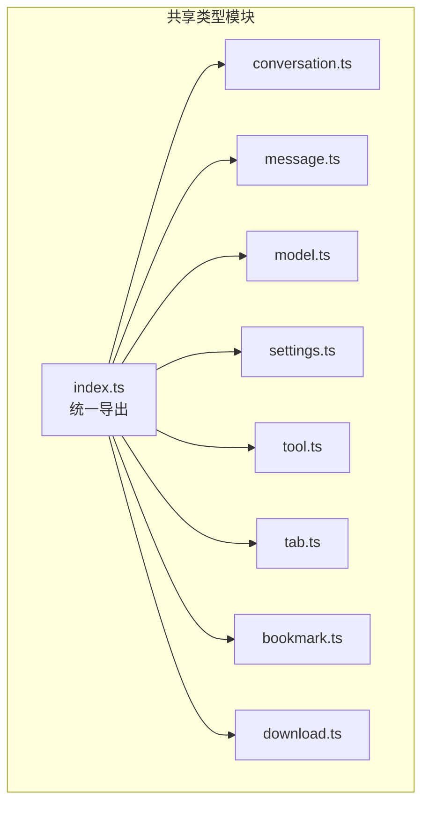
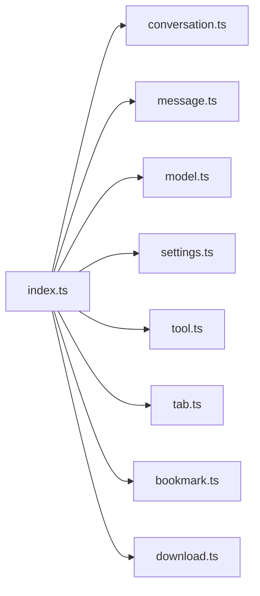
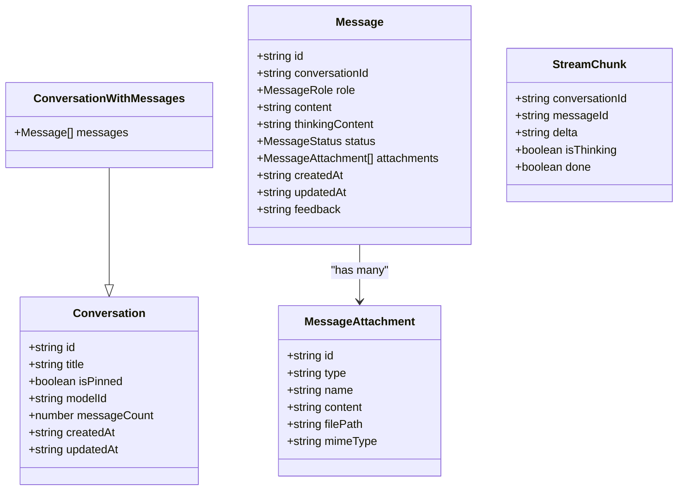

# 共享类型定义

<cite>
**本文引用的文件**
- [packages/shared/src/conversation.ts](file://packages/shared/src/conversation.ts)
- [packages/shared/src/message.ts](file://packages/shared/src/message.ts)
- [packages/shared/src/model.ts](file://packages/shared/src/model.ts)
- [packages/shared/src/settings.ts](file://packages/shared/src/settings.ts)
- [packages/shared/src/tool.ts](file://packages/shared/src/tool.ts)
- [packages/shared/src/tab.ts](file://packages/shared/src/tab.ts)
- [packages/shared/src/bookmark.ts](file://packages/shared/src/bookmark.ts)
- [packages/shared/src/download.ts](file://packages/shared/src/download.ts)
- [packages/shared/src/index.ts](file://packages/shared/src/index.ts)
- [packages/shared/package.json](file://packages/shared/package.json)
- [packages/shared/tsconfig.json](file://packages/shared/tsconfig.json)
- [src-web/src/stores/conversationStore.ts](file://src-web/src/stores/conversationStore.ts)
- [src-web/src/stores/downloadStore.ts](file://src-web/src/stores/downloadStore.ts)
- [src-web/src/stores/settingsStore.ts](file://src-web/src/stores/settingsStore.ts)
- [src-web/src/stores/tabStore.ts](file://src-web/src/stores/tabStore.ts)
- [src-web/src/components/layout/AIPanel.tsx](file://src-web/src/components/layout/AIPanel.tsx)
- [src-web/src/components/settings/SettingsPage.tsx](file://src-web/src/components/settings/SettingsPage.tsx)
- [src-web/src/components/sidebar/DownloadsPanel.tsx](file://src-web/src/components/sidebar/DownloadsPanel.tsx)
- [src-web/src/lib/mock.ts](file://src-web/src/lib/mock.ts)
</cite>

## 目录
1. [简介](#简介)
2. [项目结构](#项目结构)
3. [核心组件](#核心组件)
4. [架构总览](#架构总览)
5. [详细组件分析](#详细组件分析)
6. [依赖分析](#依赖分析)
7. [性能考量](#性能考量)
8. [故障排查指南](#故障排查指南)
9. [结论](#结论)
10. [附录](#附录)

## 简介
本文件为 CoSurf 项目的“共享类型定义”模块提供完整的 API 参考文档。该模块位于 packages/shared，统一定义了前端与后端（Tauri/Electron）交互所需的关键 TypeScript 类型，涵盖会话、消息、模型配置、设置、工具、标签页、书签与下载等核心领域模型。本文将逐类说明类型定义、字段含义、必填/可选与默认值、类型间关系、前后端使用方式、最佳实践与常见错误规避，并给出版本演进建议与兼容性注意事项。

## 项目结构
共享类型模块采用按功能域分文件的组织方式，每个领域一个独立文件，通过统一的入口导出，便于前端各层按需导入。

图表来源
- [packages/shared/src/index.ts:1-9](file://packages/shared/src/index.ts#L1-L9)
- [packages/shared/src/conversation.ts:1-14](file://packages/shared/src/conversation.ts#L1-L14)
- [packages/shared/src/message.ts:1-35](file://packages/shared/src/message.ts#L1-L35)
- [packages/shared/src/model.ts:1-104](file://packages/shared/src/model.ts#L1-L104)
- [packages/shared/src/settings.ts:1-47](file://packages/shared/src/settings.ts#L1-L47)
- [packages/shared/src/tool.ts:1-88](file://packages/shared/src/tool.ts#L1-L88)
- [packages/shared/src/tab.ts:1-32](file://packages/shared/src/tab.ts#L1-L32)
- [packages/shared/src/bookmark.ts:1-25](file://packages/shared/src/bookmark.ts#L1-L25)
- [packages/shared/src/download.ts:1-29](file://packages/shared/src/download.ts#L1-L29)

章节来源
- [packages/shared/src/index.ts:1-9](file://packages/shared/src/index.ts#L1-L9)
- [packages/shared/package.json:1-17](file://packages/shared/package.json#L1-L17)
- [packages/shared/tsconfig.json:1-19](file://packages/shared/tsconfig.json#L1-L19)

## 核心组件
本节概述所有共享类型及其职责边界：
- Conversation/ConversationWithMessages：会话元数据与带消息的会话视图
- Message/StreamChunk：消息体与流式增量
- ModelConfig/ModelProviderPreset：模型配置与提供商预设
- AppSettings/ShortcutConfig：应用设置与快捷键配置
- ToolDefinition/ToolInstance/ToolConfigField：工具定义、实例与配置字段
- Tab/TabGroup/NavigationState：标签页与导航状态
- Bookmark/BookmarkFolder/HistoryEntry：书签与历史条目
- DownloadItem/DownloadState：下载项与下载状态管理

章节来源
- [packages/shared/src/conversation.ts:1-14](file://packages/shared/src/conversation.ts#L1-L14)
- [packages/shared/src/message.ts:1-35](file://packages/shared/src/message.ts#L1-L35)
- [packages/shared/src/model.ts:1-104](file://packages/shared/src/model.ts#L1-L104)
- [packages/shared/src/settings.ts:1-47](file://packages/shared/src/settings.ts#L1-L47)
- [packages/shared/src/tool.ts:1-88](file://packages/shared/src/tool.ts#L1-L88)
- [packages/shared/src/tab.ts:1-32](file://packages/shared/src/tab.ts#L1-L32)
- [packages/shared/src/bookmark.ts:1-25](file://packages/shared/src/bookmark.ts#L1-L25)
- [packages/shared/src/download.ts:1-29](file://packages/shared/src/download.ts#L1-L29)

## 架构总览
下图展示共享类型在前端 Store 与组件中的使用关系，体现“类型驱动”的数据契约：

```mermaid
graph TB
subgraph "前端 Store"
CS["conversationStore.ts"]
DS["downloadStore.ts"]
SS["settingsStore.ts"]
TS["tabStore.ts"]
end
subgraph "组件"
AIP["AIPanel.tsx"]
SP["SettingsPage.tsx"]
DP["DownloadsPanel.tsx"]
MOCK["mock.ts"]
end
CONV["Conversation/ConversationWithMessages"]
MSG["Message/StreamChunk"]
MODEL["ModelConfig/ModelProviderPreset"]
SETT["AppSettings/ShortcutConfig"]
TOOL["ToolDefinition/ToolInstance/ToolConfigField"]
TAB["Tab/TabGroup/NavigationState"]
BM["Bookmark/BookmarkFolder/HistoryEntry"]
DL["DownloadItem/DownloadState"]
CS --> CONV
CS --> MSG
DS --> DL
SS --> SETT
SS --> MODEL
TS --> TAB
AIP --> MSG
SP --> MODEL
SP --> TOOL
DP --> DL
MOCK --> CONV
MOCK --> MSG
MOCK --> DL
```

图表来源
- [src-web/src/stores/conversationStore.ts:1-2](file://src-web/src/stores/conversationStore.ts#L1-L2)
- [src-web/src/stores/downloadStore.ts:1-2](file://src-web/src/stores/downloadStore.ts#L1-L2)
- [src-web/src/stores/settingsStore.ts:1-2](file://src-web/src/stores/settingsStore.ts#L1-L2)
- [src-web/src/stores/tabStore.ts:1-1](file://src-web/src/stores/tabStore.ts#L1-L1)
- [src-web/src/components/layout/AIPanel.tsx:29-29](file://src-web/src/components/layout/AIPanel.tsx#L29-L29)
- [src-web/src/components/settings/SettingsPage.tsx:19-21](file://src-web/src/components/settings/SettingsPage.tsx#L19-L21)
- [src-web/src/components/sidebar/DownloadsPanel.tsx:11-11](file://src-web/src/components/sidebar/DownloadsPanel.tsx#L11-L11)
- [src-web/src/lib/mock.ts:8-8](file://src-web/src/lib/mock.ts#L8-L8)

## 详细组件分析

### 会话类型（Conversation 与 ConversationWithMessages）
- 字段概览
  - Conversation
    - id: string（必填）
    - title: string（必填）
    - isPinned: boolean（必填）
    - modelId: string（必填）
    - messageCount: number（必填）
    - createdAt: string（必填，ISO 8601）
    - updatedAt: string（必填，ISO 8601）
  - ConversationWithMessages
    - 继承自 Conversation
    - messages: Message[]（必填）

- 使用场景
  - 列表视图仅需元数据；详情/渲染视图需要消息数组
  - 前端 Store 与组件通过类型约束确保数据一致性

- 数据传输
  - 前后端以 JSON 形式传递，时间字段遵循 ISO 8601

- 最佳实践
  - 保持 isPinned 与 messageCount 的一致性更新
  - 在聚合查询时优先返回 Conversation，按需加载 messages

章节来源
- [packages/shared/src/conversation.ts:1-14](file://packages/shared/src/conversation.ts#L1-L14)

### 消息类型（Message、StreamChunk、角色与状态）
- 角色与状态
  - MessageRole: "user" | "assistant" | "system"
  - MessageStatus: "pending" | "streaming" | "complete" | "error"

- 消息附件（MessageAttachment）
  - id: string（必填）
  - type: "webpage" | "selection" | "file" | "image"（必填）
  - name: string（必填）
  - content?: string（可选）
  - filePath?: string（可选）
  - mimeType?: string（可选）

- 消息主体（Message）
  - id: string（必填）
  - conversationId: string（必填）
  - role: MessageRole（必填）
  - content: string（必填）
  - thinkingContent: string（必填）
  - status: MessageStatus（必填）
  - attachments: MessageAttachment[]（必填）
  - createdAt: string（必填，ISO 8601）
  - updatedAt: string（必填，ISO 8601）
  - feedback: "" | "like" | "dislike"（必填）

- 流式增量（StreamChunk）
  - conversationId: string（必填）
  - messageId: string（必填）
  - delta: string（必填）
  - isThinking: boolean（必填）
  - done: boolean（必填）

- 使用场景
  - 实时渲染与反馈展示
  - 流式输出时使用 StreamChunk 进行增量更新

- 数据传输
  - 前后端以 JSON 传输，时间字段为 ISO 8601

- 最佳实践
  - 将 thinkingContent 与 content 分离，提升用户体验
  - 流式场景中先写入 pending，再逐步更新为 streaming，最后 complete/error

章节来源
- [packages/shared/src/message.ts:1-35](file://packages/shared/src/message.ts#L1-L35)

### 模型配置类型（ModelConfig 与 ModelProviderPreset）
- 提供商枚举（ModelProvider）
  - "openai" | "anthropic" | "google" | "zhipu" | "moonshot" | "deepseek" | "doubao" | "qwen" | "ollama" | "custom"

- 模型配置（ModelConfig）
  - id: string（必填）
  - name: string（必填）
  - provider: ModelProvider（必填）
  - modelId: string（必填）
  - apiKey?: string（可选）
  - baseUrl?: string（可选）
  - temperature: number（必填）
  - topP: number（必填）
  - maxTokens: number（必填）
  - isLocal: boolean（必填）
  - isActive: boolean（必填）

- 提供商预设（ModelProviderPreset）
  - provider: ModelProvider（必填）
  - name: string（必填）
  - defaultBaseUrl: string（必填）
  - models: string[]（必填）
  - isLocal: boolean（必填）

- 内置预设（MODEL_PROVIDER_PRESETS）
  - 包含多家提供商的默认配置与模型列表

- 使用场景
  - 设置面板选择与切换模型
  - 后端调用外部模型服务时携带必要参数

- 数据传输
  - 前后端以 JSON 传输，敏感信息（如 apiKey）建议加密存储或走安全通道

- 最佳实践
  - 通过 isLocal 与 isActive 控制本地/云端模型的可用性
  - 从 MODEL_PROVIDER_PRESETS 快速生成初始配置

章节来源
- [packages/shared/src/model.ts:1-104](file://packages/shared/src/model.ts#L1-L104)

### 设置类型（AppSettings 与 ShortcutConfig）
- 主题与语言
  - ThemeMode: "light" | "dark" | "system"
  - Language: "zh-CN" | "en-US"

- 应用设置（AppSettings）
  - theme: ThemeMode（必填）
  - language: Language（必填）
  - fontSize: number（必填）
  - userName: string（必填）
  - panelDefaultHeight: number（必填）
  - panelOverlayMode: boolean（必填）
  - privacyMode: boolean（必填）
  - aiDataPrivacy: boolean（必填）
  - shortcuts: ShortcutConfig（必填）
  - userDataPath: string（必填）
  - 注：iqsApiKey 作为独立顶层字段存在，不包含在 AppSettings 中

- 快捷键配置（ShortcutConfig）
  - togglePanel: string（必填）
  - newTab: string（必填）
  - closeTab: string（必填）
  - focusAddressBar: string（必填）
  - newConversation: string（必填）
  - screenshot: string（必填）

- 默认设置（DEFAULT_SETTINGS）
  - 提供完整的默认值集合，便于初始化

- 使用场景
  - 设置面板读取与保存
  - UI 主题与布局控制

- 数据传输
  - 前后端以 JSON 传输，注意敏感字段的安全处理

- 最佳实践
  - 使用 DEFAULT_SETTINGS 作为初始化基线
  - 对快捷键冲突进行校验与提示

章节来源
- [packages/shared/src/settings.ts:1-47](file://packages/shared/src/settings.ts#L1-L47)

### 工具类型（ToolDefinition、ToolInstance、ToolConfigField）
- 工具分类（ToolCategory）
  - "webpage" | "knowledge" | "search" | "custom"

- 工具定义（ToolDefinition）
  - id: string（必填）
  - name: string（必填）
  - description: string（必填）
  - category: ToolCategory（必填）
  - icon: string（必填）
  - enabled: boolean（必填）
  - configSchema?: Record<string, ToolConfigField>（可选）

- 工具配置字段（ToolConfigField）
  - type: "string" | "number" | "boolean" | "select"（必填）
  - label: string（必填）
  - description?: string（可选）
  - defaultValue?: unknown（可选）
  - options?: { label: string; value: string }[]（可选）
  - required?: boolean（可选）
  - secret?: boolean（可选）

- 工具实例（ToolInstance）
  - toolId: string（必填）
  - enabled: boolean（必填）
  - config: Record<string, unknown>（必填）

- 内置工具（BUILT_IN_TOOLS）
  - 包含网页总结、网页 Agent、截图、导出 Markdown、联网搜索等工具的定义与默认启用状态
  - 联网搜索工具提供配置模式（apiKey、engine 等）

- 使用场景
  - 工具面板展示与配置
  - 技能执行器按 ToolInstance 执行

- 数据传输
  - 前后端以 JSON 传输，config 为动态对象，注意校验与序列化

- 最佳实践
  - 对 secret 字段进行隐藏与加密存储
  - configSchema 与 ToolInstance.config 保持一致的键名与类型

章节来源
- [packages/shared/src/tool.ts:1-88](file://packages/shared/src/tool.ts#L1-L88)

### 标签页类型（Tab、TabGroup、NavigationState）
- 标签页（Tab）
  - id: string（必填）
  - title: string（必填）
  - url: string（必填）
  - favicon?: string（可选）
  - isLoading: boolean（必填）
  - isMuted: boolean（必填）
  - isPinned: boolean（必填）
  - isDiscarded: boolean（必填）
  - isActive: boolean（必填）
  - groupId?: string（可选）
  - order: number（必填）
  - navigationHistory: string[]（必填）
  - navigationIndex: number（必填）

- 标签页分组（TabGroup）
  - id: string（必填）
  - name: string（必填）
  - color: string（必填）
  - tabIds: string[]（必填）

- 导航状态（NavigationState）
  - canGoBack: boolean（必填）
  - canGoForward: boolean（必填）
  - isLoading: boolean（必填）
  - url: string（必填）
  - title: string（必填）

- 使用场景
  - 侧边栏标签页列表与活动状态管理
  - 导航按钮可用性控制

- 数据传输
  - 前后端以 JSON 传输，navigationHistory 为 URL 数组

- 最佳实践
  - 保持 navigationIndex 与 navigationHistory 的同步
  - 分组颜色与 tabIds 保持一致

章节来源
- [packages/shared/src/tab.ts:1-32](file://packages/shared/src/tab.ts#L1-L32)

### 书签与历史类型（Bookmark、BookmarkFolder、HistoryEntry）
- 书签（Bookmark）
  - id: string（必填）
  - title: string（必填）
  - url: string（必填）
  - favicon?: string（可选）
  - folderId?: string（可选）
  - order: number（必填）
  - createdAt: string（必填，ISO 8601）

- 书签文件夹（BookmarkFolder）
  - id: string（必填）
  - name: string（必填）
  - parentId?: string（可选）
  - order: number（必填）
  - children: (Bookmark | BookmarkFolder)[]（必填）

- 历史条目（HistoryEntry）
  - id: string（必填）
  - title: string（必填）
  - url: string（必填）
  - visitedAt: string（必填，ISO 8601）

- 使用场景
  - 侧边栏书签面板与历史面板
  - 支持树形结构的文件夹组织

- 数据传输
  - 前后端以 JSON 传输，时间字段为 ISO 8601

- 最佳实践
  - 通过 folderId 与 parentId 维护层级关系
  - children 递归渲染时注意循环引用防护

章节来源
- [packages/shared/src/bookmark.ts:1-25](file://packages/shared/src/bookmark.ts#L1-L25)

### 下载类型（DownloadItem、DownloadState）
- 下载项（DownloadItem）
  - id: string（必填）
  - url: string（必填）
  - filename: string（必填）
  - mimeType: string（必填）
  - totalBytes: number（必填）
  - receivedBytes: number（必填）
  - startTime: string（必填，ISO 8601）
  - endTime?: string（可选，ISO 8601）
  - state: "in_progress" | "completed" | "interrupted" | "cancelled"（必填）
  - savePath: string（必填）
  - error?: string（可选）

- 下载状态（DownloadState）
  - downloads: DownloadItem[]（必填）
  - isDownloading: boolean（必填）
  - addDownload(item): 添加下载（必填）
  - updateDownload(id, updates): 更新下载（必填）
  - removeDownload(id): 移除下载（必填）
  - clearCompleted(): 清理已完成（必填）
  - pauseDownload(id): 暂停（必填）
  - resumeDownload(id): 恢复（必填）
  - cancelDownload(id): 取消（必填）
  - openFile(id): 打开文件（必填）
  - showInFolder(id): 在资源管理器中显示（必填）

- 使用场景
  - 下载面板展示与控制
  - 文件保存路径与状态变更

- 数据传输
  - 前后端以 JSON 传输，状态字段为枚举字符串

- 最佳实践
  - receivedBytes 与 totalBytes 保持单调递增
  - state 转换时同步更新 startTime/endTime

章节来源
- [packages/shared/src/download.ts:1-29](file://packages/shared/src/download.ts#L1-L29)

## 依赖分析
- 模块内聚与耦合
  - 各类型文件相对独立，通过 index.ts 统一导出，降低跨模块耦合
  - ConversationWithMessages 通过类型导入 Message，形成弱耦合的扩展关系

- 外部依赖
  - 前端项目通过 workspace:* 引用 @cosurf/shared
  - 构建配置开启 declaration 与 declarationMap，便于类型推断与 IDE 支持

- 兼容性与版本
  - 当前版本 0.1.0，建议采用语义化版本管理
  - 新增字段建议保留向后兼容，旧字段标记为废弃并在后续版本移除

图表来源
- [packages/shared/src/index.ts:1-9](file://packages/shared/src/index.ts#L1-L9)

章节来源
- [packages/shared/src/index.ts:1-9](file://packages/shared/src/index.ts#L1-L9)
- [packages/shared/package.json:1-17](file://packages/shared/package.json#L1-L17)
- [packages/shared/tsconfig.json:1-19](file://packages/shared/tsconfig.json#L1-L19)

## 性能考量
- 类型体积与编译
  - 开启 declaration 与 declarationMap，提升开发体验但增加构建产物体积
- 运行时序列化
  - 时间字段统一为 ISO 8601，减少解析成本
- 流式消息
  - 使用 StreamChunk 增量更新，避免大对象频繁深拷贝
- 下载状态
  - 通过状态机与局部更新函数，减少不必要的重渲染

## 故障排查指南
- 常见问题
  - 缺失必填字段：检查时间字段、状态枚举与 ID 生成逻辑
  - 类型不匹配：确认前端 Store 与组件导入的类型是否与后端返回一致
  - 流式更新异常：确保 delta 与 done 的正确组合，避免重复渲染
  - 下载状态错乱：核对 state 转换与时间戳更新顺序

- 定位手段
  - 使用 DEFAULT_SETTINGS 初始化，快速验证设置面板
  - 在 Store 层打印关键事件（新增、更新、删除），定位数据流问题
  - 对敏感字段（如 apiKey）进行脱敏日志输出

章节来源
- [packages/shared/src/settings.ts:28-47](file://packages/shared/src/settings.ts#L28-L47)
- [packages/shared/src/message.ts:28-35](file://packages/shared/src/message.ts#L28-L35)
- [packages/shared/src/download.ts:15-29](file://packages/shared/src/download.ts#L15-L29)

## 结论
共享类型模块为 CoSurf 提供了清晰、强类型的领域模型，覆盖会话、消息、模型、设置、工具、标签页、书签与下载等核心业务。通过统一导出与严格的字段约束，显著提升了前后端协作效率与系统稳定性。建议在后续迭代中持续完善类型注释、默认值与校验规则，并建立类型变更的版本迁移策略。

## 附录

### 类型关系与继承结构

图表来源
- [packages/shared/src/conversation.ts:1-14](file://packages/shared/src/conversation.ts#L1-L14)
- [packages/shared/src/message.ts:5-26](file://packages/shared/src/message.ts#L5-L26)

### 使用示例与代码片段路径
- 会话与消息
  - [会话与消息类型定义:1-14](file://packages/shared/src/conversation.ts#L1-L14)
  - [消息与流式类型定义:14-35](file://packages/shared/src/message.ts#L14-L35)
  - [前端会话 Store 使用:1-2](file://src-web/src/stores/conversationStore.ts#L1-L2)
  - [AI 面板使用消息类型:29-29](file://src-web/src/components/layout/AIPanel.tsx#L29-L29)

- 模型与设置
  - [模型配置与提供商预设:13-104](file://packages/shared/src/model.ts#L13-L104)
  - [应用设置与默认值:5-47](file://packages/shared/src/settings.ts#L5-L47)
  - [设置页面导入与使用:19-21](file://src-web/src/components/settings/SettingsPage.tsx#L19-L21)

- 工具
  - [工具定义与内置工具:3-88](file://packages/shared/src/tool.ts#L3-L88)
  - [设置页面使用工具类型:19-21](file://src-web/src/components/settings/SettingsPage.tsx#L19-L21)

- 标签页
  - [标签页类型定义:1-32](file://packages/shared/src/tab.ts#L1-L32)
  - [前端标签页 Store 使用:1-1](file://src-web/src/stores/tabStore.ts#L1-L1)

- 书签与历史
  - [书签与历史类型定义:1-25](file://packages/shared/src/bookmark.ts#L1-L25)

- 下载
  - [下载类型定义:1-29](file://packages/shared/src/download.ts#L1-L29)
  - [前端下载 Store 使用:1-2](file://src-web/src/stores/downloadStore.ts#L1-L2)
  - [下载面板使用类型:11-11](file://src-web/src/components/sidebar/DownloadsPanel.tsx#L11-L11)

### 版本演进与兼容性
- 版本策略
  - 采用语义化版本（主.次.修订），小版本新增非破坏性字段，大版本移除废弃字段
- 兼容性建议
  - 为新增字段提供默认值，保证旧客户端可读取
  - 对于状态枚举，新增值应向后兼容，旧值映射到新值
  - 对外暴露的 JSON 字段命名保持稳定，避免破坏既有解析逻辑