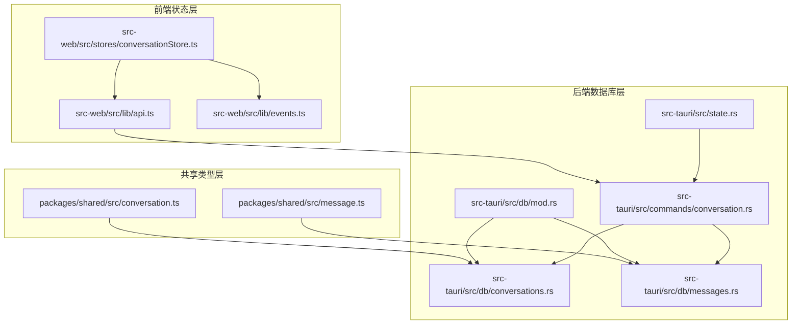
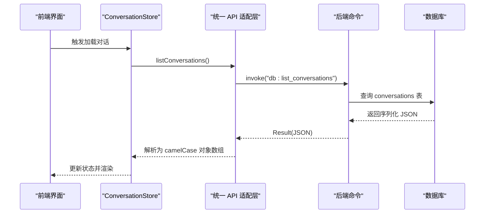
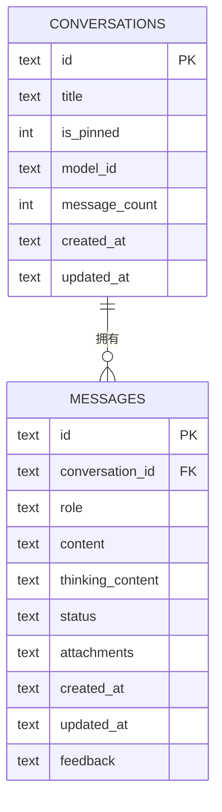
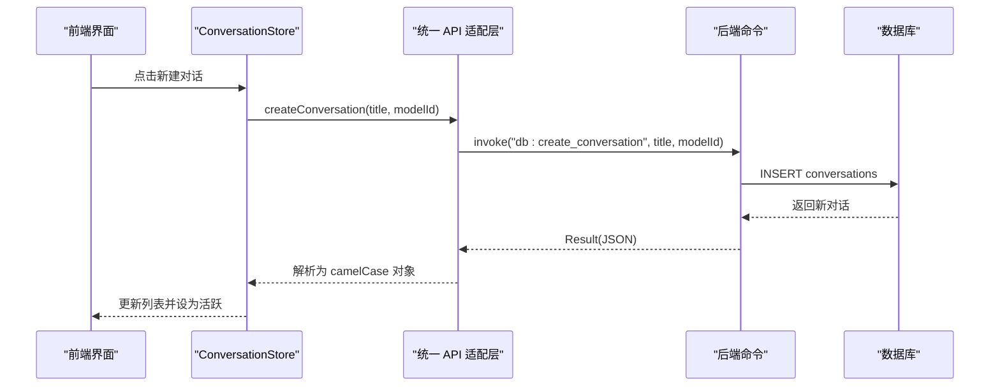
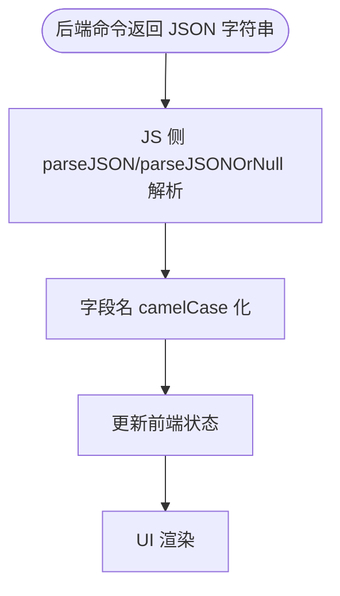
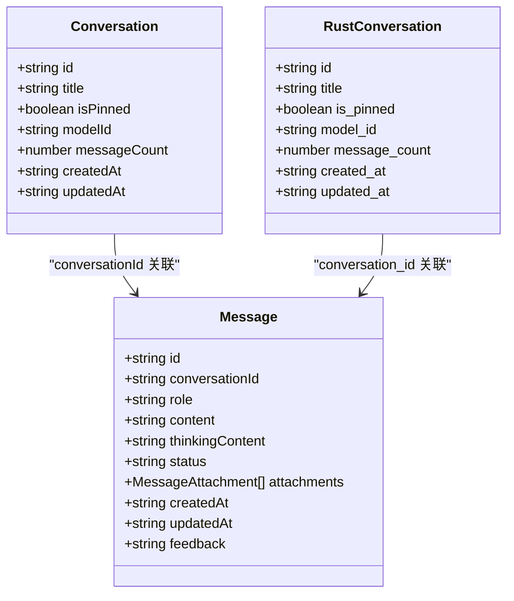

# 对话模型

<cite>
**本文引用的文件**
- [packages/shared/src/conversation.ts](file://packages/shared/src/conversation.ts)
- [packages/shared/src/message.ts](file://packages/shared/src/message.ts)
- [src-tauri/src/db/conversations.rs](file://src-tauri/src/db/conversations.rs)
- [src-tauri/src/db/messages.rs](file://src-tauri/src/db/messages.rs)
- [src-tauri/src/db/mod.rs](file://src-tauri/src/db/mod.rs)
- [src-tauri/src/commands/conversation.rs](file://src-tauri/src/commands/conversation.rs)
- [src-tauri/src/state.rs](file://src-tauri/src/state.rs)
- [src-web/src/stores/conversationStore.ts](file://src-web/src/stores/conversationStore.ts)
- [src-web/src/lib/api.ts](file://src-web/src/lib/api.ts)
- [src-web/src/lib/events.ts](file://src-web/src/lib/events.ts)
</cite>

## 目录
1. [简介](#简介)
2. [项目结构](#项目结构)
3. [核心组件](#核心组件)
4. [架构总览](#架构总览)
5. [详细组件分析](#详细组件分析)
6. [依赖关系分析](#依赖关系分析)
7. [性能考量](#性能考量)
8. [故障排查指南](#故障排查指南)
9. [结论](#结论)
10. [附录](#附录)

## 简介
本文件系统性梳理 CoSurf 对话模型的类型定义与实现，聚焦 Conversation 接口的完整规范，包括：
- 对话基本属性：id、title、modelId、messageCount、createdAt、updatedAt
- 状态管理标志位：isPinned
- 对话与消息的关系：通过 conversationId 建立一对多关联
- 前端状态管理与后端数据库存储的使用示例
- 序列化/反序列化与 IPC 传输格式
- 最佳实践与性能优化建议

## 项目结构
围绕对话模型的关键代码分布在以下层次：
- 共享类型层：定义 Conversation 与 Message 的 TypeScript 接口
- 后端数据库层：Rust 定义的 Conversation 结构体、SQL 迁移与命令
- 前端状态层：Zustand Store 管理对话列表、消息流式渲染与标题自动生成
- IPC 层：统一 API 适配层封装 invoke/on 事件，桥接前端与后端

图表来源
- [packages/shared/src/conversation.ts:1-14](file://packages/shared/src/conversation.ts#L1-L14)
- [packages/shared/src/message.ts:1-35](file://packages/shared/src/message.ts#L1-L35)
- [src-tauri/src/db/mod.rs:42-148](file://src-tauri/src/db/mod.rs#L42-L148)
- [src-tauri/src/db/conversations.rs:7-17](file://src-tauri/src/db/conversations.rs#L7-L17)
- [src-tauri/src/db/messages.rs:22-36](file://src-tauri/src/db/messages.rs#L22-L36)
- [src-tauri/src/commands/conversation.rs:1-73](file://src-tauri/src/commands/conversation.rs#L1-L73)
- [src-tauri/src/state.rs:9-23](file://src-tauri/src/state.rs#L9-L23)
- [src-web/src/stores/conversationStore.ts:1-365](file://src-web/src/stores/conversationStore.ts#L1-L365)
- [src-web/src/lib/api.ts:54-98](file://src-web/src/lib/api.ts#L54-L98)
- [src-web/src/lib/events.ts:14-35](file://src-web/src/lib/events.ts#L14-L35)

章节来源
- [packages/shared/src/conversation.ts:1-14](file://packages/shared/src/conversation.ts#L1-L14)
- [packages/shared/src/message.ts:1-35](file://packages/shared/src/message.ts#L1-L35)
- [src-tauri/src/db/mod.rs:42-148](file://src-tauri/src/db/mod.rs#L42-L148)
- [src-tauri/src/db/conversations.rs:7-17](file://src-tauri/src/db/conversations.rs#L7-L17)
- [src-tauri/src/db/messages.rs:22-36](file://src-tauri/src/db/messages.rs#L22-L36)
- [src-tauri/src/commands/conversation.rs:1-73](file://src-tauri/src/commands/conversation.rs#L1-L73)
- [src-tauri/src/state.rs:9-23](file://src-tauri/src/state.rs#L9-L23)
- [src-web/src/stores/conversationStore.ts:1-365](file://src-web/src/stores/conversationStore.ts#L1-L365)
- [src-web/src/lib/api.ts:54-98](file://src-web/src/lib/api.ts#L54-L98)
- [src-web/src/lib/events.ts:14-35](file://src-web/src/lib/events.ts#L14-L35)

## 核心组件
- Conversation 接口（共享类型）
  - id: 字符串，唯一标识
  - title: 字符串，对话标题
  - isPinned: 布尔，是否置顶
  - modelId: 字符串，所选模型标识
  - messageCount: 整数，该对话的消息数量
  - createdAt/updatedAt: 字符串，ISO 时间戳
- ConversationWithMessages 扩展接口：在 Conversation 基础上附加 messages 数组
- Message 接口：包含 conversationId、role、content、status、attachments、createdAt/updatedAt、feedback 等
- Rust Conversation 结构体：与数据库表结构对应，字段命名采用 snake_case 并通过 serde 转换为 camelCase

章节来源
- [packages/shared/src/conversation.ts:1-14](file://packages/shared/src/conversation.ts#L1-L14)
- [packages/shared/src/message.ts:14-26](file://packages/shared/src/message.ts#L14-L26)
- [src-tauri/src/db/conversations.rs:7-17](file://src-tauri/src/db/conversations.rs#L7-L17)
- [src-tauri/src/db/messages.rs:22-36](file://src-tauri/src/db/messages.rs#L22-L36)

## 架构总览
对话模型贯穿“前端状态管理—IPC—后端数据库”的完整链路：
- 前端通过 Zustand Store 管理对话列表与消息流式渲染
- 通过统一 API 适配层调用后端命令（Tauri invoke）
- 后端命令访问数据库，执行 CRUD 操作，并返回序列化结果
- Rust 结构体通过 serde 序列化为 JSON，JS 侧解析为 camelCase

图表来源
- [src-web/src/stores/conversationStore.ts:34-53](file://src-web/src/stores/conversationStore.ts#L34-L53)
- [src-web/src/lib/api.ts:56-57](file://src-web/src/lib/api.ts#L56-L57)
- [src-tauri/src/commands/conversation.rs:9-15](file://src-tauri/src/commands/conversation.rs#L9-L15)
- [src-tauri/src/db/conversations.rs:35-58](file://src-tauri/src/db/conversations.rs#L35-L58)

## 详细组件分析

### Conversation 接口规范
- 字段定义与语义
  - id: 唯一标识，用于关联消息与对话
  - title: 对话标题，支持自动生成与手动更新
  - isPinned: 置顶标志，影响排序优先级
  - modelId: 当前对话使用的模型标识
  - messageCount: 该对话的消息数量，用于统计与 UI 展示
  - createdAt/updatedAt: ISO 时间戳字符串，便于跨语言处理
- Rust 映射
  - 字段命名：snake_case（如 is_pinned、model_id、message_count、created_at、updated_at）
  - serde rename_all: camelCase，保证前后端一致
- 数据库约束
  - conversations 表主键为 id
  - 默认值：title 默认“New Conversation”，is_pinned 默认 0，model_id 默认空字符串，message_count 默认 0
  - 排序：按 is_pinned 降序、updated_at 降序

章节来源
- [packages/shared/src/conversation.ts:1-9](file://packages/shared/src/conversation.ts#L1-L9)
- [src-tauri/src/db/conversations.rs:7-17](file://src-tauri/src/db/conversations.rs#L7-L17)
- [src-tauri/src/db/mod.rs:44-52](file://src-tauri/src/db/mod.rs#L44-L52)

### 对话状态管理字段
- isPinned
  - 作用：控制对话在列表中的显示优先级
  - 使用场景：用户希望快速访问重要对话时置顶；列表查询时优先展示置顶对话
  - 更新方式：通过 update_conversation 请求更新 is_pinned 字段
- messageCount
  - 作用：统计对话消息数量，辅助 UI 展示与清理策略
  - 更新方式：消息创建后递增；删除消息后可考虑回退（当前实现由消息层维护）

章节来源
- [src-tauri/src/db/conversations.rs:28-32](file://src-tauri/src/db/conversations.rs#L28-L32)
- [src-tauri/src/db/conversations.rs:119-125](file://src-tauri/src/db/conversations.rs#L119-L125)

### 对话与消息的关系
- 外键关联
  - messages 表的 conversation_id 引用 conversations.id，删除对话时级联删除消息
- 关联查询
  - 列表消息：按 conversation_id 查询并按创建时间升序排列
  - 获取对话详情：同时返回对话与该对话下的所有消息
- 前端使用
  - Store 在切换活跃对话时加载对应消息
  - 发送消息时，先本地插入临时消息，再持久化并流式更新

图表来源
- [src-tauri/src/db/mod.rs:54-65](file://src-tauri/src/db/mod.rs#L54-L65)
- [src-tauri/src/db/messages.rs:65-94](file://src-tauri/src/db/messages.rs#L65-L94)

章节来源
- [src-tauri/src/db/mod.rs:64-65](file://src-tauri/src/db/mod.rs#L64-L65)
- [src-tauri/src/db/messages.rs:65-94](file://src-tauri/src/db/messages.rs#L65-L94)
- [src-web/src/stores/conversationStore.ts:55-62](file://src-web/src/stores/conversationStore.ts#L55-L62)

### 前端状态管理与后端存储示例
- 加载对话列表
  - Store 调用 db.listConversations，解析 JSON，设置 activeConversationId 并加载第一条对话的消息
- 创建对话
  - Store 调用 db.createConversation，插入新对话并设为活跃
- 删除对话
  - Store 调用 db.deleteConversation，过滤本地状态并重置活跃对话
- 发送消息
  - Store 本地插入用户消息与临时助手消息，持久化后监听 ai:stream-chunk 事件增量更新
  - 流结束后标记消息完成并触发标题自动生成

图表来源
- [src-web/src/stores/conversationStore.ts:69-80](file://src-web/src/stores/conversationStore.ts#L69-L80)
- [src-web/src/lib/api.ts:62-63](file://src-web/src/lib/api.ts#L62-L63)
- [src-tauri/src/commands/conversation.rs:27-36](file://src-tauri/src/commands/conversation.rs#L27-L36)
- [src-tauri/src/db/conversations.rs:80-93](file://src-tauri/src/db/conversations.rs#L80-L93)

章节来源
- [src-web/src/stores/conversationStore.ts:34-101](file://src-web/src/stores/conversationStore.ts#L34-L101)
- [src-web/src/lib/api.ts:56-72](file://src-web/src/lib/api.ts#L56-L72)
- [src-tauri/src/commands/conversation.rs:8-72](file://src-tauri/src/commands/conversation.rs#L8-L72)

### 序列化与反序列化、IPC 传输格式
- Rust 结构体到 JSON
  - Conversation/Messages 通过 serde Serialize/Deserialize
  - serde rename_all: camelCase，确保 JS 侧字段名一致
- JS 侧解析
  - API 适配层对 invoke 返回的 JSON 字符串进行 parseJSON 解析
  - parseJSONOrNull 支持 null 场景
- IPC 事件
  - ai:stream-chunk、ai:stream-error、ai:tool-call-start 等事件通过 window.electronAPI.on 监听
  - Store 在收到事件后增量更新消息内容与状态

图表来源
- [src-web/src/lib/api.ts:25-49](file://src-web/src/lib/api.ts#L25-L49)
- [src-tauri/src/db/conversations.rs:7-17](file://src-tauri/src/db/conversations.rs#L7-L17)
- [src-tauri/src/db/messages.rs:22-36](file://src-tauri/src/db/messages.rs#L22-L36)

章节来源
- [src-web/src/lib/api.ts:13-49](file://src-web/src/lib/api.ts#L13-L49)
- [src-web/src/lib/events.ts:51-56](file://src-web/src/lib/events.ts#L51-L56)
- [src-tauri/src/db/conversations.rs:7-17](file://src-tauri/src/db/conversations.rs#L7-L17)
- [src-tauri/src/db/messages.rs:22-36](file://src-tauri/src/db/messages.rs#L22-L36)

### 标题自动生成与最佳实践
- 自动标题规则
  - 当对话轮数达到阈值且标题仍为默认值或与第一条消息内容相似时，触发标题生成
  - 使用前若干条消息拼接上下文，调用 AI 生成标题并更新数据库与本地状态
- 最佳实践
  - 保持 createdAt/updatedAt 为 ISO 字符串，便于跨语言比较与排序
  - 使用 isPinned 控制排序，避免频繁全量刷新
  - 消息流式更新时区分 thinkingContent 与 content，提升用户体验
  - 严格外键约束与级联删除，确保数据一致性

章节来源
- [src-web/src/stores/conversationStore.ts:306-363](file://src-web/src/stores/conversationStore.ts#L306-L363)
- [src-tauri/src/db/mod.rs:64-65](file://src-tauri/src/db/mod.rs#L64-L65)

## 依赖关系分析
- 前端 Store 依赖
  - API 适配层：封装 invoke/on，屏蔽平台差异
  - 事件系统：统一事件常量与监听器
- 后端命令依赖
  - Database：提供 CRUD 实现与迁移
  - AppState：持有数据库实例与全局状态
- 类型一致性
  - 共享类型与 Rust 结构体通过 serde camelCase 保持一致

图表来源
- [packages/shared/src/conversation.ts:1-14](file://packages/shared/src/conversation.ts#L1-L14)
- [packages/shared/src/message.ts:14-26](file://packages/shared/src/message.ts#L14-L26)
- [src-tauri/src/db/conversations.rs:7-17](file://src-tauri/src/db/conversations.rs#L7-L17)
- [src-tauri/src/db/messages.rs:22-36](file://src-tauri/src/db/messages.rs#L22-L36)

章节来源
- [src-web/src/lib/api.ts:54-98](file://src-web/src/lib/api.ts#L54-L98)
- [src-tauri/src/state.rs:9-23](file://src-tauri/src/state.rs#L9-L23)
- [src-tauri/src/db/mod.rs:42-148](file://src-tauri/src/db/mod.rs#L42-L148)

## 性能考量
- 数据库索引
  - messages.conversation_id 建有索引，加速按对话查询
  - history.visited_at 建有索引，加速历史查询
- 查询排序
  - 对话列表按 is_pinned 降序、updated_at 降序，减少 UI 二次排序成本
- 流式渲染
  - 通过事件增量更新消息内容，避免整页重绘
- 序列化开销
  - 仅在 IPC 边界进行 JSON 解析，前端状态内使用对象引用，降低拷贝成本
- 级联删除
  - 删除对话时自动清理消息，避免垃圾数据累积

章节来源
- [src-tauri/src/db/mod.rs:67-93](file://src-tauri/src/db/mod.rs#L67-L93)
- [src-tauri/src/db/conversations.rs:35-58](file://src-tauri/src/db/conversations.rs#L35-L58)
- [src-web/src/stores/conversationStore.ts:173-242](file://src-web/src/stores/conversationStore.ts#L173-L242)

## 故障排查指南
- 对话未显示或为空
  - 检查 db.listConversations 是否返回 JSON，确认 parseJSON 解析成功
  - 确认 activeConversationId 是否被正确设置
- 消息不更新或卡顿
  - 检查 ai:stream-chunk 事件是否被监听与过滤（仅处理当前对话）
  - 确认 appendStreamDelta 逻辑是否正确区分 thinkingContent 与 content
- 标题未自动生成
  - 检查 checkAndUpdateTitle 条件：轮数阈值、标题是否为默认值或与第一条消息相似
  - 确认 AI 生成标题接口可用且返回有效字符串
- 数据库异常
  - 检查 migrations 是否成功执行，确认 conversations 与 messages 表结构一致
  - 确认外键约束与级联删除生效

章节来源
- [src-web/src/lib/api.ts:25-49](file://src-web/src/lib/api.ts#L25-L49)
- [src-web/src/lib/events.ts:51-56](file://src-web/src/lib/events.ts#L51-L56)
- [src-web/src/stores/conversationStore.ts:173-242](file://src-web/src/stores/conversationStore.ts#L173-L242)
- [src-tauri/src/db/mod.rs:42-148](file://src-tauri/src/db/mod.rs#L42-L148)

## 结论
CoSurf 的对话模型以清晰的类型定义与严格的数据库约束为基础，结合前端 Store 的高效状态管理与后端命令的可靠执行，实现了从对话创建、消息流式渲染到标题自动生成的完整闭环。通过 camelCase 序列化与统一 IPC 适配层，确保了跨语言的一致性与可维护性。遵循本文的最佳实践与性能建议，可在复杂场景下保持良好的用户体验与系统稳定性。

## 附录
- 字段对照表（TS/Rust/DB）
  - id: string/string/text
  - title: string/string/text
  - isPinned: boolean/bool/int（is_pinned）
  - modelId: string/string/text（model_id）
  - messageCount: number/i64/int（message_count）
  - createdAt/updatedAt: string/string/text（created_at/updated_at）
- 常用命令与事件
  - db:list_conversations/get_conversation/create_conversation/update_conversation/delete_conversation
  - db:list_messages/get_message/create_message/update_message/delete_message
  - ai:stream-chunk、ai:stream-error、ai:tool-call-start