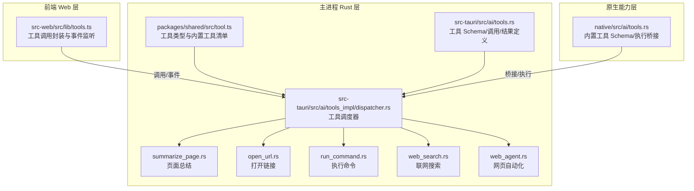
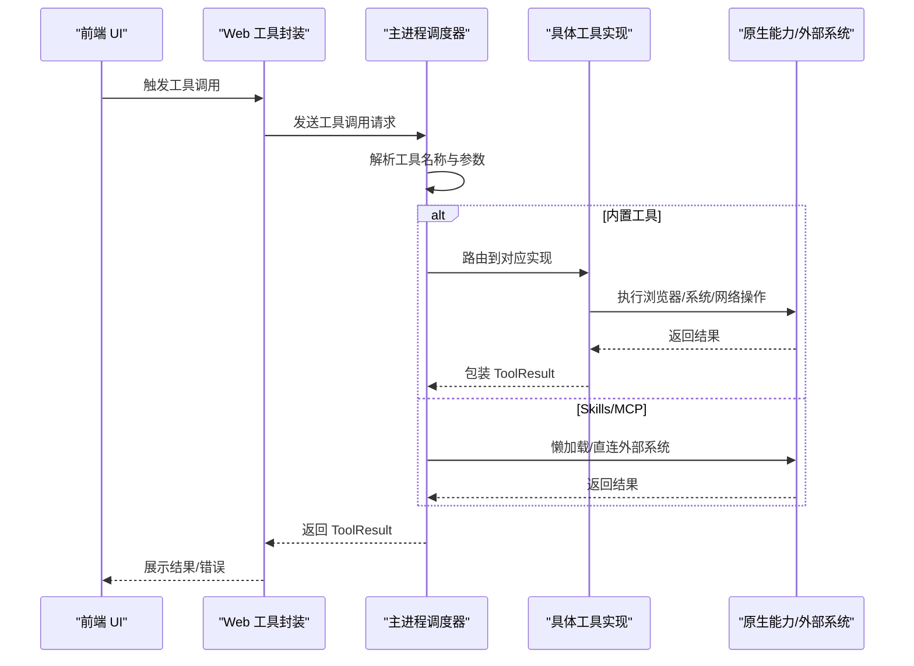
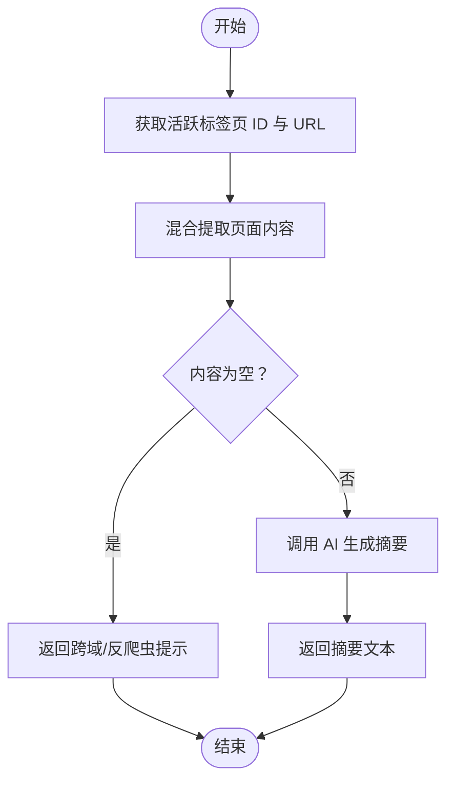
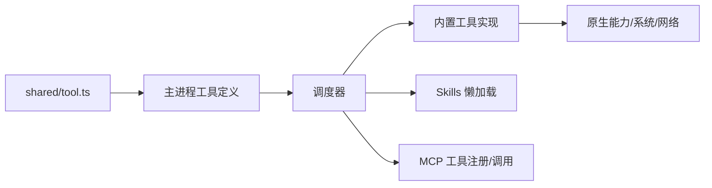

# 工具模型

<cite>
**本文引用的文件**
- [packages/shared/src/tool.ts](file://packages/shared/src/tool.ts)
- [src-tauri/src/ai/tools.rs](file://src-tauri/src/ai/tools.rs)
- [native/src/ai/tools.rs](file://native/src/ai/tools.rs)
- [src-tauri/src/ai/tools_impl/dispatcher.rs](file://src-tauri/src/ai/tools_impl/dispatcher.rs)
- [src-tauri/src/ai/tools_impl/web_search.rs](file://src-tauri/src/ai/tools_impl/web_search.rs)
- [src-tauri/src/ai/tools_impl/run_command.rs](file://src-tauri/src/ai/tools_impl/run_command.rs)
- [src-tauri/src/ai/tools_impl/open_url.rs](file://src-tauri/src/ai/tools_impl/open_url.rs)
- [src-tauri/src/ai/tools_impl/summarize_page.rs](file://src-tauri/src/ai/tools_impl/summarize_page.rs)
- [src-tauri/src/ai/tools_impl/web_agent.rs](file://src-tauri/src/ai/tools_impl/web_agent.rs)
- [src-web/src/lib/tools.ts](file://src-web/src/lib/tools.ts)
- [examples/skills/web-summarizer/SKILL.md](file://examples/skills/web-summarizer/SKILL.md)
- [examples/skills/python-calculator/SKILL.md](file://examples/skills/python-calculator/SKILL.md)
</cite>

## 目录
1. [简介](#简介)
2. [项目结构](#项目结构)
3. [核心组件](#核心组件)
4. [架构总览](#架构总览)
5. [详细组件分析](#详细组件分析)
6. [依赖分析](#依赖分析)
7. [性能考量](#性能考量)
8. [故障排查指南](#故障排查指南)
9. [结论](#结论)
10. [附录](#附录)

## 简介
本文件系统性梳理 CoSurf 工具模型的类型定义与实现，覆盖工具接口、工具分类、工具配置、内置工具参数与返回格式、元数据信息、执行状态与错误处理、与技能系统（Skills）及 MCP（Model Context Protocol）的集成关系、安全与权限控制机制，并提供扩展开发指南与最佳实践。

## 项目结构
工具模型横跨前端 Web 层、主进程 Rust 层与原生能力层，形成“类型定义共享 + 主进程调度 + 原生实现”的三层架构：
- 类型定义共享：前端与主进程共享工具元数据与配置类型，保证一致性。
- 主进程调度：统一解析工具调用、路由到具体实现模块或外部系统（MCP、Skills）。
- 原生实现：针对浏览器自动化、系统命令执行、页面内容提取等进行高性能实现。

图表来源
- [src-web/src/lib/tools.ts:1-125](file://src-web/src/lib/tools.ts#L1-L125)
- [packages/shared/src/tool.ts:1-88](file://packages/shared/src/tool.ts#L1-L88)
- [src-tauri/src/ai/tools.rs:1-621](file://src-tauri/src/ai/tools.rs#L1-L621)
- [src-tauri/src/ai/tools_impl/dispatcher.rs:1-238](file://src-tauri/src/ai/tools_impl/dispatcher.rs#L1-L238)
- [src-tauri/src/ai/tools_impl/summarize_page.rs:1-428](file://src-tauri/src/ai/tools_impl/summarize_page.rs#L1-L428)
- [src-tauri/src/ai/tools_impl/open_url.rs:1-146](file://src-tauri/src/ai/tools_impl/open_url.rs#L1-L146)
- [src-tauri/src/ai/tools_impl/run_command.rs:1-161](file://src-tauri/src/ai/tools_impl/run_command.rs#L1-L161)
- [src-tauri/src/ai/tools_impl/web_search.rs:1-179](file://src-tauri/src/ai/tools_impl/web_search.rs#L1-L179)
- [src-tauri/src/ai/tools_impl/web_agent.rs:1-79](file://src-tauri/src/ai/tools_impl/web_agent.rs#L1-L79)
- [native/src/ai/tools.rs:1-352](file://native/src/ai/tools.rs#L1-L352)

章节来源
- [packages/shared/src/tool.ts:1-88](file://packages/shared/src/tool.ts#L1-L88)
- [src-tauri/src/ai/tools.rs:1-621](file://src-tauri/src/ai/tools.rs#L1-L621)
- [src-tauri/src/ai/tools_impl/dispatcher.rs:1-238](file://src-tauri/src/ai/tools_impl/dispatcher.rs#L1-L238)
- [src-web/src/lib/tools.ts:1-125](file://src-web/src/lib/tools.ts#L1-L125)

## 核心组件
- 工具分类枚举：用于标识工具所属类别，便于 UI 分类与筛选。
- 工具定义接口：描述工具的元数据（名称、描述、图标、分类、启用状态、配置模式等）。
- 工具配置字段：描述工具的可配置项（类型、标签、默认值、选项、是否必填、是否密钥等）。
- 工具实例：描述某工具在当前会话中的启用状态与配置值。
- 内置工具清单：包含默认内置工具及其配置模式（如联网搜索的 API Key、引擎选择等）。

章节来源
- [packages/shared/src/tool.ts:1-88](file://packages/shared/src/tool.ts#L1-L88)

## 架构总览
工具模型采用“主进程统一调度 + 原生能力执行 + 外部系统集成”的设计：
- 主进程负责：
  - 生成工具 Schema（OpenAI Function Calling 格式）。
  - 统一调度工具调用，区分内置工具、Skills、MCP。
  - 错误处理与结果包装。
- 原生能力负责：
  - 浏览器自动化（打开链接、页面内容提取、网页自动化）。
  - 系统命令执行（安全限制、超时、输出截断）。
  - 联网搜索（API Key 管理、请求构造、结果解析）。
- 外部系统集成：
  - Skills：按需懒加载技能内容，指导 Agent 下一步动作。
  - MCP：动态拉取工具清单，注册为独立函数，直接调用。

图表来源
- [src-tauri/src/ai/tools_impl/dispatcher.rs:11-55](file://src-tauri/src/ai/tools_impl/dispatcher.rs#L11-L55)
- [src-tauri/src/ai/tools.rs:184-194](file://src-tauri/src/ai/tools.rs#L184-L194)
- [native/src/ai/tools.rs:193-242](file://native/src/ai/tools.rs#L193-L242)

## 详细组件分析

### 类型定义与元数据
- 工具分类（ToolCategory）：webpage、knowledge、search、custom。
- 工具定义（ToolDefinition）：包含 id、name、description、category、icon、enabled、configSchema。
- 工具配置字段（ToolConfigField）：type、label、description、defaultValue、options、required、secret。
- 工具实例（ToolInstance）：toolId、enabled、config。
- 内置工具清单（BUILT_IN_TOOLS）：包含默认内置工具与其配置模式（如联网搜索的 API Key、引擎选择）。

章节来源
- [packages/shared/src/tool.ts:1-88](file://packages/shared/src/tool.ts#L1-L88)

### 工具 Schema 与参数规范
- 主进程内置工具枚举（BuiltInTool）与参数 Schema（OpenAI Function Calling 格式）：
  - summarize_page：max_length（整数，字符数上限）。
  - web_agent：action（枚举 click/fill/select/scroll/wait）、selector（CSS 选择器，必填）、value（填写值，仅 fill 需要）。
  - open_url：url（必须以 http:// 或 https:// 开头，必填）。
  - translate：target_language（目标语言，如 zh/en/ja）。
  - export_markdown：无参数。
  - web_search：query（必填）、engine_type（枚举 Generic/News/Academic，默认 Generic）、time_range（枚举 OneDay/OneWeek/OneMonth/OneYear/NoLimit，默认 OneWeek）、max_results（1-20，默认 5）。
  - run_command：command（必填）、working_dir（可选）、timeout（1-120，默认 30）。

章节来源
- [src-tauri/src/ai/tools.rs:38-195](file://src-tauri/src/ai/tools.rs#L38-L195)
- [native/src/ai/tools.rs:34-134](file://native/src/ai/tools.rs#L34-L134)

### 工具执行与状态
- 工具调用结构（ToolCall）：id、name、arguments。
- 工具结果结构（ToolResult）：tool_call_id、output、success。
- 执行状态：
  - 成功：success=true，output 为执行结果文本。
  - 失败：success=false，output 为错误信息。
- 特殊桥接：部分工具（如 open_url、web_agent、summarize_page、translate、export_markdown）需要主进程桥接前端能力，返回特定标记以便上层等待执行结果。

章节来源
- [src-tauri/src/ai/tools.rs:4-17](file://src-tauri/src/ai/tools.rs#L4-L17)
- [native/src/ai/tools.rs:7-21](file://native/src/ai/tools.rs#L7-L21)
- [native/src/ai/tools.rs:193-242](file://native/src/ai/tools.rs#L193-L242)

### 内置工具详解

#### 网页总结（summarize_page）
- 功能：提取当前页面内容并使用 AI 生成摘要。
- 参数：max_length（默认 500）。
- 执行策略：混合提取（iframe -> Playwright -> HTTP fallback），若均失败返回友好提示。
- 结果：成功返回摘要文本；失败返回错误提示（含跨域/反爬虫说明）。

图表来源
- [src-tauri/src/ai/tools_impl/summarize_page.rs:16-55](file://src-tauri/src/ai/tools_impl/summarize_page.rs#L16-L55)
- [src-tauri/src/ai/tools_impl/summarize_page.rs:140-202](file://src-tauri/src/ai/tools_impl/summarize_page.rs#L140-L202)
- [src-tauri/src/ai/tools_impl/summarize_page.rs:358-427](file://src-tauri/src/ai/tools_impl/summarize_page.rs#L358-L427)

章节来源
- [src-tauri/src/ai/tools_impl/summarize_page.rs:1-428](file://src-tauri/src/ai/tools_impl/summarize_page.rs#L1-L428)

#### 打开链接（open_url）
- 功能：在新标签页打开指定 URL。
- 参数：url（必须以 http:// 或 https:// 开头，必填）。
- 安全与去重：校验 URL 格式；5 秒内重复请求直接提示无需重复打开。
- 结果：成功返回“新标签页已打开”消息；失败返回错误信息。

章节来源
- [src-tauri/src/ai/tools_impl/open_url.rs:16-100](file://src-tauri/src/ai/tools_impl/open_url.rs#L16-L100)

#### 执行命令（run_command）
- 功能：在系统终端执行 shell 命令，捕获 stdout/stderr。
- 参数：command（必填）、working_dir（可选）、timeout（1-120，默认 30）。
- 安全机制：黑名单拦截危险命令；超时强制终止；输出截断（最大 8000 字符）；隐藏窗口（Windows）。
- 结果：成功返回 stdout/stderr/exit_code；失败返回错误信息。

章节来源
- [src-tauri/src/ai/tools_impl/run_command.rs:34-161](file://src-tauri/src/ai/tools_impl/run_command.rs#L34-L161)

#### 联网搜索（web_search）
- 功能：使用阿里云 IQS API 进行网络搜索。
- 参数：query（必填）、engine_type（默认 Generic）、time_range（默认 OneWeek）、max_results（1-20，默认 5）。
- 配置：需要在设置中配置 ALIYUN_IQS_API_KEY。
- 结果：成功返回格式化后的搜索结果；失败返回错误码与错误文本。

章节来源
- [src-tauri/src/ai/tools_impl/web_search.rs:14-179](file://src-tauri/src/ai/tools_impl/web_search.rs#L14-L179)

#### 网页自动化（web_agent）
- 功能：在当前页面执行自动化操作（点击、填写表单等）。
- 参数：action（必填，枚举 click/fill/select/scroll/wait）、selector（必填）、value（仅 fill 需要）。
- 结果：返回操作结果文本。

章节来源
- [src-tauri/src/ai/tools_impl/web_agent.rs:12-79](file://src-tauri/src/ai/tools_impl/web_agent.rs#L12-L79)

### 技能系统（Skills）集成
- 工具命名约定：skill_{id}。
- 懒加载机制：调用 skill_{id} 时，仅返回 SKILL.md 的完整内容，交由 Agent Loop 决策下一步（可调用内置工具、MCP 工具或脚本）。
- 示例技能：
  - 网页内容总结：包含打开链接、总结页面、翻译、导出 Markdown 的步骤与参数示例。
  - Python 计算器：数学计算助手，支持基本运算、幂次、三角函数、平方根等。

章节来源
- [src-tauri/src/ai/tools.rs:227-272](file://src-tauri/src/ai/tools.rs#L227-L272)
- [native/src/ai/tools.rs:297-326](file://native/src/ai/tools.rs#L297-L326)
- [examples/skills/web-summarizer/SKILL.md:1-57](file://examples/skills/web-summarizer/SKILL.md#L1-L57)
- [examples/skills/python-calculator/SKILL.md:1-39](file://examples/skills/python-calculator/SKILL.md#L1-L39)

### MCP（Model Context Protocol）集成
- 工具命名约定：mcp_{server_safe_name}_{tool_name}。
- 动态发现：启动时连接各 MCP Server，拉取 tools/list，注册为独立 function。
- 直接调用：Agent Loop 中直接调用 mcp_{server}_{tool}，通过 McpClient 调用对应工具。
- 传输模式：HTTP/SSE/Stdio（stdio 模式在主进程 Agent Loop 中暂不支持，仅用于工具清单拉取）。

章节来源
- [src-tauri/src/ai/tools.rs:274-454](file://src-tauri/src/ai/tools.rs#L274-L454)
- [src-tauri/src/ai/tools.rs:456-620](file://src-tauri/src/ai/tools.rs#L456-L620)

### 前端工具封装与事件交互
- 页面内容提取结果与错误事件监听。
- 工具执行器（ToolExecutor）：封装页面总结与网页操作的调用流程，处理错误并返回结构化结果。

章节来源
- [src-web/src/lib/tools.ts:1-125](file://src-web/src/lib/tools.ts#L1-L125)

## 依赖分析
- 类型共享：前端与主进程共享工具类型与内置工具清单，确保 Schema 一致。
- 调度耦合：主进程调度器集中管理工具路由，降低上层复杂度。
- 外部依赖：MCP Server、Skills 目录、浏览器自动化（Playwright）、网络请求（reqwest）。

图表来源
- [packages/shared/src/tool.ts:1-88](file://packages/shared/src/tool.ts#L1-L88)
- [src-tauri/src/ai/tools.rs:197-225](file://src-tauri/src/ai/tools.rs#L197-L225)
- [src-tauri/src/ai/tools_impl/dispatcher.rs:11-55](file://src-tauri/src/ai/tools_impl/dispatcher.rs#L11-L55)

章节来源
- [src-tauri/src/ai/tools.rs:197-225](file://src-tauri/src/ai/tools.rs#L197-L225)
- [src-tauri/src/ai/tools_impl/dispatcher.rs:11-55](file://src-tauri/src/ai/tools_impl/dispatcher.rs#L11-L55)

## 性能考量
- 超时控制：命令执行默认 30 秒，MCP 工具拉取默认 15 秒，避免阻塞。
- 输出截断：命令输出最大 8000 字符，防止超长文本影响性能与稳定性。
- 混合提取策略：优先 iframe，失败再回退到 Playwright 与 HTTP 请求，兼顾速度与成功率。
- 事件等待：前端与主进程间事件等待设置合理超时，避免无限等待。

## 故障排查指南
- 工具未知：检查工具名称是否正确，是否为内置工具、Skills 或 MCP 工具。
- open_url 失败：确认 URL 以 http:// 或 https:// 开头；检查主窗口是否存在；查看重复请求去重逻辑。
- run_command 失败：检查命令是否在黑名单；确认超时与工作目录；查看 stdout/stderr 截断情况。
- web_search 失败：确认 ALIYUN_IQS_API_KEY 是否配置；检查网络与 API 返回状态；核对请求体字段。
- summarize_page 失败：确认页面非 about:blank；检查跨域/反爬虫限制；查看混合提取策略回退路径。
- MCP 工具不可用：确认 MCP Server 是否启用且在线；检查注册表中是否存在对应工具；确认传输模式支持。

章节来源
- [src-tauri/src/ai/tools_impl/dispatcher.rs:50-54](file://src-tauri/src/ai/tools_impl/dispatcher.rs#L50-L54)
- [src-tauri/src/ai/tools_impl/open_url.rs:33-38](file://src-tauri/src/ai/tools_impl/open_url.rs#L33-L38)
- [src-tauri/src/ai/tools_impl/run_command.rs:56-67](file://src-tauri/src/ai/tools_impl/run_command.rs#L56-L67)
- [src-tauri/src/ai/tools_impl/web_search.rs:56-62](file://src-tauri/src/ai/tools_impl/web_search.rs#L56-L62)
- [src-tauri/src/ai/tools_impl/summarize_page.rs:36-44](file://src-tauri/src/ai/tools_impl/summarize_page.rs#L36-L44)
- [src-tauri/src/ai/tools.rs:414-413](file://src-tauri/src/ai/tools.rs#L414-L413)

## 结论
CoSurf 工具模型通过清晰的类型定义、统一的调度机制与完善的错误处理，实现了从浏览器自动化、系统命令执行到外部系统集成的全链路工具能力。内置工具参数规范明确，安全机制完备，与 Skills 和 MCP 的集成使得工具生态可扩展、可演进。建议在扩展新工具时遵循现有 Schema 与安全约束，确保一致的用户体验与系统稳定性。

## 附录

### 工具类型约束与最佳实践
- 类型约束
  - 必填参数：在 Schema 中标注 required。
  - 枚举参数：限定取值范围，避免无效输入。
  - 数值范围：设置最小/最大值与默认值。
  - 密钥字段：使用 secret 标记，避免明文存储。
- 最佳实践
  - 参数校验：在实现层对参数进行二次校验。
  - 超时与重试：对网络与外部系统调用设置超时与有限重试。
  - 安全隔离：命令执行与浏览器操作严格限制权限与资源。
  - 结果格式化：统一输出结构，便于前端展示与日志追踪。
  - 文档与示例：为每个工具提供参数说明与使用示例。

章节来源
- [packages/shared/src/tool.ts:13-21](file://packages/shared/src/tool.ts#L13-L21)
- [src-tauri/src/ai/tools.rs:63-182](file://src-tauri/src/ai/tools.rs#L63-L182)
- [src-tauri/src/ai/tools_impl/run_command.rs:16-32](file://src-tauri/src/ai/tools_impl/run_command.rs#L16-L32)