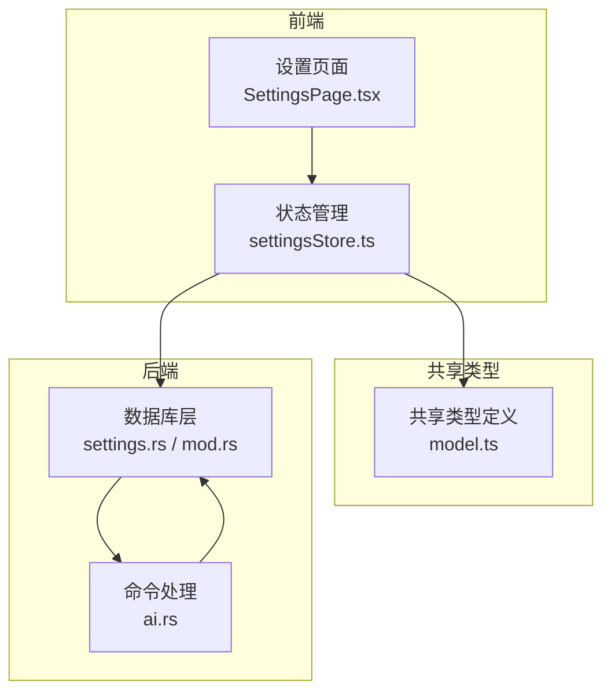
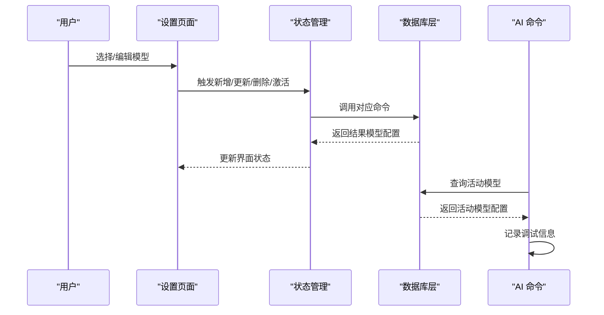
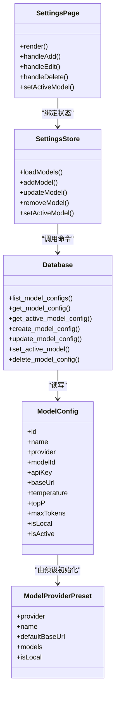

# 模型配置

<cite>
**本文引用的文件**
- [packages/shared/src/model.ts](file://packages/shared/src/model.ts)
- [src-web/src/components/settings/SettingsPage.tsx](file://src-web/src/components/settings/SettingsPage.tsx)
- [src-web/src/stores/settingsStore.ts](file://src-web/src/stores/settingsStore.ts)
- [src-tauri/src/db/settings.rs](file://src-tauri/src/db/settings.rs)
- [src-tauri/src/commands/ai.rs](file://src-tauri/src/commands/ai.rs)
- [native/src/db/mod.rs](file://native/src/db/mod.rs)
- [src-web/src/lib/mock.ts](file://src-web/src/lib/mock.ts)
</cite>

## 目录
1. [简介](#简介)
2. [项目结构](#项目结构)
3. [核心组件](#核心组件)
4. [架构总览](#架构总览)
5. [详细组件分析](#详细组件分析)
6. [依赖关系分析](#依赖关系分析)
7. [性能考量](#性能考量)
8. [故障排查指南](#故障排查指南)
9. [结论](#结论)
10. [附录](#附录)

## 简介
本文件面向 CoSurf 的 AI 模型配置体系，系统性梳理类型定义、配置项、提供商支持、参数含义与取值范围、模型切换与验证规则、设置页面的展示与编辑流程、配置变更生效机制，以及安全与隐私保护要点。目标是帮助开发者与使用者快速理解并正确使用模型配置功能。

## 项目结构
模型配置涉及前端设置页面、状态管理、数据库层与后端命令处理，形成“设置页面 → 状态管理 → 数据库层 → 命令处理”的链路。共享类型定义位于 packages/shared，前端 UI 在 src-web，后端逻辑在 src-tauri 与 native。

图表来源
- [src-web/src/components/settings/SettingsPage.tsx:276-362](file://src-web/src/components/settings/SettingsPage.tsx#L276-L362)
- [src-web/src/stores/settingsStore.ts:41-99](file://src-web/src/stores/settingsStore.ts#L41-L99)
- [src-tauri/src/db/settings.rs:1-200](file://src-tauri/src/db/settings.rs#L1-L200)
- [src-tauri/src/commands/ai.rs:37-77](file://src-tauri/src/commands/ai.rs#L37-L77)
- [native/src/db/mod.rs:100-131](file://native/src/db/mod.rs#L100-L131)

章节来源
- [packages/shared/src/model.ts:1-104](file://packages/shared/src/model.ts#L1-L104)
- [src-web/src/components/settings/SettingsPage.tsx:276-362](file://src-web/src/components/settings/SettingsPage.tsx#L276-L362)
- [src-web/src/stores/settingsStore.ts:41-99](file://src-web/src/stores/settingsStore.ts#L41-L99)
- [src-tauri/src/db/settings.rs:1-200](file://src-tauri/src/db/settings.rs#L1-L200)
- [src-tauri/src/commands/ai.rs:37-77](file://src-tauri/src/commands/ai.rs#L37-L77)
- [native/src/db/mod.rs:100-131](file://native/src/db/mod.rs#L100-L131)

## 核心组件
- 共享类型定义：统一的 ModelProvider 与 ModelConfig 接口，以及提供商预设集合 MODEL_PROVIDER_PRESETS。
- 设置页面：提供模型列表、新增/编辑表单、参数输入控件、激活模型操作。
- 状态管理：加载模型、设置活动模型、增删改模型。
- 数据库层：持久化模型配置、查询活动模型、更新与删除。
- 命令处理：在 AI 流程中读取当前活动模型配置并进行日志输出。

章节来源
- [packages/shared/src/model.ts:1-104](file://packages/shared/src/model.ts#L1-L104)
- [src-web/src/components/settings/SettingsPage.tsx:276-362](file://src-web/src/components/settings/SettingsPage.tsx#L276-L362)
- [src-web/src/stores/settingsStore.ts:100-159](file://src-web/src/stores/settingsStore.ts#L100-L159)
- [src-tauri/src/db/settings.rs:154-339](file://src-tauri/src/db/settings.rs#L154-L339)
- [src-tauri/src/commands/ai.rs:37-77](file://src-tauri/src/commands/ai.rs#L37-L77)

## 架构总览
模型配置在运行时遵循以下流程：
- 用户在设置页面查看/编辑模型列表。
- 前端状态管理调用数据库命令，写入或更新模型配置。
- 数据库层持久化到 SQLite 表 model_configs。
- 后端命令在执行 AI 请求前读取活动模型配置，并打印调试信息。

图表来源
- [src-web/src/components/settings/SettingsPage.tsx:276-362](file://src-web/src/components/settings/SettingsPage.tsx#L276-L362)
- [src-web/src/stores/settingsStore.ts:100-159](file://src-web/src/stores/settingsStore.ts#L100-L159)
- [src-tauri/src/db/settings.rs:217-247](file://src-tauri/src/db/settings.rs#L217-L247)
- [src-tauri/src/commands/ai.rs:37-77](file://src-tauri/src/commands/ai.rs#L37-L77)

## 详细组件分析

### 类型定义与提供商支持
- ModelProvider：枚举所有受支持的提供商标识，包括 openai、anthropic、google、zhipu、moonshot、deepseek、doubao、qwen、ollama、custom。
- ModelConfig：描述模型配置的核心字段，包括 id、name、provider、modelId、apiKey、baseUrl、temperature、topP、maxTokens、isLocal、isActive。
- ModelProviderPreset：提供商预设，包含默认 Base URL、可用模型列表与是否本地模型标记。
- MODEL_PROVIDER_PRESETS：内置的提供商预设集合，覆盖多家主流厂商及本地推理引擎。

章节来源
- [packages/shared/src/model.ts:1-104](file://packages/shared/src/model.ts#L1-L104)

### 设置页面与编辑流程
- 模型列表展示：显示每个模型的名称、提供商、模型 ID、本地/非本地标记；点击可激活该模型。
- 新增/编辑表单：包含提供商选择、显示名称、模型 ID、API Key、Base URL、温度、Top P、最大 Token、本地模型勾选等。
- 参数输入控件：Temperature、Top P、Max Tokens 分别限制了最小/最大值与步长，确保合理范围。
- 表单提交：根据是否编辑决定调用新增或更新命令，并自动填充默认值（如基于提供商预设）。

章节来源
- [src-web/src/components/settings/SettingsPage.tsx:276-362](file://src-web/src/components/settings/SettingsPage.tsx#L276-L362)
- [src-web/src/components/settings/SettingsPage.tsx:364-590](file://src-web/src/components/settings/SettingsPage.tsx#L364-L590)
- [src-web/src/components/settings/SettingsPage.tsx:514-557](file://src-web/src/components/settings/SettingsPage.tsx#L514-L557)

### 状态管理与数据库交互
- 加载模型：从数据库读取模型列表与活动模型 ID，初始化前端状态。
- 设置活动模型：调用数据库命令将某模型设为活动模型，同时更新前端状态。
- 新增/更新/删除模型：封装数据库命令，返回最新模型配置并同步到前端列表。

章节来源
- [src-web/src/stores/settingsStore.ts:41-99](file://src-web/src/stores/settingsStore.ts#L41-L99)
- [src-web/src/stores/settingsStore.ts:100-159](file://src-web/src/stores/settingsStore.ts#L100-L159)

### 数据库层与默认值
- 表结构：model_configs 包含 id、name、provider、model_id、api_key、base_url、temperature、top_p、max_tokens、is_local、is_active。
- 默认值：temperature 默认 0.7，top_p 默认 1.0，max_tokens 默认 4096。
- 命令实现：列出模型、获取单个模型、获取活动模型、创建、更新、设置活动、删除。

章节来源
- [native/src/db/mod.rs:100-131](file://native/src/db/mod.rs#L100-L131)
- [native/src/db/mod.rs:731-760](file://native/src/db/mod.rs#L731-L760)
- [native/src/db/mod.rs:893-926](file://native/src/db/mod.rs#L893-L926)
- [native/src/db/mod.rs:928-967](file://native/src/db/mod.rs#L928-L967)
- [native/src/db/mod.rs:969-982](file://native/src/db/mod.rs#L969-L982)
- [native/src/db/mod.rs:984-993](file://native/src/db/mod.rs#L984-L993)
- [src-tauri/src/db/settings.rs:154-177](file://src-tauri/src/db/settings.rs#L154-L177)
- [src-tauri/src/db/settings.rs:217-247](file://src-tauri/src/db/settings.rs#L217-L247)
- [src-tauri/src/db/settings.rs:260-265](file://src-tauri/src/db/settings.rs#L260-L265)
- [src-tauri/src/db/settings.rs:302-317](file://src-tauri/src/db/settings.rs#L302-L317)
- [src-tauri/src/db/settings.rs:319-329](file://src-tauri/src/db/settings.rs#L319-L329)
- [src-tauri/src/db/settings.rs:331-337](file://src-tauri/src/db/settings.rs#L331-L337)

### 模型切换机制与生效机制
- 激活模型：调用设置活动模型命令，先清空其他模型的活动标记，再将目标模型标记为活动。
- 生效机制：前端状态立即更新；后端命令在后续 AI 请求中读取活动模型配置并打印调试信息，确保配置被实际使用。

章节来源
- [src-web/src/stores/settingsStore.ts:92-99](file://src-web/src/stores/settingsStore.ts#L92-L99)
- [src-tauri/src/db/settings.rs:319-329](file://src-tauri/src/db/settings.rs#L319-L329)
- [src-tauri/src/commands/ai.rs:37-77](file://src-tauri/src/commands/ai.rs#L37-L77)

### 配置参数与取值范围
- temperature：控制随机性，范围通常为 0~2，步长 0.1。
- topP：核采样概率质量，范围通常为 0~1，步长 0.1。
- maxTokens：最大生成长度，范围通常为 1~128000。
- isLocal：本地模型标记，用于区分本地推理与云端服务。
- isActive：当前活动模型标记，仅一个模型处于活动状态。

章节来源
- [src-web/src/components/settings/SettingsPage.tsx:514-557](file://src-web/src/components/settings/SettingsPage.tsx#L514-L557)
- [src-web/src/components/settings/SettingsPage.tsx:559-571](file://src-web/src/components/settings/SettingsPage.tsx#L559-L571)
- [src-tauri/src/db/settings.rs:15-23](file://src-tauri/src/db/settings.rs#L15-L23)
- [src-tauri/src/db/settings.rs:154-177](file://src-tauri/src/db/settings.rs#L154-L177)

### 不同提供商的配置示例与最佳实践
- OpenAI：提供 gpt-4o、gpt-4o-mini、gpt-4-turbo、o1-preview 等模型，默认 Base URL 为官方 API 地址。
- Anthropic：提供 claude 系列模型，默认 Base URL 为官方 API 地址。
- Google Gemini：提供 gemini-2.0-flash、gemini-1.5-pro、gemini-1.5-flash 等模型，默认 Base URL 为官方 API 地址。
- 智谱 AI：提供 glm-4 系列模型，默认 Base URL 为官方 API 地址。
- 月之暗面 Kimi：提供 moonshot 系列模型，默认 Base URL 为官方 API 地址。
- DeepSeek：提供 deepseek-chat、deepseek-reasoner 等模型，默认 Base URL 为官方 API 地址。
- 豆包 Doubao：提供多种模型，默认 Base URL 为官方 API 地址。
- 通义千问 Qwen：提供 qwen 系列模型，默认 Base URL 为兼容模式地址。
- Ollama：本地推理引擎，提供 llama3、qwen2、deepseek-coder、mistral 等模型，默认 Base URL 为本地服务地址。

最佳实践建议：
- 使用提供商预设作为初始模板，减少配置错误。
- 本地模型需确保本地服务可达且端口开放。
- API Key 应妥善保管，避免泄露；优先使用环境变量或安全存储。
- 温度与 Top P 的调整应结合任务场景：创意类任务可提高温度，精确类任务可降低温度并适当降低 Top P。

章节来源
- [packages/shared/src/model.ts:35-104](file://packages/shared/src/model.ts#L35-L104)

### 安全与隐私保护
- API Key 存储：前端以密码输入框形式录入，数据库层支持可选字段；建议通过安全通道传输与存储。
- 隐私模式：设置页面提供隐私模式开关，启用后不保存浏览历史，有助于保护用户隐私。
- 最小权限原则：仅在必要时授予 API Key 权限，避免过度授权。
- 本地模型：本地推理可减少数据外传，提升隐私保护水平。

章节来源
- [src-web/src/components/settings/SettingsPage.tsx:256-264](file://src-web/src/components/settings/SettingsPage.tsx#L256-L264)
- [src-web/src/lib/mock.ts:166-203](file://src-web/src/lib/mock.ts#L166-L203)

## 依赖关系分析

图表来源
- [packages/shared/src/model.ts:1-104](file://packages/shared/src/model.ts#L1-L104)
- [src-web/src/components/settings/SettingsPage.tsx:276-362](file://src-web/src/components/settings/SettingsPage.tsx#L276-L362)
- [src-web/src/stores/settingsStore.ts:100-159](file://src-web/src/stores/settingsStore.ts#L100-L159)
- [src-tauri/src/db/settings.rs:15-23](file://src-tauri/src/db/settings.rs#L15-L23)
- [src-tauri/src/db/settings.rs:217-247](file://src-tauri/src/db/settings.rs#L217-L247)

## 性能考量
- 参数范围限制：通过 UI 控件限制参数范围，减少无效请求与重试开销。
- 本地模型：本地推理可显著降低网络延迟，但需评估本地硬件资源。
- 活动模型缓存：后端命令读取活动模型配置，避免重复查询带来的额外开销。
- 数据库默认值：合理的默认值可减少显式配置，简化用户操作并降低错误率。

## 故障排查指南
- 无法加载模型：检查数据库连接与命令调用是否成功，确认 model_configs 表存在且可访问。
- 设置活动模型失败：确认目标模型 ID 存在，数据库命令返回 NotFound 错误时需检查 ID 正确性。
- 参数超出范围：当温度、Top P 或 Max Tokens 超出 UI 限定范围时，需调整至允许区间。
- 本地模型不可用：检查本地服务是否启动、端口是否开放、Base URL 是否正确。

章节来源
- [src-web/src/stores/settingsStore.ts:41-99](file://src-web/src/stores/settingsStore.ts#L41-L99)
- [src-tauri/src/db/settings.rs:319-329](file://src-tauri/src/db/settings.rs#L319-L329)
- [src-web/src/components/settings/SettingsPage.tsx:514-557](file://src-web/src/components/settings/SettingsPage.tsx#L514-L557)

## 结论
CoSurf 的模型配置体系通过共享类型定义、设置页面、状态管理与数据库层协同工作，实现了对多提供商模型的统一管理。通过参数范围控制、活动模型切换与默认值策略，既保证了易用性，也兼顾了安全性与性能。建议在生产环境中结合隐私模式与最小权限原则，确保 API Key 的安全存储与传输。

## 附录
- 示例数据：mockModels 提供了 OpenAI、Anthropic、Ollama 等示例配置，便于开发与测试。
- 预设集合：MODEL_PROVIDER_PRESETS 覆盖多家主流提供商与本地推理引擎，作为初始配置模板。

章节来源
- [src-web/src/lib/mock.ts:166-203](file://src-web/src/lib/mock.ts#L166-L203)
- [packages/shared/src/model.ts:35-104](file://packages/shared/src/model.ts#L35-L104)