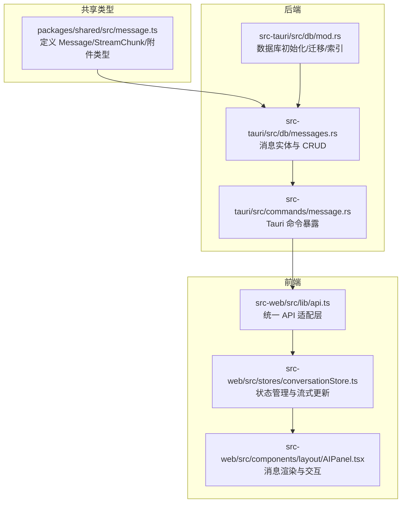
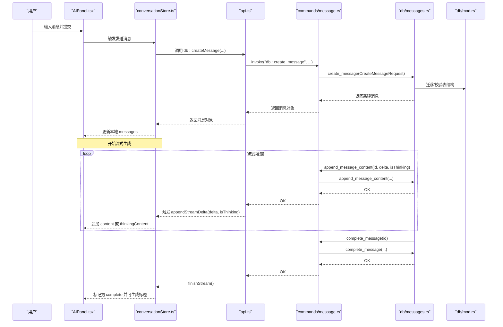
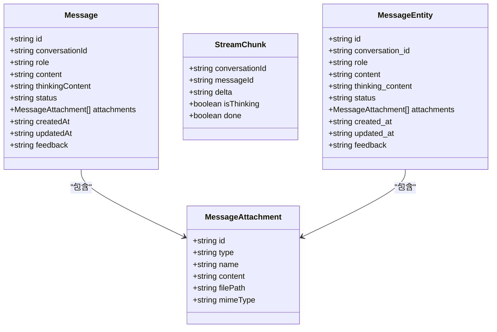
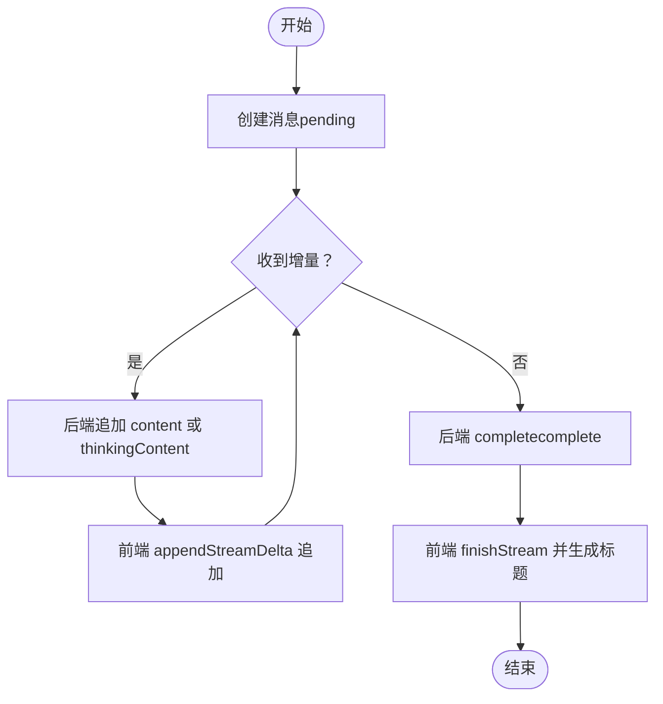

# 消息模型

<cite>
**本文引用的文件列表**
- [packages/shared/src/message.ts](file://packages/shared/src/message.ts)
- [src-tauri/src/db/messages.rs](file://src-tauri/src/db/messages.rs)
- [src-tauri/src/db/mod.rs](file://src-tauri/src/db/mod.rs)
- [src-tauri/src/commands/message.rs](file://src-tauri/src/commands/message.rs)
- [src-web/src/components/layout/AIPanel.tsx](file://src-web/src/components/layout/AIPanel.tsx)
- [src-web/src/stores/conversationStore.ts](file://src-web/src/stores/conversationStore.ts)
- [src-web/src/lib/api.ts](file://src-web/src/lib/api.ts)
- [docs/THINKING_FIELD_ANALYSIS.md](file://docs/THINKING_FIELD_ANALYSIS.md)
</cite>

## 目录
1. [简介](#简介)
2. [项目结构](#项目结构)
3. [核心组件](#核心组件)
4. [架构总览](#架构总览)
5. [详细组件分析](#详细组件分析)
6. [依赖关系分析](#依赖关系分析)
7. [性能考量](#性能考量)
8. [故障排查指南](#故障排查指南)
9. [结论](#结论)
10. [附录](#附录)

## 简介
本文件系统性梳理 CoSurf 的消息模型，围绕 Message 接口的完整规范展开，涵盖：
- 消息基本属性：id、conversationId、content、role、createdAt 等字段定义与约束
- 消息类型分类：user、assistant、system 的角色差异与用途
- 内容结构：纯文本与富文本（Markdown）的表示与渲染
- 思考过程字段：thinkingContent 的作用、存储与显示逻辑
- 对话历史管理：消息的增删改查、流式追加与完成标记
- 数据库映射：Rust 结构体与 SQL 表结构的对应关系
- 前端渲染：消息气泡、附件展示、反馈与复制等交互

## 项目结构
消息模型横跨共享类型定义、后端数据库与命令层、前端状态与渲染层，形成“类型定义—持久化—命令—状态—渲染”的完整链路。

图表来源
- [packages/shared/src/message.ts:14-34](file://packages/shared/src/message.ts#L14-L34)
- [src-tauri/src/db/messages.rs:24-62](file://src-tauri/src/db/messages.rs#L24-L62)
- [src-tauri/src/db/mod.rs:54-65](file://src-tauri/src/db/mod.rs#L54-L65)
- [src-tauri/src/commands/message.rs:7-98](file://src-tauri/src/commands/message.rs#L7-L98)
- [src-web/src/lib/api.ts:74-98](file://src-web/src/lib/api.ts#L74-L98)
- [src-web/src/stores/conversationStore.ts:254-304](file://src-web/src/stores/conversationStore.ts#L254-L304)
- [src-web/src/components/layout/AIPanel.tsx:366-578](file://src-web/src/components/layout/AIPanel.tsx#L366-L578)

章节来源
- [packages/shared/src/message.ts:1-35](file://packages/shared/src/message.ts#L1-L35)
- [src-tauri/src/db/mod.rs:54-65](file://src-tauri/src/db/mod.rs#L54-L65)
- [src-tauri/src/db/messages.rs:24-62](file://src-tauri/src/db/messages.rs#L24-L62)
- [src-tauri/src/commands/message.rs:7-98](file://src-tauri/src/commands/message.rs#L7-L98)
- [src-web/src/lib/api.ts:74-98](file://src-web/src/lib/api.ts#L74-L98)
- [src-web/src/stores/conversationStore.ts:254-304](file://src-web/src/stores/conversationStore.ts#L254-L304)
- [src-web/src/components/layout/AIPanel.tsx:366-578](file://src-web/src/components/layout/AIPanel.tsx#L366-L578)

## 核心组件
- 共享类型定义：在 packages/shared 中定义了 Message、MessageAttachment、MessageStatus、MessageRole、StreamChunk 等类型，确保前后端一致的数据契约。
- 后端实体与命令：Rust 层定义消息实体与请求/响应结构，并通过 Tauri 命令暴露 CRUD 与流式更新能力。
- 前端状态与渲染：前端通过统一 API 与后端交互，使用状态管理进行流式增量更新，并在 UI 中渲染消息气泡、附件、思考过程与反馈。

章节来源
- [packages/shared/src/message.ts:14-34](file://packages/shared/src/message.ts#L14-L34)
- [src-tauri/src/db/messages.rs:24-62](file://src-tauri/src/db/messages.rs#L24-L62)
- [src-tauri/src/commands/message.rs:7-98](file://src-tauri/src/commands/message.rs#L7-L98)
- [src-web/src/lib/api.ts:74-98](file://src-web/src/lib/api.ts#L74-L98)
- [src-web/src/stores/conversationStore.ts:254-304](file://src-web/src/stores/conversationStore.ts#L254-L304)
- [src-web/src/components/layout/AIPanel.tsx:366-578](file://src-web/src/components/layout/AIPanel.tsx#L366-L578)

## 架构总览
消息从“用户输入”到“AI 回复”的完整流程如下：

图表来源
- [src-web/src/components/layout/AIPanel.tsx:67-74](file://src-web/src/components/layout/AIPanel.tsx#L67-L74)
- [src-web/src/stores/conversationStore.ts:254-304](file://src-web/src/stores/conversationStore.ts#L254-L304)
- [src-web/src/lib/api.ts:80-98](file://src-web/src/lib/api.ts#L80-L98)
- [src-tauri/src/commands/message.rs:25-84](file://src-tauri/src/commands/message.rs#L25-L84)
- [src-tauri/src/db/messages.rs:122-175](file://src-tauri/src/db/messages.rs#L122-L175)
- [src-tauri/src/db/mod.rs:135-147](file://src-tauri/src/db/mod.rs#L135-L147)

## 详细组件分析

### 1) 消息接口与类型定义
- 角色枚举：MessageRole 包含 user、assistant、system
- 状态枚举：MessageStatus 包含 pending、streaming、complete、error
- 附件类型：MessageAttachment 支持 webpage、selection、file、image 等类型
- 主体接口：Message 包含 id、conversationId、role、content、thinkingContent、status、attachments、createdAt、updatedAt、feedback
- 流式分片：StreamChunk 用于后端向前端推送增量内容，包含 conversationId、messageId、delta、isThinking、done

章节来源
- [packages/shared/src/message.ts:1-35](file://packages/shared/src/message.ts#L1-L35)

### 2) 消息角色与用途
- user：用户输入的消息，通常作为对话上下文的一部分
- assistant：AI 回复消息，包含 content 与可选的 thinkingContent
- system：系统提示词或上下文设定，用于引导模型行为（在数据库层通过 CHECK 约束限制角色）

章节来源
- [src-tauri/src/db/mod.rs:57](file://src-tauri/src/db/mod.rs#L57)
- [packages/shared/src/message.ts:1](file://packages/shared/src/message.ts#L1)

### 3) 内容结构与富文本渲染
- content：消息正文，支持 Markdown 渲染；用户消息保留换行，AI 消息通过 ReactMarkdown 渲染
- thinkingContent：思考过程，仅对 assistant 生效，与 content 分离存储，便于独立展示与折叠
- 附件：支持网页、选择内容、文件、图片等，前端以标签形式展示

章节来源
- [src-web/src/components/layout/AIPanel.tsx:428-445](file://src-web/src/components/layout/AIPanel.tsx#L428-L445)
- [src-web/src/components/layout/AIPanel.tsx:452-528](file://src-web/src/components/layout/AIPanel.tsx#L452-L528)
- [src-web/src/components/layout/AIPanel.tsx:366-450](file://src-web/src/components/layout/AIPanel.tsx#L366-L450)

### 4) 思考过程字段（thinkingContent）
- 存储分离：数据库层面将 thinking_content 与 content 分离，避免混合内容导致解析复杂度上升
- 迁移策略：自动检测旧格式并迁移至分离字段，保证兼容性
- 显示逻辑：前端仅在非 user 角色下展示 thinkingContent，并支持折叠/展开与实时滚动

章节来源
- [src-tauri/src/db/mod.rs:172-215](file://src-tauri/src/db/mod.rs#L172-L215)
- [src-tauri/src/db/messages.rs:152-175](file://src-tauri/src/db/messages.rs#L152-L175)
- [src-web/src/components/layout/AIPanel.tsx:447-450](file://src-web/src/components/layout/AIPanel.tsx#L447-L450)
- [docs/THINKING_FIELD_ANALYSIS.md:58-113](file://docs/THINKING_FIELD_ANALYSIS.md#L58-L113)

### 5) 对话历史管理与实时流式显示
- 创建消息：后端创建 pending 状态消息，前端立即渲染占位
- 流式追加：后端根据 isThinking 标志分别更新 thinkingContent 或 content，前端通过 appendStreamDelta 增量拼接
- 完成标记：后端将状态置为 complete，前端触发 finishStream 并尝试自动生成会话标题
- 反馈：支持点赞/点踩/取消，前端通过 db.setMessageFeedback 更新并刷新本地状态

章节来源
- [src-tauri/src/db/messages.rs:122-175](file://src-tauri/src/db/messages.rs#L122-L175)
- [src-web/src/stores/conversationStore.ts:254-304](file://src-web/src/stores/conversationStore.ts#L254-L304)
- [src-web/src/lib/api.ts:80-98](file://src-web/src/lib/api.ts#L80-L98)
- [src-web/src/components/layout/AIPanel.tsx:392-405](file://src-web/src/components/layout/AIPanel.tsx#L392-L405)

### 6) 数据库表结构与对应关系
- 表结构：messages 表包含 id、conversation_id、role、content、thinking_content、status、attachments、created_at、updated_at
- 约束与索引：role 与 status 使用 CHECK 约束，conversation_id 建有索引；外键关联 conversations
- 迁移：自动确保 thinking_content 与 feedback 字段存在，必要时执行 ALTER TABLE

章节来源
- [src-tauri/src/db/mod.rs:54-65](file://src-tauri/src/db/mod.rs#L54-L65)
- [src-tauri/src/db/mod.rs:135-147](file://src-tauri/src/db/mod.rs#L135-L147)
- [src-tauri/src/db/messages.rs:24-62](file://src-tauri/src/db/messages.rs#L24-L62)

### 7) 前端组件渲染方式
- 消息气泡：根据角色区分样式，用户消息靠右，AI 消息靠左
- Markdown：AI 消息使用 ReactMarkdown 渲染，支持标题、列表、表格、链接等
- 附件：按类型图标展示，支持点击打开新标签页
- 交互：支持复制、点赞/点踩、思考过程折叠/展开、流式指示器

章节来源
- [src-web/src/components/layout/AIPanel.tsx:407-578](file://src-web/src/components/layout/AIPanel.tsx#L407-L578)

## 依赖关系分析

图表来源
- [packages/shared/src/message.ts:14-34](file://packages/shared/src/message.ts#L14-L34)
- [src-tauri/src/db/messages.rs:24-62](file://src-tauri/src/db/messages.rs#L24-L62)

章节来源
- [packages/shared/src/message.ts:14-34](file://packages/shared/src/message.ts#L14-L34)
- [src-tauri/src/db/messages.rs:24-62](file://src-tauri/src/db/messages.rs#L24-L62)

## 性能考量
- 数据库索引：messages 表对 conversation_id 建有索引，查询与排序更高效
- 流式更新：后端采用增量拼接，减少大文本一次性写入的开销
- 前端渲染：ReactMarkdown 渲染在长文本场景下需注意性能，建议对超长内容进行分段或懒加载
- 迁移成本：自动迁移仅在启动时执行，对运行时影响较小

章节来源
- [src-tauri/src/db/mod.rs:67](file://src-tauri/src/db/mod.rs#L67)
- [src-tauri/src/db/messages.rs:152-175](file://src-tauri/src/db/messages.rs#L152-L175)

## 故障排查指南
- 思考过程字段缺失：若旧版本数据未包含 thinking_content，系统会在启动时自动迁移；若仍异常，请检查迁移日志
- 流式更新失败：确认 isThinking 标志与后端 append_message_content 的调用路径一致
- 状态不一致：检查前端 appendStreamDelta 与后端 complete_message 的调用顺序
- 附件无法渲染：确认附件类型与前端图标映射一致，检查 MIME 类型与内容字段

章节来源
- [src-tauri/src/db/mod.rs:172-215](file://src-tauri/src/db/mod.rs#L172-L215)
- [src-web/src/stores/conversationStore.ts:254-304](file://src-web/src/stores/conversationStore.ts#L254-L304)
- [src-web/src/components/layout/AIPanel.tsx:428-445](file://src-web/src/components/layout/AIPanel.tsx#L428-L445)

## 结论
CoSurf 的消息模型通过“共享类型定义 + Rust 实体 + Tauri 命令 + 前端状态与渲染”的分层设计，实现了稳定、可扩展的消息管理与流式显示能力。thinkingContent 的分离存储与自动迁移机制，有效提升了思考过程的可视化与兼容性；前端对 Markdown 的渲染与交互增强，进一步改善了用户体验。

## 附录

### A. 关键流程图：流式增量更新

图表来源
- [src-tauri/src/db/messages.rs:152-175](file://src-tauri/src/db/messages.rs#L152-L175)
- [src-web/src/stores/conversationStore.ts:254-304](file://src-web/src/stores/conversationStore.ts#L254-L304)