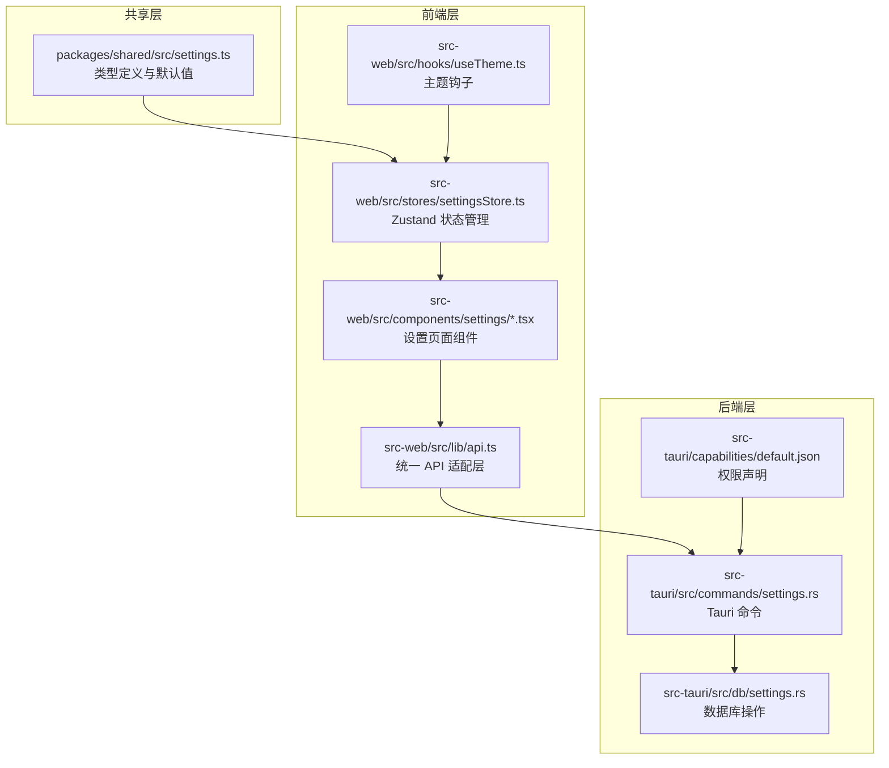
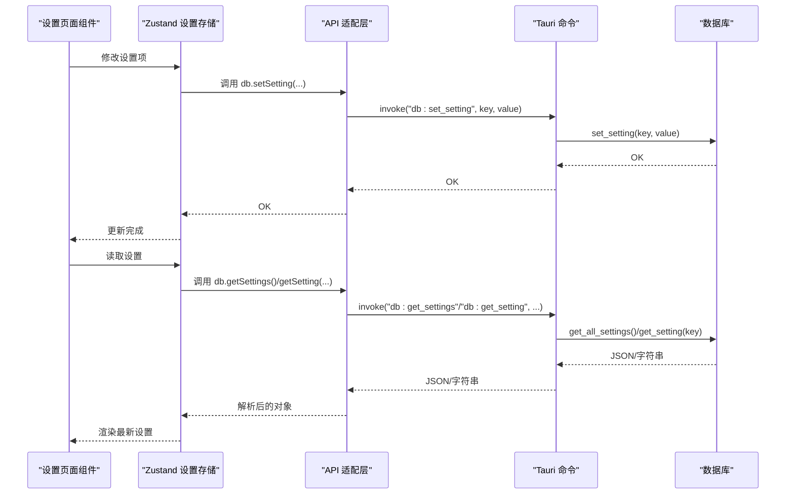
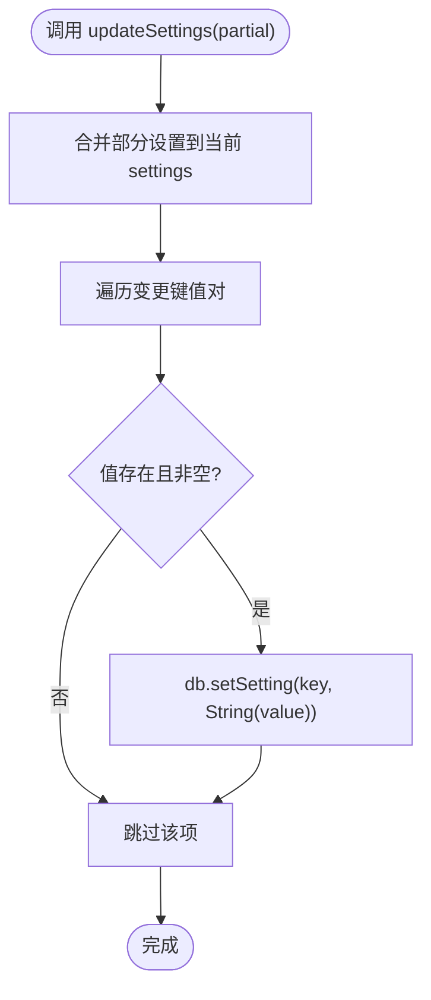
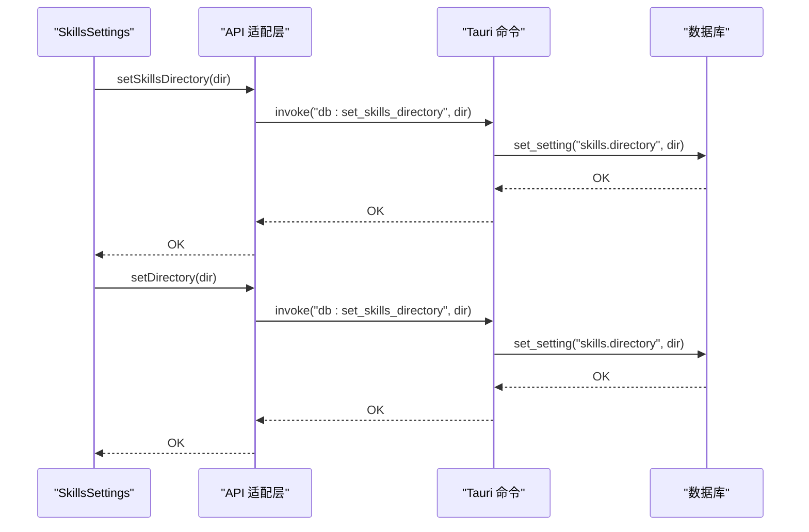
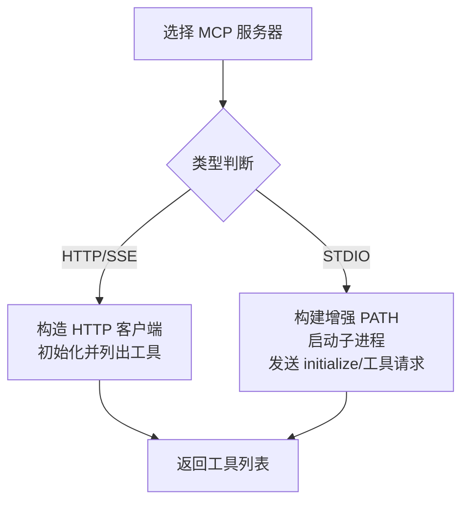
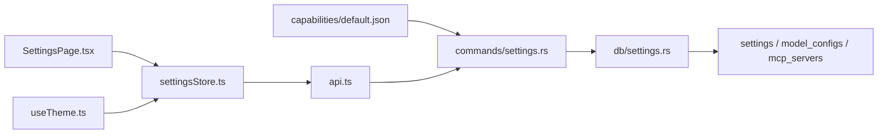

# 设置配置

<cite>
**本文档引用的文件**
- [settings.ts](file://packages/shared/src/settings.ts)
- [settingsStore.ts](file://src-web/src/stores/settingsStore.ts)
- [settings.rs](file://src-tauri/src/db/settings.rs)
- [settings.rs](file://src-tauri/src/commands/settings.rs)
- [api.ts](file://src-web/src/lib/api.ts)
- [SettingsPage.tsx](file://src-web/src/components/settings/SettingsPage.tsx)
- [SkillsSettings.tsx](file://src-web/src/components/settings/SkillsSettings.tsx)
- [McpServersSettings.tsx](file://src-web/src/components/settings/McpServersSettings.tsx)
- [AgentPromptsSettings.tsx](file://src-web/src/components/settings/AgentPromptsSettings.tsx)
- [useTheme.ts](file://src-web/src/hooks/useTheme.ts)
- [default.json](file://src-tauri/capabilities/default.json)
</cite>

## 目录
1. [简介](#简介)
2. [项目结构](#项目结构)
3. [核心组件](#核心组件)
4. [架构总览](#架构总览)
5. [详细组件分析](#详细组件分析)
6. [依赖关系分析](#依赖关系分析)
7. [性能考虑](#性能考虑)
8. [故障排除指南](#故障排除指南)
9. [结论](#结论)

## 简介
本文件系统性梳理 CoSurf 的设置配置体系，覆盖应用设置、AI 相关设置、浏览器相关设置以及技能与 MCP 服务器配置。文档重点说明：
- 设置类型定义与默认值
- 设置项的验证规则与数据转换逻辑
- 设置的持久化机制与同步策略
- 设置配置的迁移与版本兼容性处理
- 使用示例与故障排除指南

## 项目结构
设置配置涉及三层协作：
- 共享层（Shared）：定义 TypeScript 类型与默认值
- 前端层（Web）：状态管理、UI 组件与 API 适配
- 后端层（Tauri/NAPI）：数据库持久化与命令接口

**图表来源**
- [settings.ts:1-47](file://packages/shared/src/settings.ts#L1-L47)
- [settingsStore.ts:1-201](file://src-web/src/stores/settingsStore.ts#L1-L201)
- [SettingsPage.tsx:1-800](file://src-web/src/components/settings/SettingsPage.tsx#L1-L800)
- [api.ts:1-445](file://src-web/src/lib/api.ts#L1-L445)
- [settings.rs:1-615](file://src-tauri/src/commands/settings.rs#L1-L615)
- [settings.rs:1-540](file://src-tauri/src/db/settings.rs#L1-L540)
- [default.json:1-24](file://src-tauri/capabilities/default.json#L1-L24)

**章节来源**
- [settings.ts:1-47](file://packages/shared/src/settings.ts#L1-L47)
- [settingsStore.ts:1-201](file://src-web/src/stores/settingsStore.ts#L1-L201)
- [SettingsPage.tsx:1-800](file://src-web/src/components/settings/SettingsPage.tsx#L1-L800)
- [api.ts:1-445](file://src-web/src/lib/api.ts#L1-L445)
- [settings.rs:1-615](file://src-tauri/src/commands/settings.rs#L1-L615)
- [settings.rs:1-540](file://src-tauri/src/db/settings.rs#L1-L540)
- [default.json:1-24](file://src-tauri/capabilities/default.json#L1-L24)

## 核心组件
本节聚焦设置类型定义、默认值与关键配置项。

- 主题模式（ThemeMode）
  - 取值范围："light" | "dark" | "system"
  - 默认值："system"

- 语言（Language）
  - 取值范围："zh-CN" | "en-US"
  - 默认值："zh-CN"

- 应用设置（AppSettings）
  - theme: ThemeMode
  - language: Language
  - fontSize: number
  - userName: string
  - panelDefaultHeight: number
  - panelOverlayMode: boolean
  - privacyMode: boolean
  - aiDataPrivacy: boolean
  - shortcuts: ShortcutConfig
  - userDataPath: string
  - 注：iQS API Key 独立配置，不在 AppSettings 中

- 快捷键配置（ShortcutConfig）
  - togglePanel: string
  - newTab: string
  - closeTab: string
  - focusAddressBar: string
  - newConversation: string
  - screenshot: string

- 默认设置（DEFAULT_SETTINGS）
  - 提供完整的默认值集合，便于初始化与回退

**章节来源**
- [settings.ts:1-47](file://packages/shared/src/settings.ts#L1-L47)

## 架构总览
设置配置的读写流程如下：

**图表来源**
- [settingsStore.ts:76-90](file://src-web/src/stores/settingsStore.ts#L76-L90)
- [api.ts:118-127](file://src-web/src/lib/api.ts#L118-L127)
- [settings.rs:9-34](file://src-tauri/src/commands/settings.rs#L9-L34)
- [settings.rs:199-215](file://src-tauri/src/db/settings.rs#L199-L215)

**章节来源**
- [settingsStore.ts:1-201](file://src-web/src/stores/settingsStore.ts#L1-L201)
- [api.ts:1-445](file://src-web/src/lib/api.ts#L1-L445)
- [settings.rs:1-615](file://src-tauri/src/commands/settings.rs#L1-L615)
- [settings.rs:1-540](file://src-tauri/src/db/settings.rs#L1-L540)

## 详细组件分析

### 应用设置与默认值
- 类型与默认值由共享层定义，确保前后端一致性
- 默认值覆盖主题、语言、字体大小、面板尺寸、隐私模式等基础配置
- 快捷键采用字符串格式，便于跨平台快捷键组合

**章节来源**
- [settings.ts:1-47](file://packages/shared/src/settings.ts#L1-L47)

### 设置存储与状态管理
- Zustand 存储包含 settings、models、activeModelId、isLoading、skillsDirectory、iqsApiKey 等字段
- 提供设置更新、模型增删改查、技能目录与 IQS API Key 的读写方法
- updateSettings 会逐项将变更持久化到数据库

**图表来源**
- [settingsStore.ts:76-90](file://src-web/src/stores/settingsStore.ts#L76-L90)

**章节来源**
- [settingsStore.ts:1-201](file://src-web/src/stores/settingsStore.ts#L1-L201)

### 设置页面与交互
- SettingsPage 统一入口，按标签页加载不同设置模块
- 首次打开时预加载技能目录与 IQS API Key，避免切换标签时的延迟
- 通用设置页包含主题、语言、字体大小、面板高度与隐私模式等

**章节来源**
- [SettingsPage.tsx:1-800](file://src-web/src/components/settings/SettingsPage.tsx#L1-L800)

### 技能配置（Skills）
- 技能目录路径可自定义，默认位于用户主目录下的特定路径
- 支持从目录导入、从 Markdown 导入、启用/禁用、删除与内容预览
- 目录变更后会通知后端重新加载技能管理器

**图表来源**
- [SkillsSettings.tsx:102-128](file://src-web/src/components/settings/SkillsSettings.tsx#L102-L128)
- [api.ts:157-167](file://src-web/src/lib/api.ts#L157-L167)
- [settings.rs:341-365](file://src-tauri/src/db/settings.rs#L341-L365)

**章节来源**
- [SkillsSettings.tsx:1-550](file://src-web/src/components/settings/SkillsSettings.tsx#L1-L550)
- [api.ts:157-167](file://src-web/src/lib/api.ts#L157-L167)
- [settings.rs:341-365](file://src-tauri/src/db/settings.rs#L341-L365)

### IQS API Key 配置
- IQS API Key 存储于 settings 表中，键名为 "iqs.api_key"
- 前端提供输入框与保存按钮，支持成功/失败状态反馈
- 后端提供 get_iqs_api_key 与 set_iqs_api_key 命令

**章节来源**
- [ToolSettings.tsx:592-729](file://src-web/src/components/settings/SettingsPage.tsx#L592-L729)
- [api.ts:168-177](file://src-web/src/lib/api.ts#L168-L177)
- [settings.rs:368-377](file://src-tauri/src/db/settings.rs#L368-L377)

### MCP 服务器配置
- 支持多种类型：stdio、http、streamableHttp、sse
- 提供导入 JSON、编辑、测试连接、启用/禁用、删除等功能
- 测试流程区分 HTTP 与 stdio 两种模式，stdio 通过子进程通信

**图表来源**
- [McpServersSettings.tsx:264-306](file://src-web/src/components/settings/McpServersSettings.tsx#L264-L306)
- [settings.rs:264-486](file://src-tauri/src/commands/settings.rs#L264-L486)

**章节来源**
- [McpServersSettings.tsx:1-688](file://src-web/src/components/settings/McpServersSettings.tsx#L1-L688)
- [settings.rs:197-306](file://src-tauri/src/commands/settings.rs#L197-L306)

### Agent Prompts 配置
- 支持列出、编辑、保存、重置与启用/禁用
- 采用独立的数据库表进行持久化

**章节来源**
- [AgentPromptsSettings.tsx:1-224](file://src-web/src/components/settings/AgentPromptsSettings.tsx#L1-L224)

### 主题与语言联动
- useTheme 钩子根据 settings.theme 动态切换 HTML 根元素的 "dark" 类
- 语言切换影响界面文本与提示

**章节来源**
- [useTheme.ts:1-25](file://src-web/src/hooks/useTheme.ts#L1-L25)
- [SettingsPage.tsx:147-267](file://src-web/src/components/settings/SettingsPage.tsx#L147-L267)

## 依赖关系分析
- 权限声明：default.json 包含 core、dialog、fs、global-shortcut、http、notification、updater、window-state 等权限，确保设置功能正常运行
- 数据库表结构：settings、model_configs、mcp_servers 等表承载各类配置
- 命令接口：Tauri 命令提供统一的设置读写入口

**图表来源**
- [default.json:1-24](file://src-tauri/capabilities/default.json#L1-L24)
- [settings.rs:1-615](file://src-tauri/src/commands/settings.rs#L1-L615)
- [settings.rs:95-129](file://src-tauri/src/db/settings.rs#L95-L129)
- [settingsStore.ts:1-201](file://src-web/src/stores/settingsStore.ts#L1-L201)
- [api.ts:1-445](file://src-web/src/lib/api.ts#L1-L445)
- [SettingsPage.tsx:1-800](file://src-web/src/components/settings/SettingsPage.tsx#L1-L800)
- [useTheme.ts:1-25](file://src-web/src/hooks/useTheme.ts#L1-L25)

**章节来源**
- [default.json:1-24](file://src-tauri/capabilities/default.json#L1-L24)
- [settings.rs:95-129](file://src-tauri/src/db/settings.rs#L95-L129)

## 性能考虑
- 设置更新采用逐项持久化，避免一次性写入大量键值导致阻塞
- MCP 服务器测试异步执行，避免 UI 卡顿
- 首次打开设置页面时预加载必要配置，减少标签切换时的等待
- 主题切换仅操作 DOM 类名，开销极低

## 故障排除指南
- 设置未生效
  - 检查 updateSettings 是否被调用且未出现异常
  - 确认 db.setSetting 调用链路返回成功
  - 参考：[settingsStore.ts:76-90](file://src-web/src/stores/settingsStore.ts#L76-L90)、[api.ts:125-127](file://src-web/src/lib/api.ts#L125-L127)

- 技能目录无法加载
  - 确认 "skills.directory" 键存在且指向有效目录
  - 若为空，后端会生成默认路径并保存
  - 参考：[settings.rs:341-365](file://src-tauri/src/db/settings.rs#L341-L365)

- IQS API Key 保存失败
  - 检查 set_iqs_api_key 命令返回的错误信息
  - 确认前端输入非空且后端日志无异常
  - 参考：[ToolSettings.tsx:605-630](file://src-web/src/components/settings/SettingsPage.tsx#L605-L630)、[api.ts:175-177](file://src-web/src/lib/api.ts#L175-L177)

- MCP 服务器测试失败
  - HTTP 类型需提供 URL；STDIO 类型需提供命令与参数
  - 检查网络连通性、认证头与超时设置
  - 参考：[McpServersSettings.tsx:291-338](file://src-web/src/components/settings/McpServersSettings.tsx#L291-L338)、[settings.rs:264-306](file://src-tauri/src/commands/settings.rs#L264-L306)

- 主题未切换
  - 确认 useTheme 钩子已挂载且 settings.theme 正确更新
  - 检查浏览器是否支持类名切换
  - 参考：[useTheme.ts:1-25](file://src-web/src/hooks/useTheme.ts#L1-L25)

## 结论
CoSurf 的设置配置体系通过共享类型定义、前端状态管理与后端数据库持久化形成闭环，具备良好的扩展性与可维护性。建议在后续版本中：
- 增加设置项的校验与回滚机制
- 提供设置导出/导入功能以提升迁移体验
- 优化 MCP 服务器测试的错误提示与重试策略