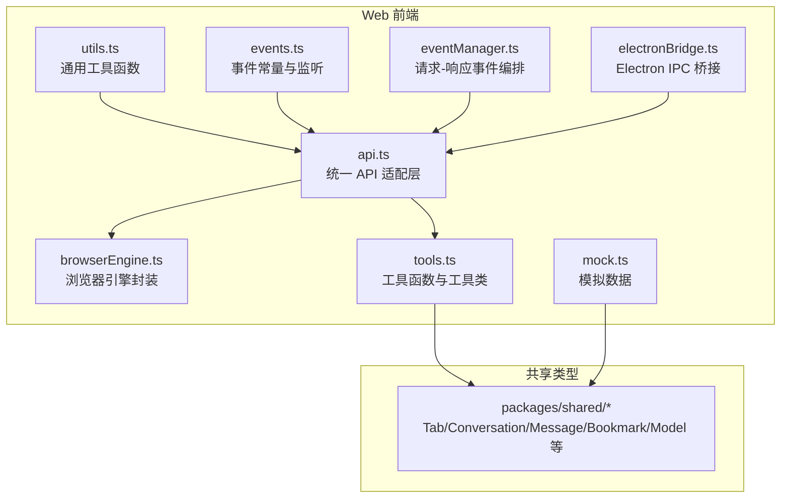
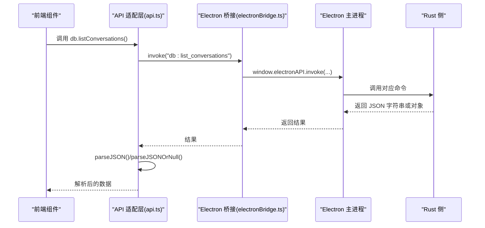
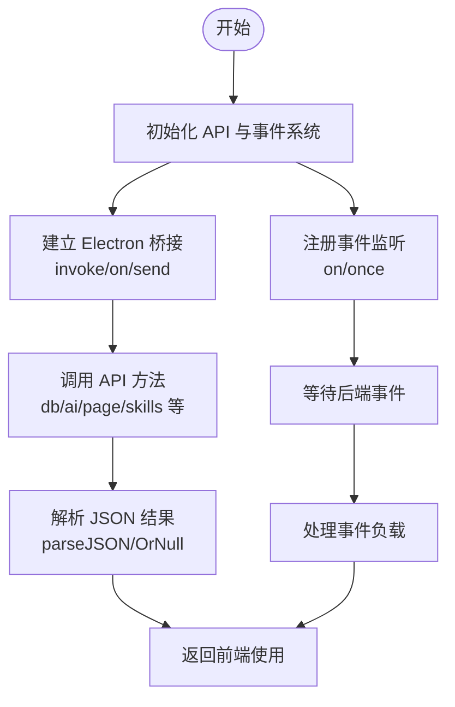
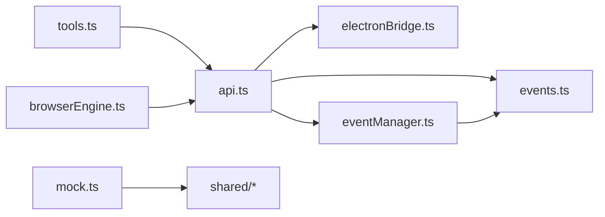

# API 辅助函数

<cite>
**本文引用的文件**
- [src-web/src/lib/utils.ts](file://src-web/src/lib/utils.ts)
- [src-web/src/lib/api.ts](file://src-web/src/lib/api.ts)
- [src-web/src/lib/browserEngine.ts](file://src-web/src/lib/browserEngine.ts)
- [src-web/src/lib/mock.ts](file://src-web/src/lib/mock.ts)
- [src-web/src/lib/tools.ts](file://src-web/src/lib/tools.ts)
- [src-web/src/lib/electronBridge.ts](file://src-web/src/lib/electronBridge.ts)
- [src-web/src/lib/events.ts](file://src-web/src/lib/events.ts)
- [src-web/src/lib/eventManager.ts](file://src-web/src/lib/eventManager.ts)
- [src-web/src/lib/tauri.ts](file://src-web/src/lib/tauri.ts)
- [packages/shared/src/index.ts](file://packages/shared/src/index.ts)
- [packages/shared/src/tab.ts](file://packages/shared/src/tab.ts)
- [packages/shared/src/conversation.ts](file://packages/shared/src/conversation.ts)
- [packages/shared/src/message.ts](file://packages/shared/src/message.ts)
- [packages/shared/src/bookmark.ts](file://packages/shared/src/bookmark.ts)
- [packages/shared/src/model.ts](file://packages/shared/src/model.ts)
</cite>

## 目录
1. [简介](#简介)
2. [项目结构](#项目结构)
3. [核心组件](#核心组件)
4. [架构总览](#架构总览)
5. [详细组件分析](#详细组件分析)
6. [依赖关系分析](#依赖关系分析)
7. [性能考量](#性能考量)
8. [故障排查指南](#故障排查指南)
9. [结论](#结论)
10. [附录](#附录)

## 简介
本文件为 CoSurf 前端 Web 层的 API 辅助函数参考文档，覆盖以下方面：
- 通用工具函数：字符串拼接、ID 生成、截断、时间格式化、域名解析等
- API 适配层：统一 Electron IPC 调用封装，自动 JSON 解析与空值处理
- 事件系统：事件监听、一次性监听、事件常量与向后兼容
- 浏览器引擎封装：智能选择器生成、元素等待、点击/输入/选择/滚动、内容提取、表单自动化、脚本执行、高亮调试
- 工具函数与工具类：页面总结、网页操作、工具执行器
- 模拟数据：对话、消息、标签页、书签、历史、模型配置、工具实例
- Electron 通信桥接：invoke/listen/emit 的桥接与环境检测
- 事件管理器：请求-响应模式的事件编排与超时控制

## 项目结构
围绕 API 辅助函数的相关文件组织如下：
- 通用工具：utils.ts
- API 适配层：api.ts
- 事件系统：events.ts、eventManager.ts
- 浏览器引擎：browserEngine.ts
- 工具函数与类：tools.ts
- Electron 桥接：electronBridge.ts
- 模拟数据：mock.ts
- 类型定义：packages/shared 下各实体类型

图表来源
- [src-web/src/lib/utils.ts:1-40](file://src-web/src/lib/utils.ts#L1-L40)
- [src-web/src/lib/events.ts:1-83](file://src-web/src/lib/events.ts#L1-L83)
- [src-web/src/lib/eventManager.ts:1-108](file://src-web/src/lib/eventManager.ts#L1-L108)
- [src-web/src/lib/electronBridge.ts:1-100](file://src-web/src/lib/electronBridge.ts#L1-L100)
- [src-web/src/lib/api.ts:1-445](file://src-web/src/lib/api.ts#L1-L445)
- [src-web/src/lib/browserEngine.ts:1-521](file://src-web/src/lib/browserEngine.ts#L1-L521)
- [src-web/src/lib/tools.ts:1-125](file://src-web/src/lib/tools.ts#L1-L125)
- [src-web/src/lib/mock.ts:1-212](file://src-web/src/lib/mock.ts#L1-L212)
- [packages/shared/src/index.ts:1-9](file://packages/shared/src/index.ts#L1-L9)

章节来源
- [src-web/src/lib/utils.ts:1-40](file://src-web/src/lib/utils.ts#L1-L40)
- [src-web/src/lib/api.ts:1-445](file://src-web/src/lib/api.ts#L1-L445)
- [src-web/src/lib/events.ts:1-83](file://src-web/src/lib/events.ts#L1-L83)
- [src-web/src/lib/eventManager.ts:1-108](file://src-web/src/lib/eventManager.ts#L1-L108)
- [src-web/src/lib/electronBridge.ts:1-100](file://src-web/src/lib/electronBridge.ts#L1-L100)
- [src-web/src/lib/browserEngine.ts:1-521](file://src-web/src/lib/browserEngine.ts#L1-L521)
- [src-web/src/lib/tools.ts:1-125](file://src-web/src/lib/tools.ts#L1-L125)
- [src-web/src/lib/mock.ts:1-212](file://src-web/src/lib/mock.ts#L1-L212)
- [packages/shared/src/index.ts:1-9](file://packages/shared/src/index.ts#L1-L9)

## 核心组件
- 通用工具函数：cn、generateId、truncate、formatTime、getDomain
- API 适配层：db、ai、agent、tab、page、screenshot、skills、cache、dialog、shell、win、mcp
- 事件系统：Events 常量、on/once/off/removeAllListeners
- 事件管理器：sendRequest、registerHandler、cleanup
- 浏览器引擎：BrowserAction、ActionResult、智能选择器、元素等待、点击/输入/选择/滚动、内容提取、表单自动化、脚本执行、高亮
- 工具函数与类：onPageContent/onPageContentError、summarizeCurrentPage、executeWebAction、ToolExecutor
- Electron 桥接：invoke、on、send、once、removeAllListeners、windowControls、isElectron、listen/emit 别名
- 模拟数据：mockTabs、mockConversations、mockMessages、mockBookmarks、mockHistory、mockModels、mockToolInstances

章节来源
- [src-web/src/lib/utils.ts:1-40](file://src-web/src/lib/utils.ts#L1-L40)
- [src-web/src/lib/api.ts:12-445](file://src-web/src/lib/api.ts#L12-L445)
- [src-web/src/lib/events.ts:14-83](file://src-web/src/lib/events.ts#L14-L83)
- [src-web/src/lib/eventManager.ts:16-108](file://src-web/src/lib/eventManager.ts#L16-L108)
- [src-web/src/lib/browserEngine.ts:6-521](file://src-web/src/lib/browserEngine.ts#L6-L521)
- [src-web/src/lib/tools.ts:1-125](file://src-web/src/lib/tools.ts#L1-L125)
- [src-web/src/lib/electronBridge.ts:13-100](file://src-web/src/lib/electronBridge.ts#L13-L100)
- [src-web/src/lib/mock.ts:1-212](file://src-web/src/lib/mock.ts#L1-L212)

## 架构总览
CoSurf 前端通过 Electron IPC 与主进程通信，API 适配层统一封装 invoke 调用，并对 Rust 返回的 JSON 字符串进行解析；事件系统提供与 Tauri 兼容的 API 签名；浏览器引擎封装提供页面自动化能力；工具模块负责页面总结与网页操作；事件管理器支持请求-响应模式。

图表来源
- [src-web/src/lib/api.ts:13-49](file://src-web/src/lib/api.ts#L13-L49)
- [src-web/src/lib/electronBridge.ts:33-46](file://src-web/src/lib/electronBridge.ts#L33-L46)

## 详细组件分析

### 通用工具函数
- cn(...classes: (string | boolean | undefined | null)[]): string
  - 功能：过滤掉假值并以空格连接多个类名
  - 参数：任意数量的字符串或布尔/空值
  - 返回：连接后的字符串
  - 示例：参见 [src-web/src/lib/utils.ts:1-3](file://src-web/src/lib/utils.ts#L1-L3)

- generateId(): string
  - 功能：生成随机 ID，优先使用 crypto.randomUUID，否则回退到 Math.random
  - 返回：字符串 ID
  - 示例：参见 [src-web/src/lib/utils.ts:5-7](file://src-web/src/lib/utils.ts#L5-L7)

- truncate(str: string, maxLen: number): string
  - 功能：截断字符串并在末尾添加省略号
  - 参数：原字符串、最大长度
  - 返回：截断后的字符串
  - 示例：参见 [src-web/src/lib/utils.ts:9-12](file://src-web/src/lib/utils.ts#L9-L12)

- formatTime(dateStr: string): string
  - 功能：将时间字符串格式化为“刚刚/分钟前/小时前/天前/日期”
  - 参数：时间字符串
  - 返回：本地化的时间描述
  - 示例：参见 [src-web/src/lib/utils.ts:14-31](file://src-web/src/lib/utils.ts#L14-L31)

- getDomain(url: string): string
  - 功能：从 URL 中提取主机名，失败时回退原字符串
  - 参数：URL 字符串
  - 返回：主机名或原字符串
  - 示例：参见 [src-web/src/lib/utils.ts:33-39](file://src-web/src/lib/utils.ts#L33-L39)

章节来源
- [src-web/src/lib/utils.ts:1-40](file://src-web/src/lib/utils.ts#L1-L40)

### API 适配层（统一 IPC 封装）
- invoke(channel, ...args): Promise<T>
  - 功能：底层 invoke 封装，校验 window.electronAPI 并转发调用
  - 返回：Promise<T>
  - 示例：参见 [src-web/src/lib/api.ts:13-19](file://src-web/src/lib/api.ts#L13-L19)

- parseJSON<T>(result: any): T
  - 功能：将字符串尝试解析为 JSON，否则原样返回
  - 返回：解析后的对象或原始值
  - 示例：参见 [src-web/src/lib/api.ts:25-34](file://src-web/src/lib/api.ts#L25-L34)

- parseJSONOrNull<T>(result: any): T | null
  - 功能：空值处理版本
  - 返回：解析后的对象或 null
  - 示例：参见 [src-web/src/lib/api.ts:39-49](file://src-web/src/lib/api.ts#L39-L49)

- 数据库操作（db.*）
  - 列表与查询：listConversations、getConversation、listMessages、getMessage、listBookmarks、listBookmarkFolders、listModelConfigs、getModelConfig、listHistory、searchHistory、listAgentPrompts、getAgentPrompt
  - 创建与更新：createConversation、updateConversation、createMessage、updateMessage、setMessageFeedback、appendMessageContent、completeMessage、createBookmark、createBookmarkFolder、createModelConfig、updateModelConfig、setActiveModel、setSkillsDirectory、setIqsApiKey、createMcpServer、updateMcpServer、testMcpServer、importMcpServersFromJson
  - 删除与开关：deleteConversation、deleteMessage、deleteBookmark、deleteBookmarkFolder、deleteModelConfig、deleteHistoryEntry、toggleAgentPrompt
  - 设置与技能：getSettings、getSetting、setSetting、getSkillsDirectory、setSkillsDirectory、getIqsApiKey、setIqsApiKey
  - 示例：参见 [src-web/src/lib/api.ts:54-249](file://src-web/src/lib/api.ts#L54-L249)

- AI 对话（ai.*）
  - sendChat(config, messages, conversationId, messageId): 发送聊天消息（流式响应通过事件推送）
  - stopGeneration(): 停止生成
  - generateTitle(content, config): 生成标题
  - 示例：参见 [src-web/src/lib/api.ts:254-271](file://src-web/src/lib/api.ts#L254-L271)

- Agent 操作（agent.*）
  - execute(params): 执行
  - configureQwen(config): 配置 Qwen
  - summarizePage(params): 总结页面
  - extractMemory(params): 提取记忆
  - 示例：参见 [src-web/src/lib/api.ts:276-288](file://src-web/src/lib/api.ts#L276-L288)

- 标签页管理（tab.*）
  - create(url, title?)、switch(id)、close(id)、navigate(id, url)、back(id)、forward(id)、getState(id)、getTitle(id)、setActive(id)
  - 示例：参见 [src-web/src/lib/api.ts:293-320](file://src-web/src/lib/api.ts#L293-L320)

- 页面操作（page.*）
  - getContent(tabId)、screenshot(tabId)、executeScript(tabId, script)、injectContext(tabId)、summarize(tabId)、executeAction(tabId, action, selector, value?)
  - 示例：参见 [src-web/src/lib/api.ts:325-343](file://src-web/src/lib/api.ts#L325-L343)

- 截图（screenshot.*）
  - captureFull()、captureRegion(base64Data, x, y, w, h, screenWidth, screenHeight)、save(base64Data, filePath)、copyToClipboard(base64Data)
  - 示例：参见 [src-web/src/lib/api.ts:348-360](file://src-web/src/lib/api.ts#L348-L360)

- Skills 管理（skills.*）
  - list()、delete(id)、toggle(id, enabled)、importMarkdown(content)、importDirectory(dirPath)、setDirectory(dir)、listFiles()、getContent(id)
  - 示例：参见 [src-web/src/lib/api.ts:365-389](file://src-web/src/lib/api.ts#L365-L389)

- 页面缓存（cache.*）
  - save(key, data)、load(key)、cleanup()
  - 示例：参见 [src-web/src/lib/api.ts:394-403](file://src-web/src/lib/api.ts#L394-L403)

- 对话框（dialog.*）
  - openFile(options?)、saveFile(options?)
  - 示例：参见 [src-web/src/lib/api.ts:408-414](file://src-web/src/lib/api.ts#L408-L414)

- Shell（shell.*）
  - openUrl(url)
  - 示例：参见 [src-web/src/lib/api.ts:419-422](file://src-web/src/lib/api.ts#L419-L422)

- 窗口控制（win.*）
  - minimize()、maximize()、close()、isMaximized()
  - 示例：参见 [src-web/src/lib/api.ts:427-432](file://src-web/src/lib/api.ts#L427-L432)

- MCP 服务器（mcp.*）
  - loadServers(servers: Array<Record<string, any>>)
  - 示例：参见 [src-web/src/lib/api.ts:437-444](file://src-web/src/lib/api.ts#L437-L444)

章节来源
- [src-web/src/lib/api.ts:12-445](file://src-web/src/lib/api.ts#L12-L445)

### 事件系统与事件管理器
- 事件常量（Events）
  - AI 流式事件：AI_STREAM_CHUNK、AI_STREAM_ERROR、AI_TOOL_CALL_START、AI_TOOL_CALL_RESULT
  - 标签页事件：TAB_CREATE、TAB_NAVIGATE、TAB_TITLE_UPDATED、TAB_LOADING、TAB_LOADED、TAB_SWITCHED
  - 系统事件：SHORTCUT_SCREENSHOT、UPDATER_UPDATE_AVAILABLE、WEBVIEW_CREATE_TAB、COSURF_NEW_TAB_RESPONSE
  - 示例：参见 [src-web/src/lib/events.ts:15-35](file://src-web/src/lib/events.ts#L15-L35)

- 监听与一次性监听
  - on(event, callback): 返回取消订阅函数
  - once(event, callback): 一次性监听
  - off(unsubscribe): 取消监听
  - removeAllListeners(event): 移除某事件全部监听
  - 示例：参见 [src-web/src/lib/events.ts:51-79](file://src-web/src/lib/events.ts#L51-L79)

- 请求-响应事件编排（EventManager）
  - sendRequest(eventName, payload, responseEventName, timeoutMs?): Promise<T>
  - registerHandler(eventName, handler): 返回取消订阅函数
  - cleanup(): 清理所有待处理请求
  - 示例：参见 [src-web/src/lib/eventManager.ts:40-104](file://src-web/src/lib/eventManager.ts#L40-L104)

章节来源
- [src-web/src/lib/events.ts:14-83](file://src-web/src/lib/events.ts#L14-L83)
- [src-web/src/lib/eventManager.ts:16-108](file://src-web/src/lib/eventManager.ts#L16-L108)

### 浏览器引擎封装
- 接口与类型
  - BrowserAction：type、selector、value、options
  - ActionResult：success、message、data?
  - 示例：参见 [src-web/src/lib/browserEngine.ts:6-18](file://src-web/src/lib/browserEngine.ts#L6-L18)

- 智能选择器与元素定位
  - generateSmartSelector(element): 优先 ID，其次类名，再属性，最后层级路径
  - getElementPath(element): 生成 CSS 路径
  - 示例：参见 [src-web/src/lib/browserEngine.ts:22-77](file://src-web/src/lib/browserEngine.ts#L22-L77)

- 元素等待
  - waitForElement(selector, timeout=5000): Promise<HTMLElement|null>
  - 示例：参见 [src-web/src/lib/browserEngine.ts:82-111](file://src-web/src/lib/browserEngine.ts#L82-L111)

- 用户交互
  - clickElement(selector, options?): 点击（支持左右键、双击）
  - inputText(selector, text, options?): 输入（支持清空、提交）
  - selectOption(selector, value|string[]): 选择下拉框
  - scrollPage(direction, amount?): 滚动（上下左右、顶部、底部）
  - 示例：参见 [src-web/src/lib/browserEngine.ts:116-271](file://src-web/src/lib/browserEngine.ts#L116-L271)

- 内容提取与转换
  - extractPageContent(options?): 支持 text/html/markdown
  - convertToMarkdown(): 简化版 Markdown 转换
  - 示例：参见 [src-web/src/lib/browserEngine.ts:276-350](file://src-web/src/lib/browserEngine.ts#L276-L350)

- 表单自动化
  - getFormFields(formSelector?): 获取表单字段清单
  - autoFillForm(formData, formSelector?): 自动填充
  - submitForm(formSelector?): 提交表单
  - 示例：参见 [src-web/src/lib/browserEngine.ts:355-456](file://src-web/src/lib/browserEngine.ts#L355-L456)

- 脚本执行与调试
  - executeScript(script): 执行自定义脚本
  - highlightElement(selector, duration=2000): 高亮元素并显示提示
  - 示例：参见 [src-web/src/lib/browserEngine.ts:461-521](file://src-web/src/lib/browserEngine.ts#L461-L521)

章节来源
- [src-web/src/lib/browserEngine.ts:1-521](file://src-web/src/lib/browserEngine.ts#L1-L521)

### 工具函数与工具类
- 页面内容事件监听
  - onPageContent(callback): 监听 cosurf:page-content
  - onPageContentError(callback): 监听 cosurf:page-content-error
  - 示例：参见 [src-web/src/lib/tools.ts:23-36](file://src-web/src/lib/tools.ts#L23-L36)

- 页面总结
  - summarizeCurrentPage(tabId, _maxLength?): Promise<string>
  - 示例：参见 [src-web/src/lib/tools.ts:41-49](file://src-web/src/lib/tools.ts#L41-L49)

- 网页操作
  - executeWebAction(tabId, action, selector, value?): Promise<WebActionResult>
  - 示例：参见 [src-web/src/lib/tools.ts:54-74](file://src-web/src/lib/tools.ts#L54-L74)

- 工具执行器（ToolExecutor）
  - updateActiveTab(tabId)
  - executeTool(toolName, args): 支持 summarize_page、web_agent
  - handleSummarizePage(args)
  - handleWebAgent(args)
  - 示例：参见 [src-web/src/lib/tools.ts:79-124](file://src-web/src/lib/tools.ts#L79-L124)

章节来源
- [src-web/src/lib/tools.ts:1-125](file://src-web/src/lib/tools.ts#L1-L125)

### Electron 通信桥接
- invoke<T = any>(channel, args?): Promise<T>
  - 将 Tauri 风格命名参数转换为位置参数
  - 示例：参见 [src-web/src/lib/electronBridge.ts:33-46](file://src-web/src/lib/electronBridge.ts#L33-L46)

- on<T = any>(event, callback): () => void
- send(event, payload?)
- once<T = any>(event, callback)
- removeAllListeners(event)
- 示例：参见 [src-web/src/lib/electronBridge.ts:49-82](file://src-web/src/lib/electronBridge.ts#L49-L82)

- 窗口控制快捷方法
  - windowControls.minimize/maximize/close/isMaximized()
  - 示例：参见 [src-web/src/lib/electronBridge.ts:85-90](file://src-web/src/lib/electronBridge.ts#L85-L90)

- 环境检测
  - isElectron(): boolean
  - 示例：参见 [src-web/src/lib/electronBridge.ts:93-95](file://src-web/src/lib/electronBridge.ts#L93-L95)

- 向后兼容
  - listen = on、emit = send
  - 示例：参见 [src-web/src/lib/electronBridge.ts:97-100](file://src-web/src/lib/electronBridge.ts#L97-L100)

章节来源
- [src-web/src/lib/electronBridge.ts:1-100](file://src-web/src/lib/electronBridge.ts#L1-L100)

### 模拟数据
- 模型与类型
  - Tab、Conversation、Message、Bookmark、HistoryEntry、ModelConfig、ToolInstance
  - 示例：参见 [packages/shared/src/tab.ts:1-32](file://packages/shared/src/tab.ts#L1-L32)、[packages/shared/src/conversation.ts:1-14](file://packages/shared/src/conversation.ts#L1-L14)、[packages/shared/src/message.ts:1-35](file://packages/shared/src/message.ts#L1-L35)、[packages/shared/src/bookmark.ts:1-25](file://packages/shared/src/bookmark.ts#L1-L25)、[packages/shared/src/model.ts:1-104](file://packages/shared/src/model.ts#L1-L104)

- 模拟数据集合
  - mockTabs、mockConversations、mockMessages、mockBookmarks、mockHistory、mockModels、mockToolInstances
  - 示例：参见 [src-web/src/lib/mock.ts:13-212](file://src-web/src/lib/mock.ts#L13-L212)

章节来源
- [packages/shared/src/index.ts:1-9](file://packages/shared/src/index.ts#L1-L9)
- [packages/shared/src/tab.ts:1-32](file://packages/shared/src/tab.ts#L1-L32)
- [packages/shared/src/conversation.ts:1-14](file://packages/shared/src/conversation.ts#L1-L14)
- [packages/shared/src/message.ts:1-35](file://packages/shared/src/message.ts#L1-L35)
- [packages/shared/src/bookmark.ts:1-25](file://packages/shared/src/bookmark.ts#L1-L25)
- [packages/shared/src/model.ts:1-104](file://packages/shared/src/model.ts#L1-L104)
- [src-web/src/lib/mock.ts:1-212](file://src-web/src/lib/mock.ts#L1-L212)

### 概念性概览
以下为概念性流程图，帮助理解事件驱动的数据流与工具链协作：

## 依赖关系分析
- API 适配层依赖 Electron 桥接与事件系统
- 浏览器引擎与工具模块依赖 API 适配层提供的页面操作
- 事件管理器依赖事件系统
- 模拟数据依赖共享类型

图表来源
- [src-web/src/lib/api.ts:12-445](file://src-web/src/lib/api.ts#L12-L445)
- [src-web/src/lib/electronBridge.ts:13-100](file://src-web/src/lib/electronBridge.ts#L13-L100)
- [src-web/src/lib/events.ts:14-83](file://src-web/src/lib/events.ts#L14-L83)
- [src-web/src/lib/eventManager.ts:16-108](file://src-web/src/lib/eventManager.ts#L16-L108)
- [src-web/src/lib/tools.ts:1-125](file://src-web/src/lib/tools.ts#L1-L125)
- [src-web/src/lib/browserEngine.ts:1-521](file://src-web/src/lib/browserEngine.ts#L1-L521)
- [src-web/src/lib/mock.ts:1-212](file://src-web/src/lib/mock.ts#L1-L212)
- [packages/shared/src/index.ts:1-9](file://packages/shared/src/index.ts#L1-L9)

## 性能考量
- API 调用尽量批量与去抖，避免频繁 IPC
- parseJSON/OrNull 在 Rust 返回字符串时进行一次解析，注意异常捕获
- 事件监听需及时取消，避免内存泄漏
- 浏览器引擎的 MutationObserver 与滚动操作应设置合理超时
- 工具执行器按需切换活跃标签页，减少无效调用

## 故障排查指南
- Electron API 不可用
  - 现象：调用 invoke/on/send 抛错或返回拒绝
  - 排查：确认 isElectron() 返回 true；检查 preload 注入
  - 参考：[src-web/src/lib/electronBridge.ts:34-37](file://src-web/src/lib/electronBridge.ts#L34-L37)、[src-web/src/lib/api.ts:14-18](file://src-web/src/lib/api.ts#L14-L18)

- 事件未触发或未取消
  - 现象：监听无效或内存泄漏
  - 排查：确保 on 返回的取消函数被调用；使用 removeAllListeners 清理
  - 参考：[src-web/src/lib/events.ts:51-79](file://src-web/src/lib/events.ts#L51-L79)

- 请求超时
  - 现象：sendRequest 超时
  - 排查：检查后端是否正确发送响应事件；适当增大超时时间
  - 参考：[src-web/src/lib/eventManager.ts:48-53](file://src-web/src/lib/eventManager.ts#L48-L53)

- 浏览器引擎操作失败
  - 现象：点击/输入/选择失败
  - 排查：确认元素存在且可交互；使用 highlightElement 调试；检查选择器
  - 参考：[src-web/src/lib/browserEngine.ts:116-149](file://src-web/src/lib/browserEngine.ts#L116-L149)、[src-web/src/lib/browserEngine.ts:154-200](file://src-web/src/lib/browserEngine.ts#L154-L200)、[src-web/src/lib/browserEngine.ts:205-233](file://src-web/src/lib/browserEngine.ts#L205-L233)

章节来源
- [src-web/src/lib/electronBridge.ts:33-46](file://src-web/src/lib/electronBridge.ts#L33-L46)
- [src-web/src/lib/api.ts:13-19](file://src-web/src/lib/api.ts#L13-L19)
- [src-web/src/lib/events.ts:51-79](file://src-web/src/lib/events.ts#L51-L79)
- [src-web/src/lib/eventManager.ts:48-53](file://src-web/src/lib/eventManager.ts#L48-L53)
- [src-web/src/lib/browserEngine.ts:116-233](file://src-web/src/lib/browserEngine.ts#L116-L233)

## 结论
本文件系统性梳理了 CoSurf 前端 API 辅助函数体系，涵盖通用工具、IPC 适配、事件系统、浏览器引擎、工具函数与类、Electron 桥接以及模拟数据。通过统一的 API 适配层与事件编排，开发者可以以一致的方式访问数据库、AI、页面与系统能力；浏览器引擎与工具模块进一步简化了页面自动化与工具集成。建议在实际开发中遵循事件监听生命周期管理、合理设置超时与重试策略，并充分利用模拟数据提升开发效率。

## 附录
- 与 Tauri 的兼容性说明
  - Tauri 模块已标记为弃用，迁移至 Electron IPC
  - 参考：[src-web/src/lib/tauri.ts:1-20](file://src-web/src/lib/tauri.ts#L1-L20)

章节来源
- [src-web/src/lib/tauri.ts:1-20](file://src-web/src/lib/tauri.ts#L1-L20)