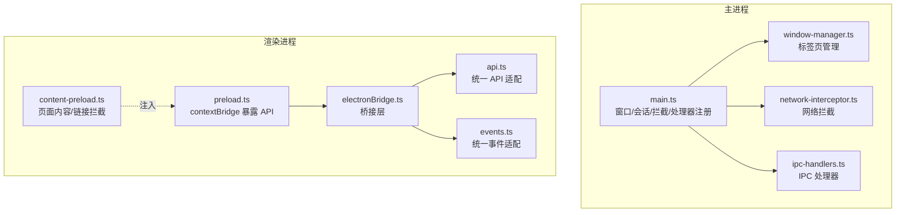
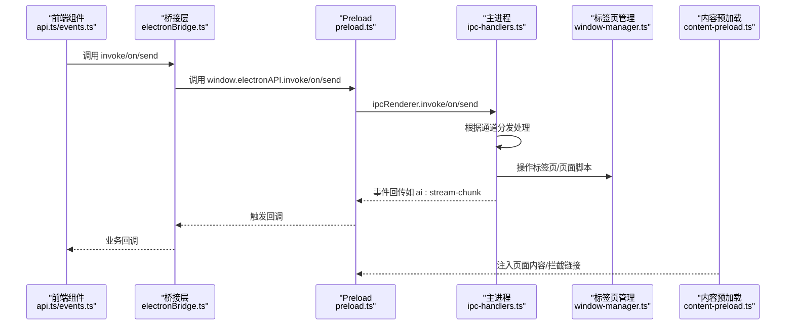
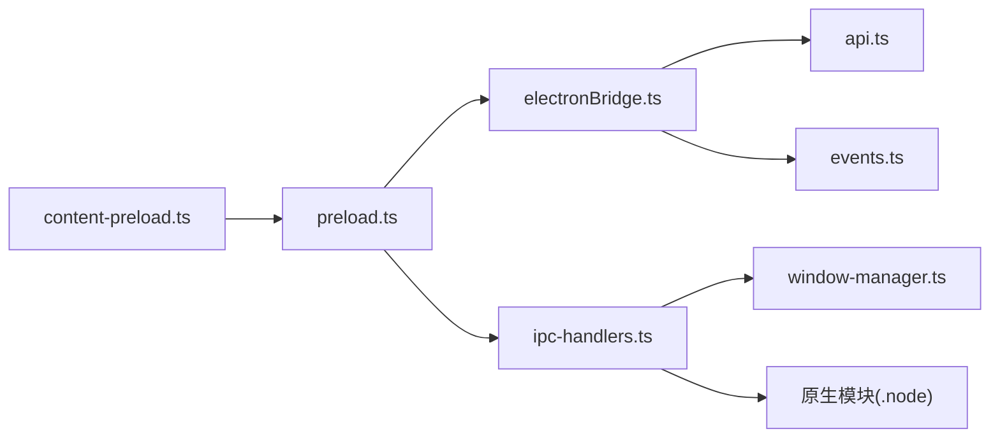

# Electron Bridge API

<cite>
**本文引用的文件列表**
- [electron/main.ts](file://electron/main.ts)
- [electron/preload.ts](file://electron/preload.ts)
- [electron/ipc-handlers.ts](file://electron/ipc-handlers.ts)
- [electron/content-preload.ts](file://electron/content-preload.ts)
- [electron/window-manager.ts](file://electron/window-manager.ts)
- [electron/network-interceptor.ts](file://electron/network-interceptor.ts)
- [src-web/src/lib/electronBridge.ts](file://src-web/src/lib/electronBridge.ts)
- [src-web/src/lib/api.ts](file://src-web/src/lib/api.ts)
- [src-web/src/lib/events.ts](file://src-web/src/lib/events.ts)
</cite>

## 目录
1. [简介](#简介)
2. [项目结构](#项目结构)
3. [核心组件](#核心组件)
4. [架构总览](#架构总览)
5. [详细组件分析](#详细组件分析)
6. [依赖关系分析](#依赖关系分析)
7. [性能考量](#性能考量)
8. [故障排查指南](#故障排查指南)
9. [结论](#结论)
10. [附录](#附录)

## 简介
本文件为 CoSurf 的 Electron Bridge API 详细参考文档，聚焦于 Electron IPC 通信接口的完整规范，涵盖消息传递机制、事件处理、数据序列化、主进程通信、渲染进程交互、数据传输协议、IPC 通道建立与维护、消息格式规范、错误处理机制等。文档同时提供接口签名、参数说明、返回值类型、异常处理以及实际使用场景与调用示例路径，帮助开发者正确调用 Electron Bridge API 进行前后端通信。

## 项目结构
CoSurf 采用 Electron 主进程 + 渲染进程（React）的架构，并通过 preload 脚本暴露受控的 IPC API 给前端。核心文件分布如下：
- Electron 主进程：负责窗口创建、会话配置、网络拦截、IPC 处理器注册、标签页管理等
- Preload 脚本：通过 contextBridge 暴露安全的 invoke/on/send 等 API
- 内容预加载脚本：注入到每个标签页，提供页面内容提取与链接拦截
- 前端桥接层：统一 Electron API，提供与 Tauri 风格兼容的调用方式

图表来源
- [electron/main.ts:178-208](file://electron/main.ts#L178-L208)
- [electron/ipc-handlers.ts:48-539](file://electron/ipc-handlers.ts#L48-L539)
- [electron/preload.ts:180-225](file://electron/preload.ts#L180-L225)
- [electron/content-preload.ts:16-61](file://electron/content-preload.ts#L16-L61)
- [src-web/src/lib/electronBridge.ts:33-46](file://src-web/src/lib/electronBridge.ts#L33-L46)
- [src-web/src/lib/api.ts:13-18](file://src-web/src/lib/api.ts#L13-L18)
- [src-web/src/lib/events.ts:51-56](file://src-web/src/lib/events.ts#L51-L56)

章节来源
- [electron/main.ts:178-208](file://electron/main.ts#L178-L208)
- [electron/preload.ts:180-225](file://electron/preload.ts#L180-L225)
- [electron/ipc-handlers.ts:48-539](file://electron/ipc-handlers.ts#L48-L539)
- [electron/content-preload.ts:16-61](file://electron/content-preload.ts#L16-L61)
- [src-web/src/lib/electronBridge.ts:33-46](file://src-web/src/lib/electronBridge.ts#L33-L46)
- [src-web/src/lib/api.ts:13-18](file://src-web/src/lib/api.ts#L13-L18)
- [src-web/src/lib/events.ts:51-56](file://src-web/src/lib/events.ts#L51-L56)

## 核心组件
- ElectronAPI（前端暴露接口）：通过 preload.ts 暴露 invoke/on/send/once/removeAllListeners，支持白名单通道控制
- IPC 处理器（主进程）：在 ipc-handlers.ts 中集中注册，桥接前端请求与原生模块（Rust N-API），并处理流式事件与工具调用
- 标签页管理器（TabManager）：在 window-manager.ts 中实现标签页生命周期与状态同步
- 内容预加载脚本（cosurfContent）：在 content-preload.ts 中提供页面内容提取与链接拦截
- 前端桥接层（electronBridge.ts）：统一 Electron API，提供与 Tauri 风格兼容的调用方式
- 统一 API 适配层（api.ts）：封装具体 IPC 通道调用，负责 JSON 解析与参数传递
- 统一事件适配层（events.ts）：封装事件监听与一次性监听，抹平与 Tauri 的差异

章节来源
- [electron/preload.ts:13-28](file://electron/preload.ts#L13-L28)
- [electron/ipc-handlers.ts:48-539](file://electron/ipc-handlers.ts#L48-L539)
- [electron/window-manager.ts:29-248](file://electron/window-manager.ts#L29-L248)
- [electron/content-preload.ts:16-61](file://electron/content-preload.ts#L16-L61)
- [src-web/src/lib/electronBridge.ts:33-46](file://src-web/src/lib/electronBridge.ts#L33-L46)
- [src-web/src/lib/api.ts:13-18](file://src-web/src/lib/api.ts#L13-L18)
- [src-web/src/lib/events.ts:51-56](file://src-web/src/lib/events.ts#L51-L56)

## 架构总览
下图展示了 Electron Bridge 的端到端通信流程：前端通过 electronBridge 调用 preload 暴露的 invoke/on/send，主进程 ipc-handlers 根据通道分发到原生模块或内部服务，必要时通过标签页管理器与内容预加载脚本进行页面操作与事件回传。

图表来源
- [src-web/src/lib/api.ts:13-18](file://src-web/src/lib/api.ts#L13-L18)
- [src-web/src/lib/events.ts:51-56](file://src-web/src/lib/events.ts#L51-L56)
- [src-web/src/lib/electronBridge.ts:33-46](file://src-web/src/lib/electronBridge.ts#L33-L46)
- [electron/preload.ts:180-225](file://electron/preload.ts#L180-L225)
- [electron/ipc-handlers.ts:231-315](file://electron/ipc-handlers.ts#L231-L315)
- [electron/window-manager.ts:113-132](file://electron/window-manager.ts#L113-L132)
- [electron/content-preload.ts:65-78](file://electron/content-preload.ts#L65-L78)

## 详细组件分析

### 1) IPC 通道与消息格式规范
- 白名单通道
  - invoke 通道：限定在 preload.ts 的 ALLOWED_INVOKE_CHANNELS，覆盖数据库、AI、Agent、标签页、页面操作、截图、Skills、缓存、对话框、Shell、窗口控制等
  - send 通道：限定在 ALLOWED_SEND_CHANNELS，主要用于窗口控制与前端触发
  - on 通道：限定在 ALLOWED_ON_CHANNELS，用于接收主进程事件（如 AI 流式事件、标签页事件、截图事件、快捷键事件等）
- 参数传递
  - 前端统一使用位置参数（与 ipc-handlers.ts 签名一致），部分方法在 api.ts 中将对象参数序列化为 JSON 字符串再传递
  - 原生模块返回 JSON 字符串时，api.ts 提供 parseJSON/parseJSONOrNull 解析
- 事件回传
  - 主进程通过 ipcRenderer.send 将事件推送到前端，preload.ts 对事件负载进行透传
  - 事件名称与负载结构由各处理器定义，如 ai:stream-chunk、ai:tool-call-start、tab:switched 等

章节来源
- [electron/preload.ts:31-149](file://electron/preload.ts#L31-L149)
- [electron/preload.ts:180-225](file://electron/preload.ts#L180-L225)
- [src-web/src/lib/api.ts:25-49](file://src-web/src/lib/api.ts#L25-L49)
- [src-web/src/lib/events.ts:15-35](file://src-web/src/lib/events.ts#L15-L35)

### 2) 主进程通信与处理器注册
- 窗口控制：minimize/maximize/close/is_maximized
- 标签页管理：create/switch/close/navigate/back/forward/get_state/get_title/set_active
- 页面操作：get_content/screenshot/execute_script/inject_context/summarize/execute_action
- 数据库操作：大量 db:* 通道，统一映射到原生模块的 camelCase 方法
- AI 对话：ai:send_chat（流式）、ai:stop_generation、ai:generate_title；支持工具调用与 Electron 桥接工具
- Agent 操作：agent:execute/agent:configure_qwen/agent:summarize_page/agent:extract_memory
- Skills 管理：skills:list/delete_skill/toggle_skill/import_skill_from_markdown/directory/list_skill_files/get_skill_content
- 截图：screenshot:capture_full/capture_region/save/copy_to_clipboard
- 页面缓存：cache:save/load/cleanup
- 对话框与 Shell：dialog:open_file/dialog:save_file/shell:open_url
- 网络拦截：网络请求拦截、CSP/X-Frame-Options 移除、追踪域名阻断、API 请求记录

章节来源
- [electron/ipc-handlers.ts:53-71](file://electron/ipc-handlers.ts#L53-L71)
- [electron/ipc-handlers.ts:76-118](file://electron/ipc-handlers.ts#L76-L118)
- [electron/ipc-handlers.ts:123-186](file://electron/ipc-handlers.ts#L123-L186)
- [electron/ipc-handlers.ts:211-226](file://electron/ipc-handlers.ts#L211-L226)
- [electron/ipc-handlers.ts:231-315](file://electron/ipc-handlers.ts#L231-L315)
- [electron/ipc-handlers.ts:337-408](file://electron/ipc-handlers.ts#L337-L408)
- [electron/ipc-handlers.ts:413-436](file://electron/ipc-handlers.ts#L413-L436)
- [electron/ipc-handlers.ts:441-475](file://electron/ipc-handlers.ts#L441-L475)
- [electron/ipc-handlers.ts:480-502](file://electron/ipc-handlers.ts#L480-L502)
- [electron/ipc-handlers.ts:507-515](file://electron/ipc-handlers.ts#L507-L515)
- [electron/ipc-handlers.ts:520-522](file://electron/ipc-handlers.ts#L520-L522)

### 3) 渲染进程交互与桥接层
- electronBridge.ts
  - 提供 invoke/on/send/once/removeAllListeners，支持 isElectron 检测与 windowControls 快捷方法
  - 与 Tauri 风格兼容：listen/emit 别名
- api.ts
  - 统一封装所有 IPC 通道调用，按需序列化参数（JSON 字符串）
  - 统一解析原生模块返回的 JSON 字符串
- events.ts
  - 提供事件常量与 on/once/off/removeAllListeners，抹平与 Tauri 的差异

章节来源
- [src-web/src/lib/electronBridge.ts:33-46](file://src-web/src/lib/electronBridge.ts#L33-L46)
- [src-web/src/lib/electronBridge.ts:49-56](file://src-web/src/lib/electronBridge.ts#L49-L56)
- [src-web/src/lib/electronBridge.ts:59-66](file://src-web/src/lib/electronBridge.ts#L59-L66)
- [src-web/src/lib/electronBridge.ts:69-76](file://src-web/src/lib/electronBridge.ts#L69-L76)
- [src-web/src/lib/electronBridge.ts:79-82](file://src-web/src/lib/electronBridge.ts#L79-L82)
- [src-web/src/lib/electronBridge.ts:85-90](file://src-web/src/lib/electronBridge.ts#L85-L90)
- [src-web/src/lib/electronBridge.ts:93-95](file://src-web/src/lib/electronBridge.ts#L93-L95)
- [src-web/src/lib/electronBridge.ts:98-100](file://src-web/src/lib/electronBridge.ts#L98-L100)
- [src-web/src/lib/api.ts:13-18](file://src-web/src/lib/api.ts#L13-L18)
- [src-web/src/lib/api.ts:25-49](file://src-web/src/lib/api.ts#L25-L49)
- [src-web/src/lib/events.ts:51-56](file://src-web/src/lib/events.ts#L51-L56)

### 4) 标签页管理与页面操作
- 标签页管理器（TabManager）
  - 生命周期：create/switch/close/navigate/goBack/goForward/reload
  - 状态：getTabInfo/getAllTabInfo/getActiveTabId/tabCount
  - 事件：通过主进程 webContents.send 通知前端标签页切换与状态变化
- 页面操作
  - get_content：提取页面纯文本（清理脚本/样式/iframe）
  - screenshot：截图（通过原生模块）
  - execute_script：在指定标签页执行脚本
  - inject_context：注入页面上下文（URL、标题、文本片段长度等）
  - summarize：摘要（限制长度）
  - execute_action：在页面上执行点击/填充/滚动等动作

章节来源
- [electron/window-manager.ts:83-106](file://electron/window-manager.ts#L83-L106)
- [electron/window-manager.ts:113-132](file://electron/window-manager.ts#L113-L132)
- [electron/window-manager.ts:137-157](file://electron/window-manager.ts#L137-L157)
- [electron/window-manager.ts:162-182](file://electron/window-manager.ts#L162-L182)
- [electron/window-manager.ts:194-196](file://electron/window-manager.ts#L194-L196)
- [electron/window-manager.ts:208-210](file://electron/window-manager.ts#L208-L210)
- [electron/ipc-handlers.ts:123-186](file://electron/ipc-handlers.ts#L123-L186)

### 5) 内容预加载与链接拦截
- cosurfContent
  - getPageText/getPageHtml/getPageMeta/getPageLinks：提供页面内容提取能力
- 链接拦截
  - 拦截 target="_blank" 的链接与 window.open 调用，改由主进程创建新标签页
  - 通过 ipcRenderer.send('open-new-tab', url) 通知主进程

章节来源
- [electron/content-preload.ts:16-61](file://electron/content-preload.ts#L16-L61)
- [electron/content-preload.ts:65-78](file://electron/content-preload.ts#L65-L78)
- [electron/content-preload.ts:82-90](file://electron/content-preload.ts#L82-L90)
- [electron/ipc-handlers.ts:529-538](file://electron/ipc-handlers.ts#L529-L538)

### 6) 网络拦截与安全控制
- 拦截追踪域名请求，阻止广告与分析脚本
- 移除 CSP/X-Frame-Options 响应头，允许脚本注入与跨框架加载
- 记录 API 请求（如电商接口）供 AI 分析使用
- 提供 Cookie 管理与网络请求记录查询

章节来源
- [electron/network-interceptor.ts:44-50](file://electron/network-interceptor.ts#L44-L50)
- [electron/network-interceptor.ts:53-74](file://electron/network-interceptor.ts#L53-L74)
- [electron/network-interceptor.ts:78-109](file://electron/network-interceptor.ts#L78-L109)
- [electron/network-interceptor.ts:132-157](file://electron/network-interceptor.ts#L132-L157)

### 7) 错误处理与异常机制
- 白名单通道拒绝：preload.ts 对未授权通道直接拒绝并抛错
- 原生模块不可用：ipc-handlers.ts 在调用原生方法前检查，不可用时抛错
- 流式事件错误：ai:stream-error 事件携带错误信息
- 事件发送失败：当 sender.destroyed 时丢弃事件，避免崩溃
- JSON 解析失败：api.ts 提供 parseJSON/parseJSONOrNull，降级为原始值

章节来源
- [electron/preload.ts:181-187](file://electron/preload.ts#L181-L187)
- [electron/preload.ts:189-193](file://electron/preload.ts#L189-L193)
- [electron/ipc-handlers.ts:29-35](file://electron/ipc-handlers.ts#L29-L35)
- [electron/ipc-handlers.ts:215-225](file://electron/ipc-handlers.ts#L215-L225)
- [electron/ipc-handlers.ts:305-307](file://electron/ipc-handlers.ts#L305-L307)
- [electron/ipc-handlers.ts:251-255](file://electron/ipc-handlers.ts#L251-L255)
- [src-web/src/lib/api.ts:25-49](file://src-web/src/lib/api.ts#L25-L49)

### 8) 使用场景与调用示例（路径指引）
- 发送聊天消息（流式）
  - 前端调用：[src-web/src/lib/api.ts:258-264](file://src-web/src/lib/api.ts#L258-L264)
  - 主进程处理：[electron/ipc-handlers.ts:231-315](file://electron/ipc-handlers.ts#L231-L315)
  - 事件回传：ai:stream-chunk/ai:tool-call-start/ai:tool-call-result/ai:stream-error
- 监听 AI 流式事件
  - 前端监听：[src-web/src/lib/events.ts:51-56](file://src-web/src/lib/events.ts#L51-L56)
  - 事件常量：[src-web/src/lib/events.ts:15-35](file://src-web/src/lib/events.ts#L15-L35)
- 创建新标签页
  - 前端调用：[src-web/src/lib/api.ts:294-295](file://src-web/src/lib/api.ts#L294-L295)
  - 主进程处理：[electron/ipc-handlers.ts:76-80](file://electron/ipc-handlers.ts#L76-L80)
  - 标签页切换事件：tab:switched
- 页面内容提取
  - 前端调用：[src-web/src/lib/api.ts:326-327](file://src-web/src/lib/api.ts#L326-L327)
  - 主进程处理：[electron/ipc-handlers.ts:123-131](file://electron/ipc-handlers.ts#L123-L131)
- 链接拦截与新标签页创建
  - 内容脚本拦截：[electron/content-preload.ts:65-78](file://electron/content-preload.ts#L65-L78)
  - 主进程创建：[electron/ipc-handlers.ts:529-538](file://electron/ipc-handlers.ts#L529-L538)

章节来源
- [src-web/src/lib/api.ts:258-264](file://src-web/src/lib/api.ts#L258-L264)
- [electron/ipc-handlers.ts:231-315](file://electron/ipc-handlers.ts#L231-L315)
- [src-web/src/lib/events.ts:51-56](file://src-web/src/lib/events.ts#L51-L56)
- [src-web/src/lib/events.ts:15-35](file://src-web/src/lib/events.ts#L15-L35)
- [src-web/src/lib/api.ts:294-295](file://src-web/src/lib/api.ts#L294-L295)
- [electron/ipc-handlers.ts:76-80](file://electron/ipc-handlers.ts#L76-L80)
- [electron/ipc-handlers.ts:123-131](file://electron/ipc-handlers.ts#L123-L131)
- [electron/content-preload.ts:65-78](file://electron/content-preload.ts#L65-L78)
- [electron/ipc-handlers.ts:529-538](file://electron/ipc-handlers.ts#L529-L538)

## 依赖关系分析
- 主进程依赖
  - Electron 核心：BrowserWindow/session/webRequest/ipcMain
  - 原生模块：通过 require 动态加载 .node 文件，调用 N-API 方法
  - 标签页管理器：管理多标签页生命周期与状态
- 前端依赖
  - preload.ts 通过 contextBridge 暴露受控 API
  - electronBridge.ts 提供与 Tauri 风格兼容的调用方式
  - api.ts/events.ts 封装具体通道与事件

图表来源
- [electron/preload.ts:180-225](file://electron/preload.ts#L180-L225)
- [src-web/src/lib/electronBridge.ts:33-46](file://src-web/src/lib/electronBridge.ts#L33-L46)
- [src-web/src/lib/api.ts:13-18](file://src-web/src/lib/api.ts#L13-L18)
- [src-web/src/lib/events.ts:51-56](file://src-web/src/lib/events.ts#L51-L56)
- [electron/ipc-handlers.ts:48-539](file://electron/ipc-handlers.ts#L48-L539)
- [electron/window-manager.ts:29-248](file://electron/window-manager.ts#L29-L248)
- [electron/content-preload.ts:16-61](file://electron/content-preload.ts#L16-L61)

章节来源
- [electron/preload.ts:180-225](file://electron/preload.ts#L180-L225)
- [src-web/src/lib/electronBridge.ts:33-46](file://src-web/src/lib/electronBridge.ts#L33-L46)
- [src-web/src/lib/api.ts:13-18](file://src-web/src/lib/api.ts#L13-L18)
- [src-web/src/lib/events.ts:51-56](file://src-web/src/lib/events.ts#L51-L56)
- [electron/ipc-handlers.ts:48-539](file://electron/ipc-handlers.ts#L48-L539)
- [electron/window-manager.ts:29-248](file://electron/window-manager.ts#L29-L248)
- [electron/content-preload.ts:16-61](file://electron/content-preload.ts#L16-L61)

## 性能考量
- 预加载脚本隔离：contextIsolation=true，确保安全与稳定
- 事件批量与节流：对于高频事件（如页面滚动、标签页切换）建议在前端做节流/去抖
- JSON 序列化：大对象参数建议在 api.ts 层做序列化，减少 IPC 传输体积
- 原生模块调用：尽量合并多次调用，避免频繁跨语言边界
- 截图与页面脚本：execute_script 与截图操作较重，建议在后台线程或空闲时段执行

## 故障排查指南
- 通道未授权
  - 现象：调用 invoke/on/send 抛错“Unauthorized IPC channel”
  - 处理：确认通道是否在 preload.ts 白名单中
  - 参考：[electron/preload.ts:181-187](file://electron/preload.ts#L181-L187)
- 原生模块不可用
  - 现象：调用 db/*、ai/*、skills/* 等报“Native module not available”
  - 处理：确认 .node 文件存在且路径正确，检查初始化日志
  - 参考：[electron/ipc-handlers.ts:29-35](file://electron/ipc-handlers.ts#L29-L35)
- 事件丢失
  - 现象：监听 ai:stream-chunk 无回调
  - 处理：确认主进程已发送事件，检查 sender.destroyed 状态
  - 参考：[electron/ipc-handlers.ts:251-255](file://electron/ipc-handlers.ts#L251-L255)
- JSON 解析失败
  - 现象：原生模块返回字符串但解析失败
  - 处理：使用 api.ts 的 parseJSONOrNull 降级处理
  - 参考：[src-web/src/lib/api.ts:25-49](file://src-web/src/lib/api.ts#L25-L49)
- 链接拦截无效
  - 现象：target="_blank" 链接仍新开外部窗口
  - 处理：确认 content-preload.ts 已注入，主进程 open-new-tab 处理器已注册
  - 参考：[electron/content-preload.ts:65-78](file://electron/content-preload.ts#L65-L78), [electron/ipc-handlers.ts:529-538](file://electron/ipc-handlers.ts#L529-L538)

章节来源
- [electron/preload.ts:181-187](file://electron/preload.ts#L181-L187)
- [electron/ipc-handlers.ts:29-35](file://electron/ipc-handlers.ts#L29-L35)
- [electron/ipc-handlers.ts:251-255](file://electron/ipc-handlers.ts#L251-L255)
- [src-web/src/lib/api.ts:25-49](file://src-web/src/lib/api.ts#L25-L49)
- [electron/content-preload.ts:65-78](file://electron/content-preload.ts#L65-L78)
- [electron/ipc-handlers.ts:529-538](file://electron/ipc-handlers.ts#L529-L538)

## 结论
CoSurf 的 Electron Bridge API 通过受控的白名单通道、严格的参数与事件规范、完善的错误处理与网络拦截机制，实现了安全、高效、可扩展的前后端通信。前端通过 electronBridge.ts 提供与 Tauri 风格兼容的调用方式，配合 api.ts/events.ts 的统一封装，极大降低了迁移成本与开发复杂度。建议在实际使用中遵循本文档的通道规范、参数约定与错误处理策略，确保系统的稳定性与一致性。

## 附录
- 通道清单（invoke/on/send）
  - invoke：db:*、ai:*、agent:*、tab:*、page:*、screenshot:*、skills:*、cache:*、dialog:*、shell:*、window:*、mcp:*
  - on：ai:stream-chunk、ai:stream-error、ai:tool-call-start、ai:tool-call-result、tab:*、screenshot-*、shortcut:screenshot、updater:update-available、webview:*、cosurf:*
  - send：open-new-tab、window:* 等
- 事件常量
  - AI 流式：AI_STREAM_CHUNK、AI_STREAM_ERROR、AI_TOOL_CALL_START、AI_TOOL_CALL_RESULT
  - 标签页：TAB_CREATE、TAB_NAVIGATE、TAB_TITLE_UPDATED、TAB_LOADING、TAB_LOADED、TAB_SWITCHED
  - 系统：SHORTCUT_SCREENSHOT、UPDATER_UPDATE_AVAILABLE、WEBVIEW_CREATE_TAB、COSURF_NEW_TAB_RESPONSE

章节来源
- [electron/preload.ts:31-177](file://electron/preload.ts#L31-L177)
- [src-web/src/lib/events.ts:15-35](file://src-web/src/lib/events.ts#L15-L35)