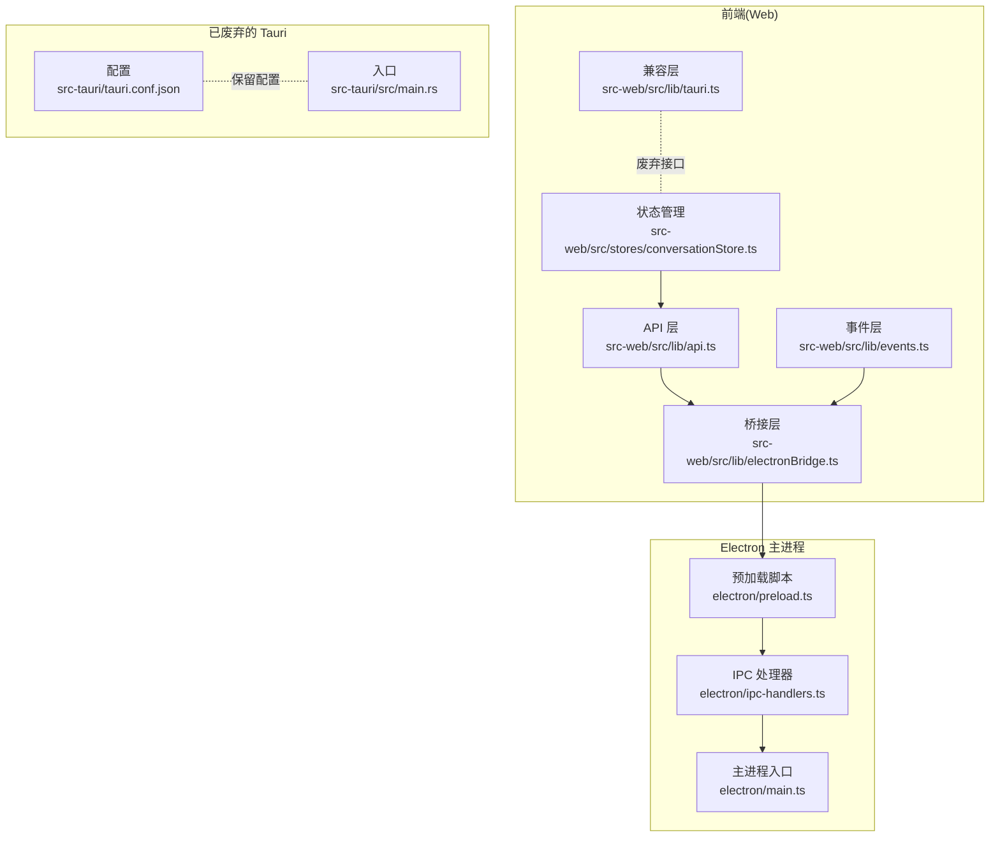
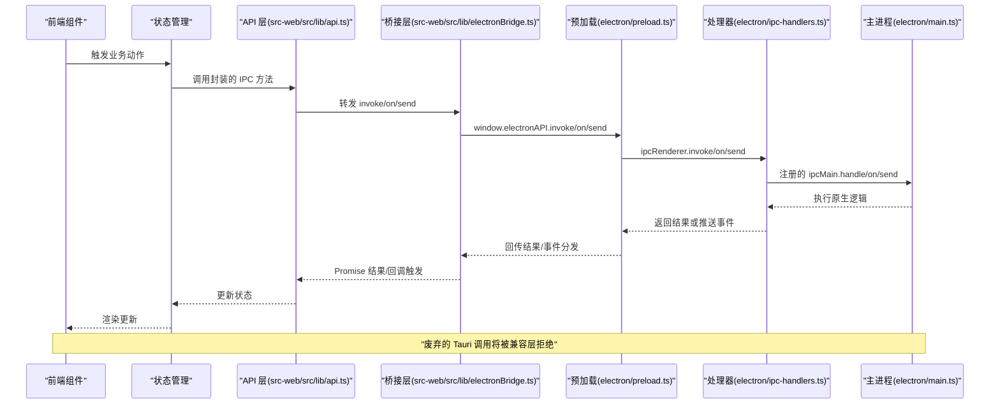
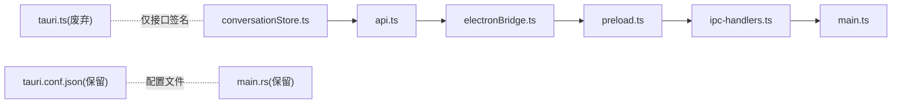

# Tauri API

<cite>
**本文引用的文件**
- [src-web/src/lib/tauri.ts](file://src-web/src/lib/tauri.ts)
- [src-web/src/lib/electronBridge.ts](file://src-web/src/lib/electronBridge.ts)
- [src-web/src/lib/events.ts](file://src-web/src/lib/events.ts)
- [src-web/src/lib/api.ts](file://src-web/src/lib/api.ts)
- [electron/preload.ts](file://electron/preload.ts)
- [electron/main.ts](file://electron/main.ts)
- [electron/ipc-handlers.ts](file://electron/ipc-handlers.ts)
- [src-tauri/tauri.conf.json](file://src-tauri/tauri.conf.json)
- [src-tauri/src/main.rs](file://src-tauri/src/main.rs)
- [src-web/src/stores/conversationStore.ts](file://src-web/src/stores/conversationStore.ts)
</cite>

## 目录
1. [简介](#简介)
2. [项目结构](#项目结构)
3. [核心组件](#核心组件)
4. [架构总览](#架构总览)
5. [详细组件分析](#详细组件分析)
6. [依赖关系分析](#依赖关系分析)
7. [性能考量](#性能考量)
8. [故障排查指南](#故障排查指南)
9. [结论](#结论)
10. [附录](#附录)

## 简介
本文件为 CoSurf 项目中“已废弃但仍保留”的 Tauri API 封装接口的详细参考文档。尽管项目已迁移到 Electron IPC，但为保证向后兼容，仓库中仍保留了与 Tauri API 签名一致的兼容层。本文将系统说明以下内容：
- isTauri()：检测当前运行环境是否为 Tauri（始终返回 false，表示非 Tauri 环境）
- invoke()：命令调用（抛出异常，提示改用 Electron IPC）
- listen()：事件监听（返回空取消函数，不产生实际监听）
- 迁移策略：如何从 Tauri API 平滑迁移到 Electron IPC
- 完整接口签名、参数说明、返回值类型、错误处理
- 实际使用示例（以路径形式给出，避免直接粘贴代码）

## 项目结构
围绕 Tauri 兼容层与 Electron 迁移的关键文件如下：
- src-web/src/lib/tauri.ts：废弃的 Tauri 兼容层（仅保留接口签名）
- src-web/src/lib/electronBridge.ts：Electron 通信桥接层（推荐使用的替代层）
- src-web/src/lib/events.ts：事件适配层（封装 Electron IPC 事件）
- src-web/src/lib/api.ts：统一 API 适配层（封装具体 IPC 通道）
- electron/preload.ts：Electron 预加载脚本（白名单与安全控制）
- electron/main.ts：主进程入口（窗口、协议、快捷键等）
- electron/ipc-handlers.ts：IPC 处理器（注册 handle/on/send）
- src-tauri/tauri.conf.json：Tauri 配置（项目仍保留 Tauri 配置文件）
- src-tauri/src/main.rs：Tauri 入口（项目仍保留 Tauri 入口文件）

图表来源
- [src-web/src/lib/tauri.ts:1-20](file://src-web/src/lib/tauri.ts#L1-L20)
- [src-web/src/lib/electronBridge.ts:1-100](file://src-web/src/lib/electronBridge.ts#L1-L100)
- [src-web/src/lib/events.ts:1-83](file://src-web/src/lib/events.ts#L1-L83)
- [src-web/src/lib/api.ts:1-445](file://src-web/src/lib/api.ts#L1-L445)
- [electron/preload.ts:30-229](file://electron/preload.ts#L30-L229)
- [electron/main.ts:1-200](file://electron/main.ts#L1-L200)
- [electron/ipc-handlers.ts:282-390](file://electron/ipc-handlers.ts#L282-L390)
- [src-tauri/tauri.conf.json:1-72](file://src-tauri/tauri.conf.json#L1-L72)
- [src-tauri/src/main.rs:1-6](file://src-tauri/src/main.rs#L1-L6)

章节来源
- [src-web/src/lib/tauri.ts:1-20](file://src-web/src/lib/tauri.ts#L1-L20)
- [src-web/src/lib/electronBridge.ts:1-100](file://src-web/src/lib/electronBridge.ts#L1-L100)
- [src-web/src/lib/events.ts:1-83](file://src-web/src/lib/events.ts#L1-L83)
- [src-web/src/lib/api.ts:1-445](file://src-web/src/lib/api.ts#L1-L445)
- [electron/preload.ts:30-229](file://electron/preload.ts#L30-L229)
- [electron/main.ts:1-200](file://electron/main.ts#L1-L200)
- [electron/ipc-handlers.ts:282-390](file://electron/ipc-handlers.ts#L282-L390)
- [src-tauri/tauri.conf.json:1-72](file://src-tauri/tauri.conf.json#L1-L72)
- [src-tauri/src/main.rs:1-6](file://src-tauri/src/main.rs#L1-L6)

## 核心组件
- 兼容层（废弃）：提供与 @tauri-apps/api 一致的接口签名，但行为已废弃。
  - isTauri(): 始终返回 false
  - invoke(cmd, args?): 抛出错误，提示改用 Electron IPC
  - listen(event, handler): 返回空取消函数，不建立监听
- 桥接层（推荐）：提供与 Tauri API 签名一致的替代实现，内部通过 window.electronAPI 调用 Electron IPC。
  - invoke(channel, args?): 请求并等待回复
  - on(event, callback): 持续监听事件
  - send(event, payload?): 发送消息
  - once(event, callback): 一次性监听
  - removeAllListeners(event): 移除指定事件的所有监听器
- 事件层：统一事件常量与监听封装，抹平 Tauri 与 Electron 的差异
- API 层：按功能域划分的 IPC 通道封装（如 db、ai、tab、page、screenshot、skills、cache、dialog、shell、win、mcp 等）

章节来源
- [src-web/src/lib/tauri.ts:6-19](file://src-web/src/lib/tauri.ts#L6-L19)
- [src-web/src/lib/electronBridge.ts:33-82](file://src-web/src/lib/electronBridge.ts#L33-L82)
- [src-web/src/lib/events.ts:14-83](file://src-web/src/lib/events.ts#L14-L83)
- [src-web/src/lib/api.ts:12-445](file://src-web/src/lib/api.ts#L12-L445)

## 架构总览
下图展示了从前端到主进程的 IPC 流程，以及废弃的 Tauri 与推荐的 Electron 方案之间的关系。

图表来源
- [src-web/src/lib/api.ts:12-19](file://src-web/src/lib/api.ts#L12-L19)
- [src-web/src/lib/electronBridge.ts:33-82](file://src-web/src/lib/electronBridge.ts#L33-L82)
- [electron/preload.ts:180-222](file://electron/preload.ts#L180-L222)
- [electron/ipc-handlers.ts:282-390](file://electron/ipc-handlers.ts#L282-L390)
- [electron/main.ts:177-200](file://electron/main.ts#L177-L200)

## 详细组件分析

### isTauri() 接口
- 用途：检测当前运行环境是否为 Tauri
- 行为：始终返回 false（表示当前非 Tauri 环境）
- 适用场景：条件分支判断（例如在 Tauri 与 Electron 之间做兼容处理）
- 注意：该接口已废弃，不应再用于功能判断

接口签名
- isTauri(): boolean

返回值
- false：表示当前运行环境不是 Tauri

章节来源
- [src-web/src/lib/tauri.ts:6-8](file://src-web/src/lib/tauri.ts#L6-L8)

### invoke() 接口
- 用途：调用后端命令并等待返回
- 行为：抛出错误，提示改用 Electron IPC；在废弃兼容层中，参数与返回类型与 Tauri 保持一致
- 适用场景：迁移前的占位调用
- 迁移建议：替换为 Electron 桥接层或 API 层的对应方法

接口签名
- invoke<T>(cmd: string, args?: Record<string, unknown>): Promise<T>

参数
- cmd: 命令名（在 Electron 中对应 IPC 通道名）
- args?: 命名参数对象（在 Electron 中会被转换为位置参数）

返回值
- Promise<T>：与 Tauri invoke 保持签名一致

错误处理
- 抛出错误：提示“Tauri 不再受支持，请改用 Electron IPC”

章节来源
- [src-web/src/lib/tauri.ts:10-12](file://src-web/src/lib/tauri.ts#L10-L12)

### listen() 接口
- 用途：持续监听来自后端的事件
- 行为：返回一个空的取消函数，不建立任何监听
- 适用场景：迁移前的占位监听
- 迁移建议：替换为 Electron 事件层的 on 或 electronBridge 的 on

接口签名
- listen<T>(event: string, handler: (payload: T) => void): Promise<() => void>

参数
- event: 事件名（在 Electron 中对应 IPC 通道名）
- handler: 事件处理器

返回值
- 返回一个取消订阅函数（在兼容层中为空实现）

章节来源
- [src-web/src/lib/tauri.ts:14-19](file://src-web/src/lib/tauri.ts#L14-L19)

### Electron 桥接层（推荐替代）
- 作用：提供与 Tauri API 签名一致的 Electron IPC 封装
- 关键方法
  - invoke(channel, args?): 请求并等待回复（内部将命名参数转换为位置参数）
  - on(event, callback): 持续监听事件
  - send(event, payload?): 发送消息
  - once(event, callback): 一次性监听
  - removeAllListeners(event): 移除指定事件的所有监听
  - isElectron(): 检测是否在 Electron 环境中运行
  - listen、emit：on、send 的别名

接口签名（部分）
- invoke<T = any>(channel: string, args?: Record<string, any>): Promise<T>
- on<T = any>(event: string, callback: (payload: T) => void): () => void
- send(event: string, payload?: any): void
- once<T = any>(event: string, callback: (payload: T) => void): void
- removeAllListeners(event: string): void
- isElectron(): boolean

章节来源
- [src-web/src/lib/electronBridge.ts:33-99](file://src-web/src/lib/electronBridge.ts#L33-L99)

### 事件层（Events）
- 作用：统一事件常量与监听封装，抹平 Tauri 与 Electron 的差异
- 事件常量：AI 流式事件、标签页事件、系统事件等
- 关键方法
  - on(event, callback): 持续监听
  - once(event, callback): 一次性监听
  - off(unsubscribe): 取消订阅
  - removeAllListeners(event): 移除指定事件的所有监听
  - listen：on 的别名

章节来源
- [src-web/src/lib/events.ts:14-83](file://src-web/src/lib/events.ts#L14-L83)

### API 层（API）
- 作用：按功能域封装 IPC 通道，每个方法直接调用 window.electronAPI.invoke
- 功能域：db、ai、agent、tab、page、screenshot、skills、cache、dialog、shell、win、mcp 等
- 特点：使用位置参数（与 ipc-handlers.ts 签名一致），内置 JSON 解析与错误处理

章节来源
- [src-web/src/lib/api.ts:12-445](file://src-web/src/lib/api.ts#L12-L445)

### 预加载与主进程（安全与通道）
- 预加载脚本（preload.ts）
  - 白名单：限定允许的 IPC 通道（invoke、on、send）
  - 安全控制：对未授权通道进行拦截与告警
  - 类型声明：声明 window.electronAPI 与 windowControls
- 主进程（main.ts）
  - 创建 BrowserWindow，加载前端资源
  - 注册自定义协议、全局快捷键
  - 初始化原生模块与网络拦截
  - 创建标签页管理器并注册 IPC 处理器

章节来源
- [electron/preload.ts:30-229](file://electron/preload.ts#L30-L229)
- [electron/main.ts:31-200](file://electron/main.ts#L31-L200)

### IPC 处理器（ipc-handlers.ts）
- 作用：注册 ipcMain.handle/on/send，桥接前端与原生模块
- 示例：ai:send_chat、ai:stop_generation、agent:execute 等
- 错误处理：捕获异常并回传错误事件

章节来源
- [electron/ipc-handlers.ts:282-390](file://electron/ipc-handlers.ts#L282-L390)

### 迁移策略与最佳实践
- 从 Tauri 到 Electron 的迁移步骤
  - 将所有 invoke('command', args) 替换为 electronBridge.invoke('command', args) 或 API 层对应方法
  - 将所有 listen('event', handler) 替换为 electronBridge.on('event', handler) 或 events.on('event', handler)
  - 将所有 emit('event', payload) 替换为 electronBridge.send('event', payload) 或 events.send('event', payload)
- 何时使用各层
  - electronBridge：需要与 Tauri API 签名完全一致时
  - events：仅需事件监听/发送时
  - api：需要按功能域封装的 IPC 调用时
- 兼容层的使用
  - 兼容层仅保留接口签名，不提供实际功能，应尽快替换为 Electron 方案

章节来源
- [src-web/src/lib/tauri.ts:1-5](file://src-web/src/lib/tauri.ts#L1-L5)
- [src-web/src/lib/electronBridge.ts:1-11](file://src-web/src/lib/electronBridge.ts#L1-L11)

## 依赖关系分析
- 前端依赖链
  - 状态管理（如 conversationStore）依赖 API 层
  - API 层依赖桥接层（electronBridge）
  - 事件层依赖桥接层（on/send）
  - 桥接层依赖预加载脚本（window.electronAPI）
- 预加载与主进程
  - 预加载脚本对 IPC 通道进行白名单控制
  - 主进程注册 IPC 处理器并执行原生逻辑
- 兼容层与废弃 Tauri
  - 兼容层仅保留接口签名，不参与实际通信
  - Tauri 配置与入口文件仍存在于项目中，但不再使用

图表来源
- [src-web/src/stores/conversationStore.ts:1-200](file://src-web/src/stores/conversationStore.ts#L1-L200)
- [src-web/src/lib/api.ts:12-19](file://src-web/src/lib/api.ts#L12-L19)
- [src-web/src/lib/electronBridge.ts:33-82](file://src-web/src/lib/electronBridge.ts#L33-L82)
- [electron/preload.ts:180-222](file://electron/preload.ts#L180-L222)
- [electron/ipc-handlers.ts:282-390](file://electron/ipc-handlers.ts#L282-L390)
- [electron/main.ts:177-200](file://electron/main.ts#L177-L200)
- [src-web/src/lib/tauri.ts:6-19](file://src-web/src/lib/tauri.ts#L6-L19)
- [src-tauri/tauri.conf.json:1-72](file://src-tauri/tauri.conf.json#L1-L72)
- [src-tauri/src/main.rs:1-6](file://src-tauri/src/main.rs#L1-L6)

章节来源
- [src-web/src/stores/conversationStore.ts:1-200](file://src-web/src/stores/conversationStore.ts#L1-L200)
- [src-web/src/lib/tauri.ts:6-19](file://src-web/src/lib/tauri.ts#L6-L19)
- [src-web/src/lib/electronBridge.ts:33-99](file://src-web/src/lib/electronBridge.ts#L33-L99)
- [electron/preload.ts:30-229](file://electron/preload.ts#L30-L229)
- [electron/ipc-handlers.ts:282-390](file://electron/ipc-handlers.ts#L282-L390)
- [electron/main.ts:177-200](file://electron/main.ts#L177-L200)

## 性能考量
- Electron 桥接层在 invoke 时将命名参数转换为位置参数，减少参数映射开销
- 事件监听采用白名单机制，避免不必要的事件传播
- API 层对 N-API 返回的 JSON 字符串进行解析，注意字符串与对象的边界处理
- 预加载脚本对未授权通道进行拦截，降低安全风险与无效 IPC 调用

## 故障排查指南
- Electron API 不可用
  - 现象：调用 invoke/on/send 抛出错误或无响应
  - 排查：确认是否在 Electron 环境中运行（isElectron）
  - 参考：桥接层与事件层均包含环境检查与告警
- 通道未授权
  - 现象：invoke/on/send 被拦截并报错
  - 排查：检查预加载脚本白名单是否包含目标通道
  - 参考：预加载脚本的 ALLOWED_INVOKE_CHANNELS、ALLOWED_ON_CHANNELS、ALLOWED_SEND_CHANNELS
- 事件未触发
  - 现象：监听不到事件
  - 排查：确认事件名是否在白名单中，确认主进程是否正确发送事件
  - 参考：事件层与预加载脚本的 on/send 实现
- 迁移后行为不一致
  - 现象：Tauri 与 Electron 的事件负载结构不同
  - 排查：事件层已抹平差异，确保使用统一事件常量与封装方法
  - 参考：事件层注释说明 Tauri 与 Electron 的差异

章节来源
- [src-web/src/lib/electronBridge.ts:33-82](file://src-web/src/lib/electronBridge.ts#L33-L82)
- [src-web/src/lib/events.ts:37-83](file://src-web/src/lib/events.ts#L37-L83)
- [electron/preload.ts:180-222](file://electron/preload.ts#L180-L222)

## 结论
- Tauri API 兼容层已废弃，仅保留接口签名，不应再用于实际功能
- 推荐使用 Electron 桥接层（electronBridge）、事件层（events）与 API 层（api）替代 Tauri API
- 迁移时遵循“命令名→IPC 通道名、事件名→IPC 通道名”的映射原则
- 预加载脚本与主进程共同保障 IPC 通道的安全与稳定

## 附录

### 实际使用示例（以路径形式给出）
- 使用 API 层发送聊天消息并监听流式事件
  - [src-web/src/stores/conversationStore.ts:172-200](file://src-web/src/stores/conversationStore.ts#L172-L200)
- 使用 Electron 桥接层发起请求与事件监听
  - [src-web/src/lib/electronBridge.ts:33-82](file://src-web/src/lib/electronBridge.ts#L33-L82)
- 使用事件层统一事件常量与监听
  - [src-web/src/lib/events.ts:14-83](file://src-web/src/lib/events.ts#L14-L83)
- 使用 API 层封装的数据库操作
  - [src-web/src/lib/api.ts:54-249](file://src-web/src/lib/api.ts#L54-L249)