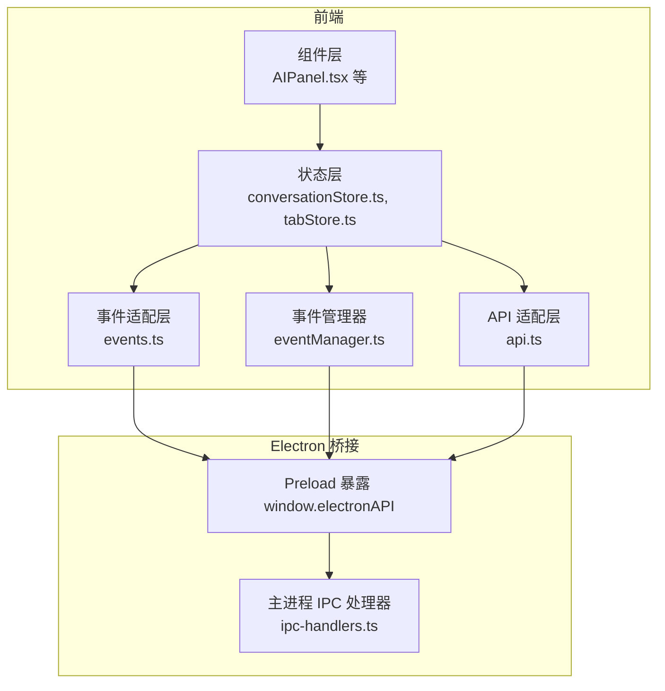
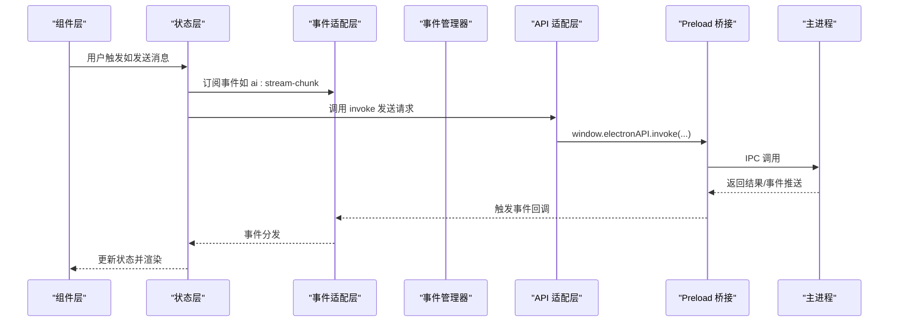
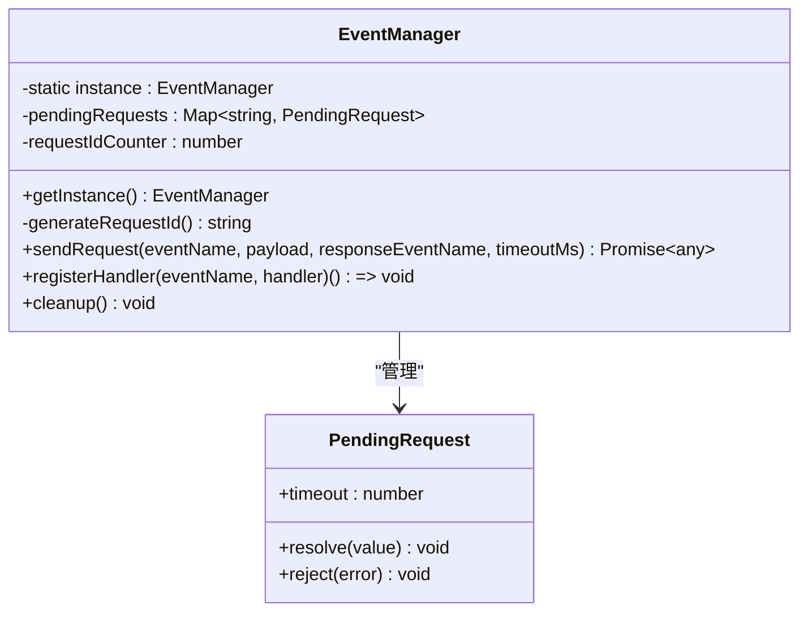
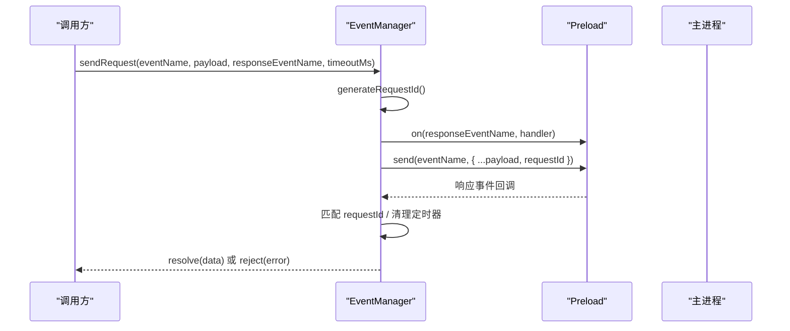
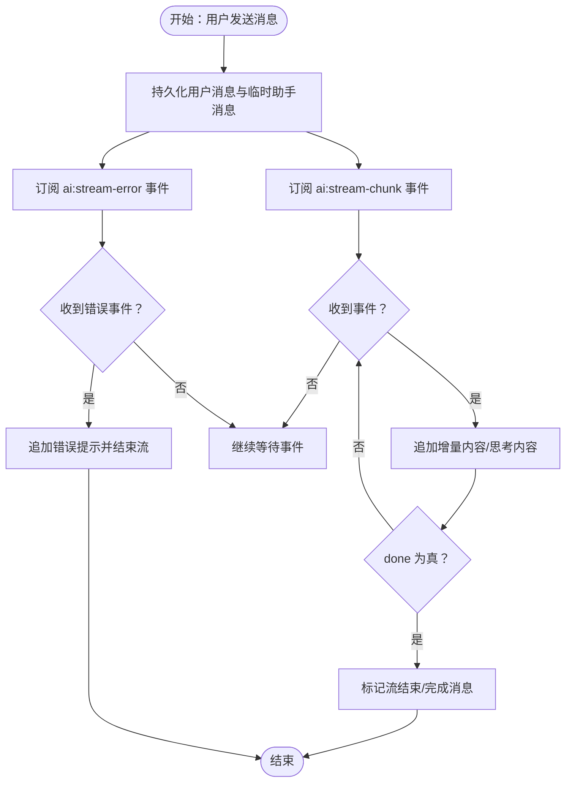
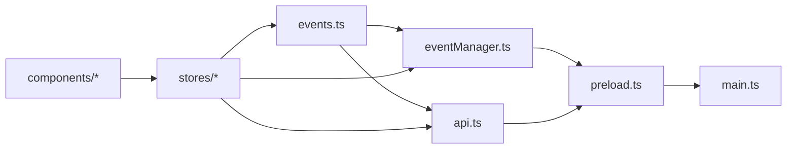

# 事件管理 API

<cite>
**本文引用的文件**
- [eventManager.ts](file://src-web/src/lib/eventManager.ts)
- [events.ts](file://src-web/src/lib/events.ts)
- [api.ts](file://src-web/src/lib/api.ts)
- [conversationStore.ts](file://src-web/src/stores/conversationStore.ts)
- [tabStore.ts](file://src-web/src/stores/tabStore.ts)
- [AIPanel.tsx](file://src-web/src/components/layout/AIPanel.tsx)
- [ipc-handlers.ts](file://electron/ipc-handlers.ts)
- [preload.ts](file://electron/preload.ts)
- [main.ts](file://electron/main.ts)
</cite>

## 目录
1. [简介](#简介)
2. [项目结构](#项目结构)
3. [核心组件](#核心组件)
4. [架构总览](#架构总览)
5. [详细组件分析](#详细组件分析)
6. [依赖关系分析](#依赖关系分析)
7. [性能考量](#性能考量)
8. [故障排查指南](#故障排查指南)
9. [结论](#结论)
10. [附录](#附录)

## 简介
本文件为 CoSurf 事件管理 API 的权威参考文档，覆盖事件系统的完整规范，包括事件注册、订阅、发布与响应机制。文档详细说明事件管理器的实现细节，包括事件监听器的添加与移除、事件传播机制、请求-响应模式与超时处理、事件类型定义、事件负载格式以及事件生命周期管理。同时提供接口签名、参数说明、返回值类型、事件处理回调等关键信息，并结合实际代码示例与使用场景，帮助开发者正确使用事件系统实现组件间通信与状态同步。

## 项目结构
事件系统主要由以下层次构成：
- 事件适配层：统一 Electron IPC 与 Tauri 事件 API 的差异，提供 on/once/off/removeAllListeners 等兼容接口。
- 事件管理器：封装请求-响应模式，支持带超时的请求派发与响应监听，维护待处理请求映射。
- Store 层：通过事件监听实现 UI 与业务状态的实时更新，如会话流式输出、标签页导航等。
- 组件层：通过 Store 与事件系统交互，驱动界面行为与状态变更。
- 主进程桥接：Electron 主进程通过 preload 暴露 window.electronAPI，供前端事件与 API 调用使用。

图表来源
- [events.ts:1-83](file://src-web/src/lib/events.ts#L1-L83)
- [eventManager.ts:1-108](file://src-web/src/lib/eventManager.ts#L1-L108)
- [api.ts:1-445](file://src-web/src/lib/api.ts#L1-L445)
- [conversationStore.ts:1-365](file://src-web/src/stores/conversationStore.ts#L1-L365)
- [tabStore.ts:1-248](file://src-web/src/stores/tabStore.ts#L1-L248)
- [ipc-handlers.ts](file://electron/ipc-handlers.ts)
- [preload.ts](file://electron/preload.ts)
- [main.ts](file://electron/main.ts)

章节来源
- [events.ts:1-83](file://src-web/src/lib/events.ts#L1-L83)
- [eventManager.ts:1-108](file://src-web/src/lib/eventManager.ts#L1-L108)
- [api.ts:1-445](file://src-web/src/lib/api.ts#L1-L445)
- [conversationStore.ts:1-365](file://src-web/src/stores/conversationStore.ts#L1-L365)
- [tabStore.ts:1-248](file://src-web/src/stores/tabStore.ts#L1-L248)

## 核心组件
- 事件名称常量：集中定义所有可用事件名，便于跨模块统一引用与维护。
- 事件适配层：提供 on/once/off/removeAllListeners/listen 等 API，屏蔽 Electron 与 Tauri 的差异。
- 事件管理器：单例，负责请求-响应模式的请求 ID 生成、超时处理、响应监听与清理。
- Store 事件监听：在状态层订阅事件，实现 UI 与业务状态的实时联动。
- 组件事件使用：在组件层通过 Store 或直接使用事件 API 触发 UI 行为。

章节来源
- [events.ts:14-83](file://src-web/src/lib/events.ts#L14-L83)
- [eventManager.ts:16-108](file://src-web/src/lib/eventManager.ts#L16-L108)
- [conversationStore.ts:172-242](file://src-web/src/stores/conversationStore.ts#L172-L242)
- [AIPanel.tsx:32-157](file://src-web/src/components/layout/AIPanel.tsx#L32-L157)

## 架构总览
事件系统采用“事件适配层 + 事件管理器 + Store/组件”的分层设计，前端通过 window.electronAPI 与主进程通信，事件与请求-响应模式并存，满足不同场景的组件间通信需求。

图表来源
- [events.ts:37-83](file://src-web/src/lib/events.ts#L37-L83)
- [eventManager.ts:30-82](file://src-web/src/lib/eventManager.ts#L30-L82)
- [api.ts:12-19](file://src-web/src/lib/api.ts#L12-L19)
- [conversationStore.ts:172-242](file://src-web/src/stores/conversationStore.ts#L172-L242)

## 详细组件分析

### 事件名称常量与事件适配层
- 事件名称常量集中定义，涵盖 AI 流式事件、标签页事件与系统事件，保证命名一致性与可维护性。
- 事件适配层提供 on/once/off/removeAllListeners/listen 等 API，内部统一通过 window.electronAPI.on/once 等实现，屏蔽平台差异。
- 当 window.electronAPI 不可用时，提供警告并返回空取消函数，避免运行时异常。

章节来源
- [events.ts:14-83](file://src-web/src/lib/events.ts#L14-L83)

### 事件管理器（请求-响应模式）
- 单例模式：getInstance 返回唯一实例，确保全局统一的请求-响应管理。
- 请求 ID 生成：基于自增计数器与时间戳生成唯一请求 ID，避免并发冲突。
- 超时处理：sendRequest 支持超时参数，默认 10000ms；超时后清理 pendingRequests 并拒绝 Promise。
- 响应监听：内部监听 responseEventName，匹配 requestId 后清理定时器、删除待处理请求并调用对应回调。
- 处理器注册：registerHandler 将事件名与处理器绑定，返回取消订阅函数，便于手动清理。
- 清理：cleanup 会遍历并清理所有待处理请求，逐个清除定时器并拒绝 Promise，防止内存泄漏。

图表来源
- [eventManager.ts:16-108](file://src-web/src/lib/eventManager.ts#L16-L108)

章节来源
- [eventManager.ts:16-108](file://src-web/src/lib/eventManager.ts#L16-L108)

### 请求-响应流程（sendRequest）
- 输入参数：事件名、负载、响应事件名、超时毫秒数。
- 处理流程：
  1) 生成请求 ID；
  2) 注册响应事件监听，保存 resolve/reject 与 timeout；
  3) 通过 window.electronAPI 发送事件（携带 requestId）；
  4) 若收到响应且 id 匹配，则清理定时器与订阅，按 error 字段决定 resolve 或 reject；
  5) 超时则清理并拒绝 Promise。
- 返回值：Promise，成功解析为 data，失败抛出错误。

图表来源
- [eventManager.ts:30-82](file://src-web/src/lib/eventManager.ts#L30-L82)

章节来源
- [eventManager.ts:30-82](file://src-web/src/lib/eventManager.ts#L30-L82)

### 事件监听与取消（on/once/off/removeAllListeners）
- on：持续监听事件，返回取消订阅函数；当 window.electronAPI 不可用时返回空函数。
- once：一次性监听事件，触发后自动取消。
- off：对返回的取消函数进行调用，实现手动取消。
- removeAllListeners：移除指定事件的所有监听器。
- listen：on 的别名，兼容 Tauri API 签名。

章节来源
- [events.ts:37-83](file://src-web/src/lib/events.ts#L37-L83)

### Store 中的事件使用示例
- 会话流式事件监听：在 conversationStore 中订阅 ai:stream-chunk 与 ai:stream-error，按 conversationId 过滤，动态更新消息内容与状态。
- 标签页事件：通过 tabStore 管理标签页状态，配合事件实现导航与加载状态同步。
- 组件层联动：AIPanel 通过订阅 conversationStore 实时渲染消息流与 UI 状态。

图表来源
- [conversationStore.ts:172-242](file://src-web/src/stores/conversationStore.ts#L172-L242)

章节来源
- [conversationStore.ts:172-242](file://src-web/src/stores/conversationStore.ts#L172-L242)
- [AIPanel.tsx:32-157](file://src-web/src/components/layout/AIPanel.tsx#L32-L157)

### 事件类型定义与负载格式
- 事件名称常量：包含 AI 流式事件（如 ai:stream-chunk、ai:stream-error、ai:tool-call-start、ai:tool-call-result）、标签页事件（如 tab:create、tab:navigate、tab:title-updated、tab:loading、tab:loaded、tab:switched）、系统事件（如 shortcut:screenshot、updater:update-available、webview:create-tab、cosurf:new-tab-response）。
- 负载格式：事件负载通常为对象，包含事件特定字段（如 conversationId、messageId、delta、isThinking、done、error、toolName 等）。请求-响应模式中，响应负载包含 id（与请求 requestId 对应）、data 或 error 字段。

章节来源
- [events.ts:14-35](file://src-web/src/lib/events.ts#L14-L35)
- [eventManager.ts:58-73](file://src-web/src/lib/eventManager.ts#L58-L73)

### 事件生命周期管理
- 订阅阶段：通过 on/once 订阅事件，获得取消函数；在组件卸载或状态变更时及时调用 off 或 removeAllListeners。
- 处理阶段：事件回调中根据事件负载进行状态更新与 UI 渲染；对于请求-响应模式，需严格匹配 requestId。
- 清理阶段：在组件卸载或应用退出时调用 cleanup（针对事件管理器）与 off/removeAllListeners，避免内存泄漏与悬挂回调。

章节来源
- [events.ts:68-79](file://src-web/src/lib/events.ts#L68-L79)
- [eventManager.ts:98-104](file://src-web/src/lib/eventManager.ts#L98-L104)

## 依赖关系分析
- 事件适配层依赖 window.electronAPI，提供 on/once/off 等统一接口。
- 事件管理器依赖事件适配层的 on 方法与 window.electronAPI 的 send 能力。
- Store 依赖事件适配层进行事件监听，并通过 API 适配层发起 IPC 调用。
- 组件层通过 Store 与事件系统交互，实现 UI 行为与状态同步。

图表来源
- [events.ts:1-83](file://src-web/src/lib/events.ts#L1-L83)
- [eventManager.ts:1-108](file://src-web/src/lib/eventManager.ts#L1-L108)
- [api.ts:1-445](file://src-web/src/lib/api.ts#L1-L445)
- [ipc-handlers.ts](file://electron/ipc-handlers.ts)
- [preload.ts](file://electron/preload.ts)
- [main.ts](file://electron/main.ts)

章节来源
- [events.ts:1-83](file://src-web/src/lib/events.ts#L1-L83)
- [eventManager.ts:1-108](file://src-web/src/lib/eventManager.ts#L1-L108)
- [api.ts:1-445](file://src-web/src/lib/api.ts#L1-L445)

## 性能考量
- 事件监听数量控制：避免在短时间内大量订阅同一事件而不清理，建议在组件卸载时调用 off 或 removeAllListeners。
- 请求-响应超时：合理设置超时时间，避免长时间占用 pendingRequests；在高并发场景下注意 requestId 冲突风险（当前实现基于计数器+时间戳，冲突概率低但需关注极端场景）。
- 事件负载大小：流式事件（如 ai:stream-chunk）应尽量减少单次增量大小，避免频繁渲染与内存压力。
- Store 订阅粒度：优先订阅必要事件，避免过度订阅导致不必要的状态更新与渲染。

## 故障排查指南
- 事件未触发：
  - 检查 window.electronAPI 是否可用；若不可用，事件适配层会发出警告并返回空取消函数。
  - 确认事件名称拼写与常量一致，避免大小写或路径错误。
- 响应未到达：
  - 确认响应事件名与请求事件名匹配，且响应负载包含正确的 id 字段。
  - 检查超时设置是否过短，必要时适当延长。
- 内存泄漏：
  - 确保在组件卸载时调用 off 或 removeAllListeners 清理事件监听。
  - 对于请求-响应模式，确保在事件回调中正确清理定时器与订阅。
- 并发冲突：
  - 请求-响应模式中严格匹配 requestId，避免误处理其他请求的响应。

章节来源
- [events.ts:50-57](file://src-web/src/lib/events.ts#L50-L57)
- [eventManager.ts:48-82](file://src-web/src/lib/eventManager.ts#L48-L82)
- [eventManager.ts:98-104](file://src-web/src/lib/eventManager.ts#L98-L104)

## 结论
CoSurf 的事件管理 API 通过事件适配层与事件管理器实现了跨平台、可扩展的组件间通信能力。事件名称常量化、请求-响应模式与超时处理、以及 Store 与组件层的协同，共同构成了稳定高效的事件系统。遵循本文档的接口规范与最佳实践，可有效提升系统的可维护性与性能表现。

## 附录

### 接口与类型参考

- 事件名称常量（部分）
  - AI 流式事件：ai:stream-chunk、ai:stream-error、ai:tool-call-start、ai:tool-call-result
  - 标签页事件：tab:create、tab:navigate、tab:title-updated、tab:loading、tab:loaded、tab:switched
  - 系统事件：shortcut:screenshot、updater:update-available、webview:create-tab、cosurf:new-tab-response

- 事件适配层 API
  - on(event, callback) -> () => void
  - once(event, callback) -> void
  - off(unsubscribe) -> void
  - removeAllListeners(event) -> void
  - listen = on

- 事件管理器 API
  - getInstance() -> EventManager
  - sendRequest(eventName, payload, responseEventName, timeoutMs?) -> Promise<any>
  - registerHandler(eventName, handler) -> () => void
  - cleanup() -> void

- Store 事件使用示例
  - 订阅 ai:stream-chunk 与 ai:stream-error，按 conversationId 过滤并更新消息状态
  - 订阅标签页相关事件，同步导航与加载状态

章节来源
- [events.ts:14-83](file://src-web/src/lib/events.ts#L14-L83)
- [eventManager.ts:16-108](file://src-web/src/lib/eventManager.ts#L16-L108)
- [conversationStore.ts:172-242](file://src-web/src/stores/conversationStore.ts#L172-L242)