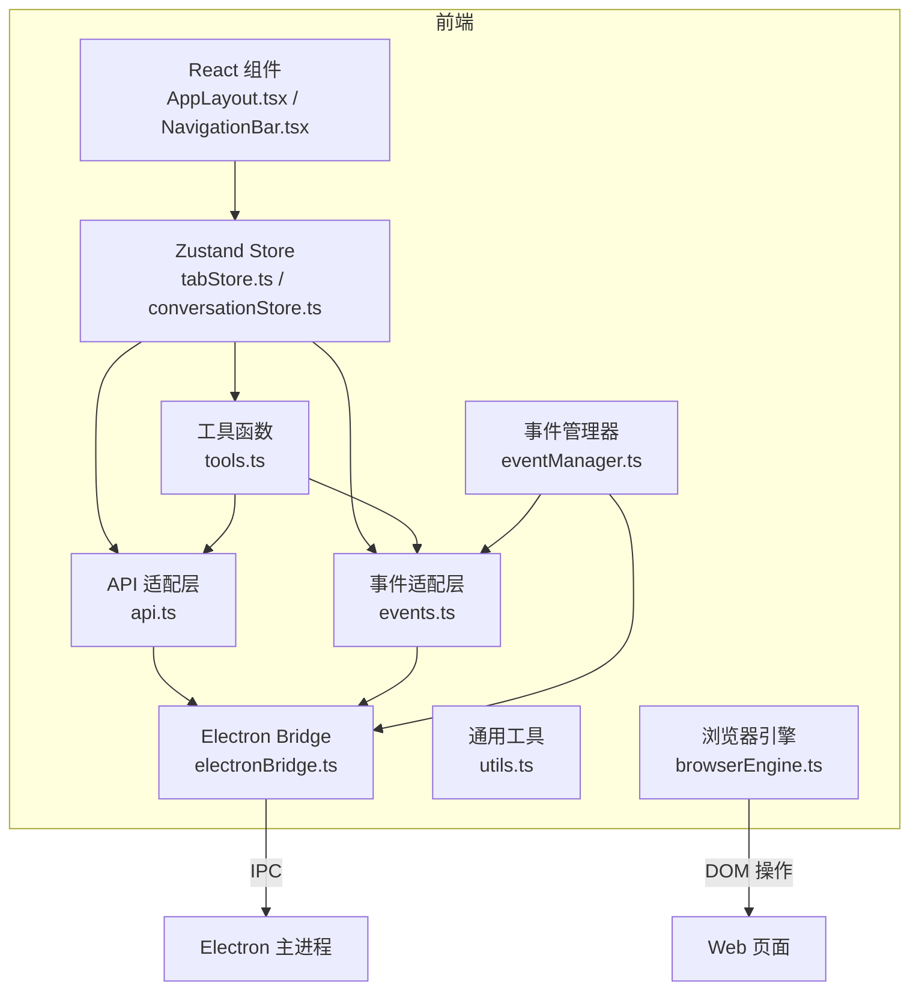
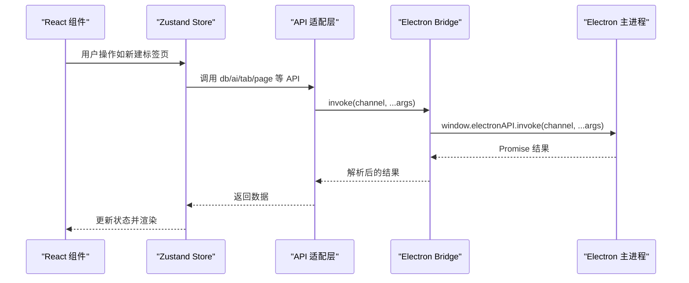
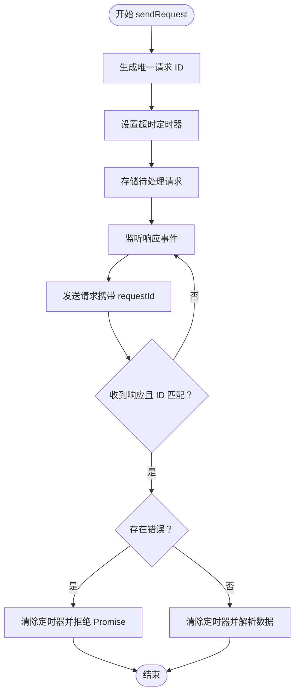
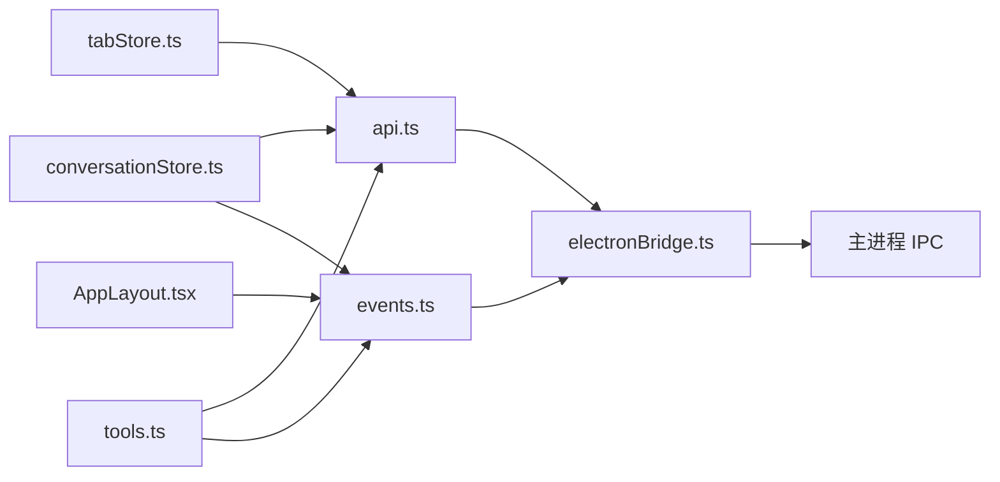

# 前端 API

<cite>
**本文引用的文件**
- [electronBridge.ts](file://src-web/src/lib/electronBridge.ts)
- [api.ts](file://src-web/src/lib/api.ts)
- [events.ts](file://src-web/src/lib/events.ts)
- [eventManager.ts](file://src-web/src/lib/eventManager.ts)
- [browserEngine.ts](file://src-web/src/lib/browserEngine.ts)
- [tools.ts](file://src-web/src/lib/tools.ts)
- [utils.ts](file://src-web/src/lib/utils.ts)
- [tauri.ts](file://src-web/src/lib/tauri.ts)
- [tabStore.ts](file://src-web/src/stores/tabStore.ts)
- [conversationStore.ts](file://src-web/src/stores/conversationStore.ts)
- [AppLayout.tsx](file://src-web/src/components/layout/AppLayout.tsx)
- [NavigationBar.tsx](file://src-web/src/components/layout/NavigationBar.tsx)
- [main.tsx](file://src-web/src/main.tsx)
</cite>

## 目录
1. [简介](#简介)
2. [项目结构](#项目结构)
3. [核心组件](#核心组件)
4. [架构总览](#架构总览)
5. [详细组件分析](#详细组件分析)
6. [依赖关系分析](#依赖关系分析)
7. [性能考量](#性能考量)
8. [故障排查指南](#故障排查指南)
9. [结论](#结论)
10. [附录](#附录)

## 简介
本文件为 CoSurf 前端 API 的权威参考，覆盖 Electron Bridge IPC 通信、事件系统、工具函数与浏览器自动化引擎。文档面向开发者与高级用户，提供接口签名、参数说明、返回值类型、错误处理与典型使用场景，帮助正确集成与扩展前端与后端（Electron 主进程）的通信。

## 项目结构
前端位于 src-web/src，核心 API 层由以下模块组成：
- Electron Bridge 层：封装 window.electronAPI 的 invoke/on/send/once/removeAllListeners，提供与 Tauri 的向后兼容别名。
- API 适配层：对主进程命令进行分组封装，统一位置参数调用，内置 JSON 解析与错误处理。
- 事件适配层：统一事件监听与一次性监听，提供事件常量与向后兼容别名。
- 事件管理器：实现请求-响应模式，支持超时与错误传播。
- 浏览器自动化引擎：提供页面元素选择、等待、交互、内容提取与脚本执行等能力。
- 工具函数：页面内容监听、网页操作执行、工具调用执行器。
- 通用工具：类名拼接、ID 生成、字符串截断、时间格式化、域名解析。
- Store 与组件：展示 API 的实际使用方式与通信流程。

图表来源
- [AppLayout.tsx:118-150](file://src-web/src/components/layout/AppLayout.tsx#L118-L150)
- [tabStore.ts:65-96](file://src-web/src/stores/tabStore.ts#L65-L96)
- [conversationStore.ts:172-242](file://src-web/src/stores/conversationStore.ts#L172-L242)
- [api.ts:13-19](file://src-web/src/lib/api.ts#L13-L19)
- [events.ts:51-79](file://src-web/src/lib/events.ts#L51-L79)
- [eventManager.ts:40-82](file://src-web/src/lib/eventManager.ts#L40-L82)
- [electronBridge.ts:33-46](file://src-web/src/lib/electronBridge.ts#L33-L46)

章节来源
- [electronBridge.ts:1-100](file://src-web/src/lib/electronBridge.ts#L1-L100)
- [api.ts:1-429](file://src-web/src/lib/api.ts#L1-L429)
- [events.ts:1-83](file://src-web/src/lib/events.ts#L1-L83)
- [eventManager.ts:1-108](file://src-web/src/lib/eventManager.ts#L1-L108)
- [browserEngine.ts:1-521](file://src-web/src/lib/browserEngine.ts#L1-L521)
- [tools.ts:1-125](file://src-web/src/lib/tools.ts#L1-L125)
- [utils.ts:1-40](file://src-web/src/lib/utils.ts#L1-L40)

## 核心组件
- Electron Bridge API
  - invoke(channel, ...args): Promise<T> — 向主进程发送请求并等待回复；参数以位置参数传递。
  - on(event, callback): () => void — 持续监听主进程事件，返回取消订阅函数。
  - send(event, payload?): void — 向主进程发送消息（无回复）。
  - once(event, callback): void — 一次性监听。
  - removeAllListeners(event): void — 移除指定通道的所有监听器。
  - windowControls: { minimize, maximize, close, isMaximized } — 窗口控制快捷方法。
  - isElectron(): boolean — 检测是否在 Electron 环境运行。
  - 向后兼容别名：listen = on；emit = send。
- API 适配层
  - db.*：数据库 CRUD 与配置管理（会话、消息、书签、设置、模型、技能、MCP 服务器、历史、Agent 提示词）。
  - ai.*：AI 对话（流式响应通过事件推送）、停止生成、生成标题。
  - agent.*：Agent 执行、配置、页面总结、记忆抽取。
  - tab.*：标签页创建、切换、关闭、导航、前进后退、状态查询、设为活跃。
  - page.*：页面内容、截图、注入上下文、总结、执行动作。
  - screenshot.*：全屏截图、区域截图、保存、复制到剪贴板。
  - skills.*：技能列表、删除、开关、导入 Markdown/目录、设置目录、列出文件、获取内容。
  - cache.*：保存、加载、清理。
  - dialog.*：打开/保存文件对话框。
  - shell.*：打开 URL。
  - win.*：窗口最小化、最大化、关闭、查询最大化状态。
  - 统一位置参数调用，主进程 handlers 严格匹配签名。
- 事件适配层
  - Events 常量：AI 流式事件、标签页事件、系统事件。
  - on(event, callback): () => void；once(event, callback): void；off(unsubscribe): void；removeAllListeners(event): void；listen = on。
- 事件管理器
  - sendRequest(eventName, payload, responseEventName, timeoutMs?): Promise<T> — 发送请求并等待响应，带超时与错误传播。
  - registerHandler(eventName, handler): () => void — 注册事件处理器。
  - cleanup(): void — 清理所有待处理请求。
- 浏览览器自动化引擎
  - 选择器生成、元素等待、点击、输入、选择、滚动、内容提取、表单字段获取/自动填充/提交、脚本执行、元素高亮。
- 工具函数
  - onPageContent(callback)、onPageContentError(callback)：监听页面内容返回与错误事件。
  - summarizeCurrentPage(tabId, maxLength?): Promise<string>：智能总结当前页面。
  - executeWebAction(tabId, action, selector, value?): Promise<WebActionResult>：执行网页操作。
  - ToolExecutor：在 AI 对话中调用工具（如页面总结、网页代理）。
- 通用工具
  - cn(...): string — 类名拼接。
  - generateId(): string — UUID 或随机 ID。
  - truncate(str, maxLen): string — 截断字符串。
  - formatTime(dateStr): string — 相对时间格式化。
  - getDomain(url): string — 域名解析。

章节来源
- [electronBridge.ts:33-99](file://src-web/src/lib/electronBridge.ts#L33-L99)
- [api.ts:13-429](file://src-web/src/lib/api.ts#L13-L429)
- [events.ts:15-83](file://src-web/src/lib/events.ts#L15-L83)
- [eventManager.ts:16-108](file://src-web/src/lib/eventManager.ts#L16-L108)
- [browserEngine.ts:22-521](file://src-web/src/lib/browserEngine.ts#L22-L521)
- [tools.ts:23-125](file://src-web/src/lib/tools.ts#L23-L125)
- [utils.ts:1-40](file://src-web/src/lib/utils.ts#L1-L40)

## 架构总览
前端通过 Electron Bridge 与主进程通信，API 适配层封装命令调用，事件适配层统一事件监听，事件管理器提供请求-响应模式，浏览器引擎负责 DOM 级操作，工具函数与通用工具贯穿各模块。

图表来源
- [tabStore.ts:74-99](file://src-web/src/stores/tabStore.ts#L74-L99)
- [api.ts:56-69](file://src-web/src/lib/api.ts#L56-L69)
- [electronBridge.ts:33-46](file://src-web/src/lib/electronBridge.ts#L33-L46)

## 详细组件分析

### Electron Bridge API
- 设计目标
  - 替代 @tauri-apps/api 的 invoke/listen/emit，提供统一接口。
  - 迁移策略：invoke('command', args) → electronBridge.invoke('command', args)；listen(...) → electronBridge.on(...)；emit(...) → electronBridge.send(...)。
- 关键点
  - 参数传递：将 Tauri 命名参数转换为 Electron IPC 的位置参数。
  - 环境检测：window.electronAPI 不可用时抛错或警告，便于 web-only 模式降级。
  - 向后兼容：listen/on、emit/send 别名。
- 错误处理
  - electronAPI 不存在：抛出错误或返回空取消函数，避免静默失败。
- 使用建议
  - 在组件挂载时检查 isElectron()，决定是否启用相关功能。
  - 对于一次性事件使用 once()，避免内存泄漏。

章节来源
- [electronBridge.ts:1-100](file://src-web/src/lib/electronBridge.ts#L1-L100)

### API 适配层（命令封装）
- 设计原则
  - 统一位置参数调用，与主进程 handlers 签名一致。
  - 对 Rust 返回的 JSON 字符串进行解析，null 表示无数据。
- 数据库（db.*）
  - 会话：list/get/create/update/delete/getWithMessages。
  - 消息：list/get/create/update/delete/append/complete/setFeedback。
  - 书签：list/create/delete/listFolders/createFolder/deleteFolder。
  - 设置：getSettings/getSetting/setSetting。
  - 模型：list/get/getActive/create/update/setActive/delete。
  - 技能：getSkillsDirectory/setSkillsDirectory/getIqsApiKey/setIqsApiKey。
  - MCP：list/get/create/update/delete/test/import。
  - 历史：list/search/add/clear/delete。
  - Agent 提示词：list/get/set/toggle。
- AI（ai.*）
  - sendChat(config, messages, conversationId, messageId)：发送聊天消息，流式响应通过事件推送。
  - stopGeneration()：停止生成。
  - generateTitle(content, config)：生成标题。
- Agent（agent.*）
  - execute(params)、configureQwen(config)、summarizePage(params)、extractMemory(params)。
- 标签页（tab.*）
  - create(url, title?)、switch(id)、close(id)、navigate(id, url)、back/forward(id)、getState(id)、getTitle(id)、setActive(id)。
- 页面（page.*）
  - getContent(tabId)、screenshot(tabId)、executeScript(tabId, script)、injectContext(tabId)、summarize(tabId)、executeAction(tabId, action, selector, value?)。
- 截图（screenshot.*）
  - captureFull()、captureRegion(base64Data, x, y, w, h, sw, sh)、save(base64Data, filePath)、copyToClipboard(base64Data)。
- 技能（skills.*）
  - list()、delete(id)、toggle(id)、importMarkdown(content)、importDirectory(dirPath)、setDirectory(dir)、listFiles(id)、getContent(id)。
- 缓存（cache.*）
  - save(key, data)、load(key)、cleanup()。
- 对话框（dialog.*）
  - openFile(options?)、saveFile(options?)。
- Shell（shell.*）
  - openUrl(url)。
- 窗口（win.*）
  - minimize()、maximize()、close()、isMaximized()。
- 使用示例（路径）
  - 新建标签页：[tabStore.ts:74-99](file://src-web/src/stores/tabStore.ts#L74-L99)
  - 发送 AI 消息：[conversationStore.ts:103-243](file://src-web/src/stores/conversationStore.ts#L103-L243)
  - 监听流式事件：[conversationStore.ts:172-210](file://src-web/src/stores/conversationStore.ts#L172-L210)

章节来源
- [api.ts:13-429](file://src-web/src/lib/api.ts#L13-L429)

### 事件适配层（事件监听）
- 事件常量
  - AI 流式：ai:stream-chunk、ai:stream-error、ai:tool-call-start、ai:tool-call-result。
  - 标签页：tab:create、tab:navigate、tab:title-updated、tab:loading、tab:loaded、tab:switched。
  - 系统：shortcut:screenshot、updater:update-available、webview:create-tab、cosurf:new-tab-response。
- API
  - on(event, callback): () => void；once(event, callback): void；off(unsubscribe): void；removeAllListeners(event): void；listen = on。
- 使用示例（路径）
  - 监听新标签页创建：[AppLayout.tsx:118-150](file://src-web/src/components/layout/AppLayout.tsx#L118-L150)
  - 监听流式事件：[conversationStore.ts:172-210](file://src-web/src/stores/conversationStore.ts#L172-L210)

章节来源
- [events.ts:15-83](file://src-web/src/lib/events.ts#L15-L83)

### 事件管理器（请求-响应）
- 功能
  - sendRequest(eventName, payload, responseEventName, timeoutMs=10000): Promise<T> — 带超时与错误传播。
  - registerHandler(eventName, handler): () => void — 注册处理器。
  - cleanup(): void — 清理待处理请求。
- 数据结构
  - PendingRequest：{ resolve, reject, timeout }。
  - requestId：req_{counter}_{timestamp}。
- 使用场景
  - 与主进程进行显式的请求-响应通信，避免广播事件的歧义。
- 流程图

图表来源
- [eventManager.ts:40-82](file://src-web/src/lib/eventManager.ts#L40-L82)

章节来源
- [eventManager.ts:16-108](file://src-web/src/lib/eventManager.ts#L16-L108)

### 浏览器自动化引擎（DOM 操作）
- 能力
  - 智能选择器生成、元素等待、点击、输入、选择、滚动、内容提取、表单字段获取/自动填充/提交、脚本执行、元素高亮。
- 接口
  - generateSmartSelector(element): string
  - waitForElement(selector, timeout?): Promise<HTMLElement|null>
  - clickElement(selector, options?): ActionResult
  - inputText(selector, text, options?): ActionResult
  - selectOption(selector, value|string[]): ActionResult
  - scrollPage(direction, amount?): ActionResult
  - extractPageContent(options?): ActionResult
  - getFormFields(formSelector?): ActionResult
  - autoFillForm(formData, formSelector?): ActionResult
  - submitForm(formSelector?): ActionResult
  - executeScript(script: string): ActionResult
  - highlightElement(selector, duration?): ActionResult
- 使用建议
  - 优先使用智能选择器，确保稳定性。
  - 对输入/选择等操作后触发 input/change 等事件，保证应用状态同步。

章节来源
- [browserEngine.ts:22-521](file://src-web/src/lib/browserEngine.ts#L22-L521)

### 工具函数与工具调用执行器
- onPageContent(callback)：监听 cosurf:page-content 事件。
- onPageContentError(callback)：监听 cosurf:page-content-error 事件。
- summarizeCurrentPage(tabId, maxLength?): Promise<string>：调用 pageApi.summarize。
- executeWebAction(tabId, action, selector, value?): Promise<WebActionResult>：调用 pageApi.executeAction。
- ToolExecutor
  - updateActiveTab(tabId): void
  - executeTool(toolName, args): Promise<any>
  - handleSummarizePage(args): Promise<string>
  - handleWebAgent(args): Promise<WebActionResult>

章节来源
- [tools.ts:23-125](file://src-web/src/lib/tools.ts#L23-L125)

### 通用工具函数
- cn(...classes): string — 拼接类名。
- generateId(): string — 生成唯一 ID。
- truncate(str, maxLen): string — 截断字符串。
- formatTime(dateStr): string — 相对时间格式化。
- getDomain(url): string — 解析域名。

章节来源
- [utils.ts:1-40](file://src-web/src/lib/utils.ts#L1-L40)

### 与 Tauri 的关系
- tauri.ts
  - isTauri(): boolean — 始终返回 false。
  - invoke/_listen/_emit：抛出错误，提示迁移至 Electron IPC。
- 设计意图
  - 明确迁移方向，避免混用两种桥接方案。

章节来源
- [tauri.ts:6-20](file://src-web/src/lib/tauri.ts#L6-L20)

## 依赖关系分析

图表来源
- [AppLayout.tsx:118-150](file://src-web/src/components/layout/AppLayout.tsx#L118-L150)
- [tabStore.ts:65-96](file://src-web/src/stores/tabStore.ts#L65-L96)
- [conversationStore.ts:172-242](file://src-web/src/stores/conversationStore.ts#L172-L242)
- [tools.ts:23-74](file://src-web/src/lib/tools.ts#L23-L74)
- [api.ts:13-19](file://src-web/src/lib/api.ts#L13-L19)
- [events.ts:51-79](file://src-web/src/lib/events.ts#L51-L79)
- [electronBridge.ts:33-46](file://src-web/src/lib/electronBridge.ts#L33-L46)

章节来源
- [AppLayout.tsx:118-150](file://src-web/src/components/layout/AppLayout.tsx#L118-L150)
- [tabStore.ts:65-96](file://src-web/src/stores/tabStore.ts#L65-L96)
- [conversationStore.ts:172-242](file://src-web/src/stores/conversationStore.ts#L172-L242)
- [tools.ts:23-74](file://src-web/src/lib/tools.ts#L23-L74)
- [api.ts:13-19](file://src-web/src/lib/api.ts#L13-L19)
- [events.ts:51-79](file://src-web/src/lib/events.ts#L51-L79)
- [electronBridge.ts:33-46](file://src-web/src/lib/electronBridge.ts#L33-L46)

## 性能考量
- 事件监听
  - 使用 once() 处理一次性事件，避免累积监听器导致内存泄漏。
  - 批量事件处理时注意去抖/节流，减少频繁渲染。
- IPC 调用
  - 将多个参数合并为对象再序列化，减少多次调用次数。
  - 对大对象传输采用分块或延迟加载策略。
- DOM 操作
  - 浏览览器引擎操作应尽量批量执行，减少回流与重绘。
  - 高亮/滚动等操作设置合理的时间间隔与动画时长。
- 错误处理
  - 统一捕获与上报，避免异常中断 UI 流程。

## 故障排查指南
- Electron API 不可用
  - 现象：调用 invoke/on/send 抛错或警告。
  - 排查：确认 isElectron() 返回 true；检查 preload 注入是否成功。
  - 参考：[electronBridge.ts:33-46](file://src-web/src/lib/electronBridge.ts#L33-L46)
- 事件未触发
  - 现象：on/once 无法收到回调。
  - 排查：确认事件通道名称正确；检查主进程是否正确发送；使用 removeAllListeners(event) 清理后重新绑定。
  - 参考：[events.ts:51-79](file://src-web/src/lib/events.ts#L51-L79)
- 请求超时
  - 现象：sendRequest 超时。
  - 排查：检查主进程响应事件是否正确发送；适当增大超时时间；确认 requestId 匹配。
  - 参考：[eventManager.ts:40-82](file://src-web/src/lib/eventManager.ts#L40-L82)
- 页面操作失败
  - 现象：clickElement/inputText/selectOption 等返回失败。
  - 排查：确认选择器正确；元素是否存在；是否触发了必要的 input/change 事件。
  - 参考：[browserEngine.ts:116-233](file://src-web/src/lib/browserEngine.ts#L116-L233)
- 应用错误边界
  - 现象：全局错误弹窗。
  - 排查：查看控制台错误堆栈；定位具体组件与调用链。
  - 参考：[main.tsx:16-22](file://src-web/src/main.tsx#L16-L22)

章节来源
- [electronBridge.ts:33-46](file://src-web/src/lib/electronBridge.ts#L33-L46)
- [events.ts:51-79](file://src-web/src/lib/events.ts#L51-L79)
- [eventManager.ts:40-82](file://src-web/src/lib/eventManager.ts#L40-L82)
- [browserEngine.ts:116-233](file://src-web/src/lib/browserEngine.ts#L116-L233)
- [main.tsx:16-22](file://src-web/src/main.tsx#L16-L22)

## 结论
CoSurf 前端 API 以 Electron Bridge 为核心，通过 API 适配层、事件适配层与事件管理器形成清晰的通信协议与数据流。浏览器自动化引擎与工具函数进一步增强了前端对页面与外部系统的控制能力。遵循本文档的接口规范与最佳实践，可确保前后端通信稳定、可维护且具备良好的用户体验。

## 附录

### API 使用场景速查
- 新建标签页并设为活跃
  - 路径：[tabStore.ts:74-99](file://src-web/src/stores/tabStore.ts#L74-L99)
- 发送 AI 消息并监听流式响应
  - 路径：[conversationStore.ts:103-243](file://src-web/src/stores/conversationStore.ts#L103-L243)
- 监听“创建新标签页”请求并响应
  - 路径：[AppLayout.tsx:118-150](file://src-web/src/components/layout/AppLayout.tsx#L118-L150)
- 监听页面内容返回与错误
  - 路径：[tools.ts:23-36](file://src-web/src/lib/tools.ts#L23-L36)
- 执行网页操作（点击/填写/关闭弹窗）
  - 路径：[tools.ts:54-74](file://src-web/src/lib/tools.ts#L54-L74)