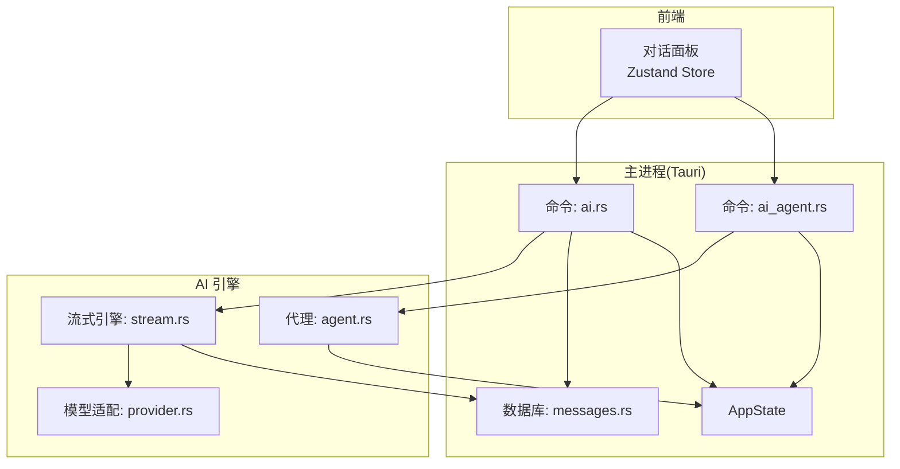
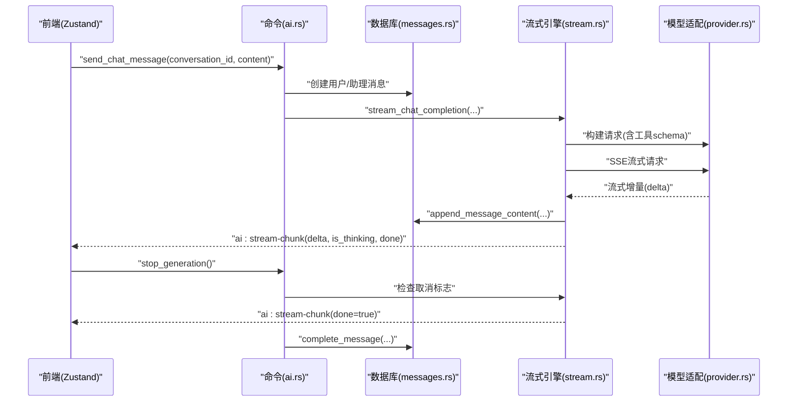
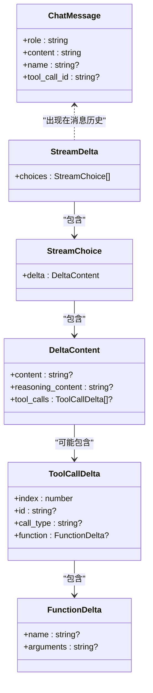
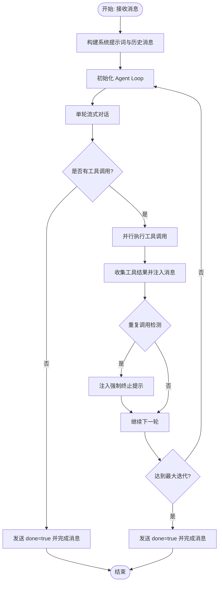
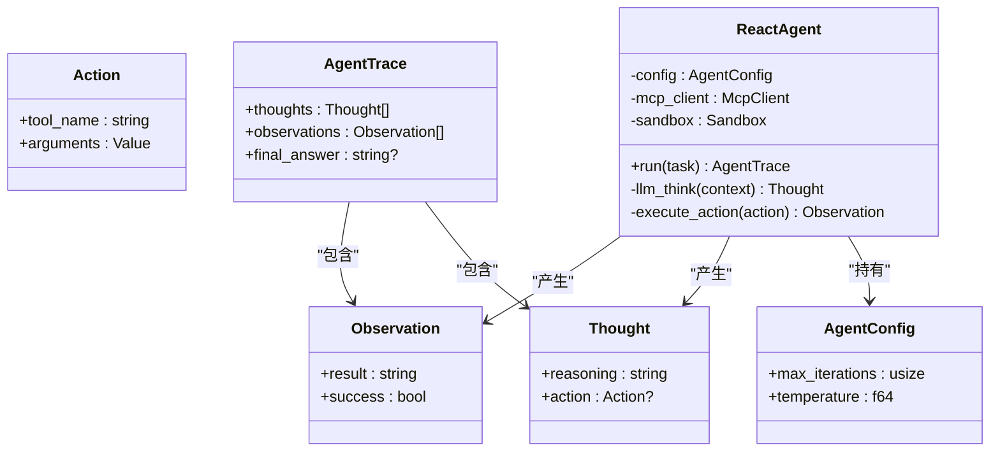
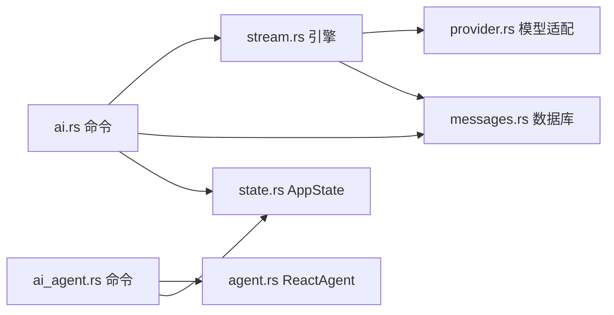

# AI 相关命令

<cite>
**本文引用的文件**
- [src-tauri/src/commands/ai.rs](file://src-tauri/src/commands/ai.rs)
- [src-tauri/src/commands/ai_agent.rs](file://src-tauri/src/commands/ai_agent.rs)
- [src-tauri/src/ai/stream.rs](file://src-tauri/src/ai/stream.rs)
- [src-tauri/src/ai/provider.rs](file://src-tauri/src/ai/provider.rs)
- [src-tauri/src/db/messages.rs](file://src-tauri/src/db/messages.rs)
- [src-tauri/src/state.rs](file://src-tauri/src/state.rs)
- [src-tauri/src/ai/agent.rs](file://src-tauri/src/ai/agent.rs)
- [src-web/src/stores/conversationStore.ts](file://src-web/src/stores/conversationStore.ts)
</cite>

## 目录
1. [简介](#简介)
2. [项目结构](#项目结构)
3. [核心组件](#核心组件)
4. [架构总览](#架构总览)
5. [详细组件分析](#详细组件分析)
6. [依赖关系分析](#依赖关系分析)
7. [性能考量](#性能考量)
8. [故障排查指南](#故障排查指南)
9. [结论](#结论)
10. [附录](#附录)

## 简介
本文件面向 CoSurf 的 AI 相关命令，提供完整 API 文档与实现解析，覆盖两类核心能力：
- 对话命令：启动对话、发送消息、停止生成、流式增量输出、工具调用与结果回传
- 代理命令：React Agent 任务执行、状态管理、工具调用与轨迹追踪

文档详细说明接口规范、参数与返回结构、错误码、调用示例、执行流程、并发与资源管理、前端 Zustand 状态联动、以及与数据库的集成模式。

## 项目结构
围绕 AI 的核心模块分布如下：
- 命令层：Tauri 命令入口，负责接收前端请求、协调数据库与流式引擎
- AI 引擎层：流式对话、工具调用、代理循环、MCP 客户端、沙箱
- 数据层：消息持久化、会话与消息 CRUD、流式片段存储
- 前端状态层：Zustand Store，负责事件监听、UI 状态与流式渲染

图表来源
- [src-tauri/src/commands/ai.rs:1-397](file://src-tauri/src/commands/ai.rs#L1-L397)
- [src-tauri/src/commands/ai_agent.rs:1-145](file://src-tauri/src/commands/ai_agent.rs#L1-L145)
- [src-tauri/src/ai/stream.rs:1-778](file://src-tauri/src/ai/stream.rs#L1-L778)
- [src-tauri/src/ai/provider.rs:1-135](file://src-tauri/src/ai/provider.rs#L1-L135)
- [src-tauri/src/db/messages.rs:1-198](file://src-tauri/src/db/messages.rs#L1-L198)
- [src-tauri/src/state.rs:1-81](file://src-tauri/src/state.rs#L1-L81)

章节来源
- [src-tauri/src/commands/ai.rs:1-397](file://src-tauri/src/commands/ai.rs#L1-L397)
- [src-tauri/src/commands/ai_agent.rs:1-145](file://src-tauri/src/commands/ai_agent.rs#L1-L145)
- [src-tauri/src/ai/stream.rs:1-778](file://src-tauri/src/ai/stream.rs#L1-L778)
- [src-tauri/src/ai/provider.rs:1-135](file://src-tauri/src/ai/provider.rs#L1-L135)
- [src-tauri/src/db/messages.rs:1-198](file://src-tauri/src/db/messages.rs#L1-L198)
- [src-tauri/src/state.rs:1-81](file://src-tauri/src/state.rs#L1-L81)

## 核心组件
- 对话命令（ai.rs）
  - 停止生成：通过全局取消标志中断 SSE 流
  - 发送消息：构建系统提示词与历史消息，启动流式对话，分发 thinking/content/done 事件
  - 追加流片段/完成流：本地数据库追加增量内容并标记完成
  - 生成会话标题：非流式请求，基于上下文生成标题
- 代理命令（ai_agent.rs）
  - 执行 Agent：初始化沙箱与 MCP 客户端，创建 ReactAgent 并运行
  - 配置模型：接收 Qwen 模型配置参数（占位）
  - 页面摘要：生成摘要并保存至沙箱（占位）
  - 提取记忆：从用户输入提取记忆并保存（占位）

章节来源
- [src-tauri/src/commands/ai.rs:10-396](file://src-tauri/src/commands/ai.rs#L10-L396)
- [src-tauri/src/commands/ai_agent.rs:13-144](file://src-tauri/src/commands/ai_agent.rs#L13-L144)
- [src-tauri/src/ai/stream.rs:77-283](file://src-tauri/src/ai/stream.rs#L77-L283)
- [src-tauri/src/db/messages.rs:55-62](file://src-tauri/src/db/messages.rs#L55-L62)

## 架构总览
AI 命令的总体调用链路如下：

图表来源
- [src-tauri/src/commands/ai.rs:17-274](file://src-tauri/src/commands/ai.rs#L17-L274)
- [src-tauri/src/ai/stream.rs:301-602](file://src-tauri/src/ai/stream.rs#L301-L602)
- [src-tauri/src/ai/provider.rs:91-134](file://src-tauri/src/ai/provider.rs#L91-L134)
- [src-tauri/src/db/messages.rs:152-175](file://src-tauri/src/db/messages.rs#L152-L175)

## 详细组件分析

### 对话命令 API 规范（ai.rs）

- 命令：stop_generation
  - 描述：请求取消当前正在生成的流式响应
  - 参数：无
  - 返回：成功或错误响应
  - 错误码：无特定错误码，内部使用通用错误包装
  - 并发与取消：通过 AppState.cancel_flag 的原子布尔标志实现线程安全取消；流式循环每轮检查标志并提前结束
  - 前端交互：前端调用后，流式引擎在下一轮 SSE 事件前检测到取消，发送 done=true 并标记消息完成

- 命令：send_chat_message
  - 描述：创建用户与助理消息，构建系统提示词与历史消息，启动流式对话
  - 参数：
    - conversation_id: 会话标识
    - content: 用户消息内容
  - 返回：StreamChunk（初始响应，表示开始流式）
  - 错误码：
    - NO_MODEL: 未配置激活模型
    - LOCK_ERROR: 数据库锁失败
    - 其他：统一映射为 ErrorResponse
  - 流程要点：
    - 读取激活模型配置
    - 创建用户消息并置为 complete
    - 创建助理消息（空内容，状态 streaming）
    - 组装系统提示词与历史消息（过滤未完成与助理自身）
    - 异步启动流式引擎，事件驱动更新 UI
  - 前端交互：前端监听 ai:stream-chunk 与 ai:stream-error，实时渲染

- 命令：append_stream_chunk
  - 描述：向数据库追加流式增量内容
  - 参数：message_id, delta, is_thinking
  - 返回：成功或错误响应
  - 适用场景：由流式引擎直接调用，确保一致性

- 命令：complete_stream
  - 描述：标记消息为完成
  - 参数：message_id
  - 返回：成功或错误响应

- 命令：generate_conversation_title
  - 描述：基于对话上下文生成标题（非流式）
  - 参数：context（拼接后的对话文本）
  - 返回：标题字符串
  - 错误码：网络/序列化/解析错误映射为特定码

章节来源
- [src-tauri/src/commands/ai.rs:10-396](file://src-tauri/src/commands/ai.rs#L10-L396)
- [src-tauri/src/db/messages.rs:55-62](file://src-tauri/src/db/messages.rs#L55-L62)

#### 流式对话执行流程（类图）

图表来源
- [src-tauri/src/ai/provider.rs:6-87](file://src-tauri/src/ai/provider.rs#L6-L87)

#### 流式对话算法（流程图）

图表来源
- [src-tauri/src/ai/stream.rs:77-283](file://src-tauri/src/ai/stream.rs#L77-L283)

### 代理命令 API 规范（ai_agent.rs）

- 结构体与响应
  - AgentRequest: 包含 task 与可选 max_iterations
  - AgentResponse: success、answer、trace（迭代次数与工具使用清单）
  - AgentTraceSummary: 迭代次数与工具使用列表

- 命令：agent_execute
  - 描述：初始化沙箱与 MCP 客户端，创建 ReactAgent 并运行任务
  - 参数：AgentRequest
  - 返回：AgentResponse
  - 并发与资源：异步运行，使用 AppState 的沙箱与 MCP 客户端实例
  - 错误码：统一映射为 AppResult

- 命令：configure_qwen_model
  - 描述：接收 Qwen 模型配置（占位，未来持久化）
  - 参数：api_key, model_id, base_url?
  - 返回：成功或错误响应

- 命令：generate_page_summary
  - 描述：生成页面摘要并保存到沙箱（占位）
  - 参数：url, content
  - 返回：摘要字符串

- 命令：extract_memory
  - 描述：从用户输入提取记忆并保存（占位）
  - 参数：user_input
  - 返回：记忆键值对列表

章节来源
- [src-tauri/src/commands/ai_agent.rs:13-144](file://src-tauri/src/commands/ai_agent.rs#L13-L144)
- [src-tauri/src/ai/agent.rs:11-230](file://src-tauri/src/ai/agent.rs#L11-L230)

#### React Agent 类图

图表来源
- [src-tauri/src/ai/agent.rs:11-230](file://src-tauri/src/ai/agent.rs#L11-L230)

### 数据模型与数据库集成

- 消息模型与流式片段
  - Message：包含 conversation_id、role、content、thinking_content、status、attachments、时间戳与反馈
  - StreamChunk：用于前端事件传输的最小单元（delta、is_thinking、done）
- 数据库操作
  - list_messages/create_message/update_message/append_message_content/complete_message/delete_message/set_message_feedback
  - 流式引擎在每次收到增量时调用 append_message_content，完成后调用 complete_message

章节来源
- [src-tauri/src/db/messages.rs:22-175](file://src-tauri/src/db/messages.rs#L22-L175)

### 前端 Zustand 状态管理交互

- Store 关键行为
  - loadConversations/loadMessages/setActiveConversation/createConversation/deleteConversation
  - sendMessage：本地预创建用户与助理消息，发起 ai:stream-chunk 监听，调用 ai.sendChat，收到 done 后完成流
  - stopStreaming：调用 ai.stopGeneration，前端收到 done 后结束流
  - appendStreamDelta：根据 is_thinking 刷新 thinkingContent 或 content
  - finishStream：将最后一条 assistant 消息置为 complete，并触发标题自动生成检查
- 事件监听
  - ai:stream-chunk：增量内容、思考内容、完成标记
  - ai:stream-error：错误提示
  - ai:tool-call-start：工具调用开始（仅日志）

章节来源
- [src-web/src/stores/conversationStore.ts:103-304](file://src-web/src/stores/conversationStore.ts#L103-L304)

## 依赖关系分析

图表来源
- [src-tauri/src/commands/ai.rs:1-397](file://src-tauri/src/commands/ai.rs#L1-L397)
- [src-tauri/src/ai/stream.rs:1-778](file://src-tauri/src/ai/stream.rs#L1-L778)
- [src-tauri/src/ai/provider.rs:1-135](file://src-tauri/src/ai/provider.rs#L1-L135)
- [src-tauri/src/db/messages.rs:1-198](file://src-tauri/src/db/messages.rs#L1-L198)
- [src-tauri/src/state.rs:1-81](file://src-tauri/src/state.rs#L1-L81)
- [src-tauri/src/commands/ai_agent.rs:1-145](file://src-tauri/src/commands/ai_agent.rs#L1-L145)
- [src-tauri/src/ai/agent.rs:1-230](file://src-tauri/src/ai/agent.rs#L1-L230)

## 性能考量
- 流式处理：SSE 分片增量推送，前端即时渲染，降低首帧延迟
- 工具调用并行：检测到多个工具调用时并行执行，提升整体吞吐
- 重复调用抑制：连续重复调用注入强制终止提示，避免无效循环
- 取消机制：原子标志实现零拷贝取消，减少资源浪费
- 数据库写入：增量追加，避免大对象频繁写盘，提高 I/O 效率

## 故障排查指南
- 常见错误与定位
  - NO_MODEL：确认设置中已配置并激活模型
  - LOCK_ERROR：数据库锁竞争，检查并发访问
  - CONFIG_ERROR/SERIALIZE_ERROR/NETWORK_ERROR/PARSE_ERROR：模型配置、请求体序列化、网络连通性、响应解析异常
  - 内部 panic：流式任务 panic，前端会收到 ai:stream-error 并显示“内部错误”
- 前端诊断
  - 检查 ai:stream-chunk 事件是否持续到达，若长时间无增量，可能为网络或模型问题
  - 若出现 ai:stream-error，前端会附加错误提示，结合后端日志定位
- 代理执行
  - 如工具调用失败，观察 ai:tool-call-result 的 success 字段
  - 检查 MCP 服务器可用性与工具注册

章节来源
- [src-tauri/src/commands/ai.rs:231-264](file://src-tauri/src/commands/ai.rs#L231-L264)
- [src-tauri/src/ai/stream.rs:547-568](file://src-tauri/src/ai/stream.rs#L547-L568)

## 结论
本文档系统梳理了 CoSurf 的 AI 对话与代理命令，明确了接口规范、数据结构、执行流程与前后端协作方式。通过 SSE 流式与工具调用并行、取消与重复抑制等机制，实现了高效稳定的 AI 交互体验；配合 Zustand 状态管理与数据库持久化，保证了用户体验与数据一致性。

## 附录

### API 调用示例（请求/响应与事件）

- 发送消息（流式）
  - 请求：调用命令 send_chat_message，携带 conversation_id 与 content
  - 响应：立即返回 StreamChunk（初始，done=false）
  - 事件：
    - ai:stream-chunk（delta 为增量文本，is_thinking 标识思考阶段）
    - ai:stream-chunk（done=true，表示本轮结束）
    - ai:stream-error（发生错误时）
  - 前端处理：监听事件，appendStreamDelta 渲染，finishStream 标记完成

- 停止生成
  - 请求：调用命令 stop_generation
  - 响应：成功
  - 事件：ai:stream-chunk（done=true），前端结束渲染

- 生成会话标题（非流式）
  - 请求：调用命令 generate_conversation_title，携带 context
  - 响应：标题字符串

- 代理执行
  - 请求：调用命令 agent_execute，携带 task 与可选 max_iterations
  - 响应：AgentResponse（success、answer、trace）

章节来源
- [src-tauri/src/commands/ai.rs:17-274](file://src-tauri/src/commands/ai.rs#L17-L274)
- [src-tauri/src/commands/ai_agent.rs:34-71](file://src-tauri/src/commands/ai_agent.rs#L34-L71)
- [src-web/src/stores/conversationStore.ts:177-243](file://src-web/src/stores/conversationStore.ts#L177-L243)