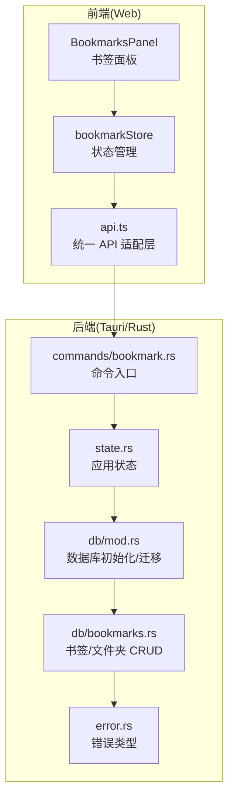
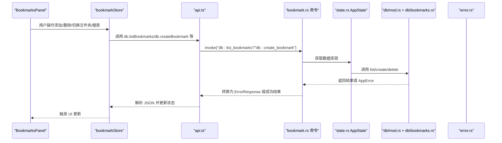
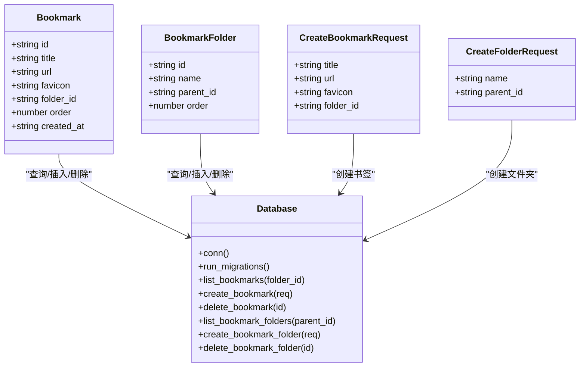

# 书签管理命令

<cite>
**本文引用的文件**
- [bookmark.rs](file://src-tauri/src/commands/bookmark.rs)
- [bookmarks.rs](file://src-tauri/src/db/bookmarks.rs)
- [mod.rs](file://src-tauri/src/db/mod.rs)
- [error.rs](file://src-tauri/src/error.rs)
- [state.rs](file://src-tauri/src/state.rs)
- [bookmark.ts](file://packages/shared/src/bookmark.ts)
- [bookmarkStore.ts](file://src-web/src/stores/bookmarkStore.ts)
- [BookmarksPanel.tsx](file://src-web/src/components/sidebar/BookmarksPanel.tsx)
- [api.ts](file://src-web/src/lib/api.ts)
- [history.rs](file://src-tauri/src/db/history.rs)
</cite>

## 目录
1. [简介](#简介)
2. [项目结构](#项目结构)
3. [核心组件](#核心组件)
4. [架构总览](#架构总览)
5. [详细组件分析](#详细组件分析)
6. [依赖关系分析](#依赖关系分析)
7. [性能考量](#性能考量)
8. [故障排查指南](#故障排查指南)
9. [结论](#结论)
10. [附录](#附录)

## 简介
本文件为 CoSurf 书签管理命令的全面 API 文档，覆盖以下方面：
- 书签相关命令：添加、删除、列出、文件夹管理
- 数据结构设计：书签、文件夹、请求体模型
- 分类管理与层级结构
- 错误处理机制与返回值格式
- 与浏览器历史的关联关系与去重策略
- 性能优化与并发控制
- 权限与安全注意事项

## 项目结构
围绕书签功能的关键模块分布如下：
- 前端（Web）：状态管理、UI 组件、统一 API 适配层
- 后端（Tauri/Rust）：命令入口、数据库访问、错误类型
- 共享类型：跨前端/后端的数据契约

图表来源
- [bookmark.rs:1-75](file://src-tauri/src/commands/bookmark.rs#L1-L75)
- [bookmarks.rs:1-185](file://src-tauri/src/db/bookmarks.rs#L1-L185)
- [mod.rs:1-272](file://src-tauri/src/db/mod.rs#L1-L272)
- [error.rs:1-64](file://src-tauri/src/error.rs#L1-L64)
- [state.rs:1-81](file://src-tauri/src/state.rs#L1-L81)
- [bookmarkStore.ts:1-138](file://src-web/src/stores/bookmarkStore.ts#L1-L138)
- [BookmarksPanel.tsx:1-289](file://src-web/src/components/sidebar/BookmarksPanel.tsx#L1-L289)
- [api.ts:1-445](file://src-web/src/lib/api.ts#L1-L445)

章节来源
- [bookmark.rs:1-75](file://src-tauri/src/commands/bookmark.rs#L1-L75)
- [bookmarks.rs:1-185](file://src-tauri/src/db/bookmarks.rs#L1-L185)
- [mod.rs:1-272](file://src-tauri/src/db/mod.rs#L1-L272)
- [error.rs:1-64](file://src-tauri/src/error.rs#L1-L64)
- [state.rs:1-81](file://src-tauri/src/state.rs#L1-L81)
- [bookmarkStore.ts:1-138](file://src-web/src/stores/bookmarkStore.ts#L1-L138)
- [BookmarksPanel.tsx:1-289](file://src-web/src/components/sidebar/BookmarksPanel.tsx#L1-L289)
- [api.ts:1-445](file://src-web/src/lib/api.ts#L1-L445)

## 核心组件
- 命令入口（Rust/Tauri）：提供 list_bookmarks、create_bookmark、delete_bookmark、list_bookmark_folders、create_bookmark_folder、delete_bookmark_folder 等命令
- 数据库层：负责 SQLite 表结构、查询、插入、删除与迁移
- 前端适配层：统一 API 调用封装，解析 JSON 结果
- 状态管理：维护当前文件夹、搜索条件、加载状态
- UI 组件：书签面板，支持搜索、新建文件夹、删除书签等交互

章节来源
- [bookmark.rs:1-75](file://src-tauri/src/commands/bookmark.rs#L1-L75)
- [bookmarks.rs:1-185](file://src-tauri/src/db/bookmarks.rs#L1-L185)
- [api.ts:99-116](file://src-web/src/lib/api.ts#L99-L116)
- [bookmarkStore.ts:21-39](file://src-web/src/stores/bookmarkStore.ts#L21-L39)
- [BookmarksPanel.tsx:21-36](file://src-web/src/components/sidebar/BookmarksPanel.tsx#L21-L36)

## 架构总览
书签命令的调用链路如下：

图表来源
- [BookmarksPanel.tsx:48-72](file://src-web/src/components/sidebar/BookmarksPanel.tsx#L48-L72)
- [bookmarkStore.ts:48-88](file://src-web/src/stores/bookmarkStore.ts#L48-L88)
- [api.ts:99-116](file://src-web/src/lib/api.ts#L99-L116)
- [bookmark.rs:7-74](file://src-tauri/src/commands/bookmark.rs#L7-L74)
- [state.rs:9-23](file://src-tauri/src/state.rs#L9-L23)
- [bookmarks.rs:47-183](file://src-tauri/src/db/bookmarks.rs#L47-L183)
- [error.rs:41-61](file://src-tauri/src/error.rs#L41-L61)

## 详细组件分析

### 1) 命令接口定义与参数说明
- list_bookmarks(folder_id: Option<String>)
  - 功能：按文件夹 ID 列出书签；未提供时返回根目录书签
  - 参数：folder_id（可选），传入 null/None 表示根目录
  - 返回：Vec<Bookmark>
  - 错误：数据库锁失败返回 LOCK_ERROR；其他错误转换为 ErrorResponse
- create_bookmark(request: CreateBookmarkRequest)
  - 功能：创建新书签，自动分配排序序号与创建时间
  - 参数：CreateBookmarkRequest（title/url/favicon/folder_id）
  - 返回：Bookmark
  - 错误：数据库异常、序列化异常等转换为 ErrorResponse
- delete_bookmark(id: String)
  - 功能：删除指定书签；未找到返回 NOT_FOUND
  - 参数：id
  - 返回：空
  - 错误：NOT_FOUND
- list_bookmark_folders(parent_id: Option<String>)
  - 功能：按父 ID 列出文件夹；未提供时返回根目录文件夹
  - 参数：parent_id（可选）
  - 返回：Vec<BookmarkFolder>
- create_bookmark_folder(request: CreateFolderRequest)
  - 功能：创建新文件夹，自动分配排序序号
  - 参数：CreateFolderRequest（name/parent_id）
  - 返回：BookmarkFolder
- delete_bookmark_folder(id: String)
  - 功能：删除文件夹及其子项；未找到返回 NOT_FOUND
  - 参数：id
  - 返回：空
  - 错误：NOT_FOUND

章节来源
- [bookmark.rs:7-74](file://src-tauri/src/commands/bookmark.rs#L7-L74)
- [bookmarks.rs:31-45](file://src-tauri/src/db/bookmarks.rs#L31-L45)
- [error.rs:41-61](file://src-tauri/src/error.rs#L41-L61)

### 2) 数据结构与模型
- Bookmark
  - 字段：id、title、url、favicon（可选）、folder_id（可选）、order、created_at
  - 用途：表示单个书签条目
- BookmarkFolder
  - 字段：id、name、parent_id（可选）、order
  - 用途：表示书签文件夹，支持层级结构
- CreateBookmarkRequest / CreateFolderRequest
  - 用途：创建时的请求体模型，字段与对应实体一致

章节来源
- [bookmarks.rs:7-45](file://src-tauri/src/db/bookmarks.rs#L7-L45)
- [bookmark.ts:1-17](file://packages/shared/src/bookmark.ts#L1-L17)

### 3) 数据库设计与迁移
- 表结构
  - bookmarks：id、title、url、favicon、folder_id、sort_order、created_at
  - bookmark_folders：id、name、parent_id、sort_order
  - history：id、title、url、visited_at（用于历史记录）
- 迁移与索引
  - 初始化时执行迁移，创建表与必要索引
  - WAL 模式与外键约束开启
- 排序与去重
  - 书签与文件夹均以 sort_order 升序排列
  - 历史记录按 visited_at 降序排列，新增时对相同 URL 历史进行去重

章节来源
- [mod.rs:41-133](file://src-tauri/src/db/mod.rs#L41-L133)
- [history.rs:24-92](file://src-tauri/src/db/history.rs#L24-L92)

### 4) 前端集成与交互
- 统一 API 适配层
  - db.listBookmarks、db.createBookmark、db.deleteBookmark
  - db.listBookmarkFolders、db.createBookmarkFolder、db.deleteBookmarkFolder
  - 所有返回字符串 JSON，由 parseJSON 解析为对象/数组
- 状态管理
  - bookmarkStore 维护 bookmarks、folders、currentFolderId、loading、searchQuery
  - 提供 loadBookmarks/loadFolders/setCurrentFolder/setSearchQuery/addBookmark/deleteBookmark/addFolder/deleteFolder/isBookmarked/removeBookmarkByUrl 等动作
- UI 组件
  - BookmarksPanel 支持搜索、面包屑导航、新建文件夹、删除书签、点击打开等

章节来源
- [api.ts:99-116](file://src-web/src/lib/api.ts#L99-L116)
- [bookmarkStore.ts:21-39](file://src-web/src/stores/bookmarkStore.ts#L21-L39)
- [BookmarksPanel.tsx:48-72](file://src-web/src/components/sidebar/BookmarksPanel.tsx#L48-L72)

### 5) 错误处理机制
- Rust 层错误类型 AppError 包含数据库、HTTP、JSON、Tauri、AI Provider、配置、未找到、内部错误等
- ErrorResponse 用于 IPC 序列化，包含 code 与 message
- 命令层在获取数据库锁失败时返回 LOCK_ERROR；未找到资源返回 NOT_FOUND；其他错误转换为相应错误码

章节来源
- [error.rs:4-61](file://src-tauri/src/error.rs#L4-L61)
- [bookmark.rs:12-17](file://src-tauri/src/commands/bookmark.rs#L12-L17)

### 6) 与浏览器历史的关联与去重
- 历史记录表 history 提供按标题/URL 搜索能力
- 新增历史时会先删除相同 URL 的旧记录，避免重复
- 书签与历史在概念上独立，但 UI 中可通过搜索联动展示

章节来源
- [history.rs:46-92](file://src-tauri/src/db/history.rs#L46-L92)
- [BookmarksPanel.tsx:62-68](file://src-web/src/components/sidebar/BookmarksPanel.tsx#L62-L68)

### 7) 批量操作与导入导出
- 批量操作
  - 删除文件夹会级联删除该文件夹下的所有书签与子文件夹
- 导入导出
  - 代码库未提供书签的导入/导出命令；如需实现可在现有 CRUD 基础上扩展
- 同步
  - 代码库未提供书签同步功能；如需实现可基于现有命令扩展

章节来源
- [bookmarks.rs:175-183](file://src-tauri/src/db/bookmarks.rs#L175-L183)

### 8) 权限控制与安全考虑
- 命令通过 Tauri 命令通道调用，受应用沙箱与权限策略限制
- 建议：
  - 仅暴露必要的命令给前端
  - 对用户输入进行校验（长度、URL 格式）
  - 对高危操作（删除）增加二次确认
  - 在多线程场景下注意数据库锁竞争

章节来源
- [bookmark.rs:1-75](file://src-tauri/src/commands/bookmark.rs#L1-L75)
- [state.rs:9-23](file://src-tauri/src/state.rs#L9-L23)

## 依赖关系分析

图表来源
- [bookmarks.rs:7-45](file://src-tauri/src/db/bookmarks.rs#L7-L45)
- [mod.rs:11-271](file://src-tauri/src/db/mod.rs#L11-L271)

章节来源
- [bookmarks.rs:7-183](file://src-tauri/src/db/bookmarks.rs#L7-L183)
- [mod.rs:11-271](file://src-tauri/src/db/mod.rs#L11-L271)

## 性能考量
- 数据库模式
  - WAL 模式提升并发写入性能
  - 外键约束保证数据一致性
- 查询优化
  - 书签与文件夹按 sort_order 升序排列，适合分页与顺序展示
  - 历史记录按 visited_at 降序排列，配合索引提升查询效率
- 并发控制
  - 命令通过 Mutex 访问数据库，避免并发冲突
  - 建议在高频操作场景下合并请求或使用批处理

章节来源
- [mod.rs:24-25](file://src-tauri/src/db/mod.rs#L24-L25)
- [state.rs:9-10](file://src-tauri/src/state.rs#L9-L10)
- [bookmarks.rs:47-183](file://src-tauri/src/db/bookmarks.rs#L47-L183)

## 故障排查指南
- 常见错误码
  - LOCK_ERROR：数据库锁获取失败
  - NOT_FOUND：删除/更新目标不存在
  - DATABASE_ERROR/JSON_ERROR/HTTP_ERROR/TAURI_ERROR/INTERNAL_ERROR：底层异常
- 排查步骤
  - 检查命令调用参数是否正确（folder_id/parent_id 是否为空）
  - 查看前端日志与错误提示
  - 确认数据库连接与迁移是否完成
  - 在高并发场景下检查锁竞争问题

章节来源
- [error.rs:41-61](file://src-tauri/src/error.rs#L41-L61)
- [bookmarkStore.ts:54-57](file://src-web/src/stores/bookmarkStore.ts#L54-L57)

## 结论
CoSurf 的书签系统采用清晰的命令-数据库-前端三层架构，具备良好的扩展性与一致性。现有命令满足基本的书签 CRUD 与文件夹管理需求；若需增强批量操作、导入导出与同步能力，可在现有模型基础上扩展。同时，建议加强输入校验与权限控制，进一步提升安全性与稳定性。

## 附录

### A. 命令参数与返回值对照表
- list_bookmarks(folder_id: Option<String>) -> Vec<Bookmark>
- create_bookmark(request: CreateBookmarkRequest) -> Bookmark
- delete_bookmark(id: String) -> 空
- list_bookmark_folders(parent_id: Option<String>) -> Vec<BookmarkFolder>
- create_bookmark_folder(request: CreateFolderRequest) -> BookmarkFolder
- delete_bookmark_folder(id: String) -> 空

章节来源
- [bookmark.rs:7-74](file://src-tauri/src/commands/bookmark.rs#L7-L74)
- [bookmarks.rs:31-45](file://src-tauri/src/db/bookmarks.rs#L31-L45)

### B. 数据模型字段说明
- Bookmark
  - id：唯一标识
  - title：书签标题
  - url：书签链接
  - favicon：图标（可选）
  - folder_id：所属文件夹（可选）
  - order：排序序号
  - created_at：创建时间（RFC3339）
- BookmarkFolder
  - id：唯一标识
  - name：文件夹名称
  - parent_id：父文件夹（可选）
  - order：排序序号

章节来源
- [bookmarks.rs:7-29](file://src-tauri/src/db/bookmarks.rs#L7-L29)
- [bookmark.ts:1-17](file://packages/shared/src/bookmark.ts#L1-L17)

### C. 前端调用示例（路径）
- 添加书签：[api.ts:103-104](file://src-web/src/lib/api.ts#L103-L104)
- 删除书签：[api.ts:106-107](file://src-web/src/lib/api.ts#L106-L107)
- 列出书签：[api.ts:100-101](file://src-web/src/lib/api.ts#L100-L101)
- 新建文件夹：[api.ts:112-113](file://src-web/src/lib/api.ts#L112-L113)
- 删除文件夹：[api.ts:115-116](file://src-web/src/lib/api.ts#L115-L116)

章节来源
- [api.ts:99-116](file://src-web/src/lib/api.ts#L99-L116)