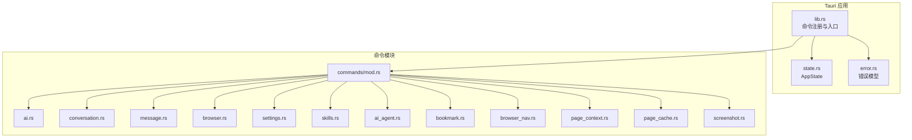
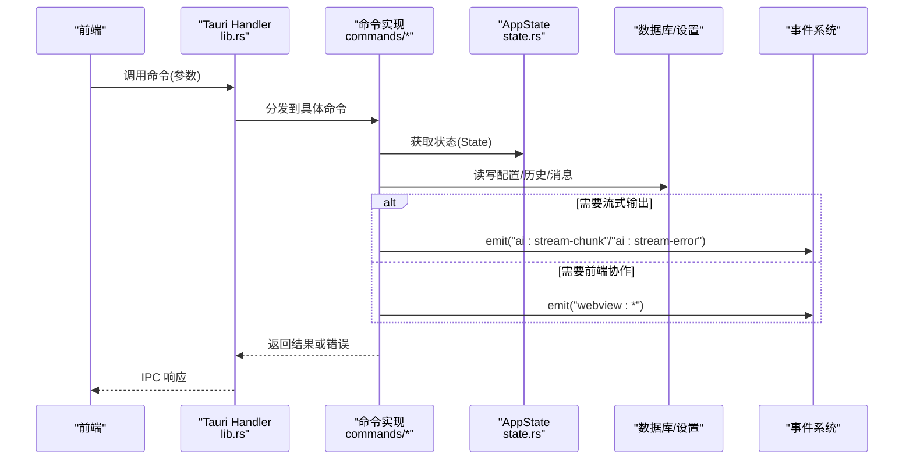
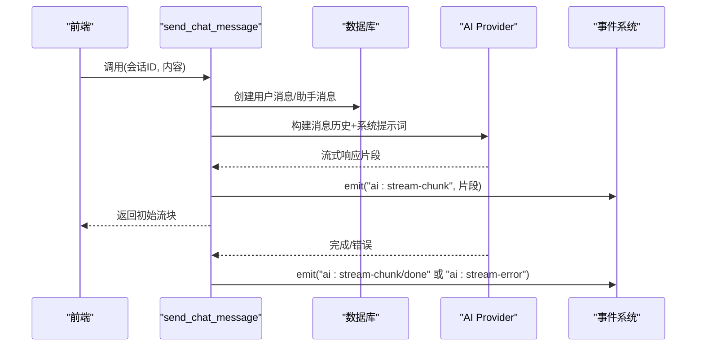
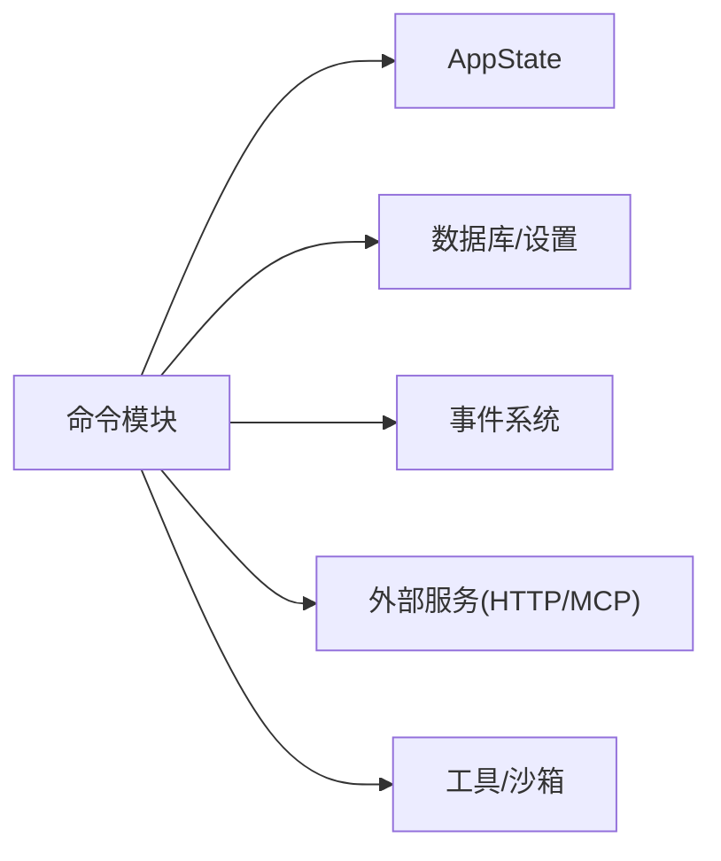

# 后端命令 API

<cite>
**本文引用的文件**
- [src-tauri/src/lib.rs](file://src-tauri/src/lib.rs)
- [src-tauri/src/error.rs](file://src-tauri/src/error.rs)
- [src-tauri/src/state.rs](file://src-tauri/src/state.rs)
- [src-tauri/src/commands/mod.rs](file://src-tauri/src/commands/mod.rs)
- [src-tauri/src/commands/ai.rs](file://src-tauri/src/commands/ai.rs)
- [src-tauri/src/commands/conversation.rs](file://src-tauri/src/commands/conversation.rs)
- [src-tauri/src/commands/message.rs](file://src-tauri/src/commands/message.rs)
- [src-tauri/src/commands/browser.rs](file://src-tauri/src/commands/browser.rs)
- [src-tauri/src/commands/settings.rs](file://src-tauri/src/commands/settings.rs)
- [src-tauri/src/commands/skills.rs](file://src-tauri/src/commands/skills.rs)
- [src-tauri/src/commands/ai_agent.rs](file://src-tauri/src/commands/ai_agent.rs)
- [src-tauri/src/commands/bookmark.rs](file://src-tauri/src/commands/bookmark.rs)
- [src-tauri/src/commands/browser_nav.rs](file://src-tauri/src/commands/browser_nav.rs)
- [src-tauri/src/commands/page_context.rs](file://src-tauri/src/commands/page_context.rs)
- [src-tauri/src/commands/page_cache.rs](file://src-tauri/src/commands/page_cache.rs)
- [src-tauri/src/commands/screenshot.rs](file://src-tauri/src/commands/screenshot.rs)
</cite>

## 目录
1. [简介](#简介)
2. [项目结构](#项目结构)
3. [核心组件](#核心组件)
4. [架构总览](#架构总览)
5. [详细组件分析](#详细组件分析)
6. [依赖关系分析](#依赖关系分析)
7. [性能考量](#性能考量)
8. [故障排查指南](#故障排查指南)
9. [结论](#结论)
10. [附录](#附录)

## 简介
本文件为 CoSurf 后端命令 API 的权威参考文档，覆盖 Tauri 命令体系中与 AI、对话、消息、浏览器控制、设置、技能、页面上下文、页面缓存、截图等模块相关的所有命令。文档逐条说明命令签名、参数结构、返回值类型、错误码定义、异常处理机制，并提供调用流程、数据校验规则、权限控制、性能优化与最佳实践建议，以及版本兼容性与迁移指南。

## 项目结构
后端命令集中于 src-tauri/src/commands 目录，按功能分模块组织；命令在 lib.rs 中统一注册，运行时由 Tauri 的 invoke_handler 分发至各模块命令。全局状态 AppState 在 state.rs 中定义，贯穿各命令对数据库、取消标志、页面内容响应缓存、技能管理器、MCP 工具注册表等的访问。

**图表来源**
- [src-tauri/src/lib.rs:108-214](file://src-tauri/src/lib.rs#L108-L214)
- [src-tauri/src/state.rs:9-23](file://src-tauri/src/state.rs#L9-L23)
- [src-tauri/src/error.rs:41-61](file://src-tauri/src/error.rs#L41-L61)
- [src-tauri/src/commands/mod.rs:1-13](file://src-tauri/src/commands/mod.rs#L1-L13)

**章节来源**
- [src-tauri/src/lib.rs:108-214](file://src-tauri/src/lib.rs#L108-L214)
- [src-tauri/src/state.rs:9-23](file://src-tauri/src/state.rs#L9-L23)
- [src-tauri/src/error.rs:41-61](file://src-tauri/src/error.rs#L41-L61)
- [src-tauri/src/commands/mod.rs:1-13](file://src-tauri/src/commands/mod.rs#L1-L13)

## 核心组件
- 错误模型与统一响应
  - 统一错误包装 ErrorResponse，包含 code 与 message 字段，便于前端一致处理。
  - AppError 提供多种错误类型映射，序列化为字符串，便于 IPC 传递。
- 全局状态 AppState
  - 数据库句柄、应用数据目录、取消标志、活动标签页 ID、页面内容响应缓存、技能管理器、最近打开 URL 去重、MCP 工具注册表。
- 命令注册
  - 在 lib.rs 的 invoke_handler 中集中注册所有命令，确保生命周期与状态正确注入。

**章节来源**
- [src-tauri/src/error.rs:41-61](file://src-tauri/src/error.rs#L41-L61)
- [src-tauri/src/state.rs:9-23](file://src-tauri/src/state.rs#L9-L23)
- [src-tauri/src/lib.rs:108-214](file://src-tauri/src/lib.rs#L108-L214)

## 架构总览
命令执行链路：前端通过 Tauri invoke 调用后端命令；命令获取 State，访问数据库或外部服务；必要时通过 AppHandle 发布事件；异步任务中进行流式输出或长耗时操作；最终返回结果或错误。

**图表来源**
- [src-tauri/src/lib.rs:108-214](file://src-tauri/src/lib.rs#L108-L214)
- [src-tauri/src/state.rs:9-23](file://src-tauri/src/state.rs#L9-L23)
- [src-tauri/src/commands/ai.rs:10-274](file://src-tauri/src/commands/ai.rs#L10-L274)
- [src-tauri/src/commands/browser_nav.rs:32-81](file://src-tauri/src/commands/browser_nav.rs#L32-L81)

## 详细组件分析

### AI 命令
- 命令概览
  - 停止生成：停止当前 AI 流式生成。
  - 发送聊天消息：创建用户/助手消息、构建系统提示词与历史消息、启动流式生成、发布流式事件。
  - 追加/完成流块：追加增量内容、标记完成。
  - 生成对话标题：基于上下文生成标题（非流式）。
- 参数与返回
  - 停止生成：无参数，返回空成功或锁错误。
  - 发送聊天消息：conversation_id, content；返回初始流块（空增量，done=false）。
  - 追加流块：message_id, delta, is_thinking；返回成功或数据库错误。
  - 完成流：message_id；返回成功或数据库错误。
  - 生成标题：context；返回标题字符串或配置/网络/解析错误。
- 异常与错误码
  - 锁错误、模型未配置、网络/解析错误、panic 捕获与事件上报。
- 执行流程
  - 构建消息历史与系统提示词 → 启动异步流式生成 → 持续 emit 流块/错误 → 完成后标记完成。
- 性能与最佳实践
  - 控制历史长度与提示词大小，避免超长上下文导致延迟。
  - 使用取消标志及时中断长时间生成。
  - 对流式事件进行节流，避免前端渲染压力。

**图表来源**
- [src-tauri/src/commands/ai.rs:16-274](file://src-tauri/src/commands/ai.rs#L16-L274)

**章节来源**
- [src-tauri/src/commands/ai.rs:10-397](file://src-tauri/src/commands/ai.rs#L10-L397)

### 对话管理命令
- 命令概览
  - 列出/获取/创建/更新/删除对话；获取对话及消息集合。
- 参数与返回
  - 列表/获取/删除：无额外参数；返回对话列表/单个对话/空成功。
  - 创建/更新：传入请求体；返回新/更新后的对话。
- 异常与错误码
  - 数据库锁错误、通用数据库错误。
- 性能与最佳实践
  - 分页查询与懒加载消息列表，避免一次性加载大量消息。

**章节来源**
- [src-tauri/src/commands/conversation.rs:8-73](file://src-tauri/src/commands/conversation.rs#L8-L73)

### 消息处理命令
- 命令概览
  - 列出/获取/创建/更新/删除消息；追加内容（流式）、完成消息；设置反馈。
- 参数与返回
  - 追加内容：id, content；返回成功或数据库错误。
  - 完成消息：id；返回成功或数据库错误。
  - 设置反馈：id, feedback；返回更新后的消息。
- 异常与错误码
  - 数据库锁错误、通用数据库错误。
- 性能与最佳实践
  - 流式消息采用增量追加，减少单次写入体积。

**章节来源**
- [src-tauri/src/commands/message.rs:7-99](file://src-tauri/src/commands/message.rs#L7-L99)

### 浏览器控制命令
- 命令概览
  - 历史记录：列出/搜索/新增/清空/删除。
- 参数与返回
  - 列表/搜索：limit/offset/query；返回历史条目列表。
  - 新增：请求体；返回新增历史项。
  - 清空/删除：无额外参数；返回成功或数据库错误。
- 异常与错误码
  - 数据库锁错误、通用数据库错误。

**章节来源**
- [src-tauri/src/commands/browser.rs:7-64](file://src-tauri/src/commands/browser.rs#L7-L64)

### 设置管理命令
- 命令概览
  - 通用设置：获取全部/单项/设置键值。
  - 模型配置：列出/获取/创建/更新/激活/删除。
  - Skills 目录：获取/设置（含目录重建与重新加载）。
  - IQS API Key：获取/设置。
  - MCP 服务器：列出/获取/创建/更新/删除；测试连接（HTTP/stdio）；从 JSON 批量导入。
- 参数与返回
  - 通用设置：key；返回值或空。
  - 模型配置：请求体/更新体；返回配置对象或成功。
  - Skills 目录：directory；返回成功或 IO/锁错误。
  - IQS API Key：api_key；返回成功或数据库错误。
  - MCP 测试：多态参数；返回工具清单或连接/解析/超时错误。
  - 批量导入：json_content；返回创建成功的服务器列表。
- 异常与错误码
  - 锁错误、IO 错误、配置错误、网络/解析错误、超时、进程错误等。
- 性能与最佳实践
  - MCP 测试设置合理超时；批量导入时逐条记录失败原因以便前端提示。

**章节来源**
- [src-tauri/src/commands/settings.rs:9-615](file://src-tauri/src/commands/settings.rs#L9-L615)

### 技能管理命令
- 命令概览
  - 列出技能、删除技能、启用/禁用、从 Markdown/目录导入、列出技能目录、读取 SKILL.md 内容。
- 参数与返回
  - 列出/删除/切换：无额外参数/请求体；返回技能列表/空成功/空成功。
  - 导入：markdown_content/source_dir；返回技能信息。
  - 列表目录/读取内容：无额外参数；返回目录信息/内容字符串。
- 异常与错误码
  - 技能管理器锁错误、导入/删除失败等。
- 性能与最佳实践
  - 导入大型目录时注意 I/O 与并发；前端展示进度与错误。

**章节来源**
- [src-tauri/src/commands/skills.rs:43-152](file://src-tauri/src/commands/skills.rs#L43-L152)

### AI Agent 命令
- 命令概览
  - 执行 Agent 任务：接收任务与迭代次数，返回成功标志、答案与轨迹摘要。
  - 配置 Qwen 模型：接收 API Key、模型 ID、可选 Base URL。
  - 生成页面摘要：接收 URL 与内容，返回摘要字符串并保存到沙箱。
  - 提取记忆：接收用户输入，返回提取的记忆列表并保存到沙箱。
- 参数与返回
  - 执行 Agent：AgentRequest；返回 AgentResponse。
  - 配置模型：api_key, model_id, base_url；返回空成功。
  - 生成摘要：url, content；返回摘要字符串。
  - 提取记忆：user_input；返回记忆列表。
- 异常与错误码
  - 内部错误、IPC 错误等。
- 性能与最佳实践
  - 限制最大迭代次数；对长内容进行截断或分段处理。

**章节来源**
- [src-tauri/src/commands/ai_agent.rs:13-145](file://src-tauri/src/commands/ai_agent.rs#L13-L145)

### 书签管理命令
- 命令概览
  - 列出/创建/删除书签；列出/创建/删除书签文件夹。
- 参数与返回
  - 列出/创建/删除：folder_id/请求体；返回书签/文件夹对象或空成功。
- 异常与错误码
  - 数据库锁错误、通用数据库错误。

**章节来源**
- [src-tauri/src/commands/bookmark.rs:7-75](file://src-tauri/src/commands/bookmark.rs#L7-L75)

### 浏览器导航命令
- 命令概览
  - 导航到 URL、刷新、后退、前进、获取状态、关闭标签页、执行脚本、获取页面内容、截图、切换元素选择模式、点击元素、输入文本、滚动页面、设置活动标签页、通过 HTTP 获取标题。
- 参数与返回
  - 导航/刷新/关闭/执行脚本/截图：tab_id/url/script 等；返回状态/空成功/空成功/空成功/空成功/空成功/空成功/空成功/空成功/空成功/空成功/空成功/空成功/空成功/空成功/空成功/空成功/空成功。
  - 后退/前进/获取状态：tab_id；返回状态或错误。
  - 获取页面内容：tab_id；返回空成功（前端异步回传内容）。
  - 切换选择模式/点击/输入/滚动：tab_id/selector/text/direction；返回空成功。
  - 设置活动标签页：tab_id；返回空成功。
  - 获取标题：tab_id/url；返回标题字符串。
- 异常与错误码
  - 事件发射失败、锁错误、内部错误、HTTP 获取失败等。
- 性能与最佳实践
  - 导航历史维护避免无限增长；脚本执行与页面内容提取设置超时；元素选择模式仅在需要时开启。

**章节来源**
- [src-tauri/src/commands/browser_nav.rs:32-532](file://src-tauri/src/commands/browser_nav.rs#L32-L532)

### 页面上下文命令
- 命令概览
  - 获取页面上下文：从前端获取标签页信息，构造 PageContext。
  - 注入页面上下文：生成系统提示词，供 AI 对话参考。
  - 总结页面：提取页面内容并截断，返回摘要。
  - 接收页面内容：前端回传内容，写入响应缓存。
  - 执行网页操作：点击、填写、关闭弹窗等。
- 参数与返回
  - 获取上下文：tab_id；返回 PageContext。
  - 注入上下文：conversation_id, tab_id；返回提示词字符串。
  - 总结页面：tab_id, max_length；返回摘要字符串或内部错误。
  - 接收内容：request_id, content；返回空成功。
  - 执行操作：tab_id, action, selector, value；返回操作结果字符串。
- 异常与错误码
  - 主窗口未找到、事件发射失败、超时、内部错误等。
- 性能与最佳实践
  - 设置合理的等待超时；对跨域页面内容提取失败进行降级提示。

**章节来源**
- [src-tauri/src/commands/page_context.rs:21-327](file://src-tauri/src/commands/page_context.rs#L21-L327)

### 页面缓存命令
- 命令概览
  - 保存页面缓存：根据 URL 生成文件名，写入 JSON 文件。
  - 加载页面缓存：读取缓存文件，返回 PageCache 或空。
  - 清理过期缓存：遍历目录，删除超过阈值的缓存文件。
- 参数与返回
  - 保存：url, title, content；返回文件路径字符串或错误。
  - 加载：url；返回 PageCache 或空。
  - 清理：max_age_seconds；返回清理数量。
- 异常与错误码
  - 目录创建失败、序列化/反序列化失败、文件读写失败等。
- 性能与最佳实践
  - 使用 SHA256 作为文件名，避免路径冲突；定期清理过期缓存释放空间。

**章节来源**
- [src-tauri/src/commands/page_cache.rs:162-253](file://src-tauri/src/commands/page_cache.rs#L162-L253)

### 截图命令
- 命令概览
  - 全屏截图：捕获屏幕，编码为 PNG，通过事件发送给前端。
  - 区域截图：从 base64 全屏图裁剪指定区域，编码 PNG，发送事件。
  - 保存截图：将 base64 图像写入文件。
  - 复制截图：解码图像并写入系统剪贴板。
- 参数与返回
  - 全屏截图：无参数；返回空成功或底层错误。
  - 区域截图：base64_data, x, y, width, height, screen_width, screen_height；返回空成功或解码/裁剪/编码错误。
  - 保存截图：base64_data, path；返回空成功或写入错误。
  - 复制截图：base64_data；返回空成功或剪贴板错误。
- 异常与错误码
  - 监控器获取失败、截图/编码/解码失败、剪贴板访问失败等。
- 性能与最佳实践
  - 全屏截图后前端再进行区域选择，降低 CPU/GPU 压力；保存/复制前进行格式校验。

**章节来源**
- [src-tauri/src/commands/screenshot.rs:14-165](file://src-tauri/src/commands/screenshot.rs#L14-L165)

## 依赖关系分析
- 命令到状态与数据库
  - 大多数命令通过 State 获取数据库句柄与全局状态，保证线程安全与一致性。
- 命令到事件系统
  - AI 流式生成、浏览器操作、截图等通过 AppHandle 发布事件，驱动前端行为。
- 命令到外部服务
  - AI 命令调用外部模型服务；页面标题获取使用 HTTP 请求；MCP 测试支持 HTTP/stdio。
- 命令到工具与沙箱
  - 页面摘要与记忆提取通过沙箱保存结果；技能管理器负责技能导入与加载。

**图表来源**
- [src-tauri/src/state.rs:9-23](file://src-tauri/src/state.rs#L9-L23)
- [src-tauri/src/commands/ai.rs:16-274](file://src-tauri/src/commands/ai.rs#L16-L274)
- [src-tauri/src/commands/browser_nav.rs:32-81](file://src-tauri/src/commands/browser_nav.rs#L32-L81)
- [src-tauri/src/commands/page_context.rs:21-107](file://src-tauri/src/commands/page_context.rs#L21-L107)

**章节来源**
- [src-tauri/src/state.rs:9-23](file://src-tauri/src/state.rs#L9-L23)
- [src-tauri/src/commands/ai.rs:16-274](file://src-tauri/src/commands/ai.rs#L16-L274)
- [src-tauri/src/commands/browser_nav.rs:32-81](file://src-tauri/src/commands/browser_nav.rs#L32-L81)
- [src-tauri/src/commands/page_context.rs:21-107](file://src-tauri/src/commands/page_context.rs#L21-L107)

## 性能考量
- 数据库访问
  - 所有命令均通过互斥锁访问数据库，避免并发写冲突；建议批量写入与事务封装，减少锁竞争。
- 流式输出
  - AI 流式生成采用异步任务与事件推送，前端需节流渲染；命令层对 panic 进行捕获并发出错误事件，保障稳定性。
- 超时与取消
  - 页面内容提取、MCP 连接测试设置超时；AI 生成支持取消标志，及时中断长任务。
- I/O 与缓存
  - 页面缓存采用 JSON 文件与 SHA256 文件名，定期清理过期缓存；截图命令对大图进行裁剪与编码，避免内存峰值。
- 前后端协作
  - 浏览器导航与页面内容提取通过事件异步回传，避免阻塞主线程。

[本节为通用指导，无需特定文件引用]

## 故障排查指南
- 常见错误码
  - DATABASE_ERROR：数据库操作失败（锁/连接/SQL 错误）。
  - HTTP_ERROR：网络请求失败（DNS/连接/超时）。
  - JSON_ERROR：序列化/反序列化失败。
  - TAURI_ERROR：Tauri 事件/窗口/插件错误。
  - AI_PROVIDER_ERROR：AI 服务配置或调用错误。
  - CONFIG_ERROR：配置缺失或格式错误。
  - NOT_FOUND：资源不存在。
  - INTERNAL_ERROR：内部逻辑错误。
  - LOCK_ERROR：状态锁获取失败。
  - IO_ERROR：文件系统错误。
  - INVALID_URL/INVALID_CONFIG：参数校验失败。
  - INIT_FAILED/LIST_TOOLS_FAILED：MCP 初始化/工具列表获取失败。
  - TIMEOUT：超时错误。
  - SPAWN_FAILED/STDERR/READ_ERROR：进程/管道错误。
- 定位方法
  - 查看后端日志（info/warn/error），结合命令行参数与返回值。
  - 对网络类错误，检查代理、证书、超时设置。
  - 对 MCP 错误，确认服务器类型、URL/命令、环境变量与超时。
  - 对截图/剪贴板错误，检查权限与平台支持。
- 修复建议
  - 为长任务设置合理超时与取消标志。
  - 对外部服务增加重试与降级策略。
  - 对文件 I/O 增加存在性与权限检查。

**章节来源**
- [src-tauri/src/error.rs:41-61](file://src-tauri/src/error.rs#L41-L61)
- [src-tauri/src/commands/settings.rs:264-486](file://src-tauri/src/commands/settings.rs#L264-L486)
- [src-tauri/src/commands/screenshot.rs:14-165](file://src-tauri/src/commands/screenshot.rs#L14-L165)

## 结论
CoSurf 后端命令 API 以模块化方式组织，统一通过 Tauri 注册与分发，配合 AppState 提供稳定的全局状态与事件系统。命令覆盖 AI 对话、对话/消息管理、浏览器控制、设置与技能、页面上下文、缓存与截图等核心场景。通过完善的错误模型、超时与取消机制、事件驱动的前后端协作，以及对性能与安全的考量，为前端提供了可靠、可扩展的后端能力。

[本节为总结，无需特定文件引用]

## 附录

### 命令调用示例（格式说明）
- 请求格式
  - 通过 Tauri invoke 调用，参数按命令定义传入。
- 响应格式
  - 成功：返回命令定义的结构化结果。
  - 失败：返回 ErrorResponse，包含 code 与 message。
- 错误处理
  - 前端统一捕获 ErrorResponse，根据 code 显示对应提示或引导用户修复配置。

[本节为通用说明，无需特定文件引用]

### 版本兼容性与迁移指南
- 命令命名与参数
  - 建议保持向后兼容，新增字段使用可选参数，避免破坏既有调用。
- 错误码
  - 新增错误码时，保留原有 code 语义，避免前端分支逻辑变更。
- 数据结构
  - 对返回结构进行扩展时，确保旧字段不被移除，新增字段标注版本。
- 迁移步骤
  - 发布新版本前，提供迁移脚本或配置升级提示。
  - 逐步替换命令实现，监控日志与错误率，回滚策略就位。

[本节为通用指导，无需特定文件引用]