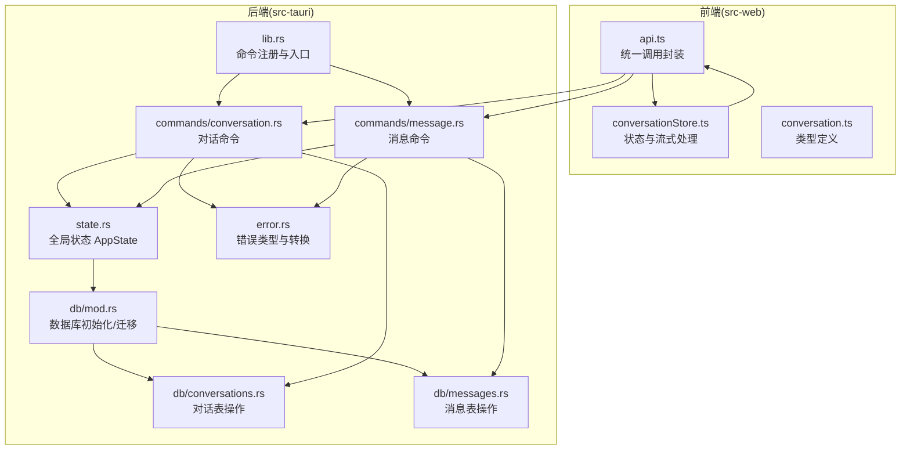
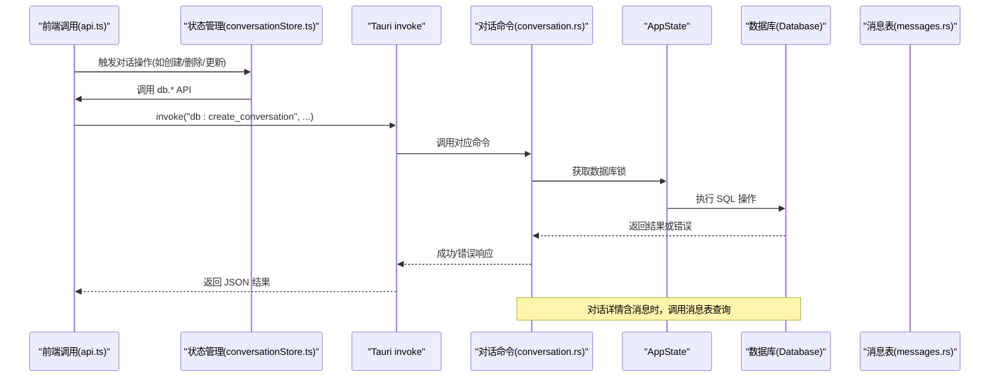
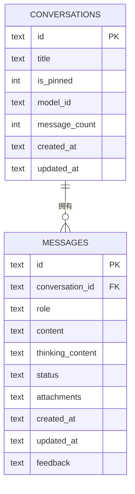
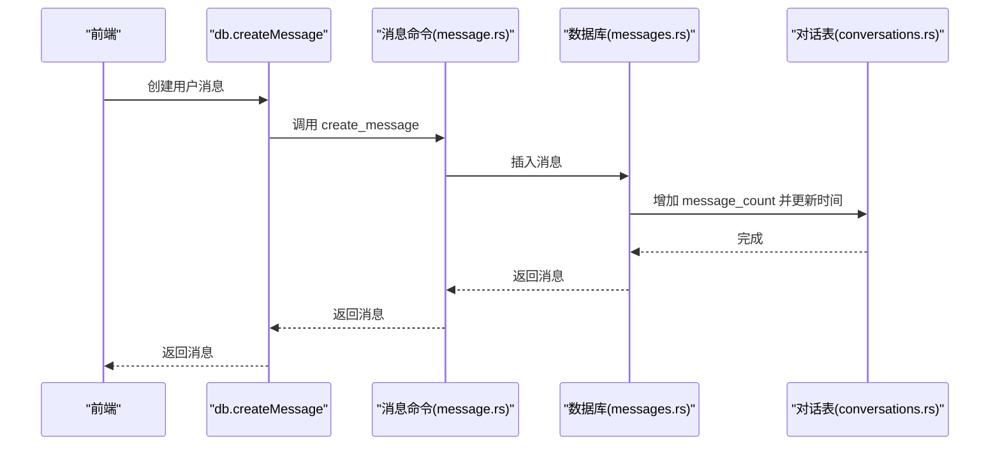
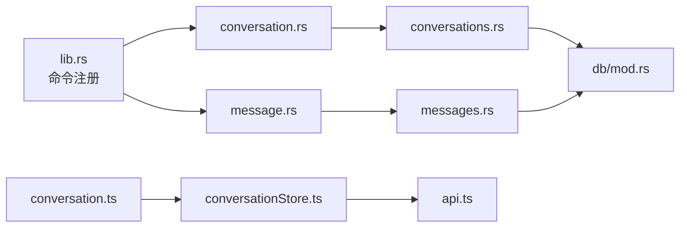

# 对话管理命令

<cite>
**本文引用的文件**
- [conversation.rs](file://src-tauri/src/commands/conversation.rs)
- [conversations.rs](file://src-tauri/src/db/conversations.rs)
- [messages.rs](file://src-tauri/src/db/messages.rs)
- [mod.rs（数据库模块）](file://src-tauri/src/db/mod.rs)
- [state.rs](file://src-tauri/src/state.rs)
- [error.rs](file://src-tauri/src/error.rs)
- [lib.rs](file://src-tauri/src/lib.rs)
- [conversationStore.ts](file://src-web/src/stores/conversationStore.ts)
- [api.ts](file://src-web/src/lib/api.ts)
- [conversation.ts](file://packages/shared/src/conversation.ts)
- [message.rs](file://src-tauri/src/commands/message.rs)
</cite>

## 目录
1. [简介](#简介)
2. [项目结构](#项目结构)
3. [核心组件](#核心组件)
4. [架构总览](#架构总览)
5. [详细组件分析](#详细组件分析)
6. [依赖分析](#依赖分析)
7. [性能考虑](#性能考虑)
8. [故障排除指南](#故障排除指南)
9. [结论](#结论)
10. [附录](#附录)

## 简介
本文件为 CoSurf 对话管理命令的全面 API 文档，聚焦于后端 Rust 命令与前端调用链路，覆盖创建对话、获取对话列表、获取对话详情、删除对话、更新对话信息、以及“带消息的对话详情”等核心功能。文档详细说明参数校验、数据完整性、错误处理、并发控制、与消息系统的关联及一致性保障，并提供调用示例与常见问题排查建议。

## 项目结构
对话管理命令位于 Tauri 后端命令层，数据持久化通过 SQLite（rusqlite）实现，前端通过统一 API 适配层调用后端命令。

**图表来源**
- [conversation.rs:1-73](file://src-tauri/src/commands/conversation.rs#L1-L73)
- [message.rs:1-99](file://src-tauri/src/commands/message.rs#L1-L99)
- [mod.rs（数据库模块）:1-272](file://src-tauri/src/db/mod.rs#L1-L272)
- [conversations.rs:1-127](file://src-tauri/src/db/conversations.rs#L1-L127)
- [messages.rs:1-198](file://src-tauri/src/db/messages.rs#L1-L198)
- [state.rs:1-81](file://src-tauri/src/state.rs#L1-L81)
- [error.rs:1-64](file://src-tauri/src/error.rs#L1-L64)
- [lib.rs:108-214](file://src-tauri/src/lib.rs#L108-L214)

**章节来源**
- [lib.rs:108-214](file://src-tauri/src/lib.rs#L108-L214)

## 核心组件
- 对话命令模块：提供对话生命周期管理的 Tauri 命令，均通过 AppState 的数据库锁访问数据库。
- 数据库模块：负责 SQLite 初始化、迁移、对话与消息表的增删改查。
- 错误处理：统一的 AppError 到 ErrorResponse 转换，便于前端识别错误类型。
- 前端适配：api.ts 将前端调用映射为后端命令通道；conversationStore.ts 负责状态管理与流式消息处理。

**章节来源**
- [conversation.rs:1-73](file://src-tauri/src/commands/conversation.rs#L1-L73)
- [conversations.rs:1-127](file://src-tauri/src/db/conversations.rs#L1-L127)
- [messages.rs:1-198](file://src-tauri/src/db/messages.rs#L1-L198)
- [error.rs:1-64](file://src-tauri/src/error.rs#L1-L64)
- [api.ts:54-98](file://src-web/src/lib/api.ts#L54-L98)
- [conversationStore.ts:1-365](file://src-web/src/stores/conversationStore.ts#L1-L365)

## 架构总览
对话管理命令的调用链路如下：

**图表来源**
- [api.ts:54-98](file://src-web/src/lib/api.ts#L54-L98)
- [conversationStore.ts:69-101](file://src-web/src/stores/conversationStore.ts#L69-L101)
- [conversation.rs:26-72](file://src-tauri/src/commands/conversation.rs#L26-L72)
- [messages.rs:64-94](file://src-tauri/src/db/messages.rs#L64-L94)

## 详细组件分析

### 对话命令总览
- list_conversations：列出所有对话，按置顶优先、更新时间倒序。
- get_conversation：按 id 获取单个对话详情。
- create_conversation：创建新对话，默认标题与模型 ID 可选。
- update_conversation：按 id 更新对话标题、置顶状态、模型 ID。
- delete_conversation：按 id 删除对话。
- get_conversation_with_messages：组合返回对话与该对话下的全部消息。

上述命令均通过 AppState 的 Mutex<Database> 获取数据库连接，并在失败时转换为 ErrorResponse。

**章节来源**
- [conversation.rs:8-72](file://src-tauri/src/commands/conversation.rs#L8-L72)
- [state.rs:9-23](file://src-tauri/src/state.rs#L9-L23)
- [error.rs:41-61](file://src-tauri/src/error.rs#L41-L61)

### 数据模型与表结构
- 对话模型：包含 id、标题、是否置顶、模型 id、消息计数、创建/更新时间。
- 消息模型：包含 id、所属对话 id、角色、内容、思考内容、状态、附件、反馈、创建/更新时间。
- 表结构：conversations 与 messages，messages 外键关联 conversations 并启用级联删除。

**图表来源**
- [mod.rs（数据库模块）:44-65](file://src-tauri/src/db/mod.rs#L44-L65)
- [conversations.rs:7-17](file://src-tauri/src/db/conversations.rs#L7-L17)
- [messages.rs:22-36](file://src-tauri/src/db/messages.rs#L22-L36)

**章节来源**
- [conversations.rs:7-127](file://src-tauri/src/db/conversations.rs#L7-L127)
- [messages.rs:22-198](file://src-tauri/src/db/messages.rs#L22-L198)
- [mod.rs（数据库模块）:44-148](file://src-tauri/src/db/mod.rs#L44-L148)

### 参数验证与数据完整性
- create_conversation
  - 输入：CreateConversationRequest(title?, model_id?)
  - 默认值：title 默认为“New Conversation”，model_id 默认为空字符串
  - 完整性：生成唯一 id，插入时填充 message_count 为 0，created_at/updated_at 为当前时间
- update_conversation
  - 输入：UpdateConversationRequest(title?, is_pinned?, model_id?)
  - 完整性：若某字段未提供，则沿用现有值；更新 updated_at
- delete_conversation
  - 完整性：若影响行数为 0，返回“未找到”
- get_conversation_with_messages
  - 完整性：先获取对话，再获取该对话下所有消息，保证一致性

**章节来源**
- [conversations.rs:80-117](file://src-tauri/src/db/conversations.rs#L80-L117)
- [messages.rs:64-94](file://src-tauri/src/db/messages.rs#L64-L94)

### 错误处理与响应格式
- 后端错误类型 AppError 统一转换为 ErrorResponse(code, message)
- 常见错误码：DATABASE_ERROR、NOT_FOUND、INTERNAL_ERROR 等
- 前端通过 parseJSON/parseJSONOrNull 解析后端返回的 JSON 字符串

**章节来源**
- [error.rs:4-64](file://src-tauri/src/error.rs#L4-L64)
- [api.ts:25-49](file://src-web/src/lib/api.ts#L25-L49)

### 并发访问控制
- AppState 内部持有 Mutex<Database>，所有命令在执行前尝试获取互斥锁
- 若锁获取失败，返回 LOCK_ERROR 错误
- 建议：避免长时间持有锁，尽量将耗时逻辑（如网络请求）放在锁外

**章节来源**
- [state.rs:9-23](file://src-tauri/src/state.rs#L9-L23)
- [conversation.rs:9-15](file://src-tauri/src/commands/conversation.rs#L9-L15)

### 与消息系统的关联与一致性
- create_message 会在插入消息后调用 conversations 表的 message_count 自增，并更新 updated_at
- get_conversation_with_messages 保证一次性返回对话与消息，避免中间状态不一致
- 前端 conversationStore.ts 在发送消息时，先本地渲染临时消息，再持久化到数据库，最后接收流式事件更新

**图表来源**
- [message.rs:25-35](file://src-tauri/src/commands/message.rs#L25-L35)
- [messages.rs:122-135](file://src-tauri/src/db/messages.rs#L122-L135)
- [conversations.rs:119-125](file://src-tauri/src/db/conversations.rs#L119-L125)

**章节来源**
- [messages.rs:122-135](file://src-tauri/src/db/messages.rs#L122-L135)
- [conversations.rs:119-125](file://src-tauri/src/db/conversations.rs#L119-L125)

### 命令调用示例与错误场景

- 创建对话
  - 前端调用：db.createConversation(title, modelId?)
  - 成功响应：返回 Conversation 对象
  - 错误场景：数据库异常、锁失败
- 获取对话列表
  - 前端调用：db.listConversations()
  - 成功响应：返回 Conversation 数组
  - 错误场景：数据库异常
- 获取对话详情
  - 前端调用：db.getConversation(id)
  - 成功响应：返回单个 Conversation
  - 错误场景：未找到
- 更新对话
  - 前端调用：db.updateConversation(id, { title?, isPinned?, modelId? })
  - 成功响应：返回更新后的 Conversation
  - 错误场景：未找到、数据库异常
- 删除对话
  - 前端调用：db.deleteConversation(id)
  - 成功响应：无返回体
  - 错误场景：未找到、数据库异常
- 获取对话与消息
  - 前端调用：db.getConversationWithMessages(id)
  - 成功响应：返回 (Conversation, Message[])
  - 错误场景：对话未找到、消息查询异常

**章节来源**
- [api.ts:56-72](file://src-web/src/lib/api.ts#L56-L72)
- [conversation.rs:8-72](file://src-tauri/src/commands/conversation.rs#L8-L72)
- [messages.rs:64-94](file://src-tauri/src/db/messages.rs#L64-L94)

## 依赖分析
- 命令注册：lib.rs 中集中注册对话与消息相关命令，确保前端可通过 invoke 调用。
- 数据依赖：对话命令依赖 conversations.rs；消息命令依赖 messages.rs；二者均依赖 Database。
- 类型依赖：前端 conversation.ts 与后端 Conversation 结构保持一致（字段名驼峰映射）。

**图表来源**
- [lib.rs:108-214](file://src-tauri/src/lib.rs#L108-L214)
- [conversation.rs:1-73](file://src-tauri/src/commands/conversation.rs#L1-L73)
- [message.rs:1-99](file://src-tauri/src/commands/message.rs#L1-L99)
- [conversations.rs:1-127](file://src-tauri/src/db/conversations.rs#L1-L127)
- [messages.rs:1-198](file://src-tauri/src/db/messages.rs#L1-L198)
- [mod.rs（数据库模块）:1-272](file://src-tauri/src/db/mod.rs#L1-L272)
- [conversationStore.ts:1-365](file://src-web/src/stores/conversationStore.ts#L1-L365)
- [api.ts:54-98](file://src-web/src/lib/api.ts#L54-L98)
- [conversation.ts:1-14](file://packages/shared/src/conversation.ts#L1-L14)

**章节来源**
- [lib.rs:108-214](file://src-tauri/src/lib.rs#L108-L214)

## 性能考虑
- 查询排序：list_conversations 按 is_pinned 降序、updated_at 降序，适合前端侧边栏展示。
- 索引优化：messages 表对 conversation_id 建有索引，提高按会话查询性能。
- WAL 模式：数据库初始化启用 WAL，提升并发读写性能。
- 锁粒度：命令执行期间持有数据库锁，建议避免在锁内执行阻塞操作。

**章节来源**
- [conversations.rs:34-58](file://src-tauri/src/db/conversations.rs#L34-L58)
- [mod.rs（数据库模块）:24-26](file://src-tauri/src/db/mod.rs#L24-L26)
- [mod.rs（数据库模块）:67-67](file://src-tauri/src/db/mod.rs#L67-L67)

## 故障排除指南
- “未找到”错误
  - 现象：返回 NOT_FOUND
  - 排查：确认 id 是否正确、资源是否已被删除
- “锁失败”错误
  - 现象：返回 LOCK_ERROR
  - 排查：检查是否有长时间占用数据库的操作；避免在锁内做网络请求
- “数据库异常”错误
  - 现象：返回 DATABASE_ERROR
  - 排查：查看数据库文件是否损坏；确认迁移是否成功
- 前端解析异常
  - 现象：parseJSON/parseJSONOrNull 失败
  - 排查：确认后端返回的是合法 JSON 字符串；检查序列化/反序列化逻辑

**章节来源**
- [error.rs:47-61](file://src-tauri/src/error.rs#L47-L61)
- [api.ts:25-49](file://src-web/src/lib/api.ts#L25-L49)

## 结论
对话管理命令围绕“对话 + 消息”的核心模型，提供了完整的生命周期管理能力。通过严格的错误转换、并发锁控制与数据库迁移机制，保证了数据一致性与稳定性。前端通过统一 API 适配层与状态管理，实现了流畅的用户体验与可靠的流式消息处理。

## 附录

### 命令与接口对照表
- 列出对话：db:list_conversations → list_conversations
- 获取对话：db:get_conversation → get_conversation
- 创建对话：db:create_conversation → create_conversation
- 更新对话：db:update_conversation → update_conversation
- 删除对话：db:delete_conversation → delete_conversation
- 对话+消息：db:get_conversation_with_messages → get_conversation_with_messages

**章节来源**
- [lib.rs:108-115](file://src-tauri/src/lib.rs#L108-L115)
- [api.ts:56-72](file://src-web/src/lib/api.ts#L56-L72)