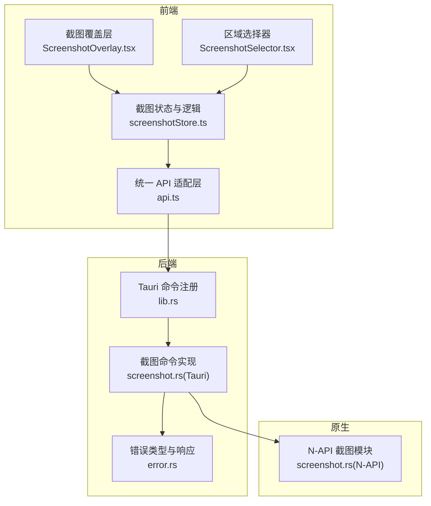
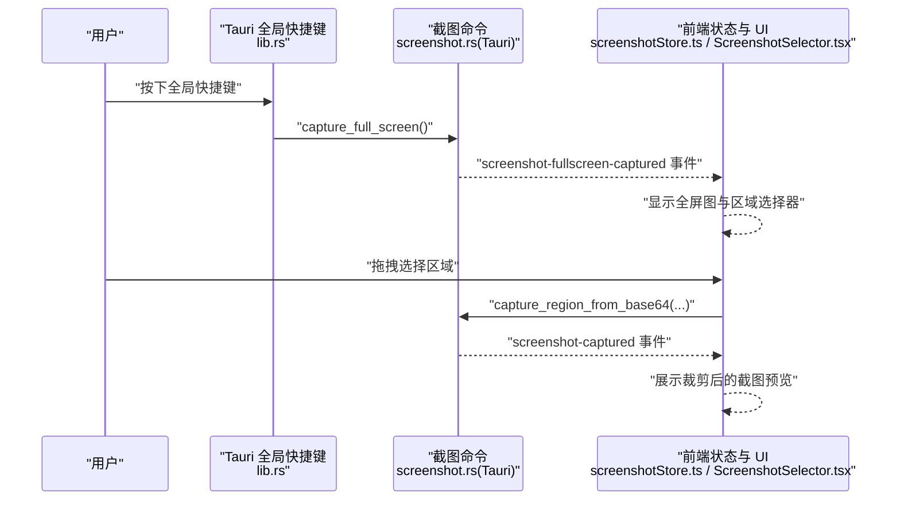
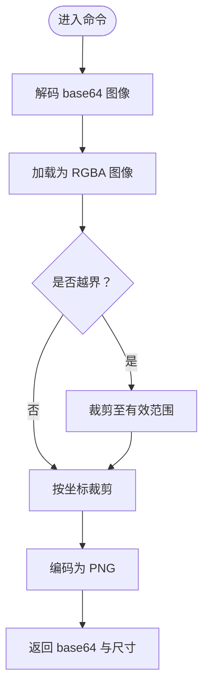
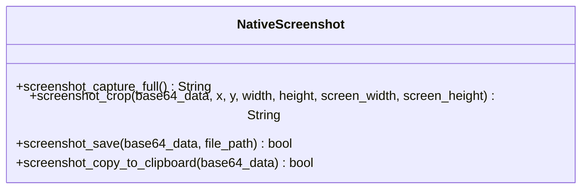
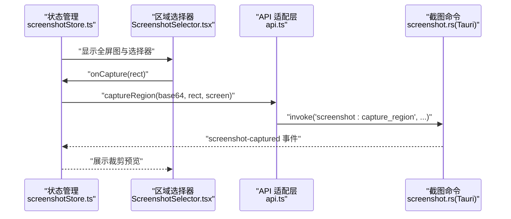
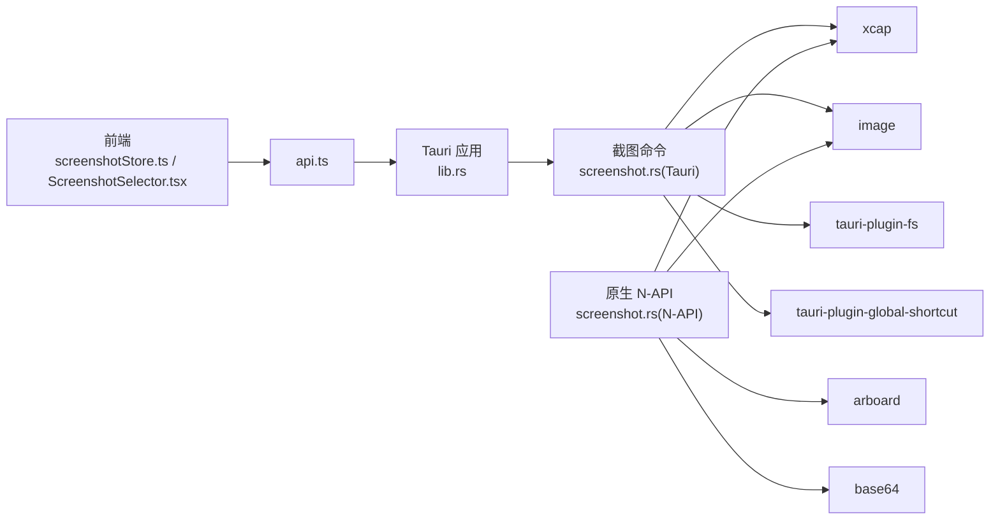

# 截图工具命令

<cite>
**本文引用的文件**
- [screenshot.rs](file://src-tauri/src/commands/screenshot.rs)
- [screenshot.rs](file://native/src/screenshot.rs)
- [screenshotStore.ts](file://src-web/src/stores/screenshotStore.ts)
- [ScreenshotSelector.tsx](file://src-web/src/components/ui/ScreenshotSelector.tsx)
- [api.ts](file://src-web/src/lib/api.ts)
- [lib.rs](file://src-tauri/src/lib.rs)
- [error.rs](file://src-tauri/src/error.rs)
- [Cargo.toml](file://src-tauri/Cargo.toml)
- [Cargo.toml](file://native/Cargo.toml)
</cite>

## 目录
1. [简介](#简介)
2. [项目结构](#项目结构)
3. [核心组件](#核心组件)
4. [架构总览](#架构总览)
5. [详细组件分析](#详细组件分析)
6. [依赖关系分析](#依赖关系分析)
7. [性能考虑](#性能考虑)
8. [故障排查指南](#故障排查指南)
9. [结论](#结论)
10. [附录：命令参考与示例](#附录命令参考与示例)

## 简介
本文件为 CoSurf 截图工具命令的详细 API 文档，聚焦于“全屏截图、区域截图、窗口截图、截图保存”等核心能力。文档覆盖以下关键主题：
- 截图命令与参数：全屏截图、区域裁剪、保存到文件、复制到剪贴板
- 图像格式与编码：统一采用 PNG 编码，返回 base64 字符串
- 前端协作机制：全屏截图事件、区域选择交互、裁剪结果回传
- 文件系统与权限：基于 Tauri 插件进行文件写入
- 错误处理与日志：统一错误类型与错误响应封装
- 性能优化与内存管理：异步执行、零拷贝裁剪、释放中间资源

## 项目结构
截图功能由三层协同实现：
- 后端命令层（Tauri）：负责系统级截图、裁剪、保存、剪贴板写入
- 原生 N-API 层（Rust）：提供高性能的截图与图像处理能力
- 前端状态与交互层（React + Zustand）：负责事件监听、区域选择、UI 展示与用户交互

图表来源
- [lib.rs:201-205](file://src-tauri/src/lib.rs#L201-L205)
- [screenshot.rs:13-58](file://src-tauri/src/commands/screenshot.rs#L13-L58)
- [screenshotStore.ts:38-93](file://src-web/src/stores/screenshotStore.ts#L38-L93)
- [api.ts:348-360](file://src-web/src/lib/api.ts#L348-L360)
- [screenshot.rs:10-40](file://native/src/screenshot.rs#L10-L40)

章节来源
- [lib.rs:201-205](file://src-tauri/src/lib.rs#L201-L205)
- [screenshot.rs:13-58](file://src-tauri/src/commands/screenshot.rs#L13-L58)
- [screenshotStore.ts:38-93](file://src-web/src/stores/screenshotStore.ts#L38-L93)
- [api.ts:348-360](file://src-web/src/lib/api.ts#L348-L360)
- [screenshot.rs:10-40](file://native/src/screenshot.rs#L10-L40)

## 核心组件
- Tauri 截图命令
  - 全屏截图：捕获当前显示器全屏，返回 base64 PNG 与尺寸
  - 区域截图：从前端传入的 base64 全屏图中裁剪指定矩形区域
  - 保存截图：将 base64 图像写入指定文件路径
  - 复制到剪贴板：将 base64 图像写入系统剪贴板
- 原生 N-API 截图模块
  - 全屏截图：返回包含 image、width、height 的 JSON 字符串
  - 区域裁剪：对 base64 图像进行裁剪并返回新的 base64 PNG
  - 保存与复制：与 Tauri 命令对应的功能
- 前端状态与交互
  - 全局快捷键触发全屏截图
  - 事件驱动的全屏图接收与区域选择
  - 裁剪结果回传并展示预览
  - 保存与复制操作的 UI 反馈

章节来源
- [screenshot.rs:13-58](file://src-tauri/src/commands/screenshot.rs#L13-L58)
- [screenshot.rs:60-119](file://src-tauri/src/commands/screenshot.rs#L60-L119)
- [screenshot.rs:121-133](file://src-tauri/src/commands/screenshot.rs#L121-L133)
- [screenshot.rs:135-164](file://src-tauri/src/commands/screenshot.rs#L135-L164)
- [screenshot.rs:10-40](file://native/src/screenshot.rs#L10-L40)
- [screenshot.rs:42-84](file://native/src/screenshot.rs#L42-L84)
- [screenshot.rs:86-97](file://native/src/screenshot.rs#L86-L97)
- [screenshot.rs:99-128](file://native/src/screenshot.rs#L99-L128)
- [screenshotStore.ts:38-93](file://src-web/src/stores/screenshotStore.ts#L38-L93)
- [screenshotStore.ts:99-132](file://src-web/src/stores/screenshotStore.ts#L99-L132)
- [screenshotStore.ts:134-172](file://src-web/src/stores/screenshotStore.ts#L134-L172)
- [ScreenshotSelector.tsx:12-102](file://src-web/src/components/ui/ScreenshotSelector.tsx#L12-L102)

## 架构总览
下图展示了从全局快捷键到前端预览的整体流程。

图表来源
- [lib.rs:75-93](file://src-tauri/src/lib.rs#L75-L93)
- [screenshot.rs:13-58](file://src-tauri/src/commands/screenshot.rs#L13-L58)
- [screenshotStore.ts:38-93](file://src-web/src/stores/screenshotStore.ts#L38-L93)
- [ScreenshotSelector.tsx:12-102](file://src-web/src/components/ui/ScreenshotSelector.tsx#L12-L102)

章节来源
- [lib.rs:75-93](file://src-tauri/src/lib.rs#L75-L93)
- [screenshot.rs:13-58](file://src-tauri/src/commands/screenshot.rs#L13-L58)
- [screenshotStore.ts:38-93](file://src-web/src/stores/screenshotStore.ts#L38-L93)
- [ScreenshotSelector.tsx:12-102](file://src-web/src/components/ui/ScreenshotSelector.tsx#L12-L102)

## 详细组件分析

### Tauri 截图命令
- 全屏截图
  - 输入：无
  - 输出：事件负载包含 base64 PNG 与宽高
  - 关键点：使用显示器库捕获图像，转为 RGBA，再编码为 PNG
- 区域截图
  - 输入：base64 全屏图、裁剪坐标(x,y)与尺寸(width,height)、屏幕宽高
  - 输出：事件负载包含裁剪后的 base64 PNG 与宽高
  - 关键点：边界校验、不可越界；使用图像库裁剪并重新编码
- 保存截图
  - 输入：base64 图像、目标文件路径
  - 输出：布尔成功标志
  - 关键点：基于文件系统插件写入
- 复制到剪贴板
  - 输入：base64 图像
  - 输出：布尔成功标志
  - 关键点：将像素数据写入系统剪贴板

图表来源
- [screenshot.rs:60-119](file://src-tauri/src/commands/screenshot.rs#L60-L119)

章节来源
- [screenshot.rs:13-58](file://src-tauri/src/commands/screenshot.rs#L13-L58)
- [screenshot.rs:60-119](file://src-tauri/src/commands/screenshot.rs#L60-L119)
- [screenshot.rs:121-133](file://src-tauri/src/commands/screenshot.rs#L121-L133)
- [screenshot.rs:135-164](file://src-tauri/src/commands/screenshot.rs#L135-L164)

### 原生 N-API 截图模块
- 全屏截图
  - 返回 JSON 字符串，包含 image、width、height
- 区域裁剪
  - 参数与 Tauri 版本一致，返回裁剪后的 PNG base64
- 保存与复制
  - 与 Tauri 命令一一对应，用于 Electron 场景下的 N-API 调用

图表来源
- [screenshot.rs:10-40](file://native/src/screenshot.rs#L10-L40)
- [screenshot.rs:42-84](file://native/src/screenshot.rs#L42-L84)
- [screenshot.rs:86-97](file://native/src/screenshot.rs#L86-L97)
- [screenshot.rs:99-128](file://native/src/screenshot.rs#L99-L128)

章节来源
- [screenshot.rs:10-40](file://native/src/screenshot.rs#L10-L40)
- [screenshot.rs:42-84](file://native/src/screenshot.rs#L42-L84)
- [screenshot.rs:86-97](file://native/src/screenshot.rs#L86-L97)
- [screenshot.rs:99-128](file://native/src/screenshot.rs#L99-L128)

### 前端状态与交互
- 全局快捷键
  - 注册 Control+Shift+X，触发全屏截图命令
- 事件驱动
  - 接收“全屏截图已捕获”事件，显示区域选择器
  - 接收“区域截图已捕获”事件，展示预览
- 区域选择器
  - 计算图片显示区域与缩放比例
  - 鼠标拖拽绘制选区，Esc 取消
  - 将屏幕坐标映射到图片物理像素坐标
- 保存与复制
  - 保存：弹出保存对话框，写入 PNG 文件
  - 复制：将 base64 图像写入剪贴板

图表来源
- [screenshotStore.ts:99-132](file://src-web/src/stores/screenshotStore.ts#L99-L132)
- [ScreenshotSelector.tsx:61-102](file://src-web/src/components/ui/ScreenshotSelector.tsx#L61-L102)
- [api.ts:352-353](file://src-web/src/lib/api.ts#L352-L353)
- [screenshot.rs:60-119](file://src-tauri/src/commands/screenshot.rs#L60-L119)

章节来源
- [lib.rs:75-93](file://src-tauri/src/lib.rs#L75-L93)
- [screenshotStore.ts:38-93](file://src-web/src/stores/screenshotStore.ts#L38-L93)
- [screenshotStore.ts:99-132](file://src-web/src/stores/screenshotStore.ts#L99-L132)
- [ScreenshotSelector.tsx:12-102](file://src-web/src/components/ui/ScreenshotSelector.tsx#L12-L102)
- [api.ts:348-360](file://src-web/src/lib/api.ts#L348-L360)

## 依赖关系分析
- 后端依赖
  - 截图与图像处理：xcap、image
  - 剪贴板：arboard
  - 文件系统：tauri-plugin-fs
  - 全局快捷键：tauri-plugin-global-shortcut
- 原生 N-API 依赖
  - 截图与图像处理：xcap、image
  - 剪贴板：arboard
  - 编码：base64
- 前端依赖
  - 状态管理：Zustand
  - UI 组件：React + Tailwind
  - 事件系统：自定义事件

图表来源
- [Cargo.toml:49-56](file://src-tauri/Cargo.toml#L49-L56)
- [Cargo.toml:54-57](file://native/Cargo.toml#L54-L57)
- [lib.rs:41-50](file://src-tauri/src/lib.rs#L41-L50)
- [screenshotStore.ts:1-23](file://src-web/src/stores/screenshotStore.ts#L1-L23)
- [ScreenshotSelector.tsx:1-10](file://src-web/src/components/ui/ScreenshotSelector.tsx#L1-L10)

章节来源
- [Cargo.toml:49-56](file://src-tauri/Cargo.toml#L49-L56)
- [Cargo.toml:54-57](file://native/Cargo.toml#L54-L57)
- [lib.rs:41-50](file://src-tauri/src/lib.rs#L41-L50)
- [screenshotStore.ts:1-23](file://src-web/src/stores/screenshotStore.ts#L1-L23)
- [ScreenshotSelector.tsx:1-10](file://src-web/src/components/ui/ScreenshotSelector.tsx#L1-L10)

## 性能考虑
- 异步执行
  - 所有截图命令均以异步方式实现，避免阻塞主线程
- 图像处理优化
  - 使用图像库进行裁剪与编码，避免不必要的中间结构
  - 仅在需要时进行 PNG 编码，减少 CPU 占用
- 内存管理
  - 及时释放中间缓冲区与图像对象
  - 前端仅在需要时渲染大图，避免过度占用内存
- I/O 优化
  - 保存文件采用系统文件插件，减少跨进程开销
- 并发与错误
  - 使用统一错误类型与响应封装，便于快速失败与降级

## 故障排查指南
- 常见错误类型
  - 监视器获取失败、截图捕获失败、图像解码失败、PNG 编码失败、文件写入失败、剪贴板访问失败
- 错误响应
  - 统一包装为错误响应对象，包含错误码与消息
- 日志定位
  - 后端使用日志记录关键步骤，便于定位问题
- 前端提示
  - 成功或失败时通过状态提示用户

章节来源
- [error.rs:4-29](file://src-tauri/src/error.rs#L4-L29)
- [error.rs:41-61](file://src-tauri/src/error.rs#L41-L61)
- [screenshot.rs:13-58](file://src-tauri/src/commands/screenshot.rs#L13-L58)
- [screenshot.rs:60-119](file://src-tauri/src/commands/screenshot.rs#L60-L119)
- [screenshot.rs:121-133](file://src-tauri/src/commands/screenshot.rs#L121-L133)
- [screenshot.rs:135-164](file://src-tauri/src/commands/screenshot.rs#L135-L164)

## 结论
CoSurf 的截图工具通过“后端命令 + 原生 N-API + 前端交互”的分层设计，实现了高效、稳定的全屏与区域截图能力。其事件驱动的前端协作机制与统一的错误处理体系，使得截图流程清晰、可维护性强。建议在生产环境中结合平台特性进一步优化图像处理路径与内存占用，并持续完善权限提示与用户反馈。

## 附录：命令参考与示例

### 命令清单
- 全屏截图
  - 功能：捕获当前显示器全屏
  - 前端调用：通过全局快捷键触发或直接调用 API
  - 返回：事件负载包含 base64 PNG 与宽高
- 区域截图
  - 功能：从前端传入的全屏图中裁剪指定区域
  - 前端调用：在区域选择器中完成选择后调用
  - 返回：事件负载包含裁剪后的 base64 PNG 与宽高
- 保存截图
  - 功能：将 base64 图像写入指定文件路径
  - 前端调用：打开保存对话框后调用
  - 返回：布尔成功标志
- 复制到剪贴板
  - 功能：将 base64 图像写入系统剪贴板
  - 前端调用：点击复制按钮后调用
  - 返回：布尔成功标志

章节来源
- [screenshot.rs:13-58](file://src-tauri/src/commands/screenshot.rs#L13-L58)
- [screenshot.rs:60-119](file://src-tauri/src/commands/screenshot.rs#L60-L119)
- [screenshot.rs:121-133](file://src-tauri/src/commands/screenshot.rs#L121-L133)
- [screenshot.rs:135-164](file://src-tauri/src/commands/screenshot.rs#L135-L164)
- [api.ts:348-360](file://src-web/src/lib/api.ts#L348-L360)
- [screenshotStore.ts:99-132](file://src-web/src/stores/screenshotStore.ts#L99-L132)
- [screenshotStore.ts:134-172](file://src-web/src/stores/screenshotStore.ts#L134-L172)

### 参数与返回说明
- 全屏截图
  - 输入：无
  - 输出：事件负载 { image: string, width: number, height: number }
- 区域截图
  - 输入：base64Data: string, x: number, y: number, width: number, height: number, screenWidth: number, screenHeight: number
  - 输出：事件负载 { image: string, width: number, height: number }
- 保存截图
  - 输入：base64Data: string, path: string
  - 输出：boolean
- 复制到剪贴板
  - 输入：base64Data: string
  - 输出：boolean

章节来源
- [screenshot.rs:13-58](file://src-tauri/src/commands/screenshot.rs#L13-L58)
- [screenshot.rs:60-119](file://src-tauri/src/commands/screenshot.rs#L60-L119)
- [screenshot.rs:121-133](file://src-tauri/src/commands/screenshot.rs#L121-L133)
- [screenshot.rs:135-164](file://src-tauri/src/commands/screenshot.rs#L135-L164)
- [screenshot.rs:10-40](file://native/src/screenshot.rs#L10-L40)
- [screenshot.rs:42-84](file://native/src/screenshot.rs#L42-L84)
- [screenshot.rs:86-97](file://native/src/screenshot.rs#L86-L97)
- [screenshot.rs:99-128](file://native/src/screenshot.rs#L99-L128)

### 使用示例（步骤说明）
- 全屏截图
  - 步骤：按下全局快捷键 → 后端捕获全屏 → 前端接收事件 → 显示全屏图与选择器 → 用户确认 → 展示预览
- 区域截图
  - 步骤：在全屏图上拖拽选择区域 → 计算坐标与尺寸 → 调用裁剪命令 → 接收裁剪结果 → 展示预览
- 保存截图
  - 步骤：点击保存 → 打开保存对话框 → 选择路径 → 写入 PNG 文件 → 提示成功
- 复制到剪贴板
  - 步骤：点击复制 → 将图像写入剪贴板 → 提示成功

章节来源
- [lib.rs:75-93](file://src-tauri/src/lib.rs#L75-L93)
- [screenshotStore.ts:38-93](file://src-web/src/stores/screenshotStore.ts#L38-L93)
- [ScreenshotSelector.tsx:12-102](file://src-web/src/components/ui/ScreenshotSelector.tsx#L12-L102)
- [screenshotStore.ts:150-172](file://src-web/src/stores/screenshotStore.ts#L150-L172)
- [screenshotStore.ts:134-148](file://src-web/src/stores/screenshotStore.ts#L134-L148)