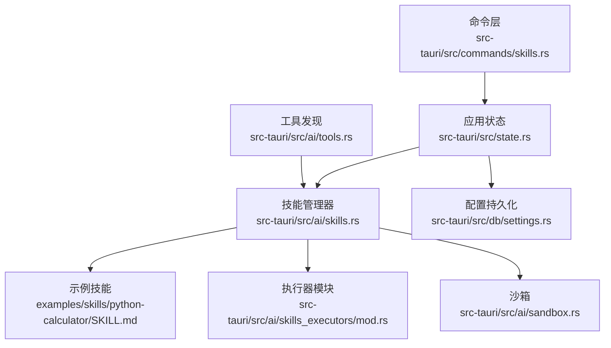
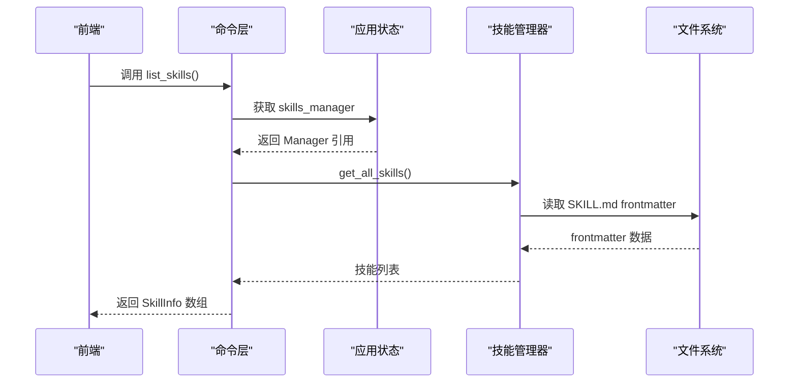
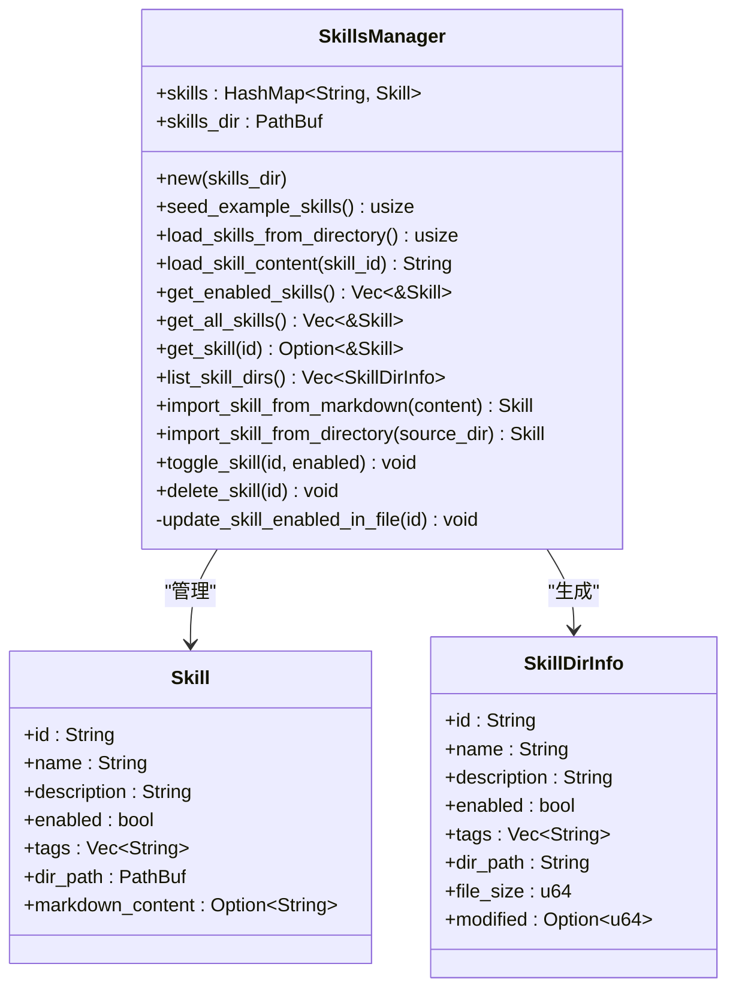
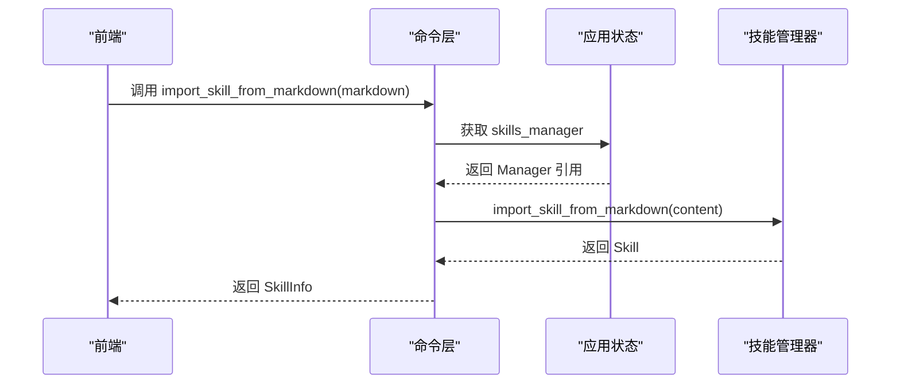
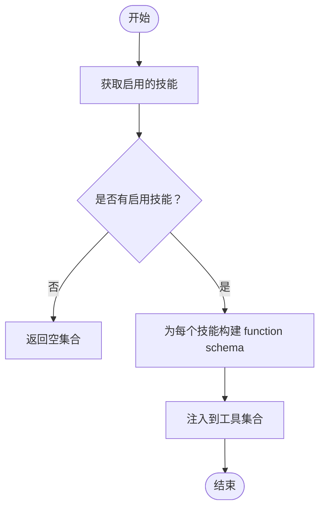
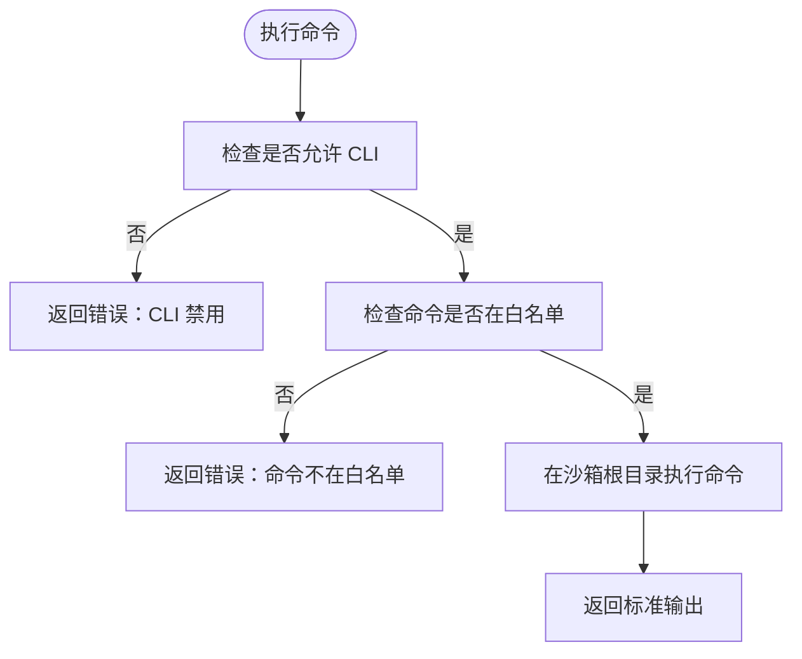
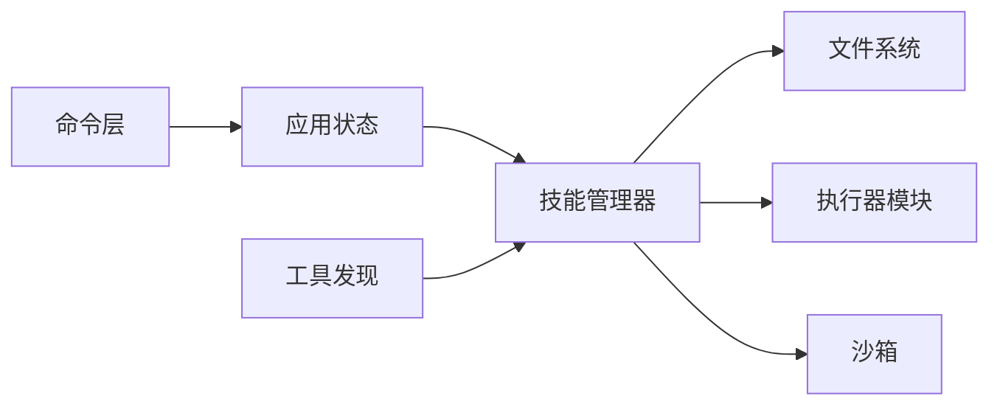

# 技能管理命令

<cite>
**本文引用的文件**
- [skills.rs](file://src-tauri/src/ai/skills.rs)
- [skills.rs](file://src-tauri/src/commands/skills.rs)
- [state.rs](file://src-tauri/src/state.rs)
- [tools.rs](file://src-tauri/src/ai/tools.rs)
- [sandbox.rs](file://src-tauri/src/ai/sandbox.rs)
- [settings.rs](file://src-tauri/src/db/settings.rs)
- [mod.rs](file://src-tauri/src/ai/skills_executors/mod.rs)
- [SKILL.md](file://examples/skills/python-calculator/SKILL.md)
</cite>

## 目录
1. [简介](#简介)
2. [项目结构](#项目结构)
3. [核心组件](#核心组件)
4. [架构总览](#架构总览)
5. [详细组件分析](#详细组件分析)
6. [依赖分析](#依赖分析)
7. [性能考虑](#性能考虑)
8. [故障排查指南](#故障排查指南)
9. [结论](#结论)
10. [附录](#附录)

## 简介
本文件面向 CoSurf 技能管理命令的 API 文档，聚焦于 src-tauri 中的技能系统与命令层，涵盖以下能力：
- 技能安装：从 Markdown 文本导入、从目录导入
- 技能卸载：删除技能目录
- 启用/禁用：切换技能开关，并持久化到 SKILL.md frontmatter
- 更新：种子示例技能、目录迁移与同步
- 测试：单元与集成测试建议
- 元数据结构：Skill、SkillMetadata、SkillDirInfo
- 依赖关系：与数据库配置、MCP 工具、内置工具的集成
- 执行环境配置：技能目录、API Key、沙箱
- 权限控制：目录权限建议、命令白名单
- 沙箱隔离机制：CLI 命令白名单、资源限制思路
- 工具发现机制：动态加载 SKILL.md、懒加载内容
- 动态加载策略：渐进式加载、延迟解析
- 调试与日志：命令日志、错误追踪
- 性能监控：缓存、并发限流、超时控制（规划）

## 项目结构
技能管理相关代码主要分布在以下模块：
- 后端命令层：src-tauri/src/commands/skills.rs
- 技能管理器：src-tauri/src/ai/skills.rs
- 应用状态：src-tauri/src/state.rs
- 工具发现与注册：src-tauri/src/ai/tools.rs
- 沙箱：src-tauri/src/ai/sandbox.rs
- 配置持久化：src-tauri/src/db/settings.rs
- 执行器模块：src-tauri/src/ai/skills_executors/mod.rs
- 示例技能：examples/skills/python-calculator/SKILL.md

**图表来源**
- [skills.rs:1-152](file://src-tauri/src/commands/skills.rs#L1-L152)
- [skills.rs:85-88](file://src-tauri/src/ai/skills.rs#L85-L88)
- [state.rs:9-23](file://src-tauri/src/state.rs#L9-L23)
- [tools.rs:210-272](file://src-tauri/src/ai/tools.rs#L210-L272)
- [sandbox.rs:1-251](file://src-tauri/src/ai/sandbox.rs#L1-L251)
- [settings.rs:341-378](file://src-tauri/src/db/settings.rs#L341-L378)
- [mod.rs:1-6](file://src-tauri/src/ai/skills_executors/mod.rs#L1-L6)
- [SKILL.md:1-39](file://examples/skills/python-calculator/SKILL.md#L1-L39)

**章节来源**
- [skills.rs:1-152](file://src-tauri/src/commands/skills.rs#L1-L152)
- [skills.rs:85-88](file://src-tauri/src/ai/skills.rs#L85-L88)
- [state.rs:9-23](file://src-tauri/src/state.rs#L9-L23)
- [tools.rs:210-272](file://src-tauri/src/ai/tools.rs#L210-L272)
- [sandbox.rs:1-251](file://src-tauri/src/ai/sandbox.rs#L1-L251)
- [settings.rs:341-378](file://src-tauri/src/db/settings.rs#L341-L378)
- [mod.rs:1-6](file://src-tauri/src/ai/skills_executors/mod.rs#L1-L6)
- [SKILL.md:1-39](file://examples/skills/python-calculator/SKILL.md#L1-L39)

## 核心组件
- 技能管理器（SkillsManager）：负责技能目录扫描、frontmatter 解析、懒加载、导入/导出、启用/禁用、删除、目录迁移与示例同步。
- 技能数据结构：
  - Skill：技能元数据与路径，初始不加载正文内容。
  - SkillMetadata：从 SKILL.md frontmatter 解析的元数据。
  - SkillDirInfo：用于前端展示的目录信息。
- 命令层（Tauri Commands）：提供 list_skills、delete_skill、toggle_skill、import_skill_from_markdown、import_skill_from_directory、list_skill_files、get_skill_content 等 API。
- 应用状态（AppState）：持有 SkillsManager，初始化时从数据库读取技能目录，同步示例技能并加载已有技能。
- 工具发现（Tools）：根据启用的技能生成工具 schema，采用渐进式加载策略。
- 沙箱（Sandbox）：提供受限 CLI 命令执行与数据存储能力。

**章节来源**
- [skills.rs:24-88](file://src-tauri/src/ai/skills.rs#L24-L88)
- [skills.rs:10-33](file://src-tauri/src/commands/skills.rs#L10-L33)
- [state.rs:25-80](file://src-tauri/src/state.rs#L25-L80)
- [tools.rs:227-272](file://src-tauri/src/ai/tools.rs#L227-L272)
- [sandbox.rs:12-51](file://src-tauri/src/ai/sandbox.rs#L12-L51)

## 架构总览
技能系统采用“渐进式加载”与“动态工具发现”的架构：
- 初始化阶段：仅解析 SKILL.md frontmatter，不加载正文。
- 使用阶段：当模型调用 skill_{id} 时，再懒加载完整 SKILL.md 作为工具结果返回。
- 工具注册：将启用的技能以 function schema 形式注入到工具集合，供 Agent Loop 使用。

**图表来源**
- [skills.rs:42-58](file://src-tauri/src/commands/skills.rs#L42-L58)
- [skills.rs:281-289](file://src-tauri/src/ai/skills.rs#L281-L289)
- [state.rs:16-17](file://src-tauri/src/state.rs#L16-L17)

**章节来源**
- [skills.rs:42-58](file://src-tauri/src/commands/skills.rs#L42-L58)
- [skills.rs:281-289](file://src-tauri/src/ai/skills.rs#L281-L289)
- [state.rs:16-17](file://src-tauri/src/state.rs#L16-L17)

## 详细组件分析

### 技能管理器（SkillsManager）
职责与关键方法：
- 初始化与目录设置：new、get_skills_dir、seed_example_skills、load_skills_from_directory
- 导入与导出：import_skill_from_markdown、import_skill_from_directory
- 启用/禁用：toggle_skill（同时更新 SKILL.md frontmatter）
- 删除：delete_skill（删除目录）
- 查询与展示：get_enabled_skills、get_all_skills、get_skill、list_skill_dirs
- 懒加载：load_skill_content（按需读取 SKILL.md 正文）

**图表来源**
- [skills.rs:85-88](file://src-tauri/src/ai/skills.rs#L85-L88)
- [skills.rs:24-45](file://src-tauri/src/ai/skills.rs#L24-L45)
- [skills.rs:62-82](file://src-tauri/src/ai/skills.rs#L62-L82)

**章节来源**
- [skills.rs:85-517](file://src-tauri/src/ai/skills.rs#L85-L517)

### 命令层（Tauri Commands）
提供的 API：
- list_skills：列出所有技能（SkillInfo）
- delete_skill：删除指定技能
- toggle_skill：启用/禁用技能
- import_skill_from_markdown：从 Markdown 文本导入技能
- import_skill_from_directory：从目录导入技能
- list_skill_files：列出技能目录或某技能下文件
- get_skill_content：懒加载并返回 SKILL.md 完整内容

**图表来源**
- [skills.rs:92-107](file://src-tauri/src/commands/skills.rs#L92-L107)
- [skills.rs:412-447](file://src-tauri/src/ai/skills.rs#L412-L447)

**章节来源**
- [skills.rs:42-152](file://src-tauri/src/commands/skills.rs#L42-L152)

### 工具发现与动态加载
- 渐进式加载：仅在模型调用 skill_{id} 时才懒加载 SKILL.md 正文。
- 动态工具注册：get_skills_tool_schemas_async 将启用的技能转为 function schema 注入工具集合。
- 与 MCP 工具共存：get_available_tools_schemas_async 同时聚合内置工具、技能工具与 MCP 工具。

**图表来源**
- [tools.rs:227-272](file://src-tauri/src/ai/tools.rs#L227-L272)

**章节来源**
- [tools.rs:227-272](file://src-tauri/src/ai/tools.rs#L227-L272)

### 沙箱与安全策略
- 沙箱配置：SandboxConfig 提供 root_dir 与命令白名单。
- 受限 CLI 执行：Sandbox.execute_command 仅允许白名单命令，且在沙箱根目录执行。
- 数据存储：沙箱内提供网页、摘要、记忆等数据的保存与清理能力。

**图表来源**
- [sandbox.rs:215-244](file://src-tauri/src/ai/sandbox.rs#L215-L244)

**章节来源**
- [sandbox.rs:12-51](file://src-tauri/src/ai/sandbox.rs#L12-L51)
- [sandbox.rs:215-244](file://src-tauri/src/ai/sandbox.rs#L215-L244)

### 配置与权限控制
- 技能目录持久化：通过数据库键 "skills.directory" 读写技能根目录。
- 默认目录：用户主目录下的 ~/.cosurf/skills。
- 权限建议：对技能目录设置严格的访问权限，防止未授权修改。
- API Key 管理：支持 IQS API Key 的持久化与环境变量替换（MCP 执行器）。

**章节来源**
- [settings.rs:341-378](file://src-tauri/src/db/settings.rs#L341-L378)
- [SKILLS_PERSISTENCE.md:342-351](file://docs/SKILLS_PERSISTENCE.md#L342-L351)

### 示例技能与元数据
示例技能 SKILL.md 展示了 frontmatter 的典型字段：name、description、tags；正文部分描述技能使用方式与注意事项。

**章节来源**
- [SKILL.md:1-39](file://examples/skills/python-calculator/SKILL.md#L1-L39)

## 依赖分析
- 命令层依赖应用状态（AppState）中的 SkillsManager。
- SkillsManager 依赖文件系统进行目录扫描与 SKILL.md 读写。
- 工具发现依赖 SkillsManager 的启用技能列表。
- 沙箱与执行器模块为可扩展点，当前保留 MCP 客户端与命令工具。

**图表来源**
- [skills.rs:3-8](file://src-tauri/src/commands/skills.rs#L3-L8)
- [state.rs:16-17](file://src-tauri/src/state.rs#L16-L17)
- [tools.rs:227-272](file://src-tauri/src/ai/tools.rs#L227-L272)
- [mod.rs:1-6](file://src-tauri/src/ai/skills_executors/mod.rs#L1-L6)

**章节来源**
- [skills.rs:3-8](file://src-tauri/src/commands/skills.rs#L3-L8)
- [state.rs:16-17](file://src-tauri/src/state.rs#L16-L17)
- [tools.rs:227-272](file://src-tauri/src/ai/tools.rs#L227-L272)
- [mod.rs:1-6](file://src-tauri/src/ai/skills_executors/mod.rs#L1-L6)

## 性能考虑
- 懒加载策略：仅在需要时读取 SKILL.md 正文，减少初始加载开销。
- 渐进式工具注册：仅暴露 description，避免一次性解析全部技能正文。
- 缓存与并发控制：文档建议引入缓存与并发限流（待实现）。
- 超时控制：脚本执行器支持超时参数（参考脚本执行器文档）。

[本节为通用指导，无需特定文件来源]

## 故障排查指南
常见问题与定位要点：
- 技能目录不可读/权限不足：检查数据库中 "skills.directory" 的值与目录权限。
- SKILL.md 格式错误：frontmatter 必须以 "---" 开头与结尾，否则解析失败。
- 导入失败：确认源目录包含 SKILL.md，且目标目录可写。
- 启用状态未持久化：toggle_skill 会更新 SKILL.md frontmatter 的 enabled 字段，若失败请检查文件写权限。

**章节来源**
- [skills.rs:478-510](file://src-tauri/src/ai/skills.rs#L478-L510)
- [settings.rs:341-378](file://src-tauri/src/db/settings.rs#L341-L378)

## 结论
CoSurf 的技能管理命令围绕“渐进式加载 + 动态工具发现”展开，既保证了启动性能，又提供了灵活的技能扩展能力。通过 Tauri 命令层与 SkillsManager 的协作，实现了从导入、启用、执行到卸载的完整生命周期管理。配合沙箱与配置持久化，系统在安全性与可维护性方面具备良好基础。

[本节为总结，无需特定文件来源]

## 附录

### API 定义与调用示例（路径引用）
- 列出技能
  - 路径：[list_skills:42-58](file://src-tauri/src/commands/skills.rs#L42-L58)
  - 调用方：前端通过 Tauri invoke 调用
- 删除技能
  - 路径：[delete_skill:60-74](file://src-tauri/src/commands/skills.rs#L60-L74)
- 启用/禁用
  - 路径：[toggle_skill:76-90](file://src-tauri/src/commands/skills.rs#L76-L90)
- 从 Markdown 导入
  - 路径：[import_skill_from_markdown:92-107](file://src-tauri/src/commands/skills.rs#L92-L107)
- 从目录导入
  - 路径：[import_skill_from_directory:109-124](file://src-tauri/src/commands/skills.rs#L109-L124)
- 列出技能目录/文件
  - 路径：[list_skill_files:126-137](file://src-tauri/src/commands/skills.rs#L126-L137)
- 获取技能内容
  - 路径：[get_skill_content:139-151](file://src-tauri/src/commands/skills.rs#L139-L151)

### 元数据结构与字段说明
- Skill
  - id、name、description、enabled、tags、dir_path、markdown_content
  - 路径：[Skill 定义:24-45](file://src-tauri/src/ai/skills.rs#L24-L45)
- SkillMetadata
  - name、description、enabled、tags
  - 路径：[SkillMetadata:51-60](file://src-tauri/src/ai/skills.rs#L51-L60)
- SkillDirInfo
  - id、name、description、enabled、tags、dir_path、file_size、modified
  - 路径：[SkillDirInfo:62-82](file://src-tauri/src/ai/skills.rs#L62-L82)

### 执行环境与安全
- 技能目录：通过数据库键 "skills.directory" 管理
  - 路径：[get_skills_directory:341-359](file://src-tauri/src/db/settings.rs#L341-L359)、[set_skills_directory:361-364](file://src-tauri/src/db/settings.rs#L361-L364)
- 沙箱命令白名单：默认允许 ls、cat、echo、pwd、find
  - 路径：[SandboxConfig:23-46](file://src-tauri/src/ai/sandbox.rs#L23-L46)
- API Key 管理：支持环境变量替换（MCP 执行器）
  - 路径：[MCP 执行器 API Key 处理:154-176](file://docs/SKILLS_PERSISTENCE.md#L154-L176)

### 测试建议（路径引用）
- 单元测试
  - 路径：[单元测试示例:333-356](file://docs/SKILLS_REFACTORING.md#L333-L356)
- 集成测试
  - 路径：[集成测试示例:360-378](file://docs/SKILLS_REFACTORING.md#L360-L378)