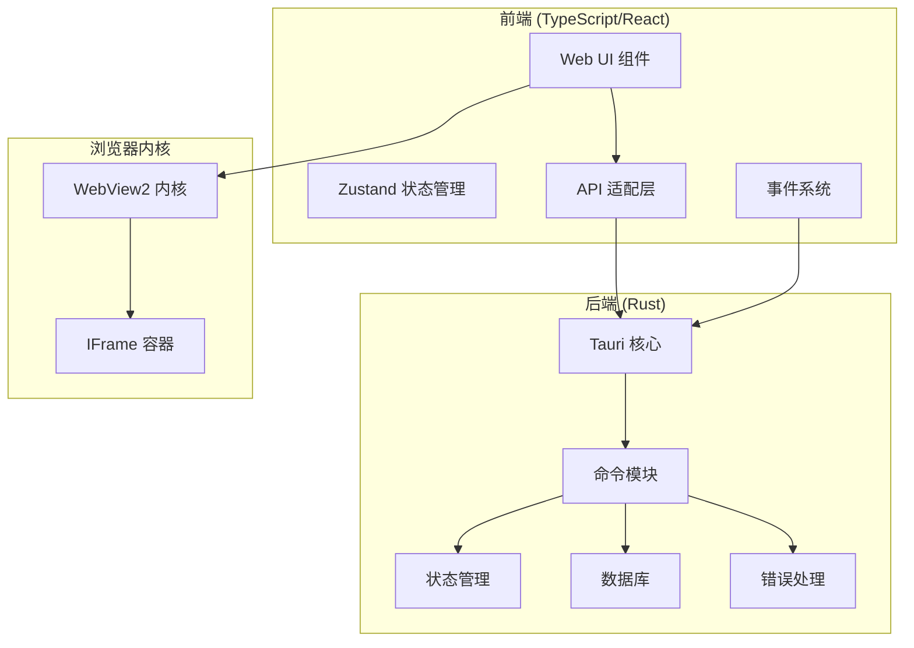
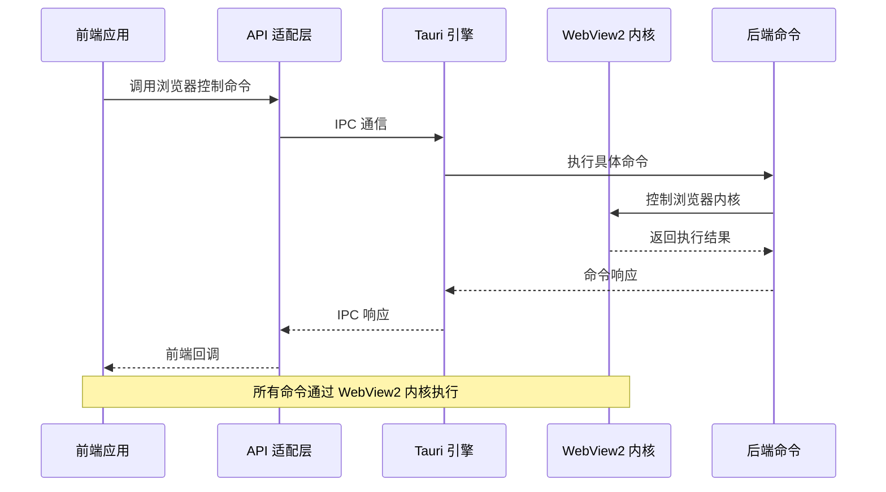
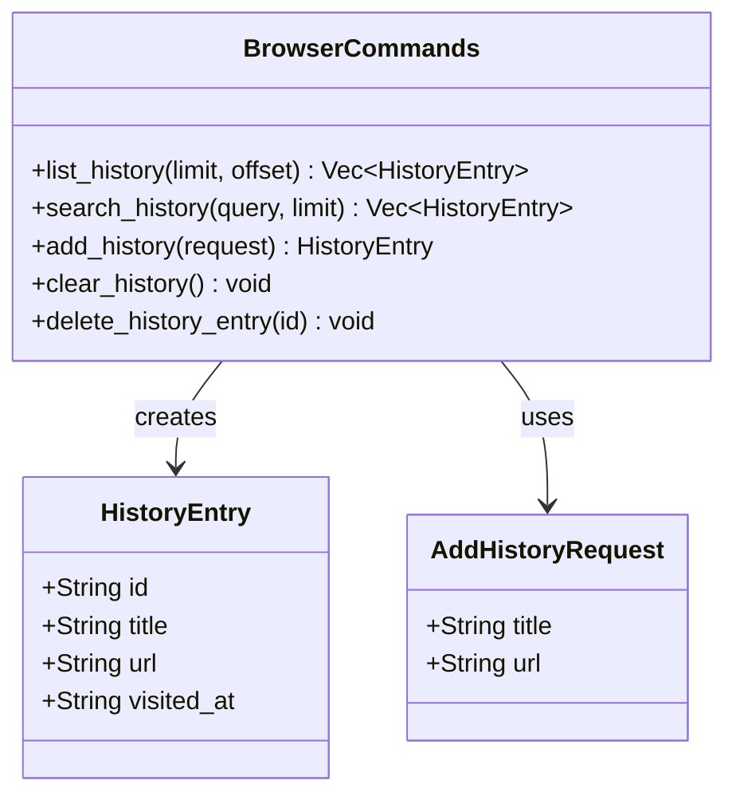
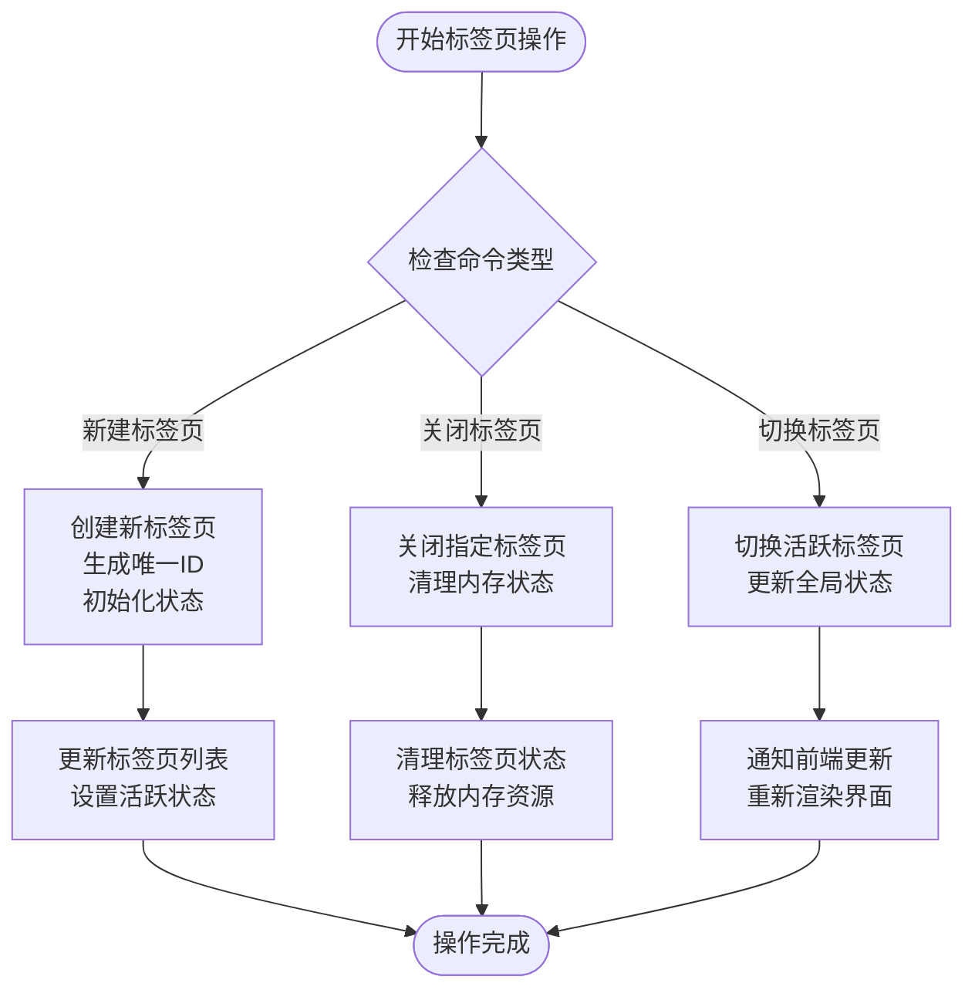
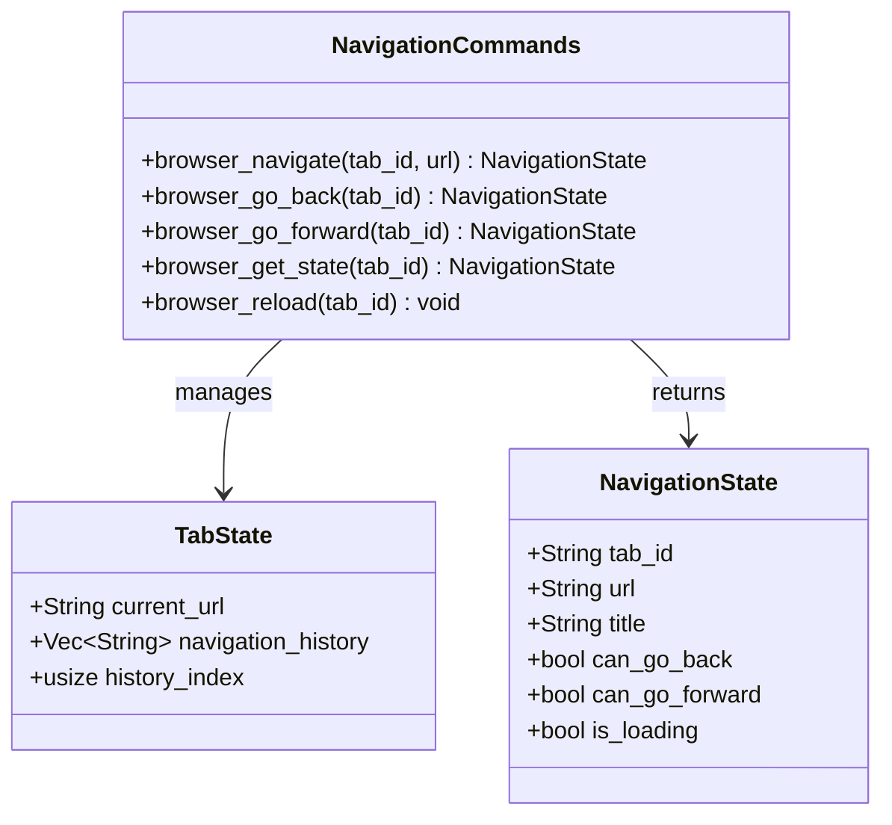
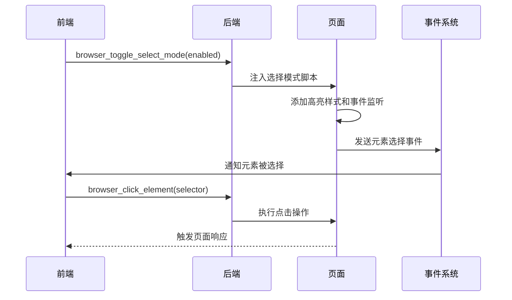
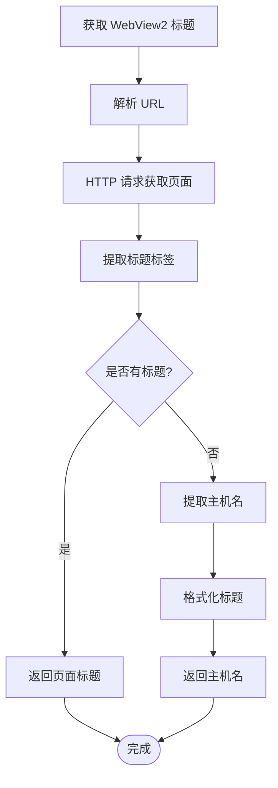
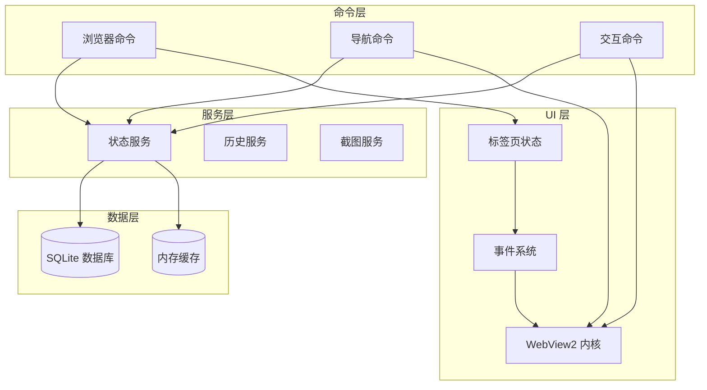
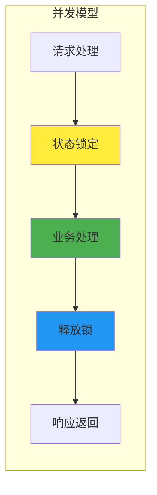
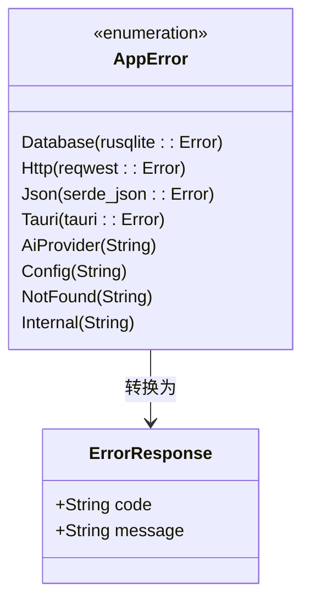

# 浏览器控制命令

<cite>
**本文档引用的文件**
- [browser.rs](file://src-tauri/src/commands/browser.rs)
- [browser_nav.rs](file://src-tauri/src/commands/browser_nav.rs)
- [lib.rs](file://src-tauri/src/lib.rs)
- [error.rs](file://src-tauri/src/error.rs)
- [state.rs](file://src-tauri/src/state.rs)
- [history.rs](file://src-tauri/src/db/history.rs)
- [screenshot.rs](file://src-tauri/src/commands/screenshot.rs)
- [WebView2Container.tsx](file://src-web/src/components/layout/WebView2Container.tsx)
- [WebContentView.tsx](file://src-web/src/components/layout/WebContentView.tsx)
- [api.ts](file://src-web/src/lib/api.ts)
- [events.ts](file://src-web/src/lib/events.ts)
- [tabStore.ts](file://src-web/src/stores/tabStore.ts)
- [browserEngine.ts](file://src-web/src/lib/browserEngine.ts)
</cite>

## 目录
1. [简介](#简介)
2. [项目结构](#项目结构)
3. [核心组件](#核心组件)
4. [架构概览](#架构概览)
5. [详细组件分析](#详细组件分析)
6. [依赖关系分析](#依赖关系分析)
7. [性能考虑](#性能考虑)
8. [故障排除指南](#故障排除指南)
9. [结论](#结论)

## 简介

CoSurf 是一个基于 Tauri 框架构建的 AI 驱动的浏览器应用，提供了完整的浏览器控制命令系统。本文档详细介绍了浏览器控制命令的 API 接口，包括基础浏览器操作、导航控制、页面交互、状态查询和截图功能。

该项目采用现代化的架构设计，使用 Rust 作为后端引擎，TypeScript/React 作为前端界面，通过 Electron IPC 实现前后端通信。浏览器内核采用 WebView2 技术，支持多标签页管理和智能页面交互。

## 项目结构

CoSurf 项目采用模块化的组织结构，主要分为以下几个核心部分：

**图表来源**
- [lib.rs:108-214](file://src-tauri/src/lib.rs#L108-L214)
- [WebView2Container.tsx:1-13](file://src-web/src/components/layout/WebView2Container.tsx#L1-L13)

**章节来源**
- [lib.rs:1-258](file://src-tauri/src/lib.rs#L1-L258)

## 核心组件

CoSurf 的浏览器控制命令系统由以下核心组件构成：

### 1. 浏览器基础命令模块
- **历史管理**: 列表、搜索、添加、清空、删除历史记录
- **标签页管理**: 新建、关闭、切换标签页
- **页面状态**: 获取页面信息、状态查询

### 2. 导航控制模块
- **基础导航**: 跳转到指定 URL、刷新页面
- **历史导航**: 后退、前进操作
- **状态查询**: 获取当前导航状态

### 3. 高级交互模块
- **JavaScript 执行**: 在页面中执行自定义脚本
- **页面内容提取**: 获取页面文本内容用于 AI 上下文
- **截图功能**: 全屏截图、区域截图
- **元素交互**: 点击元素、输入文本、滚动页面

### 4. 状态管理系统
- **全局状态**: 应用程序状态、活跃标签页
- **标签页状态**: 导航历史、加载状态
- **页面内容缓存**: AI 上下文内容缓存

**章节来源**
- [browser.rs:1-64](file://src-tauri/src/commands/browser.rs#L1-L64)
- [browser_nav.rs:1-532](file://src-tauri/src/commands/browser_nav.rs#L1-L532)
- [state.rs:1-81](file://src-tauri/src/state.rs#L1-L81)

## 架构概览

CoSurf 采用了分层架构设计，实现了前后端的清晰分离：

**图表来源**
- [api.ts:13-19](file://src-web/src/lib/api.ts#L13-L19)
- [lib.rs:108-214](file://src-tauri/src/lib.rs#L108-L214)

### WebView2 内核交互

CoSurf 使用 WebView2 作为浏览器内核，通过以下方式实现与内核的交互：

1. **IFrame 容器**: 使用 IFrame 实现多标签页管理
2. **事件驱动**: 通过事件系统实现前后端通信
3. **脚本注入**: 支持在页面中执行自定义 JavaScript
4. **权限控制**: 严格控制页面访问外部资源的能力

**章节来源**
- [WebContentView.tsx:1-800](file://src-web/src/components/layout/WebContentView.tsx#L1-L800)
- [WebView2Container.tsx:1-13](file://src-web/src/components/layout/WebView2Container.tsx#L1-L13)

## 详细组件分析

### 浏览器基础命令

#### 历史记录管理

**图表来源**
- [browser.rs:7-64](file://src-tauri/src/commands/browser.rs#L7-L64)
- [history.rs:7-21](file://src-tauri/src/db/history.rs#L7-L21)

##### 历史记录列表
- **参数**: `limit`(可选)、`offset`(可选)
- **返回值**: 历史记录数组，按访问时间倒序排列
- **用途**: 分页显示浏览历史

##### 历史记录搜索
- **参数**: `query`(必需)、`limit`(可选)
- **返回值**: 匹配的历史记录数组
- **搜索范围**: 标题和 URL

##### 添加历史记录
- **参数**: `AddHistoryRequest` 对象
- **返回值**: 新创建的历史记录
- **特性**: URL 去重，自动添加访问时间

**章节来源**
- [browser.rs:8-64](file://src-tauri/src/commands/browser.rs#L8-L64)
- [history.rs:24-103](file://src-tauri/src/db/history.rs#L24-L103)

#### 标签页管理

虽然标签页管理命令在当前代码中未完全实现，但架构设计已预留相应接口：

**图表来源**
- [browser_nav.rs:209-219](file://src-tauri/src/commands/browser_nav.rs#L209-L219)
- [tabStore.ts:74-129](file://src-web/src/stores/tabStore.ts#L74-L129)

### 导航控制命令

#### 导航状态管理

**图表来源**
- [browser_nav.rs:14-30](file://src-tauri/src/commands/browser_nav.rs#L14-L30)
- [browser_nav.rs:32-206](file://src-tauri/src/commands/browser_nav.rs#L32-L206)

##### 导航到指定 URL
- **参数**: `tab_id`(必需)、`url`(必需)
- **返回值**: `NavigationState` 对象
- **功能**: 更新导航历史，通知前端加载新页面

##### 后退操作
- **参数**: `tab_id`(必需)
- **返回值**: `NavigationState` 对象
- **限制**: 仅当历史索引大于 0 时可用

##### 前进操作
- **参数**: `tab_id`(必需)
- **返回值**: `NavigationState` 对象
- **限制**: 仅当历史索引小于历史长度-1 时可用

##### 获取当前状态
- **参数**: `tab_id`(必需)
- **返回值**: `NavigationState` 对象
- **用途**: 前端状态同步和 UI 更新

**章节来源**
- [browser_nav.rs:32-206](file://src-tauri/src/commands/browser_nav.rs#L32-L206)

#### 页面交互命令

##### 执行 JavaScript
- **参数**: `tab_id`(必需)、`script`(必需)
- **返回值**: 空字符串
- **用途**: 在页面中执行自定义脚本

##### 获取页面内容
- **参数**: `tab_id`(必需)
- **返回值**: 空字符串
- **功能**: 提取页面文本内容用于 AI 上下文

##### 截图功能
- **参数**: `tab_id`(必需)、`full_page`(必需)
- **返回值**: Base64 编码的图片数据
- **状态**: 待实现

**章节来源**
- [browser_nav.rs:222-277](file://src-tauri/src/commands/browser_nav.rs#L222-L277)

### 高级交互命令

#### 元素选择模式

**图表来源**
- [browser_nav.rs:280-364](file://src-tauri/src/commands/browser_nav.rs#L280-L364)
- [WebContentView.tsx:744-756](file://src-web/src/components/layout/WebContentView.tsx#L744-L756)

##### 切换元素选择模式
- **参数**: `tab_id`(必需)、`enabled`(必需)
- **功能**: 启用/禁用元素选择模式，高亮可点击元素

##### 点击元素
- **参数**: `tab_id`(必需)、`selector`(必需)
- **功能**: 通过 CSS 选择器定位并点击元素

##### 输入文本
- **参数**: `tab_id`(必需)、`selector`(必需)、`text`(必需)
- **功能**: 在指定输入框中输入文本并触发相关事件

##### 滚动页面
- **参数**: `tab_id`(必需)、`direction`(必需)
- **支持方向**: up、down、left、right
- **功能**: 平滑滚动页面到指定方向

**章节来源**
- [browser_nav.rs:367-461](file://src-tauri/src/commands/browser_nav.rs#L367-L461)

### 状态查询命令

#### WebView2 窗口标题获取

**图表来源**
- [browser_nav.rs:476-531](file://src-tauri/src/commands/browser_nav.rs#L476-L531)

##### 获取 WebView2 标题
- **参数**: `tab_id`(必需)、`url`(必需)
- **流程**: HTTP 请求获取页面内容 → 解析 `<title>` 标签 → 提取主机名作为后备
- **返回值**: 页面标题或主机名

**章节来源**
- [browser_nav.rs:476-531](file://src-tauri/src/commands/browser_nav.rs#L476-L531)

## 依赖关系分析

CoSurf 的浏览器控制命令系统具有清晰的依赖关系：

**图表来源**
- [lib.rs:108-214](file://src-tauri/src/lib.rs#L108-L214)
- [state.rs:9-23](file://src-tauri/src/state.rs#L9-L23)

### 核心依赖关系

1. **命令注册**: 所有命令在 `lib.rs` 中统一注册
2. **状态管理**: `AppState` 提供全局状态访问
3. **数据库访问**: 历史记录通过 `Database` 操作
4. **事件通信**: 前后端通过事件系统通信

**章节来源**
- [lib.rs:108-214](file://src-tauri/src/lib.rs#L108-L214)
- [state.rs:9-23](file://src-tauri/src/state.rs#L9-L23)

## 性能考虑

### 内存管理

CoSurf 采用了多项性能优化策略：

1. **懒加载**: 标签页状态使用 `lazy_static` 懒加载
2. **内存池**: 使用 `Mutex` 管理共享状态
3. **缓存策略**: 页面内容通过 `Arc<Mutex<...>>` 缓存

### 并发处理

**图表来源**
- [browser_nav.rs:41-63](file://src-tauri/src/commands/browser_nav.rs#L41-L63)

### 性能优化建议

1. **批量操作**: 对于频繁的标签页操作，考虑批量处理
2. **异步处理**: 所有网络请求使用异步处理
3. **资源清理**: 及时清理不再使用的标签页状态
4. **缓存策略**: 合理使用内存缓存减少重复计算

## 故障排除指南

### 常见错误类型

**图表来源**
- [error.rs:4-39](file://src-tauri/src/error.rs#L4-L39)

### 错误处理机制

1. **数据库错误**: 处理 SQLite 操作异常
2. **HTTP 错误**: 处理网络请求失败
3. **JSON 错误**: 处理序列化/反序列化异常
4. **内部错误**: 处理系统级异常

### 调试技巧

1. **日志记录**: 使用 `tracing` crate 记录详细日志
2. **状态监控**: 通过 `AppState` 监控应用程序状态
3. **事件追踪**: 使用事件系统追踪用户操作
4. **性能分析**: 监控内存使用和 CPU 占用

**章节来源**
- [error.rs:1-64](file://src-tauri/src/error.rs#L1-L64)

## 结论

CoSurf 的浏览器控制命令系统提供了完整而强大的浏览器自动化能力。通过精心设计的架构，系统实现了前后端的高效协作，支持复杂的页面交互和状态管理。

### 主要优势

1. **模块化设计**: 清晰的功能模块划分，便于维护和扩展
2. **异步处理**: 充分利用 Rust 的异步特性，提升性能
3. **错误处理**: 完善的错误处理机制，保证系统稳定性
4. **状态管理**: 有效的状态管理策略，支持复杂的应用场景

### 未来发展方向

1. **截图功能完善**: 实现完整的截图功能，支持多种格式
2. **性能优化**: 进一步优化内存使用和渲染性能
3. **扩展性增强**: 提供更灵活的插件机制
4. **用户体验**: 持续改进用户界面和交互体验

通过本文档的详细介绍，开发者可以充分理解和使用 CoSurf 的浏览器控制命令系统，为构建更强大的 AI 驱动浏览器应用奠定坚实基础。