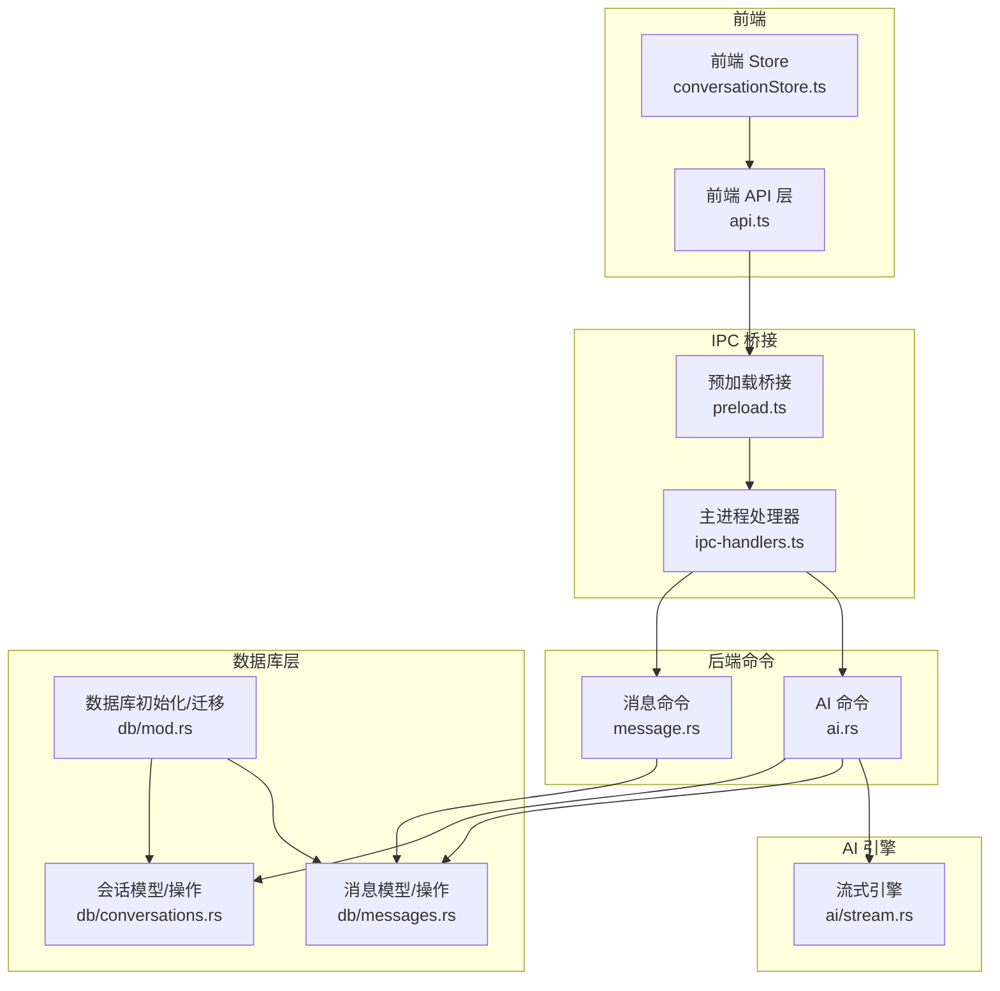
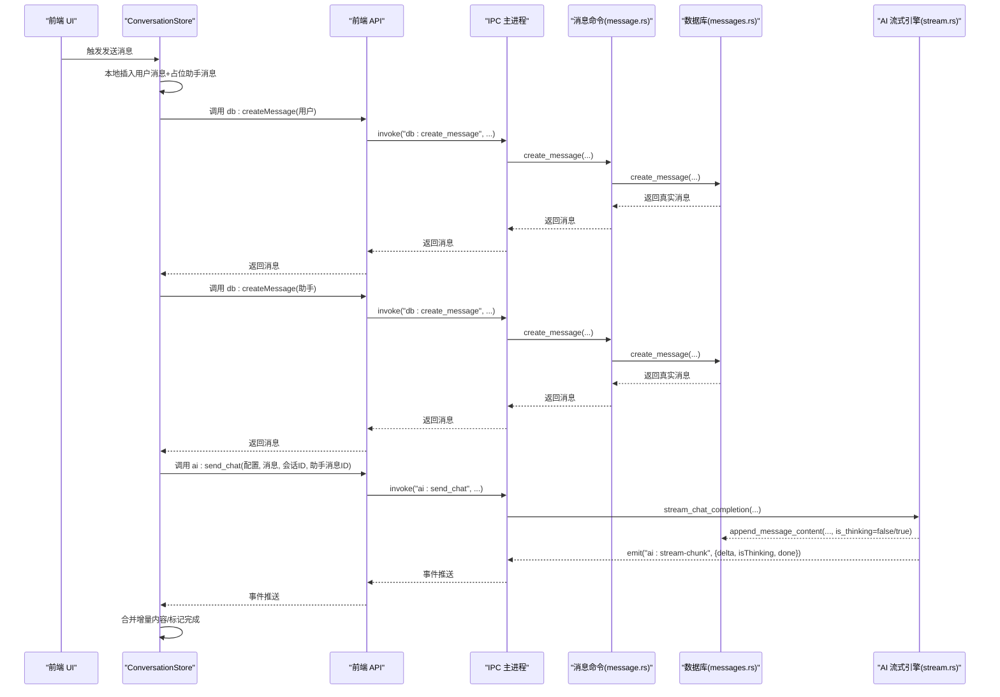
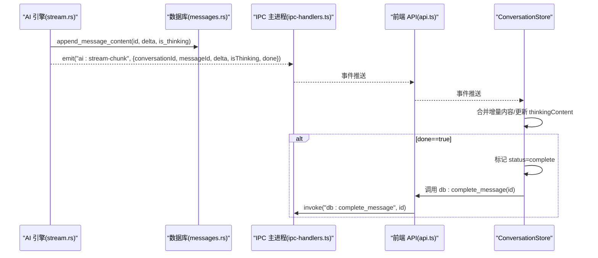
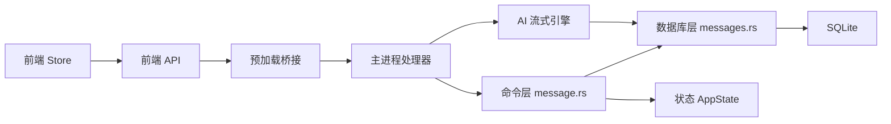
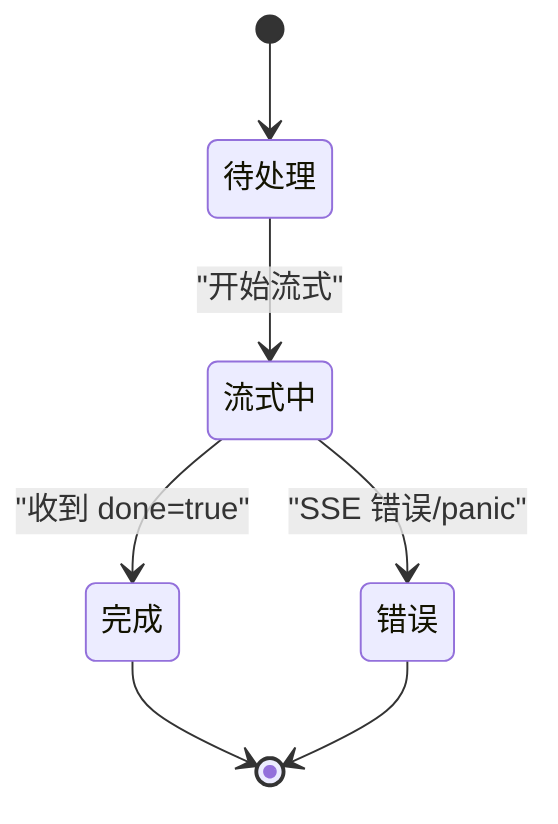

# 消息处理命令

<cite>
**本文引用的文件**
- [message.rs](file://src-tauri/src/commands/message.rs)
- [messages.rs](file://src-tauri/src/db/messages.rs)
- [conversations.rs](file://src-tauri/src/db/conversations.rs)
- [mod.rs（数据库）](file://src-tauri/src/db/mod.rs)
- [error.rs](file://src-tauri/src/error.rs)
- [state.rs](file://src-tauri/src/state.rs)
- [stream.rs](file://src-tauri/src/ai/stream.rs)
- [message.ts](file://packages/shared/src/message.ts)
- [api.ts](file://src-web/src/lib/api.ts)
- [conversationStore.ts](file://src-web/src/stores/conversationStore.ts)
- [ai.rs](file://src-tauri/src/commands/ai.rs)
- [preload.ts](file://electron/preload.ts)
- [ipc-handlers.ts](file://electron/ipc-handlers.ts)
</cite>

## 目录
1. [简介](#简介)
2. [项目结构](#项目结构)
3. [核心组件](#核心组件)
4. [架构总览](#架构总览)
5. [详细组件分析](#详细组件分析)
6. [依赖分析](#依赖分析)
7. [性能考虑](#性能考虑)
8. [故障排查指南](#故障排查指南)
9. [结论](#结论)
10. [附录](#附录)

## 简介
本文件面向 CoSurf 的消息处理命令，围绕 Rust 后端的命令模块与数据库层，结合前端 Store 与事件通道，系统性梳理消息的发送、列表获取、内容更新、删除、流式传输、实时更新、错误重试、状态管理、并发控制与数据一致性保障等技术实现。文档同时给出消息数据结构、字段定义与验证规则，以及完整 API 调用示例与流程图。

## 项目结构
消息处理涉及以下关键层次：
- 前端 Store 与 API 层：负责 UI 状态、事件监听、消息持久化触发与流式增量更新
- IPC 层：Electron 预加载桥接与主进程处理器，转发消息命令与流式事件
- 命令层（Rust）：暴露 Tauri 命令，协调数据库访问与状态变更
- 数据库层（Rust）：消息与会话的 CRUD、流式内容追加、完成标记、反馈设置
- AI 流式引擎：SSE 推送、工具调用、重复检测、错误处理与完成信号

图表来源
- [message.rs:1-99](file://src-tauri/src/commands/message.rs#L1-L99)
- [messages.rs:1-198](file://src-tauri/src/db/messages.rs#L1-L198)
- [conversations.rs:1-127](file://src-tauri/src/db/conversations.rs#L1-L127)
- [mod.rs（数据库）:41-148](file://src-tauri/src/db/mod.rs#L41-L148)
- [stream.rs:77-283](file://src-tauri/src/ai/stream.rs#L77-L283)
- [api.ts:74-98](file://src-web/src/lib/api.ts#L74-L98)
- [conversationStore.ts:103-197](file://src-web/src/stores/conversationStore.ts#L103-L197)
- [preload.ts:42-46](file://electron/preload.ts#L42-L46)
- [ipc-handlers.ts:251-315](file://electron/ipc-handlers.ts#L251-L315)

章节来源
- [message.rs:1-99](file://src-tauri/src/commands/message.rs#L1-L99)
- [messages.rs:1-198](file://src-tauri/src/db/messages.rs#L1-L198)
- [conversations.rs:1-127](file://src-tauri/src/db/conversations.rs#L1-L127)
- [mod.rs（数据库）:41-148](file://src-tauri/src/db/mod.rs#L41-L148)
- [stream.rs:77-283](file://src-tauri/src/ai/stream.rs#L77-L283)
- [api.ts:74-98](file://src-web/src/lib/api.ts#L74-L98)
- [conversationStore.ts:103-197](file://src-web/src/stores/conversationStore.ts#L103-L197)
- [preload.ts:42-46](file://electron/preload.ts#L42-L46)
- [ipc-handlers.ts:251-315](file://electron/ipc-handlers.ts#L251-L315)

## 核心组件
- 消息命令（Rust）：提供 list_messages、get_message、create_message、update_message、delete_message、append_message_content、complete_message、set_message_feedback 等命令
- 消息模型与数据库操作：定义消息结构、附件、流式片段、以及 CRUD、追加内容、完成标记、反馈设置
- 会话模型与计数：维护会话与消息数量的关系，创建消息时自动递增
- 前端 API 与 Store：统一调用后端命令，监听流式事件，实时更新 UI
- IPC 桥接与主进程处理器：安全暴露命令通道，转发流式事件
- AI 流式引擎：SSE 推送、工具调用、重复检测、错误处理与完成信号

章节来源
- [message.rs:7-99](file://src-tauri/src/commands/message.rs#L7-L99)
- [messages.rs:22-198](file://src-tauri/src/db/messages.rs#L22-L198)
- [conversations.rs:7-127](file://src-tauri/src/db/conversations.rs#L7-L127)
- [api.ts:74-98](file://src-web/src/lib/api.ts#L74-L98)
- [conversationStore.ts:103-197](file://src-web/src/stores/conversationStore.ts#L103-L197)
- [preload.ts:42-46](file://electron/preload.ts#L42-L46)
- [ipc-handlers.ts:251-315](file://electron/ipc-handlers.ts#L251-L315)

## 架构总览
消息处理的端到端流程如下：
- 前端 Store 在发送消息前创建临时用户消息与占位助手消息，随后调用后端命令创建真实消息并启动 AI 流式生成
- 后端 AI 引擎通过 SSE 推送流式片段，同时将增量内容写入数据库
- 前端 Store 监听 ai:stream-chunk 事件，将增量内容合并到本地消息，完成后标记为 complete
- 支持停止生成、错误事件、工具调用开始/结果等扩展事件

图表来源
- [conversationStore.ts:103-197](file://src-web/src/stores/conversationStore.ts#L103-L197)
- [api.ts:254-271](file://src-web/src/lib/api.ts#L254-L271)
- [ipc-handlers.ts:251-315](file://electron/ipc-handlers.ts#L251-L315)
- [ai.rs:37-77](file://src-tauri/src/commands/ai.rs#L37-L77)
- [stream.rs:301-445](file://src-tauri/src/ai/stream.rs#L301-L445)
- [message.rs:26-35](file://src-tauri/src/commands/message.rs#L26-L35)
- [messages.rs:122-135](file://src-tauri/src/db/messages.rs#L122-L135)

## 详细组件分析

### 消息数据结构与字段定义
- 消息角色（role）：user、assistant、system
- 消息状态（status）：pending、streaming、complete、error
- 附件（attachments）：支持网页、选区、文件、图片等类型
- 思考内容（thinking_content）：独立于正文，用于展示推理过程
- 反馈（feedback）："" | "like" | "dislike"
- 时间戳（created_at、updated_at）：UTC RFC3339 字符串

章节来源
- [message.ts:1-35](file://packages/shared/src/message.ts#L1-L35)
- [messages.rs:22-36](file://src-tauri/src/db/messages.rs#L22-L36)

### 消息命令 API 定义
- 列表查询：list_messages(conversation_id) -> Vec<Message>
- 单条查询：get_message(id) -> Message
- 创建消息：create_message(CreateMessageRequest) -> Message
- 更新消息：update_message(id, UpdateMessageRequest) -> Message
- 删除消息：delete_message(id) -> ()
- 追加内容（流式）：append_message_content(id, content, is_thinking=false) -> ()
- 完成流式：complete_message(id) -> ()
- 设置反馈：set_message_feedback(id, feedback) -> Message

章节来源
- [message.rs:7-99](file://src-tauri/src/commands/message.rs#L7-L99)
- [messages.rs:38-53](file://src-tauri/src/db/messages.rs#L38-L53)

### 数据库模型与约束
- 表结构：messages（主键 id，外键 conversation_id），conversations（主键 id，message_count）
- 约束：role 限定集合，status 限定集合，外键级联删除
- 索引：messages.conversation_id
- 迁移：自动添加 thinking_content、feedback 等列；迁移旧格式内容至独立字段

章节来源
- [mod.rs（数据库）:41-148](file://src-tauri/src/db/mod.rs#L41-L148)
- [messages.rs:122-198](file://src-tauri/src/db/messages.rs#L122-L198)
- [conversations.rs:119-125](file://src-tauri/src/db/conversations.rs#L119-L125)

### 流式传输机制与实时更新
- SSE 推送：AI 引擎通过 emit("ai:stream-chunk", ...) 推送 delta、isThinking、done
- 前端监听：Store 监听 ai:stream-chunk，将增量内容合并到本地消息
- 数据库同步：AI 引擎在每次收到增量时调用 save_chunk_to_db，写入数据库
- 完成标记：SSE 结束或工具调用后，发送 done=true，Store 标记 complete，后端标记 status=complete

图表来源
- [stream.rs:447-445](file://src-tauri/src/ai/stream.rs#L447-L445)
- [messages.rs:152-175](file://src-tauri/src/db/messages.rs#L152-L175)
- [ipc-handlers.ts:251-256](file://electron/ipc-handlers.ts#L251-L256)
- [conversationStore.ts:176-197](file://src-web/src/stores/conversationStore.ts#L176-L197)
- [api.ts:90-94](file://src-web/src/lib/api.ts#L90-L94)

### 错误重试与错误处理
- SSE 错误：捕获网络/解析错误，emit("ai:stream-error", ...)，Store 显示错误并标记 error 状态
- 任务 panic：捕获线程 panic，发送错误事件并完成流
- 取消生成：前端触发停止，AI 引擎检测取消标志，发送完成信号并标记 complete

章节来源
- [stream.rs:547-568](file://src-tauri/src/ai/stream.rs#L547-L568)
- [stream.rs:380-394](file://src-tauri/src/ai/stream.rs#L380-L394)
- [stream.rs:267-274](file://src-tauri/src/ai/stream.rs#L267-L274)

### 并发控制与数据一致性
- 线程安全：AppState 持有 Mutex<Database>，命令执行前获取锁，避免并发写冲突
- 事务特性：SQLite WAL 模式与外键约束，保证删除级联与一致性
- 状态机：消息状态从 pending -> streaming -> complete/error，严格顺序
- 重复调用检测：Agent Loop 检测工具调用签名，避免循环调用，必要时注入强制停止提示

章节来源
- [state.rs:9-23](file://src-tauri/src/state.rs#L9-L23)
- [message.rs:8-56](file://src-tauri/src/commands/message.rs#L8-L56)
- [mod.rs（数据库）:24-25](file://src-tauri/src/db/mod.rs#L24-L25)
- [stream.rs:122-178](file://src-tauri/src/ai/stream.rs#L122-L178)

### 消息与会话的关联关系与同步策略
- 关联关系：messages.conversation_id -> conversations.id（CASCADE 删除）
- 同步策略：创建消息时自动递增 conversations.message_count，保持会话元数据与实际消息数一致
- 前端同步：Store 在收到 ai:stream-chunk 时仅更新当前会话的消息，避免跨会话污染

章节来源
- [conversations.rs:119-125](file://src-tauri/src/db/conversations.rs#L119-L125)
- [messages.rs:122-135](file://src-tauri/src/db/messages.rs#L122-L135)
- [conversationStore.ts:176-197](file://src-web/src/stores/conversationStore.ts#L176-L197)

### API 调用示例与流程
- 发送消息（含流式）：
  1) 前端 Store 插入本地用户消息与占位助手消息
  2) 调用 db:createMessage(用户) 获取真实用户消息
  3) 调用 db:createMessage(助手) 获取真实助手消息 ID
  4) 调用 ai:send_chat(配置, 消息列表, 会话ID, 助手消息ID)
  5) 监听 ai:stream-chunk，合并增量内容
  6) 收到 done=true 后，调用 db:complete_message 标记完成
- 获取消息列表：调用 db:listMessages(conversationId)
- 更新消息内容：调用 db:updateMessage(id, content, status)
- 删除消息：调用 db:deleteMessage(id)
- 设置反馈：调用 db:setMessageFeedback(id, "like"/"dislike"/"")

章节来源
- [conversationStore.ts:103-197](file://src-web/src/stores/conversationStore.ts#L103-L197)
- [api.ts:74-98](file://src-web/src/lib/api.ts#L74-L98)
- [ai.rs:37-77](file://src-tauri/src/commands/ai.rs#L37-L77)
- [stream.rs:301-445](file://src-tauri/src/ai/stream.rs#L301-L445)

## 依赖分析
- 命令层依赖数据库层：命令函数通过 AppState 持有的 Mutex<Database> 访问数据库操作
- 前端依赖 IPC：通过 preload.ts 暴露的通道与主进程交互
- AI 引擎依赖数据库：流式过程中持续调用 append_message_content 与 complete_message
- 数据库层依赖 SQLite：WAL 模式、索引、外键约束保证性能与一致性

图表来源
- [message.rs:1-99](file://src-tauri/src/commands/message.rs#L1-L99)
- [messages.rs:1-198](file://src-tauri/src/db/messages.rs#L1-L198)
- [state.rs:9-23](file://src-tauri/src/state.rs#L9-L23)
- [api.ts:74-98](file://src-web/src/lib/api.ts#L74-L98)
- [preload.ts:42-46](file://electron/preload.ts#L42-L46)
- [ipc-handlers.ts:251-315](file://electron/ipc-handlers.ts#L251-L315)
- [stream.rs:641-648](file://src-tauri/src/ai/stream.rs#L641-L648)

章节来源
- [message.rs:1-99](file://src-tauri/src/commands/message.rs#L1-L99)
- [messages.rs:1-198](file://src-tauri/src/db/messages.rs#L1-L198)
- [state.rs:9-23](file://src-tauri/src/state.rs#L9-L23)
- [api.ts:74-98](file://src-web/src/lib/api.ts#L74-L98)
- [preload.ts:42-46](file://electron/preload.ts#L42-L46)
- [ipc-handlers.ts:251-315](file://electron/ipc-handlers.ts#L251-L315)
- [stream.rs:641-648](file://src-tauri/src/ai/stream.rs#L641-L648)

## 性能考虑
- 数据库性能：WAL 模式提升并发读写；为 messages.conversation_id 建立索引；批量写入时减少事务开销
- 流式传输：增量写入数据库，避免大对象一次性写入；前端按需渲染，减少重排
- 线程与锁：命令执行前获取 Mutex，避免长时间持有锁；AI 引擎使用异步任务池
- 迁移与兼容：自动迁移旧字段，避免运行时频繁检查；只在首次启动时执行

章节来源
- [mod.rs（数据库）:24-25](file://src-tauri/src/db/mod.rs#L24-L25)
- [mod.rs（数据库）](file://src-tauri/src/db/mod.rs#L67)
- [stream.rs:641-648](file://src-tauri/src/ai/stream.rs#L641-L648)
- [state.rs:9-23](file://src-tauri/src/state.rs#L9-L23)

## 故障排查指南
- 常见错误码映射：DATABASE_ERROR、HTTP_ERROR、JSON_ERROR、TAURI_ERROR、AI_PROVIDER_ERROR、CONFIG_ERROR、NOT_FOUND、INTERNAL_ERROR
- 前端错误显示：当 SSE 错误或任务 panic 时，后端会发送 ai:stream-error 事件，前端 Store 捕获并展示
- 取消生成：前端调用 ai:stop_generation，后端检测取消标志并发送完成信号
- 数据一致性：若出现消息状态异常，检查数据库状态字段与前端 Store 同步逻辑

章节来源
- [error.rs:47-61](file://src-tauri/src/error.rs#L47-L61)
- [stream.rs:547-568](file://src-tauri/src/ai/stream.rs#L547-L568)
- [stream.rs:380-394](file://src-tauri/src/ai/stream.rs#L380-L394)

## 结论
CoSurf 的消息处理命令通过清晰的分层设计实现了高性能、可扩展的消息管理与流式对话体验。命令层、数据库层、前端 Store 与 IPC 桥接协同工作，配合 AI 引擎的流式传输与错误处理机制，确保了消息状态的一致性与用户体验的流畅性。建议在生产环境中关注锁竞争、索引命中率与工具调用的幂等性，以进一步优化吞吐量与稳定性。

## 附录

### 消息状态机

图表来源
- [messages.rs:168-175](file://src-tauri/src/db/messages.rs#L168-L175)
- [stream.rs:430-444](file://src-tauri/src/ai/stream.rs#L430-L444)