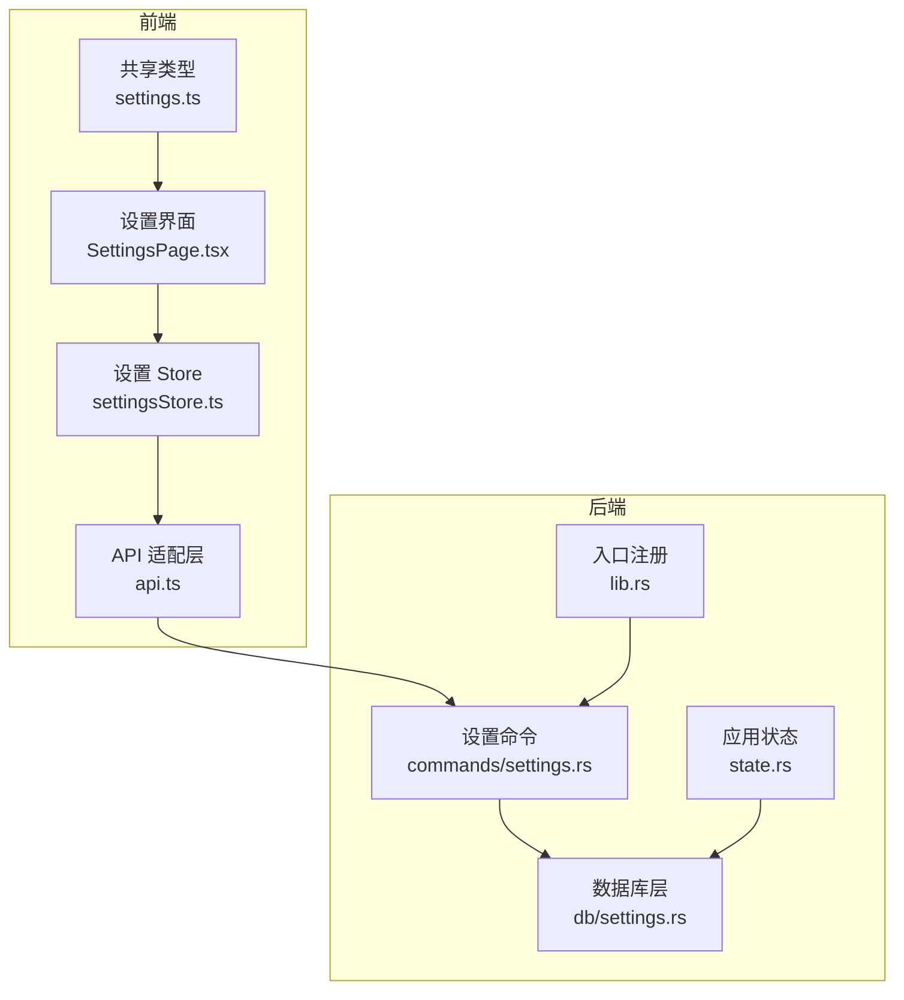
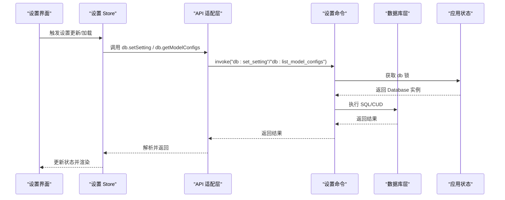
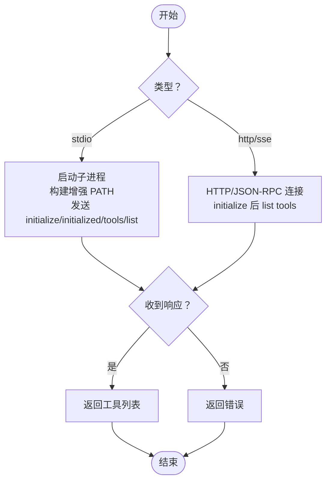
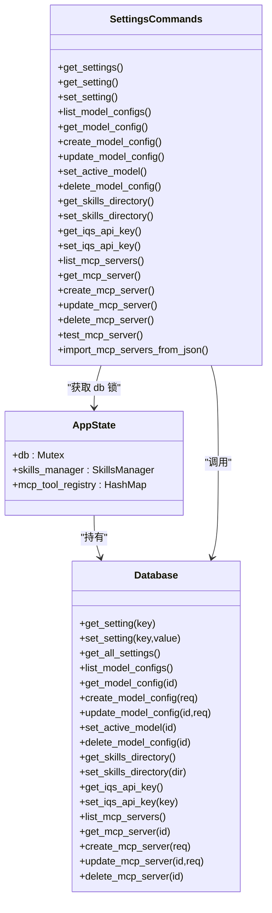

# 设置管理命令

<cite>
**本文引用的文件**
- [settings.rs](file://src-tauri/src/commands/settings.rs)
- [settings.rs](file://src-tauri/src/db/settings.rs)
- [settingsStore.ts](file://src-web/src/stores/settingsStore.ts)
- [settings.ts](file://packages/shared/src/settings.ts)
- [api.ts](file://src-web/src/lib/api.ts)
- [SettingsPage.tsx](file://src-web/src/components/settings/SettingsPage.tsx)
- [state.rs](file://src-tauri/src/state.rs)
- [lib.rs](file://src-tauri/src/lib.rs)
- [mod.rs](file://native/src/db/mod.rs)
</cite>

## 目录
1. [简介](#简介)
2. [项目结构](#项目结构)
3. [核心组件](#核心组件)
4. [架构总览](#架构总览)
5. [详细组件分析](#详细组件分析)
6. [依赖关系分析](#依赖关系分析)
7. [性能考量](#性能考量)
8. [故障排查指南](#故障排查指南)
9. [结论](#结论)
10. [附录](#附录)

## 简介
本文件面向 CoSurf 的“设置管理命令”模块，系统化梳理后端 Tauri 命令与前端 Store/API 的交互，覆盖以下能力：
- 获取/更新/重置通用设置
- 模型配置的增删改查与激活
- Skills 目录与 IQS API Key 的配置
- MCP Server 的增删改查、连接测试与批量导入
- 设置的持久化、热更新与前端同步
- 安全存储、权限控制与备份恢复建议

## 项目结构
设置相关代码分布在后端命令层、数据库层、前端 Store 与 API 层，以及共享类型定义中，形成清晰的分层职责：
- 后端命令层：暴露 Tauri 命令，统一入口
- 数据库层：SQLite 存储与 ORM 化的 CRUD
- 前端 Store/API：状态管理与跨进程通信
- 共享类型：前后端一致的类型定义

图表来源
- [settings.rs:1-615](file://src-tauri/src/commands/settings.rs#L1-L615)
- [settings.rs:1-540](file://src-tauri/src/db/settings.rs#L1-L540)
- [settingsStore.ts:1-201](file://src-web/src/stores/settingsStore.ts#L1-L201)
- [api.ts:1-445](file://src-web/src/lib/api.ts#L1-L445)
- [SettingsPage.tsx:1-802](file://src-web/src/components/settings/SettingsPage.tsx#L1-L802)
- [state.rs:1-81](file://src-tauri/src/state.rs#L1-L81)
- [lib.rs:108-214](file://src-tauri/src/lib.rs#L108-L214)

章节来源
- [settings.rs:1-615](file://src-tauri/src/commands/settings.rs#L1-L615)
- [settings.rs:1-540](file://src-tauri/src/db/settings.rs#L1-L540)
- [settingsStore.ts:1-201](file://src-web/src/stores/settingsStore.ts#L1-L201)
- [api.ts:1-445](file://src-web/src/lib/api.ts#L1-L445)
- [SettingsPage.tsx:1-802](file://src-web/src/components/settings/SettingsPage.tsx#L1-L802)
- [state.rs:1-81](file://src-tauri/src/state.rs#L1-L81)
- [lib.rs:108-214](file://src-tauri/src/lib.rs#L108-L214)

## 核心组件
- 后端命令层：提供 get_settings、get_setting、set_setting、模型配置 CRUD、Skills/IQS 配置、MCP Server CRUD 与测试、批量导入等命令
- 数据库层：settings 表、model_configs 表、mcp_servers 表；提供查询、插入/更新、删除与默认值处理
- 前端 Store/API：集中管理设置状态、发起后端调用、按需加载与同步
- 共享类型：定义 AppSettings 结构及默认值，确保前后端一致性

章节来源
- [settings.rs:9-615](file://src-tauri/src/commands/settings.rs#L9-L615)
- [settings.rs:7-540](file://src-tauri/src/db/settings.rs#L7-L540)
- [settingsStore.ts:6-31](file://src-web/src/stores/settingsStore.ts#L6-L31)
- [settings.ts:5-46](file://packages/shared/src/settings.ts#L5-L46)

## 架构总览
设置命令的调用链路如下：
- 前端组件通过 Store/API 调用后端命令
- 命令函数获取 AppState 中的数据库锁，委托数据库层执行
- 数据库层完成 SQL 操作，返回结果
- 前端 Store 更新内存状态，必要时触发 UI 刷新

图表来源
- [settingsStore.ts:76-90](file://src-web/src/stores/settingsStore.ts#L76-L90)
- [api.ts:118-155](file://src-web/src/lib/api.ts#L118-L155)
- [settings.rs:9-615](file://src-tauri/src/commands/settings.rs#L9-L615)
- [settings.rs:179-339](file://src-tauri/src/db/settings.rs#L179-L339)
- [state.rs:9-23](file://src-tauri/src/state.rs#L9-L23)

## 详细组件分析

### 通用设置：获取/更新/重置
- 命令接口
  - 获取全部设置：get_settings
  - 获取单项设置：get_setting
  - 更新单项设置：set_setting
- 数据结构
  - settings 表：key/value 字符串键值对
  - get_all_settings 会尝试将 value 解析为 JSON，否则作为字符串处理
- 默认值与重置
  - 未找到键时返回空值，由前端决定是否采用默认值
  - 重置可通过 set_setting(key, "") 或删除键实现（取决于具体业务）
- 前端行为
  - updateSettings 会将变更逐项调用 db.setSetting
  - 前端 DEFAULT_SETTINGS 提供默认值参考

章节来源
- [settings.rs:9-34](file://src-tauri/src/commands/settings.rs#L9-L34)
- [settings.rs:179-215](file://src-tauri/src/db/settings.rs#L179-L215)
- [settingsStore.ts:76-90](file://src-web/src/stores/settingsStore.ts#L76-L90)
- [settings.ts:28-46](file://packages/shared/src/settings.ts#L28-L46)

### 模型配置：增删改查与激活
- 命令接口
  - 列表：list_model_configs
  - 查询：get_model_config
  - 激活：set_active_model
  - 创建：create_model_config
  - 更新：update_model_config
  - 删除：delete_model_config
- 数据结构
  - ModelConfig：包含 id/name/provider/model_id/api_key/base_url/温度/top_p/最大 token/本地标记/激活标记
  - 默认值：温度、top_p、max_tokens、is_local、is_active
- 验证与约束
  - 更新时仅对传入字段进行部分更新，未传入字段保留原值
  - 激活切换：先清零再设目标为 1
- 前端行为
  - loadModels：拉取列表与当前激活模型
  - setActiveModel/updateModel/addModel/removeModel：与后端同步

章节来源
- [settings.rs:36-105](file://src-tauri/src/commands/settings.rs#L36-L105)
- [settings.rs:7-23](file://src-tauri/src/db/settings.rs#L7-L23)
- [settings.rs:217-339](file://src-tauri/src/db/settings.rs#L217-L339)
- [settingsStore.ts:41-159](file://src-web/src/stores/settingsStore.ts#L41-L159)

### Skills 目录与 IQS API Key
- Skills 目录
  - 获取：get_skills_directory
  - 设置：set_skills_directory
  - 默认值：若未配置，返回用户主目录下的 ~/.cosurf/skills 并持久化
  - 热更新：set_skills_directory 会重建 SkillsManager 并从新目录加载
- IQS API Key
  - 获取：get_iqs_api_key
  - 设置：set_iqs_api_key
  - 前端 Store/iqsApiKey 字段独立管理，不参与 AppSettings

章节来源
- [settings.rs:109-195](file://src-tauri/src/commands/settings.rs#L109-L195)
- [settings.rs:339-376](file://src-tauri/src/db/settings.rs#L339-L376)
- [state.rs:27-78](file://src-tauri/src/state.rs#L27-L78)
- [settingsStore.ts:161-199](file://src-web/src/stores/settingsStore.ts#L161-L199)

### MCP Server：增删改查、连接测试与批量导入
- 命令接口
  - 列表/查询/创建/更新/删除：list_mcp_servers/get_mcp_server/create_mcp_server/update_mcp_server/delete_mcp_server
  - 连接测试：test_mcp_server（支持 http/streamableHttp/sse/stdio）
  - 批量导入：import_mcp_servers_from_json（支持开源标准 JSON 格式）
- 数据结构
  - McpServerConfig：包含 id/name/type/url/headers/command/args/cwd/env/disabled/timeout/enabled/时间戳
  - McpServerType：http/streamableHttp/sse/stdio
  - Create/Update 请求：字段可选，支持部分更新
- 连接测试流程
  - HTTP 类型：建立 JSON-RPC 连接，initialize 后 list tools
  - stdio 类型：构建增强 PATH，解析命令，发送 initialize/initialized/tools/list，读取响应
- 批量导入
  - 解析 mcpServers 对象，自动推断类型（有 url 默认 streamableHttp，有 command 默认 stdio），逐条创建

图表来源
- [settings.rs:264-486](file://src-tauri/src/commands/settings.rs#L264-L486)
- [settings.rs:27-114](file://src-tauri/src/db/settings.rs#L27-L114)

章节来源
- [settings.rs:197-615](file://src-tauri/src/commands/settings.rs#L197-L615)
- [settings.rs:27-152](file://src-tauri/src/db/settings.rs#L27-L152)

### 前端设置界面同步机制
- 预加载与按需加载
  - SettingsPage 在打开时预加载 Skills 目录与 IQS API Key
  - 切换标签时按需加载对应配置
- Store 行为
  - updateSettings 逐项调用 db.setSetting
  - loadModels 一次性拉取模型列表与当前激活模型
- API 适配
  - api.ts 对 N-API 返回的 JSON 字符串进行解析，null 表示无数据

章节来源
- [SettingsPage.tsx:38-90](file://src-web/src/components/settings/SettingsPage.tsx#L38-L90)
- [settingsStore.ts:41-90](file://src-web/src/stores/settingsStore.ts#L41-L90)
- [api.ts:118-176](file://src-web/src/lib/api.ts#L118-L176)

## 依赖关系分析

图表来源
- [state.rs:9-23](file://src-tauri/src/state.rs#L9-L23)
- [settings.rs:179-539](file://src-tauri/src/db/settings.rs#L179-L539)
- [settings.rs:9-615](file://src-tauri/src/commands/settings.rs#L9-L615)

章节来源
- [state.rs:1-81](file://src-tauri/src/state.rs#L1-L81)
- [settings.rs:1-540](file://src-tauri/src/db/settings.rs#L1-L540)
- [settings.rs:1-615](file://src-tauri/src/commands/settings.rs#L1-L615)

## 性能考量
- SQLite 访问
  - 命令层通过互斥锁访问数据库，避免并发冲突
  - 建议：批量更新时尽量合并为一次事务，减少锁竞争
- JSON 解析
  - get_all_settings 对每个 value 尝试解析为 JSON，复杂度与设置数量线性相关
  - 建议：对大体量设置采用分页或增量加载
- MCP 测试
  - stdio 测试包含超时与进程管理，避免长时间阻塞
  - 建议：对高频测试增加缓存与节流

[本节为通用指导，无需特定文件来源]

## 故障排查指南
- 设置更新无效
  - 检查前端 updateSettings 是否逐项调用 db.setSetting
  - 检查后端命令是否捕获锁错误并返回 ErrorResponse
- 模型激活失败
  - set_active_model 会将其他模型置为非激活，若返回 NotFound，确认 id 是否存在
- Skills 目录变更未生效
  - set_skills_directory 会重建 SkillsManager 并从新目录加载，确认目录存在且可读
- IQS API Key 无法读取
  - get_iqs_api_key 返回空值时，确认前端 Store 是否正确同步
- MCP 连接测试失败
  - stdio：检查命令解析、增强 PATH、stdin/stdout 可用性
  - http/sse：检查 URL、Headers、超时与认证头

章节来源
- [settingsStore.ts:76-90](file://src-web/src/stores/settingsStore.ts#L76-L90)
- [settings.rs:9-34](file://src-tauri/src/commands/settings.rs#L9-L34)
- [settings.rs:319-329](file://src-tauri/src/db/settings.rs#L319-L329)
- [settings.rs:120-165](file://src-tauri/src/commands/settings.rs#L120-L165)
- [settings.rs:264-486](file://src-tauri/src/commands/settings.rs#L264-L486)

## 结论
CoSurf 的设置管理命令以清晰的分层设计实现了通用设置、模型配置、Skills/IQS 与 MCP 的全栈能力。后端命令通过 AppState 持有的数据库实例统一执行，前端 Store/API 提供了良好的同步与按需加载机制。建议在后续迭代中完善批量导入的幂等性、MCP 连接测试的缓存与重试策略，以及安全存储与备份恢复的标准化流程。

[本节为总结性内容，无需特定文件来源]

## 附录

### 设置项数据结构与默认值
- AppSettings（共享类型）
  - 主题、语言、字体大小、用户名称、面板默认高度、覆盖模式、隐私模式、AI 数据隐私、快捷键、用户数据路径
  - 默认值见 DEFAULT_SETTINGS
- ModelConfig（数据库模型）
  - 温度、top_p、max_tokens、is_local、is_active 等字段均有默认值
- McpServerConfig（数据库模型）
  - server_type 默认 stdio；disabled/enabled 字段映射；headers/args/env 等 JSON 字段序列化存储

章节来源
- [settings.ts:5-46](file://packages/shared/src/settings.ts#L5-L46)
- [settings.rs:7-23](file://src-tauri/src/db/settings.rs#L7-L23)
- [settings.rs:72-114](file://src-tauri/src/db/settings.rs#L72-L114)

### 命令调用示例（路径指引）
- 获取全部设置
  - 前端：调用 db.getSettings
  - 后端：get_settings
  - 路径：[api.ts:118-120](file://src-web/src/lib/api.ts#L118-L120)、[settings.rs:9-16](file://src-tauri/src/commands/settings.rs#L9-L16)
- 更新单项设置
  - 前端：调用 db.setSetting(key, value)
  - 后端：set_setting
  - 路径：[api.ts:125-126](file://src-web/src/lib/api.ts#L125-L126)、[settings.rs:27-34](file://src-tauri/src/commands/settings.rs#L27-L34)
- 模型配置 CRUD
  - 前端：db.listModelConfigs / db.createModelConfig / db.updateModelConfig / db.setActiveModel / db.deleteModelConfig
  - 后端：list_model_configs / create_model_config / update_model_config / set_active_model / delete_model_config
  - 路径：[api.ts:128-155](file://src-web/src/lib/api.ts#L128-L155)、[settings.rs:36-105](file://src-tauri/src/commands/settings.rs#L36-L105)
- Skills/IQS 配置
  - 前端：db.getSkillsDirectory / db.setSkillsDirectory / db.getIqsApiKey / db.setIqsApiKey
  - 后端：get_skills_directory / set_skills_directory / get_iqs_api_key / set_iqs_api_key
  - 路径：[api.ts:157-176](file://src-web/src/lib/api.ts#L157-L176)、[settings.rs:109-195](file://src-tauri/src/commands/settings.rs#L109-L195)
- MCP Server 管理与测试
  - 前端：db.listMcpServers / db.getMcpServer / db.createMcpServer / db.updateMcpServer / db.deleteMcpServer / db.testMcpServer / db.importMcpServersFromJson
  - 后端：list_mcp_servers / get_mcp_server / create_mcp_server / update_mcp_server / delete_mcp_server / test_mcp_server / import_mcp_servers_from_json
  - 路径：[api.ts:178-217](file://src-web/src/lib/api.ts#L178-L217)、[settings.rs:197-615](file://src-tauri/src/commands/settings.rs#L197-L615)

### 持久化机制与热更新
- 持久化
  - settings 表：键值对持久化
  - model_configs 表：模型配置持久化
  - mcp_servers 表：MCP 服务器配置持久化
- 热更新
  - Skills 目录变更后重建 SkillsManager 并从新目录加载
  - 模型激活切换即时生效
  - 前端 Store 通过 API 适配层与后端保持同步

章节来源
- [settings.rs:179-539](file://src-tauri/src/db/settings.rs#L179-L539)
- [state.rs:120-165](file://src-tauri/src/state.rs#L120-L165)
- [settingsStore.ts:161-199](file://src-web/src/stores/settingsStore.ts#L161-L199)

### 安全存储与权限控制
- API Key 管理
  - IQS API Key 通过 set_iqs_api_key 持久化
  - 建议：避免明文存储，优先使用环境变量或加密存储
- 权限控制
  - 命令层通过互斥锁保护数据库访问
  - 建议：对敏感命令增加鉴权与审计日志

章节来源
- [settings.rs:168-195](file://src-tauri/src/commands/settings.rs#L168-L195)
- [settings.rs:366-376](file://src-tauri/src/db/settings.rs#L366-L376)

### 备份与恢复（建议）
- 备份
  - 备份应用数据目录中的 cosurf.db
  - 导出 MCP 服务器配置为 JSON（import_mcp_servers_from_json 的逆向）
- 恢复
  - 将备份的数据库文件还原到原位
  - 使用 import_mcp_servers_from_json 恢复 MCP 配置

章节来源
- [settings.rs:489-539](file://src-tauri/src/db/settings.rs#L489-L539)
- [settings.rs:488-615](file://src-tauri/src/commands/settings.rs#L488-L615)