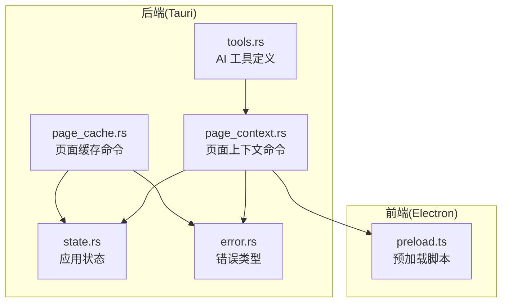
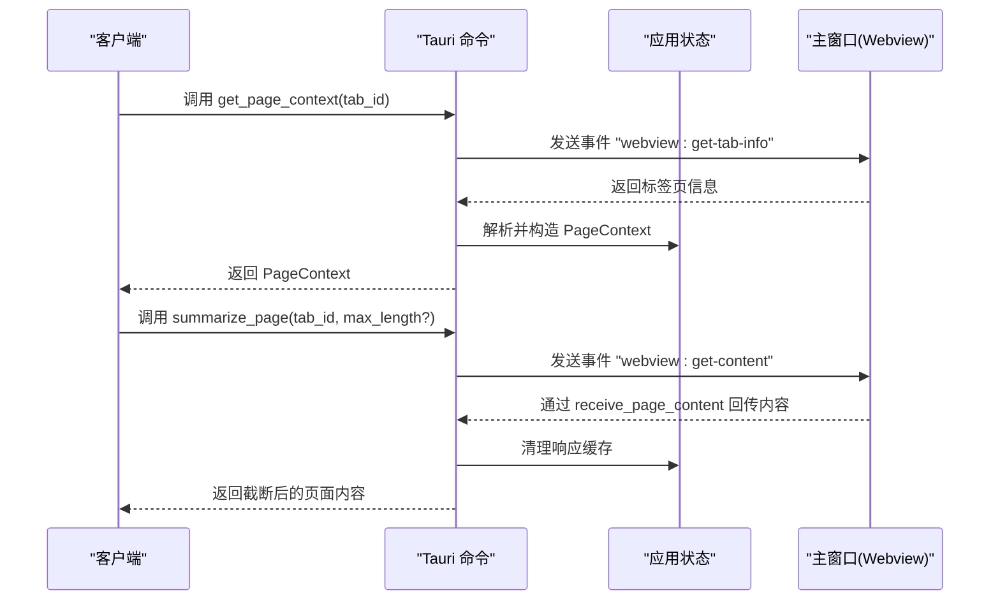
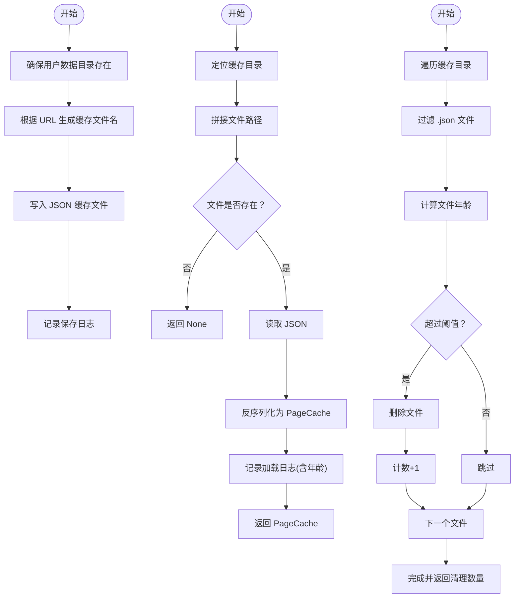
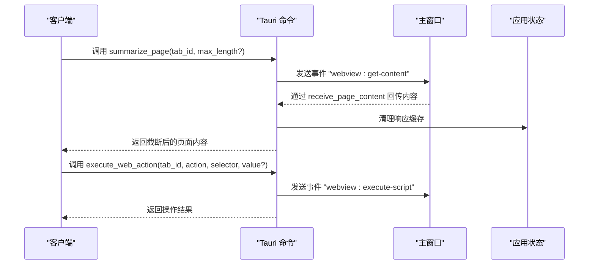
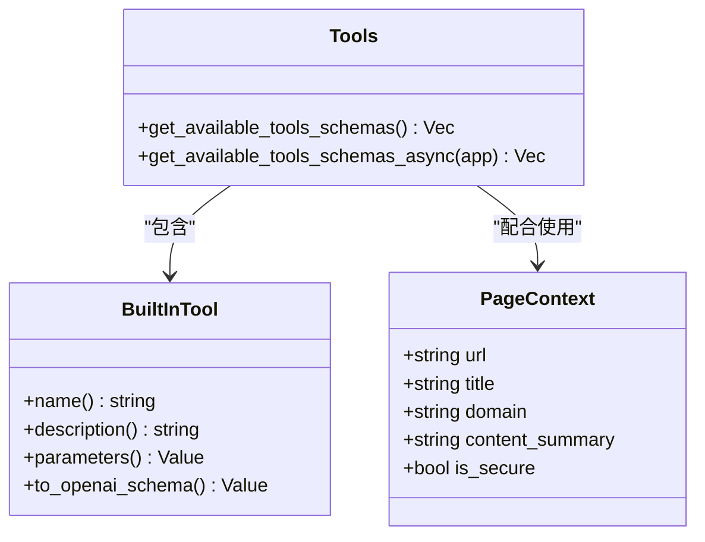
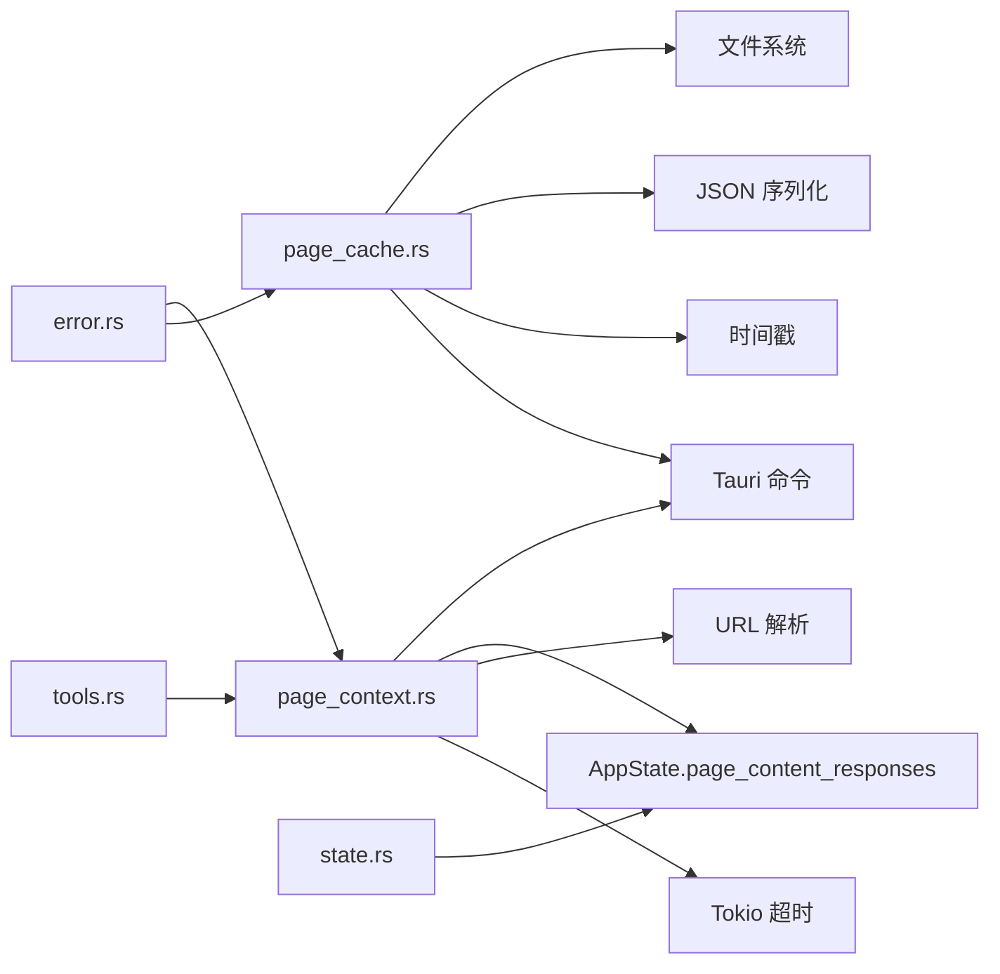

# 页面操作命令

<cite>
**本文引用的文件**
- [page_cache.rs](file://src-tauri/src/commands/page_cache.rs)
- [page_context.rs](file://src-tauri/src/commands/page_context.rs)
- [state.rs](file://src-tauri/src/state.rs)
- [error.rs](file://src-tauri/src/error.rs)
- [tools.rs](file://src-tauri/src/ai/tools.rs)
- [preload.ts](file://electron/preload.ts)
</cite>

## 目录
1. [简介](#简介)
2. [项目结构](#项目结构)
3. [核心组件](#核心组件)
4. [架构总览](#架构总览)
5. [详细组件分析](#详细组件分析)
6. [依赖关系分析](#依赖关系分析)
7. [性能考虑](#性能考虑)
8. [故障排查指南](#故障排查指南)
9. [结论](#结论)
10. [附录](#附录)

## 简介
本文件为 CoSurf 页面操作命令的详细 API 文档，聚焦两类命令模块：
- 页面缓存命令：负责页面内容的持久化缓存、缓存清理与查询，支持自定义存储路径与过期策略。
- 页面上下文命令：负责从前端标签页提取页面元数据、DOM 内容摘要、安全状态等，并可向 AI 对话注入上下文提示词，或对页面内容进行摘要。

文档同时解释命令的调用流程、与 AI 代理的协作机制、页面内容分析的技术实现，以及缓存策略、内存管理与性能优化建议。

## 项目结构
本节概述与页面操作命令相关的核心文件及其职责：
- page_cache.rs：页面缓存数据结构、文件系统持久化、过期清理、Tauri 命令封装。
- page_context.rs：页面上下文构建、AI 上下文注入、页面内容提取、网页自动化操作。
- state.rs：应用状态容器，包含页面内容响应缓存、活跃标签 ID、技能管理器等。
- error.rs：统一错误类型与序列化，便于 IPC 传递。
- tools.rs：AI 工具定义与参数 Schema，包含“总结页面”“网页代理”等工具。
- preload.ts：Electron 预加载脚本，承载前端事件监听与页面内容提取的桥接。

**图表来源**
- [page_cache.rs:1-275](file://src-tauri/src/commands/page_cache.rs#L1-L275)
- [page_context.rs:1-327](file://src-tauri/src/commands/page_context.rs#L1-L327)
- [state.rs:1-81](file://src-tauri/src/state.rs#L1-L81)
- [error.rs:1-64](file://src-tauri/src/error.rs#L1-L64)
- [tools.rs:1-621](file://src-tauri/src/ai/tools.rs#L1-L621)
- [preload.ts:172](file://electron/preload.ts#L172)

**章节来源**
- [page_cache.rs:1-275](file://src-tauri/src/commands/page_cache.rs#L1-L275)
- [page_context.rs:1-327](file://src-tauri/src/commands/page_context.rs#L1-L327)
- [state.rs:1-81](file://src-tauri/src/state.rs#L1-L81)
- [error.rs:1-64](file://src-tauri/src/error.rs#L1-L64)
- [tools.rs:1-621](file://src-tauri/src/ai/tools.rs#L1-L621)
- [preload.ts:172](file://electron/preload.ts#L172)

## 核心组件
- 页面缓存命令
  - 数据结构：PageCache（URL、标题、内容、时间戳、内容长度）。
  - 功能：保存缓存、加载缓存、清理过期缓存；支持自定义用户数据目录与默认临时目录。
  - 命令：save_page_cache_command、load_page_cache_command、cleanup_expired_cache_command。
- 页面上下文命令
  - 数据结构：PageContext（URL、标题、域名、内容摘要、是否 HTTPS）。
  - 功能：获取页面上下文、注入 AI 上下文提示词、提取页面内容摘要、执行网页自动化操作。
  - 命令：get_page_context、inject_page_context、summarize_page、receive_page_content、execute_web_action。
- 应用状态
  - page_content_responses：按 request_id 缓存前端返回的页面内容，用于命令间异步通信。
  - active_tab_id：当前活跃标签 ID。
  - 其他：数据库、技能管理器、MCP 工具注册表等。
- 错误处理
  - 统一 AppError 类型，支持序列化以便 IPC 传递。
- AI 工具
  - BuiltInTool：内置工具集合，包含“总结页面”“网页代理”等，提供参数 Schema。
  - 与页面上下文命令配合，实现 AI 对页面内容的分析与交互。

**章节来源**
- [page_cache.rs:9-89](file://src-tauri/src/commands/page_cache.rs#L9-L89)
- [page_cache.rs:161-253](file://src-tauri/src/commands/page_cache.rs#L161-L253)
- [page_context.rs:10-107](file://src-tauri/src/commands/page_context.rs#L10-L107)
- [page_context.rs:109-233](file://src-tauri/src/commands/page_context.rs#L109-L233)
- [state.rs:9-23](file://src-tauri/src/state.rs#L9-L23)
- [error.rs:4-63](file://src-tauri/src/error.rs#L4-L63)
- [tools.rs:19-195](file://src-tauri/src/ai/tools.rs#L19-L195)

## 架构总览
页面操作命令通过 Tauri 命令在后端执行，与前端通过事件进行异步通信。页面缓存命令直接访问文件系统；页面上下文命令通过前端窗口事件获取标签页信息与 DOM 内容，并借助应用状态进行请求-响应匹配。

**图表来源**
- [page_context.rs:20-107](file://src-tauri/src/commands/page_context.rs#L20-L107)
- [page_context.rs:141-233](file://src-tauri/src/commands/page_context.rs#L141-L233)
- [state.rs:14](file://src-tauri/src/state.rs#L14)
- [preload.ts:172](file://electron/preload.ts#L172)

## 详细组件分析

### 页面缓存命令
- 数据结构与持久化
  - PageCache：包含 URL、标题、内容、时间戳、内容长度。
  - 用户数据目录：优先使用设置项 user_data_path，否则回退到系统临时目录下的 cosurf/data/pages。
  - 文件命名：对 URL 做 SHA256 哈希，扩展名为 .json。
- 保存缓存
  - 步骤：确保目录存在 → 生成文件名 → 序列化 JSON → 写入文件。
  - 成功日志包含 URL、路径、内容长度。
- 加载缓存
  - 步骤：定位文件 → 读取 JSON → 反序列化 → 记录年龄（秒）。
- 清理过期缓存
  - 步骤：遍历目录 → 过滤 .json 文件 → 计算修改时间差 → 删除超过阈值的文件。
  - 默认过期时间为 24 小时。
- Tauri 命令
  - save_page_cache_command：读取用户设置的路径，调用保存函数。
  - load_page_cache_command：读取用户设置的路径，调用加载函数。
  - cleanup_expired_cache_command：支持传入 max_age_seconds，默认 86400。

**图表来源**
- [page_cache.rs:19-89](file://src-tauri/src/commands/page_cache.rs#L19-L89)
- [page_cache.rs:91-124](file://src-tauri/src/commands/page_cache.rs#L91-L124)
- [page_cache.rs:126-159](file://src-tauri/src/commands/page_cache.rs#L126-L159)

**章节来源**
- [page_cache.rs:9-89](file://src-tauri/src/commands/page_cache.rs#L9-L89)
- [page_cache.rs:126-159](file://src-tauri/src/commands/page_cache.rs#L126-L159)
- [page_cache.rs:161-253](file://src-tauri/src/commands/page_cache.rs#L161-L253)

### 页面上下文命令
- PageContext 结构
  - 字段：url、title、domain、content_summary、is_secure。
- get_page_context
  - 通过主窗口发送事件 "webview:get-tab-info" 请求标签页信息。
  - 使用 UUID 生成 request_id，等待 AppState.page_content_responses 中的响应。
  - 超时控制：最多等待 3 秒。
  - 解析 URL、标题、加载状态，提取域名与安全标志，生成内容摘要。
- inject_page_context
  - 基于 PageContext 构造系统提示词，注入到 AI 对话上下文中。
- summarize_page
  - 通过主窗口发送事件 "webview:get-content" 请求页面文本内容。
  - 超时控制：最多等待 5 秒。
  - 截断至 max_length（默认 500），若无内容则返回错误。
- receive_page_content
  - 将前端返回的内容按 request_id 存入 AppState.page_content_responses。
- execute_web_action
  - 支持 click、fill、close_popup/dismiss 等动作。
  - 通过注入脚本在页面执行对应 DOM 操作，返回执行结果。

**图表来源**
- [page_context.rs:141-233](file://src-tauri/src/commands/page_context.rs#L141-L233)
- [page_context.rs:235-327](file://src-tauri/src/commands/page_context.rs#L235-L327)
- [state.rs:14](file://src-tauri/src/state.rs#L14)
- [preload.ts:172](file://electron/preload.ts#L172)

**章节来源**
- [page_context.rs:10-107](file://src-tauri/src/commands/page_context.rs#L10-L107)
- [page_context.rs:109-139](file://src-tauri/src/commands/page_context.rs#L109-L139)
- [page_context.rs:141-233](file://src-tauri/src/commands/page_context.rs#L141-L233)
- [page_context.rs:235-327](file://src-tauri/src/commands/page_context.rs#L235-L327)
- [state.rs:14](file://src-tauri/src/state.rs#L14)

### AI 协作与页面内容分析
- 工具集成
  - BuiltInTool 定义了“总结页面”“网页代理”等工具，提供参数 Schema。
  - 与页面上下文命令结合，可在 AI 对话中直接调用页面摘要与自动化操作。
- 上下文注入
  - inject_page_context 将当前页面的 URL、标题、域名、安全状态与内容摘要注入到系统提示词，提升 AI 回答的相关性。
- 内容提取
  - summarize_page 通过前端脚本克隆 body，移除脚本与样式节点，提取纯文本并截断长度，便于后续分析。

**图表来源**
- [page_context.rs:10-107](file://src-tauri/src/commands/page_context.rs#L10-L107)
- [tools.rs:19-195](file://src-tauri/src/ai/tools.rs#L19-L195)
- [tools.rs:197-225](file://src-tauri/src/ai/tools.rs#L197-L225)

**章节来源**
- [tools.rs:19-195](file://src-tauri/src/ai/tools.rs#L19-L195)
- [tools.rs:197-225](file://src-tauri/src/ai/tools.rs#L197-L225)
- [page_context.rs:109-139](file://src-tauri/src/commands/page_context.rs#L109-L139)

## 依赖关系分析
- page_cache.rs 依赖
  - 文件系统：读写缓存文件。
  - 序列化：JSON 序列化 PageCache。
  - 时间：UTC 时间戳记录缓存时间。
  - Tauri：命令装饰器与 AppHandle。
  - 应用状态：读取用户设置的用户数据目录。
- page_context.rs 依赖
  - Tauri：窗口事件、状态访问。
  - 应用状态：page_content_responses 作为请求-响应通道。
  - 错误处理：AppError。
  - URL 解析：提取域名。
  - 异步：tokio 超时控制。
- state.rs
  - page_content_responses：HashMap<String, String>，按 request_id 缓存内容。
  - active_tab_id：当前活跃标签 ID。
- error.rs
  - AppError：统一错误类型，支持序列化。
- tools.rs
  - BuiltInTool：工具 Schema，与页面上下文命令配合。

**图表来源**
- [page_cache.rs:1-8](file://src-tauri/src/commands/page_cache.rs#L1-L8)
- [page_context.rs:1-8](file://src-tauri/src/commands/page_context.rs#L1-L8)
- [state.rs:9-23](file://src-tauri/src/state.rs#L9-L23)
- [error.rs:4-39](file://src-tauri/src/error.rs#L4-L39)
- [tools.rs:1-17](file://src-tauri/src/ai/tools.rs#L1-L17)

**章节来源**
- [page_cache.rs:1-8](file://src-tauri/src/commands/page_cache.rs#L1-L8)
- [page_context.rs:1-8](file://src-tauri/src/commands/page_context.rs#L1-L8)
- [state.rs:9-23](file://src-tauri/src/state.rs#L9-L23)
- [error.rs:4-39](file://src-tauri/src/error.rs#L4-L39)
- [tools.rs:1-17](file://src-tauri/src/ai/tools.rs#L1-L17)

## 性能考虑
- 缓存策略
  - 文件命名采用 SHA256 哈希，避免路径冲突与非法字符。
  - 默认过期时间 24 小时，可通过命令参数调整，平衡存储占用与命中率。
- 内存管理
  - page_content_responses 使用 HashMap 按 request_id 缓存，命令完成后立即清理，避免内存泄漏。
  - 超时控制：标签页信息等待 3 秒、内容提取等待 5 秒，防止长时间阻塞。
- I/O 优化
  - 仅在必要时创建目录，减少不必要的文件系统调用。
  - JSON 序列化采用格式化输出，便于调试但会增加体积；生产环境可按需优化。
- 并发与线程
  - Tauri 命令为异步，避免阻塞主线程。
  - 使用 tokio::time::timeout 控制前端事件等待，避免无限等待。
- 前端脚本
  - DOM 克隆与节点移除在前端执行，减少后端处理负担；注意跨域限制导致的内容提取失败。

[本节为通用性能建议，无需特定文件来源]

## 故障排查指南
- 页面缓存相关
  - 保存失败：检查用户数据目录权限与磁盘空间；查看日志中的错误信息。
  - 加载失败：确认缓存文件存在且 JSON 格式正确；检查哈希文件名与 URL 是否一致。
  - 清理无效：确认 .json 文件扩展名与修改时间计算逻辑；检查阈值设置。
- 页面上下文相关
  - get_page_context 超时：确认前端已监听 "webview:get-tab-info" 事件并返回数据；检查主窗口是否存在。
  - summarize_page 失败：确认前端已监听 "webview:get-content" 事件并调用 receive_page_content；检查脚本是否被跨域限制阻止。
  - execute_web_action 失败：确认 CSS 选择器有效；检查页面是否加载完成。
- 错误类型
  - AppError 支持序列化，便于前端接收并展示友好提示；常见错误包括数据库、HTTP、JSON、Tauri、内部错误等。

**章节来源**
- [page_cache.rs:73-89](file://src-tauri/src/commands/page_cache.rs#L73-L89)
- [page_cache.rs:102-124](file://src-tauri/src/commands/page_cache.rs#L102-L124)
- [page_context.rs:44-63](file://src-tauri/src/commands/page_context.rs#L44-L63)
- [page_context.rs:176-190](file://src-tauri/src/commands/page_context.rs#L176-L190)
- [error.rs:4-63](file://src-tauri/src/error.rs#L4-L63)

## 结论
页面缓存与上下文命令为 CoSurf 提供了稳定、可扩展的页面数据管理能力。通过合理的缓存策略、严格的错误处理与高效的前后端协作，系统能够在保证性能的同时，为 AI 代理提供高质量的页面上下文与内容摘要，支撑更智能的网页交互体验。

[本节为总结性内容，无需特定文件来源]

## 附录

### 命令调用示例（步骤说明）
- 保存页面缓存
  - 调用 save_page_cache_command(url, title, content)。
  - 若用户设置了自定义路径，则使用该路径；否则使用默认临时目录。
  - 返回缓存文件路径字符串。
- 加载页面缓存
  - 调用 load_page_cache_command(url)。
  - 返回 Option<PageCache>，若缓存不存在则返回空。
- 清理过期缓存
  - 调用 cleanup_expired_cache_command(max_age_seconds?)。
  - 默认 24 小时；返回清理的文件数量。
- 获取页面上下文
  - 调用 get_page_context(tab_id)。
  - 返回 PageContext，包含 URL、标题、域名、安全状态与内容摘要。
- 注入 AI 上下文
  - 调用 inject_page_context(conversation_id, tab_id)。
  - 返回系统提示词字符串，供 AI 对话使用。
- 提取页面内容摘要
  - 调用 summarize_page(tab_id, max_length?)。
  - 返回截断后的页面文本摘要。
- 执行网页操作
  - 调用 execute_web_action(tab_id, action, selector, value?)。
  - 支持 click、fill、close_popup/dismiss 等。

**章节来源**
- [page_cache.rs:161-253](file://src-tauri/src/commands/page_cache.rs#L161-L253)
- [page_context.rs:20-107](file://src-tauri/src/commands/page_context.rs#L20-L107)
- [page_context.rs:109-139](file://src-tauri/src/commands/page_context.rs#L109-L139)
- [page_context.rs:141-233](file://src-tauri/src/commands/page_context.rs#L141-L233)
- [page_context.rs:235-327](file://src-tauri/src/commands/page_context.rs#L235-L327)