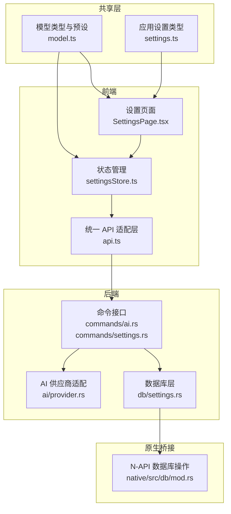
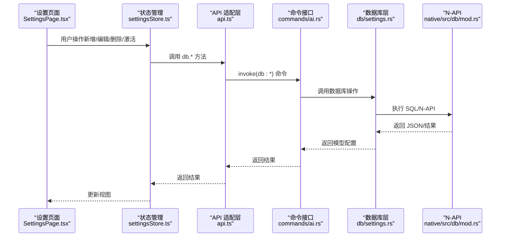
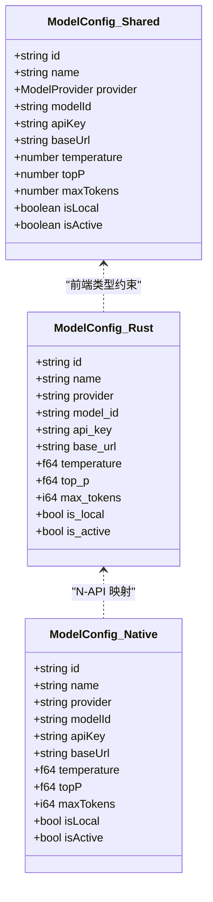
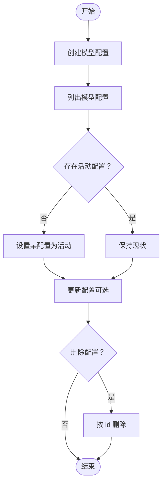
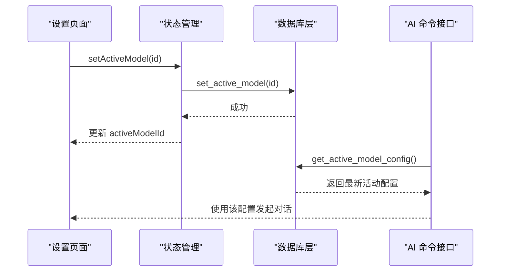
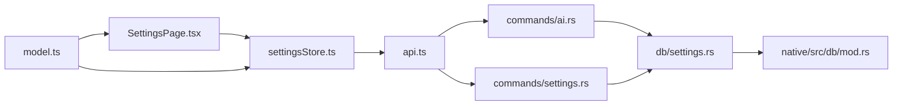

# AI 模型配置

<cite>
**本文档引用的文件**
- [packages/shared/src/model.ts](file://packages/shared/src/model.ts)
- [packages/shared/src/settings.ts](file://packages/shared/src/settings.ts)
- [src-tauri/src/db/settings.rs](file://src-tauri/src/db/settings.rs)
- [src-tauri/src/ai/provider.rs](file://src-tauri/src/ai/provider.rs)
- [native/src/ai/provider.rs](file://native/src/ai/provider.rs)
- [src-tauri/src/commands/ai.rs](file://src-tauri/src/commands/ai.rs)
- [src-web/src/lib/api.ts](file://src-web/src/lib/api.ts)
- [src-web/src/stores/settingsStore.ts](file://src-web/src/stores/settingsStore.ts)
- [src-web/src/components/settings/SettingsPage.tsx](file://src-web/src/components/settings/SettingsPage.tsx)
- [src-web/src/components/settings/AgentPromptsSettings.tsx](file://src-web/src/components/settings/AgentPromptsSettings.tsx)
- [src-tauri/src/commands/settings.rs](file://src-tauri/src/commands/settings.rs)
- [native/src/db/mod.rs](file://native/src/db/mod.rs)
</cite>

## 目录
1. [简介](#简介)
2. [项目结构](#项目结构)
3. [核心组件](#核心组件)
4. [架构总览](#架构总览)
5. [详细组件分析](#详细组件分析)
6. [依赖关系分析](#依赖关系分析)
7. [性能考虑](#性能考虑)
8. [故障排除指南](#故障排除指南)
9. [结论](#结论)
10. [附录](#附录)

## 简介
本文件面向 CoSurf AI 模型配置，提供完整、可操作的配置选项文档。内容覆盖数据结构、字段定义、验证规则、AI 提供商支持、生命周期管理、优先级与继承、迁移与版本兼容、动态更新与热重载、调参与优化、成本控制以及故障排除。

## 项目结构
CoSurf 的 AI 模型配置采用跨平台分层设计：
- 共享层（packages/shared）：定义前端与后端共享的模型配置类型与提供商预设。
- 前端（src-web）：设置页面、状态管理与 API 适配层。
- 后端（src-tauri）：数据库持久化、命令接口、AI 供应商适配。
- 原生桥接（native）：N-API 暴露数据库操作，供 Electron 主进程调用。

**图表来源**
- [src-web/src/components/settings/SettingsPage.tsx:1-800](file://src-web/src/components/settings/SettingsPage.tsx#L1-L800)
- [src-web/src/stores/settingsStore.ts:1-201](file://src-web/src/stores/settingsStore.ts#L1-L201)
- [src-web/src/lib/api.ts:1-445](file://src-web/src/lib/api.ts#L1-L445)
- [src-tauri/src/commands/ai.rs:1-397](file://src-tauri/src/commands/ai.rs#L1-L397)
- [src-tauri/src/commands/settings.rs:36-73](file://src-tauri/src/commands/settings.rs#L36-L73)
- [src-tauri/src/db/settings.rs:1-540](file://src-tauri/src/db/settings.rs#L1-L540)
- [src-tauri/src/ai/provider.rs:1-135](file://src-tauri/src/ai/provider.rs#L1-L135)
- [native/src/db/mod.rs:730-994](file://native/src/db/mod.rs#L730-L994)
- [packages/shared/src/model.ts:1-104](file://packages/shared/src/model.ts#L1-L104)
- [packages/shared/src/settings.ts:1-47](file://packages/shared/src/settings.ts#L1-L47)

**章节来源**
- [packages/shared/src/model.ts:1-104](file://packages/shared/src/model.ts#L1-L104)
- [packages/shared/src/settings.ts:1-47](file://packages/shared/src/settings.ts#L1-L47)
- [src-tauri/src/db/settings.rs:1-540](file://src-tauri/src/db/settings.rs#L1-L540)
- [src-tauri/src/ai/provider.rs:1-135](file://src-tauri/src/ai/provider.rs#L1-L135)
- [src-tauri/src/commands/ai.rs:1-397](file://src-tauri/src/commands/ai.rs#L1-L397)
- [src-web/src/lib/api.ts:1-445](file://src-web/src/lib/api.ts#L1-L445)
- [src-web/src/stores/settingsStore.ts:1-201](file://src-web/src/stores/settingsStore.ts#L1-L201)
- [src-web/src/components/settings/SettingsPage.tsx:1-800](file://src-web/src/components/settings/SettingsPage.tsx#L1-L800)
- [src-tauri/src/commands/settings.rs:36-73](file://src-tauri/src/commands/settings.rs#L36-L73)
- [native/src/db/mod.rs:730-994](file://native/src/db/mod.rs#L730-L994)

## 核心组件
- 模型配置数据结构
  - 字段：id、name、provider、modelId、apiKey、baseUrl、temperature、topP、maxTokens、isLocal、isActive。
  - 类型来源：后端数据库模型与原生 N-API 返回结构。
- 提供商预设
  - 包含 OpenAI、Anthropic、Google Gemini、智谱、月之暗面、DeepSeek、豆包、通义千问、Ollama 等。
  - 预设字段：provider、name、defaultBaseUrl、models、isLocal。
- 前端类型与默认值
  - 前端共享类型定义了 provider 枚举与默认参数（温度、TopP、最大令牌数）。
- 应用设置
  - 包含主题、语言、字体大小、用户名称、面板高度、隐私模式等。

**章节来源**
- [src-tauri/src/db/settings.rs:7-23](file://src-tauri/src/db/settings.rs#L7-L23)
- [native/src/db/mod.rs:730-760](file://native/src/db/mod.rs#L730-L760)
- [packages/shared/src/model.ts:13-33](file://packages/shared/src/model.ts#L13-L33)
- [packages/shared/src/model.ts:35-104](file://packages/shared/src/model.ts#L35-L104)
- [packages/shared/src/settings.ts:5-17](file://packages/shared/src/settings.ts#L5-L17)

## 架构总览
AI 模型配置贯穿“前端设置—状态管理—API 适配—命令接口—数据库—原生桥接”的链路，支持创建、查询、激活、更新与删除模型配置；同时在对话流程中按需读取活动模型配置。

**图表来源**
- [src-web/src/components/settings/SettingsPage.tsx:1-800](file://src-web/src/components/settings/SettingsPage.tsx#L1-L800)
- [src-web/src/stores/settingsStore.ts:1-201](file://src-web/src/stores/settingsStore.ts#L1-L201)
- [src-web/src/lib/api.ts:128-156](file://src-web/src/lib/api.ts#L128-L156)
- [src-tauri/src/commands/ai.rs:1-397](file://src-tauri/src/commands/ai.rs#L1-L397)
- [src-tauri/src/db/settings.rs:217-339](file://src-tauri/src/db/settings.rs#L217-L339)
- [native/src/db/mod.rs:730-994](file://native/src/db/mod.rs#L730-L994)

## 详细组件分析

### 数据结构与字段定义
- 后端模型配置（Rust）
  - 字段：id、name、provider、model_id、api_key、base_url、temperature、top_p、max_tokens、is_local、is_active。
  - 查询映射：list/get/get_active/create/update/delete/set_active。
- 原生 N-API 返回
  - 字段：id、name、provider、modelId、apiKey、baseUrl、temperature、topP、maxTokens、isLocal、isActive。
- 前端共享类型
  - ModelConfig：provider 枚举、必填字段与可选字段。
  - ModelProviderPreset：提供商名称、默认 Base URL、模型列表、是否本地。
- 应用设置
  - AppSettings：主题、语言、字体大小、用户名称、面板高度、隐私模式等。

**图表来源**
- [src-tauri/src/db/settings.rs:7-23](file://src-tauri/src/db/settings.rs#L7-L23)
- [native/src/db/mod.rs:730-760](file://native/src/db/mod.rs#L730-L760)
- [packages/shared/src/model.ts:13-25](file://packages/shared/src/model.ts#L13-L25)

**章节来源**
- [src-tauri/src/db/settings.rs:7-23](file://src-tauri/src/db/settings.rs#L7-L23)
- [native/src/db/mod.rs:730-760](file://native/src/db/mod.rs#L730-L760)
- [packages/shared/src/model.ts:13-33](file://packages/shared/src/model.ts#L13-L33)

### 验证规则与默认值
- 必填项
  - 前端新增/编辑表单：name、provider、modelId、temperature、topP、maxTokens。
  - 后端创建：未传入时使用默认值（温度、TopP、最大令牌数）。
- 默认值
  - 温度：0.7；TopP：1.0；maxTokens：4096。
- Base URL
  - 若未显式配置，部分提供商通过预设 defaultBaseUrl 推导；否则在构建请求时校验。
- 本地模型
  - isLocal 标记用于区分本地（如 Ollama）与云端提供商。

**章节来源**
- [src-web/src/components/settings/SettingsPage.tsx:364-590](file://src-web/src/components/settings/SettingsPage.tsx#L364-L590)
- [src-tauri/src/db/settings.rs:275-297](file://src-tauri/src/db/settings.rs#L275-L297)
- [native/src/ai/provider.rs:37-39](file://native/src/ai/provider.rs#L37-L39)
- [packages/shared/src/model.ts:35-104](file://packages/shared/src/model.ts#L35-L104)

### 支持的 AI 提供商与特定参数
- OpenAI：默认 Base URL、模型列表（如 gpt-4o、gpt-4o-mini、o1-preview）。
- Anthropic（Claude）：特殊消息端点与头部（x-api-key、anthropic-version、anthropic-beta）。
- Google（Gemini）：默认 Base URL、模型列表（gemini-2.0-flash、gemini-1.5-pro、gemini-1.5-flash）。
- 智谱 AI：默认 Base URL、模型列表（glm-4-plus、glm-4-flash、glm-4-long）。
- 月之暗面（Kimi）：默认 Base URL、模型列表（moonshot-v1-128k 等）。
- DeepSeek：默认 Base URL、模型列表（deepseek-chat、deepseek-reasoner）。
- 豆包（字节跳动）：默认 Base URL、模型列表（doubao-pro-32k 等）。
- 通义千问（DashScope）：默认 Base URL、模型列表（qwen-max、qwen-plus 等）。
- Ollama：默认 Base URL（本地）、模型列表（llama3、qwen2 等），isLocal=true。
- 自定义（custom）：允许用户自定义 Base URL 与模型 ID。

**章节来源**
- [packages/shared/src/model.ts:35-104](file://packages/shared/src/model.ts#L35-L104)
- [src-tauri/src/ai/provider.rs:102-134](file://src-tauri/src/ai/provider.rs#L102-L134)
- [native/src/ai/provider.rs:157-189](file://native/src/ai/provider.rs#L157-L189)

### 生命周期管理
- 创建
  - 前端：addModel 调用 db.create_model_config。
  - 后端：命令接口调用数据库层 create_model_config，初始 is_active=false。
- 查询
  - listModelConfigs：按 is_active 降序、name 升序排序。
  - getActiveModel：查询 is_active=1 的唯一配置。
- 更新
  - updateModelConfig：可更新 name、apiKey、baseUrl、temperature、topP、maxTokens。
- 激活
  - setActiveModel：先清零其他配置的 is_active，再将目标置为 1。
- 删除
  - deleteModelConfig：按 id 删除，不存在时报错。

**图表来源**
- [src-tauri/src/db/settings.rs:217-339](file://src-tauri/src/db/settings.rs#L217-L339)
- [src-web/src/stores/settingsStore.ts:101-159](file://src-web/src/stores/settingsStore.ts#L101-L159)
- [src-web/src/lib/api.ts:128-156](file://src-web/src/lib/api.ts#L128-L156)

**章节来源**
- [src-tauri/src/db/settings.rs:217-339](file://src-tauri/src/db/settings.rs#L217-L339)
- [src-web/src/stores/settingsStore.ts:101-159](file://src-web/src/stores/settingsStore.ts#L101-L159)
- [src-web/src/lib/api.ts:128-156](file://src-web/src/lib/api.ts#L128-L156)

### 优先级机制与继承关系
- 活动模型优先
  - 系统默认使用 is_active=true 的模型配置进行对话与标题生成。
- 前端表单默认值继承
  - 新增模型时，基于所选提供商的预设（defaultBaseUrl、models、isLocal）填充默认值。
- 参数继承
  - 更新模型配置时，未传入的字段沿用现有值，避免覆盖。

**章节来源**
- [src-tauri/src/commands/ai.rs:31-37](file://src-tauri/src/commands/ai.rs#L31-L37)
- [src-web/src/components/settings/SettingsPage.tsx:369-402](file://src-web/src/components/settings/SettingsPage.tsx#L369-L402)
- [src-tauri/src/db/settings.rs:299-317](file://src-tauri/src/db/settings.rs#L299-L317)

### 配置迁移与版本兼容
- 字段命名差异
  - 数据库层字段为 snake_case（如 model_id、is_local），N-API 返回为 camelCase（如 modelId、isLocal），前端统一消费 camelCase。
- 版本演进
  - 通过 Create/Update 请求结构扩展字段，旧字段沿用默认值策略，保证向后兼容。
- 预设迁移
  - 新增提供商时，在共享层 MODEL_PROVIDER_PRESETS 中补充，前端表单自动可用。

**章节来源**
- [src-tauri/src/db/settings.rs:233-247](file://src-tauri/src/db/settings.rs#L233-L247)
- [native/src/db/mod.rs:730-760](file://native/src/db/mod.rs#L730-L760)
- [packages/shared/src/model.ts:35-104](file://packages/shared/src/model.ts#L35-L104)

### 动态更新与热重载机制
- 对话流程中的动态读取
  - 发送消息时，命令接口从数据库读取当前活动模型配置，确保每次请求使用最新配置。
- 前端热更新
  - 设置页面打开时加载模型列表与活动模型；切换标签页时按需预加载相关配置。
- 取消与重置
  - 全局取消标志（CANCEL_FLAG）用于中断生成；重置取消标志以允许后续生成。

**图表来源**
- [src-web/src/stores/settingsStore.ts:92-99](file://src-web/src/stores/settingsStore.ts#L92-L99)
- [src-tauri/src/db/settings.rs:260-273](file://src-tauri/src/db/settings.rs#L260-L273)
- [src-tauri/src/commands/ai.rs:17-75](file://src-tauri/src/commands/ai.rs#L17-L75)
- [native/src/ai/mod.rs:14-32](file://native/src/ai/mod.rs#L14-L32)

**章节来源**
- [src-web/src/stores/settingsStore.ts:92-99](file://src-web/src/stores/settingsStore.ts#L92-L99)
- [src-tauri/src/db/settings.rs:260-273](file://src-tauri/src/db/settings.rs#L260-L273)
- [src-tauri/src/commands/ai.rs:17-75](file://src-tauri/src/commands/ai.rs#L17-L75)
- [native/src/ai/mod.rs:14-32](file://native/src/ai/mod.rs#L14-L32)

### 配置示例与最佳实践
- 示例：OpenAI 配置
  - provider: openai
  - modelId: gpt-4o
  - baseUrl: https://api.openai.com/v1
  - temperature: 0.7
  - topP: 1.0
  - maxTokens: 4096
- 示例：本地 Ollama 配置
  - provider: ollama
  - modelId: llama3
  - baseUrl: http://localhost:11434/v1
  - isLocal: true
- 最佳实践
  - 为每个提供商保留一个“活动”配置，避免重复切换。
  - 本地模型（如 Ollama）应设置较低的 temperature 与合理的 maxTokens 以提升稳定性。
  - 云端模型建议开启流式响应，以获得更好的交互体验。

**章节来源**
- [packages/shared/src/model.ts:35-104](file://packages/shared/src/model.ts#L35-L104)
- [src-web/src/components/settings/SettingsPage.tsx:364-590](file://src-web/src/components/settings/SettingsPage.tsx#L364-L590)

### 参数调优、性能优化与成本控制
- 参数调优
  - temperature：影响创造性；越低越稳定，越高越发散。
  - topP：核采样概率质量；与 temperature 协同调整。
  - maxTokens：控制输出长度，避免过长导致成本上升。
- 性能优化
  - 优先使用活动模型配置，减少查询开销。
  - 本地模型（Ollama）适合低延迟场景；云端模型适合更强推理能力。
- 成本控制
  - 合理设置 maxTokens 与 temperature，避免不必要的消耗。
  - 使用本地模型时，注意硬件资源与能耗。

**章节来源**
- [src-tauri/src/db/settings.rs:275-297](file://src-tauri/src/db/settings.rs#L275-L297)
- [native/src/ai/provider.rs:37-39](file://native/src/ai/provider.rs#L37-L39)

## 依赖关系分析
- 前端依赖
  - settingsStore.ts 依赖 api.ts；SettingsPage.tsx 依赖 MODEL_PROVIDER_PRESETS。
- 后端依赖
  - commands/ai.rs 依赖 db/settings.rs 与 ai/provider.rs。
  - commands/settings.rs 依赖 db/settings.rs。
- 原生桥接
  - native/src/db/mod.rs 提供 N-API 数据库操作，供 Electron 主进程调用。

**图表来源**
- [src-web/src/components/settings/SettingsPage.tsx:1-800](file://src-web/src/components/settings/SettingsPage.tsx#L1-L800)
- [src-web/src/stores/settingsStore.ts:1-201](file://src-web/src/stores/settingsStore.ts#L1-L201)
- [src-web/src/lib/api.ts:1-445](file://src-web/src/lib/api.ts#L1-L445)
- [src-tauri/src/commands/ai.rs:1-397](file://src-tauri/src/commands/ai.rs#L1-L397)
- [src-tauri/src/commands/settings.rs:36-73](file://src-tauri/src/commands/settings.rs#L36-L73)
- [src-tauri/src/db/settings.rs:1-540](file://src-tauri/src/db/settings.rs#L1-L540)
- [native/src/db/mod.rs:730-994](file://native/src/db/mod.rs#L730-L994)
- [packages/shared/src/model.ts:1-104](file://packages/shared/src/model.ts#L1-L104)

**章节来源**
- [src-web/src/components/settings/SettingsPage.tsx:1-800](file://src-web/src/components/settings/SettingsPage.tsx#L1-L800)
- [src-web/src/stores/settingsStore.ts:1-201](file://src-web/src/stores/settingsStore.ts#L1-L201)
- [src-web/src/lib/api.ts:1-445](file://src-web/src/lib/api.ts#L1-L445)
- [src-tauri/src/commands/ai.rs:1-397](file://src-tauri/src/commands/ai.rs#L1-L397)
- [src-tauri/src/commands/settings.rs:36-73](file://src-tauri/src/commands/settings.rs#L36-L73)
- [src-tauri/src/db/settings.rs:1-540](file://src-tauri/src/db/settings.rs#L1-L540)
- [native/src/db/mod.rs:730-994](file://native/src/db/mod.rs#L730-L994)
- [packages/shared/src/model.ts:1-104](file://packages/shared/src/model.ts#L1-L104)

## 性能考虑
- 数据库访问
  - 列表查询按 is_active 与 name 排序，避免全表扫描。
  - 活动模型查询限制为一条记录，提高命中效率。
- 请求构建
  - 供应商特定端点与头部（如 Anthropic）在构建请求时一次性确定，减少分支判断。
- 前端渲染
  - 设置页面在打开时预加载配置，减少切换标签时的等待。

[本节为通用指导，无需具体文件分析]

## 故障排除指南
- 无活动模型
  - 现象：发送消息时报“未配置活动模型”。
  - 处理：在设置页面创建并激活一个模型配置。
- Base URL 未配置
  - 现象：构建请求时报“未配置 base_url”。
  - 处理：为提供商选择预设或手动填写 Base URL。
- API Key 无效
  - 现象：供应商返回鉴权错误。
  - 处理：检查 apiKey 是否正确，确认提供商头部（如 Anthropic 的 x-api-key）是否正确设置。
- 无法更新或删除
  - 现象：更新/删除返回“未找到”。
  - 处理：确认 id 正确且存在；检查 is_active 状态与数据库一致性。
- 本地模型不可用
  - 现象：Ollama 无法连接。
  - 处理：确认本地服务运行、端口可达、Base URL 正确。

**章节来源**
- [src-tauri/src/commands/ai.rs:31-37](file://src-tauri/src/commands/ai.rs#L31-L37)
- [src-tauri/src/ai/provider.rs:102-134](file://src-tauri/src/ai/provider.rs#L102-L134)
- [src-tauri/src/db/settings.rs:319-337](file://src-tauri/src/db/settings.rs#L319-L337)

## 结论
CoSurf 的 AI 模型配置体系通过共享类型、前后端命令与数据库层协同，实现了灵活、可扩展且易维护的配置管理。通过活动模型优先、预设继承与热重载机制，用户可在不同提供商之间无缝切换；结合参数调优与成本控制策略，可兼顾性能与经济性。

[本节为总结，无需具体文件分析]

## 附录
- 关键 API 一览
  - 列出模型：db:list_model_configs
  - 获取活动模型：db:get_active_model
  - 创建模型：db:create_model_config
  - 更新模型：db:update_model_config
  - 设置活动模型：db:set_active_model
  - 删除模型：db:delete_model_config
- 前端常用方法
  - loadModels、setActiveModel、addModel、updateModel、removeModel

**章节来源**
- [src-web/src/lib/api.ts:128-156](file://src-web/src/lib/api.ts#L128-L156)
- [src-web/src/stores/settingsStore.ts:16-31](file://src-web/src/stores/settingsStore.ts#L16-L31)
- [src-tauri/src/commands/settings.rs:36-73](file://src-tauri/src/commands/settings.rs#L36-L73)