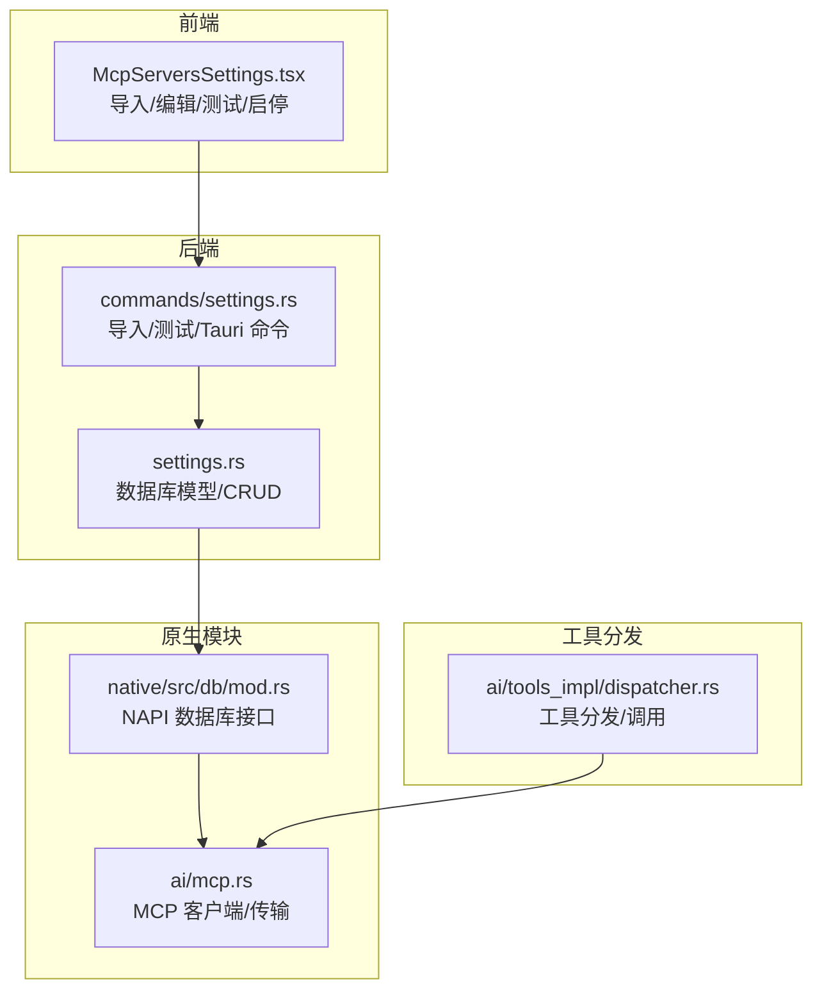
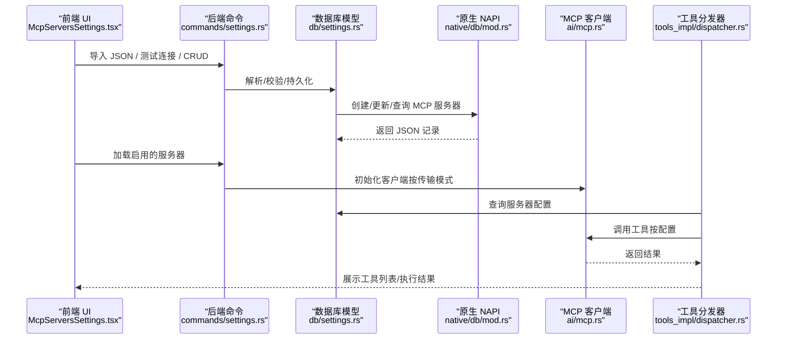
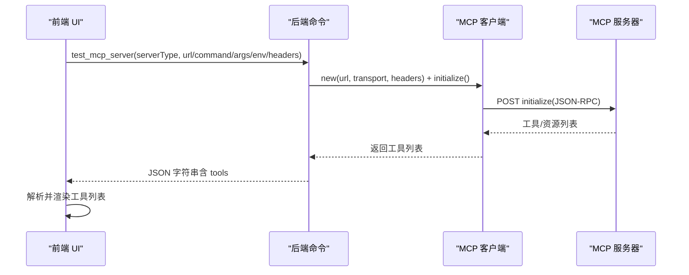
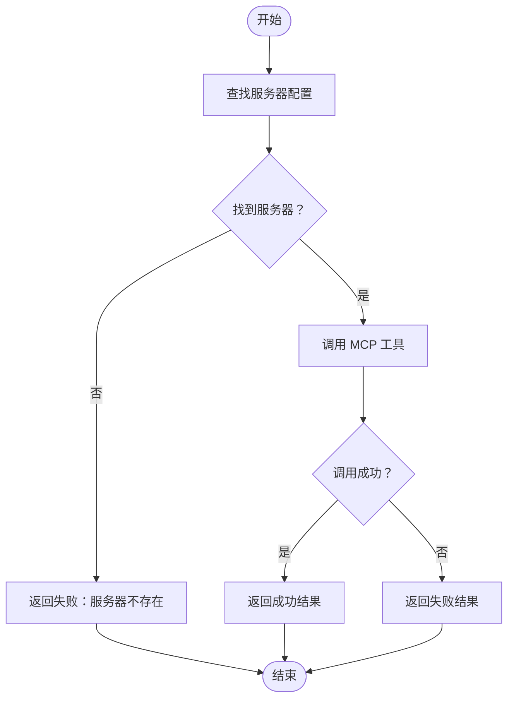
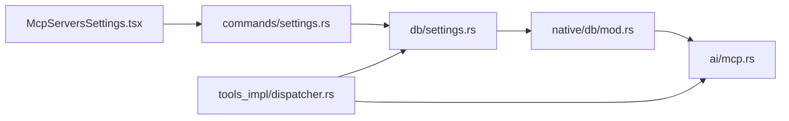

# MCP 服务器配置

<cite>
**本文引用的文件**
- [settings.rs](file://src-tauri\src\db\settings.rs)
- [settings.rs](file://src-tauri\src\commands\settings.rs)
- [mcp.rs](file://src-tauri\src\ai\mcp.rs)
- [dispatcher.rs](file://src-tauri\src\ai\tools_impl\dispatcher.rs)
- [McpServersSettings.tsx](file://src-web\src\components\settings\McpServersSettings.tsx)
- [MCP_JSON_CONFIG.md](file://docs\MCP_JSON_CONFIG.md)
- [MCP_STANDARD_CONFIG.md](file://docs\MCP_STANDARD_CONFIG.md)
- [MCP_SKILL_IMPLEMENTATION.md](file://docs\MCP_SKILL_IMPLEMENTATION.md)
- [mod.rs](file://native\src\db\mod.rs)
</cite>

## 目录
1. [简介](#简介)
2. [项目结构](#项目结构)
3. [核心组件](#核心组件)
4. [架构总览](#架构总览)
5. [详细组件分析](#详细组件分析)
6. [依赖关系分析](#依赖关系分析)
7. [性能考量](#性能考量)
8. [故障排除指南](#故障排除指南)
9. [结论](#结论)
10. [附录](#附录)

## 简介
本文件面向 CoSurf 的 MCP（Model Context Protocol）服务器配置，系统性梳理四种传输模式（stdio、http、streamableHttp、sse）的配置参数与行为差异，解释服务器连接测试机制与工具发现流程，提供完整的配置示例（本地命令行工具与远程 HTTP 服务），说明配置的导入导出与 JSON 格式规范，以及启用/禁用状态管理与超时配置。同时给出故障排除与性能监控建议，并覆盖安全配置、认证与访问控制要点，最后提供第三方 MCP 服务器的集成示例与最佳实践。

## 项目结构
CoSurf 的 MCP 配置涉及前端 UI、后端命令与数据库、原生模块与工具分发器等多层协作：
- 前端：MCP 服务器设置界面负责导入/编辑/测试/启停
- 后端：Tauri 命令处理导入、测试、CRUD；数据库持久化配置
- 原生模块：提供 MCP 客户端与传输层（HTTP/SSE/StreamableHttp/stdio）
- 工具分发器：根据配置选择对应 MCP Server 并执行工具调用

图表来源
- [McpServersSettings.tsx:104-127](file://src-web\src\components\settings\McpServersSettings.tsx#L104-L127)
- [settings.rs:264-297](file://src-tauri\src\commands\settings.rs#L264-L297)
- [settings.rs:378-426](file://src-tauri\src\db\settings.rs#L378-L426)
- [mod.rs:1021-1145](file://native\src\db\mod.rs#L1021-L1145)
- [mcp.rs:46-104](file://src-tauri\src\ai\mcp.rs#L46-L104)
- [dispatcher.rs:139-204](file://src-tauri\src\ai\tools_impl\dispatcher.rs#L139-L204)

章节来源
- [McpServersSettings.tsx:104-127](file://src-web\src\components\settings\McpServersSettings.tsx#L104-L127)
- [settings.rs:378-426](file://src-tauri\src\db\settings.rs#L378-L426)

## 核心组件
- MCP 服务器类型与配置模型：支持四种传输模式（Http、StreamableHttp、Sse、Stdio），并包含通用字段（url、command、args、cwd、env、disabled、timeout）与内部字段（enabled、created_at、updated_at）
- Tauri 命令：提供导入 JSON、测试连接、CRUD 等后端接口
- 原生 NAPI 接口：封装数据库操作，支持 MCP 服务器的创建/更新/查询
- MCP 客户端：抽象传输层，支持 HTTP/SSE/StreamableHttp/stdio 初始化与工具发现
- 工具分发器：按配置选择服务器并执行工具调用

章节来源
- [settings.rs:27-118](file://src-tauri\src\db\settings.rs#L27-L118)
- [settings.rs:264-297](file://src-tauri\src\commands\settings.rs#L264-L297)
- [mod.rs:1021-1145](file://native\src\db\mod.rs#L1021-L1145)
- [mcp.rs:46-104](file://src-tauri\src\ai\mcp.rs#L46-L104)
- [dispatcher.rs:139-204](file://src-tauri\src\ai\tools_impl\dispatcher.rs#L139-L204)

## 架构总览
下图展示从 UI 到后端再到原生模块与 MCP 客户端的整体调用链路，以及工具分发器如何根据配置选择服务器并执行工具调用。

图表来源
- [McpServersSettings.tsx:104-184](file://src-web\src\components\settings\McpServersSettings.tsx#L104-L184)
- [settings.rs:264-297](file://src-tauri\src\commands\settings.rs#L264-L297)
- [settings.rs:378-526](file://src-tauri\src\db\settings.rs#L378-L526)
- [mod.rs:1021-1145](file://native\src\db\mod.rs#L1021-L1145)
- [mcp.rs:46-104](file://src-tauri\src\ai\mcp.rs#L46-L104)
- [dispatcher.rs:139-204](file://src-tauri\src\ai\tools_impl\dispatcher.rs#L139-L204)

## 详细组件分析

### 四种传输模式与配置参数
- Http（HTTP/SSE）
  - 关键参数：url（必填）、headers（可选）
  - 适用场景：远程 MCP 服务器，支持 HTTP POST JSON-RPC 或 SSE
- StreamableHttp（流式 HTTP）
  - 关键参数：url（必填）、headers（可选）
  - 适用场景：遵循 MCP 新标准的流式 HTTP 服务器
- Sse（Server-Sent Events）
  - 关键参数：url（必填）、headers（可选）
  - 适用场景：需要持续推送事件的服务器
- Stdio（本地进程）
  - 关键参数：command（必填）、args（必填）、cwd（可选）、env（可选）
  - 适用场景：本地命令行 MCP 服务器（如 npx/uvx/node）

章节来源
- [settings.rs:27-69](file://src-tauri\src\db\settings.rs#L27-L69)
- [MCP_STANDARD_CONFIG.md:63-80](file://docs\MCP_STANDARD_CONFIG.md#L63-L80)

### 服务器连接测试机制与工具发现流程
- 前端触发测试：根据服务器类型构造请求参数（url/command/args/env/headers），调用后端命令
- 后端命令处理：解析传输模式（sse -> Sse，其他 -> StreamableHttp），创建 MCP 客户端并初始化
- MCP 客户端初始化：构建 JSON-RPC initialize 请求，发送至服务器，返回可用工具列表
- 前端解析结果：将返回的 JSON 字符串解析为对象，提取 tools 字段并在 UI 中展示

图表来源
- [settings.rs:264-297](file://src-tauri\src\commands\settings.rs#L264-L297)
- [mcp.rs:62-104](file://src-tauri\src\ai\mcp.rs#L62-L104)
- [McpServersSettings.tsx:139-181](file://src-web\src\components\settings\McpServersSettings.tsx#L139-L181)

章节来源
- [settings.rs:264-297](file://src-tauri\src\commands\settings.rs#L264-L297)
- [mcp.rs:62-104](file://src-tauri\src\ai\mcp.rs#L62-L104)
- [McpServersSettings.tsx:139-181](file://src-web\src\components\settings\McpServersSettings.tsx#L139-L181)

### 工具分发与调用
- 分发器根据工具调用请求定位目标服务器（按名称匹配）
- 若服务器存在且启用，则直接调用 MCP 工具；否则返回失败信息
- 调用结果统一包装为 ToolResult，包含输出与成功标记

图表来源
- [dispatcher.rs:139-204](file://src-tauri\src\ai\tools_impl\dispatcher.rs#L139-L204)

章节来源
- [dispatcher.rs:139-204](file://src-tauri\src\ai\tools_impl\dispatcher.rs#L139-L204)

### 配置导入与导出（JSON 格式）
- 导入：前端提供 JSON 编辑器，后端命令解析 mcpServers 对象，逐项创建 MCP 服务器记录
- 导出：当前文档未提供导出命令，可在后续迭代中实现
- 字段映射：支持 command/args/cwd/url/env/disabled/timeout 等字段，兼容标准 MCP JSON

章节来源
- [MCP_JSON_CONFIG.md:13-44](file://docs\MCP_JSON_CONFIG.md#L13-L44)
- [MCP_STANDARD_CONFIG.md:13-57](file://docs\MCP_STANDARD_CONFIG.md#L13-L57)
- [settings.rs:508-532](file://src-tauri\src\commands\settings.rs#L508-L532)

### 启用/禁用状态管理与超时配置
- 状态管理：disabled 字段映射为 enabled（disabled=true 时 enabled=false），数据库中以 enabled 存储
- 超时配置：timeout 字段以秒为单位，用于 MCP 请求的超时控制
- 前端 UI：支持切换启用/禁用，测试按钮用于刷新工具列表

章节来源
- [settings.rs:103-118](file://src-tauri\src\db\settings.rs#L103-L118)
- [McpServersSettings.tsx:277-289](file://src-web\src\components\settings\McpServersSettings.tsx#L277-L289)

### 安全配置、认证与访问控制
- 认证机制：通过 headers 传递 API Key（如 X-API-Key），避免在 JSON 中硬编码敏感信息
- 环境变量：通过 env 字段注入，建议使用占位符并在 UI 中编辑真实值
- 访问控制：disabled 字段用于禁用服务器，避免被工具分发器调用

章节来源
- [MCP_STANDARD_CONFIG.md:408-424](file://docs\MCP_STANDARD_CONFIG.md#L408-L424)
- [MCP_JSON_CONFIG.md:321-345](file://docs\MCP_JSON_CONFIG.md#L321-L345)
- [settings.rs:84-86](file://src-tauri\src\db\settings.rs#L84-L86)

### 第三方 MCP 服务器集成示例与最佳实践
- 常见服务器：@modelcontextprotocol/server-filesystem、@modelcontextprotocol/server-github、@modelcontextprotocol/server-brave-search、@upstash/context7-mcp、mcp-server-fetch 等
- 最佳实践：
  - 使用占位符存放敏感信息，导入后再在 UI 中填写真实值
  - 为不同服务器设置合理的 timeout
  - 为本地服务器设置 cwd，确保工作目录正确
  - 优先使用标准 JSON 配置，便于迁移与复用

章节来源
- [MCP_STANDARD_CONFIG.md:14-57](file://docs\MCP_STANDARD_CONFIG.md#L14-L57)
- [MCP_JSON_CONFIG.md:13-44](file://docs\MCP_JSON_CONFIG.md#L13-L44)

## 依赖关系分析
- 前端 UI 依赖后端命令进行导入/测试/CRUD
- 后端命令依赖数据库模型与原生 NAPI 接口
- 原生 NAPI 接口依赖数据库表结构与序列化/反序列化逻辑
- MCP 客户端依赖传输层（HTTP/SSE/StreamableHttp/stdio）
- 工具分发器依赖数据库查询与 MCP 客户端

图表来源
- [McpServersSettings.tsx:104-127](file://src-web\src\components\settings\McpServersSettings.tsx#L104-L127)
- [settings.rs:264-297](file://src-tauri\src\commands\settings.rs#L264-L297)
- [settings.rs:378-526](file://src-tauri\src\db\settings.rs#L378-L526)
- [mod.rs:1021-1145](file://native\src\db\mod.rs#L1021-L1145)
- [mcp.rs:46-104](file://src-tauri\src\ai\mcp.rs#L46-L104)
- [dispatcher.rs:139-204](file://src-tauri\src\ai\tools_impl\dispatcher.rs#L139-L204)

章节来源
- [settings.rs:378-526](file://src-tauri\src\db\settings.rs#L378-L526)
- [mod.rs:1021-1145](file://native\src\db\mod.rs#L1021-L1145)

## 性能考量
- 初始化延迟：约 100–300ms（取决于网络与服务器响应）
- 工具调用延迟：约 200–1000ms（取决于服务器负载与网络）
- 并发限制：取决于服务器端并发策略
- 内存占用：约 50KB/客户端
- 超时时间：默认 30 秒，可通过配置调整

章节来源
- [MCP_SKILL_IMPLEMENTATION.md:417-426](file://docs\MCP_SKILL_IMPLEMENTATION.md#L417-L426)

## 故障排除指南
- 导入失败（无效格式）：确认 JSON 顶层包含 mcpServers 对象
- 服务器无法启动：检查命令是否存在、参数是否正确、工作目录是否有效
- 环境变量不生效：确认 env 字段为对象格式，而非字符串
- 超时错误：适当提高 timeout 值
- 工具不存在：核对工具名称拼写与服务器支持范围

章节来源
- [MCP_STANDARD_CONFIG.md:443-491](file://docs\MCP_STANDARD_CONFIG.md#L443-L491)
- [MCP_JSON_CONFIG.md:382-422](file://docs\MCP_JSON_CONFIG.md#L382-L422)

## 结论
CoSurf 的 MCP 服务器配置已完全兼容开源标准，支持四种传输模式与丰富的配置字段。通过前端 UI、后端命令与原生模块的协同，实现了从配置导入、连接测试、工具发现到工具调用的完整闭环。建议在生产环境中采用占位符管理敏感信息、合理设置超时与工作目录，并结合禁用标志进行细粒度的访问控制。

## 附录

### 配置字段对照表
- 通用字段
  - name：服务器名称
  - server_type：传输模式（http/streamableHttp/sse/stdio）
  - disabled：是否禁用（映射为 enabled=false）
  - timeout：超时时间（秒）
  - env：环境变量（对象）
- Http/Sse/StreamableHttp 模式
  - url：服务器地址
  - headers：自定义请求头（如 API Key）
- Stdio 模式
  - command：启动命令
  - args：命令行参数数组
  - cwd：工作目录

章节来源
- [settings.rs:74-118](file://src-tauri\src\db\settings.rs#L74-L118)
- [MCP_STANDARD_CONFIG.md:61-80](file://docs\MCP_STANDARD_CONFIG.md#L61-L80)

### 数据库表结构（简化）
- mcp_servers：id、name、server_type、url、command、args、cwd、env、disabled、timeout、enabled、created_at、updated_at、headers

章节来源
- [settings.rs:119-137](file://src-tauri\src\db\settings.rs#L119-L137)
- [mod.rs:1021-1024](file://native\src\db\mod.rs#L1021-L1024)