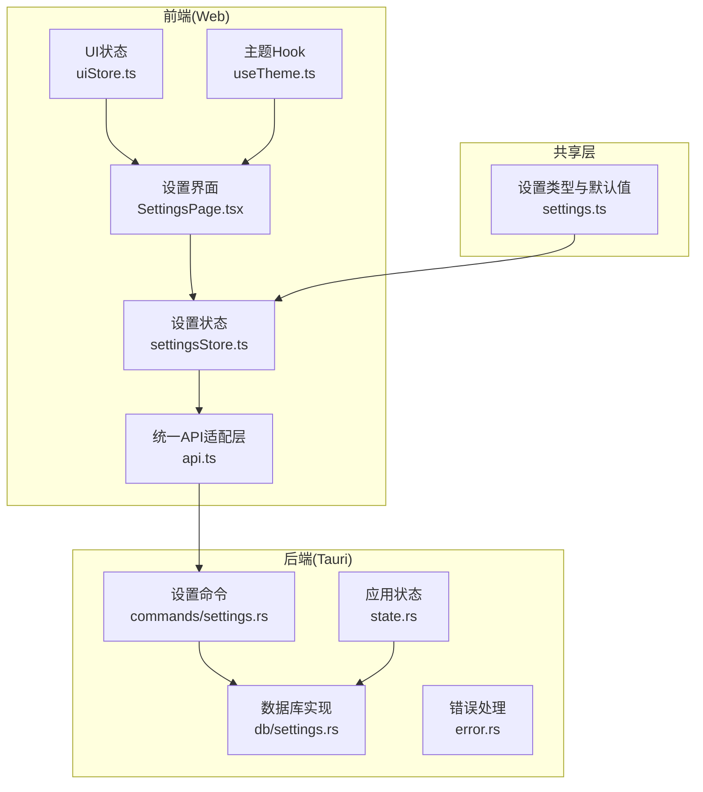
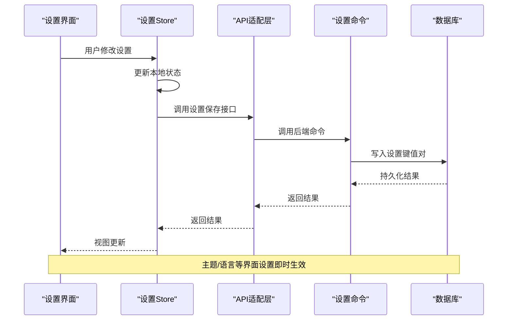
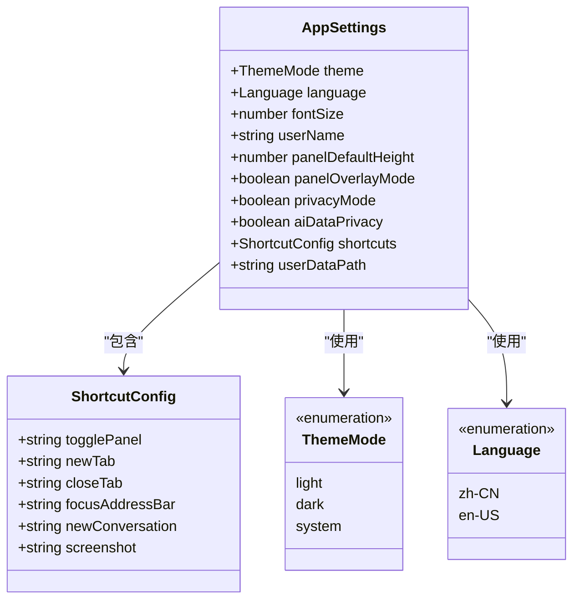
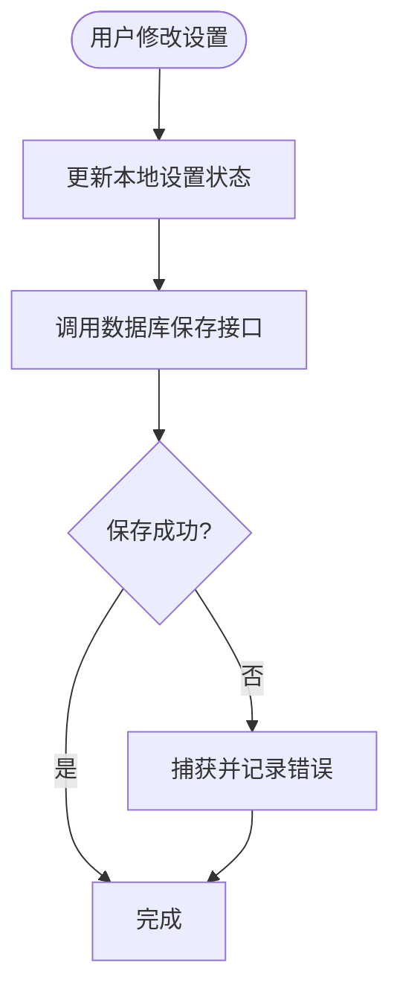
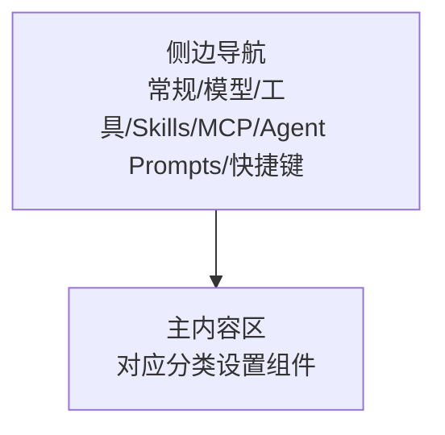
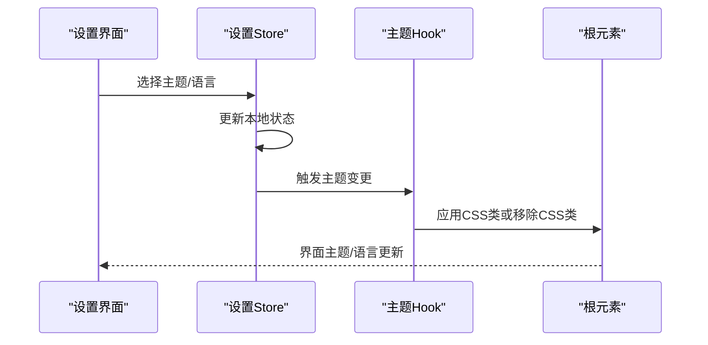
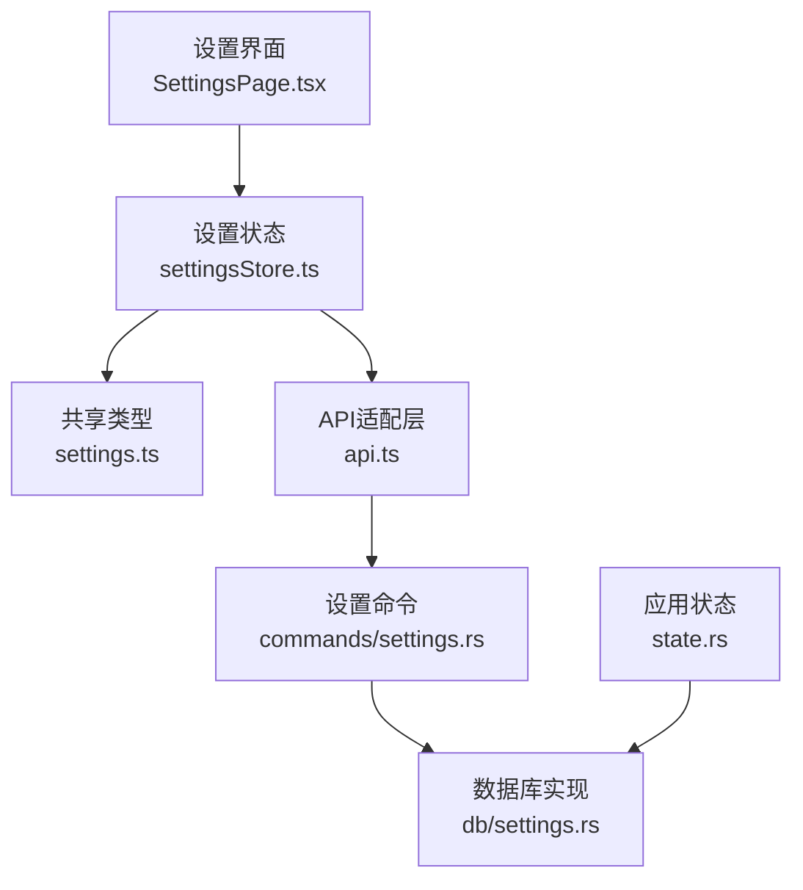

# 应用设置

<cite>
**本文档引用的文件**
- [settings.ts](file://packages/shared/src/settings.ts)
- [settingsStore.ts](file://src-web/src/stores/settingsStore.ts)
- [SettingsPage.tsx](file://src-web/src/components/settings/SettingsPage.tsx)
- [uiStore.ts](file://src-web/src/stores/uiStore.ts)
- [useTheme.ts](file://src-web/src/hooks/useTheme.ts)
- [api.ts](file://src-web/src/lib/api.ts)
- [settings.rs](file://src-tauri/src/db/settings.rs)
- [settings.rs](file://src-tauri/src/commands/settings.rs)
- [state.rs](file://src-tauri/src/state.rs)
- [error.rs](file://src-tauri/src/error.rs)
</cite>

## 目录
1. [简介](#简介)
2. [项目结构](#项目结构)
3. [核心组件](#核心组件)
4. [架构概览](#架构概览)
5. [详细组件分析](#详细组件分析)
6. [依赖关系分析](#依赖关系分析)
7. [性能考量](#性能考量)
8. [故障排除指南](#故障排除指南)
9. [结论](#结论)
10. [附录](#附录)

## 简介
本文件为 CoSurf 应用的设置配置文档，覆盖应用级别的配置项、持久化存储机制、数据同步策略、设置分类组织、界面布局、验证规则与错误处理、备份恢复与迁移、批量导入导出与模板、权限控制与安全、动态更新与重启需求，以及性能优化相关的设置选项与最佳实践。

## 项目结构
CoSurf 的设置系统采用前端状态管理 + 后端数据库的分层设计：
- 共享类型定义位于 packages/shared，定义了应用设置的数据结构与默认值
- 前端使用 Zustand 管理设置状态，并通过统一 API 层调用后端命令
- 后端使用 SQLite 存储设置与模型配置，提供 Tauri 命令接口
- 主题与语言等界面相关设置通过前端 Hook 动态应用

**图表来源**
- [SettingsPage.tsx:1-145](file://src-web/src/components/settings/SettingsPage.tsx#L1-L145)
- [settingsStore.ts:1-201](file://src-web/src/stores/settingsStore.ts#L1-L201)
- [api.ts:118-249](file://src-web/src/lib/api.ts#L118-L249)
- [settings.rs:9-34](file://src-tauri/src/commands/settings.rs#L9-L34)
- [settings.rs:179-215](file://src-tauri/src/db/settings.rs#L179-L215)
- [state.rs:25-79](file://src-tauri/src/state.rs#L25-L79)
- [error.rs:4-64](file://src-tauri/src/error.rs#L4-L64)

**章节来源**
- [settings.ts:1-47](file://packages/shared/src/settings.ts#L1-L47)
- [settingsStore.ts:1-201](file://src-web/src/stores/settingsStore.ts#L1-L201)
- [SettingsPage.tsx:1-145](file://src-web/src/components/settings/SettingsPage.tsx#L1-L145)
- [api.ts:118-249](file://src-web/src/lib/api.ts#L118-L249)
- [settings.rs:9-34](file://src-tauri/src/commands/settings.rs#L9-L34)
- [settings.rs:179-215](file://src-tauri/src/db/settings.rs#L179-L215)
- [state.rs:25-79](file://src-tauri/src/state.rs#L25-L79)
- [error.rs:4-64](file://src-tauri/src/error.rs#L4-L64)

## 核心组件
- 设置类型与默认值：定义应用设置的数据结构、枚举类型与默认值
- 设置状态管理：前端 Zustand store，负责设置的读取、更新与持久化
- 设置界面：多标签页设置页面，包含常规、模型、工具、Skills、MCP Servers、Agent Prompts、快捷键等
- 统一 API 适配层：封装后端命令调用，提供一致的接口
- 后端命令与数据库：提供设置读写、模型配置、MCP 服务器配置等命令
- 主题 Hook：根据设置动态切换主题
- UI 状态：控制设置窗口的打开/关闭与标签页切换

**章节来源**
- [settings.ts:1-47](file://packages/shared/src/settings.ts#L1-L47)
- [settingsStore.ts:1-201](file://src-web/src/stores/settingsStore.ts#L1-L201)
- [SettingsPage.tsx:28-140](file://src-web/src/components/settings/SettingsPage.tsx#L28-L140)
- [api.ts:118-249](file://src-web/src/lib/api.ts#L118-L249)
- [settings.rs:9-34](file://src-tauri/src/commands/settings.rs#L9-L34)
- [settings.rs:179-215](file://src-tauri/src/db/settings.rs#L179-L215)
- [useTheme.ts:1-25](file://src-web/src/hooks/useTheme.ts#L1-L25)
- [uiStore.ts:1-99](file://src-web/src/stores/uiStore.ts#L1-L99)

## 架构概览
设置系统的数据流从界面触发，经过状态管理，调用统一 API，最终由后端命令访问数据库完成持久化。主题与语言等界面相关设置通过 Hook 即时生效。

**图表来源**
- [SettingsPage.tsx:147-267](file://src-web/src/components/settings/SettingsPage.tsx#L147-L267)
- [settingsStore.ts:76-90](file://src-web/src/stores/settingsStore.ts#L76-L90)
- [api.ts:118-126](file://src-web/src/lib/api.ts#L118-L126)
- [settings.rs:27-34](file://src-tauri/src/commands/settings.rs#L27-L34)
- [settings.rs:180-197](file://src-tauri/src/db/settings.rs#L180-L197)

## 详细组件分析

### 设置数据模型与默认值
应用设置的核心数据结构定义于共享包中，包含主题、语言、字体大小、用户名称、面板高度、隐私模式、快捷键配置等。快捷键配置包含多个常用操作的组合键。默认值提供了开箱即用的体验。

**图表来源**
- [settings.ts:5-17](file://packages/shared/src/settings.ts#L5-L17)
- [settings.ts:19-26](file://packages/shared/src/settings.ts#L19-L26)
- [settings.ts:28-46](file://packages/shared/src/settings.ts#L28-L46)

**章节来源**
- [settings.ts:1-47](file://packages/shared/src/settings.ts#L1-L47)

### 设置状态管理与持久化
前端使用 Zustand 管理设置状态，提供设置更新方法。当用户修改设置时，状态会先更新本地状态，然后异步调用数据库接口进行持久化。错误处理在状态管理中捕获并记录。

**图表来源**
- [settingsStore.ts:76-90](file://src-web/src/stores/settingsStore.ts#L76-L90)
- [api.ts:118-126](file://src-web/src/lib/api.ts#L118-L126)

**章节来源**
- [settingsStore.ts:1-201](file://src-web/src/stores/settingsStore.ts#L1-L201)
- [api.ts:118-126](file://src-web/src/lib/api.ts#L118-L126)

### 设置界面布局与分类
设置界面采用侧边导航 + 主内容区的布局，左侧为设置分类导航，右侧为主内容区。支持的设置分类包括：常规、模型、工具、Skills、MCP Servers、Agent Prompts、快捷键。每个分类对应独立的设置组件。

**图表来源**
- [SettingsPage.tsx:28-140](file://src-web/src/components/settings/SettingsPage.tsx#L28-L140)
- [uiStore.ts:3-4](file://src-web/src/stores/uiStore.ts#L3-L4)

**章节来源**
- [SettingsPage.tsx:1-145](file://src-web/src/components/settings/SettingsPage.tsx#L1-L145)
- [uiStore.ts:1-99](file://src-web/src/stores/uiStore.ts#L1-L99)

### 主题与语言设置
主题支持浅色、深色与跟随系统三种模式，语言支持简体中文与英文。主题切换通过 Hook 动态应用到根元素，语言设置影响界面文本显示。

**图表来源**
- [SettingsPage.tsx:147-267](file://src-web/src/components/settings/SettingsPage.tsx#L147-L267)
- [useTheme.ts:1-25](file://src-web/src/hooks/useTheme.ts#L1-L25)
- [settingsStore.ts:58-74](file://src-web/src/stores/settingsStore.ts#L58-L74)

**章节来源**
- [SettingsPage.tsx:147-267](file://src-web/src/components/settings/SettingsPage.tsx#L147-L267)
- [useTheme.ts:1-25](file://src-web/src/hooks/useTheme.ts#L1-L25)
- [settingsStore.ts:58-74](file://src-web/src/stores/settingsStore.ts#L58-L74)

### 快捷键配置
快捷键配置包含多个常用操作的组合键，如切换 AI 面板、新建标签页、关闭标签页、聚焦地址栏、新建对话、截图等。界面以只读形式展示当前快捷键配置。

**章节来源**
- [settings.ts:19-26](file://packages/shared/src/settings.ts#L19-L26)
- [SettingsPage.tsx:731-759](file://src-web/src/components/settings/SettingsPage.tsx#L731-L759)

### 模型配置管理
模型配置支持添加、编辑、删除与激活操作。前端提供表单界面，后端通过命令持久化到数据库。模型配置包含提供商、模型 ID、API Key、Base URL、温度、Top P、最大 Token 数等参数。

**章节来源**
- [SettingsPage.tsx:269-590](file://src-web/src/components/settings/SettingsPage.tsx#L269-L590)
- [settingsStore.ts:101-159](file://src-web/src/stores/settingsStore.ts#L101-L159)
- [settings.rs:217-337](file://src-tauri/src/db/settings.rs#L217-L337)

### Skills 目录与 IQS API Key
Skills 目录配置支持查看与修改，修改后会重新初始化 SkillsManager 并加载 Skills。IQS API Key 支持查看与保存，保存后会在界面显示成功状态。

**章节来源**
- [SettingsPage.tsx:592-729](file://src-web/src/components/settings/SettingsPage.tsx#L592-L729)
- [settingsStore.ts:161-199](file://src-web/src/stores/settingsStore.ts#L161-L199)
- [settings.rs:109-165](file://src-tauri/src/commands/settings.rs#L109-L165)
- [settings.rs:341-376](file://src-tauri/src/db/settings.rs#L341-L376)

### MCP Servers 配置与批量导入
MCP Servers 支持查看、新增、编辑、删除与连接测试。支持从 JSON 格式批量导入 MCP 服务器配置，兼容开源标准格式。

**章节来源**
- [settings.rs:199-306](file://src-tauri/src/commands/settings.rs#L199-L306)
- [settings.rs:508-614](file://src-tauri/src/commands/settings.rs#L508-L614)
- [settings.rs:378-538](file://src-tauri/src/db/settings.rs#L378-L538)

### 后端命令与数据库交互
后端提供统一的设置读写命令，以及模型配置、MCP 服务器配置等命令。数据库层负责设置键值对的存储与查询，支持 JSON 值的解析与序列化。

**章节来源**
- [settings.rs:9-614](file://src-tauri/src/commands/settings.rs#L9-L614)
- [settings.rs:179-215](file://src-tauri/src/db/settings.rs#L179-L215)
- [state.rs:25-79](file://src-tauri/src/state.rs#L25-L79)
- [error.rs:4-64](file://src-tauri/src/error.rs#L4-L64)

## 依赖关系分析
设置系统的关键依赖关系如下：
- 前端设置界面依赖设置状态管理与统一 API 适配层
- 设置状态管理依赖共享类型定义
- 统一 API 适配层依赖后端命令
- 后端命令依赖数据库实现
- 应用状态初始化依赖数据库中的 Skills 目录配置

**图表来源**
- [SettingsPage.tsx:1-145](file://src-web/src/components/settings/SettingsPage.tsx#L1-L145)
- [settingsStore.ts:1-201](file://src-web/src/stores/settingsStore.ts#L1-L201)
- [settings.ts:1-47](file://packages/shared/src/settings.ts#L1-L47)
- [api.ts:118-249](file://src-web/src/lib/api.ts#L118-L249)
- [settings.rs:9-34](file://src-tauri/src/commands/settings.rs#L9-L34)
- [settings.rs:179-215](file://src-tauri/src/db/settings.rs#L179-L215)
- [state.rs:25-79](file://src-tauri/src/state.rs#L25-L79)

**章节来源**
- [SettingsPage.tsx:1-145](file://src-web/src/components/settings/SettingsPage.tsx#L1-L145)
- [settingsStore.ts:1-201](file://src-web/src/stores/settingsStore.ts#L1-L201)
- [settings.ts:1-47](file://packages/shared/src/settings.ts#L1-L47)
- [api.ts:118-249](file://src-web/src/lib/api.ts#L118-L249)
- [settings.rs:9-34](file://src-tauri/src/commands/settings.rs#L9-L34)
- [settings.rs:179-215](file://src-tauri/src/db/settings.rs#L179-L215)
- [state.rs:25-79](file://src-tauri/src/state.rs#L25-L79)

## 性能考量
- 状态更新批量化：前端设置更新采用批量提交，减少数据库写入次数
- 主题切换即时性：主题切换通过 CSS 类切换实现，避免重渲染
- UI 状态限制：侧边栏宽度、AI 面板宽度等 UI 参数进行范围限制，防止极端值影响性能
- 数据库查询优化：设置读取采用一次性查询返回所有键值对，减少多次往返

**章节来源**
- [settingsStore.ts:76-90](file://src-web/src/stores/settingsStore.ts#L76-L90)
- [useTheme.ts:1-25](file://src-web/src/hooks/useTheme.ts#L1-L25)
- [uiStore.ts:53-69](file://src-web/src/stores/uiStore.ts#L53-L69)
- [settings.rs:199-215](file://src-tauri/src/db/settings.rs#L199-L215)

## 故障排除指南
- 设置保存失败：检查数据库锁状态与网络连接，查看错误码与错误信息
- 主题切换无效：确认主题 Hook 是否正确应用 CSS 类，检查浏览器开发者工具中的类名变化
- Skills 目录修改后未生效：确认目录存在且有读写权限，检查后端日志中的目录创建与加载过程
- IQS API Key 保存异常：检查密钥格式与长度，查看后端日志中的保存过程
- MCP 服务器连接测试失败：检查服务器类型与配置，查看超时与解析错误信息

**章节来源**
- [error.rs:41-61](file://src-tauri/src/error.rs#L41-L61)
- [settings.rs:264-486](file://src-tauri/src/commands/settings.rs#L264-L486)
- [settings.rs:109-165](file://src-tauri/src/commands/settings.rs#L109-L165)

## 结论
CoSurf 的设置系统通过清晰的分层架构实现了配置项的完整管理，从前端界面到后端持久化的全链路都有完善的错误处理与性能优化。设置项覆盖界面主题、语言、快捷键、模型配置、Skills 目录、MCP 服务器等多个方面，满足不同用户场景的需求。

## 附录

### 设置项列表与默认值
- 主题：light/dark/system（默认：system）
- 语言：zh-CN/en-US（默认：zh-CN）
- 字体大小：数值（默认：14）
- 用户名称：字符串（默认：CoCo）
- AI 面板默认高度：数值（默认：300）
- 面板覆盖模式：布尔值（默认：true）
- 隐私模式：布尔值（默认：false）
- AI 数据隐私：布尔值（默认：false）
- 用户数据路径：字符串（默认：空字符串，表示使用系统默认路径）

**章节来源**
- [settings.ts:28-46](file://packages/shared/src/settings.ts#L28-L46)

### 设置验证规则与错误处理
- 设置保存：前端捕获保存异常并记录日志
- 数据库操作：后端命令包装错误为统一的错误响应
- 主题切换：Hook 根据系统偏好自动切换
- Skills 目录：自动创建不存在的目录并加载 Skills

**章节来源**
- [settingsStore.ts:76-90](file://src-web/src/stores/settingsStore.ts#L76-L90)
- [error.rs:41-61](file://src-tauri/src/error.rs#L41-L61)
- [useTheme.ts:7-23](file://src-web/src/hooks/useTheme.ts#L7-L23)
- [settings.rs:341-376](file://src-tauri/src/db/settings.rs#L341-L376)

### 备份恢复与迁移
- 备份：通过数据库导出所有设置键值对
- 恢复：通过数据库导入设置键值对
- 迁移：Skills 目录修改后需手动迁移原有 Skills 文件

**章节来源**
- [settings.rs:199-215](file://src-tauri/src/db/settings.rs#L199-L215)
- [settings.rs:341-376](file://src-tauri/src/db/settings.rs#L341-L376)

### 批量导入导出与模板
- 批量导入：支持从 JSON 格式批量导入 MCP 服务器配置
- 批量导出：可导出当前设置为 JSON 格式
- 模板：提供开源标准 MCP JSON 格式的模板

**章节来源**
- [settings.rs:508-614](file://src-tauri/src/commands/settings.rs#L508-L614)

### 权限控制与安全
- API Key 存储：IQS API Key 通过数据库安全存储
- 目录权限：Skills 目录需具备读写权限
- 错误隔离：后端命令使用锁保护数据库访问

**章节来源**
- [settings.rs:366-376](file://src-tauri/src/db/settings.rs#L366-L376)
- [settings.rs:109-165](file://src-tauri/src/commands/settings.rs#L109-L165)
- [error.rs:41-61](file://src-tauri/src/error.rs#L41-L61)

### 动态更新与重启需求
- 主题与语言：无需重启即可生效
- Skills 目录：修改后需重新初始化并加载 Skills
- 模型配置：激活模型后立即生效

**章节来源**
- [useTheme.ts:1-25](file://src-web/src/hooks/useTheme.ts#L1-L25)
- [settings.rs:109-165](file://src-tauri/src/commands/settings.rs#L109-L165)
- [settings.rs:319-329](file://src-tauri/src/db/settings.rs#L319-L329)