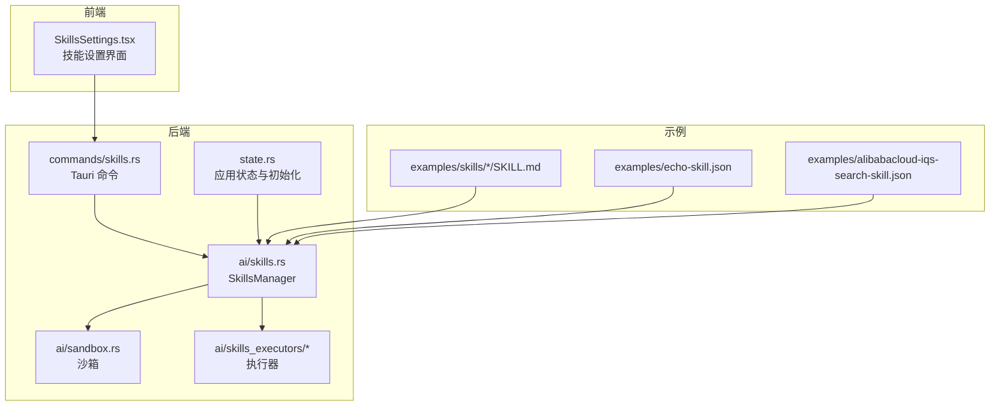
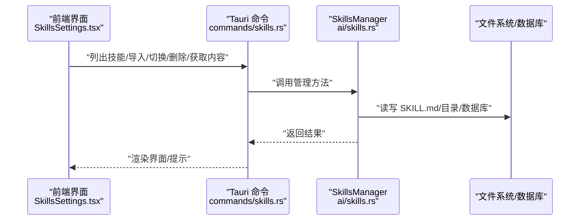
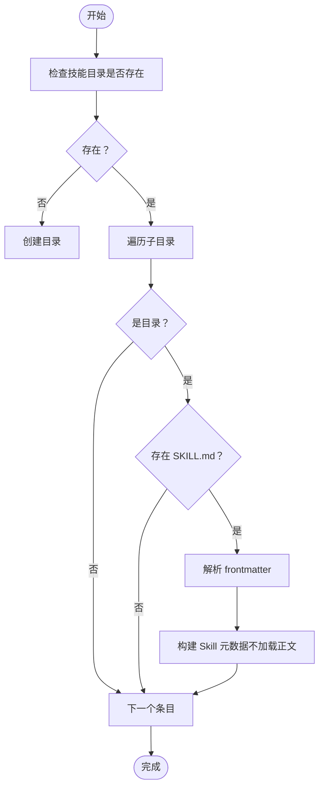
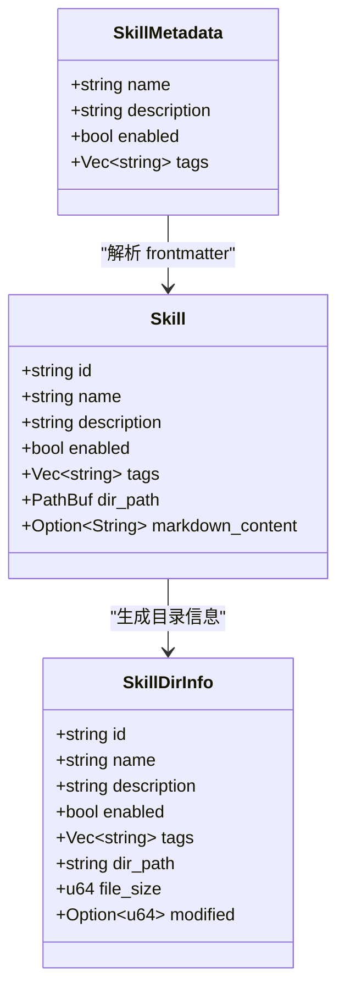
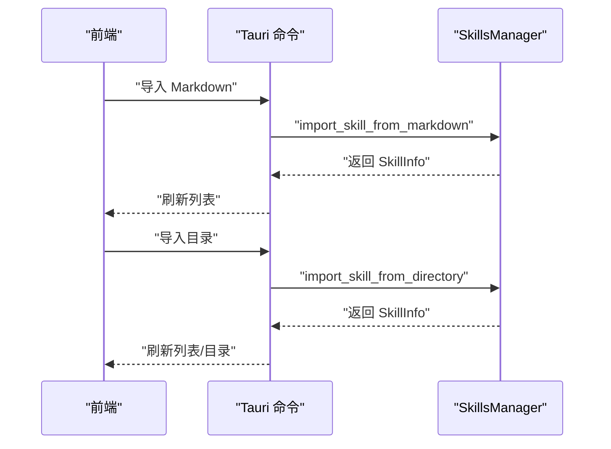
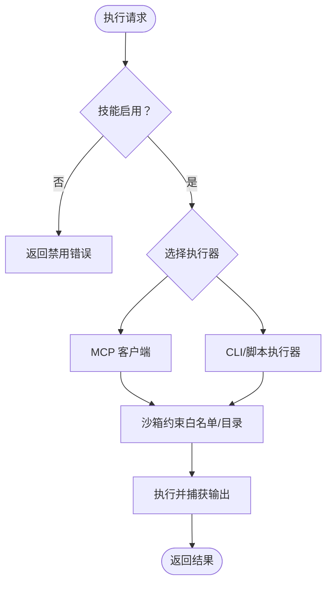
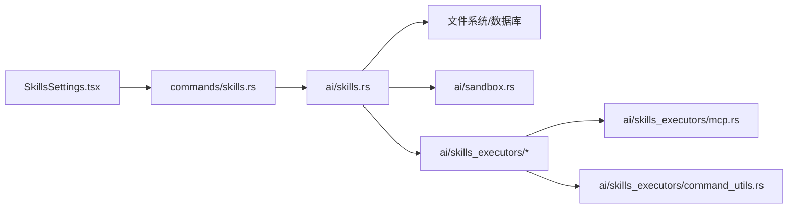
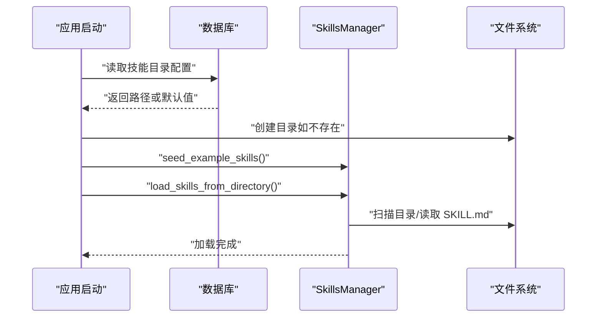

# 技能配置

<cite>
**本文引用的文件**
- [src-tauri/src/ai/skills.rs](file://src-tauri/src/ai/skills.rs)
- [src-tauri/src/state.rs](file://src-tauri/src/state.rs)
- [src-tauri/src/commands/skills.rs](file://src-tauri/src/commands/skills.rs)
- [src-web/src/components/settings/SkillsSettings.tsx](file://src-web/src/components/settings/SkillsSettings.tsx)
- [src-tauri/src/ai/sandbox.rs](file://src-tauri/src/ai/sandbox.rs)
- [src-tauri/src/ai/skills_executors/mod.rs](file://src-tauri/src/ai/skills_executors/mod.rs)
- [src-tauri/src/ai/skills_executors/mcp.rs](file://src-tauri/src/ai/skills_executors/mcp.rs)
- [src-tauri/src/ai/skills_executors/command_utils.rs](file://src-tauri/src/ai/skills_executors/command_utils.rs)
- [examples/skills/python-calculator/SKILL.md](file://examples/skills/python-calculator/SKILL.md)
- [examples/echo-skill.json](file://examples/echo-skill.json)
- [examples/alibabacloud-iqs-search-skill.json](file://examples/alibabacloud-iqs-search-skill.json)
- [docs/SKILLS_REFACTORING.md](file://docs/SKILLS_REFACTORING.md)
- [docs/SKILLS_ENGINE_REFACTORING.md](file://docs/SKILLS_ENGINE_REFACTORING.md)
</cite>

## 目录
1. [简介](#简介)
2. [项目结构](#项目结构)
3. [核心组件](#核心组件)
4. [架构总览](#架构总览)
5. [详细组件分析](#详细组件分析)
6. [依赖分析](#依赖分析)
7. [性能考量](#性能考量)
8. [故障排查指南](#故障排查指南)
9. [结论](#结论)
10. [附录](#附录)

## 简介
本文件面向 CoSurf 的“技能配置”主题，系统化梳理技能目录的配置与管理机制，覆盖技能的自动发现、加载与初始化流程；技能配置的数据结构与验证规则；导入导出与批量管理方法；启用/禁用状态与依赖关系处理；热重载与运行时更新支持；执行环境隔离与安全沙箱；以及自定义技能的开发与配置指南，并补充调试与性能监控要点。

## 项目结构
围绕技能配置的关键代码分布在 Tauri 后端、Web 前端与示例技能三部分：
- 后端（Rust）：技能管理器、命令接口、状态初始化、沙箱与执行器
- 前端（React）：技能设置界面，提供目录配置、导入导出、启用/禁用、内容预览等
- 示例：Markdown 格式的 SKILL.md 与 JSON 格式的技能配置样例

**图表来源**
- [src-web/src/components/settings/SkillsSettings.tsx](file://src-web/src/components/settings/SkillsSettings.tsx)
- [src-tauri/src/commands/skills.rs](file://src-tauri/src/commands/skills.rs)
- [src-tauri/src/state.rs](file://src-tauri/src/state.rs)
- [src-tauri/src/ai/skills.rs](file://src-tauri/src/ai/skills.rs)
- [src-tauri/src/ai/sandbox.rs](file://src-tauri/src/ai/sandbox.rs)
- [src-tauri/src/ai/skills_executors/mod.rs](file://src-tauri/src/ai/skills_executors/mod.rs)
- [examples/skills/python-calculator/SKILL.md](file://examples/skills/python-calculator/SKILL.md)
- [examples/echo-skill.json](file://examples/echo-skill.json)
- [examples/alibabacloud-iqs-search-skill.json](file://examples/alibabacloud-iqs-search-skill.json)

**章节来源**
- [src-web/src/components/settings/SkillsSettings.tsx](file://src-web/src/components/settings/SkillsSettings.tsx)
- [src-tauri/src/commands/skills.rs](file://src-tauri/src/commands/skills.rs)
- [src-tauri/src/state.rs](file://src-tauri/src/state.rs)
- [src-tauri/src/ai/skills.rs](file://src-tauri/src/ai/skills.rs)

## 核心组件
- SkillsManager：负责技能目录扫描、元数据解析、懒加载、导入导出、启用/禁用、删除、目录信息列举等
- Tauri 命令：提供 list_skills、toggle_skill、import_skill_from_markdown、import_skill_from_directory、list_skill_files、get_skill_content 等接口
- AppState：应用启动时初始化 SkillsManager，加载示例技能并从数据库读取技能目录配置
- 前端设置页：提供技能目录选择、导入导出、启用/禁用、内容预览、批量操作等
- 沙箱与执行器：提供受限执行环境与 MCP/命令工具等执行能力（当前以 MCP 客户端为主）

**章节来源**
- [src-tauri/src/ai/skills.rs](file://src-tauri/src/ai/skills.rs)
- [src-tauri/src/commands/skills.rs](file://src-tauri/src/commands/skills.rs)
- [src-tauri/src/state.rs](file://src-tauri/src/state.rs)
- [src-web/src/components/settings/SkillsSettings.tsx](file://src-web/src/components/settings/SkillsSettings.tsx)
- [src-tauri/src/ai/sandbox.rs](file://src-tauri/src/ai/sandbox.rs)
- [src-tauri/src/ai/skills_executors/mod.rs](file://src-tauri/src/ai/skills_executors/mod.rs)

## 架构总览
技能配置的端到端流程包括：前端发起配置与管理操作 → Tauri 命令桥接到后端 → SkillsManager 执行具体操作 → 持久化到磁盘或数据库 → 前端刷新展示。

**图表来源**
- [src-web/src/components/settings/SkillsSettings.tsx](file://src-web/src/components/settings/SkillsSettings.tsx)
- [src-tauri/src/commands/skills.rs](file://src-tauri/src/commands/skills.rs)
- [src-tauri/src/ai/skills.rs](file://src-tauri/src/ai/skills.rs)

## 详细组件分析

### 技能目录与自动发现
- 目录结构：每个技能为一个独立目录，目录名为技能 ID，包含 SKILL.md 文件
- 自动发现：遍历技能目录，识别每个子目录下的 SKILL.md；若缺失则跳过
- 初始加载：仅解析 frontmatter（name/description/tags/enabled），正文内容采用懒加载
- 示例：examples/skills 下的 python-calculator 目录包含 SKILL.md

**图表来源**
- [src-tauri/src/ai/skills.rs](file://src-tauri/src/ai/skills.rs)
- [examples/skills/python-calculator/SKILL.md](file://examples/skills/python-calculator/SKILL.md)

**章节来源**
- [src-tauri/src/ai/skills.rs](file://src-tauri/src/ai/skills.rs)
- [examples/skills/python-calculator/SKILL.md](file://examples/skills/python-calculator/SKILL.md)

### 技能配置的数据结构与验证规则
- 数据结构
  - Skill：包含 id/name/description/enabled/tags/dir_path/markdown_content
  - SkillMetadata：frontmatter 解析结果（name/description/enabled/tags）
  - SkillDirInfo：前端展示用目录信息（含文件大小、修改时间等）
- 验证规则
  - frontmatter 必须以 YAML 形式包裹，使用三短横线分隔
  - enabled 默认为启用
  - 目录名作为技能 ID，要求为小写字母/数字/连字符组合（kebab-case）
  - 导入时会校验 SKILL.md 是否存在，解析 frontmatter 成功
- JSON 格式示例（CLI/Script/MCP 等类型）
  - echo-skill.json：CLI 类型，包含命令、参数模板、超时等
  - alibabacloud-iqs-search-skill.json：Script 类型，包含语言、源码、参数 schema 等

**图表来源**
- [src-tauri/src/ai/skills.rs](file://src-tauri/src/ai/skills.rs)

**章节来源**
- [src-tauri/src/ai/skills.rs](file://src-tauri/src/ai/skills.rs)
- [examples/echo-skill.json](file://examples/echo-skill.json)
- [examples/alibabacloud-iqs-search-skill.json](file://examples/alibabacloud-iqs-search-skill.json)

### 导入导出与批量管理
- 导入方式
  - 从 Markdown 文本导入：解析 frontmatter，生成目录与 SKILL.md
  - 从目录导入：复制整个目录到技能目录，随后重新加载
- 导出/批量
  - 列出技能目录信息（文件大小、修改时间、启用状态）
  - 前端可批量选择目录进行导入
- 前端交互
  - 选择技能目录（数据库持久化）
  - 导入 Markdown 或目录
  - 预览 SKILL.md 内容
  - 启用/禁用、删除技能

**图表来源**
- [src-tauri/src/commands/skills.rs](file://src-tauri/src/commands/skills.rs)
- [src-tauri/src/ai/skills.rs](file://src-tauri/src/ai/skills.rs)
- [src-web/src/components/settings/SkillsSettings.tsx](file://src-web/src/components/settings/SkillsSettings.tsx)

**章节来源**
- [src-tauri/src/commands/skills.rs](file://src-tauri/src/commands/skills.rs)
- [src-tauri/src/ai/skills.rs](file://src-tauri/src/ai/skills.rs)
- [src-web/src/components/settings/SkillsSettings.tsx](file://src-web/src/components/settings/SkillsSettings.tsx)

### 启用/禁用与依赖关系
- 启用/禁用：通过 toggle_skill 更新内存状态与 SKILL.md frontmatter 中的 enabled 字段
- 依赖关系：当前实现未提供显式依赖声明；可通过 SKILL.md 正文描述工具链依赖（如 web_search/open_url/summarize_page 等）
- 前端展示：目录列表与已加载技能列表均体现 enabled 状态

**章节来源**
- [src-tauri/src/ai/skills.rs](file://src-tauri/src/ai/skills.rs)
- [src-web/src/components/settings/SkillsSettings.tsx](file://src-web/src/components/settings/SkillsSettings.tsx)

### 热重载与运行时更新
- 当前实现：通过前端触发“设置技能目录”后，后端重新加载技能目录并刷新列表
- 增量更新（规划）：文档中提出使用文件系统监听实现增量导入/重载（notify 库），支持新增/修改/删除文件时自动处理
- 建议：结合数据库记录上次扫描时间，按需增量扫描，避免全量扫描带来的性能损耗

**章节来源**
- [src-tauri/src/state.rs](file://src-tauri/src/state.rs)
- [docs/SKILLS_REFACTORING.md](file://docs/SKILLS_REFACTORING.md)

### 执行环境隔离与安全沙箱
- 沙箱能力
  - 限制 CLI 命令执行（白名单）
  - 提供受限工作目录（web_pages/summaries/memories/history）
  - 基于白名单命令执行与文件读写隔离
- 当前状态：CLI 执行器仍可使用，但建议在生产中启用更严格的沙箱策略
- MCP 客户端：支持 Streamable HTTP 与 SSE 两种传输模式，具备超时与错误处理

**图表来源**
- [src-tauri/src/ai/sandbox.rs](file://src-tauri/src/ai/sandbox.rs)
- [src-tauri/src/ai/skills_executors/mcp.rs](file://src-tauri/src/ai/skills_executors/mcp.rs)
- [src-tauri/src/ai/skills_executors/command_utils.rs](file://src-tauri/src/ai/skills_executors/command_utils.rs)

**章节来源**
- [src-tauri/src/ai/sandbox.rs](file://src-tauri/src/ai/sandbox.rs)
- [src-tauri/src/ai/skills_executors/mcp.rs](file://src-tauri/src/ai/skills_executors/mcp.rs)
- [src-tauri/src/ai/skills_executors/command_utils.rs](file://src-tauri/src/ai/skills_executors/command_utils.rs)

### 自定义技能开发与配置指南
- Markdown 技能（推荐）
  - 使用 YAML frontmatter 定义 name/description/tags/enabled
  - 正文描述使用说明与步骤，模型据此决定如何调用工具
  - 示例：python-calculator/SKILL.md
- JSON 技能（CLI/Script/MCP）
  - CLI：配置命令、参数模板、超时、确认等
  - Script：配置语言、源码、参数 schema
  - MCP：配置服务器地址、传输模式、认证头等
- 最佳实践
  - 单一职责：每个技能专注一项任务
  - 参数验证：提供 JSON Schema 并在执行前校验
  - 错误处理：脚本内捕获异常并返回可读错误
  - 安全性：避免高权限命令，必要时启用沙箱

**章节来源**
- [examples/skills/python-calculator/SKILL.md](file://examples/skills/python-calculator/SKILL.md)
- [examples/echo-skill.json](file://examples/echo-skill.json)
- [examples/alibabacloud-iqs-search-skill.json](file://examples/alibabacloud-iqs-search-skill.json)
- [docs/SKILLS_ENGINE_REFACTORING.md](file://docs/SKILLS_ENGINE_REFACTORING.md)

### 调试与性能监控
- 调试
  - 前端：预览 SKILL.md 内容，查看导入/切换/删除等操作反馈
  - 后端：日志记录加载、导入、切换、删除等关键事件
- 性能监控
  - 执行时间：引擎自动记录每次执行耗时
  - 日志：成功/失败均输出结构化日志，便于追踪
- 优化建议
  - 懒加载：仅在需要时读取 SKILL.md 正文
  - 缓存：对频繁访问的技能内容进行缓存
  - 并发：限制并发执行数量，避免资源争用

**章节来源**
- [src-web/src/components/settings/SkillsSettings.tsx](file://src-web/src/components/settings/SkillsSettings.tsx)
- [src-tauri/src/ai/skills.rs](file://src-tauri/src/ai/skills.rs)
- [docs/SKILLS_ENGINE_REFACTORING.md](file://docs/SKILLS_ENGINE_REFACTORING.md)

## 依赖分析
- 组件耦合
  - SkillsManager 与文件系统/数据库耦合度较高，负责 CRUD 与懒加载
  - 前端通过 Tauri 命令与后端解耦
  - 执行器模块与 SkillsManager 解耦，便于扩展新类型
- 外部依赖
  - MCP 客户端依赖 HTTP 客户端库与 SSE 流解析
  - 沙箱依赖操作系统命令执行与文件系统

**图表来源**
- [src-web/src/components/settings/SkillsSettings.tsx](file://src-web/src/components/settings/SkillsSettings.tsx)
- [src-tauri/src/commands/skills.rs](file://src-tauri/src/commands/skills.rs)
- [src-tauri/src/ai/skills.rs](file://src-tauri/src/ai/skills.rs)
- [src-tauri/src/ai/sandbox.rs](file://src-tauri/src/ai/sandbox.rs)
- [src-tauri/src/ai/skills_executors/mod.rs](file://src-tauri/src/ai/skills_executors/mod.rs)
- [src-tauri/src/ai/skills_executors/mcp.rs](file://src-tauri/src/ai/skills_executors/mcp.rs)
- [src-tauri/src/ai/skills_executors/command_utils.rs](file://src-tauri/src/ai/skills_executors/command_utils.rs)

**章节来源**
- [src-tauri/src/ai/skills.rs](file://src-tauri/src/ai/skills.rs)
- [src-tauri/src/ai/skills_executors/mod.rs](file://src-tauri/src/ai/skills_executors/mod.rs)

## 性能考量
- 启动时间：通过懒加载与增量扫描显著降低启动与加载时间
- 内存占用：仅在需要时加载 SKILL.md 正文，减少常驻内存
- 并发与缓存：建议引入并发信号量与结果缓存，提升高并发场景下的吞吐
- I/O 优化：对频繁读取的技能内容进行缓存，避免重复磁盘 IO

[本节为通用指导，无需特定文件来源]

## 故障排查指南
- 导入失败
  - 检查 Markdown 格式是否正确（frontmatter 三短横线包裹）
  - 确认目录中存在 SKILL.md
  - 查看后端日志定位具体错误
- 启用/禁用无效
  - 确认 frontmatter 中 enabled 字段被正确更新
  - 检查文件写权限
- 执行失败
  - CLI：确认命令在系统中可用，检查 PATH
  - Script：确认语言运行时已安装，参数模板与 JSON Schema 匹配
  - MCP：检查服务器地址、传输模式与认证头

**章节来源**
- [src-tauri/src/ai/skills.rs](file://src-tauri/src/ai/skills.rs)
- [src-tauri/src/ai/skills_executors/mcp.rs](file://src-tauri/src/ai/skills_executors/mcp.rs)
- [docs/SKILLS_REFACTORING.md](file://docs/SKILLS_REFACTORING.md)

## 结论
CoSurf 的技能配置体系以“目录 + SKILL.md”的轻量结构为核心，配合懒加载、导入导出、启用/禁用与前端可视化管理，实现了灵活而易用的技能生态。当前以 MCP 客户端为主要执行通道，并提供基础沙箱能力。后续可在参数验证、热重载、缓存与并发控制等方面进一步优化，以满足更高性能与安全性的需求。

[本节为总结性内容，无需特定文件来源]

## 附录

### 技能目录配置与初始化流程
- 应用启动时从数据库读取技能目录配置，若不存在则使用默认路径
- 若目录不存在则创建
- 同步示例技能到技能目录
- 从技能目录加载所有技能（仅 frontmatter）

**图表来源**
- [src-tauri/src/state.rs](file://src-tauri/src/state.rs)
- [src-tauri/src/ai/skills.rs](file://src-tauri/src/ai/skills.rs)

**章节来源**
- [src-tauri/src/state.rs](file://src-tauri/src/state.rs)
- [src-tauri/src/ai/skills.rs](file://src-tauri/src/ai/skills.rs)