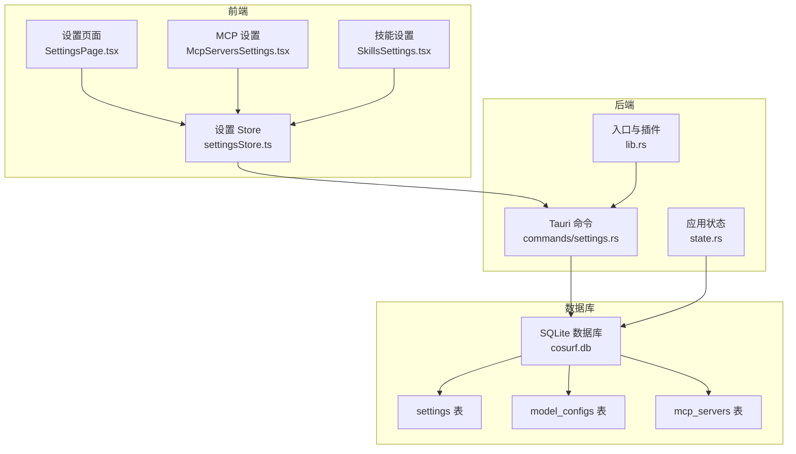
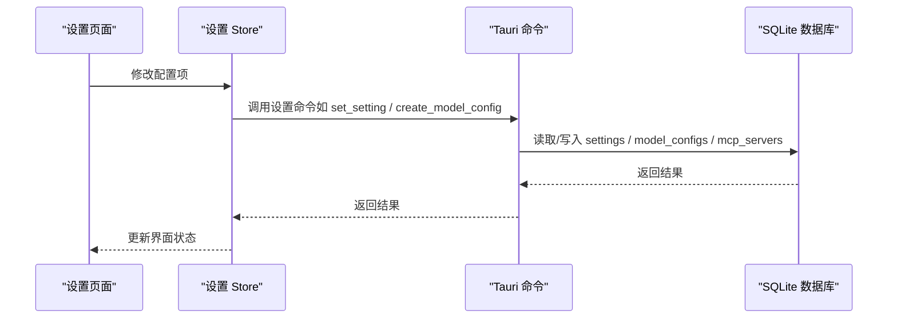
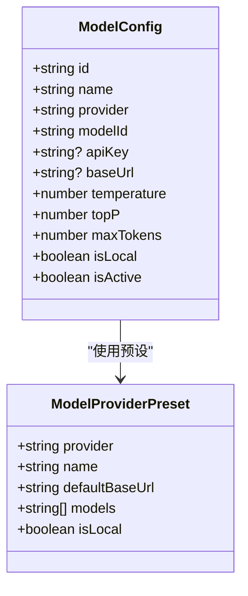
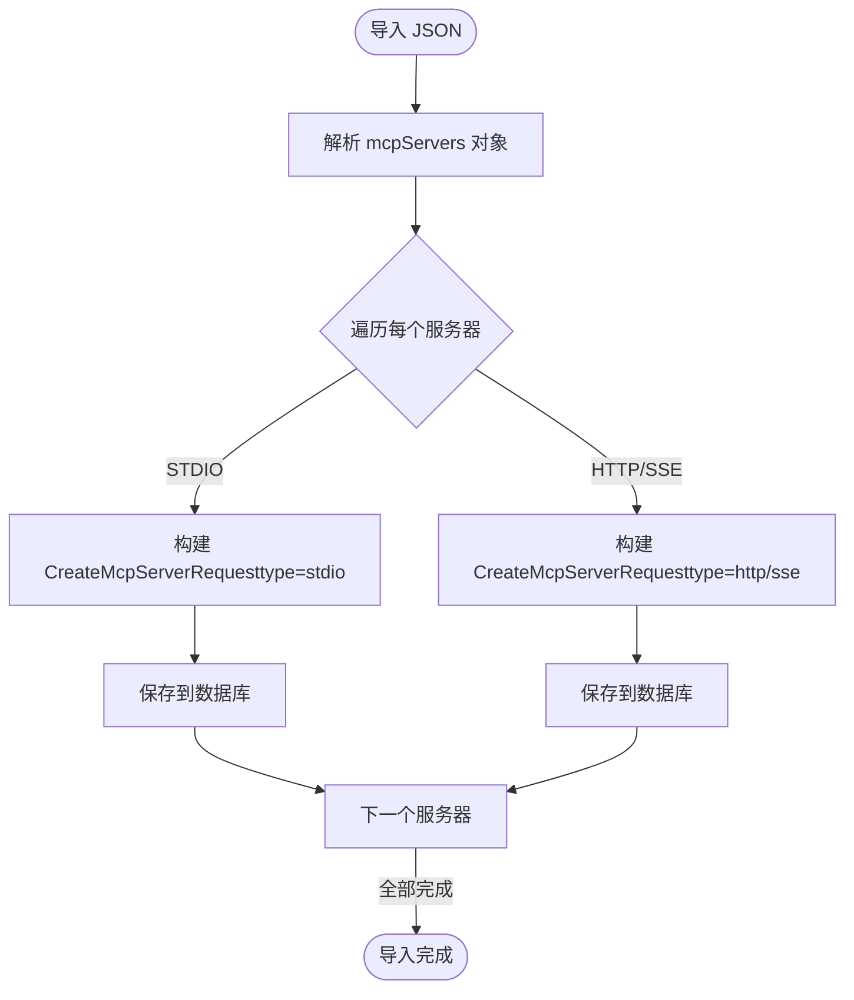
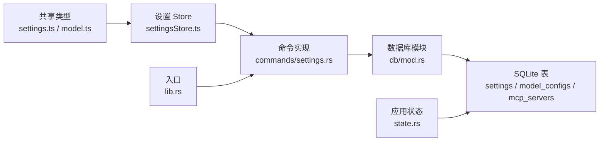

# 配置选项

<cite>
**本文引用的文件**
- [settings.ts](file://packages/shared/src/settings.ts)
- [model.ts](file://packages/shared/src/model.ts)
- [settings.rs](file://src-tauri/src/db/settings.rs)
- [settings.rs（数据库迁移）](file://src-tauri/src/db/mod.rs)
- [settings.rs（命令实现）](file://src-tauri/src/commands/settings.rs)
- [state.rs](file://src-tauri/src/state.rs)
- [lib.rs](file://src-tauri/src/lib.rs)
- [settingsStore.ts](file://src-web/src/stores/settingsStore.ts)
- [SettingsPage.tsx](file://src-web/src/components/settings/SettingsPage.tsx)
- [McpServersSettings.tsx](file://src-web/src/components/settings/McpServersSettings.tsx)
- [SkillsSettings.tsx](file://src-web/src/components/settings/SkillsSettings.tsx)
- [MCP JSON 配置模式](file://docs/MCP_JSON_CONFIG.md)
- [IQS 配置指南](file://docs/IQS_CONFIGURATION.md)
- [echo-skill.json](file://examples/echo-skill.json)
- [python-calculator-skill.json](file://examples/python-calculator-skill.json)
- [alibabacloud-iqs-search-skill.json](file://examples/alibabacloud-iqs-search-skill.json)
</cite>

## 目录
1. [简介](#简介)
2. [项目结构](#项目结构)
3. [核心组件](#核心组件)
4. [架构总览](#架构总览)
5. [详细组件分析](#详细组件分析)
6. [依赖分析](#依赖分析)
7. [性能考量](#性能考量)
8. [故障排查指南](#故障排查指南)
9. [结论](#结论)
10. [附录](#附录)

## 简介
本文件为 CoSurf 的配置选项 API 参考文档，覆盖 AI 模型配置、MCP 服务器配置、技能配置、应用设置等。内容包括：
- 配置项的完整规范：数据类型、取值范围、默认值、依赖关系
- 配置文件格式与 JSON Schema 规范
- 配置作用域、优先级与生效机制
- 动态更新与热重载机制
- 最佳实践、迁移与版本兼容性
- 安全考虑与权限控制
- 实际应用场景与使用示例

## 项目结构
CoSurf 的配置体系由前端 Store、后端命令与数据库三层组成：
- 前端层：通过 Store 管理应用设置、模型配置、MCP 服务器与 IQS API Key，并将变更持久化到后端
- 后端层：通过 Tauri 命令暴露配置接口，使用 SQLite 存储配置
- 数据库层：统一的 settings 表与专用表（model_configs、mcp_servers）存储配置

图表来源
- [settingsStore.ts:1-201](file://src-web/src/stores/settingsStore.ts#L1-201)
- [SettingsPage.tsx:1-802](file://src-web/src/components/settings/SettingsPage.tsx#L1-802)
- [McpServersSettings.tsx:1-688](file://src-web/src/components/settings/McpServersSettings.tsx#L1-688)
- [SkillsSettings.tsx:1-550](file://src-web/src/components/settings/SkillsSettings.tsx#L1-550)
- [settings.rs（命令实现）:1-615](file://src-tauri/src/commands/settings.rs#L1-615)
- [state.rs:1-81](file://src-tauri/src/state.rs#L1-81)
- [lib.rs:108-214](file://src-tauri/src/lib.rs#L108-214)
- [settings.rs（数据库迁移）:95-129](file://src-tauri/src/db/mod.rs#L95-129)

章节来源
- [settingsStore.ts:1-201](file://src-web/src/stores/settingsStore.ts#L1-201)
- [settings.rs（命令实现）:1-615](file://src-tauri/src/commands/settings.rs#L1-615)
- [settings.rs（数据库迁移）:95-129](file://src-tauri/src/db/mod.rs#L95-129)

## 核心组件
- 应用设置（AppSettings）
  - 主题、语言、字体大小、用户名称、面板默认高度、覆盖模式、隐私模式、AI 数据隐私、快捷键、用户数据路径等
  - 默认值与取值范围详见“应用设置”小节
- 模型配置（ModelConfig）
  - 提供商、模型 ID、API Key、Base URL、温度、Top P、最大 Token、是否本地、是否激活
  - 预设提供商与默认值详见“模型配置”小节
- MCP 服务器配置（McpServerConfig）
  - 类型（HTTP/SSE/StreamableHttp/STDIO）、URL、命令、参数、工作目录、环境变量、头部、禁用/启用、超时、创建/更新时间
  - 类型别名与默认值详见“MCP 服务器配置”小节
- 技能配置（Skills）
  - 技能目录路径、技能列表、启用/禁用、内容预览、导入/删除
  - 目录与文件结构详见“技能配置”小节
- IQS API Key 配置
  - 通过设置页面或命令持久化到 settings 表，键名为 iqs.api_key

章节来源
- [settings.ts:5-47](file://packages/shared/src/settings.ts#L5-47)
- [model.ts:13-33](file://packages/shared/src/model.ts#L13-33)
- [settings.rs:9-23](file://src-tauri/src/db/settings.rs#L9-23)
- [settings.rs:72-114](file://src-tauri/src/db/settings.rs#L72-114)
- [settings.rs（命令实现）:167-195](file://src-tauri/src/commands/settings.rs#L167-195)
- [SkillsSettings.tsx:14-23](file://src-web/src/components/settings/SkillsSettings.tsx#L14-23)

## 架构总览
配置的读写流程如下：
- 前端 Store 读取/更新配置，调用后端命令
- 后端命令访问数据库（settings、model_configs、mcp_servers）
- 应用状态在启动时初始化并加载部分配置（如 Skills 目录）

图表来源
- [settingsStore.ts:76-90](file://src-web/src/stores/settingsStore.ts#L76-90)
- [settings.rs（命令实现）:10-615](file://src-tauri/src/commands/settings.rs#L10-615)
- [settings.rs（数据库迁移）:95-129](file://src-tauri/src/db/mod.rs#L95-129)

## 详细组件分析

### 应用设置（AppSettings）
- 数据类型与默认值
  - theme: "light" | "dark" | "system"，默认 "system"
  - language: "zh-CN" | "en-US"，默认 "zh-CN"
  - fontSize: number，范围 12-18，默认 14
  - userName: string，示例默认 "CoCo"
  - panelDefaultHeight: number，范围 200-600，默认 300
  - panelOverlayMode: boolean，默认 true
  - privacyMode: boolean，默认 false
  - aiDataPrivacy: boolean，默认 false
  - shortcuts: ShortcutConfig，见下表
  - userDataPath: string，空字符串表示使用默认路径
- 快捷键（ShortcutConfig）
  - togglePanel: "Ctrl+J"
  - newTab: "Ctrl+T"
  - closeTab: "Ctrl+W"
  - focusAddressBar: "Ctrl+L"
  - newConversation: "Ctrl+Shift+N"
  - screenshot: "Ctrl+Shift+X"
- 生效机制
  - Store 内部即时更新 UI
  - 逐项调用 set_setting 写入数据库（键名与属性同名）
- 作用域与优先级
  - 仅影响当前用户会话与本地存储
  - 无跨用户同步，每次启动从数据库加载

章节来源
- [settings.ts:1-47](file://packages/shared/src/settings.ts#L1-47)
- [settingsStore.ts:76-90](file://src-web/src/stores/settingsStore.ts#L76-90)
- [SettingsPage.tsx:147-267](file://src-web/src/components/settings/SettingsPage.tsx#L147-267)

### 模型配置（ModelConfig）
- 数据类型与默认值
  - provider: ModelProvider（含 openai、anthropic、google、zhipu、moonshot、deepseek、doubao、qwen、ollama、custom）
  - modelId: string
  - apiKey: string（可选）
  - baseUrl: string（可选）
  - temperature: number，范围 0-2，默认 0.7
  - topP: number，范围 0-1，默认 1.0
  - maxTokens: number，范围 1-128000，默认 4096
  - isLocal: boolean，默认 false
  - isActive: boolean，默认 false
- 预设提供商（MODEL_PROVIDER_PRESETS）
  - 包含各提供商的默认 Base URL、模型列表与是否本地
- 命令接口
  - list_model_configs、get_model_config、get_active_model、create_model_config、update_model_config、set_active_model、delete_model_config
- 生效机制
  - set_active_model 将其他模型标记为非激活，仅保留一个激活模型
- 作用域与优先级
  - 仅影响当前会话的模型选择；数据库持久化

图表来源
- [model.ts:13-33](file://packages/shared/src/model.ts#L13-33)
- [model.ts:27-33](file://packages/shared/src/model.ts#L27-33)
- [settings.rs（命令实现）:36-105](file://src-tauri/src/commands/settings.rs#L36-105)

章节来源
- [model.ts:1-104](file://packages/shared/src/model.ts#L1-104)
- [settings.rs（命令实现）:36-105](file://src-tauri/src/commands/settings.rs#L36-105)

### MCP 服务器配置（McpServerConfig）
- 数据类型与默认值
  - server_type: "stdio" | "http" | "streamableHttp" | "sse"，默认 "stdio"
  - url: string（HTTP 类型必填）
  - command: string（STDIO 类型必填）
  - args: string[]
  - cwd: string（可选）
  - env: Record<string, string>（可选）
  - headers: Record<string, string>（可选）
  - disabled: boolean，默认 false
  - enabled: boolean，默认 true
  - timeout: number（秒，可选）
  - created_at/updated_at: number（时间戳）
- JSON 导入格式
  - 支持 mcpServers 对象，键为服务器名称，值包含 type、url、command、args、env、cwd、headers、disabled、timeout 等字段
- 命令接口
  - list_mcp_servers、get_mcp_server、create_mcp_server、update_mcp_server、delete_mcp_server、test_mcp_server、import_mcp_servers_from_json
- 生效机制
  - 启用的服务器会在前端加载后自动向原生模块注册并加载工具列表
- 作用域与优先级
  - 仅影响当前会话与本地存储；导入 JSON 时自动解析并创建多条记录

图表来源
- [McpServersSettings.tsx:104-127](file://src-web/src/components/settings/McpServersSettings.tsx#L104-127)
- [settings.rs（命令实现）:508-614](file://src-tauri/src/commands/settings.rs#L508-614)
- [MCP JSON 配置模式:13-44](file://docs/MCP_JSON_CONFIG.md#L13-L44)

章节来源
- [settings.rs:72-114](file://src-tauri/src/db/settings.rs#L72-114)
- [settings.rs:28-43](file://src-tauri/src/db/settings.rs#L28-43)
- [settings.rs（命令实现）:199-260](file://src-tauri/src/commands/settings.rs#L199-260)
- [McpServersSettings.tsx:104-184](file://src-web/src/components/settings/McpServersSettings.tsx#L104-184)
- [MCP JSON 配置模式:13-44](file://docs/MCP_JSON_CONFIG.md#L13-L44)

### 技能配置（Skills）
- 技能目录
  - 通过 get_skills_directory/set_skills_directory 管理，首次加载若不存在则使用默认路径
  - 前端设置后会触发原生模块重新初始化并加载技能
- 技能内容
  - 每个技能以独立目录存放，目录名即技能 ID，包含 SKILL.md 文件
  - 支持从 Markdown 导入、从目录导入、启用/禁用、删除、预览
- 命令接口
  - list_skills、delete_skill、toggle_skill、import_skill_from_markdown、import_skill_from_directory、list_skill_files、get_skill_content
- 生效机制
  - set_skills_directory 会创建目录、通知原生模块更新并重新加载技能列表

章节来源
- [settings.rs（命令实现）:109-165](file://src-tauri/src/commands/settings.rs#L109-165)
- [SkillsSettings.tsx:68-83](file://src-web/src/components/settings/SkillsSettings.tsx#L68-83)
- [SkillsSettings.tsx:102-128](file://src-web/src/components/settings/SkillsSettings.tsx#L102-128)
- [state.rs:25-67](file://src-tauri/src/state.rs#L25-67)

### IQS API Key 配置
- 配置项
  - 键名：iqs.api_key
  - 值：字符串（API Key）
- 命令接口
  - get_iqs_api_key、set_iqs_api_key
- 生效机制
  - 前端设置后立即持久化；工具调用时读取该键值
- 安全考虑
  - 建议定期轮换 API Key，避免泄露

章节来源
- [settings.rs（命令实现）:169-195](file://src-tauri/src/commands/settings.rs#L169-195)
- [settings.rs（数据库迁移）:95-98](file://src-tauri/src/db/mod.rs#L95-98)
- [IQS 配置指南:1-262](file://docs/IQS_CONFIGURATION.md#L1-262)

## 依赖分析
- 前端 Store 依赖共享类型定义（ThemeMode、Language、ModelConfig 等）
- 后端命令依赖数据库模块与错误处理
- 应用状态在启动时初始化数据库与 SkillsManager
- 前端设置页面与命令实现双向绑定

图表来源
- [settings.ts:1-47](file://packages/shared/src/settings.ts#L1-47)
- [model.ts:1-104](file://packages/shared/src/model.ts#L1-104)
- [settingsStore.ts:1-31](file://src-web/src/stores/settingsStore.ts#L1-31)
- [settings.rs（命令实现）:1-615](file://src-tauri/src/commands/settings.rs#L1-615)
- [settings.rs（数据库迁移）:95-129](file://src-tauri/src/db/mod.rs#L95-129)
- [lib.rs:108-214](file://src-tauri/src/lib.rs#L108-214)
- [state.rs:25-79](file://src-tauri/src/state.rs#L25-79)

章节来源
- [settingsStore.ts:1-31](file://src-web/src/stores/settingsStore.ts#L1-31)
- [settings.rs（命令实现）:1-615](file://src-tauri/src/commands/settings.rs#L1-615)
- [settings.rs（数据库迁移）:95-129](file://src-tauri/src/db/mod.rs#L95-129)
- [lib.rs:108-214](file://src-tauri/src/lib.rs#L108-214)
- [state.rs:25-79](file://src-tauri/src/state.rs#L25-79)

## 性能考量
- 数据库 WAL 模式与外键约束提升并发与一致性
- MCP 服务器工具列表异步加载，避免阻塞 UI
- 模型配置仅保留一个激活项，减少选择成本
- 前端 Store 逐项持久化设置，避免一次性写入大量键值

## 故障排查指南
- IQS API Key 未配置
  - 症状：工具调用报错
  - 处理：在设置页面或数据库中补全 iqs.api_key
- MCP 服务器导入失败
  - 症状：提示格式错误或缺少 mcpServers
  - 处理：确认 JSON 结构与字段
- MCP 服务器无法启动
  - 症状：STDIO 命令执行失败
  - 处理：在终端手动验证命令与参数
- 技能目录为空
  - 症状：技能列表为空
  - 处理：确认目录存在并包含 SKILL.md

章节来源
- [IQS 配置指南:157-205](file://docs/IQS_CONFIGURATION.md#L157-205)
- [MCP JSON 配置模式:382-423](file://docs/MCP_JSON_CONFIG.md#L382-423)
- [SkillsSettings.tsx:361-365](file://src-web/src/components/settings/SkillsSettings.tsx#L361-365)

## 结论
CoSurf 的配置体系以 SQLite 为核心，结合前端 Store 与后端命令，实现了对应用设置、模型配置、MCP 服务器与技能的统一管理。通过标准化的 JSON 导入与严格的类型定义，既保证了易用性，也兼顾了扩展性与安全性。

## 附录

### 配置文件格式与 JSON Schema 规范
- settings 表
  - 键（key）：字符串（如 iqs.api_key、skills.directory）
  - 值（value）：字符串或 JSON 文本
- model_configs 表
  - 字段：id、name、provider、model_id、api_key、base_url、temperature、top_p、max_tokens、is_local、is_active
- mcp_servers 表
  - 字段：id、name、server_type、url、command、args、cwd、env、disabled、timeout、enabled、created_at、updated_at、headers

章节来源
- [settings.rs（数据库迁移）:95-129](file://src-tauri/src/db/mod.rs#L95-129)

### 配置项清单与约束
- 应用设置
  - theme ∈ {"light","dark","system"}；默认 "system"
  - language ∈ {"zh-CN","en-US"}；默认 "zh-CN"
  - fontSize ∈ [12,18]；默认 14
  - panelDefaultHeight ∈ [200,600]；默认 300
  - shortcuts.* 为字符串（快捷键组合）
- 模型配置
  - temperature ∈ [0,2]；默认 0.7
  - topP ∈ [0,1]；默认 1.0
  - maxTokens ∈ [1,128000]；默认 4096
  - isLocal ∈ {true,false}；默认 false
  - isActive ∈ {true,false}；默认 false
- MCP 服务器
  - server_type ∈ {"stdio","http","streamableHttp","sse"}；默认 "stdio"
  - url 仅 HTTP 类型必填
  - command 仅 STDIO 类型必填
  - disabled/enabled 互斥；默认 enabled=true
  - timeout 为秒数（可选）

章节来源
- [settings.ts:1-47](file://packages/shared/src/settings.ts#L1-47)
- [model.ts:13-33](file://packages/shared/src/model.ts#L13-33)
- [settings.rs:72-114](file://src-tauri/src/db/settings.rs#L72-114)

### 动态更新与热重载机制
- 应用设置
  - Store 内部即时更新；逐项调用 set_setting 写入数据库
- MCP 服务器
  - 启用的服务器在前端加载后自动向原生模块注册并加载工具列表
- 技能
  - set_skills_directory 后原生模块重新初始化并加载技能

章节来源
- [settingsStore.ts:76-90](file://src-web/src/stores/settingsStore.ts#L76-90)
- [McpServersSettings.tsx:112-117](file://src-web/src/components/settings/McpServersSettings.tsx#L112-117)
- [SkillsSettings.tsx:118-122](file://src-web/src/components/settings/SkillsSettings.tsx#L118-122)

### 最佳实践与推荐设置
- 模型配置
  - 使用预设提供商以获得合理的默认 Base URL 与模型列表
  - 本地模型（如 Ollama）建议开启 isLocal 并设置合理 maxTokens
- MCP 服务器
  - 使用 JSON 导入批量配置，避免重复手工录入
  - 为敏感环境变量留空占位，在 UI 中手动填写
- 技能
  - 将技能目录置于稳定路径，便于备份与迁移
  - 使用 SKILL.md 清晰描述用途与参数，便于模型理解

章节来源
- [model.ts:35-103](file://packages/shared/src/model.ts#L35-103)
- [MCP JSON 配置模式:321-343](file://docs/MCP_JSON_CONFIG.md#L321-343)
- [SkillsSettings.tsx:232-294](file://src-web/src/components/settings/SkillsSettings.tsx#L232-294)

### 配置迁移与版本兼容性
- 数据库迁移
  - 自动添加缺失列（如 thinking_content、mcp_servers 新增列）
  - 迁移旧消息内容至分离字段
- 版本升级
  - 保持键名稳定；新增配置项通过默认值兼容旧版本

章节来源
- [settings.rs（数据库迁移）:150-266](file://src-tauri/src/db/mod.rs#L150-266)

### 安全考虑与权限控制
- API Key 存储
  - IQS API Key 存储于本地数据库，不上传云端
- 环境变量
  - 建议在 JSON 中留空占位，导入后再在 UI 中填写真实值
- 权限
  - 仅本地用户可访问配置；技能目录需具备读写权限

章节来源
- [IQS 配置指南:246-251](file://docs/IQS_CONFIGURATION.md#L246-251)
- [MCP JSON 配置模式:321-343](file://docs/MCP_JSON_CONFIG.md#L321-343)

### 实际应用场景与使用示例
- 阿里云 IQS 搜索
  - 配置 API Key 后，AI 可调用 web_search 工具进行实时搜索
- Echo 技能
  - 用于测试 Skills 系统，回显传入消息
- Python 计算器
  - 通过脚本执行数学表达式计算
- MCP 服务器
  - 使用 JSON 导入多个服务器（如文件系统、GitHub、Brave 搜索等）

章节来源
- [IQS 配置指南:20-156](file://docs/IQS_CONFIGURATION.md#L20-156)
- [echo-skill.json:1-28](file://examples/echo-skill.json#L1-28)
- [python-calculator-skill.json:1-27](file://examples/python-calculator-skill.json#L1-27)
- [alibabacloud-iqs-search-skill.json:1-45](file://examples/alibabacloud-iqs-search-skill.json#L1-45)
- [MCP JSON 配置模式:13-44](file://docs/MCP_JSON_CONFIG.md#L13-44)