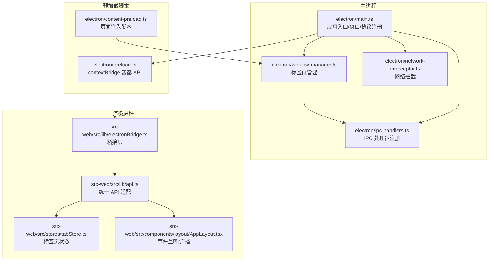
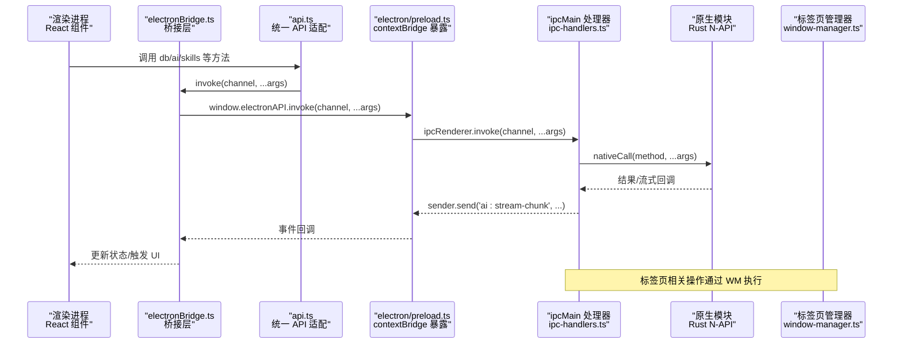
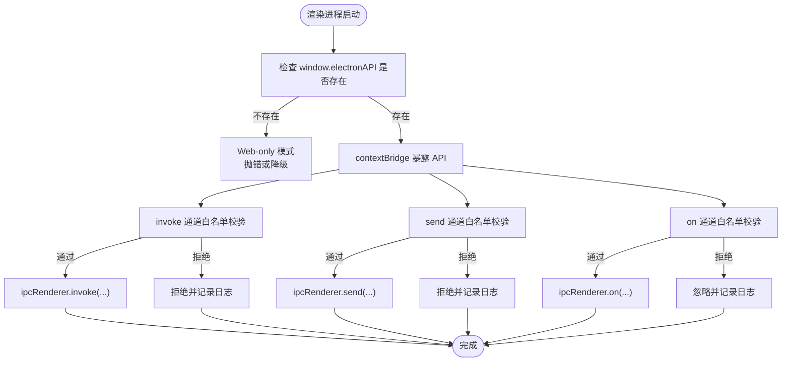
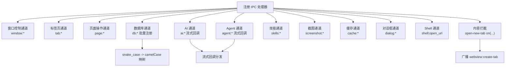
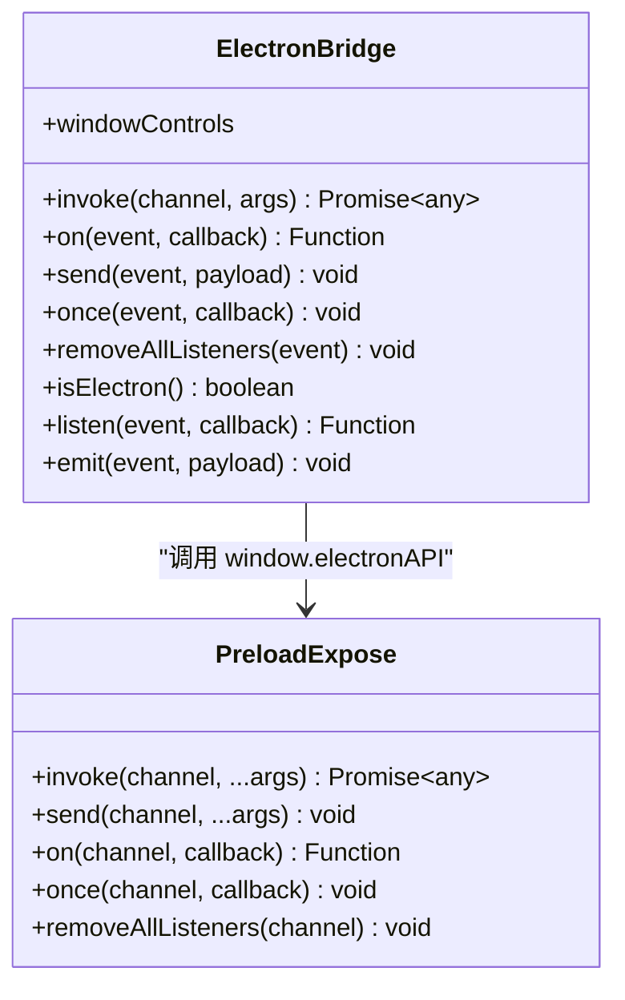
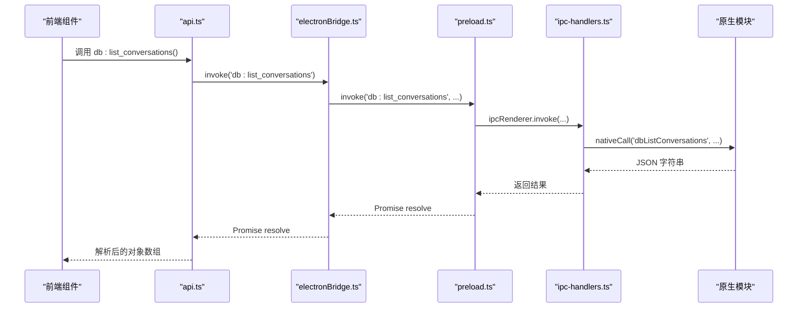
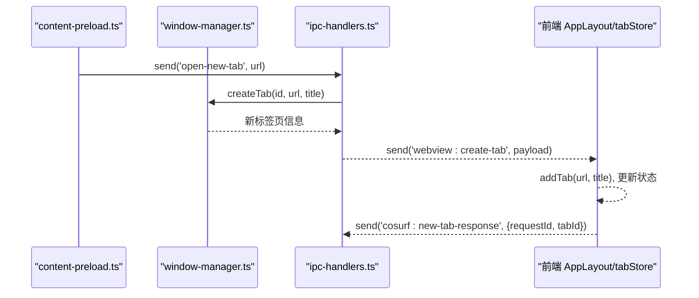
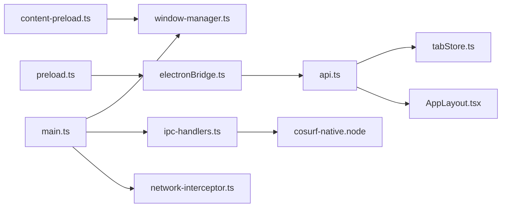

# Electron IPC 机制

<cite>
**本文档引用的文件**
- [electron/main.ts](file://electron/main.ts)
- [electron/preload.ts](file://electron/preload.ts)
- [electron/content-preload.ts](file://electron/content-preload.ts)
- [electron/ipc-handlers.ts](file://electron/ipc-handlers.ts)
- [electron/window-manager.ts](file://electron/window-manager.ts)
- [electron/network-interceptor.ts](file://electron/network-interceptor.ts)
- [src-web/src/lib/electronBridge.ts](file://src-web/src/lib/electronBridge.ts)
- [src-web/src/lib/api.ts](file://src-web/src/lib/api.ts)
- [src-web/src/stores/tabStore.ts](file://src-web/src/stores/tabStore.ts)
- [src-web/src/components/layout/AppLayout.tsx](file://src-web/src/components/layout/AppLayout.tsx)
</cite>

## 目录
1. [简介](#简介)
2. [项目结构](#项目结构)
3. [核心组件](#核心组件)
4. [架构总览](#架构总览)
5. [详细组件分析](#详细组件分析)
6. [依赖关系分析](#依赖关系分析)
7. [性能考量](#性能考量)
8. [故障排查指南](#故障排查指南)
9. [结论](#结论)
10. [附录](#附录)

## 简介
本文件系统化梳理 CoSurf 项目中的 Electron IPC 机制，覆盖以下主题：
- 渲染进程与主进程的通信模式（ipcRenderer/ipcMain）
- 预加载脚本的安全隔离与 API 暴露（contextBridge）
- ipcHandlers 的注册与管理（事件处理器定义、参数校验、异步处理）
- Electron Bridge 设计（桥接层封装、API 封装、错误处理）
- 数据传输格式与协议（请求/响应、流式数据、事件广播）
- 调试与监控（事件追踪、性能分析、内存泄漏检测）
- 最佳实践与安全建议

## 项目结构
CoSurf 的 Electron 相关代码主要位于 electron/ 目录，前端桥接层位于 src-web/src/lib/，标签页与事件广播在 src-web/src/stores/ 与 src-web/src/components/layout/ 中。

**图表来源**
- [electron/main.ts:120-148](file://electron/main.ts#L120-L148)
- [electron/window-manager.ts:29-43](file://electron/window-manager.ts#L29-L43)
- [electron/ipc-handlers.ts:48-528](file://electron/ipc-handlers.ts#L48-L528)
- [electron/preload.ts:177-223](file://electron/preload.ts#L177-L223)
- [electron/content-preload.ts:13-104](file://electron/content-preload.ts#L13-L104)
- [src-web/src/lib/electronBridge.ts:32-95](file://src-web/src/lib/electronBridge.ts#L32-L95)
- [src-web/src/lib/api.ts:12-19](file://src-web/src/lib/api.ts#L12-L19)
- [src-web/src/stores/tabStore.ts:56-96](file://src-web/src/stores/tabStore.ts#L56-L96)
- [src-web/src/components/layout/AppLayout.tsx:118-150](file://src-web/src/components/layout/AppLayout.tsx#L118-L150)

**章节来源**
- [electron/main.ts:32-67](file://electron/main.ts#L32-L67)
- [electron/preload.ts:10-232](file://electron/preload.ts#L10-L232)
- [electron/content-preload.ts:13-104](file://electron/content-preload.ts#L13-L104)
- [electron/ipc-handlers.ts:48-528](file://electron/ipc-handlers.ts#L48-L528)
- [electron/window-manager.ts:29-361](file://electron/window-manager.ts#L29-L361)
- [electron/network-interceptor.ts:40-157](file://electron/network-interceptor.ts#L40-L157)
- [src-web/src/lib/electronBridge.ts:13-100](file://src-web/src/lib/electronBridge.ts#L13-L100)
- [src-web/src/lib/api.ts:12-200](file://src-web/src/lib/api.ts#L12-L200)
- [src-web/src/stores/tabStore.ts:56-200](file://src-web/src/stores/tabStore.ts#L56-L200)
- [src-web/src/components/layout/AppLayout.tsx:17-200](file://src-web/src/components/layout/AppLayout.tsx#L17-L200)

## 核心组件
- 主进程入口与窗口管理：负责创建 BrowserWindow、注册协议、初始化原生模块、注册全局快捷键、创建标签页管理器，并在就绪后注册 IPC 处理器。
- 预加载脚本（主窗口）：通过 contextBridge 暴露受控 API（invoke/send/on/once/removeAllListeners），并对通道进行白名单控制。
- 内容预加载脚本：向每个标签页注入脚本，提供页面内容提取、链接拦截、DOM 加载通知等能力。
- IPC 处理器注册：集中注册所有通道的 handle/on 处理器，桥接前端与原生模块（Rust N-API），并支持流式回调与事件广播。
- 标签页管理器：基于 WebContentsView 实现多标签页，负责导航、加载事件、DOM 操作、截图等。
- 网络拦截器：利用 session.webRequest 拦截追踪请求、修改 CSP/X-Frame-Options、记录 API 响应，供 AI 分析使用。
- 前端桥接层与 API 适配：electronBridge.ts 提供 invoke/listen/emit 的统一封装；api.ts 将 IPC 通道映射为语义化方法，并解析 N-API 返回的 JSON 字符串。

**章节来源**
- [electron/main.ts:120-148](file://electron/main.ts#L120-L148)
- [electron/preload.ts:177-223](file://electron/preload.ts#L177-L223)
- [electron/content-preload.ts:13-104](file://electron/content-preload.ts#L13-L104)
- [electron/ipc-handlers.ts:48-528](file://electron/ipc-handlers.ts#L48-L528)
- [electron/window-manager.ts:29-361](file://electron/window-manager.ts#L29-L361)
- [electron/network-interceptor.ts:40-157](file://electron/network-interceptor.ts#L40-L157)
- [src-web/src/lib/electronBridge.ts:32-95](file://src-web/src/lib/electronBridge.ts#L32-L95)
- [src-web/src/lib/api.ts:12-200](file://src-web/src/lib/api.ts#L12-L200)

## 架构总览
下图展示从渲染进程发起请求到主进程处理、原生模块交互以及事件回传的完整链路。

**图表来源**
- [src-web/src/lib/api.ts:12-19](file://src-web/src/lib/api.ts#L12-L19)
- [src-web/src/lib/electronBridge.ts:32-46](file://src-web/src/lib/electronBridge.ts#L32-L46)
- [electron/preload.ts:177-185](file://electron/preload.ts#L177-L185)
- [electron/ipc-handlers.ts:215-226](file://electron/ipc-handlers.ts#L215-L226)
- [electron/window-manager.ts:323-336](file://electron/window-manager.ts#L323-L336)

## 详细组件分析

### 预加载脚本与安全隔离
- 作用：在渲染进程启用 contextIsolation 的前提下，通过 contextBridge 安全地暴露有限的 API 给前端，避免直接访问 Node/Electron API。
- 白名单控制：对 invoke/send/on 三类通道分别维护白名单，未在白名单内的通道会被拒绝或忽略，降低攻击面。
- 窗口控制：额外暴露 windowControls，封装窗口最小化/最大化/关闭/isMaximized 的调用。
- 内容注入：content-preload.ts 注入到每个标签页，提供页面内容提取、链接拦截、DOM 加载通知等。

**图表来源**
- [electron/preload.ts:177-223](file://electron/preload.ts#L177-L223)
- [electron/preload.ts:30-138](file://electron/preload.ts#L30-L138)
- [electron/preload.ts:140-175](file://electron/preload.ts#L140-L175)

**章节来源**
- [electron/preload.ts:10-232](file://electron/preload.ts#L10-L232)
- [electron/content-preload.ts:13-104](file://electron/content-preload.ts#L13-L104)

### ipcHandlers 的注册与管理
- 注册入口：在主进程 app.whenReady() 后调用 registerIpcHandlers(tabManager, mainWindow)，集中注册所有通道。
- 数据库通道：批量注册 db:* 通道，自动将 snake_case 方法名映射为 camelCase 的原生方法名，并统一异常处理。
- AI 通道：ai:send_chat 支持流式回调（ai:stream-chunk/ai:tool-call-start/tool-call-result/ai:stream-error），并通过 Electron Bridge 工具扩展主进程能力。
- Agent 通道：agent:execute/agent:configure_qwen/agent:summarize_page 等，同样支持流式回调与桥接工具。
- 技能通道：skills:* 通道桥接原生技能管理能力。
- 截图与缓存：screenshot:* 与 cache:* 通道。
- 对话框与 Shell：dialog:* 与 shell:open_url。
- 内容拦截：open-new-tab 事件由 ipcMain.on 处理，创建标签页并向前端广播 webview:create-tab。

**图表来源**
- [electron/ipc-handlers.ts:48-528](file://electron/ipc-handlers.ts#L48-L528)
- [electron/ipc-handlers.ts:211-226](file://electron/ipc-handlers.ts#L211-L226)
- [electron/ipc-handlers.ts:231-315](file://electron/ipc-handlers.ts#L231-L315)
- [electron/ipc-handlers.ts:337-373](file://electron/ipc-handlers.ts#L337-L373)
- [electron/ipc-handlers.ts:418-429](file://electron/ipc-handlers.ts#L418-L429)
- [electron/ipc-handlers.ts:518-527](file://electron/ipc-handlers.ts#L518-L527)

**章节来源**
- [electron/ipc-handlers.ts:48-528](file://electron/ipc-handlers.ts#L48-L528)

### Electron Bridge 的设计与实现
- 桥接层职责：提供统一的 invoke/listen/emit 接口，兼容 Tauri 风格命名参数，内部转换为 Electron IPC 的位置参数。
- 错误处理：当 window.electronAPI 不可用时，抛出明确错误，便于前端降级处理。
- 窗口控制快捷方法：封装 windowControls，简化窗口操作。
- 向后兼容：导出 listen/emit 别名，便于迁移。

**图表来源**
- [src-web/src/lib/electronBridge.ts:32-95](file://src-web/src/lib/electronBridge.ts#L32-L95)
- [electron/preload.ts:177-223](file://electron/preload.ts#L177-L223)

**章节来源**
- [src-web/src/lib/electronBridge.ts:13-100](file://src-web/src/lib/electronBridge.ts#L13-L100)
- [electron/preload.ts:177-223](file://electron/preload.ts#L177-L223)

### 数据传输格式与协议
- 请求/响应模式：前端通过 electronBridge.invoke 发起请求，主进程 ipcMain.handle 处理并返回结果；若原生模块返回 JSON 字符串，api.ts 提供 parseJSON/parseJSONOrNull 解析。
- 流式数据处理：AI/Agent 通道通过 sender.send 分发流式片段（ai:stream-chunk）、工具调用开始/结果（ai:tool-call-start/tool-call-result）与错误（ai:stream-error）。
- 事件广播：标签页创建、导航、加载状态变化等通过 mainWindow.webContents.send 广播至前端，前端监听并更新状态。
- 内容预加载：content-preload.ts 通过 ipcRenderer.send 向主进程报告页面 DOMContentLoaded、外部链接拦截等事件。

**图表来源**
- [src-web/src/lib/api.ts:54-72](file://src-web/src/lib/api.ts#L54-L72)
- [src-web/src/lib/electronBridge.ts:32-46](file://src-web/src/lib/electronBridge.ts#L32-L46)
- [electron/preload.ts:177-185](file://electron/preload.ts#L177-L185)
- [electron/ipc-handlers.ts:215-226](file://electron/ipc-handlers.ts#L215-L226)

**章节来源**
- [src-web/src/lib/api.ts:25-49](file://src-web/src/lib/api.ts#L25-L49)
- [electron/ipc-handlers.ts:249-310](file://electron/ipc-handlers.ts#L249-L310)
- [electron/ipc-handlers.ts:345-369](file://electron/ipc-handlers.ts#L345-L369)

### 标签页管理与事件广播
- 多标签页实现：使用 WebContentsView 实现真正独立的渲染进程，不受 X-Frame-Options/CSP 限制。
- 事件广播：标签页加载开始/停止、标题更新、切换等事件通过 mainWindow.webContents.send 广播，前端监听并更新 UI。
- 内容注入：content-preload.ts 注入到每个标签页，拦截外部链接、覆盖 window.open、DOMContentLoaded 通知等。
- Electron Bridge 工具：当原生模块需要操作浏览器界面时，通过 onElectronBridge 回调交由主进程执行（如打开 URL、页面自动化、总结页面等）。

**图表来源**
- [electron/content-preload.ts:64-94](file://electron/content-preload.ts#L64-L94)
- [electron/ipc-handlers.ts:518-527](file://electron/ipc-handlers.ts#L518-L527)
- [electron/window-manager.ts:84-172](file://electron/window-manager.ts#L84-L172)
- [src-web/src/components/layout/AppLayout.tsx:118-150](file://src-web/src/components/layout/AppLayout.tsx#L118-L150)
- [src-web/src/stores/tabStore.ts:56-96](file://src-web/src/stores/tabStore.ts#L56-L96)

**章节来源**
- [electron/window-manager.ts:29-361](file://electron/window-manager.ts#L29-L361)
- [electron/content-preload.ts:64-104](file://electron/content-preload.ts#L64-L104)
- [src-web/src/components/layout/AppLayout.tsx:118-150](file://src-web/src/components/layout/AppLayout.tsx#L118-L150)
- [src-web/src/stores/tabStore.ts:56-96](file://src-web/src/stores/tabStore.ts#L56-L96)

## 依赖关系分析
- 主进程依赖：main.ts 依赖 window-manager.ts、ipc-handlers.ts、network-interceptor.ts；preload.ts 依赖 ipcRenderer/contextBridge；content-preload.ts 注入到各标签页。
- 前端依赖：electronBridge.ts 依赖 window.electronAPI；api.ts 依赖 electronBridge.ts；tabStore.ts 与 AppLayout.tsx 依赖 api.ts 并监听 IPC 事件。
- 原生模块：ipc-handlers.ts 通过 getNative()/nativeCall() 动态加载 cosurf-native.node 并调用其导出的方法。

**图表来源**
- [electron/main.ts:15-17](file://electron/main.ts#L15-L17)
- [electron/ipc-handlers.ts:14-35](file://electron/ipc-handlers.ts#L14-L35)
- [src-web/src/lib/electronBridge.ts:13-30](file://src-web/src/lib/electronBridge.ts#L13-L30)
- [src-web/src/lib/api.ts:12-19](file://src-web/src/lib/api.ts#L12-L19)

**章节来源**
- [electron/main.ts:15-17](file://electron/main.ts#L15-L17)
- [electron/ipc-handlers.ts:14-35](file://electron/ipc-handlers.ts#L14-L35)
- [src-web/src/lib/electronBridge.ts:13-30](file://src-web/src/lib/electronBridge.ts#L13-L30)
- [src-web/src/lib/api.ts:12-19](file://src-web/src/lib/api.ts#L12-L19)

## 性能考量
- 预加载脚本白名单：严格限制通道可降低不必要的 IPC 往返与潜在的 CPU/内存消耗。
- 流式回调：AI/Agent 通道采用流式分发，避免一次性大对象传输，提升交互流畅度。
- DOM 操作与截图：executeJavaScript/capturePage 等操作应在必要时调用，避免频繁执行造成主线程阻塞。
- 网络拦截：webRequest.onCompleted 记录 API 响应，注意控制记录数量与序列化开销。
- 标签页数量：过多 WebContentsView 会增加内存占用，应合理管理标签页生命周期。

## 故障排查指南
- 通道被拒绝：检查 preload.ts 中的白名单配置，确认通道名称与 ipc-handlers.ts 注册的一致。
- 原生模块不可用：确认 nativeCall 成功加载 cosurf-native.node，检查 nativeInit 初始化路径与权限。
- 流式回调丢失：检查 sender.isDestroyed() 保护，确保窗口未销毁；确认主进程未提前断开连接。
- 事件未到达前端：检查 mainWindow.webContents.send 是否正确触发，前端 on 监听是否注册成功。
- 内容注入失效：确认 content-preload.ts 的 preload 路径与 WebContentsView 的 webPreferences.preload 正确配置。
- 网络拦截异常：检查 webRequest 过滤规则与 CSP/X-Frame-Options 修改是否生效。

**章节来源**
- [electron/preload.ts:177-223](file://electron/preload.ts#L177-L223)
- [electron/ipc-handlers.ts:29-35](file://electron/ipc-handlers.ts#L29-L35)
- [electron/ipc-handlers.ts:251-256](file://electron/ipc-handlers.ts#L251-L256)
- [electron/ipc-handlers.ts:518-527](file://electron/ipc-handlers.ts#L518-L527)
- [electron/content-preload.ts:96-104](file://electron/content-preload.ts#L96-L104)
- [electron/network-interceptor.ts:44-74](file://electron/network-interceptor.ts#L44-L74)

## 结论
CoSurf 的 Electron IPC 体系通过严格的预加载脚本白名单、集中化的 ipcHandlers 注册、桥接层封装与事件广播机制，实现了安全、可控且高性能的前后端通信。结合原生模块的 N-API 能力与内容注入脚本，满足复杂页面操作与 AI 工具集成需求。遵循本文的最佳实践与安全建议，可进一步提升系统的稳定性与可维护性。

## 附录
- 最佳实践
  - 严格维护通道白名单，最小权限原则暴露 API。
  - 使用流式回调处理大体量数据，避免阻塞主线程。
  - 对原生模块调用进行异常捕获与用户友好的错误提示。
  - 合理管理标签页数量与生命周期，避免内存泄漏。
  - 在开发模式开启 DevTools，生产模式谨慎暴露调试信息。
- 安全建议
  - 禁用 nodeIntegration，启用 contextIsolation。
  - 仅通过 contextBridge 暴露必要 API，避免直接暴露全局对象。
  - 对来自渲染进程的数据进行参数校验与长度限制。
  - 定期审计通道白名单与事件广播，移除不再使用的通道。