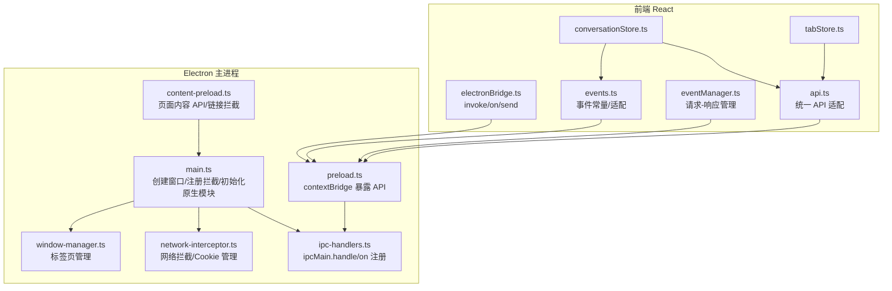
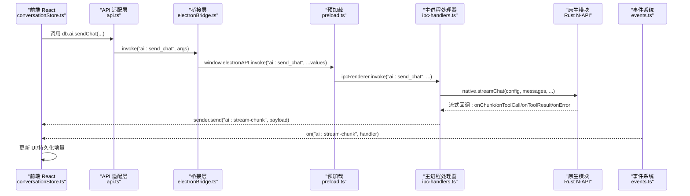
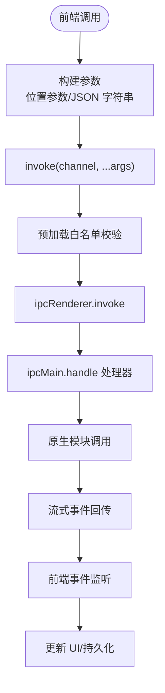
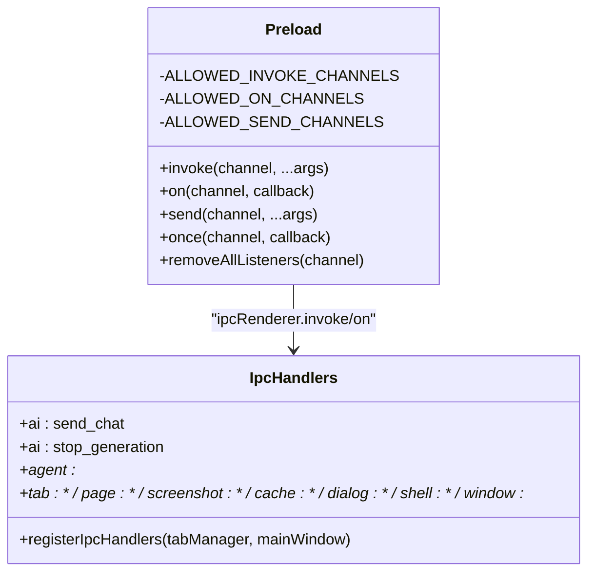
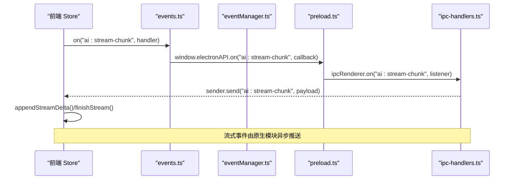
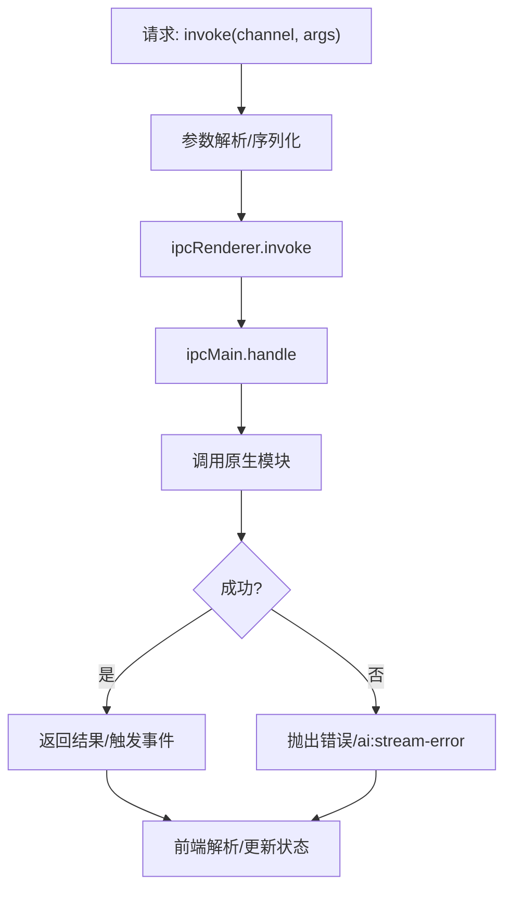
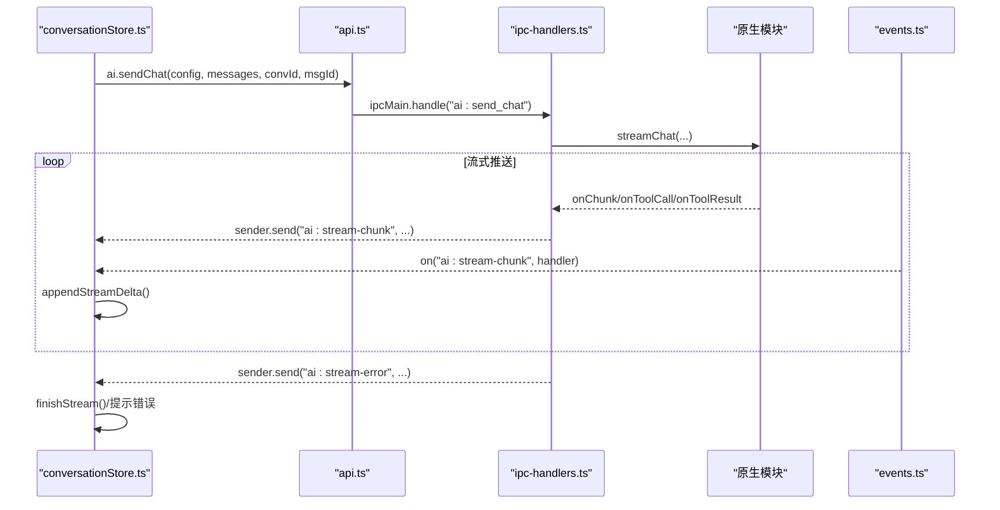
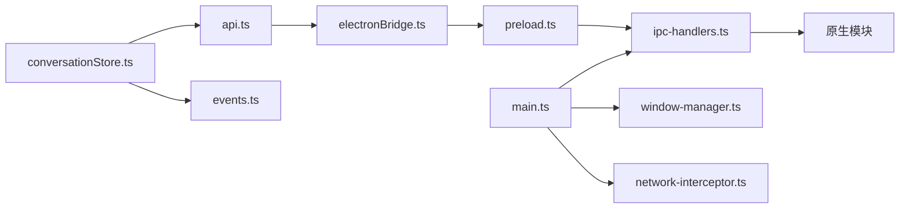

# IPC 通信

<cite>
**本文引用的文件**
- [electron/main.ts](file://electron/main.ts)
- [electron/preload.ts](file://electron/preload.ts)
- [electron/content-preload.ts](file://electron/content-preload.ts)
- [electron/ipc-handlers.ts](file://electron/ipc-handlers.ts)
- [electron/window-manager.ts](file://electron/window-manager.ts)
- [electron/network-interceptor.ts](file://electron/network-interceptor.ts)
- [src-web/src/lib/electronBridge.ts](file://src-web/src/lib/electronBridge.ts)
- [src-web/src/lib/events.ts](file://src-web/src/lib/events.ts)
- [src-web/src/lib/eventManager.ts](file://src-web/src/lib/eventManager.ts)
- [src-web/src/lib/api.ts](file://src-web/src/lib/api.ts)
- [src-web/src/stores/conversationStore.ts](file://src-web/src/stores/conversationStore.ts)
- [src-web/src/stores/tabStore.ts](file://src-web/src/stores/tabStore.ts)
- [src-tauri/src/main.rs](file://src-tauri/src/main.rs)
- [src-web/src/lib/tauri.ts](file://src-web/src/lib/tauri.ts)
</cite>

## 目录
1. [引言](#引言)
2. [项目结构](#项目结构)
3. [核心组件](#核心组件)
4. [架构总览](#架构总览)
5. [详细组件分析](#详细组件分析)
6. [依赖关系分析](#依赖关系分析)
7. [性能考量](#性能考量)
8. [故障排查指南](#故障排查指南)
9. [结论](#结论)
10. [附录](#附录)

## 引言
本文件面向 CoSurf 的 IPC 通信系统，聚焦 Electron 与前端 React 的跨进程通信实现。文档覆盖以下主题：
- 前端 invoke 调用、后端命令处理器、数据序列化与反序列化的完整流程
- Electron IPC 的实现方式（ipcRenderer、ipcMain、预加载脚本）
- 事件系统设计（事件类型定义、事件监听器管理、事件传播机制）
- 数据传输格式与协议（请求/响应模式、错误处理、超时控制）
- 跨进程通信的安全考虑与权限控制
- 流式数据传输（AI 流式事件）与前端实时更新
- IPC 调试与监控（日志记录、性能分析、错误追踪）
- 不同桌面框架（Tauri vs Electron）的 IPC 实现差异与选择考虑
- 常见 IPC 问题的排查与解决方案

## 项目结构
CoSurf 采用 Electron 作为宿主，前端 React 通过统一的桥接层与主进程通信。核心路径如下：
- 主进程入口与生命周期：electron/main.ts
- 预加载脚本（上下文隔离）：electron/preload.ts
- 内容预加载脚本（注入到每个标签页）：electron/content-preload.ts
- IPC 处理器注册：electron/ipc-handlers.ts
- 窗口与标签页管理：electron/window-manager.ts
- 网络拦截与 Cookie 管理：electron/network-interceptor.ts
- 前端桥接层（Electron）：src-web/src/lib/electronBridge.ts
- 事件适配层：src-web/src/lib/events.ts
- 事件管理器（请求-响应模式）：src-web/src/lib/eventManager.ts
- API 适配层（invoke 封装）：src-web/src/lib/api.ts
- Store 层（对话与标签页）：src-web/src/stores/conversationStore.ts、src-web/src/stores/tabStore.ts
- Tauri 旧实现（已弃用）：src-web/src/lib/tauri.ts、src-tauri/src/main.rs

**图表来源**
- [electron/main.ts:1-172](file://electron/main.ts#L1-L172)
- [electron/preload.ts:1-232](file://electron/preload.ts#L1-L232)
- [electron/content-preload.ts:1-105](file://electron/content-preload.ts#L1-L105)
- [electron/ipc-handlers.ts:1-683](file://electron/ipc-handlers.ts#L1-L683)
- [electron/window-manager.ts:1-249](file://electron/window-manager.ts#L1-L249)
- [electron/network-interceptor.ts:1-158](file://electron/network-interceptor.ts#L1-L158)
- [src-web/src/lib/electronBridge.ts:1-100](file://src-web/src/lib/electronBridge.ts#L1-L100)
- [src-web/src/lib/events.ts:1-83](file://src-web/src/lib/events.ts#L1-L83)
- [src-web/src/lib/eventManager.ts:1-108](file://src-web/src/lib/eventManager.ts#L1-L108)
- [src-web/src/lib/api.ts:1-429](file://src-web/src/lib/api.ts#L1-L429)
- [src-web/src/stores/conversationStore.ts:1-365](file://src-web/src/stores/conversationStore.ts#L1-L365)
- [src-web/src/stores/tabStore.ts:1-236](file://src-web/src/stores/tabStore.ts#L1-L236)

**章节来源**
- [electron/main.ts:1-172](file://electron/main.ts#L1-L172)
- [electron/preload.ts:1-232](file://electron/preload.ts#L1-L232)
- [electron/content-preload.ts:1-105](file://electron/content-preload.ts#L1-L105)
- [electron/ipc-handlers.ts:1-683](file://electron/ipc-handlers.ts#L1-L683)
- [electron/window-manager.ts:1-249](file://electron/window-manager.ts#L1-L249)
- [electron/network-interceptor.ts:1-158](file://electron/network-interceptor.ts#L1-L158)
- [src-web/src/lib/electronBridge.ts:1-100](file://src-web/src/lib/electronBridge.ts#L1-L100)
- [src-web/src/lib/events.ts:1-83](file://src-web/src/lib/events.ts#L1-L83)
- [src-web/src/lib/eventManager.ts:1-108](file://src-web/src/lib/eventManager.ts#L1-L108)
- [src-web/src/lib/api.ts:1-429](file://src-web/src/lib/api.ts#L1-L429)
- [src-web/src/stores/conversationStore.ts:1-365](file://src-web/src/stores/conversationStore.ts#L1-L365)
- [src-web/src/stores/tabStore.ts:1-236](file://src-web/src/stores/tabStore.ts#L1-L236)

## 核心组件
- 前端桥接层（electronBridge.ts）：提供统一的 invoke/on/send API，屏蔽 Electron IPC 细节，向后兼容 Tauri 风格签名。
- 事件适配层（events.ts）：定义事件常量，抹平 Tauri 与 Electron 在事件负载结构上的差异。
- 事件管理器（eventManager.ts）：实现请求-响应模式，支持超时控制与去重。
- API 适配层（api.ts）：对 ipcMain.handle 的命令进行封装，按位置参数调用，统一解析 JSON 字符串。
- 主进程预加载（preload.ts）：通过 contextBridge 暴露受控的 ElectronAPI，白名单控制通道，确保安全。
- 内容预加载（content-preload.ts）：向页面注入 cosurfContent API，拦截外链与 window.open，实现统一新标签页创建。
- IPC 处理器（ipc-handlers.ts）：注册所有命令与事件回调，桥接前端与原生模块（Rust N-API），支持流式事件。
- 网络拦截（network-interceptor.ts）：阻断追踪域名、修改 CSP/X-Frame-Options、记录 API 请求，便于 AI 分析。
- 窗口管理（window-manager.ts）：管理标签页生命周期与事件广播。

**章节来源**
- [src-web/src/lib/electronBridge.ts:1-100](file://src-web/src/lib/electronBridge.ts#L1-L100)
- [src-web/src/lib/events.ts:1-83](file://src-web/src/lib/events.ts#L1-L83)
- [src-web/src/lib/eventManager.ts:1-108](file://src-web/src/lib/eventManager.ts#L1-L108)
- [src-web/src/lib/api.ts:1-429](file://src-web/src/lib/api.ts#L1-L429)
- [electron/preload.ts:1-232](file://electron/preload.ts#L1-L232)
- [electron/content-preload.ts:1-105](file://electron/content-preload.ts#L1-L105)
- [electron/ipc-handlers.ts:1-683](file://electron/ipc-handlers.ts#L1-L683)
- [electron/network-interceptor.ts:1-158](file://electron/network-interceptor.ts#L1-L158)
- [electron/window-manager.ts:1-249](file://electron/window-manager.ts#L1-L249)

## 架构总览
下图展示从前端到主进程再到原生模块的完整调用链路，以及流式事件回传路径。

**图表来源**
- [src-web/src/stores/conversationStore.ts:172-243](file://src-web/src/stores/conversationStore.ts#L172-L243)
- [src-web/src/lib/api.ts:250-267](file://src-web/src/lib/api.ts#L250-L267)
- [src-web/src/lib/electronBridge.ts:33-46](file://src-web/src/lib/electronBridge.ts#L33-L46)
- [electron/preload.ts:178-185](file://electron/preload.ts#L178-L185)
- [electron/ipc-handlers.ts:231-306](file://electron/ipc-handlers.ts#L231-L306)
- [src-web/src/lib/events.ts:51-57](file://src-web/src/lib/events.ts#L51-L57)

## 详细组件分析

### 前端 invoke 调用与数据序列化
- API 适配层将高层调用映射为 ipcRenderer.invoke 的位置参数调用，避免命名参数差异。
- 对来自原生模块（N-API）的字符串结果进行 JSON 解析，统一为对象/数组。
- 对象参数在前端被序列化为 JSON 字符串后传入，主进程再解析。

**图表来源**
- [src-web/src/lib/api.ts:13-19](file://src-web/src/lib/api.ts#L13-L19)
- [src-web/src/lib/api.ts:25-49](file://src-web/src/lib/api.ts#L25-L49)
- [electron/preload.ts:178-185](file://electron/preload.ts#L178-L185)
- [electron/ipc-handlers.ts:215-226](file://electron/ipc-handlers.ts#L215-L226)

**章节来源**
- [src-web/src/lib/api.ts:1-429](file://src-web/src/lib/api.ts#L1-L429)
- [electron/preload.ts:1-232](file://electron/preload.ts#L1-L232)
- [electron/ipc-handlers.ts:1-683](file://electron/ipc-handlers.ts#L1-L683)

### 后端命令处理器与白名单控制
- 预加载脚本维护三类白名单：invoke、on、send，严格限制通道，防止任意调用。
- ipcMain.handle 注册大量命令，覆盖数据库、AI、Agent、标签页、页面操作、截图、缓存、对话框、Shell、窗口控制等。
- 对原生模块调用进行异常捕获并转换为主进程可识别的错误消息，再通过事件回传前端。

**图表来源**
- [electron/preload.ts:30-176](file://electron/preload.ts#L30-L176)
- [electron/ipc-handlers.ts:48-519](file://electron/ipc-handlers.ts#L48-L519)

**章节来源**
- [electron/preload.ts:1-232](file://electron/preload.ts#L1-L232)
- [electron/ipc-handlers.ts:1-683](file://electron/ipc-handlers.ts#L1-L683)

### 事件系统设计与传播
- 事件常量集中定义，前端通过 events.ts 的 on/once/off/removeAllListeners 统一封装。
- 事件管理器实现请求-响应模式：前端发送带 requestId 的事件，后端监听对应响应事件并匹配 id，支持超时与清理。
- 流式事件（ai:stream-chunk、ai:tool-call-start、ai:tool-call-result、ai:stream-error）由原生模块在后台持续推送，前端 Store 实时更新 UI。

**图表来源**
- [src-web/src/lib/events.ts:51-79](file://src-web/src/lib/events.ts#L51-L79)
- [src-web/src/lib/eventManager.ts:40-82](file://src-web/src/lib/eventManager.ts#L40-L82)
- [electron/preload.ts:187-219](file://electron/preload.ts#L187-L219)
- [electron/ipc-handlers.ts:249-300](file://electron/ipc-handlers.ts#L249-L300)

**章节来源**
- [src-web/src/lib/events.ts:1-83](file://src-web/src/lib/events.ts#L1-L83)
- [src-web/src/lib/eventManager.ts:1-108](file://src-web/src/lib/eventManager.ts#L1-L108)
- [electron/preload.ts:1-232](file://electron/preload.ts#L1-L232)
- [electron/ipc-handlers.ts:1-683](file://electron/ipc-handlers.ts#L1-L683)

### 数据传输格式与协议
- 请求/响应模式：前端通过 api.ts 的 invoke 调用，主进程以 ipcMain.handle 处理，必要时通过事件回传流式数据。
- 错误处理：主进程捕获原生模块异常并转换为可读错误，通过 ai:stream-error 事件回传前端；前端 Store 捕获并提示。
- 超时控制：事件管理器对请求-响应模式设置超时，超时后清理挂起请求并抛错。
- 序列化：对象参数在前端序列化为 JSON 字符串，主进程解析；原生模块返回字符串时在 JS 侧解析为对象。

**图表来源**
- [src-web/src/lib/api.ts:25-49](file://src-web/src/lib/api.ts#L25-L49)
- [electron/ipc-handlers.ts:215-226](file://electron/ipc-handlers.ts#L215-L226)
- [src-web/src/lib/eventManager.ts:40-82](file://src-web/src/lib/eventManager.ts#L40-L82)

**章节来源**
- [src-web/src/lib/api.ts:1-429](file://src-web/src/lib/api.ts#L1-L429)
- [electron/ipc-handlers.ts:1-683](file://electron/ipc-handlers.ts#L1-L683)
- [src-web/src/lib/eventManager.ts:1-108](file://src-web/src/lib/eventManager.ts#L1-L108)

### 跨进程通信的安全考虑与权限控制
- 上下文隔离：预加载脚本启用 contextIsolation，通过 contextBridge 暴露受控 API。
- 白名单通道：invoke、on、send 通道均在白名单中，未授权通道一律拒绝。
- 事件监听器管理：提供 removeAllListeners 与返回的取消订阅函数，避免内存泄漏。
- 网络拦截：移除 CSP/X-Frame-Options 限制，阻断追踪域名，保护隐私与性能。

**章节来源**
- [electron/preload.ts:1-232](file://electron/preload.ts#L1-L232)
- [electron/network-interceptor.ts:1-158](file://electron/network-interceptor.ts#L1-L158)

### 流式数据传输与前端实时更新
- 原生模块在后台持续推送流式事件（ai:stream-chunk、ai:tool-call-start、ai:tool-call-result、ai:stream-error）。
- 前端 Store 在发送消息后注册监听器，接收增量并在完成时标记消息为 complete。
- 对工具调用进行日志记录，便于调试与审计。

**图表来源**
- [src-web/src/stores/conversationStore.ts:172-243](file://src-web/src/stores/conversationStore.ts#L172-L243)
- [src-web/src/lib/api.ts:250-267](file://src-web/src/lib/api.ts#L250-L267)
- [electron/ipc-handlers.ts:231-306](file://electron/ipc-handlers.ts#L231-L306)
- [src-web/src/lib/events.ts:51-57](file://src-web/src/lib/events.ts#L51-L57)

**章节来源**
- [src-web/src/stores/conversationStore.ts:1-365](file://src-web/src/stores/conversationStore.ts#L1-L365)
- [electron/ipc-handlers.ts:1-683](file://electron/ipc-handlers.ts#L1-L683)
- [src-web/src/lib/events.ts:1-83](file://src-web/src/lib/events.ts#L1-L83)

### Electron 与 Tauri 的 IPC 实现差异与选择
- Tauri 旧实现：前端通过 @tauri-apps/api 的 invoke/listen/emit 调用，后端通过 invoke_handler 注册命令。
- Electron 迁移：统一使用 window.electronAPI.invoke/on/send，预加载脚本白名单控制，事件常量与 Tauri 签名兼容。
- 选择考虑：Electron 提供更强的原生能力（WebContentsView、网络拦截、Cookie 管理），但需要更严格的权限控制；Tauri 更轻量，但受限于 iframe 安全策略。

**章节来源**
- [src-web/src/lib/tauri.ts:1-20](file://src-web/src/lib/tauri.ts#L1-L20)
- [src-tauri/src/main.rs:1-6](file://src-tauri/src/main.rs#L1-L6)
- [src-web/src/lib/electronBridge.ts:1-100](file://src-web/src/lib/electronBridge.ts#L1-L100)

## 依赖关系分析
- 前端依赖关系：store 依赖 api 与 events；api 依赖 electronBridge；electronBridge 依赖预加载脚本；预加载脚本依赖 ipcMain 处理器。
- 主进程依赖关系：main.ts 创建窗口并注册拦截与处理器；ipc-handlers.ts 依赖原生模块；network-interceptor.ts 依赖 session.webRequest；window-manager.ts 管理标签页事件。

**图表来源**
- [src-web/src/stores/conversationStore.ts:1-365](file://src-web/src/stores/conversationStore.ts#L1-L365)
- [src-web/src/lib/api.ts:1-429](file://src-web/src/lib/api.ts#L1-L429)
- [src-web/src/lib/events.ts:1-83](file://src-web/src/lib/events.ts#L1-L83)
- [src-web/src/lib/electronBridge.ts:1-100](file://src-web/src/lib/electronBridge.ts#L1-L100)
- [electron/preload.ts:1-232](file://electron/preload.ts#L1-L232)
- [electron/ipc-handlers.ts:1-683](file://electron/ipc-handlers.ts#L1-L683)
- [electron/main.ts:1-172](file://electron/main.ts#L1-L172)
- [electron/window-manager.ts:1-249](file://electron/window-manager.ts#L1-L249)
- [electron/network-interceptor.ts:1-158](file://electron/network-interceptor.ts#L1-L158)

**章节来源**
- [src-web/src/stores/conversationStore.ts:1-365](file://src-web/src/stores/conversationStore.ts#L1-L365)
- [src-web/src/lib/api.ts:1-429](file://src-web/src/lib/api.ts#L1-L429)
- [src-web/src/lib/events.ts:1-83](file://src-web/src/lib/events.ts#L1-L83)
- [src-web/src/lib/electronBridge.ts:1-100](file://src-web/src/lib/electronBridge.ts#L1-L100)
- [electron/preload.ts:1-232](file://electron/preload.ts#L1-L232)
- [electron/ipc-handlers.ts:1-683](file://electron/ipc-handlers.ts#L1-L683)
- [electron/main.ts:1-172](file://electron/main.ts#L1-L172)
- [electron/window-manager.ts:1-249](file://electron/window-manager.ts#L1-L249)
- [electron/network-interceptor.ts:1-158](file://electron/network-interceptor.ts#L1-L158)

## 性能考量
- 流式事件：原生模块后台推送，前端按增量更新，避免大对象一次性传输。
- 参数序列化：对象参数在前端序列化，主进程解析，减少跨进程拷贝成本。
- 网络拦截：阻断追踪域名与广告请求，降低带宽与渲染压力。
- 标签页隔离：WebContentsView 独立渲染进程，避免相互影响。

[本节为通用指导，无需特定文件来源]

## 故障排查指南
- 无 Electron API：检查预加载脚本是否正确注入，确认 contextIsolation 与 preload 配置。
- 通道未授权：检查白名单列表，确认通道名称与前后端一致。
- 原生模块不可用：确认 .node 模块存在与 nativeInit 成功初始化。
- 流式事件丢失：检查 sender 是否被销毁，确认事件监听器注册与取消时机。
- 网络拦截异常：检查 CSP/X-Frame-Options 修改是否生效，确认拦截规则与目标域名。
- 请求超时：调整事件管理器超时时间，检查后端处理耗时与事件回传路径。

**章节来源**
- [electron/preload.ts:1-232](file://electron/preload.ts#L1-L232)
- [electron/ipc-handlers.ts:1-683](file://electron/ipc-handlers.ts#L1-L683)
- [src-web/src/lib/eventManager.ts:1-108](file://src-web/src/lib/eventManager.ts#L1-L108)
- [electron/network-interceptor.ts:1-158](file://electron/network-interceptor.ts#L1-L158)

## 结论
CoSurf 的 IPC 体系以 Electron 为核心，通过预加载脚本与白名单机制实现安全可控的跨进程通信。前端通过统一的桥接层与 API 适配层，屏蔽底层差异，实现与原生模块的高效协作。事件系统支持请求-响应与流式事件，满足对话与自动化场景的实时性需求。配合网络拦截与权限控制，系统在功能与安全之间取得平衡。

[本节为总结，无需特定文件来源]

## 附录
- 常用事件与命令清单（来源于白名单与处理器）：
  - 事件：ai:stream-chunk、ai:stream-error、ai:tool-call-start、ai:tool-call-result、tab:*、webview:*、shortcut:screenshot、updater:update-available
  - 命令：db:*、ai:*、agent:*、tab:*、page:*、screenshot:*、cache:*、dialog:*、shell:*、window:*

**章节来源**
- [electron/preload.ts:30-176](file://electron/preload.ts#L30-L176)
- [electron/ipc-handlers.ts:48-519](file://electron/ipc-handlers.ts#L48-L519)