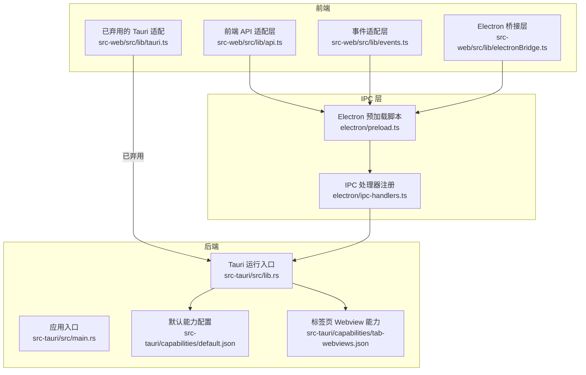
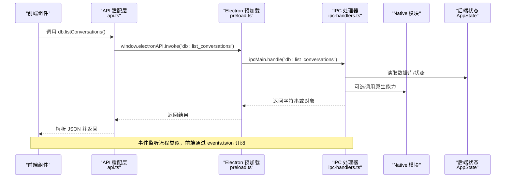
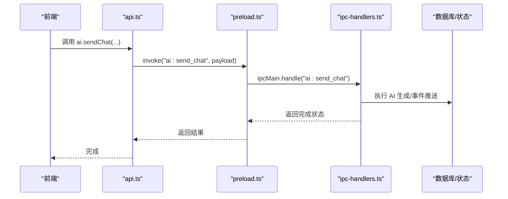
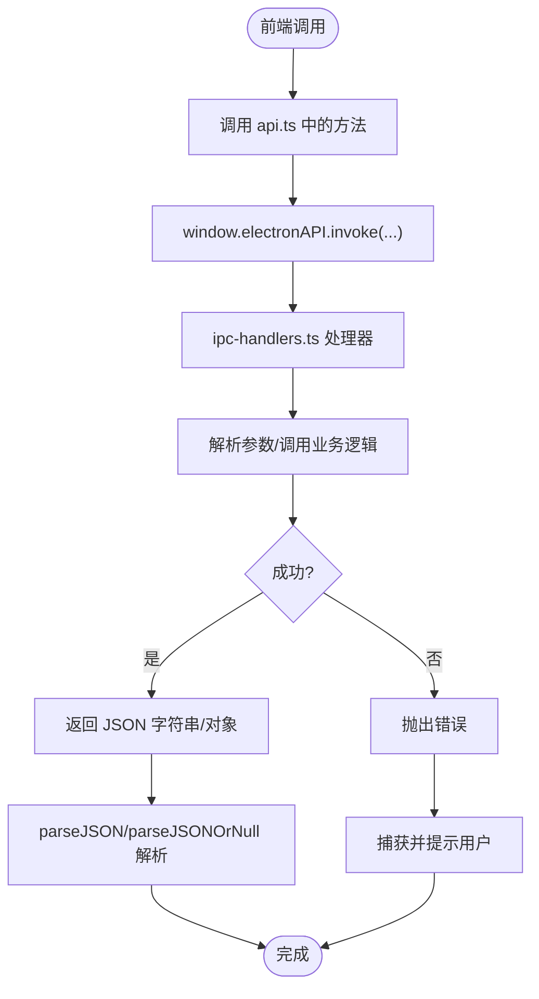
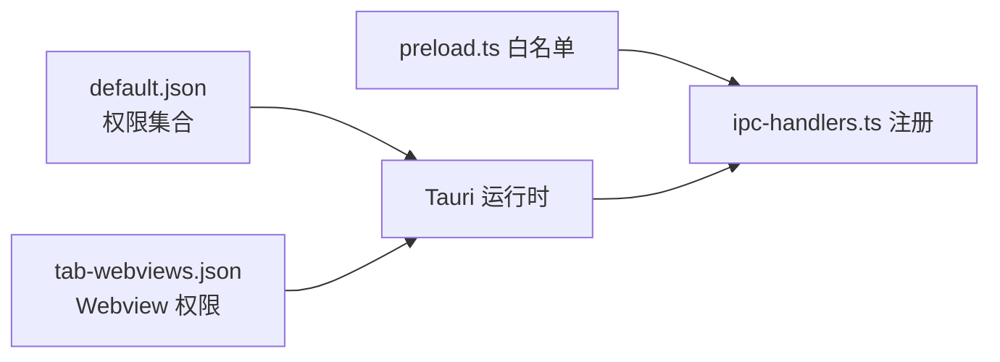
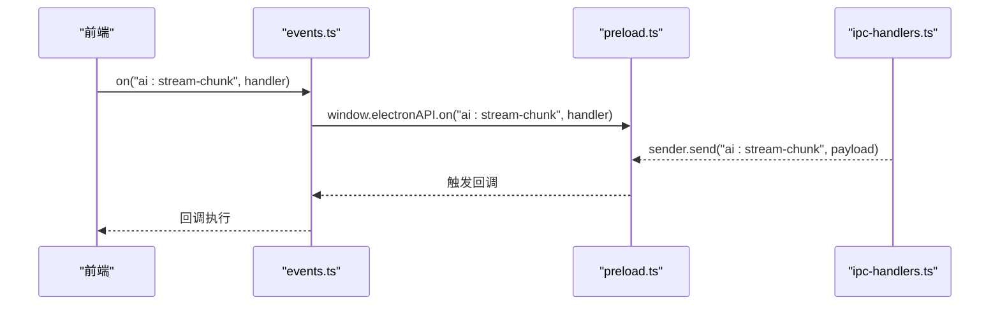
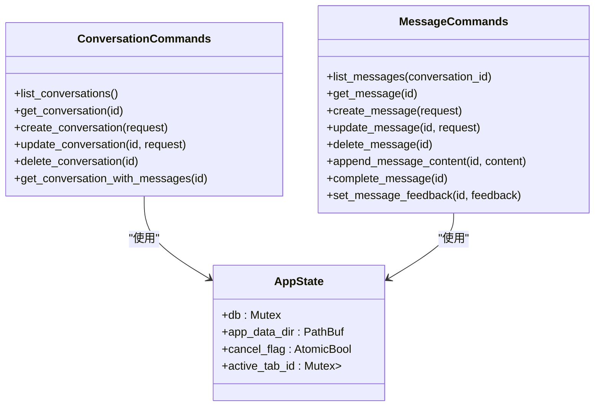
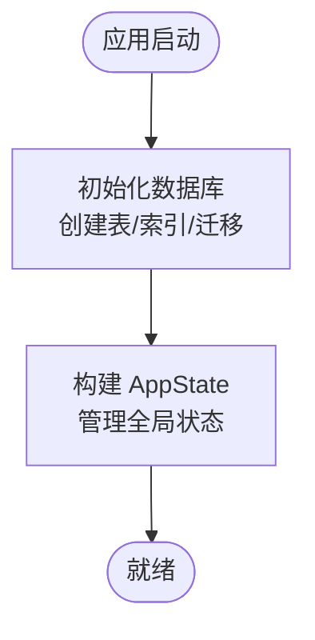
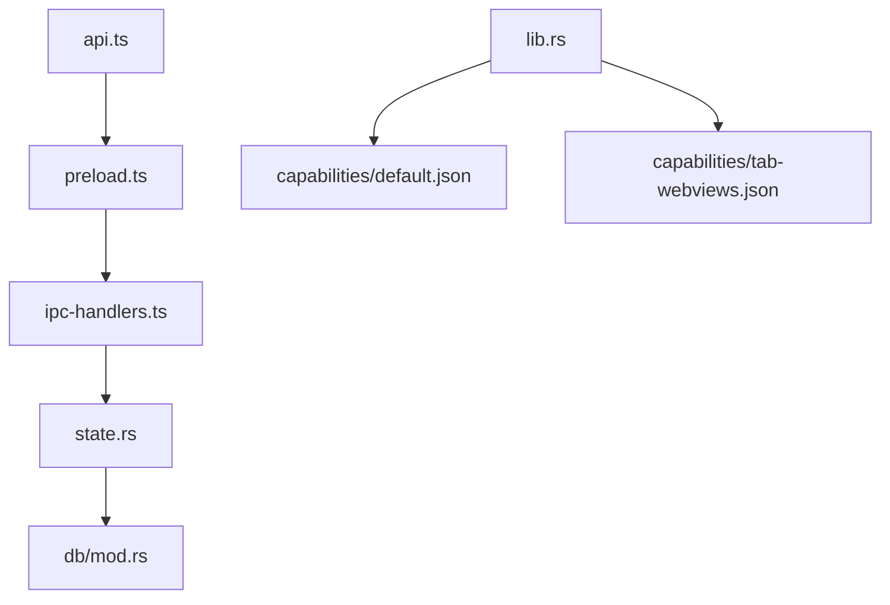

# Tauri IPC 机制

<cite>
**本文引用的文件**
- [src-tauri/src/lib.rs](file://src-tauri/src/lib.rs)
- [src-tauri/src/main.rs](file://src-tauri/src/main.rs)
- [src-tauri/tauri.conf.json](file://src-tauri/tauri.conf.json)
- [src-tauri/src/commands/mod.rs](file://src-tauri/src/commands/mod.rs)
- [src-tauri/src/commands/conversation.rs](file://src-tauri/src/commands/conversation.rs)
- [src-tauri/src/commands/message.rs](file://src-tauri/src/commands/message.rs)
- [src-tauri/src/state.rs](file://src-tauri/src/state.rs)
- [src-tauri/src/error.rs](file://src-tauri/src/error.rs)
- [src-tauri/src/db/mod.rs](file://src-tauri/src/db/mod.rs)
- [src-tauri/capabilities/default.json](file://src-tauri/capabilities/default.json)
- [src-tauri/capabilities/tab-webviews.json](file://src-tauri/capabilities/tab-webviews.json)
- [src-web/src/lib/tauri.ts](file://src-web/src/lib/tauri.ts)
- [src-web/src/lib/api.ts](file://src-web/src/lib/api.ts)
- [src-web/src/lib/events.ts](file://src-web/src/lib/events.ts)
- [src-web/src/lib/electronBridge.ts](file://src-web/src/lib/electronBridge.ts)
- [electron/preload.ts](file://electron/preload.ts)
- [electron/ipc-handlers.ts](file://electron/ipc-handlers.ts)
</cite>

## 目录
1. [简介](#简介)
2. [项目结构](#项目结构)
3. [核心组件](#核心组件)
4. [架构总览](#架构总览)
5. [详细组件分析](#详细组件分析)
6. [依赖关系分析](#依赖关系分析)
7. [性能考量](#性能考量)
8. [故障排查指南](#故障排查指南)
9. [结论](#结论)
10. [附录](#附录)

## 简介
本文件围绕 Tauri IPC 机制进行系统性说明，结合代码库中的实际实现，解释命令处理器注册、参数与返回值传递、序列化与反序列化、错误处理策略、安全模型与权限控制、事件系统工作原理，以及调试方法。同时，针对本仓库中前端已迁移到 Electron IPC 的现状，提供与 Electron IPC 的对比与迁移建议。

## 项目结构
该项目采用“前端 React + 后端 Rust + IPC 桥接”的架构。前端通过 Electron IPC 或 Tauri API（已弃用）与后端通信；后端以 Tauri 作为原生应用框架，注册命令处理器并通过状态对象共享数据库连接与全局资源。能力配置文件用于声明窗口与权限范围。

图表来源
- [src-tauri/src/lib.rs:41-216](file://src-tauri/src/lib.rs#L41-L216)
- [src-tauri/src/main.rs:1-6](file://src-tauri/src/main.rs#L1-L6)
- [src-web/src/lib/api.ts:1-429](file://src-web/src/lib/api.ts#L1-L429)
- [src-web/src/lib/events.ts:1-83](file://src-web/src/lib/events.ts#L1-L83)
- [src-web/src/lib/tauri.ts:1-20](file://src-web/src/lib/tauri.ts#L1-L20)
- [src-web/src/lib/electronBridge.ts:1-38](file://src-web/src/lib/electronBridge.ts#L1-L38)
- [electron/preload.ts:1-46](file://electron/preload.ts#L1-L46)
- [electron/ipc-handlers.ts:1-539](file://electron/ipc-handlers.ts#L1-L539)
- [src-tauri/capabilities/default.json:1-25](file://src-tauri/capabilities/default.json#L1-L25)
- [src-tauri/capabilities/tab-webviews.json:1-11](file://src-tauri/capabilities/tab-webviews.json#L1-L11)

章节来源
- [src-tauri/src/lib.rs:41-216](file://src-tauri/src/lib.rs#L41-L216)
- [src-tauri/src/main.rs:1-6](file://src-tauri/src/main.rs#L1-L6)
- [src-web/src/lib/api.ts:1-429](file://src-web/src/lib/api.ts#L1-L429)
- [src-web/src/lib/events.ts:1-83](file://src-web/src/lib/events.ts#L1-L83)
- [src-web/src/lib/tauri.ts:1-20](file://src-web/src/lib/tauri.ts#L1-L20)
- [src-web/src/lib/electronBridge.ts:1-38](file://src-web/src/lib/electronBridge.ts#L1-L38)
- [electron/preload.ts:1-46](file://electron/preload.ts#L1-L46)
- [electron/ipc-handlers.ts:1-539](file://electron/ipc-handlers.ts#L1-L539)
- [src-tauri/capabilities/default.json:1-25](file://src-tauri/capabilities/default.json#L1-L25)
- [src-tauri/capabilities/tab-webviews.json:1-11](file://src-tauri/capabilities/tab-webviews.json#L1-L11)

## 核心组件
- 命令处理器注册：后端通过生成器集中注册大量命令，涵盖对话、消息、书签、设置、AI、浏览器导航、页面上下文、截图、技能等。
- 前端 API 适配层：提供统一的 invoke 包装与 JSON 解析逻辑，屏蔽底层 IPC 差异。
- 事件系统：提供 on/once/off/removeAllListeners 等接口，抹平 Tauri 与 Electron 的事件差异。
- 状态与错误：通过 AppState 共享数据库连接与全局标志，错误统一映射为结构化错误对象。
- 能力与权限：通过 JSON 能力文件声明窗口、Webview 与权限集合。

章节来源
- [src-tauri/src/lib.rs:108-214](file://src-tauri/src/lib.rs#L108-L214)
- [src-web/src/lib/api.ts:12-49](file://src-web/src/lib/api.ts#L12-L49)
- [src-web/src/lib/events.ts:14-83](file://src-web/src/lib/events.ts#L14-L83)
- [src-tauri/src/state.rs:9-77](file://src-tauri/src/state.rs#L9-L77)
- [src-tauri/src/error.rs:41-64](file://src-tauri/src/error.rs#L41-L64)
- [src-tauri/capabilities/default.json:6-23](file://src-tauri/capabilities/default.json#L6-L23)
- [src-tauri/capabilities/tab-webviews.json:6-10](file://src-tauri/capabilities/tab-webviews.json#L6-L10)

## 架构总览
下图展示从前端到后端的 IPC 流程，包括命令调用与事件监听两条主线。

图表来源
- [src-web/src/lib/api.ts:54-73](file://src-web/src/lib/api.ts#L54-L73)
- [electron/preload.ts:30-46](file://electron/preload.ts#L30-L46)
- [electron/ipc-handlers.ts:48-80](file://electron/ipc-handlers.ts#L48-L80)
- [src-tauri/src/state.rs:9-23](file://src-tauri/src/state.rs#L9-L23)

章节来源
- [src-web/src/lib/api.ts:12-19](file://src-web/src/lib/api.ts#L12-L19)
- [electron/preload.ts:12-28](file://electron/preload.ts#L12-L28)
- [electron/ipc-handlers.ts:48-80](file://electron/ipc-handlers.ts#L48-L80)
- [src-tauri/src/state.rs:9-23](file://src-tauri/src/state.rs#L9-L23)

## 详细组件分析

### 命令处理器注册与调用模式
- 后端通过生成器集中注册命令，覆盖对话、消息、书签、设置、AI、浏览器导航、页面上下文、截图、技能等模块。
- 前端通过 API 适配层发起 invoke 请求，后端处理器接收 State 与参数，返回 Result 类型，错误统一映射为结构化对象。

图表来源
- [src-web/src/lib/api.ts:250-267](file://src-web/src/lib/api.ts#L250-L267)
- [electron/ipc-handlers.ts:281-306](file://electron/ipc-handlers.ts#L281-L306)

章节来源
- [src-tauri/src/lib.rs:108-214](file://src-tauri/src/lib.rs#L108-L214)
- [src-web/src/lib/api.ts:250-267](file://src-web/src/lib/api.ts#L250-L267)
- [electron/ipc-handlers.ts:281-306](file://electron/ipc-handlers.ts#L281-L306)

### 参数传递与返回值处理
- 前端 API 适配层对 N-API 返回的 JSON 字符串进行解析，提供 parseJSON 与 parseJSONOrNull 两类解析器，避免类型不一致导致的异常。
- 后端命令处理器接收 State 与参数，返回 Result，错误统一映射为结构化错误对象，便于前端识别与处理。

图表来源
- [src-web/src/lib/api.ts:25-49](file://src-web/src/lib/api.ts#L25-L49)
- [src-tauri/src/error.rs:41-64](file://src-tauri/src/error.rs#L41-L64)

章节来源
- [src-web/src/lib/api.ts:25-49](file://src-web/src/lib/api.ts#L25-L49)
- [src-tauri/src/error.rs:41-64](file://src-tauri/src/error.rs#L41-L64)

### 数据序列化与反序列化
- 前端对来自 Native 的 JSON 字符串进行二次解析，确保类型安全；对空值与非字符串进行分支处理。
- 后端错误类型实现序列化，保证 IPC 返回的错误信息可被前端正确消费。

章节来源
- [src-web/src/lib/api.ts:25-49](file://src-web/src/lib/api.ts#L25-L49)
- [src-tauri/src/error.rs:31-39](file://src-tauri/src/error.rs#L31-L39)

### 安全模型与权限控制
- 能力配置文件声明窗口与 Webview 的权限集合，如窗口控制、对话框、文件系统、全局快捷键、HTTP、通知、更新器、窗口状态等。
- 预加载脚本维护允许的 IPC 通道白名单，限制前端可调用的通道，降低攻击面。

图表来源
- [src-tauri/capabilities/default.json:6-23](file://src-tauri/capabilities/default.json#L6-L23)
- [src-tauri/capabilities/tab-webviews.json:6-10](file://src-tauri/capabilities/tab-webviews.json#L6-L10)
- [electron/preload.ts:30-46](file://electron/preload.ts#L30-L46)
- [electron/ipc-handlers.ts:48-80](file://electron/ipc-handlers.ts#L48-L80)

章节来源
- [src-tauri/capabilities/default.json:6-23](file://src-tauri/capabilities/default.json#L6-L23)
- [src-tauri/capabilities/tab-webviews.json:6-10](file://src-tauri/capabilities/tab-webviews.json#L6-L10)
- [electron/preload.ts:30-46](file://electron/preload.ts#L30-L46)

### 事件系统工作原理
- 事件适配层提供 on/once/off/removeAllListeners 等接口，抹平 Tauri 与 Electron 的事件差异。
- 后端可通过事件向前端推送 AI 流式片段、工具调用开始与结果、标签页状态变化等。

图表来源
- [src-web/src/lib/events.ts:51-66](file://src-web/src/lib/events.ts#L51-L66)
- [electron/preload.ts:12-28](file://electron/preload.ts#L12-L28)
- [electron/ipc-handlers.ts:336-344](file://electron/ipc-handlers.ts#L336-L344)

章节来源
- [src-web/src/lib/events.ts:51-66](file://src-web/src/lib/events.ts#L51-L66)
- [electron/ipc-handlers.ts:336-344](file://electron/ipc-handlers.ts#L336-L344)

### 命令处理器示例：对话与消息
- 对话相关命令：列出、获取、创建、更新、删除、带消息的对话详情。
- 消息相关命令：列表、获取、创建、更新、删除、追加内容、完成、设置反馈。

图表来源
- [src-tauri/src/commands/conversation.rs:8-72](file://src-tauri/src/commands/conversation.rs#L8-L72)
- [src-tauri/src/commands/message.rs:7-98](file://src-tauri/src/commands/message.rs#L7-L98)
- [src-tauri/src/state.rs:9-23](file://src-tauri/src/state.rs#L9-L23)

章节来源
- [src-tauri/src/commands/conversation.rs:8-72](file://src-tauri/src/commands/conversation.rs#L8-L72)
- [src-tauri/src/commands/message.rs:7-98](file://src-tauri/src/commands/message.rs#L7-L98)
- [src-tauri/src/state.rs:9-23](file://src-tauri/src/state.rs#L9-L23)

### 数据库与状态管理
- 数据库初始化与迁移：创建表、索引、迁移历史字段，确保字段一致性。
- 应用状态：持有数据库连接、应用数据目录、取消标志、活动标签页 ID、页面内容响应缓存、Skills 管理器、最近打开 URL 记录、MCP 工具注册表。

图表来源
- [src-tauri/src/db/mod.rs:41-148](file://src-tauri/src/db/mod.rs#L41-L148)
- [src-tauri/src/state.rs:25-77](file://src-tauri/src/state.rs#L25-L77)

章节来源
- [src-tauri/src/db/mod.rs:41-148](file://src-tauri/src/db/mod.rs#L41-L148)
- [src-tauri/src/state.rs:25-77](file://src-tauri/src/state.rs#L25-L77)

## 依赖关系分析
- 前端 API 适配层依赖 Electron 预加载脚本暴露的安全 API。
- IPC 处理器注册依赖白名单通道，确保仅允许受控通道。
- 后端命令处理器依赖 AppState 与数据库连接，错误类型统一映射。

图表来源
- [src-web/src/lib/api.ts:12-19](file://src-web/src/lib/api.ts#L12-L19)
- [electron/preload.ts:12-28](file://electron/preload.ts#L12-L28)
- [electron/ipc-handlers.ts:48-80](file://electron/ipc-handlers.ts#L48-L80)
- [src-tauri/src/state.rs:9-23](file://src-tauri/src/state.rs#L9-L23)
- [src-tauri/src/db/mod.rs:11-30](file://src-tauri/src/db/mod.rs#L11-L30)
- [src-tauri/src/lib.rs:41-50](file://src-tauri/src/lib.rs#L41-L50)
- [src-tauri/capabilities/default.json:6-23](file://src-tauri/capabilities/default.json#L6-L23)
- [src-tauri/capabilities/tab-webviews.json:6-10](file://src-tauri/capabilities/tab-webviews.json#L6-L10)

章节来源
- [src-web/src/lib/api.ts:12-19](file://src-web/src/lib/api.ts#L12-L19)
- [electron/preload.ts:12-28](file://electron/preload.ts#L12-L28)
- [electron/ipc-handlers.ts:48-80](file://electron/ipc-handlers.ts#L48-L80)
- [src-tauri/src/state.rs:9-23](file://src-tauri/src/state.rs#L9-L23)
- [src-tauri/src/db/mod.rs:11-30](file://src-tauri/src/db/mod.rs#L11-L30)
- [src-tauri/src/lib.rs:41-50](file://src-tauri/src/lib.rs#L41-L50)
- [src-tauri/capabilities/default.json:6-23](file://src-tauri/capabilities/default.json#L6-L23)
- [src-tauri/capabilities/tab-webviews.json:6-10](file://src-tauri/capabilities/tab-webviews.json#L6-L10)

## 性能考量
- 日志记录：后端使用 tracing 初始化日志，便于定位性能瓶颈与异常。
- 异步任务：全局快捷键触发截图等操作通过异步运行时执行，避免阻塞主线程。
- 数据库 WAL 模式与外键约束：提升并发写入与数据一致性。
- 事件驱动：AI 流式响应通过事件推送，减少轮询带来的 CPU 开销。

章节来源
- [src-tauri/src/lib.rs:17-21](file://src-tauri/src/lib.rs#L17-L21)
- [src-tauri/src/lib.rs:78-93](file://src-tauri/src/lib.rs#L78-L93)
- [src-tauri/src/db/mod.rs:24-25](file://src-tauri/src/db/mod.rs#L24-L25)

## 故障排查指南
- IPC 通道不可用：确认前端是否注入了 window.electronAPI，以及通道是否在白名单中。
- JSON 解析失败：检查后端返回字符串是否为合法 JSON，必要时在前端增加 try-catch 与降级逻辑。
- 错误码识别：后端错误统一映射为结构化对象，前端可根据 code 字段进行分类处理。
- 日志定位：启用 tracing 输出，结合后端日志与前端控制台输出定位问题。

章节来源
- [electron/preload.ts:30-46](file://electron/preload.ts#L30-L46)
- [src-web/src/lib/api.ts:25-49](file://src-web/src/lib/api.ts#L25-L49)
- [src-tauri/src/error.rs:41-64](file://src-tauri/src/error.rs#L41-L64)
- [src-tauri/src/lib.rs:17-21](file://src-tauri/src/lib.rs#L17-L21)

## 结论
本项目在前端已完全迁移到 Electron IPC 的情况下，仍保留了完整的 Tauri IPC 机制实现与能力配置。后端通过命令处理器与状态管理提供了稳定的数据访问与业务处理能力，前端通过 API 与事件适配层屏蔽了底层差异。若未来需要回退到 Tauri，现有代码结构与能力配置可直接复用。

## 附录

### 与 Electron IPC 的对比与迁移指南
- 调用模式
  - Tauri：前端通过 @tauri-apps/api 的 invoke/listen/emit 与后端通信。
  - Electron：前端通过 window.electronAPI.invoke/on/send 与后端通信。
- 迁移要点
  - 将前端调用从 invoke('command', args) 迁移到 electronBridge.invoke('command', args)。
  - 将事件监听从 listen('event', handler) 迁移到 electronBridge.on('event', handler)。
  - 将事件触发从 emit('event', payload) 迁移到 electronBridge.send('event', payload)。
  - 保持后端 IPC 处理器签名一致，确保位置参数顺序与类型匹配。

章节来源
- [src-web/src/lib/tauri.ts:1-20](file://src-web/src/lib/tauri.ts#L1-L20)
- [src-web/src/lib/electronBridge.ts:32-38](file://src-web/src/lib/electronBridge.ts#L32-L38)
- [electron/preload.ts:12-28](file://electron/preload.ts#L12-L28)
- [electron/ipc-handlers.ts:48-80](file://electron/ipc-handlers.ts#L48-L80)