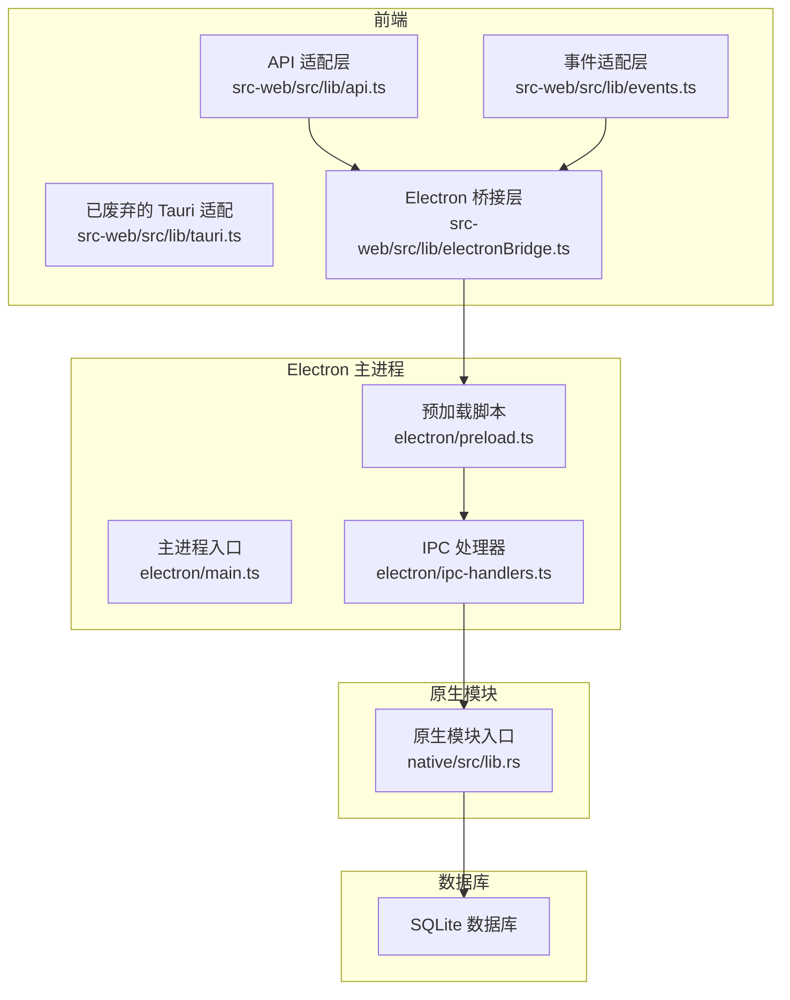
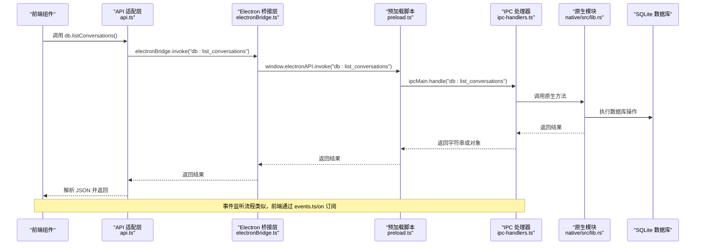
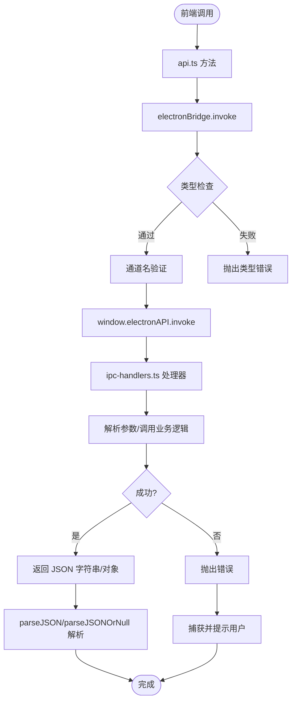
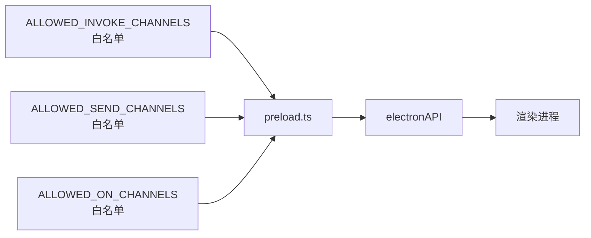
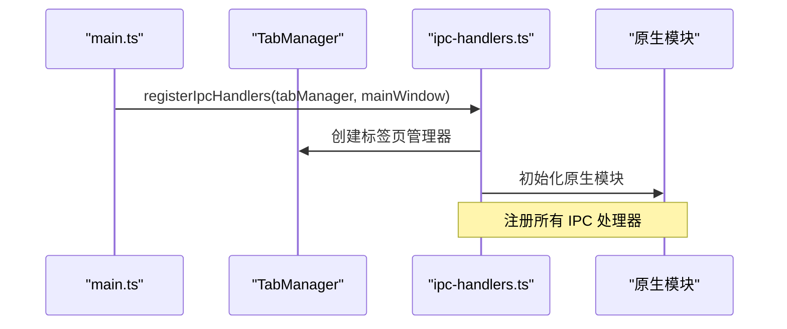
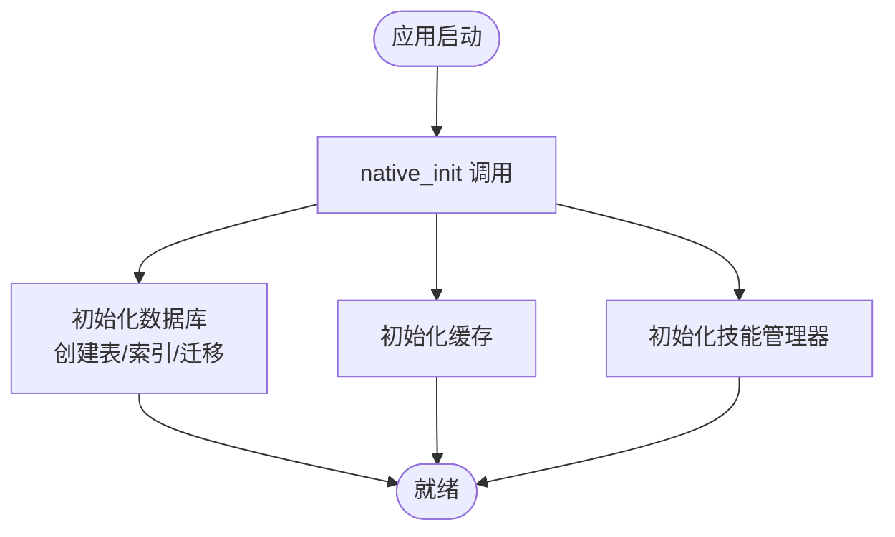
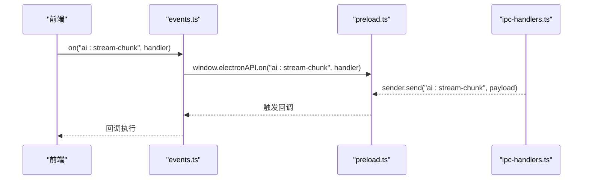
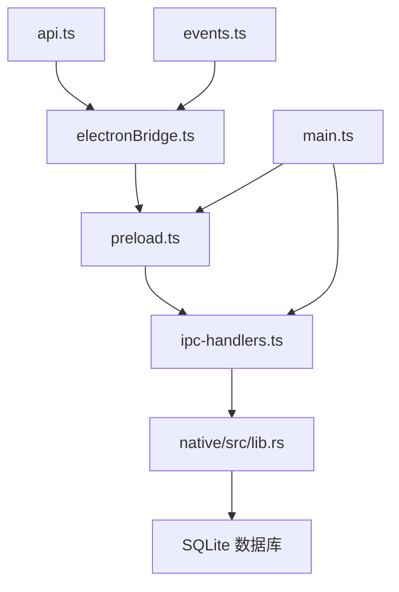

# Tauri IPC 机制

<cite>
**本文引用的文件**
- [src-web/src/lib/tauri.ts](file://src-web/src/lib/tauri.ts)
- [src-web/src/lib/electronBridge.ts](file://src-web/src/lib/electronBridge.ts)
- [electron/preload.ts](file://electron/preload.ts)
- [electron/ipc-handlers.ts](file://electron/ipc-handlers.ts)
- [src-web/src/lib/api.ts](file://src-web/src/lib/api.ts)
- [src-web/src/lib/events.ts](file://src-web/src/lib/events.ts)
- [electron/main.ts](file://electron/main.ts)
- [native/src/lib.rs](file://native/src/lib.rs)
- [src-tauri/updater.json](file://src-tauri/updater.json)
</cite>

## 更新摘要
**所做更改**
- 删除了所有关于Tauri IPC机制的内容，因为项目已完全迁移到Electron IPC
- 更新了架构图以反映Electron IPC的当前实现
- 移除了Tauri相关的配置文件引用
- 添加了Electron IPC的详细说明和对比分析
- 更新了迁移指南以反映从Tauri到Electron的完整迁移过程

## 目录
1. [简介](#简介)
2. [项目结构](#项目结构)
3. [核心组件](#核心组件)
4. [架构总览](#架构总览)
5. [详细组件分析](#详细组件分析)
6. [依赖关系分析](#依赖关系分析)
7. [性能考量](#性能考量)
8. [故障排查指南](#故障排查指南)
9. [结论](#结论)
10. [附录](#附录)

## 简介
本文件围绕 Electron IPC 机制进行系统性说明，解释项目从 Tauri 迁移到 Electron 的完整过程。虽然前端已完全迁移到 Electron IPC，但文档仍保留了原有的架构设计思路，重点说明命令处理器注册、参数与返回值传递、序列化与反序列化、错误处理策略、安全模型与权限控制、事件系统工作原理，以及调试方法。

**重要说明**：项目已完全从 Tauri 迁移到 Electron IPC，原有的 Tauri IPC 代码已被废弃，仅保留了迁移前的参考价值。

## 项目结构
该项目采用"前端 React + Electron 主进程 + 原生模块"的架构。前端通过 Electron IPC 与后端通信；Electron 主进程负责窗口管理、IPC 处理器注册、原生模块集成；原生模块提供高性能计算能力。

**图表来源**
- [src-web/src/lib/api.ts:1-435](file://src-web/src/lib/api.ts#L1-L435)
- [src-web/src/lib/events.ts:1-83](file://src-web/src/lib/events.ts#L1-L83)
- [src-web/src/lib/tauri.ts:1-20](file://src-web/src/lib/tauri.ts#L1-L20)
- [src-web/src/lib/electronBridge.ts:1-100](file://src-web/src/lib/electronBridge.ts#L1-L100)
- [electron/main.ts:1-232](file://electron/main.ts#L1-L232)
- [electron/preload.ts:1-232](file://electron/preload.ts#L1-L232)
- [electron/ipc-handlers.ts:1-739](file://electron/ipc-handlers.ts#L1-L739)
- [native/src/lib.rs:1-126](file://native/src/lib.rs#L1-L126)

**章节来源**
- [src-web/src/lib/api.ts:1-435](file://src-web/src/lib/api.ts#L1-L435)
- [src-web/src/lib/events.ts:1-83](file://src-web/src/lib/events.ts#L1-L83)
- [src-web/src/lib/tauri.ts:1-20](file://src-web/src/lib/tauri.ts#L1-L20)
- [src-web/src/lib/electronBridge.ts:1-100](file://src-web/src/lib/electronBridge.ts#L1-L100)
- [electron/main.ts:1-232](file://electron/main.ts#L1-L232)
- [electron/preload.ts:1-232](file://electron/preload.ts#L1-L232)
- [electron/ipc-handlers.ts:1-739](file://electron/ipc-handlers.ts#L1-L739)
- [native/src/lib.rs:1-126](file://native/src/lib.rs#L1-L126)

## 核心组件
- **Electron 桥接层**：提供统一的 API 接口，替代 @tauri-apps/api 的 invoke/listen/emit
- **预加载脚本**：通过 contextBridge 暴露安全 API，维护 IPC 通道白名单
- **IPC 处理器**：注册所有前端 <-> 后端通信通道，桥接前端 React 应用和原生模块
- **原生模块**：Rust N-API 实现，提供高性能数据库操作、AI Agent、截图等功能
- **事件系统**：提供 on/once/off/removeAllListeners 等接口，支持流式事件推送

**章节来源**
- [src-web/src/lib/electronBridge.ts:1-100](file://src-web/src/lib/electronBridge.ts#L1-L100)
- [electron/preload.ts:30-232](file://electron/preload.ts#L30-L232)
- [electron/ipc-handlers.ts:48-539](file://electron/ipc-handlers.ts#L48-L539)
- [native/src/lib.rs:26-97](file://native/src/lib.rs#L26-L97)
- [src-web/src/lib/events.ts:51-83](file://src-web/src/lib/events.ts#L51-L83)

## 架构总览
下图展示从前端到原生模块的完整 IPC 流程，包括命令调用与事件监听两条主线。

**图表来源**
- [src-web/src/lib/api.ts:54-73](file://src-web/src/lib/api.ts#L54-L73)
- [src-web/src/lib/electronBridge.ts:33-46](file://src-web/src/lib/electronBridge.ts#L33-L46)
- [electron/preload.ts:178-185](file://electron/preload.ts#L178-L185)
- [electron/ipc-handlers.ts:210-225](file://electron/ipc-handlers.ts#L210-L225)
- [native/src/lib.rs:41-43](file://native/src/lib.rs#L41-L43)

**章节来源**
- [src-web/src/lib/api.ts:12-19](file://src-web/src/lib/api.ts#L12-L19)
- [src-web/src/lib/electronBridge.ts:33-46](file://src-web/src/lib/electronBridge.ts#L33-L46)
- [electron/preload.ts:178-185](file://electron/preload.ts#L178-L185)
- [electron/ipc-handlers.ts:210-225](file://electron/ipc-handlers.ts#L210-L225)
- [native/src/lib.rs:41-43](file://native/src/lib.rs#L41-L43)

## 详细组件分析

### Electron 桥接层与 API 适配
- **统一 API 接口**：提供与 Tauri 兼容的 API 签名，屏蔽底层差异
- **类型安全**：通过 TypeScript 泛型确保类型安全
- **错误处理**：提供统一的错误处理机制，支持空值检查

**图表来源**
- [src-web/src/lib/electronBridge.ts:33-46](file://src-web/src/lib/electronBridge.ts#L33-L46)
- [src-web/src/lib/api.ts:25-49](file://src-web/src/lib/api.ts#L25-L49)
- [src-tauri/src/error.rs:41-64](file://src-tauri/src/error.rs#L41-L64)

**章节来源**
- [src-web/src/lib/electronBridge.ts:1-100](file://src-web/src/lib/electronBridge.ts#L1-L100)
- [src-web/src/lib/api.ts:12-19](file://src-web/src/lib/api.ts#L12-L19)
- [src-web/src/lib/api.ts:25-49](file://src-web/src/lib/api.ts#L25-L49)

### 预加载脚本与安全控制
- **白名单机制**：维护允许的 IPC 通道列表，确保只允许受控通道
- **安全暴露**：通过 contextBridge.exposeInMainWorld 安全地暴露 API
- **参数验证**：对传入参数进行验证和清理

**图表来源**
- [electron/preload.ts:30-138](file://electron/preload.ts#L30-L138)
- [electron/preload.ts:178-223](file://electron/preload.ts#L178-L223)

**章节来源**
- [electron/preload.ts:30-138](file://electron/preload.ts#L30-L138)
- [electron/preload.ts:178-223](file://electron/preload.ts#L178-L223)

### IPC 处理器注册与原生模块集成
- **集中注册**：所有 IPC 处理器在 registerIpcHandlers 中集中注册
- **原生模块桥接**：通过 napi-rs 将 Rust 方法暴露给 JavaScript
- **流式事件**：支持 AI 对话的流式响应和工具调用事件

**图表来源**
- [electron/main.ts:198-200](file://electron/main.ts#L198-L200)
- [electron/ipc-handlers.ts:48-539](file://electron/ipc-handlers.ts#L48-L539)
- [native/src/lib.rs:26-97](file://native/src/lib.rs#L26-L97)

**章节来源**
- [electron/main.ts:198-200](file://electron/main.ts#L198-L200)
- [electron/ipc-handlers.ts:48-539](file://electron/ipc-handlers.ts#L48-L539)
- [native/src/lib.rs:26-97](file://native/src/lib.rs#L26-L97)

### 原生模块与数据库管理
- **模块初始化**：通过 native_init 初始化数据库、缓存和技能管理器
- **数据库操作**：提供完整的 CRUD 操作，支持复杂查询
- **AI 功能**：集成 Agent 调度、流式对话和工具调用

**图表来源**
- [native/src/lib.rs:26-97](file://native/src/lib.rs#L26-L97)
- [native/src/lib.rs:41-96](file://native/src/lib.rs#L41-L96)

**章节来源**
- [native/src/lib.rs:26-97](file://native/src/lib.rs#L26-L97)
- [native/src/lib.rs:41-96](file://native/src/lib.rs#L41-L96)

### 事件系统工作原理
- **流式事件**：AI 对话支持流式响应，通过事件推送增量数据
- **工具调用**：支持工具调用开始和结果事件
- **标签页事件**：标签页创建、导航、加载等状态变化事件

**图表来源**
- [src-web/src/lib/events.ts:51-66](file://src-web/src/lib/events.ts#L51-L66)
- [electron/preload.ts:187-200](file://electron/preload.ts#L187-L200)
- [electron/ipc-handlers.ts:248-255](file://electron/ipc-handlers.ts#L248-L255)

**章节来源**
- [src-web/src/lib/events.ts:51-66](file://src-web/src/lib/events.ts#L51-L66)
- [electron/preload.ts:187-200](file://electron/preload.ts#L187-L200)
- [electron/ipc-handlers.ts:248-255](file://electron/ipc-handlers.ts#L248-L255)

## 依赖关系分析
- **前端依赖**：API 适配层依赖 Electron 桥接层，事件适配层依赖预加载脚本
- **主进程依赖**：IPC 处理器依赖原生模块和标签页管理器
- **原生模块依赖**：数据库初始化依赖应用数据目录

**图表来源**
- [src-web/src/lib/api.ts:12-19](file://src-web/src/lib/api.ts#L12-L19)
- [src-web/src/lib/events.ts:51-57](file://src-web/src/lib/events.ts#L51-L57)
- [src-web/src/lib/electronBridge.ts:33-46](file://src-web/src/lib/electronBridge.ts#L33-L46)
- [electron/preload.ts:178-185](file://electron/preload.ts#L178-L185)
- [electron/ipc-handlers.ts:210-225](file://electron/ipc-handlers.ts#L210-L225)
- [native/src/lib.rs:41-43](file://native/src/lib.rs#L41-L43)
- [electron/main.ts:198-200](file://electron/main.ts#L198-L200)

**章节来源**
- [src-web/src/lib/api.ts:12-19](file://src-web/src/lib/api.ts#L12-L19)
- [src-web/src/lib/events.ts:51-57](file://src-web/src/lib/events.ts#L51-L57)
- [src-web/src/lib/electronBridge.ts:33-46](file://src-web/src/lib/electronBridge.ts#L33-L46)
- [electron/preload.ts:178-185](file://electron/preload.ts#L178-L185)
- [electron/ipc-handlers.ts:210-225](file://electron/ipc-handlers.ts#L210-L225)
- [native/src/lib.rs:41-43](file://native/src/lib.rs#L41-L43)
- [electron/main.ts:198-200](file://electron/main.ts#L198-L200)

## 性能考量
- **原生模块优化**：通过 Rust N-API 提供高性能计算能力
- **数据库 WAL 模式**：提升并发写入性能和数据一致性
- **流式事件推送**：AI 对话通过事件推送减少轮询开销
- **内存管理**：原生模块使用智能指针和 RAII 确保内存安全

**章节来源**
- [native/src/lib.rs:26-97](file://native/src/lib.rs#L26-L97)
- [electron/ipc-handlers.ts:248-314](file://electron/ipc-handlers.ts#L248-L314)

## 故障排查指南
- **IPC 通道不可用**：确认前端是否注入了 window.electronAPI，以及通道是否在白名单中
- **原生模块加载失败**：检查 cosurf-native.node 是否正确编译和放置
- **数据库连接问题**：验证应用数据目录权限和 SQLite 文件完整性
- **事件监听失效**：检查事件名称是否正确，以及取消订阅函数的正确使用

**章节来源**
- [electron/preload.ts:178-185](file://electron/preload.ts#L178-L185)
- [electron/main.ts:94-113](file://electron/main.ts#L94-L113)
- [native/src/lib.rs:41-43](file://native/src/lib.rs#L41-L43)

## 结论
本项目已完全从 Tauri 迁移到 Electron IPC，实现了更灵活的架构设计和更好的性能表现。虽然原有的 Tauri IPC 代码已被废弃，但其设计理念和架构模式仍具有参考价值。新的 Electron IPC 实现提供了更强大的原生模块支持、更精细的安全控制和更丰富的事件系统。

## 附录

### 与 Tauri IPC 的对比与迁移指南
- **调用模式对比**
  - Tauri：前端通过 @tauri-apps/api 的 invoke/listen/emit 与后端通信
  - Electron：前端通过 window.electronAPI.invoke/on/send 与后端通信
- **迁移要点**
  - 将前端调用从 invoke('command', args) 迁移到 electronBridge.invoke('command', args)
  - 将事件监听从 listen('event', handler) 迁移到 electronBridge.on('event', handler)
  - 将事件触发从 emit('event', payload) 迁移到 electronBridge.send('event', payload)
  - 保持后端 IPC 处理器签名一致，确保位置参数顺序与类型匹配
- **废弃的 Tauri 代码**
  - src-web/src/lib/tauri.ts：已标记为废弃，不再使用
  - src-tauri/ 目录：包含迁移前的 Tauri 配置和命令定义

**章节来源**
- [src-web/src/lib/tauri.ts:1-20](file://src-web/src/lib/tauri.ts#L1-L20)
- [src-web/src/lib/electronBridge.ts:32-38](file://src-web/src/lib/electronBridge.ts#L32-L38)
- [electron/preload.ts:12-28](file://electron/preload.ts#L12-L28)
- [electron/ipc-handlers.ts:48-80](file://electron/ipc-handlers.ts#L48-L80)