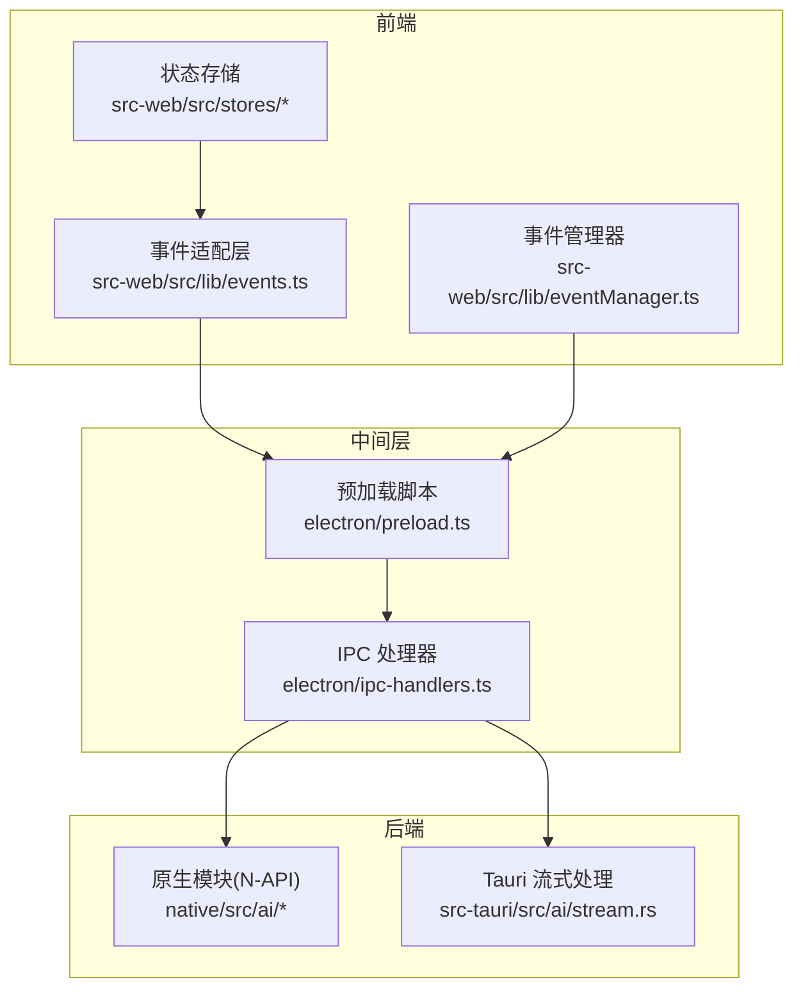
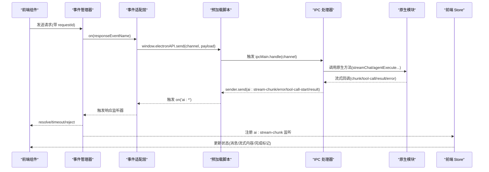
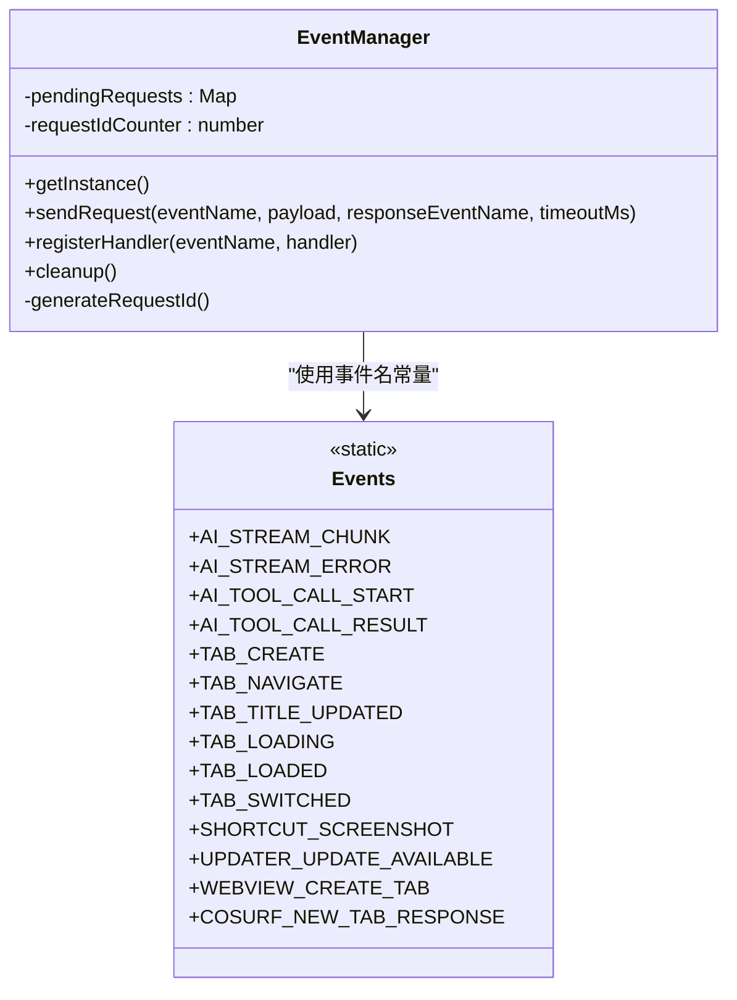
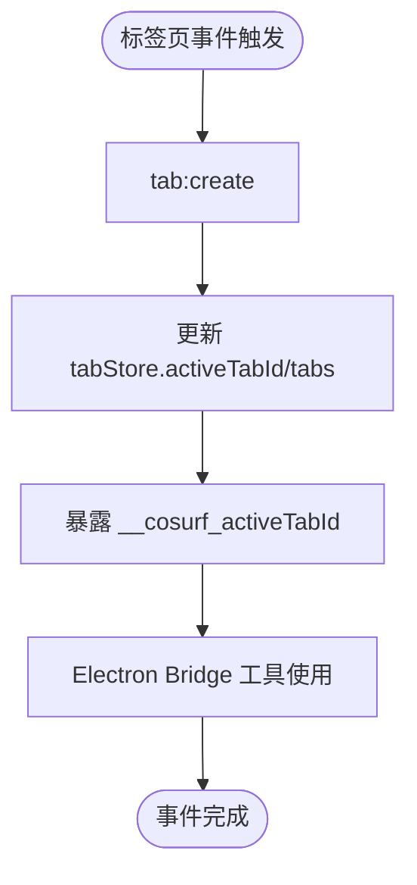
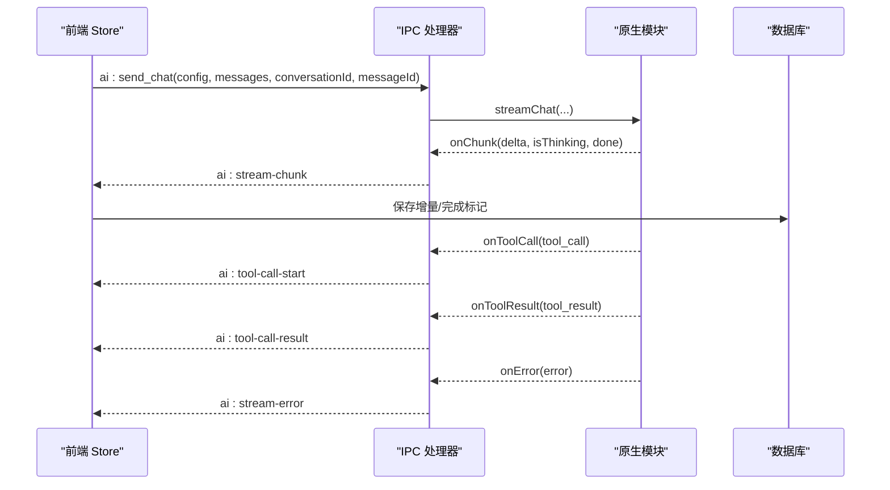
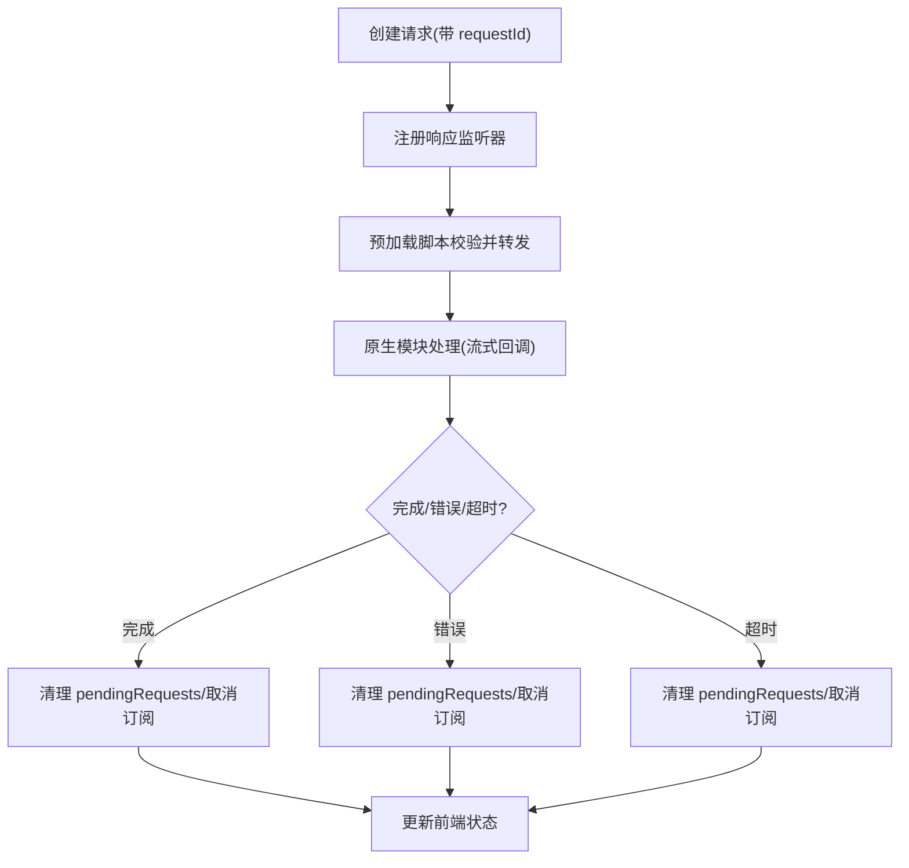
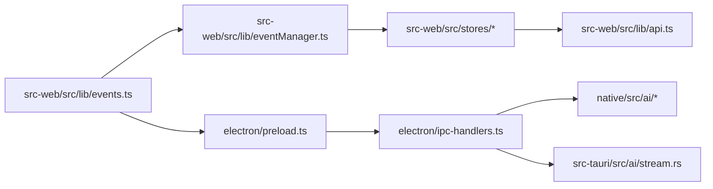

# 事件系统

<cite>
**本文档引用的文件**
- [eventManager.ts](file://src-web/src/lib/eventManager.ts)
- [events.ts](file://src-web/src/lib/events.ts)
- [preload.ts](file://electron/preload.ts)
- [ipc-handlers.ts](file://electron/ipc-handlers.ts)
- [tabStore.ts](file://src-web/src/stores/tabStore.ts)
- [conversationStore.ts](file://src-web/src/stores/conversationStore.ts)
- [stream.rs](file://src-tauri/src/ai/stream.rs)
- [stream.rs](file://native/src/ai/stream.rs)
- [agent.rs](file://native/src/ai/agent.rs)
- [api.ts](file://src-web/src/lib/api.ts)
</cite>

## 目录
1. [简介](#简介)
2. [项目结构](#项目结构)
3. [核心组件](#核心组件)
4. [架构总览](#架构总览)
5. [详细组件分析](#详细组件分析)
6. [依赖关系分析](#依赖关系分析)
7. [性能考量](#性能考量)
8. [故障排查指南](#故障排查指南)
9. [结论](#结论)
10. [附录](#附录)

## 简介
本文件系统性梳理 CoSurf 事件驱动架构，覆盖前端事件适配层、后端 IPC 处理器、状态变更事件、数据库事件、AI 代理事件等。重点阐述事件类型定义、发布订阅模式、事件处理器管理、生命周期管理（创建、分发、处理、清理）、优先级与排序机制、并发处理与冲突解决、调试方法与性能监控、以及与状态管理、数据库操作、AI 代理的集成方式。

## 项目结构
CoSurf 采用“前端事件适配层 + Electron IPC + Rust 原生模块”的三层事件体系：
- 前端：统一事件适配层封装 Electron IPC，提供与 Tauri 兼容的 API 签名
- 中间层：Electron 预加载脚本与 IPC 处理器，负责白名单校验与事件转发
- 后端：Rust 原生模块（N-API）执行 AI 流式对话与工具调用，通过事件回调向前端推送

图表来源
- [events.ts:1-83](file://src-web/src/lib/events.ts#L1-L83)
- [eventManager.ts:1-108](file://src-web/src/lib/eventManager.ts#L1-L108)
- [preload.ts:1-232](file://electron/preload.ts#L1-L232)
- [ipc-handlers.ts:1-712](file://electron/ipc-handlers.ts#L1-L712)
- [stream.rs:26-463](file://native/src/ai/stream.rs#L26-L463)
- [stream.rs:77-602](file://src-tauri/src/ai/stream.rs#L77-L602)

章节来源
- [events.ts:1-83](file://src-web/src/lib/events.ts#L1-L83)
- [eventManager.ts:1-108](file://src-web/src/lib/eventManager.ts#L1-L108)
- [preload.ts:1-232](file://electron/preload.ts#L1-L232)
- [ipc-handlers.ts:1-712](file://electron/ipc-handlers.ts#L1-L712)

## 核心组件
- 事件名称常量与适配层：统一事件名、抹平 Tauri/Electron 差异，提供 on/once/off/removeAllListeners 等 API
- 事件管理器：封装请求-响应模式、超时控制、待处理请求管理、处理器注册与清理
- 预加载脚本：白名单通道控制、安全暴露 invoke/on/send/once/removeAllListeners
- IPC 处理器：注册所有前端 <-> 后端通道，桥接原生模块与前端 Store
- 原生流式模块：AI 对话流式回调（chunk/tool-call/result/error），触发前端事件
- 前端 Store：监听事件并更新状态，维护会话与标签页生命周期

章节来源
- [events.ts:14-83](file://src-web/src/lib/events.ts#L14-L83)
- [eventManager.ts:16-105](file://src-web/src/lib/eventManager.ts#L16-L105)
- [preload.ts:13-220](file://electron/preload.ts#L13-L220)
- [ipc-handlers.ts:48-528](file://electron/ipc-handlers.ts#L48-L528)
- [stream.rs:26-463](file://native/src/ai/stream.rs#L26-L463)
- [conversationStore.ts:172-243](file://src-web/src/stores/conversationStore.ts#L172-L243)

## 架构总览
事件系统以“请求-响应 + 流式事件”双通道协同工作：
- 请求-响应：前端通过 EventManager 发送带 requestId 的请求，等待特定响应事件
- 流式事件：后端通过 IPC 向前端推送 ai:stream-chunk、ai:tool-call-start、ai:tool-call-result、ai:stream-error 等事件

图表来源
- [eventManager.ts:40-82](file://src-web/src/lib/eventManager.ts#L40-L82)
- [events.ts:51-79](file://src-web/src/lib/events.ts#L51-L79)
- [preload.ts:178-220](file://electron/preload.ts#L178-L220)
- [ipc-handlers.ts:231-315](file://electron/ipc-handlers.ts#L231-L315)
- [stream.rs:66-76](file://native/src/ai/stream.rs#L66-L76)

章节来源
- [eventManager.ts:40-82](file://src-web/src/lib/eventManager.ts#L40-L82)
- [events.ts:51-79](file://src-web/src/lib/events.ts#L51-L79)
- [preload.ts:178-220](file://electron/preload.ts#L178-L220)
- [ipc-handlers.ts:231-315](file://electron/ipc-handlers.ts#L231-L315)
- [stream.rs:66-76](file://native/src/ai/stream.rs#L66-L76)

## 详细组件分析

### 前端事件适配层与事件管理器
- 事件名称常量：集中定义 AI 流式事件、标签页事件、系统事件，确保前后端一致
- 事件适配层：封装 window.electronAPI.on/once/send/removeAllListeners，提供与 Tauri 兼容的 API
- 事件管理器：
  - 请求-响应：生成唯一 requestId，注册响应监听器，超时清理，支持清理函数
  - 处理器注册：registerHandler 包装 on，返回取消订阅函数
  - 清理：cleanup 统一关闭所有待处理请求，防止内存泄漏

图表来源
- [eventManager.ts:16-105](file://src-web/src/lib/eventManager.ts#L16-L105)
- [events.ts:15-35](file://src-web/src/lib/events.ts#L15-L35)

章节来源
- [events.ts:14-83](file://src-web/src/lib/events.ts#L14-L83)
- [eventManager.ts:16-105](file://src-web/src/lib/eventManager.ts#L16-L105)

### 标签页事件与状态管理集成
- 标签页事件：create/navigate/title-updated/loading/loaded/switched
- 前端 Store：维护 tabs/activeTabId/navigationHistory，暴露 __cosurf_activeTabId、__cosurf_navigateTo、__cosurf_updateTab 给主进程
- 事件传播：Store 更新后通过 window.electronAPI 暴露的全局变量供主进程桥接工具使用

图表来源
- [tabStore.ts:56-96](file://src-web/src/stores/tabStore.ts#L56-L96)
- [ipc-handlers.ts:534-711](file://electron/ipc-handlers.ts#L534-L711)

章节来源
- [tabStore.ts:1-248](file://src-web/src/stores/tabStore.ts#L1-L248)
- [ipc-handlers.ts:534-711](file://electron/ipc-handlers.ts#L534-L711)

### AI 代理事件与流式处理
- 事件类型：ai:stream-chunk、ai:stream-error、ai:tool-call-start、ai:tool-call-result
- 原生模块回调：ChunkEvent/ToolCallEvent/ToolResultEvent/ElectronBridgeEvent
- 后端流式处理：SSE/流式事件聚合、重复调用检测、工具调用并发执行、完成信号与数据库落盘
- 前端 Store 监听：接收流式增量、工具调用通知、错误处理、完成标记

图表来源
- [ipc-handlers.ts:231-315](file://electron/ipc-handlers.ts#L231-L315)
- [stream.rs:66-76](file://native/src/ai/stream.rs#L66-L76)
- [stream.rs:77-602](file://src-tauri/src/ai/stream.rs#L77-L602)
- [conversationStore.ts:172-243](file://src-web/src/stores/conversationStore.ts#L172-L243)

章节来源
- [ipc-handlers.ts:231-315](file://electron/ipc-handlers.ts#L231-L315)
- [stream.rs:26-463](file://native/src/ai/stream.rs#L26-L463)
- [stream.rs:77-602](file://src-tauri/src/ai/stream.rs#L77-L602)
- [conversationStore.ts:172-243](file://src-web/src/stores/conversationStore.ts#L172-L243)

### 数据库事件与状态变更事件
- 数据库事件：通过 db:* 通道与原生模块交互，事件名与方法名一一对应
- 状态变更事件：前端 Store 自动持久化消息、会话、标签页状态，事件驱动 UI 更新
- 事件传播：Store 更新后触发 UI 重新渲染，必要时通过 window.electronAPI 暴露状态给主进程

章节来源
- [ipc-handlers.ts:211-226](file://electron/ipc-handlers.ts#L211-L226)
- [api.ts:229-245](file://src-web/src/lib/api.ts#L229-L245)
- [conversationStore.ts:154-171](file://src-web/src/stores/conversationStore.ts#L154-L171)

### 事件生命周期管理
- 创建：前端生成请求并携带 requestId，注册响应监听器
- 分发：预加载脚本根据白名单校验后转发至 ipcMain.handle
- 处理：原生模块执行 AI/工具/页面操作，通过回调事件推送前端
- 清理：超时或完成时清理 pendingRequests，取消订阅，释放资源

图表来源
- [eventManager.ts:40-82](file://src-web/src/lib/eventManager.ts#L40-L82)
- [preload.ts:178-220](file://electron/preload.ts#L178-L220)
- [ipc-handlers.ts:231-315](file://electron/ipc-handlers.ts#L231-L315)

章节来源
- [eventManager.ts:40-82](file://src-web/src/lib/eventManager.ts#L40-L82)
- [preload.ts:178-220](file://electron/preload.ts#L178-L220)
- [ipc-handlers.ts:231-315](file://electron/ipc-handlers.ts#L231-L315)

### 事件优先级与排序机制
- 事件优先级：前端 Store 通过 on 监听 ai:stream-chunk/ai:stream-error，按事件到达顺序处理
- 排序机制：会话内消息按时间戳与角色排序；标签页导航历史按索引维护
- 并发处理：原生模块对工具调用进行并发执行，前端 Store 通过 conversationId 匹配事件归属
- 冲突解决：重复工具调用检测（基于签名），避免无限循环；取消标志用于中断流式生成

章节来源
- [conversationStore.ts:172-243](file://src-web/src/stores/conversationStore.ts#L172-L243)
- [stream.rs:90-113](file://src-tauri/src/ai/stream.rs#L90-L113)
- [agent.rs:13-31](file://native/src/ai/agent.rs#L13-L31)

### 事件系统与其他组件的集成
- 与状态管理：Store 通过事件驱动状态更新，如会话消息、标签页状态
- 与数据库：通过 db:* 通道持久化消息、会话、设置、历史等数据
- 与 AI 代理：通过 ai:* 通道进行流式对话、工具调用、页面摘要等

章节来源
- [conversationStore.ts:1-365](file://src-web/src/stores/conversationStore.ts#L1-L365)
- [api.ts:229-265](file://src-web/src/lib/api.ts#L229-L265)
- [ipc-handlers.ts:231-400](file://electron/ipc-handlers.ts#L231-L400)

## 依赖关系分析
- 前端依赖：事件适配层依赖 window.electronAPI；事件管理器依赖事件适配层；Store 依赖事件适配层与 API
- 中间层依赖：预加载脚本依赖白名单；IPC 处理器依赖原生模块与窗口管理
- 后端依赖：原生模块依赖 AI Provider、工具集、数据库；Tauri 流式处理依赖 AppState 与数据库

图表来源
- [events.ts:1-83](file://src-web/src/lib/events.ts#L1-L83)
- [eventManager.ts:1-108](file://src-web/src/lib/eventManager.ts#L1-L108)
- [preload.ts:1-232](file://electron/preload.ts#L1-L232)
- [ipc-handlers.ts:1-712](file://electron/ipc-handlers.ts#L1-L712)
- [stream.rs:1-463](file://native/src/ai/stream.rs#L1-L463)
- [stream.rs:1-602](file://src-tauri/src/ai/stream.rs#L1-L602)
- [api.ts:229-265](file://src-web/src/lib/api.ts#L229-L265)

章节来源
- [events.ts:1-83](file://src-web/src/lib/events.ts#L1-L83)
- [eventManager.ts:1-108](file://src-web/src/lib/eventManager.ts#L1-L108)
- [preload.ts:1-232](file://electron/preload.ts#L1-L232)
- [ipc-handlers.ts:1-712](file://electron/ipc-handlers.ts#L1-L712)
- [stream.rs:1-463](file://native/src/ai/stream.rs#L1-L463)
- [stream.rs:1-602](file://src-tauri/src/ai/stream.rs#L1-L602)
- [api.ts:229-265](file://src-web/src/lib/api.ts#L229-L265)

## 性能考量
- 事件监听器数量：每个请求创建一个响应监听器，建议及时取消订阅，避免内存泄漏
- 流式事件吞吐：原生模块以回调形式推送事件，前端 Store 逐条处理，注意批量更新策略
- 并发工具调用：后端对工具调用并发执行，前端需按 conversationId 匹配，避免状态错乱
- 超时控制：请求-响应模式设置超时，防止长时间挂起

## 故障排查指南
- 事件未触发：检查事件名是否匹配、白名单是否允许、是否正确注册监听器
- 请求无响应：确认 requestId 是否正确、超时时间是否合理、是否被提前取消
- 流式事件丢失：检查前端 Store 是否正确监听 ai:stream-chunk/ai:stream-error
- 工具调用失败：查看后端日志与错误事件，确认参数与权限
- 性能问题：减少不必要的监听器数量，合并状态更新，避免频繁重渲染

调试要点
- 前端控制台：观察事件日志与 Store 状态变化
- 后端日志：关注原生模块回调与错误信息
- 白名单校验：确认通道是否在 ALLOWED_* 列表中

章节来源
- [events.ts:51-79](file://src-web/src/lib/events.ts#L51-L79)
- [eventManager.ts:40-82](file://src-web/src/lib/eventManager.ts#L40-L82)
- [ipc-handlers.ts:231-315](file://electron/ipc-handlers.ts#L231-L315)
- [stream.rs:440-451](file://native/src/ai/stream.rs#L440-L451)

## 结论
CoSurf 事件系统通过“前端适配层 + Electron IPC + 原生模块”的分层设计，实现了跨进程的事件通信与状态驱动。请求-响应与流式事件双通道协同，结合 Store 的事件驱动状态管理，提供了稳定、可扩展的事件处理能力。通过白名单控制与超时清理，系统在安全性与性能之间取得平衡。未来可在事件队列管理、并发调度与冲突解决方面进一步优化，以支持更高复杂度的 AI 代理与多标签页场景。

## 附录
- 事件名称常量：集中定义于事件适配层，确保前后端一致性
- API 使用示例路径：参考事件管理器与 Store 的调用位置
- 日志与错误处理：前后端均提供详细日志与错误事件，便于定位问题