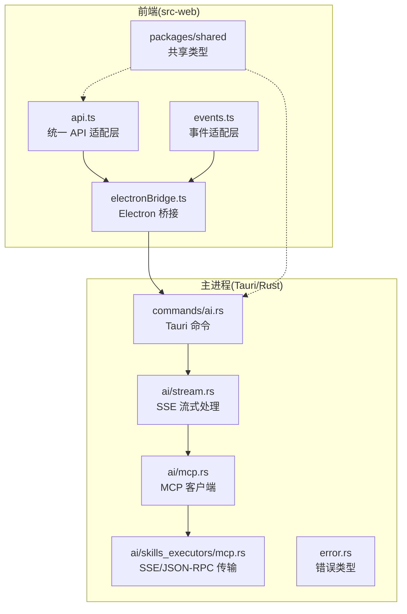
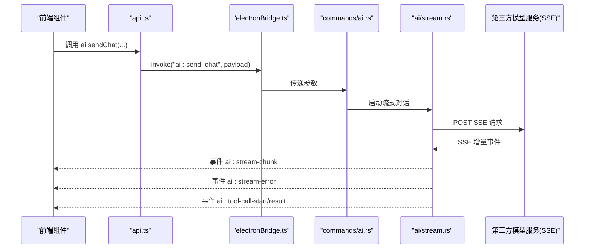
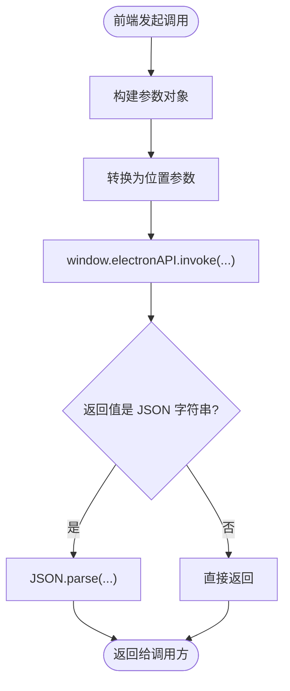
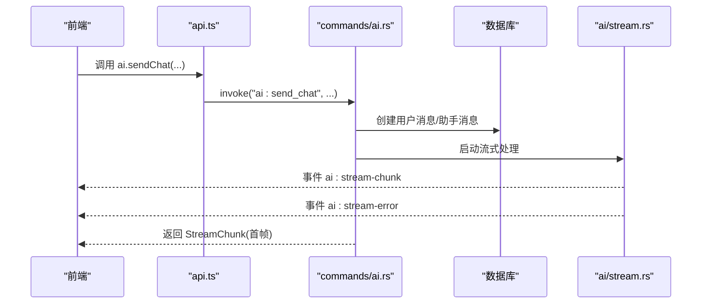
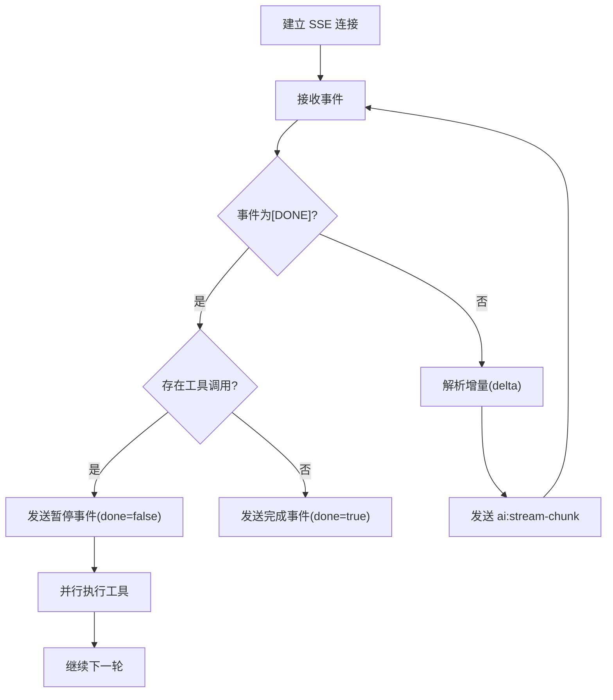
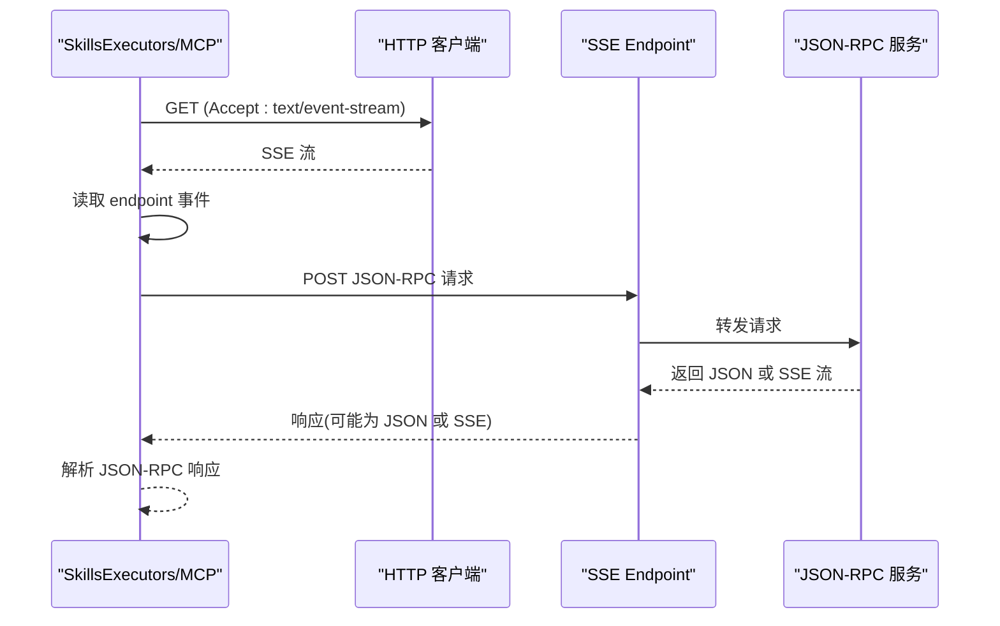
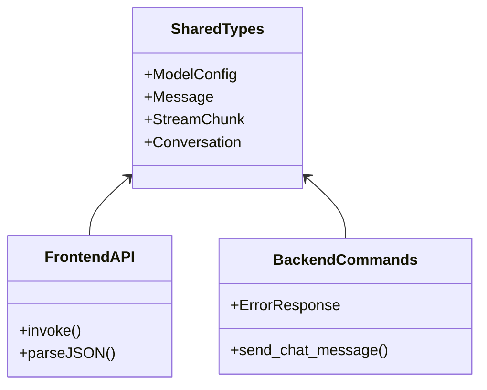
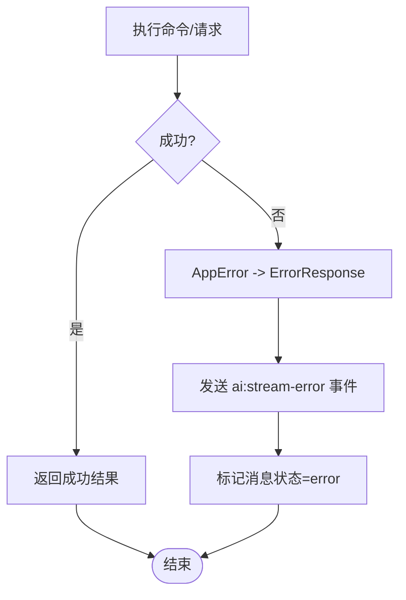
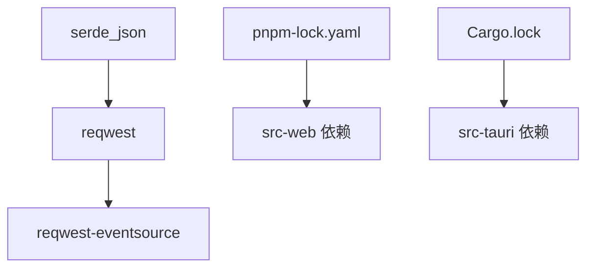

# 数据传输协议

<cite>
**本文引用的文件**
- [src-tauri/src/commands/ai.rs](file://src-tauri/src/commands/ai.rs)
- [src-tauri/src/ai/stream.rs](file://src-tauri/src/ai/stream.rs)
- [src-tauri/src/ai/mcp.rs](file://src-tauri/src/ai/mcp.rs)
- [src-tauri/src/ai/skills_executors/mcp.rs](file://src-tauri/src/ai/skills_executors/mcp.rs)
- [src-tauri/src/error.rs](file://src-tauri/src/error.rs)
- [src-web/src/lib/api.ts](file://src-web/src/lib/api.ts)
- [src-web/src/lib/events.ts](file://src-web/src/lib/events.ts)
- [src-web/src/lib/electronBridge.ts](file://src-web/src/lib/electronBridge.ts)
- [packages/shared/src/message.ts](file://packages/shared/src/message.ts)
- [packages/shared/src/conversation.ts](file://packages/shared/src/conversation.ts)
- [packages/shared/src/model.ts](file://packages/shared/src/model.ts)
- [packages/shared/src/index.ts](file://packages/shared/src/index.ts)
- [Cargo.lock](file://Cargo.lock)
- [pnpm-lock.yaml](file://pnpm-lock.yaml)
- [README.md](file://README.md)
</cite>

## 目录
1. [简介](#简介)
2. [项目结构](#项目结构)
3. [核心组件](#核心组件)
4. [架构总览](#架构总览)
5. [详细组件分析](#详细组件分析)
6. [依赖关系分析](#依赖关系分析)
7. [性能考量](#性能考量)
8. [故障排查指南](#故障排查指南)
9. [结论](#结论)
10. [附录](#附录)

## 简介
本文件系统性梳理 CoSurf 的数据传输协议与实现，覆盖前后端通信模式、请求/响应格式、参数校验、返回值处理、REST 风格端点、状态码、JSON 序列化与反序列化、SSE 流式传输、错误处理与异常传播、性能优化与安全考虑，以及共享类型定义的维护方式。

## 项目结构
CoSurf 采用前端 React（src-web）、后端 Tauri/Rust（src-tauri）与共享类型（packages/shared）的分层架构。前端通过 Electron IPC 与主进程通信；后端通过 Tauri 命令暴露接口，并通过 SSE 与第三方大模型服务交互；共享类型确保前后端数据契约一致。

**图表来源**
- [README.md:53-100](file://README.md#L53-L100)
- [src-web/src/lib/api.ts:1-445](file://src-web/src/lib/api.ts#L1-L445)
- [src-web/src/lib/events.ts:1-83](file://src-web/src/lib/events.ts#L1-L83)
- [src-web/src/lib/electronBridge.ts:1-100](file://src-web/src/lib/electronBridge.ts#L1-L100)
- [src-tauri/src/commands/ai.rs:1-397](file://src-tauri/src/commands/ai.rs#L1-L397)
- [src-tauri/src/ai/stream.rs:1-778](file://src-tauri/src/ai/stream.rs#L1-L778)
- [src-tauri/src/ai/mcp.rs:1-151](file://src-tauri/src/ai/mcp.rs#L1-L151)
- [src-tauri/src/ai/skills_executors/mcp.rs:295-519](file://src-tauri/src/ai/skills_executors/mcp.rs#L295-L519)
- [src-tauri/src/error.rs:1-64](file://src-tauri/src/error.rs#L1-L64)

**章节来源**
- [README.md:53-100](file://README.md#L53-L100)
- [README.md:213-328](file://README.md#L213-L328)

## 核心组件
- 前端 API 适配层：封装 Electron IPC，统一调用约定，负责参数序列化与 N-API 字符串解析。
- 事件适配层：屏蔽 Tauri 与 Electron 的事件差异，提供统一的 on/once/off 接口。
- Tauri 命令：暴露后端能力（如发送消息、停止生成、生成标题），并触发 SSE 流式处理。
- SSE 流式处理：与第三方模型服务建立 SSE 连接，解析增量响应，聚合工具调用，驱动 Agent Loop。
- MCP 客户端与执行器：支持 stdio/SSE/Streamable HTTP 传输，JSON-RPC 2.0 协议，SSE endpoint 发现与请求。
- 错误处理：统一 AppError/ErrorResponse，跨语言边界传递错误信息。
- 共享类型：前后端一致的数据模型与事件结构，保证契约稳定。

**章节来源**
- [src-web/src/lib/api.ts:1-445](file://src-web/src/lib/api.ts#L1-L445)
- [src-web/src/lib/events.ts:1-83](file://src-web/src/lib/events.ts#L1-L83)
- [src-tauri/src/commands/ai.rs:1-397](file://src-tauri/src/commands/ai.rs#L1-L397)
- [src-tauri/src/ai/stream.rs:1-778](file://src-tauri/src/ai/stream.rs#L1-L778)
- [src-tauri/src/ai/mcp.rs:1-151](file://src-tauri/src/ai/mcp.rs#L1-L151)
- [src-tauri/src/ai/skills_executors/mcp.rs:295-519](file://src-tauri/src/ai/skills_executors/mcp.rs#L295-L519)
- [src-tauri/src/error.rs:1-64](file://src-tauri/src/error.rs#L1-L64)
- [packages/shared/src/index.ts:1-9](file://packages/shared/src/index.ts#L1-L9)

## 架构总览
CoSurf 的数据传输链路如下：
- 前端通过 api.ts 调用 Electron IPC，向主进程发送命令。
- 主进程命令层（commands/ai.rs）协调数据库与 AI 流式处理（ai/stream.rs）。
- SSE 流式处理与第三方模型服务交互，事件通过 Tauri 事件系统推送到前端。
- MCP 客户端与执行器支持外部工具扩展，可通过 SSE endpoint 或 JSON-RPC 与外部服务通信。
- 共享类型（packages/shared）确保前后端数据结构一致。

**图表来源**
- [src-web/src/lib/api.ts:254-271](file://src-web/src/lib/api.ts#L254-L271)
- [src-web/src/lib/electronBridge.ts:32-46](file://src-web/src/lib/electronBridge.ts#L32-L46)
- [src-tauri/src/commands/ai.rs:16-274](file://src-tauri/src/commands/ai.rs#L16-L274)
- [src-tauri/src/ai/stream.rs:357-602](file://src-tauri/src/ai/stream.rs#L357-L602)

## 详细组件分析

### 前端 API 与事件协议
- 统一 API 适配层（api.ts）：将 Tauri 风格的命名参数转换为 Electron IPC 的位置参数；对 N-API 返回的 JSON 字符串进行解析；提供数据库、AI、标签页、页面、截图、技能、缓存、对话框、窗口控制、MCP 服务器等模块化 API。
- 事件适配层（events.ts）：提供 on/once/off 与 Tauri 兼容的事件监听接口，事件名常量统一管理。
- Electron 桥接（electronBridge.ts）：封装 invoke/on/send/once/removeAllListeners，提供 isElectron 检测与窗口控制快捷方法。

**图表来源**
- [src-web/src/lib/api.ts:13-49](file://src-web/src/lib/api.ts#L13-L49)
- [src-web/src/lib/electronBridge.ts:32-46](file://src-web/src/lib/electronBridge.ts#L32-L46)

**章节来源**
- [src-web/src/lib/api.ts:1-445](file://src-web/src/lib/api.ts#L1-L445)
- [src-web/src/lib/events.ts:1-83](file://src-web/src/lib/events.ts#L1-L83)
- [src-web/src/lib/electronBridge.ts:1-100](file://src-web/src/lib/electronBridge.ts#L1-L100)

### Tauri 命令与请求/响应模式
- 命令定义：通过 #[tauri::command] 注解暴露后端能力，如发送聊天消息、停止生成、生成标题等。
- 请求参数：命令接收明确的参数类型（如 conversation_id、content、config、messages 等），并在内部进行必要的校验与转换。
- 响应模式：命令返回 Result<T, ErrorResponse>，ErrorResponse 包含 code 与 message；部分命令返回流式首帧（StreamChunk）以启动前端监听。
- 状态码与错误：后端统一映射 AppError 为 ErrorResponse，前端据此展示错误信息。

**图表来源**
- [src-tauri/src/commands/ai.rs:16-274](file://src-tauri/src/commands/ai.rs#L16-L274)
- [src-tauri/src/ai/stream.rs:650-714](file://src-tauri/src/ai/stream.rs#L650-L714)

**章节来源**
- [src-tauri/src/commands/ai.rs:1-397](file://src-tauri/src/commands/ai.rs#L1-L397)
- [src-tauri/src/error.rs:41-61](file://src-tauri/src/error.rs#L41-L61)

### SSE 流式数据传输与实时推送
- SSE 建立：通过 reqwest_eventsource 创建 EventSource，发送 POST 请求，接收 text/event-stream。
- 增量解析：逐条解析 SSE 事件，区分 content、reasoning_content、tool_calls 等增量字段；累计工具调用并等待 [DONE]。
- 事件推送：通过 Tauri 事件系统向前端推送 ai:stream-chunk、ai:stream-error、ai:tool-call-start/result。
- Agent Loop：若存在工具调用，暂停当前轮次，进入工具执行阶段，完成后继续下一轮。

**图表来源**
- [src-tauri/src/ai/stream.rs:357-602](file://src-tauri/src/ai/stream.rs#L357-L602)

**章节来源**
- [src-tauri/src/ai/stream.rs:1-778](file://src-tauri/src/ai/stream.rs#L1-L778)

### MCP 客户端与 JSON-RPC 传输
- 传输模式：支持 stdio、SSE、Streamable HTTP；SSE 模式下通过 GET endpoint 发现 endpoint URL，随后 POST JSON-RPC 2.0 请求。
- JSON-RPC：请求包含 jsonrpc、id、method、params；响应包含 result 或 error；SSE 模式下从事件流中提取 JSON-RPC 响应。
- URL 解析：支持相对路径与完整 URL，基于 base_url 拼接。

**图表来源**
- [src-tauri/src/ai/skills_executors/mcp.rs:309-460](file://src-tauri/src/ai/skills_executors/mcp.rs#L309-L460)

**章节来源**
- [src-tauri/src/ai/skills_executors/mcp.rs:295-519](file://src-tauri/src/ai/skills_executors/mcp.rs#L295-L519)

### 数据序列化与反序列化
- 前端：api.ts 对 N-API 返回的 JSON 字符串进行解析；对复杂对象进行 JSON.stringify 序列化。
- 后端：使用 serde_json 进行请求/响应的序列化与反序列化；错误类型实现 Serialize 以便跨边界传递。
- 共享类型：packages/shared 提供 TypeScript 类型定义，确保前后端一致。

**图表来源**
- [packages/shared/src/model.ts:1-33](file://packages/shared/src/model.ts#L1-L33)
- [packages/shared/src/message.ts:14-35](file://packages/shared/src/message.ts#L14-L35)
- [packages/shared/src/conversation.ts:1-14](file://packages/shared/src/conversation.ts#L1-L14)
- [src-web/src/lib/api.ts:25-49](file://src-web/src/lib/api.ts#L25-L49)
- [src-tauri/src/error.rs:41-61](file://src-tauri/src/error.rs#L41-L61)

**章节来源**
- [src-web/src/lib/api.ts:1-445](file://src-web/src/lib/api.ts#L1-L445)
- [src-tauri/src/error.rs:1-64](file://src-tauri/src/error.rs#L1-L64)
- [packages/shared/src/index.ts:1-9](file://packages/shared/src/index.ts#L1-L9)

### 错误处理与异常传播
- 错误类型：AppError 统一封装数据库、HTTP、JSON、Tauri、AI Provider、配置、未找到、内部错误等。
- 错误映射：From<AppError> 实现 ErrorResponse，包含 code 与 message。
- 传播路径：后端命令返回 Result，前端通过事件或调用返回值接收错误；SSE 流程中遇到错误时发送 ai:stream-error 事件并标记消息状态。

**图表来源**
- [src-tauri/src/error.rs:4-61](file://src-tauri/src/error.rs#L4-L61)
- [src-tauri/src/ai/stream.rs:547-568](file://src-tauri/src/ai/stream.rs#L547-L568)

**章节来源**
- [src-tauri/src/error.rs:1-64](file://src-tauri/src/error.rs#L1-L64)
- [src-tauri/src/ai/stream.rs:1-778](file://src-tauri/src/ai/stream.rs#L1-L778)

## 依赖关系分析
- 外部依赖：reqwest、reqwest-eventsource、serde_json 等用于 HTTP 与 SSE 通信及 JSON 处理。
- 包管理：pnpm（前端）与 Cargo（后端）分别管理依赖版本。

**图表来源**
- [Cargo.lock:4342-4395](file://Cargo.lock#L4342-L4395)
- [pnpm-lock.yaml:3524-3557](file://pnpm-lock.yaml#L3524-L3557)

**章节来源**
- [Cargo.lock:4342-4395](file://Cargo.lock#L4342-L4395)
- [pnpm-lock.yaml:3524-3557](file://pnpm-lock.yaml#L3524-L3557)

## 性能考量
- 流式传输：SSE 增量推送减少延迟，前端即时渲染；合理拆分工具调用，避免长轮次阻塞。
- 工具调用并发：并行执行多个工具调用，缩短整体响应时间。
- 重复调用抑制：检测连续重复工具调用，注入提示避免死循环，必要时强制中断。
- 数据库写入：流式内容分片写入，降低内存占用。
- 网络优化：复用 HTTP 客户端，避免频繁握手；SSE 连接超时与错误重试策略。

**章节来源**
- [src-tauri/src/ai/stream.rs:84-283](file://src-tauri/src/ai/stream.rs#L84-L283)
- [src-tauri/src/ai/stream.rs:122-178](file://src-tauri/src/ai/stream.rs#L122-L178)

## 故障排查指南
- 网络与认证：检查 API Key、Base URL、网络连通性；关注 SSE 连接超时与 endpoint 发现失败。
- SSE 错误：SSE 流程中出现错误时，后端会发送 ai:stream-error 事件并标记消息状态为 error；前端应显示错误并允许重试。
- 工具调用：若工具调用格式错误，后端会注入错误消息；确认工具 schema 与参数类型一致。
- 数据库锁：命令层对数据库加锁失败时返回 LOCK_ERROR；检查并发写入与事务冲突。
- 前端 IPC：确认 window.electronAPI 可用；参数序列化/反序列化错误需检查 api.ts 的 parseJSON 逻辑。

**章节来源**
- [src-tauri/src/ai/stream.rs:547-568](file://src-tauri/src/ai/stream.rs#L547-L568)
- [src-tauri/src/commands/ai.rs:25-38](file://src-tauri/src/commands/ai.rs#L25-L38)
- [src-web/src/lib/api.ts:25-49](file://src-web/src/lib/api.ts#L25-L49)

## 结论
CoSurf 的数据传输协议以 Electron IPC 为桥梁，结合 SSE 流式传输与 MCP 扩展，实现了高效、可观测且可扩展的前后端通信。通过统一的错误处理与共享类型，保障了跨语言边界的稳定性与一致性。后续可在工具调用并发策略、SSE 连接池与缓存策略方面进一步优化。

## 附录

### API 端点与事件清单
- 命令端点（Electron IPC）
  - ai:send_chat
  - ai:stop_generation
  - ai:generate_title
  - db:*（数据库 CRUD）
  - tab:*（标签页）
  - page:*（页面）
  - screenshot:*（截图）
  - skills:*（技能）
  - cache:*（缓存）
  - dialog:*（对话框）
  - shell:*（Shell）
  - agent:*（Agent）
  - mcp:*（MCP 服务器）

- 事件
  - ai:stream-chunk
  - ai:stream-error
  - ai:tool-call-start
  - ai:tool-call-result
  - tab:*（标签页相关事件）
  - shortcut:screenshot
  - updater:update-available
  - cosurf:new-tab-response

**章节来源**
- [src-web/src/lib/api.ts:54-445](file://src-web/src/lib/api.ts#L54-L445)
- [src-web/src/lib/events.ts:14-35](file://src-web/src/lib/events.ts#L14-L35)
- [src-tauri/src/commands/ai.rs:16-397](file://src-tauri/src/commands/ai.rs#L16-L397)