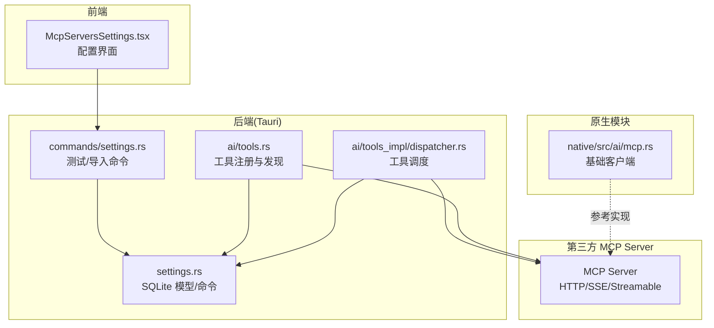
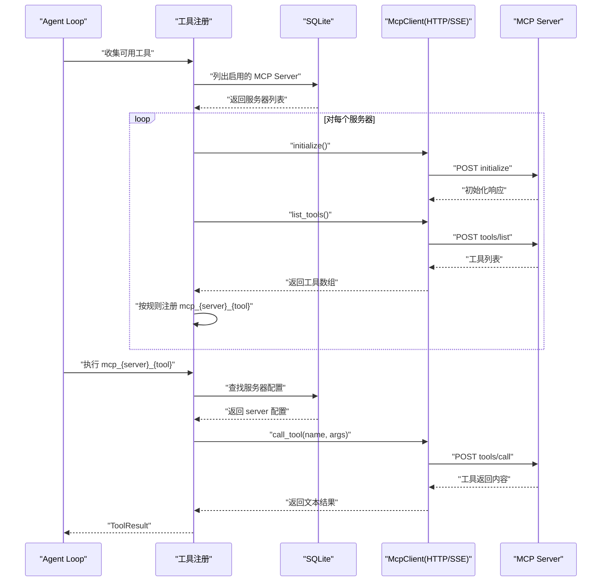
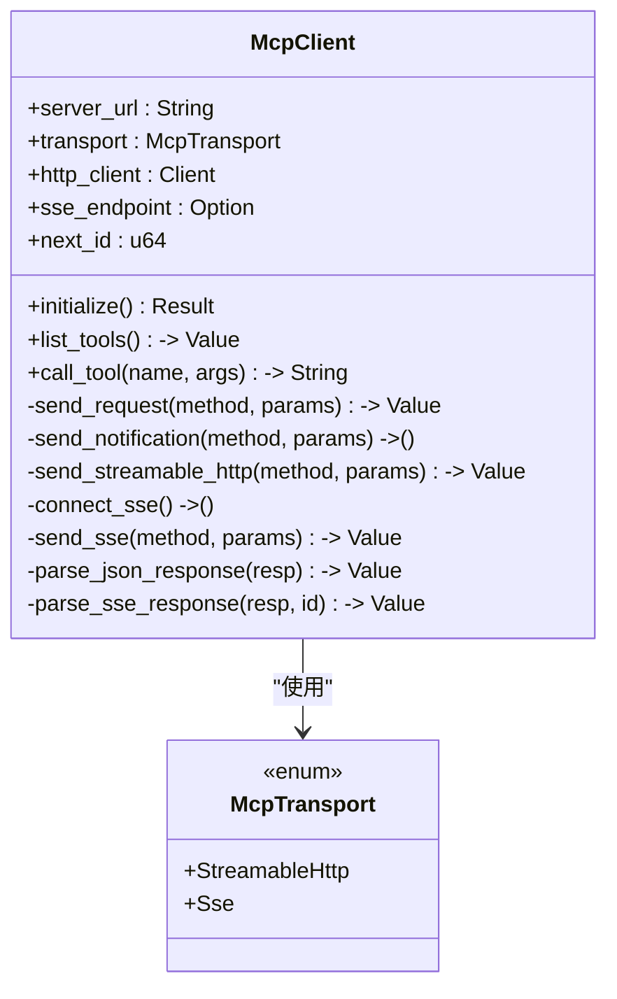
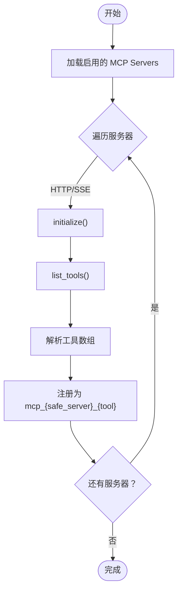
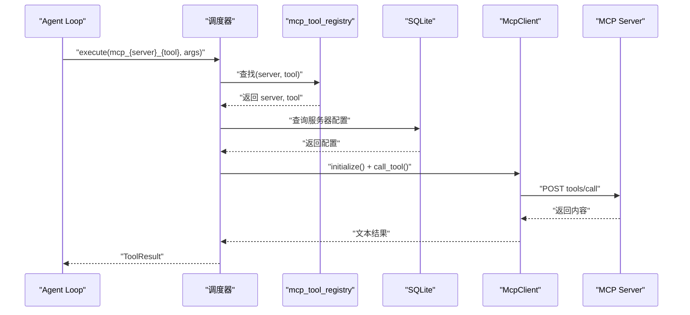
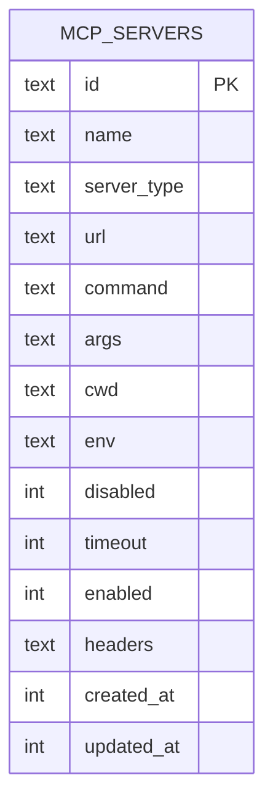
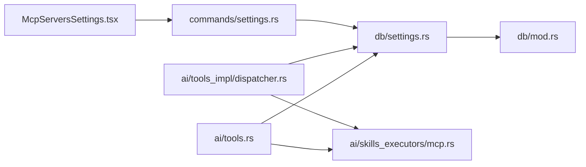

# MCP 协议集成

<cite>
**本文引用的文件**
- [native\src\ai\mcp.rs](file://native\src\ai\mcp.rs)
- [src-tauri\src\ai\mcp.rs](file://src-tauri\src\ai\mcp.rs)
- [src-tauri\src\ai\skills_executors\mcp.rs](file://src-tauri\src\ai\skills_executors\mcp.rs)
- [src-tauri\src\ai\tools.rs](file://src-tauri\src\ai\tools.rs)
- [src-tauri\src\ai\tools_impl\dispatcher.rs](file://src-tauri\src\ai\tools_impl\dispatcher.rs)
- [src-tauri\src\ai\tools_impl\web_search.rs](file://src-tauri\src\ai\tools_impl\web_search.rs)
- [src-tauri\src\ai\tools_impl\run_command.rs](file://src-tauri\src\ai\tools_impl\run_command.rs)
- [src-tauri\src\db\settings.rs](file://src-tauri\src\db\settings.rs)
- [src-tauri\src\db\mod.rs](file://src-tauri\src\db\mod.rs)
- [src-tauri\src\commands\settings.rs](file://src-tauri\src\commands\settings.rs)
- [src-web\src\components\settings\McpServersSettings.tsx](file://src-web\src\components\settings\McpServersSettings.tsx)
- [packages\shared\src\tool.ts](file://packages\shared\src\tool.ts)
</cite>

## 目录
1. [简介](#简介)
2. [项目结构](#项目结构)
3. [核心组件](#核心组件)
4. [架构总览](#架构总览)
5. [详细组件分析](#详细组件分析)
6. [依赖关系分析](#依赖关系分析)
7. [性能考虑](#性能考虑)
8. [故障排除指南](#故障排除指南)
9. [结论](#结论)
10. [附录](#附录)

## 简介
本文件面向 CoSurf 的 MCP（Model Context Protocol）协议集成功能，系统性阐述其 Rust 原生实现、JSON-RPC 2.0 协议使用、三种传输模式（stdio、SSE、Streamable HTTP）的实现与应用场景、工具自动发现与直通注册机制、MCP Server 配置管理与持久化、以及与第三方 MCP Server 的集成最佳实践。文档同时提供 MCP 通信协议细节、配置示例与故障排除指南，帮助开发者快速理解与扩展。

## 项目结构
CoSurf 的 MCP 集成横跨前端、后端与原生模块：
- 前端：提供 MCP Server 配置界面与导入导出能力
- 后端（Tauri）：负责数据库持久化、命令接口、工具注册与调度
- 原生模块（Rust）：提供基础 MCP 客户端能力（当前以 HTTP/SSE 为主）

**图表来源**
- [src-web\src\components\settings\McpServersSettings.tsx](file://src-web\src\components\settings\McpServersSettings.tsx)
- [src-tauri\src\db\settings.rs](file://src-tauri\src\db\settings.rs)
- [src-tauri\src\commands\settings.rs](file://src-tauri\src\commands\settings.rs)
- [src-tauri\src\ai\tools.rs](file://src-tauri\src\ai\tools.rs)
- [src-tauri\src\ai\tools_impl\dispatcher.rs](file://src-tauri\src\ai\tools_impl\dispatcher.rs)
- [native\src\ai\mcp.rs](file://native\src\ai\mcp.rs)

**章节来源**
- [src-web\src\components\settings\McpServersSettings.tsx](file://src-web\src\components\settings\McpServersSettings.tsx)
- [src-tauri\src\db\settings.rs](file://src-tauri\src\db\settings.rs)
- [src-tauri\src\commands\settings.rs](file://src-tauri\src\commands\settings.rs)
- [src-tauri\src\ai\tools.rs](file://src-tauri\src\ai\tools.rs)
- [src-tauri\src\ai\tools_impl\dispatcher.rs](file://src-tauri\src\ai\tools_impl\dispatcher.rs)
- [native\src\ai\mcp.rs](file://native\src\ai\mcp.rs)

## 核心组件
- MCP 客户端（Tauri 实现）：支持 JSON-RPC 2.0，封装 initialize、tools/list、tools/call 等方法；支持 Streamable HTTP 与 SSE 两种传输模式；具备超时与错误处理。
- 工具自动发现与注册：遍历启用的 MCP Server，调用 tools/list，按命名规则 mcp_{server_safe}_{tool} 注册为 Agent 可用 function，并维护全局 registry。
- 配置管理与持久化：SQLite 表 mcp_servers 存储服务器类型、URL、命令、参数、工作目录、环境变量、超时、启用状态与自定义 headers；前端提供导入/导出与测试能力。
- 工具调度：根据函数名前缀识别技能、MCP 与内置工具，分别路由到对应实现模块。
- 原生模块参考：native 模块提供基础数据结构与传输抽象，便于后续 stdio 支持扩展。

**章节来源**
- [src-tauri\src\ai\skills_executors\mcp.rs](file://src-tauri\src\ai\skills_executors\mcp.rs)
- [src-tauri\src\ai\tools.rs](file://src-tauri\src\ai\tools.rs)
- [src-tauri\src\db\settings.rs](file://src-tauri\src\db\settings.rs)
- [src-tauri\src\db\mod.rs](file://src-tauri\src\db\mod.rs)
- [src-tauri\src\ai\tools_impl\dispatcher.rs](file://src-tauri\src\ai\tools_impl\dispatcher.rs)
- [native\src\ai\mcp.rs](file://native\src\ai\mcp.rs)

## 架构总览
MCP 集成采用“配置驱动 + 自动发现 + 直通调用”的架构：
- 配置层：SQLite 持久化，前端可视化管理，支持批量导入标准 JSON。
- 发现层：Agent 启动时遍历启用的 MCP Server，调用 tools/list，动态注册为 function。
- 调用层：Agent Loop 识别 mcp_* 函数名，通过 registry 定位 server 与原始 tool 名，直接调用 MCP Server。
- 传输层：Streamable HTTP（POST JSON-RPC）与 SSE（GET 建立 SSE，再 POST endpoint）两种模式。

**图表来源**
- [src-tauri\src\ai\tools.rs](file://src-tauri\src\ai\tools.rs)
- [src-tauri\src\ai\skills_executors\mcp.rs](file://src-tauri\src\ai\skills_executors\mcp.rs)
- [src-tauri\src\db\settings.rs](file://src-tauri\src\db\settings.rs)

## 详细组件分析

### MCP 客户端（Tauri 实现）
- JSON-RPC 2.0：封装 initialize、tools/list、tools/call，自动处理 headers 与 Authorization。
- 传输模式：
  - Streamable HTTP：直接 POST JSON-RPC 到服务器 URL，支持 application/json 与 text/event-stream。
  - SSE：先 GET 建立 SSE，从事件流中解析 endpoint，再 POST JSON-RPC 到 endpoint。
- 错误处理：统一解析 JSON-RPC error 与 HTTP 错误码，返回 AppError。
- 超时控制：HTTP 客户端默认超时 60 秒，工具调用处有 15 秒超时保护。

**图表来源**
- [src-tauri\src\ai\skills_executors\mcp.rs](file://src-tauri\src\ai\skills_executors\mcp.rs)

**章节来源**
- [src-tauri\src\ai\skills_executors\mcp.rs](file://src-tauri\src\ai\skills_executors\mcp.rs)

### 工具自动发现与直通注册
- 发现流程：遍历启用的 MCP Server，按类型选择传输模式，调用 tools/list。
- 注册规则：mcp_{server_safe}_{tool_name}，其中 server_safe 将连字符与空格替换为下划线；描述前缀加上 [MCP:服务器名]。
- 全局注册表：将函数名映射到 (server_name, original_tool_name)，用于执行阶段定位。

**图表来源**
- [src-tauri\src\ai\tools.rs](file://src-tauri\src\ai\tools.rs)

**章节来源**
- [src-tauri\src\ai\tools.rs](file://src-tauri\src\ai\tools.rs)

### 工具调度与执行
- 调度策略：根据函数名前缀判断类型，skill_*、mcp_*、内置工具三类。
- MCP 执行：从全局 registry 获取 server 与原始 tool 名，重新构建客户端，调用 tools/call。
- 错误处理：未找到工具或服务器时返回失败 ToolResult，便于 Agent Loop 重试或回退。

**图表来源**
- [src-tauri\src\ai\tools_impl\dispatcher.rs](file://src-tauri\src\ai\tools_impl\dispatcher.rs)
- [src-tauri\src\db\settings.rs](file://src-tauri\src\db\settings.rs)
- [src-tauri\src\ai\skills_executors\mcp.rs](file://src-tauri\src\ai\skills_executors\mcp.rs)

**章节来源**
- [src-tauri\src\ai\tools_impl\dispatcher.rs](file://src-tauri\src\ai\tools_impl\dispatcher.rs)
- [src-tauri\src\db\settings.rs](file://src-tauri\src\db\settings.rs)

### MCP Server 配置管理与持久化
- 数据库表：mcp_servers，包含 id、name、server_type、url、command、args、cwd、env、disabled、timeout、enabled、headers 等字段。
- 类型枚举：Http、StreamableHttp、Sse、Stdio，支持多种传输模式。
- 命令接口：前端通过命令测试连接、导入 JSON、更新配置；后端提供 list/create/update/delete。
- 前端界面：支持导入标准 JSON、编辑、测试、启用/禁用、查看可用工具。

**图表来源**
- [src-tauri\src\db\mod.rs](file://src-tauri\src\db\mod.rs)
- [src-tauri\src\db\settings.rs](file://src-tauri\src\db\settings.rs)

**章节来源**
- [src-tauri\src\db\mod.rs](file://src-tauri\src\db\mod.rs)
- [src-tauri\src\db\settings.rs](file://src-tauri\src\db\settings.rs)
- [src-web\src\components\settings\McpServersSettings.tsx](file://src-web\src\components\settings\McpServersSettings.tsx)
- [src-tauri\src\commands\settings.rs](file://src-tauri\src\commands\settings.rs)

### 原生模块参考实现
- 原生模块提供基础数据结构（McpTool、McpResource、McpConfig、McpTransport）与初始化/调用流程，当前 HTTP/SSE 模式已实现，stdio 模式留待扩展。
- 命名规则与 schema 生成逻辑与 Tauri 实现一致，便于统一 Agent 行为。

**章节来源**
- [native\src\ai\mcp.rs](file://native\src\ai\mcp.rs)

### 第三方 MCP Server 集成最佳实践
- 优先使用 Streamable HTTP（POST JSON-RPC）或 SSE（GET 建立 SSE，再 POST endpoint）。
- 在前端配置中设置 Authorization 或自定义 headers，确保认证通过。
- 使用“测试连接”功能验证 initialize 与 tools/list 成功。
- 对于长耗时工具，合理设置 timeout，避免阻塞 Agent Loop。
- 通过 mcp_{server}_{tool} 的命名规则，确保工具在 Agent 中可见且可调用。

**章节来源**
- [src-tauri\src\ai\skills_executors\mcp.rs](file://src-tauri\src\ai\skills_executors\mcp.rs)
- [src-web\src\components\settings\McpServersSettings.tsx](file://src-web\src\components\settings\McpServersSettings.tsx)

## 依赖关系分析
- 工具注册依赖数据库中的服务器配置与传输类型枚举。
- 工具调度依赖全局 registry 与数据库查询。
- MCP 客户端依赖传输类型与 HTTP 客户端，解析 JSON-RPC 响应。
- 前端依赖命令接口与数据库模型，提供导入/导出与测试能力。

**图表来源**
- [src-tauri\src\ai\tools.rs](file://src-tauri\src\ai\tools.rs)
- [src-tauri\src\db\settings.rs](file://src-tauri\src\db\settings.rs)
- [src-tauri\src\ai\skills_executors\mcp.rs](file://src-tauri\src\ai\skills_executors\mcp.rs)
- [src-tauri\src\ai\tools_impl\dispatcher.rs](file://src-tauri\src\ai\tools_impl\dispatcher.rs)
- [src-web\src\components\settings\McpServersSettings.tsx](file://src-web\src\components\settings\McpServersSettings.tsx)
- [src-tauri\src\commands\settings.rs](file://src-tauri\src\commands\settings.rs)
- [src-tauri\src\db\mod.rs](file://src-tauri\src\db\mod.rs)

**章节来源**
- [src-tauri\src\ai\tools.rs](file://src-tauri\src\ai\tools.rs)
- [src-tauri\src\ai\tools_impl\dispatcher.rs](file://src-tauri\src\ai\tools_impl\dispatcher.rs)
- [src-tauri\src\db\settings.rs](file://src-tauri\src\db\settings.rs)
- [src-tauri\src\commands\settings.rs](file://src-tauri\src\commands\settings.rs)
- [src-web\src\components\settings\McpServersSettings.tsx](file://src-web\src\components\settings\McpServersSettings.tsx)

## 性能考虑
- 超时控制：HTTP 客户端默认 60 秒，工具发现超时 15 秒，避免长时间阻塞。
- 并发限制：工具调用并发受服务器能力限制，建议在 Agent 层面做节流。
- 输出截断：工具返回内容可能过大，需在实现侧进行截断与安全检查（如 run_command）。
- 传输优化：SSE 适合长文本流式输出；Streamable HTTP 适合一次性响应。

[本节为通用指导，无需特定文件引用]

## 故障排除指南
- 认证失败（Unauthorized）：检查 Authorization 头或自定义 headers，确认 API Key 格式与环境变量。
- 连接超时：检查网络与服务器状态，适当提高 timeout；确认 URL 正确。
- 工具不存在（Method not found）：核对工具名拼写与服务器支持的工具列表。
- SSE 端点解析失败：确认服务器返回的 endpoint 为绝对或相对 URL，必要时拼接 base_url。
- 工具返回格式异常：检查 MCP Server 的返回结构，确保包含 content 字段与可读文本。

**章节来源**
- [src-tauri\src\ai\skills_executors\mcp.rs](file://src-tauri\src\ai\skills_executors\mcp.rs)
- [src-tauri\src\commands\settings.rs](file://src-tauri\src\commands\settings.rs)

## 结论
CoSurf 的 MCP 集成以 JSON-RPC 2.0 为核心，结合 Streamable HTTP 与 SSE 两种传输模式，实现了从配置管理、工具自动发现到直通调用的完整链路。通过统一的命名规则与全局注册表，MCP 工具无缝融入 Agent Loop，提升系统扩展性与灵活性。未来可在原生模块中完善 stdio 支持，并增强配置导入校验与健康检查能力。

[本节为总结性内容，无需特定文件引用]

## 附录

### MCP 通信协议要点
- 协议版本：2024-11-05
- 方法：
  - initialize：握手与能力声明
  - tools/list：获取可用工具列表
  - tools/call：调用具体工具
- 错误处理：JSON-RPC error 与 HTTP 状态码双通道
- 超时控制：客户端默认 60 秒，工具发现 15 秒

**章节来源**
- [src-tauri\src\ai\skills_executors\mcp.rs](file://src-tauri\src\ai\skills_executors\mcp.rs)

### 工具直通注册命名规则
- 规则：mcp_{server_safe}_{tool_name}
- server_safe：将 server 名称中的连字符与空格替换为下划线
- 描述前缀：[MCP:服务器名]，便于识别来源

**章节来源**
- [src-tauri\src\ai\tools.rs](file://src-tauri\src\ai\tools.rs)

### MCP Server 配置示例（前端导入 JSON）
- 支持字段：name、type（http/streamableHttp/sse/stdio）、url、command、args、cwd、env、headers、disabled、timeout
- 示例：参见前端组件中的示例 JSON

**章节来源**
- [src-web\src\components\settings\McpServersSettings.tsx](file://src-web\src\components\settings\McpServersSettings.tsx)

### 与第三方 MCP Server 集成建议
- 优先使用 Streamable HTTP 或 SSE
- 在前端配置 Authorization 或自定义 headers
- 使用“测试连接”验证 initialize 与 tools/list
- 对长耗时工具设置合理 timeout

**章节来源**
- [src-tauri\src\ai\skills_executors\mcp.rs](file://src-tauri\src\ai\skills_executors\mcp.rs)
- [src-web\src\components\settings\McpServersSettings.tsx](file://src-web\src\components\settings\McpServersSettings.tsx)