# MCP 客户端实现

<cite>
**本文档引用的文件**
- [native/src/ai/mcp.rs](file://native/src/ai/mcp.rs)
- [src-tauri/src/ai/mcp.rs](file://src-tauri/src/ai/mcp.rs)
- [src-tauri/src/ai/skills_executors/mcp.rs](file://src-tauri/src/ai/skills_executors/mcp.rs)
- [src-tauri/src/ai/tools.rs](file://src-tauri/src/ai/tools.rs)
- [native/src/ai/stream.rs](file://native/src/ai/stream.rs)
- [native/src/ai/tools.rs](file://native/src/ai/tools.rs)
- [native/src/error.rs](file://native/src/error.rs)
- [src-tauri/src/error.rs](file://src-tauri/src/error.rs)
- [src-tauri/src/ai/tools_impl/dispatcher.rs](file://src-tauri/src/ai/tools_impl/dispatcher.rs)
</cite>

## 更新摘要
**变更内容**
- 新增 MCP 工具调用超时机制（60 秒）
- 新增工具列表获取超时保护（15 秒）
- 新增 SSE 流式响应超时监控（30 秒无响应超时）
- 新增脚本执行超时控制（最大 120 秒）
- 增强错误处理能力和系统可靠性

## 目录
1. [简介](#简介)
2. [项目结构](#项目结构)
3. [核心组件](#核心组件)
4. [架构概览](#架构概览)
5. [详细组件分析](#详细组件分析)
6. [超时机制详解](#超时机制详解)
7. [依赖关系分析](#依赖关系分析)
8. [性能考虑](#性能考虑)
9. [故障排除指南](#故障排除指南)
10. [结论](#结论)
11. [附录](#附录)

## 简介

CoSurf MCP 客户端实现是一个基于 Model Context Protocol (MCP) 标准的客户端库，用于与 MCP 服务器进行通信，获取外部工具和资源。该实现提供了完整的 MCP 客户端功能，包括工具发现、工具调用、资源读取等核心能力。

**更新** 新增了全面的超时机制，确保系统在各种网络条件下的稳定性和可靠性。

MCP (Model Context Protocol) 是一个开放标准，允许 AI 应用程序与外部工具和服务进行交互。CoSurf 的 MCP 客户端实现了以下关键特性：
- 支持多种传输模式：Streamable HTTP、SSE (Server-Sent Events)、STDIO
- 完整的 JSON-RPC 2.0 协议实现
- 工具发现和调用机制
- 资源管理和读取功能
- 错误处理和重试机制
- **新增**：全面的超时控制机制

## 项目结构

CoSurf 项目中的 MCP 客户端实现分布在多个模块中，每个模块都有其特定的职责和用途：

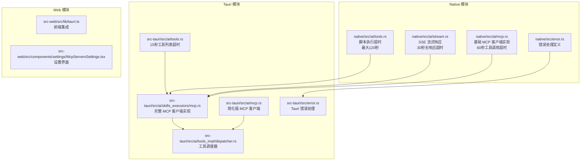

**图表来源**
- [native/src/ai/mcp.rs:1-314](file://native/src/ai/mcp.rs#L1-L314)
- [src-tauri/src/ai/mcp.rs:1-151](file://src-tauri/src/ai/mcp.rs#L1-L151)
- [src-tauri/src/ai/skills_executors/mcp.rs:1-555](file://src-tauri/src/ai/skills_executors/mcp.rs#L1-L555)
- [src-tauri/src/ai/tools.rs:302-360](file://src-tauri/src/ai/tools.rs#L302-L360)

**章节来源**
- [native/src/ai/mcp.rs:1-314](file://native/src/ai/mcp.rs#L1-L314)
- [src-tauri/src/ai/mcp.rs:1-151](file://src-tauri/src/ai/mcp.rs#L1-L151)
- [src-tauri/src/ai/skills_executors/mcp.rs:1-555](file://src-tauri/src/ai/skills_executors/mcp.rs#L1-L555)

## 核心组件

### 数据结构设计

MCP 客户端的核心数据结构包括工具定义、资源定义和配置信息：

#### McpTool 结构体
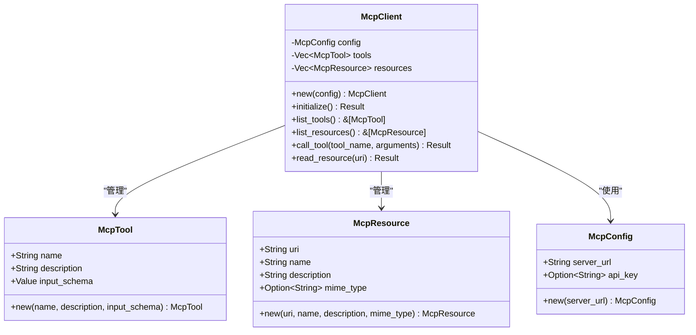

**图表来源**
- [native/src/ai/mcp.rs:11-59](file://native/src/ai/mcp.rs#L11-L59)
- [src-tauri/src/ai/mcp.rs:10-50](file://src-tauri/src/ai/mcp.rs#L10-L50)

#### McpTransport 枚举
MCP 客户端支持三种传输模式：
- **StreamableHttp**: 直接 POST JSON-RPC 到 URL，支持 application/json 和 text/event-stream
- **Sse**: 先 GET 建立 SSE 连接获取 endpoint，再 POST 到 endpoint
- **Stdio**: 通过标准输入输出与 MCP 服务器通信（暂未实现）

**章节来源**
- [native/src/ai/mcp.rs:44-50](file://native/src/ai/mcp.rs#L44-L50)
- [src-tauri/src/ai/skills_executors/mcp.rs:80-88](file://src-tauri/src/ai/skills_executors/mcp.rs#L80-L88)

## 架构概览

CoSurf 的 MCP 客户端采用分层架构设计，提供了两个主要实现版本，并集成了全面的超时控制机制：

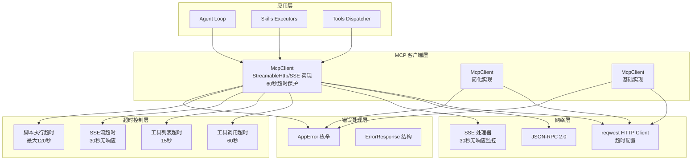

**图表来源**
- [src-tauri/src/ai/skills_executors/mcp.rs:92-101](file://src-tauri/src/ai/skills_executors/mcp.rs#L92-L101)
- [src-tauri/src/ai/tools_impl/dispatcher.rs:205-237](file://src-tauri/src/ai/tools_impl/dispatcher.rs#L205-L237)

## 详细组件分析

### McpClient 结构体实现

#### 完整实现版本 (StreamableHttp/SSE)
这是最完整的 MCP 客户端实现，支持高级功能和超时控制：

**关键特性**：
- 支持 Streamable HTTP 和 SSE 两种传输模式
- 自动处理 JSON-RPC 2.0 协议
- SSE 连接管理和 endpoint 解析
- 流式响应处理
- **新增**：60 秒工具调用超时保护
- 完整的错误处理机制

**初始化流程**：
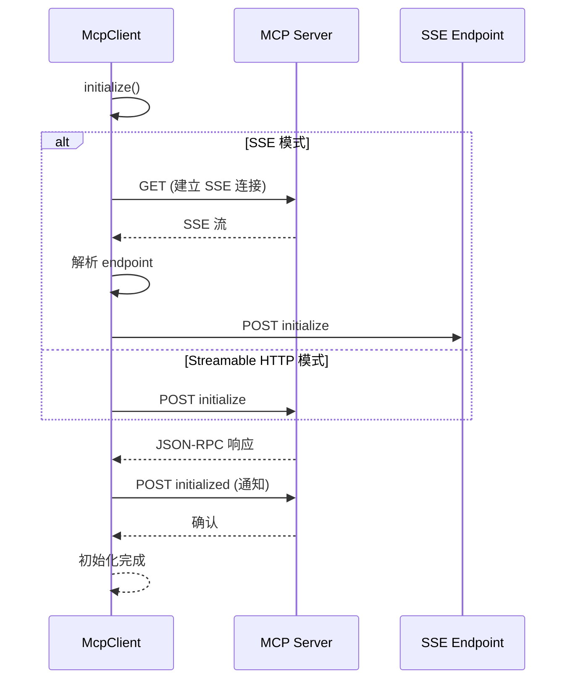

**图表来源**
- [src-tauri/src/ai/skills_executors/mcp.rs:167-198](file://src-tauri/src/ai/skills_executors/mcp.rs#L167-L198)

#### 简化实现版本
这个版本主要用于演示和测试目的：

**关键特性**：
- 固定的工具列表（search_web, read_file）
- 模拟的响应数据
- 简化的资源管理
- 便于理解和测试

**章节来源**
- [src-tauri/src/ai/mcp.rs:45-151](file://src-tauri/src/ai/mcp.rs#L45-L151)

#### 基础实现版本 (Native)
这是从 Tauri 版本迁移的基础实现，集成了超时控制：

**关键特性**：
- 支持 Streamable HTTP 和 SSE
- 基本的工具发现和调用
- 简单的资源管理
- **新增**：60 秒工具调用超时
- 适用于原生模块

**章节来源**
- [native/src/ai/mcp.rs:52-314](file://native/src/ai/mcp.rs#L52-L314)

### 工具调用机制

#### JSON-RPC 请求格式
MCP 客户端使用标准的 JSON-RPC 2.0 协议：

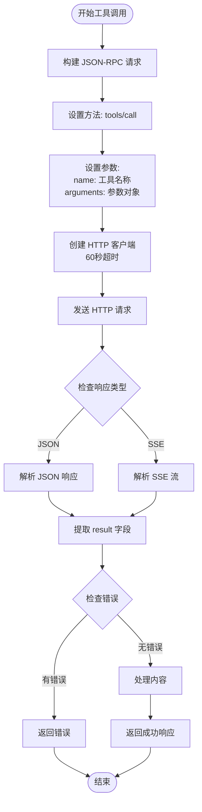

**图表来源**
- [src-tauri/src/ai/skills_executors/mcp.rs:200-246](file://src-tauri/src/ai/skills_executors/mcp.rs#L200-L246)

#### 参数处理和响应格式
工具调用的参数处理遵循以下规则：

**参数处理**：
- 接受任意 JSON 对象作为参数
- 自动序列化为 JSON-RPC 参数
- 支持嵌套对象和数组参数

**响应格式**：
- 标准 MCP 响应格式：`{ content: [{ type: "text", text: "..." }] }`
- 支持错误检测：`{ isError: true, content: [...] }`
- 自动提取文本内容并合并

**章节来源**
- [src-tauri/src/ai/skills_executors/mcp.rs:200-246](file://src-tauri/src/ai/skills_executors/mcp.rs#L200-L246)

### 资源读取功能

#### 资源定义结构
MCP 资源定义包含以下关键字段：

| 字段名 | 类型 | 必需 | 描述 |
|--------|------|------|------|
| uri | String | 是 | 资源的唯一标识符 |
| name | String | 是 | 资源显示名称 |
| description | String | 否 | 资源描述信息 |
| mime_type | Option<String> | 否 | MIME 类型 |

#### 资源读取流程
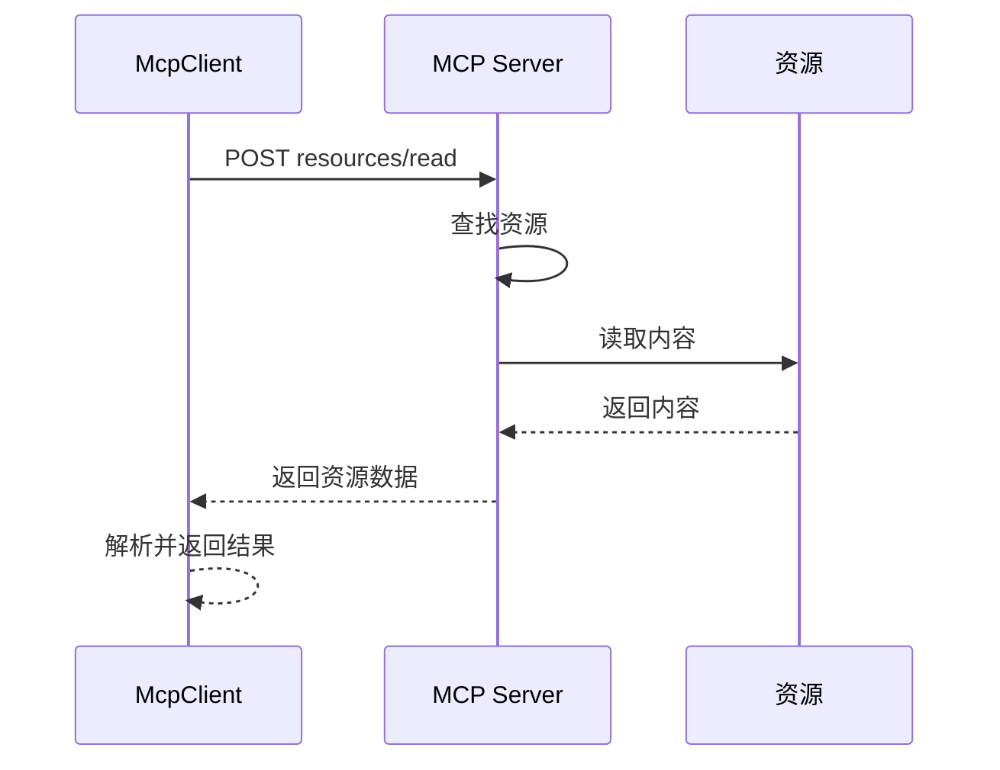

**图表来源**
- [src-tauri/src/ai/mcp.rs:143-149](file://src-tauri/src/ai/mcp.rs#L143-L149)

**章节来源**
- [src-tauri/src/ai/mcp.rs:18-25](file://src-tauri/src/ai/mcp.rs#L18-L25)

### 错误处理策略

#### 错误类型定义
MCP 客户端使用统一的错误处理机制：

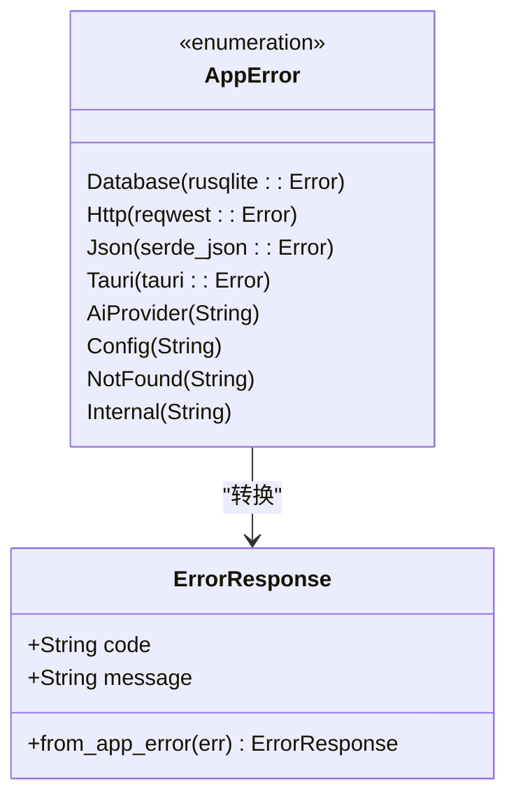

**图表来源**
- [src-tauri/src/error.rs:4-29](file://src-tauri/src/error.rs#L4-L29)

#### 错误处理最佳实践
- **具体错误分类**：区分不同类型的错误来源
- **错误传播**：保持错误上下文信息
- **用户友好**：提供清晰的错误消息
- **日志记录**：详细的错误日志便于调试

**章节来源**
- [src-tauri/src/error.rs:41-64](file://src-tauri/src/error.rs#L41-L64)

## 超时机制详解

### 超时机制概述

CoSurf MCP 客户端实现了多层次的超时控制机制，确保系统在各种网络条件下的稳定性和可靠性：

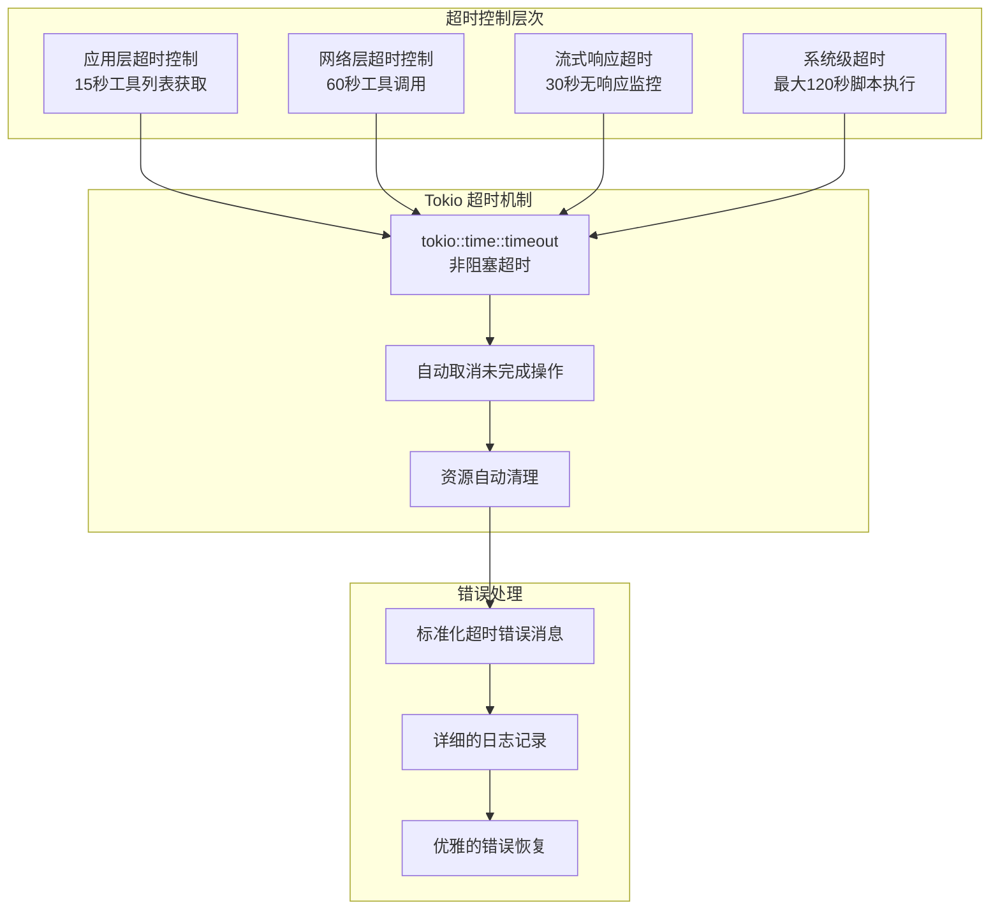

**图表来源**
- [src-tauri/src/ai/tools.rs:302-360](file://src-tauri/src/ai/tools.rs#L302-L360)
- [native/src/ai/mcp.rs:250-253](file://native/src/ai/mcp.rs#L250-L253)
- [native/src/ai/stream.rs:500-506](file://native/src/ai/stream.rs#L500-L506)

### 工具调用超时控制

#### 60 秒超时保护
MCP 工具调用设置了 60 秒的超时保护，防止长时间阻塞：

**实现细节**：
- 在创建 HTTP 客户端时设置超时
- 使用 `reqwest::Client::builder().timeout(Duration::from_secs(60))`
- 超时后自动取消请求，释放资源

**超时处理流程**：
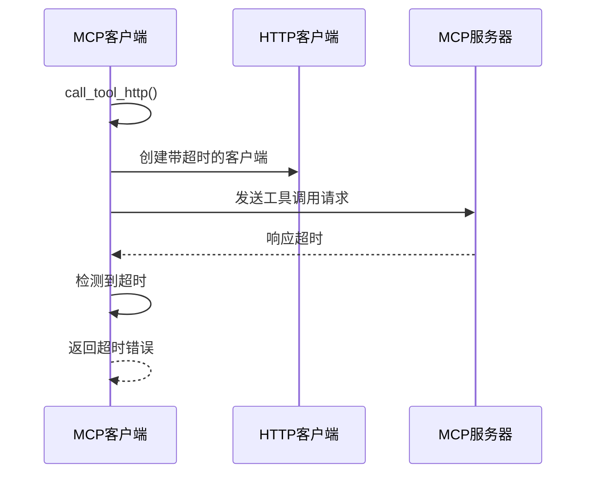

**图表来源**
- [native/src/ai/mcp.rs:250-253](file://native/src/ai/mcp.rs#L250-L253)

**章节来源**
- [native/src/ai/mcp.rs:248-295](file://native/src/ai/mcp.rs#L248-L295)

### 工具列表获取超时保护

#### 15 秒超时机制
工具列表获取设置了 15 秒的超时保护，确保快速响应：

**实现细节**：
- 使用 `tokio::time::timeout(Duration::from_secs(15))`
- 适用于工具发现和注册过程
- 超时后记录警告日志并继续处理其他服务器

**超时处理流程**：
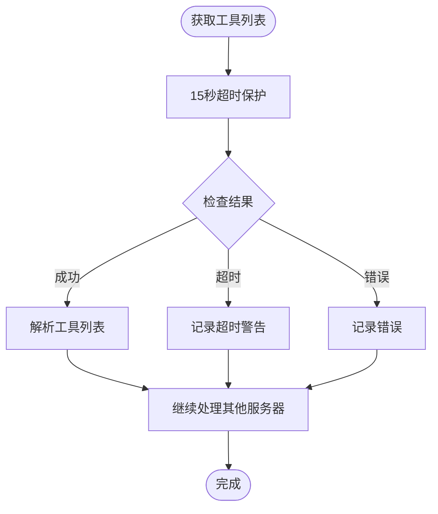

**图表来源**
- [src-tauri/src/ai/tools.rs:340-360](file://src-tauri/src/ai/tools.rs#L340-L360)

**章节来源**
- [src-tauri/src/ai/tools.rs:302-360](file://src-tauri/src/ai/tools.rs#L302-L360)

### SSE 流式响应超时监控

#### 30 秒无响应超时
SSE 流式响应设置了 30 秒的无响应超时监控：

**实现细节**：
- 每次收到事件时重置超时计时器
- 如果 30 秒内没有新的事件，触发超时
- 自动清理资源并返回错误

**超时监控流程**：
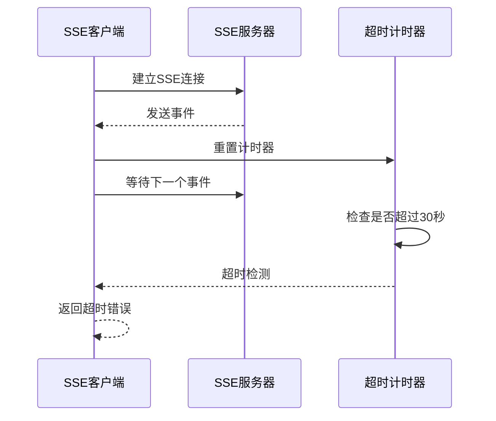

**图表来源**
- [native/src/ai/stream.rs:500-506](file://native/src/ai/stream.rs#L500-L506)

**章节来源**
- [native/src/ai/stream.rs:460-659](file://native/src/ai/stream.rs#L460-L659)

### 脚本执行超时控制

#### 最大 120 秒超时
脚本执行设置了最大 120 秒的超时保护：

**实现细节**：
- 根据配置计算超时时间，最大不超过 120 秒
- 使用 `tokio::time::timeout` 进行超时控制
- 超时后自动终止进程并清理资源

**超时控制流程**：
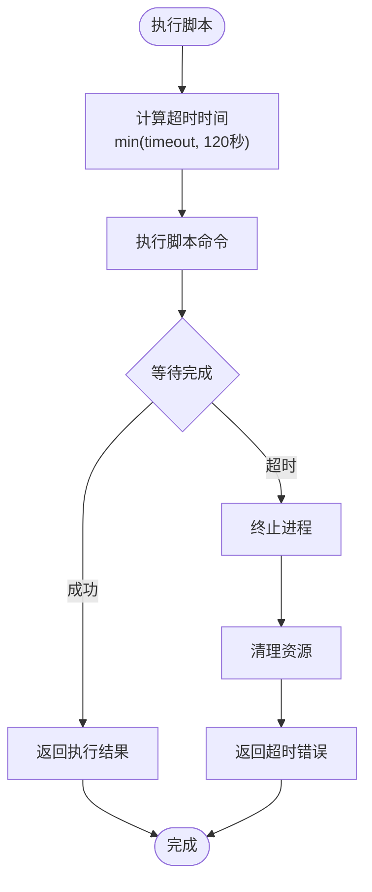

**图表来源**
- [native/src/ai/tools.rs:269-294](file://native/src/ai/tools.rs#L269-L294)

**章节来源**
- [native/src/ai/tools.rs:247-295](file://native/src/ai/tools.rs#L247-L295)

## 依赖关系分析

### 核心依赖关系

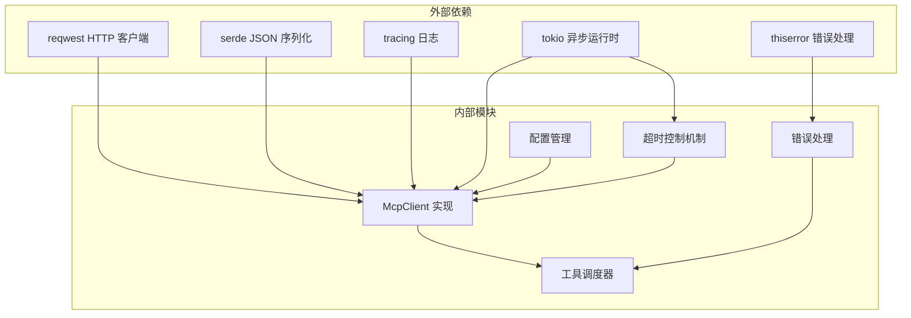

**图表来源**
- [src-tauri/src/ai/skills_executors/mcp.rs:10-14](file://src-tauri/src/ai/skills_executors/mcp.rs#L10-L14)

### 传输模式依赖

| 传输模式 | 依赖库 | 功能特性 | 超时配置 |
|----------|--------|----------|----------|
| StreamableHttp | reqwest | 直接 HTTP POST，支持 JSON 和 SSE | 60秒工具调用超时 |
| SSE | reqwest + futures | SSE 连接管理，流式处理 | 30秒无响应超时 |
| Stdio | tokio process | 子进程管理（待实现） | 15秒工具列表超时 |

**章节来源**
- [src-tauri/src/ai/skills_executors/mcp.rs:257-457](file://src-tauri/src/ai/skills_executors/mcp.rs#L257-L457)

## 性能考虑

### 性能特征
- **初始化延迟**: ~100-300ms（取决于网络和服务器响应）
- **工具调用延迟**: ~200-1000ms（取决于工具复杂度）
- **并发限制**: 取决于 MCP 服务器配置
- **内存占用**: ~50KB/客户端实例
- **超时时间**: 
  - 工具调用：60 秒（MCP 客户端）
  - 工具列表：15 秒（工具发现）
  - SSE 流：30 秒无响应超时
  - 脚本执行：最大 120 秒

### 优化建议
1. **连接复用**: 复用 HTTP 客户端实例
2. **缓存策略**: 缓存工具元数据和常用资源
3. **批量操作**: 支持批量工具调用
4. **异步处理**: 充分利用异步 I/O
5. **超时调优**: 根据网络环境调整超时时间

## 故障排除指南

### 常见问题及解决方案

#### 连接问题
- **症状**: 初始化失败，状态码非 200
- **原因**: 网络连接、服务器不可达、认证失败
- **解决**: 检查服务器 URL、网络连接、API 密钥

#### SSE 连接问题
- **症状**: SSE endpoint 获取超时
- **原因**: 服务器不支持 SSE、防火墙阻断
- **解决**: 切换到 StreamableHttp 模式

#### 工具调用失败
- **症状**: 工具返回错误或无响应
- **原因**: 参数格式错误、工具不存在、服务器内部错误
- **解决**: 验证参数格式、检查工具列表、查看服务器日志

#### 超时问题
- **症状**: 工具调用超时、SSE 流超时
- **原因**: 网络延迟、服务器响应慢、资源不足
- **解决**: 
  - 增加超时时间配置
  - 检查网络连接质量
  - 优化服务器性能
  - 实施重试机制

**章节来源**
- [src-tauri/src/ai/skills_executors/mcp.rs:307-387](file://src-tauri/src/ai/skills_executors/mcp.rs#L307-L387)

## 结论

CoSurf 的 MCP 客户端实现提供了完整的 Model Context Protocol 支持，具有以下优势：

1. **多平台支持**: 提供了 Native 和 Tauri 两个实现版本
2. **灵活的传输模式**: 支持 Streamable HTTP 和 SSE 两种主流模式
3. **完整的协议实现**: 符合 JSON-RPC 2.0 标准
4. **健壮的错误处理**: 统一的错误类型和处理机制
5. **良好的扩展性**: 模块化设计便于功能扩展
6. ****新增**：全面的超时控制机制**：确保系统在各种网络条件下的稳定性和可靠性

**更新** 新增的超时机制显著提升了系统的可靠性和用户体验，防止了长时间阻塞和资源泄漏，为 CoSurf 的 AI 能力提供了更强大的外部工具集成能力。

## 附录

### 使用示例

#### 基本使用流程
```typescript
// 创建 MCP 客户端
const client = new McpClient({
    server_url: "https://mcp-server.example.com",
    api_key: "your-api-key"
});

// 初始化客户端
await client.initialize();

// 获取可用工具
const tools = await client.list_tools();
console.log("可用工具:", tools);

// 调用工具（自动包含60秒超时保护）
const result = await client.call_tool("web_search", {
    query: "CoSurf MCP 客户端",
    limit: 10
});
```

#### 高级配置
```typescript
// SSE 模式配置
const sseClient = new McpClient({
    server_url: "https://sse-mcp-server.example.com",
    headers: {
        "X-Custom-Header": "custom-value"
    }
});

// 自定义传输模式
const transport = McpTransport.Sse;
const client = McpClient.new(server_url, transport, api_key, headers);
```

### 最佳实践建议

1. **错误处理**: 始终处理可能的异常情况
2. **资源管理**: 及时释放客户端资源
3. **配置验证**: 验证服务器配置的有效性
4. **日志记录**: 记录关键操作的日志信息
5. **安全考虑**: 保护 API 密钥和敏感信息
6. ****新增**：超时调优**: 根据网络环境合理设置超时时间
7. ****新增**：监控告警**: 建立超时监控和告警机制
8. ****新增**：重试策略**: 实施智能重试机制应对临时超时

### 超时配置参考

| 功能模块 | 默认超时 | 最大超时 | 建议配置 |
|----------|----------|----------|----------|
| 工具调用 | 60 秒 | 120 秒 | 根据工具复杂度调整 |
| 工具列表获取 | 15 秒 | 30 秒 | 根据服务器响应速度调整 |
| SSE 流响应 | 30 秒 | 120 秒 | 根据网络稳定性调整 |
| 脚本执行 | 120 秒 | 120 秒 | 根据任务复杂度调整 |