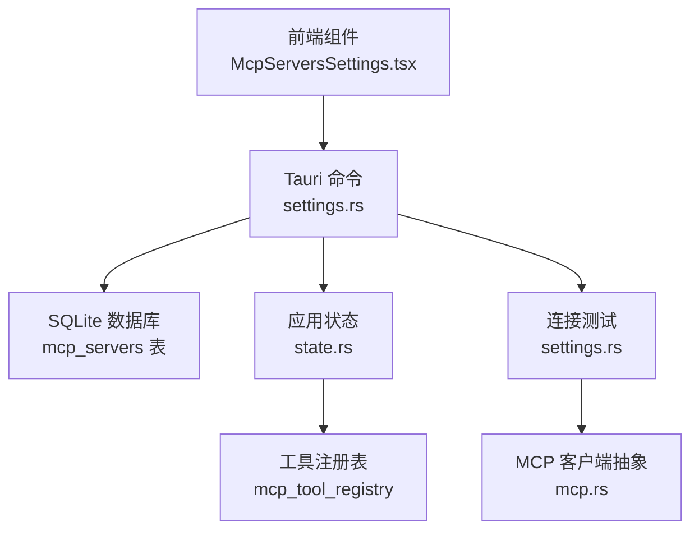
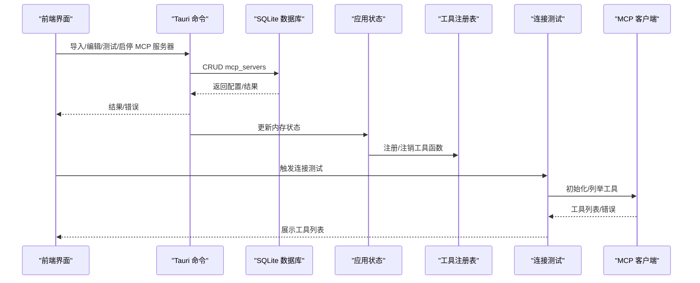
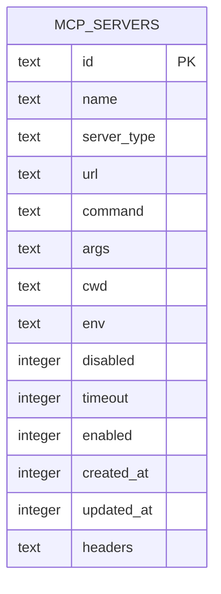
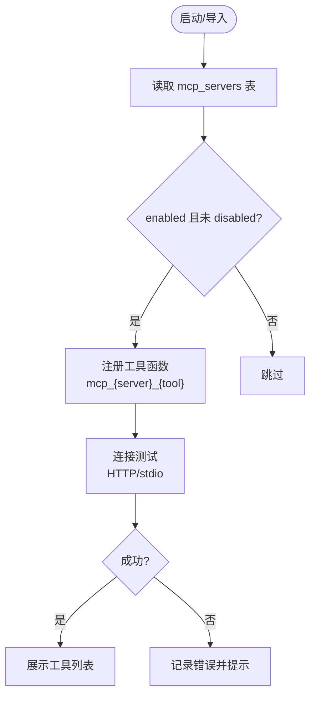
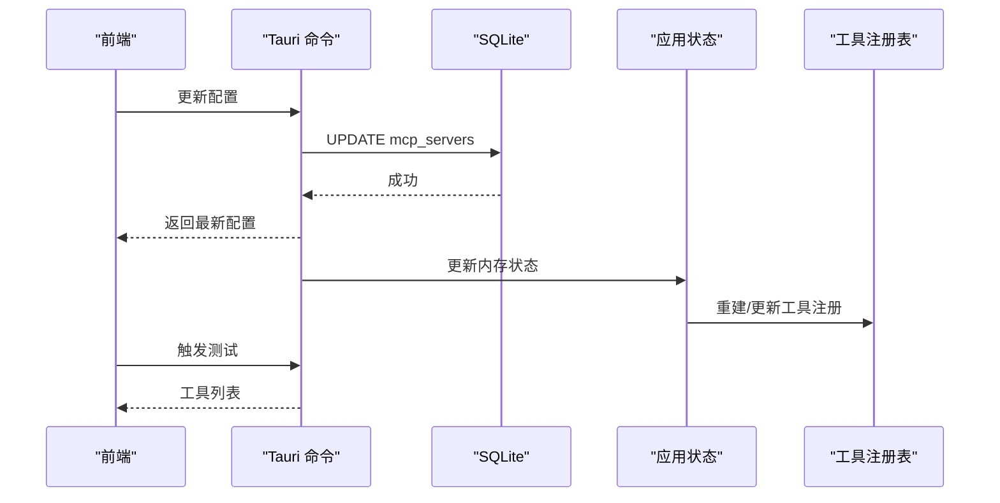
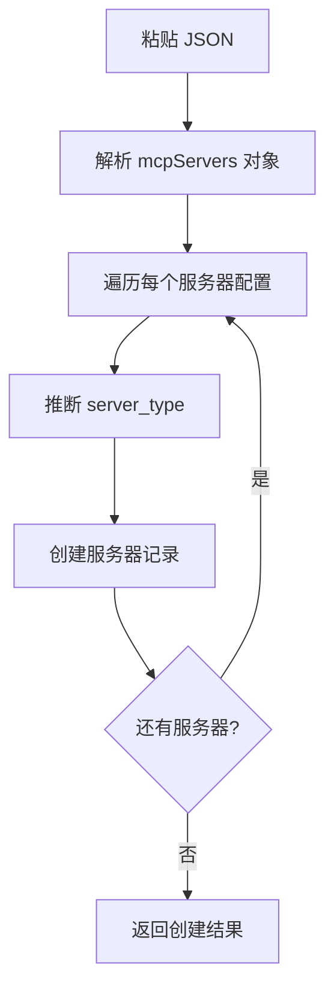
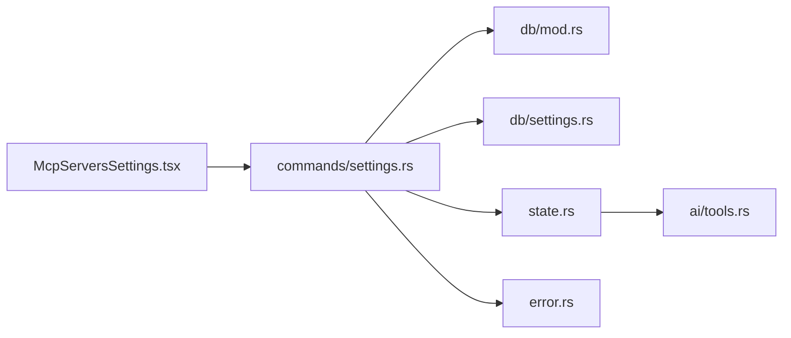

# MCP 服务器管理

<cite>
**本文引用的文件**
- [settings.rs](file://src-tauri/src/db/settings.rs)
- [settings.rs](file://src-tauri/src/db/mod.rs)
- [settings.rs](file://src-tauri/src/commands/settings.rs)
- [McpServersSettings.tsx](file://src-web/src/components/settings/McpServersSettings.tsx)
- [mcp.rs](file://src-tauri/src/ai/mcp.rs)
- [state.rs](file://src-tauri/src/state.rs)
- [tools.rs](file://src-tauri/src/ai/tools.rs)
- [error.rs](file://src-tauri/src/error.rs)
- [MCP_STANDARD_CONFIG.md](file://docs/MCP_STANDARD_CONFIG.md)
- [MCP_SKILL_IMPLEMENTATION.md](file://docs/MCP_SKILL_IMPLEMENTATION.md)
</cite>

## 目录
1. [简介](#简介)
2. [项目结构](#项目结构)
3. [核心组件](#核心组件)
4. [架构总览](#架构总览)
5. [详细组件分析](#详细组件分析)
6. [依赖关系分析](#依赖关系分析)
7. [性能考量](#性能考量)
8. [故障排查指南](#故障排查指南)
9. [结论](#结论)
10. [附录](#附录)

## 简介
本文件面向 CoSurf 的 MCP（Model Context Protocol）服务器管理功能，系统性阐述配置持久化到 SQLite 的机制、配置存储结构、加载与验证流程、动态更新与运行时重连、备份与恢复、最佳实践与安全建议、常见问题诊断以及配置变更对已注册工具的影响与处理方式。文档同时兼顾非技术读者的理解需求，提供可视化图表与循序渐进的讲解。

## 项目结构
CoSurf 的 MCP 服务器管理横跨前端 Web 层、后端 Tauri 层与原生数据库层，形成“前端配置界面 + Tauri 命令 + SQLite 数据库”的三层架构。关键文件分布如下：
- 前端：MCP 服务器设置界面组件负责导入、编辑、测试、启停与工具列表展示
- 后端：Tauri 命令封装数据库操作与连接测试逻辑
- 数据库：SQLite 表 mcp_servers 存储 MCP 服务器配置；迁移脚本保证字段演进与兼容

图表来源
- [McpServersSettings.tsx:104-127](file://src-web/src/components/settings/McpServersSettings.tsx#L104-L127)
- [settings.rs:200-260](file://src-tauri/src/commands/settings.rs#L200-L260)
- [settings.rs:378-539](file://src-tauri/src/db/settings.rs#L378-L539)
- [state.rs:20-22](file://src-tauri/src/state.rs#L20-L22)
- [mcp.rs:46-50](file://src-tauri/src/ai/mcp.rs#L46-L50)

章节来源
- [McpServersSettings.tsx:104-127](file://src-web/src/components/settings/McpServersSettings.tsx#L104-L127)
- [settings.rs:200-260](file://src-tauri/src/commands/settings.rs#L200-L260)
- [settings.rs:378-539](file://src-tauri/src/db/settings.rs#L378-L539)
- [state.rs:20-22](file://src-tauri/src/state.rs#L20-L22)
- [mcp.rs:46-50](file://src-tauri/src/ai/mcp.rs#L46-L50)

## 核心组件
- MCP 服务器配置模型与数据库操作：定义配置结构、序列化/反序列化、CRUD 与迁移
- Tauri 命令：提供列表、查询、创建、更新、删除、连接测试、JSON 批量导入等命令
- 前端设置界面：导入 JSON、编辑配置、测试连接、启停服务器、展示工具列表
- 应用状态与工具注册表：维护已注册工具函数名到服务器与工具名的映射
- 错误处理：统一错误码与消息转换，便于前端展示

章节来源
- [settings.rs:71-114](file://src-tauri/src/db/settings.rs#L71-L114)
- [settings.rs:378-539](file://src-tauri/src/db/settings.rs#L378-L539)
- [settings.rs:200-260](file://src-tauri/src/commands/settings.rs#L200-L260)
- [McpServersSettings.tsx:104-127](file://src-web/src/components/settings/McpServersSettings.tsx#L104-L127)
- [state.rs:20-22](file://src-tauri/src/state.rs#L20-L22)
- [error.rs:41-61](file://src-tauri/src/error.rs#L41-L61)

## 架构总览
MCP 服务器管理采用“配置即数据”的设计：前端通过 Tauri 命令与数据库交互，数据库以 mcp_servers 表持久化配置；应用启动时加载启用的服务器并注册工具；运行时可通过 UI 动态启停与更新配置，测试连接验证有效性。

图表来源
- [settings.rs:264-306](file://src-tauri/src/commands/settings.rs#L264-L306)
- [settings.rs:378-539](file://src-tauri/src/db/settings.rs#L378-L539)
- [state.rs:20-22](file://src-tauri/src/state.rs#L20-L22)
- [mcp.rs:46-50](file://src-tauri/src/ai/mcp.rs#L46-L50)

## 详细组件分析

### 数据模型与存储结构
- 配置模型 McpServerConfig：包含服务器类型、URL/Headers、命令/参数/CWD、环境变量、禁用/超时、启用状态与时间戳
- 数据库表 mcp_servers：包含 id、name、server_type、url、command、args、cwd、env、disabled、timeout、enabled、created_at、updated_at、headers
- 迁移与兼容：自动确保新增列存在，兼容旧版本字段映射（如 server_url → url）

图表来源
- [settings.rs:114-129](file://src-tauri/src/db/mod.rs#L114-L129)

章节来源
- [settings.rs:71-114](file://src-tauri/src/db/settings.rs#L71-L114)
- [settings.rs:114-129](file://src-tauri/src/db/mod.rs#L114-L129)
- [MCP_STANDARD_CONFIG.md:119-137](file://docs/MCP_STANDARD_CONFIG.md#L119-L137)

### 配置加载与验证
- 启动时加载：应用状态初始化时读取 mcp_servers 表，筛选 enabled 服务器并注册工具
- 运行时加载：前端加载后自动触发测试连接，解析后端返回的工具列表
- 连接测试：HTTP 模式基于 URL 与 headers；stdio 模式通过子进程启动并握手
- 验证策略：前端 JSON 导入前进行语法校验；后端导入时解析对象并填充缺失字段

图表来源
- [state.rs:69-79](file://src-tauri/src/state.rs#L69-L79)
- [settings.rs:264-306](file://src-tauri/src/commands/settings.rs#L264-L306)
- [McpServersSettings.tsx:129-184](file://src-web/src/components/settings/McpServersSettings.tsx#L129-L184)

章节来源
- [state.rs:69-79](file://src-tauri/src/state.rs#L69-L79)
- [settings.rs:264-306](file://src-tauri/src/commands/settings.rs#L264-L306)
- [McpServersSettings.tsx:129-184](file://src-web/src/components/settings/McpServersSettings.tsx#L129-L184)

### 动态更新与运行时重连
- 更新流程：前端编辑 JSON → 后端解析并更新 mcp_servers → 返回最新配置
- 启停切换：更新 enabled/disabled 字段，前端即时反映状态
- 重连处理：工具注册表维护函数名到服务器的映射；更新配置后可重新加载工具列表
- 连接测试：每次更新后可触发测试，确保新配置有效

图表来源
- [settings.rs:235-247](file://src-tauri/src/commands/settings.rs#L235-L247)
- [settings.rs:482-526](file://src-tauri/src/db/settings.rs#L482-L526)
- [state.rs:20-22](file://src-tauri/src/state.rs#L20-L22)

章节来源
- [settings.rs:235-247](file://src-tauri/src/commands/settings.rs#L235-L247)
- [settings.rs:482-526](file://src-tauri/src/db/settings.rs#L482-L526)
- [state.rs:20-22](file://src-tauri/src/state.rs#L20-L22)

### 配置备份与恢复
- 备份：SQLite 数据库文件即为配置备份；可复制数据库文件进行整体备份
- 恢复：将备份的数据库文件替换当前数据库文件后重启应用即可恢复
- 注意：确保应用已停止后再替换数据库文件，避免并发写入导致损坏

章节来源
- [settings.rs:16-30](file://src-tauri/src/db/mod.rs#L16-L30)

### 配置导入与批量管理
- JSON 格式：遵循开源标准 MCP JSON，支持多服务器批量导入
- 字段映射：支持 type/url/headers/command/args/cwd/env/disabled/timeout 等字段
- 智能推断：若缺少 type，根据是否存在 url/command 推断为 http/streamableHttp 或 stdio
- 导入流程：前端粘贴 JSON → 后端解析 → 逐条创建服务器 → 返回创建成功的服务器列表

图表来源
- [settings.rs:488-614](file://src-tauri/src/commands/settings.rs#L488-L614)
- [MCP_STANDARD_CONFIG.md:1-57](file://docs/MCP_STANDARD_CONFIG.md#L1-L57)

章节来源
- [settings.rs:488-614](file://src-tauri/src/commands/settings.rs#L488-L614)
- [MCP_STANDARD_CONFIG.md:1-57](file://docs/MCP_STANDARD_CONFIG.md#L1-L57)

### 配置变更对已注册工具的影响
- 工具命名规则：mcp_{server_safe_name}_{tool_name}
- 注册表维护：mcp_tool_registry 将函数名映射到 (server_name, original_tool_name)
- 变更影响：更新服务器名称/工具名会改变注册表项；需重新加载工具列表以同步
- 启停影响：禁用服务器会移除其工具注册；启用后重新注册

章节来源
- [tools.rs:416-454](file://src-tauri/src/ai/tools.rs#L416-L454)
- [state.rs:20-22](file://src-tauri/src/state.rs#L20-L22)

## 依赖关系分析
- 前端依赖：通过 Tauri IPC 调用后端命令，命令依赖数据库模块与状态模块
- 数据库依赖：mcp_servers 表依赖迁移脚本确保字段存在；命令依赖数据库 CRUD
- 工具注册：工具注册表依赖状态模块；工具执行依赖注册表与 MCP 客户端

图表来源
- [McpServersSettings.tsx:1-20](file://src-web/src/components/settings/McpServersSettings.tsx#L1-L20)
- [settings.rs:1-10](file://src-tauri/src/commands/settings.rs#L1-L10)
- [settings.rs:1-20](file://src-tauri/src/db/mod.rs#L1-L20)
- [settings.rs:1-10](file://src-tauri/src/db/settings.rs#L1-L10)
- [state.rs:1-10](file://src-tauri/src/state.rs#L1-L10)
- [tools.rs:1-20](file://src-tauri/src/ai/tools.rs#L1-L20)
- [error.rs:1-10](file://src-tauri/src/error.rs#L1-L10)

章节来源
- [McpServersSettings.tsx:1-20](file://src-web/src/components/settings/McpServersSettings.tsx#L1-L20)
- [settings.rs:1-10](file://src-tauri/src/commands/settings.rs#L1-L10)
- [settings.rs:1-20](file://src-tauri/src/db/mod.rs#L1-L20)
- [settings.rs:1-10](file://src-tauri/src/db/settings.rs#L1-L10)
- [state.rs:1-10](file://src-tauri/src/state.rs#L1-L10)
- [tools.rs:1-20](file://src-tauri/src/ai/tools.rs#L1-L20)
- [error.rs:1-10](file://src-tauri/src/error.rs#L1-L10)

## 性能考量
- 数据库访问：使用 WAL 模式与索引提升查询性能；批量导入时减少往返次数
- 工具加载：仅加载 enabled 服务器；异步加载工具列表，避免阻塞 UI
- 连接测试：设置合理超时（默认 15 秒），避免长时间阻塞
- 注册表：工具注册表为内存结构，更新时重建，避免频繁写入数据库

[本节为通用指导，无需特定文件引用]

## 故障排查指南
- 服务器无法启动/无工具列表
  - 检查服务器类型与必填字段：stdio 需要 command/args；HTTP 需要 url
  - 确认工作目录存在、环境变量正确
  - 使用连接测试功能验证
- API Key/认证问题
  - 将密钥放入 env 中并通过 ${} 语法引用
  - 检查 headers 中的认证头是否正确
- 超时与网络问题
  - 增大 timeout 配置
  - 检查网络连通性与代理设置
- 工具执行失败
  - 查看工具返回的 isError 字段与 content 文本
  - 确认工具名拼写与服务器支持情况

章节来源
- [MCP_STANDARD_CONFIG.md:443-491](file://docs/MCP_STANDARD_CONFIG.md#L443-L491)
- [settings.rs:264-306](file://src-tauri/src/commands/settings.rs#L264-L306)
- [mcp.rs:207-233](file://src-tauri/src/ai/mcp.rs#L207-L233)

## 结论
CoSurf 的 MCP 服务器管理以 SQLite 为核心持久化介质，结合 Tauri 命令与前端界面，实现了从配置导入、动态启停、连接测试到工具注册的完整闭环。通过标准化的 JSON 配置与严格的字段映射，既保证了与开源生态的兼容性，又提供了超时、工作目录、禁用标志等增强特性。建议在生产环境中配合数据库备份与最小权限原则，确保配置安全与系统稳定。

[本节为总结性内容，无需特定文件引用]

## 附录

### 最佳实践与安全建议
- 使用环境变量存储敏感信息，避免硬编码
- 为不同服务器设置合理的超时时间
- 定期备份数据库文件
- 仅启用必要的服务器，降低攻击面
- 使用最小权限原则配置工作目录与环境变量

章节来源
- [MCP_STANDARD_CONFIG.md:408-424](file://docs/MCP_STANDARD_CONFIG.md#L408-L424)
- [MCP_STANDARD_CONFIG.md:306-318](file://docs/MCP_STANDARD_CONFIG.md#L306-L318)

### 常见配置问题与解决方案
- 缺少必填字段：stdio 模式缺少 command/args；HTTP 模式缺少 url
- 路径格式错误：Windows 使用双反斜杠或正斜杠
- 环境变量格式错误：env 必须为对象格式
- 超时错误：适当增大 timeout

章节来源
- [MCP_STANDARD_CONFIG.md:366-491](file://docs/MCP_STANDARD_CONFIG.md#L366-L491)