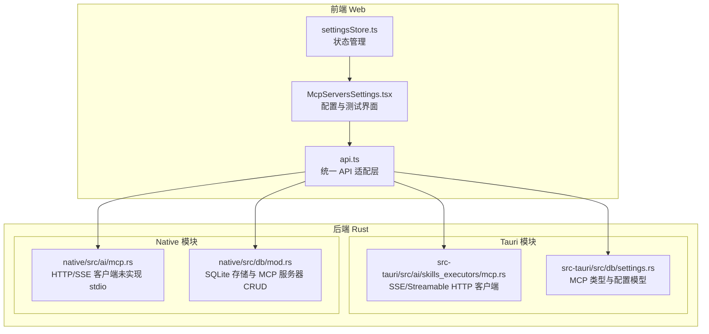
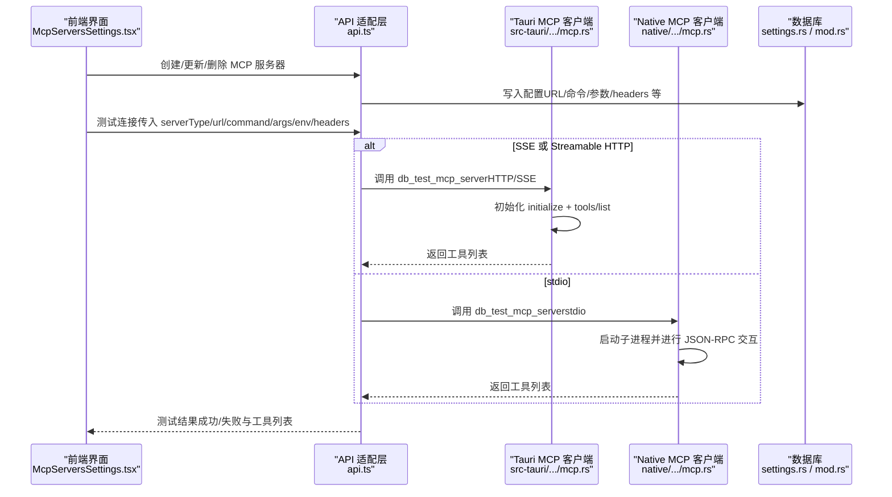
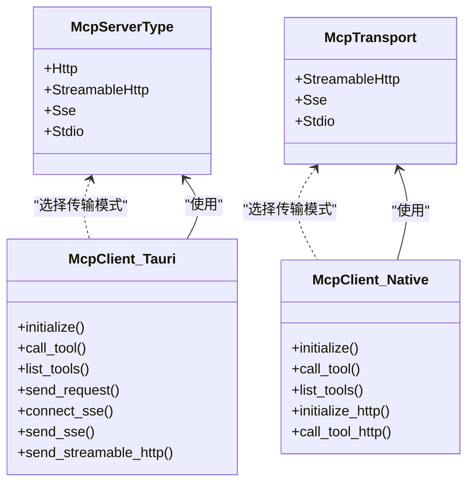

# 传输模式支持

<cite>
**本文引用的文件**
- [mcp.rs](file://src-tauri/src/ai/skills_executors/mcp.rs)
- [mcp.rs](file://native/src/ai/mcp.rs)
- [settings.rs](file://src-tauri/src/db/settings.rs)
- [mod.rs](file://native/src/db/mod.rs)
- [api.ts](file://src-web/src/lib/api.ts)
- [McpServersSettings.tsx](file://src-web/src/components/settings/McpServersSettings.tsx)
- [settingsStore.ts](file://src-web/src/stores/settingsStore.ts)
- [CONFIG_PERSISTENCE_FIXES.md](file://docs/CONFIG_PERSISTENCE_FIXES.md)
- [MCP_STANDARD_CONFIG.md](file://docs/MCP_STANDARD_CONFIG.md)
</cite>

## 目录
1. [简介](#简介)
2. [项目结构](#项目结构)
3. [核心组件](#核心组件)
4. [架构总览](#架构总览)
5. [详细组件分析](#详细组件分析)
6. [依赖关系分析](#依赖关系分析)
7. [性能考量](#性能考量)
8. [故障排除指南](#故障排除指南)
9. [结论](#结论)
10. [附录](#附录)

## 简介
本文件系统性阐述 CoSurf 的 MCP（Model Context Protocol）传输模式支持，覆盖三种传输模式：stdio（子进程模式）、SSE（Server-Sent Events）、Streamable HTTP（HTTP 流式传输）。文档重点说明：
- 各传输模式的技术实现与差异
- JSON-RPC 2.0 协议在不同传输模式下的适配
- 传输模式的选择机制与配置方法
- 配置示例与使用指南
- 性能对比与故障排除
- 传输模式切换对工具调用的影响与注意事项

## 项目结构
CoSurf 的传输模式实现横跨后端 Rust（Tauri/Native）与前端 Web 层：
- 后端（Rust）：在 Tauri 模块中实现 MCP 客户端，支持 SSE 与 Streamable HTTP；在 Native 模块中实现 MCP 客户端，当前仅实现 HTTP/SSE 初始化与工具调用，未实现 stdio 子进程启动。
- 前端（Web）：提供 MCP 服务器配置界面，支持导入标准 JSON 配置、测试连接、启用/禁用等。

图表来源
- [mcp.rs:1-555](file://src-tauri/src/ai/skills_executors/mcp.rs#L1-L555)
- [mcp.rs:1-267](file://native/src/ai/mcp.rs#L1-L267)
- [settings.rs:27-118](file://src-tauri/src/db/settings.rs#L27-L118)
- [mod.rs:133-148](file://native/src/db/mod.rs#L133-L148)
- [api.ts:178-214](file://src-web/src/lib/api.ts#L178-L214)
- [McpServersSettings.tsx:80-596](file://src-web/src/components/settings/McpServersSettings.tsx#L80-L596)

章节来源
- [mcp.rs:1-555](file://src-tauri/src/ai/skills_executors/mcp.rs#L1-L555)
- [mcp.rs:1-267](file://native/src/ai/mcp.rs#L1-L267)
- [settings.rs:27-118](file://src-tauri/src/db/settings.rs#L27-L118)
- [mod.rs:133-148](file://native/src/db/mod.rs#L133-L148)
- [api.ts:178-214](file://src-web/src/lib/api.ts#L178-L214)
- [McpServersSettings.tsx:80-596](file://src-web/src/components/settings/McpServersSettings.tsx#L80-L596)

## 核心组件
- 传输模式枚举与配置模型
  - Tauri 模块中定义了传输模式枚举，包含 StreamableHttp 与 Sse；同时提供 McpServerType 枚举，涵盖 http、streamableHttp、sse、stdio 四类。
  - Native 模块中定义了 McpTransport 枚举，包含 StreamableHttp、Sse、Stdio。
- MCP 客户端
  - Tauri 实现：支持 SSE 与 Streamable HTTP，具备初始化、工具列表查询、工具调用、通知发送等功能，并内置 JSON-RPC 解析与 SSE 事件流解析。
  - Native 实现：支持 HTTP/SSE 初始化与工具调用，当前未实现 stdio 子进程启动。
- 配置持久化与导入
  - Tauri/Native 均提供 MCP 服务器的 CRUD 接口，支持 URL、命令、参数、工作目录、环境变量、超时、禁用标志、自定义 headers 等字段。
  - 前端提供 JSON 导入功能，兼容标准 MCP 配置格式。

章节来源
- [settings.rs:27-118](file://src-tauri/src/db/settings.rs#L27-L118)
- [mcp.rs:80-101](file://src-tauri/src/ai/skills_executors/mcp.rs#L80-L101)
- [mcp.rs:44-50](file://native/src/ai/mcp.rs#L44-L50)
- [mod.rs:133-148](file://native/src/db/mod.rs#L133-L148)

## 架构总览
下图展示传输模式在不同模块中的交互关系与职责划分。

图表来源
- [api.ts:178-214](file://src-web/src/lib/api.ts#L178-L214)
- [mcp.rs:168-198](file://src-tauri/src/ai/skills_executors/mcp.rs#L168-L198)
- [mcp.rs:76-92](file://native/src/ai/mcp.rs#L76-L92)
- [mod.rs:1356-1413](file://native/src/db/mod.rs#L1356-L1413)

章节来源
- [api.ts:178-214](file://src-web/src/lib/api.ts#L178-L214)
- [mcp.rs:168-198](file://src-tauri/src/ai/skills_executors/mcp.rs#L168-L198)
- [mcp.rs:76-92](file://native/src/ai/mcp.rs#L76-L92)
- [mod.rs:1356-1413](file://native/src/db/mod.rs#L1356-L1413)

## 详细组件分析

### 传输模式与实现差异

- stdio（子进程模式）
  - 特点：通过命令行启动外部 MCP 服务器进程，使用标准输入输出进行 JSON-RPC 通信。
  - 实现现状：Tauri 模块未实现 stdio；Native 模块实现了 stdio 测试逻辑，包括子进程启动、stdin/stdout/stderr 读写、JSON-RPC 交互与超时处理。
  - 适用场景：本地开发或已有 MCP 服务器以子进程方式运行的场景。
  - 优缺点：优点是部署简单、无需额外网络服务；缺点是平台差异较大、调试困难、资源占用与生命周期管理复杂。

- SSE（Server-Sent Events）
  - 特点：先发起 GET 建立 SSE 连接，从事件流中解析 endpoint，随后向该 endpoint 发送 JSON-RPC POST 请求。
  - 实现现状：Tauri 模块完整实现，包含连接建立、endpoint 解析、请求发送、SSE 事件流解析与 JSON-RPC 结果提取。
  - 适用场景：需要通过 HTTP 通道复用长连接、便于中间件拦截与日志记录的场景。
  - 优缺点：优点是长连接复用、事件驱动；缺点是需要服务器支持 SSE，且 endpoint 解析可能受 CORS 与代理影响。

- Streamable HTTP（HTTP 流式传输）
  - 特点：直接向服务器 URL POST JSON-RPC 请求，响应可为 application/json 或 text/event-stream。
  - 实现现状：Tauri/Native 模块均实现，支持根据 Content-Type 自动判断解析策略（标准 JSON 或 SSE 流）。
  - 适用场景：最通用的 MCP 传输方式，适合大多数 HTTP 服务器。
  - 优缺点：优点是实现简单、兼容性强；缺点是无法复用连接，SSE 流模式下需要正确解析事件流。

章节来源
- [mcp.rs:80-101](file://src-tauri/src/ai/skills_executors/mcp.rs#L80-L101)
- [mcp.rs:44-50](file://native/src/ai/mcp.rs#L44-L50)
- [mcp.rs:306-334](file://src-tauri/src/ai/skills_executors/mcp.rs#L306-L334)
- [mcp.rs:257-302](file://src-tauri/src/ai/skills_executors/mcp.rs#L257-L302)
- [mcp.rs:94-182](file://native/src/ai/mcp.rs#L94-L182)

### JSON-RPC 2.0 协议在不同传输模式下的实现差异

- 协议结构
  - 请求：包含 jsonrpc、id、method、params 字段。
  - 响应：包含 jsonrpc、id、result 或 error 字段。
- SSE 模式
  - 通过事件流逐行解析 data: 行，提取 JSON-RPC 响应；支持多事件合并，最终提取 result。
- Streamable HTTP 模式
  - 根据 Content-Type 判断响应类型：application/json 或 text/event-stream；SSE 流同样按行解析。
- stdio 模式
  - 通过标准输入输出进行纯文本 JSON-RPC 交换，需严格遵循换行分隔与 JSON 格式。

章节来源
- [mcp.rs:18-42](file://src-tauri/src/ai/skills_executors/mcp.rs#L18-L42)
- [mcp.rs:477-519](file://src-tauri/src/ai/skills_executors/mcp.rs#L477-L519)
- [mcp.rs:194-248](file://native/src/ai/mcp.rs#L194-L248)

### 传输模式选择机制与配置方法

- 选择机制
  - 通过 McpServerType（Tauri）或 McpTransport（Native）枚举指定传输类型。
  - Tauri 支持 http、streamableHttp、sse、stdio；Native 支持 streamableHttp、sse、stdio。
- 配置字段
  - HTTP/SSE/Streamable HTTP：url、headers、timeout、disabled/enabled。
  - stdio：command、args、cwd、env、timeout、disabled/enabled。
- 前端配置
  - 支持导入标准 JSON 配置，自动解析并创建 MCP 服务器。
  - 提供测试按钮，一键验证连接并列出可用工具。

章节来源
- [settings.rs:27-118](file://src-tauri/src/db/settings.rs#L27-L118)
- [mcp.rs:44-50](file://native/src/ai/mcp.rs#L44-L50)
- [McpServersSettings.tsx:54-78](file://src-web/src/components/settings/McpServersSettings.tsx#L54-L78)
- [api.ts:178-214](file://src-web/src/lib/api.ts#L178-L214)

### 配置示例与使用指南

- 标准 JSON 配置示例
  - 支持 filesystem、github、brave-search、fetch、context7、memory、custom-http 等示例。
  - 关键字段：type（或 serverType）、url、command、args、cwd、env、headers、disabled、timeout。
- 导入与测试
  - 前端提供“导入 JSON”对话框，粘贴标准格式后自动解析并创建。
  - 点击“测试”按钮，后端根据 serverType 选择 SSE/Streamable HTTP 或 stdio 路径进行连接测试。

章节来源
- [MCP_STANDARD_CONFIG.md:11-57](file://docs/MCP_STANDARD_CONFIG.md#L11-L57)
- [McpServersSettings.tsx:152-172](file://src-web/src/components/settings/McpServersSettings.tsx#L152-L172)
- [api.ts:209-210](file://src-web/src/lib/api.ts#L209-L210)

### 传输模式切换对工具调用的影响与注意事项

- 切换影响
  - 不同传输模式的 endpoint 与认证方式不同：SSE 需要先获取 endpoint，Streamable HTTP 直接 POST；stdio 通过子进程通信。
  - SSE/Streamable HTTP 可能受网络、代理、CORS 影响；stdio 受平台与命令可用性影响。
- 注意事项
  - SSE 模式需要服务器正确返回 endpoint 事件；Streamable HTTP 需确保 Content-Type 正确。
  - stdio 模式在 Windows 上需考虑 .cmd 文件与命令包装。
  - 建议优先使用 Streamable HTTP，若服务器不支持则回退到 SSE；stdio 仅在本地开发或特定场景使用。

章节来源
- [mcp.rs:306-334](file://src-tauri/src/ai/skills_executors/mcp.rs#L306-L334)
- [mcp.rs:257-302](file://src-tauri/src/ai/skills_executors/mcp.rs#L257-L302)
- [mcp.rs:1415-1413](file://native/src/ai/mcp.rs#L1415-L1413)

## 依赖关系分析

图表来源
- [settings.rs:27-43](file://src-tauri/src/db/settings.rs#L27-L43)
- [mcp.rs:44-50](file://native/src/ai/mcp.rs#L44-L50)
- [mcp.rs:92-101](file://src-tauri/src/ai/skills_executors/mcp.rs#L92-L101)
- [mcp.rs:53-59](file://native/src/ai/mcp.rs#L53-L59)

章节来源
- [settings.rs:27-43](file://src-tauri/src/db/settings.rs#L27-L43)
- [mcp.rs:44-50](file://native/src/ai/mcp.rs#L44-L50)
- [mcp.rs:92-101](file://src-tauri/src/ai/skills_executors/mcp.rs#L92-L101)
- [mcp.rs:53-59](file://native/src/ai/mcp.rs#L53-L59)

## 性能考量
- 连接复用
  - SSE 模式通过长连接复用，减少握手开销；Streamable HTTP 每次请求新建连接；stdio 每次启动进程成本较高。
- 响应解析
  - SSE 流式解析需逐行读取与事件聚合，内存与 CPU 占用略高于标准 JSON；Streamable HTTP 在大响应时解析成本较低。
- 并发与超时
  - SSE/Streamable HTTP 建议设置合理超时与重试策略；stdio 需考虑进程生命周期与资源回收。
- 网络与代理
  - SSE/Streamable HTTP 可能受代理与 CORS 影响，建议在内网或直连环境下优先使用。

## 故障排除指南
- SSE endpoint 获取失败
  - 检查服务器是否正确返回 endpoint 事件；确认 Accept 头设置为 text/event-stream；排查代理与 CORS。
- SSE 事件流解析异常
  - 确认事件流格式符合 data: 行规范；检查 Content-Type 与编码；关注 [DONE] 结束标记。
- Streamable HTTP 响应非 JSON
  - 确认服务器返回正确的 Content-Type；SSE 流模式下需正确解析事件行。
- stdio 子进程启动失败
  - 检查命令与参数；Windows 上注意 .cmd 文件与命令包装；确认环境变量与工作目录。
- 前端导入 JSON 失败
  - 确认 JSON 格式正确；字段名称与类型符合预期；参考标准配置示例。

章节来源
- [mcp.rs:306-334](file://src-tauri/src/ai/skills_executors/mcp.rs#L306-L334)
- [mcp.rs:477-519](file://src-tauri/src/ai/skills_executors/mcp.rs#L477-L519)
- [mcp.rs:1415-1413](file://native/src/ai/mcp.rs#L1415-L1413)
- [MCP_STANDARD_CONFIG.md:11-57](file://docs/MCP_STANDARD_CONFIG.md#L11-L57)

## 结论
CoSurf 的 MCP 传输模式支持以 Tauri/Native 双栈实现，SSE 与 Streamable HTTP 在 Tauri 中得到完整实现，Native 中实现 HTTP/SSE 初始化与工具调用。前端提供完善的配置与测试能力，支持标准 JSON 导入。建议优先采用 Streamable HTTP，SSE 作为补充，stdio 仅限本地开发场景。通过合理的配置与故障排除流程，可稳定地集成各类 MCP 服务器。

## 附录

### 传输模式对比表
- stdio：本地子进程通信，部署简单但平台差异大
- SSE：长连接复用，事件驱动，需服务器支持 endpoint
- Streamable HTTP：通用性强，兼容性好，SSE 流模式需正确解析事件

### 配置字段对照
- HTTP/SSE/Streamable HTTP：serverType/url/headers/timeout/disabled/enabled
- stdio：serverType/command/args/cwd/env/timeout/disabled/enabled

章节来源
- [settings.rs:71-118](file://src-tauri/src/db/settings.rs#L71-L118)
- [mod.rs:133-148](file://native/src/db/mod.rs#L133-L148)
- [MCP_STANDARD_CONFIG.md:11-57](file://docs/MCP_STANDARD_CONFIG.md#L11-L57)