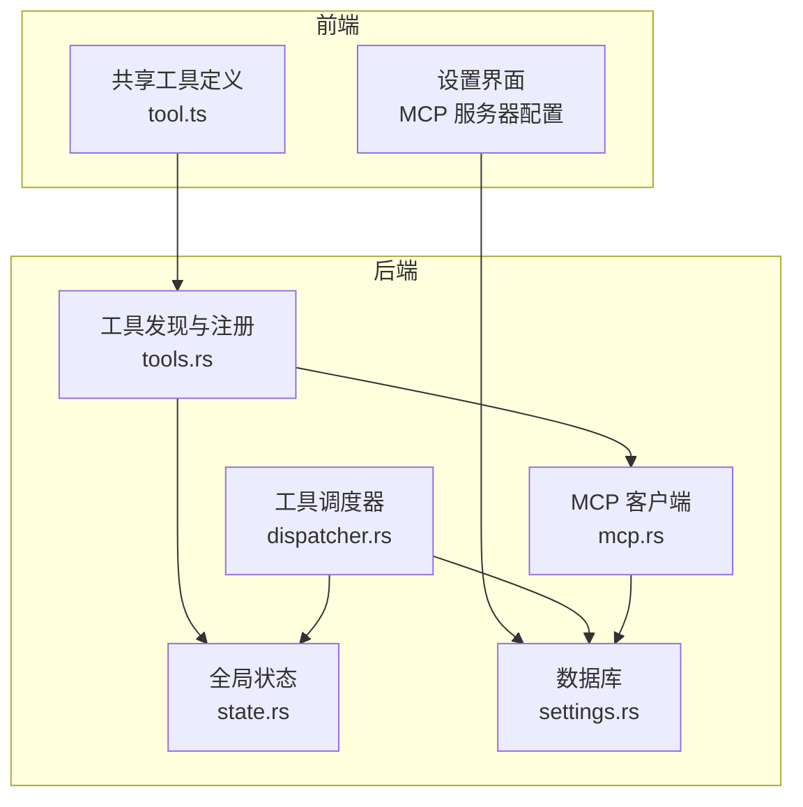
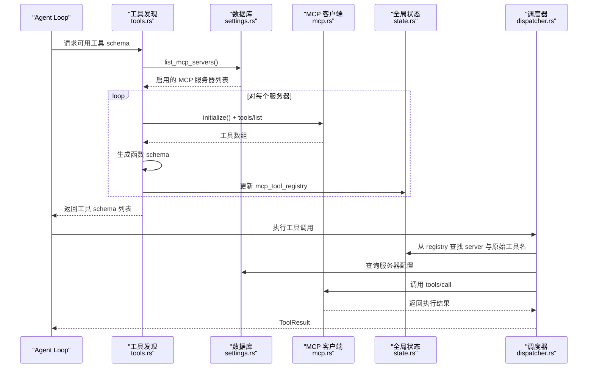
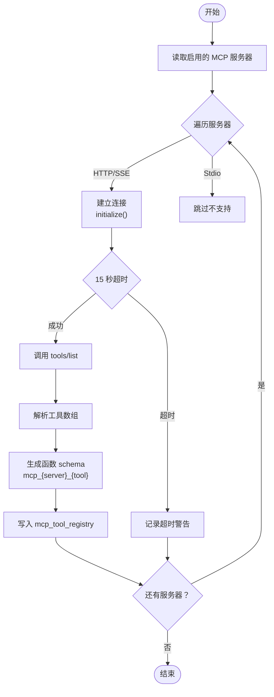
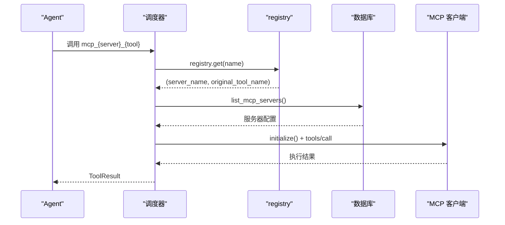
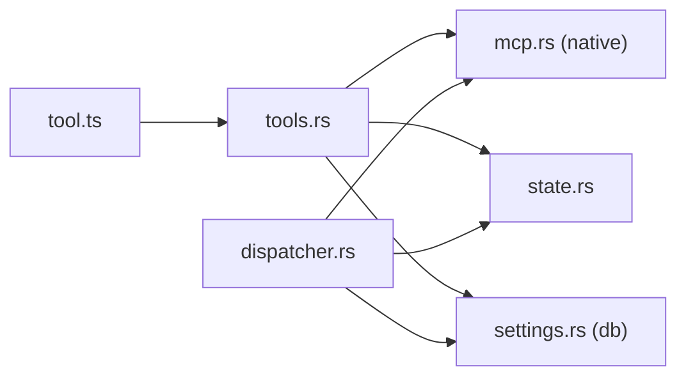

# 工具自动发现机制

<cite>
**本文引用的文件**
- [tools.rs](file://src-tauri/src/ai/tools.rs)
- [dispatcher.rs](file://src-tauri/src/ai/tools_impl/dispatcher.rs)
- [mcp.rs](file://src-tauri/src/ai/mcp.rs)
- [mcp.rs](file://native/src/ai/mcp.rs)
- [state.rs](file://src-tauri/src/state.rs)
- [settings.rs](file://src-tauri/src/db/settings.rs)
- [settings.rs](file://src-tauri/src/commands/settings.rs)
- [AGENT_DYNAMIC_TOOLS.md](file://docs/AGENT_DYNAMIC_TOOLS.md)
- [MCP_SKILL_SUMMARY.md](file://docs/MCP_SKILL_SUMMARY.md)
- [tool.ts](file://packages/shared/src/tool.ts)
</cite>

## 目录
1. [简介](#简介)
2. [项目结构](#项目结构)
3. [核心组件](#核心组件)
4. [架构总览](#架构总览)
5. [详细组件分析](#详细组件分析)
6. [依赖关系分析](#依赖关系分析)
7. [性能考量](#性能考量)
8. [故障排除指南](#故障排除指南)
9. [结论](#结论)
10. [附录](#附录)

## 简介
本文件详细阐述 CoSurf MCP 工具自动发现机制，涵盖以下要点：
- 连接 MCP 服务器后调用 tools/list 获取可用工具，并将其注册为 Agent 可用的 function
- 工具注册机制与命名规则 mcp_{server}_{tool} 的设计理念与优势
- 工具元数据处理（描述信息、输入参数验证）
- 工具发现的生命周期管理与缓存策略
- 调试方法与故障排除
- 与现有 Skills 系统的集成与兼容性

## 项目结构
CoSurf 的工具自动发现涉及前端、后端与共享模块的协作：
- 后端 Rust 模块负责与 MCP 服务器通信、解析工具列表、生成函数 schema、注册路由与执行
- 共享 TypeScript 模块提供工具定义的数据结构
- 文档模块提供实现细节与调试指南

**图表来源**
- [tools.rs:274-396](file://src-tauri/src/ai/tools.rs#L274-L396)
- [dispatcher.rs:121-204](file://src-tauri/src/ai/tools_impl/dispatcher.rs#L121-L204)
- [state.rs:1-80](file://src-tauri/src/state.rs#L1-L80)
- [settings.rs:110-124](file://src-tauri/src/db/settings.rs#L110-L124)
- [mcp.rs:94-182](file://native/src/ai/mcp.rs#L94-L182)

**章节来源**
- [tools.rs:1-418](file://src-tauri/src/ai/tools.rs#L1-L418)
- [dispatcher.rs:1-238](file://src-tauri/src/ai/tools_impl/dispatcher.rs#L1-L238)
- [state.rs:1-80](file://src-tauri/src/state.rs#L1-L80)
- [settings.rs:110-124](file://src-tauri/src/db/settings.rs#L110-L124)
- [tool.ts:1-87](file://packages/shared/src/tool.ts#L1-L87)

## 核心组件
- 工具发现与注册：从数据库读取启用的 MCP 服务器，连接服务器获取 tools/list，生成函数 schema 并注册到全局 registry
- 工具调度器：根据工具名前缀分发到内置、Skills 或 MCP 工具执行器
- MCP 客户端：封装 JSON-RPC 2.0 与 HTTP/SSE 传输，支持 tools/list 与 tools/call
- 全局状态：维护 mcp_tool_registry，供执行阶段查找服务器与原始工具名
- 数据持久化：MCP 服务器配置的增删改查与 UI 管理

**章节来源**
- [tools.rs:274-396](file://src-tauri/src/ai/tools.rs#L274-L396)
- [dispatcher.rs:121-204](file://src-tauri/src/ai/tools_impl/dispatcher.rs#L121-L204)
- [mcp.rs:94-182](file://native/src/ai/mcp.rs#L94-L182)
- [state.rs:1-80](file://src-tauri/src/state.rs#L1-L80)
- [settings.rs:110-124](file://src-tauri/src/db/settings.rs#L110-L124)

## 架构总览
工具自动发现与执行的关键流程如下：

**图表来源**
- [tools.rs:274-396](file://src-tauri/src/ai/tools.rs#L274-L396)
- [dispatcher.rs:121-204](file://src-tauri/src/ai/tools_impl/dispatcher.rs#L121-L204)
- [mcp.rs:94-182](file://native/src/ai/mcp.rs#L94-L182)
- [state.rs:1-80](file://src-tauri/src/state.rs#L1-L80)
- [settings.rs:110-124](file://src-tauri/src/db/settings.rs#L110-L124)

## 详细组件分析

### 工具自动发现与注册
- 服务器枚举：从数据库读取启用且未禁用的 MCP 服务器
- 传输模式确定：根据服务器类型选择 StreamableHttp/SSE 或跳过 Stdio
- 连接与超时：对每个服务器发起 initialize 与 tools/list 请求，设置 15 秒超时
- 工具解析：遍历返回的工具数组，提取 name/description/inputSchema
- 命名规则：mcp_{server_safe_name}_{tool_name}，其中 server_safe_name 将连字符与空格替换为下划线
- 元数据注入：description 前缀包含 "[MCP:服务器名]"，parameters 使用 MCP 提供的 JSON Schema
- 注册与缓存：将 (server_name, original_tool_name) 映射存入全局 registry，供执行阶段使用

**图表来源**
- [tools.rs:274-396](file://src-tauri/src/ai/tools.rs#L274-L396)

**章节来源**
- [tools.rs:274-396](file://src-tauri/src/ai/tools.rs#L274-L396)

### 工具命名规则与设计理念
- 命名模式：mcp_{server_safe_name}_{tool_name}
- 设计理念：
  - 唯一性：结合服务器名与工具名，避免同名冲突
  - 可读性：前缀明确标识来源（MCP），便于日志与调试
  - 兼容性：server_safe_name 统一替换连字符与空格为下划线，适配不同平台与 LLM 的函数名约束
- 优势：
  - 简化执行阶段路由：无需额外映射，直接按函数名查找
  - 易于调试与审计：函数名直观反映来源与工具
  - 与现有 Skills 命名区分：skill_{id} 与 mcp_{server}_{tool} 形成清晰边界

**章节来源**
- [tools.rs:367-371](file://src-tauri/src/ai/tools.rs#L367-L371)
- [dispatcher.rs:121-150](file://src-tauri/src/ai/tools_impl/dispatcher.rs#L121-L150)

### 工具元数据处理
- 描述信息：将服务器名嵌入 description 前缀，帮助模型识别来源
- 输入参数验证：采用 MCP 提供的 inputSchema，确保参数结构与类型约束
- 默认回退：若 inputSchema 缺失，使用宽松的 { type: "object", properties: {}, additionalProperties: true } 保证兼容性
- 输出格式：工具调用返回字符串，由 MCP 客户端统一解析与拼接

**章节来源**
- [tools.rs:356-365](file://src-tauri/src/ai/tools.rs#L356-L365)
- [mcp.rs:169-182](file://native/src/ai/mcp.rs#L169-L182)

### 工具执行与路由
- 路由规则：
  - skill_*：交由 Skills 执行器，懒加载完整内容
  - mcp_*：通过 mcp_tool_registry 查找服务器与原始工具名，再调用对应 MCP Server
  - 内置工具：直接进入对应模块执行
- 执行流程：
  - 从 registry 获取 server_name 与 original_tool_name
  - 查询数据库获取服务器配置（含 URL、headers、类型等）
  - 基于服务器类型选择传输模式（StreamableHttp/SSE），初始化客户端并调用 tools/call
  - 返回 ToolResult（包含 success 与 output）

**图表来源**
- [dispatcher.rs:121-204](file://src-tauri/src/ai/tools_impl/dispatcher.rs#L121-L204)
- [state.rs:1-80](file://src-tauri/src/state.rs#L1-L80)
- [settings.rs:110-124](file://src-tauri/src/db/settings.rs#L110-L124)

**章节来源**
- [dispatcher.rs:121-204](file://src-tauri/src/ai/tools_impl/dispatcher.rs#L121-L204)

### 生命周期管理与缓存策略
- 生命周期：
  - Agent 启动时：调用 get_available_tools_schemas_async，拉取并注册所有可用工具
  - 运行时：工具调用时通过 registry 快速定位服务器与工具
- 缓存策略：
  - 工具 schema 缓存：在工具发现阶段生成并写入全局 registry，避免重复查询
  - 传输层复用：MCP 客户端基于 reqwest，默认启用连接池与超时控制
  - 超时保护：对每个服务器的工具列表请求设置 15 秒超时，失败则跳过并记录警告
- 可扩展性：
  - registry 支持并发访问（Mutex 包裹），便于后续引入读写锁与 TTL 缓存

**章节来源**
- [tools.rs:386-395](file://src-tauri/src/ai/tools.rs#L386-L395)
- [mcp.rs:94-182](file://native/src/ai/mcp.rs#L94-L182)

### 与 Skills 系统的集成与兼容性
- 命名区分：Skills 使用 skill_{id}，MCP 使用 mcp_{server}_{tool}，避免冲突
- 元数据一致：两者均以 OpenAI function calling 格式暴露给模型，参数校验由各自来源提供
- 执行路径：调度器按前缀分流，Skills 采用懒加载策略，MCP 直接调用远端工具
- 兼容性：MCP 工具 schema 与内置工具 schema 一起参与工具列表生成，模型可自由选择

**章节来源**
- [tools.rs:227-272](file://src-tauri/src/ai/tools.rs#L227-L272)
- [dispatcher.rs:22-31](file://src-tauri/src/ai/tools_impl/dispatcher.rs#L22-L31)

## 依赖关系分析

**图表来源**
- [tools.rs:1-418](file://src-tauri/src/ai/tools.rs#L1-L418)
- [dispatcher.rs:1-238](file://src-tauri/src/ai/tools_impl/dispatcher.rs#L1-L238)
- [mcp.rs:1-267](file://native/src/ai/mcp.rs#L1-L267)
- [state.rs:1-80](file://src-tauri/src/state.rs#L1-L80)
- [settings.rs:110-124](file://src-tauri/src/db/settings.rs#L110-L124)
- [tool.ts:1-87](file://packages/shared/src/tool.ts#L1-L87)

**章节来源**
- [tools.rs:1-418](file://src-tauri/src/ai/tools.rs#L1-L418)
- [dispatcher.rs:1-238](file://src-tauri/src/ai/tools_impl/dispatcher.rs#L1-L238)
- [mcp.rs:1-267](file://native/src/ai/mcp.rs#L1-L267)
- [state.rs:1-80](file://src-tauri/src/state.rs#L1-L80)
- [settings.rs:110-124](file://src-tauri/src/db/settings.rs#L110-L124)
- [tool.ts:1-87](file://packages/shared/src/tool.ts#L1-L87)

## 性能考量
- 并发与超时：对每个服务器独立发起请求，设置 15 秒超时，避免阻塞整体工具列表生成
- 连接复用：MCP 客户端使用 reqwest，默认启用连接池，降低握手开销
- 缓存命中：工具 schema 一次性生成并缓存至 registry，减少重复查询
- 参数验证：采用 MCP 提供的 inputSchema，减少运行时参数校验成本
- 可扩展优化：未来可引入 TTL 缓存、增量更新与并发执行策略

[本节为通用指导，无需特定文件引用]

## 故障排除指南
- 工具未出现在工具列表
  - 检查服务器是否启用且未禁用
  - 确认服务器类型为 HTTP/StreamableHttp/SSE（Stdio 暂不支持）
  - 查看超时日志：若超过 15 秒，将跳过该服务器
- 工具调用失败
  - 确认 registry 中存在对应函数名
  - 检查服务器配置（URL、headers、类型）是否正确
  - 查看 MCP 客户端初始化与 tools/call 的错误日志
- 常见错误与解决
  - Unauthorized：检查 API Key 配置与环境变量
  - Timeout：检查网络连通性与服务器状态，必要时增加超时
  - Method not found：确认工具名拼写与服务器支持的工具列表
  - No result：检查服务器返回格式是否符合标准 JSON-RPC

**章节来源**
- [tools.rs:341-347](file://src-tauri/src/ai/tools.rs#L341-L347)
- [dispatcher.rs:141-148](file://src-tauri/src/ai/tools_impl/dispatcher.rs#L141-L148)
- [MCP_SKILL_SUMMARY.md:281-289](file://docs/MCP_SKILL_SUMMARY.md#L281-L289)

## 结论
CoSurf 的 MCP 工具自动发现机制通过标准化的 JSON-RPC 2.0 与 HTTP/SSE 传输，实现了对第三方工具的透明接入。其核心优势在于：
- 明确的命名规则与元数据注入，提升可读性与可维护性
- 基于 registry 的快速路由与缓存策略，保障执行效率
- 与 Skills 系统的清晰边界，确保生态兼容与扩展空间
- 完善的调试与故障排除指引，降低集成与运维成本

## 附录

### 数据模型概览
- MCP 服务器配置（数据库）
  - 字段：id、name、server_url、api_key、enabled、created_at、updated_at
  - 操作：list_mcp_servers、create/update/delete
- 工具定义（共享模块）
  - 字段：id、name、description、category、icon、enabled、configSchema
  - 用途：前端展示与配置

**章节来源**
- [settings.rs:70-100](file://src-tauri/src/db/settings.rs#L70-L100)
- [tool.ts:1-87](file://packages/shared/src/tool.ts#L1-L87)