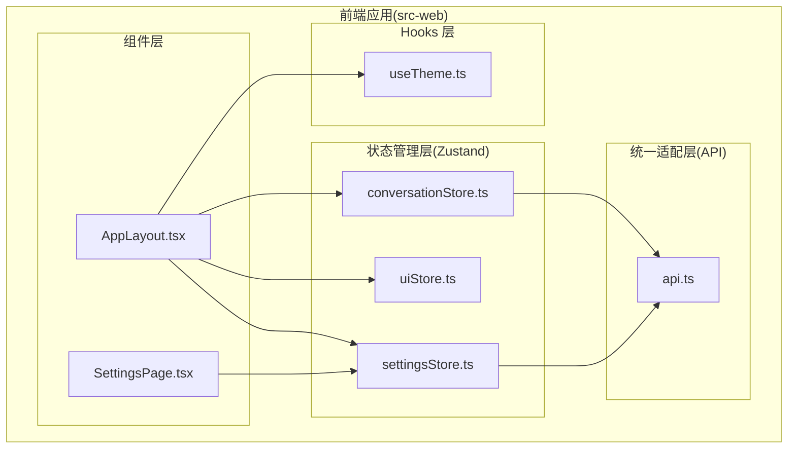
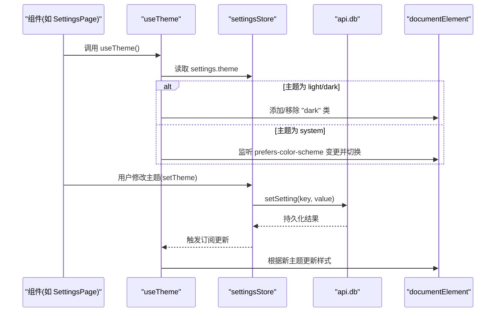
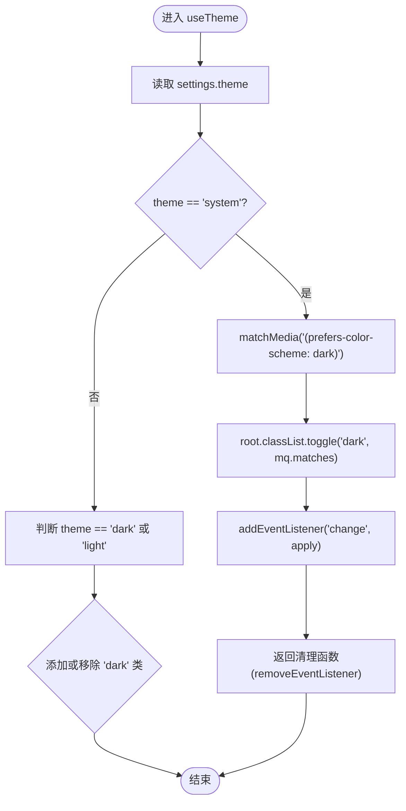
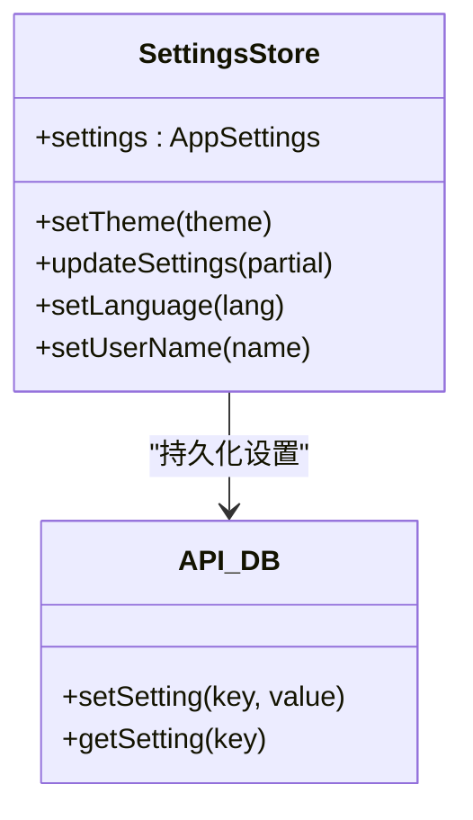
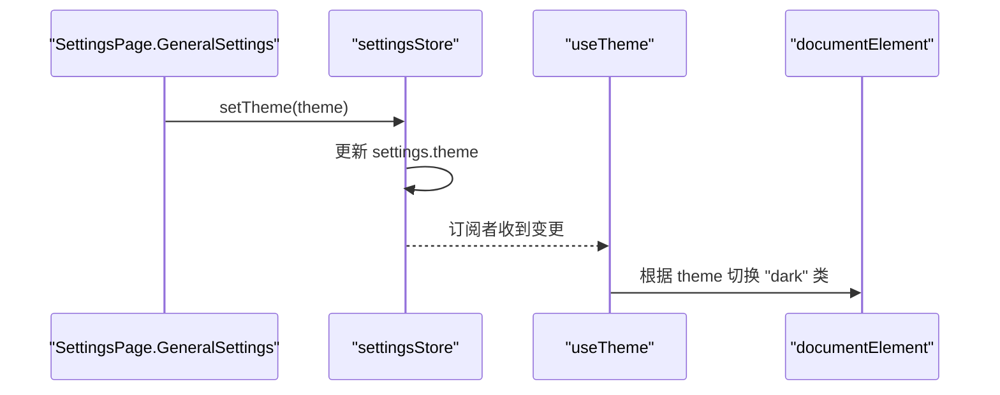
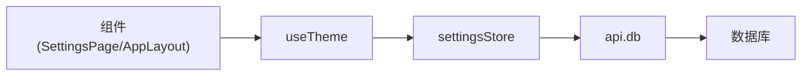

# Hooks 系统

<cite>
**本文引用的文件**
- [useTheme.ts](file://src-web/src/hooks/useTheme.ts)
- [settingsStore.ts](file://src-web/src/stores/settingsStore.ts)
- [api.ts](file://src-web/src/lib/api.ts)
- [AppLayout.tsx](file://src-web/src/components/layout/AppLayout.tsx)
- [SettingsPage.tsx](file://src-web/src/components/settings/SettingsPage.tsx)
- [conversationStore.ts](file://src-web/src/stores/conversationStore.ts)
- [uiStore.ts](file://src-web/src/stores/uiStore.ts)
</cite>

## 目录
1. [引言](#引言)
2. [项目结构](#项目结构)
3. [核心组件](#核心组件)
4. [架构总览](#架构总览)
5. [详细组件分析](#详细组件分析)
6. [依赖分析](#依赖分析)
7. [性能考虑](#性能考虑)
8. [故障排查指南](#故障排查指南)
9. [结论](#结论)
10. [附录](#附录)

## 引言
本文件围绕 CoSurf 的 Hooks 系统进行系统性梳理，重点以 useTheme 主题切换 Hook 为例，阐释自定义 Hooks 的设计与实现范式，包括状态封装、生命周期管理、依赖注入、跨组件复用策略与解耦思路。同时结合项目中的 Zustand Store、统一 API 适配层以及组件使用场景，给出 Hooks 的最佳实践、测试与调试建议，并提供可扩展的通用模式与错误处理策略。

## 项目结构
CoSurf 前端采用 React + TypeScript 构建，状态管理主要基于 Zustand Store，UI 层通过组件消费 Store 与 Hooks 实现功能。Hooks 位于 src-web/src/hooks 下，当前仓库中仅包含 useTheme 一个示例；其余业务逻辑主要通过 Store 与组件协作完成。

图表来源
- [AppLayout.tsx:17-93](file://src-web/src/components/layout/AppLayout.tsx#L17-L93)
- [SettingsPage.tsx:38-90](file://src-web/src/components/settings/SettingsPage.tsx#L38-L90)
- [useTheme.ts:4-24](file://src-web/src/hooks/useTheme.ts#L4-L24)
- [settingsStore.ts:33-200](file://src-web/src/stores/settingsStore.ts#L33-L200)
- [api.ts:11-429](file://src-web/src/lib/api.ts#L11-L429)

章节来源
- [useTheme.ts:1-25](file://src-web/src/hooks/useTheme.ts#L1-L25)
- [settingsStore.ts:1-201](file://src-web/src/stores/settingsStore.ts#L1-L201)
- [api.ts:1-429](file://src-web/src/lib/api.ts#L1-L429)
- [AppLayout.tsx:1-209](file://src-web/src/components/layout/AppLayout.tsx#L1-L209)
- [SettingsPage.tsx:1-802](file://src-web/src/components/settings/SettingsPage.tsx#L1-L802)

## 核心组件
- useTheme：主题切换 Hook，负责根据设置状态动态切换根节点样式类，支持跟随系统主题。
- settingsStore：全局设置状态容器，提供读取与写入主题、语言、用户信息等能力，并持久化到数据库。
- api：统一的底层 IPC/DB 调用适配层，封装 db、ai、tab、page、screenshot、skills、cache、dialog、shell、win 等模块。
- AppLayout 与 SettingsPage：展示如何在组件中消费 Store 与 Hook，体现 Hooks 的复用与解耦效果。

章节来源
- [useTheme.ts:4-24](file://src-web/src/hooks/useTheme.ts#L4-L24)
- [settingsStore.ts:33-90](file://src-web/src/stores/settingsStore.ts#L33-L90)
- [api.ts:54-245](file://src-web/src/lib/api.ts#L54-L245)
- [AppLayout.tsx:17-93](file://src-web/src/components/layout/AppLayout.tsx#L17-L93)
- [SettingsPage.tsx:147-267](file://src-web/src/components/settings/SettingsPage.tsx#L147-L267)

## 架构总览
下图展示了 useTheme 的运行路径：组件通过 useTheme Hook 订阅主题设置，设置变更触发 useEffect，进而更新 DOM 根元素的样式类；设置状态由 settingsStore 提供，持久化通过 api.db 完成。

图表来源
- [useTheme.ts:4-24](file://src-web/src/hooks/useTheme.ts#L4-L24)
- [settingsStore.ts:58-62](file://src-web/src/stores/settingsStore.ts#L58-L62)
- [api.ts:118-126](file://src-web/src/lib/api.ts#L118-L126)

## 详细组件分析

### useTheme Hook 设计与实现
- 抽象模式
  - 输入：从 settingsStore 中提取 theme 设置。
  - 行为：在组件挂载时根据 theme 值对根元素添加/移除 "dark" 类；当 theme 为 "system" 时，监听系统主题变化并动态切换。
  - 输出：无返回值，副作用作用于 DOM 根元素。
- 生命周期管理
  - 使用 useEffect 作为副作用入口，依赖项为 theme，确保仅在主题变化时重新计算。
  - 在 "system" 分支注册媒体查询监听，在卸载时清理监听，避免内存泄漏。
- 依赖注入
  - 依赖 settingsStore 的 theme 字段与 useSettingsStore 的读取器。
  - 依赖浏览器环境的 matchMedia 与 DOM API。
- 复用策略
  - 将“主题切换”这一横切关注点封装为 Hook，任何需要跟随主题的组件均可直接复用，无需重复实现 DOM 操作与媒体查询逻辑。
- 错误处理与健壮性
  - 通过条件分支区分固定主题与系统主题，避免无效监听。
  - 卸载时清理监听，防止组件卸载后仍执行回调。

图表来源
- [useTheme.ts:7-23](file://src-web/src/hooks/useTheme.ts#L7-L23)

章节来源
- [useTheme.ts:4-24](file://src-web/src/hooks/useTheme.ts#L4-L24)

### settingsStore 与主题持久化
- 状态结构
  - settings: AppSettings，包含 theme、language、userName 等字段。
  - 提供 setTheme 方法更新主题并持久化。
- 持久化流程
  - setTheme 调用 db.setSetting(key, value) 将主题写入数据库。
  - 组件通过读取 settings.theme 订阅主题变化，从而驱动 UI 更新。
- 与其他 Store 的关系
  - conversationStore 在发送消息前会读取 activeModel 与 settings，体现 Store 间的协作。

图表来源
- [settingsStore.ts:58-90](file://src-web/src/stores/settingsStore.ts#L58-L90)
- [api.ts:118-126](file://src-web/src/lib/api.ts#L118-L126)

章节来源
- [settingsStore.ts:33-90](file://src-web/src/stores/settingsStore.ts#L33-L90)
- [api.ts:118-126](file://src-web/src/lib/api.ts#L118-L126)

### 组件中的 Hooks 使用与解耦
- SettingsPage
  - 在 GeneralSettings 中提供主题切换按钮，点击后调用 useSettingsStore 的 setTheme，实现 UI 与状态的解耦。
  - 通过 useEffect 预加载与按需加载配置，减少首屏等待。
- AppLayout
  - 在组件挂载时加载模型与对话列表，体现组件级副作用管理与依赖注入（通过 Store 提供的方法）。

图表来源
- [SettingsPage.tsx:147-267](file://src-web/src/components/settings/SettingsPage.tsx#L147-L267)
- [useTheme.ts:4-24](file://src-web/src/hooks/useTheme.ts#L4-L24)

章节来源
- [SettingsPage.tsx:147-267](file://src-web/src/components/settings/SettingsPage.tsx#L147-L267)
- [AppLayout.tsx:87-93](file://src-web/src/components/layout/AppLayout.tsx#L87-L93)

## 依赖分析
- 组件对 Hooks 的依赖
  - AppLayout 与 SettingsPage 通过 useTheme 订阅主题状态，实现 UI 与主题逻辑的解耦。
- Hooks 对 Store 的依赖
  - useTheme 依赖 settingsStore 的 theme 字段；当 theme 变化时，useEffect 重新执行，更新 DOM。
- Store 对 API 的依赖
  - settingsStore 的 setTheme 通过 api.db.setSetting 持久化设置；conversationStore 通过 db 与 ai 模块进行数据与流式交互。
- 耦合与内聚
  - Hooks 专注于单一职责（主题切换），与组件解耦；Store 负责状态与持久化，API 层负责底层调用，层次清晰。

图表来源
- [useTheme.ts:4-24](file://src-web/src/hooks/useTheme.ts#L4-L24)
- [settingsStore.ts:58-62](file://src-web/src/stores/settingsStore.ts#L58-L62)
- [api.ts:118-126](file://src-web/src/lib/api.ts#L118-L126)

章节来源
- [useTheme.ts:4-24](file://src-web/src/hooks/useTheme.ts#L4-L24)
- [settingsStore.ts:58-90](file://src-web/src/stores/settingsStore.ts#L58-L90)
- [api.ts:118-126](file://src-web/src/lib/api.ts#L118-L126)

## 性能考虑
- 依赖数组优化
  - useTheme 的依赖为 theme，确保仅在主题变化时执行副作用，避免不必要的 DOM 操作。
- 媒体查询监听清理
  - 在 "system" 模式下注册监听并在卸载时清理，防止内存泄漏与重复监听。
- Store 订阅粒度
  - 组件通过选择器读取所需字段（如 s => s.settings.theme），避免无关状态变更触发重渲染。
- 异步加载与预加载
  - SettingsPage 在设置页打开时预加载配置，减少切换标签时的延迟。

章节来源
- [useTheme.ts:7-23](file://src-web/src/hooks/useTheme.ts#L7-L23)
- [SettingsPage.tsx:76-90](file://src-web/src/components/settings/SettingsPage.tsx#L76-L90)

## 故障排查指南
- 主题切换无效
  - 检查 settingsStore 的 setTheme 是否被调用，确认 db.setSetting 是否成功持久化。
  - 确认 useTheme 的依赖数组是否包含 theme，避免主题变更未触发副作用。
- 系统主题未生效
  - 确认 useTheme 在 theme 为 "system" 时已注册媒体查询监听，并在卸载时清理。
- Store 未更新
  - 检查组件是否通过 useSettingsStore 的选择器读取状态，避免直接比较引用导致未更新。
- API 调用失败
  - 查看 api.ts 的错误处理与日志输出，确认 window.electronAPI 是否可用。

章节来源
- [useTheme.ts:7-23](file://src-web/src/hooks/useTheme.ts#L7-L23)
- [settingsStore.ts:58-90](file://src-web/src/stores/settingsStore.ts#L58-L90)
- [api.ts:13-19](file://src-web/src/lib/api.ts#L13-L19)

## 结论
CoSurf 的 Hooks 系统以 useTheme 为代表，展示了如何通过自定义 Hook 将横切关注点（如主题切换）从组件中抽离，实现状态封装、生命周期管理与依赖注入的清晰分离。配合 Zustand Store 与统一 API 适配层，组件可以专注于业务逻辑，提升代码复用率与可维护性。后续可在现有模式基础上扩展更多通用 Hook，如网络状态、滚动位置、键盘快捷键等，进一步增强系统的可测试性与可演进性。

## 附录

### 常见 Hooks 模式与最佳实践
- 状态封装与副作用分离
  - 将状态读取与副作用逻辑封装在 Hook 内部，组件仅负责调用与渲染。
- 依赖注入与可测试性
  - 通过参数或外部依赖（如 Store 选择器）注入，便于单元测试替换依赖。
- 生命周期管理
  - 在 useEffect 中注册监听与定时器，务必在返回函数中清理，避免内存泄漏。
- 类型安全
  - 使用 TypeScript 明确定义 Store 状态与 API 返回类型，结合编译期检查降低运行时风险。
- 错误处理
  - 在 Store 与 API 层统一错误处理与日志输出，组件仅负责展示与用户反馈。

### 测试与调试建议
- 单元测试
  - 对纯函数与派生逻辑进行断言；对副作用逻辑可通过替换依赖（如 Store 选择器）进行测试。
- 集成测试
  - 在组件层面验证 Hook 的行为，如主题切换、系统主题监听等。
- 调试技巧
  - 在关键路径打印日志（如 Store 更新、API 调用、DOM 变更），定位问题范围。
  - 使用浏览器开发者工具观察 DOM 类名变化与媒体查询事件。

### 扩展开发指南
- 新增通用 Hook 的步骤
  - 明确职责边界，避免过度耦合。
  - 设计最小依赖集，优先使用 Store 选择器与统一 API。
  - 提供清晰的依赖数组与清理逻辑。
  - 编写测试用例覆盖正常与异常路径。
- 示例方向
  - 网络状态 Hook：监听 navigator.onLine，封装在线/离线状态。
  - 键盘快捷键 Hook：集中注册与清理快捷键，暴露可组合的事件处理器。
  - 滚动位置 Hook：监听滚动事件并提供受控状态，支持恢复与记忆。