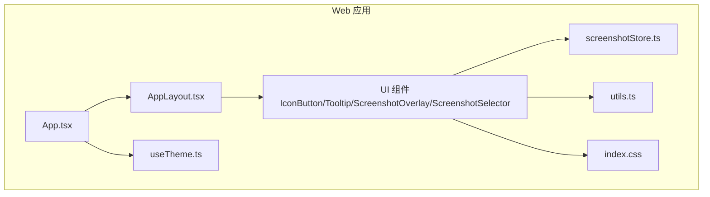
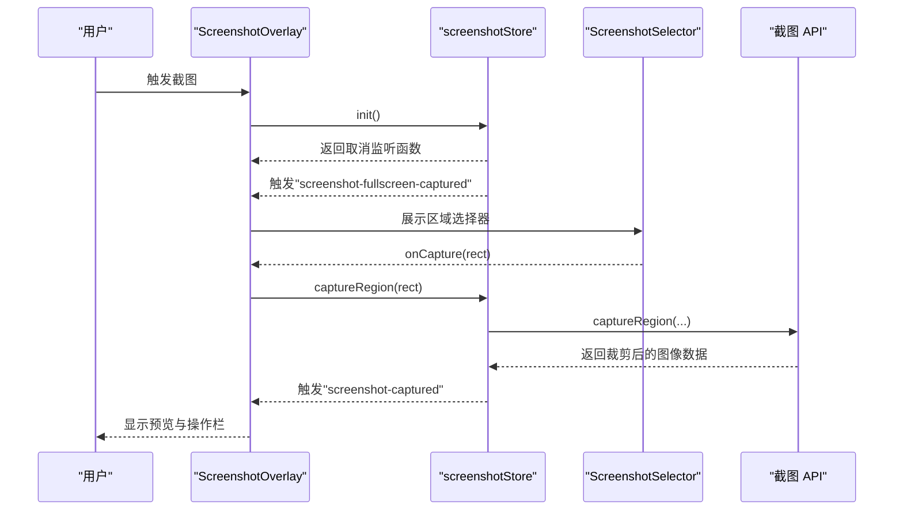
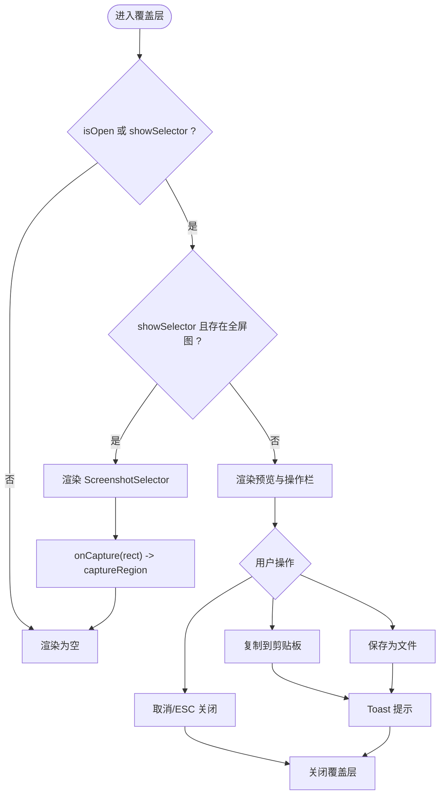
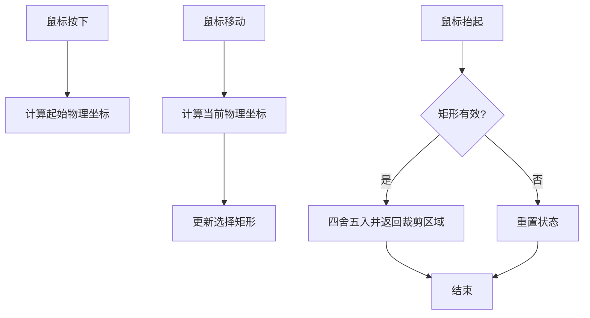
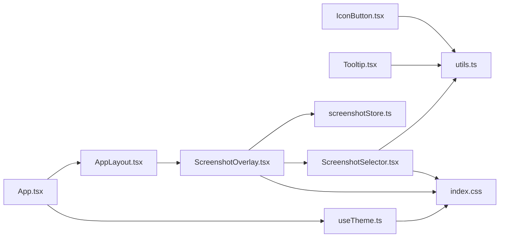

# UI 组件库

<cite>
**本文档引用的文件**
- [src-web/src/components/ui/IconButton.tsx](file://src-web/src/components/ui/IconButton.tsx)
- [src-web/src/components/ui/Tooltip.tsx](file://src-web/src/components/ui/Tooltip.tsx)
- [src-web/src/components/ui/ScreenshotOverlay.tsx](file://src-web/src/components/ui/ScreenshotOverlay.tsx)
- [src-web/src/components/ui/ScreenshotSelector.tsx](file://src-web/src/components/ui/ScreenshotSelector.tsx)
- [src-web/src/stores/screenshotStore.ts](file://src-web/src/stores/screenshotStore.ts)
- [src-web/src/hooks/useTheme.ts](file://src-web/src/hooks/useTheme.ts)
- [src-web/src/lib/utils.ts](file://src-web/src/lib/utils.ts)
- [src-web/src/index.css](file://src-web/src/index.css)
- [src-web/src/App.tsx](file://src-web/src/App.tsx)
- [src-web/src/components/layout/AppLayout.tsx](file://src-web/src/components/layout/AppLayout.tsx)
- [src-web/src/components/layout/BrowserActionPanel.tsx](file://src-web/src/components/layout/BrowserActionPanel.tsx)
- [src-web/package.json](file://src-web/package.json)
- [package.json](file://package.json)
</cite>

## 目录
1. [简介](#简介)
2. [项目结构](#项目结构)
3. [核心组件](#核心组件)
4. [架构总览](#架构总览)
5. [组件详解](#组件详解)
6. [依赖关系分析](#依赖关系分析)
7. [性能与体验优化](#性能与体验优化)
8. [故障排查指南](#故障排查指南)
9. [结论](#结论)
10. [附录](#附录)

## 简介
本文件面向 CoSurf Web 端 UI 组件库，聚焦基础交互组件的设计与实现，重点解析以下组件：IconButton（图标按钮）、Tooltip（提示工具）、ScreenshotOverlay（截图覆盖层）、ScreenshotSelector（截图选择器）。文档从架构、数据流、可访问性、响应式与动画、组合与扩展、第三方集成、测试与工程实践等维度进行系统化说明，并提供使用示例、样式定制与性能优化建议。

## 项目结构
- 组件位于 src-web/src/components/ui 下，采用“按功能分层 + 原子化组件”的组织方式。
- 样式基于 Tailwind CSS，通过 CSS 变量实现明暗主题切换。
- 状态管理采用 Zustand，截图流程通过事件总线与后端 API 协作完成。
- 主题钩子 useTheme 将设置中心的主题偏好映射到 DOM 根节点类名，驱动 CSS 变量切换。

图表来源
- [src-web/src/App.tsx:1-8](file://src-web/src/App.tsx#L1-L8)
- [src-web/src/components/layout/AppLayout.tsx:1-209](file://src-web/src/components/layout/AppLayout.tsx#L1-L209)
- [src-web/src/components/ui/IconButton.tsx:1-52](file://src-web/src/components/ui/IconButton.tsx#L1-L52)
- [src-web/src/components/ui/Tooltip.tsx:1-33](file://src-web/src/components/ui/Tooltip.tsx#L1-L33)
- [src-web/src/components/ui/ScreenshotOverlay.tsx:1-153](file://src-web/src/components/ui/ScreenshotOverlay.tsx#L1-L153)
- [src-web/src/components/ui/ScreenshotSelector.tsx:1-160](file://src-web/src/components/ui/ScreenshotSelector.tsx#L1-L160)
- [src-web/src/stores/screenshotStore.ts:1-128](file://src-web/src/stores/screenshotStore.ts#L1-L128)
- [src-web/src/hooks/useTheme.ts:1-25](file://src-web/src/hooks/useTheme.ts#L1-L25)
- [src-web/src/lib/utils.ts:1-40](file://src-web/src/lib/utils.ts#L1-L40)
- [src-web/src/index.css:1-95](file://src-web/src/index.css#L1-L95)

章节来源
- [src-web/src/App.tsx:1-8](file://src-web/src/App.tsx#L1-L8)
- [src-web/src/components/layout/AppLayout.tsx:1-209](file://src-web/src/components/layout/AppLayout.tsx#L1-L209)
- [src-web/src/index.css:1-95](file://src-web/src/index.css#L1-L95)

## 核心组件
- IconButton：语义化按钮，支持尺寸、变体、激活态与无障碍焦点环，使用 CSS 变量与过渡类实现统一风格。
- Tooltip：轻量提示，基于 group-hover 实现悬停显示，支持多方位定位与透明度过渡。
- ScreenshotOverlay：截图预览与操作面板，负责遮罩、预览图、复制/保存/取消等交互，以及键盘事件与动画。
- ScreenshotSelector：截图区域选择器，支持拖拽绘制、坐标换算、实时尺寸展示与 ESC 取消。

章节来源
- [src-web/src/components/ui/IconButton.tsx:1-52](file://src-web/src/components/ui/IconButton.tsx#L1-L52)
- [src-web/src/components/ui/Tooltip.tsx:1-33](file://src-web/src/components/ui/Tooltip.tsx#L1-L33)
- [src-web/src/components/ui/ScreenshotOverlay.tsx:1-153](file://src-web/src/components/ui/ScreenshotOverlay.tsx#L1-L153)
- [src-web/src/components/ui/ScreenshotSelector.tsx:1-160](file://src-web/src/components/ui/ScreenshotSelector.tsx#L1-L160)

## 架构总览
- 组件层：UI 组件通过 props 与内部状态协作，使用 cn 组合类名，遵循 Tailwind 类命名规范。
- 状态层：截图状态由 Zustand 管理，暴露初始化、关闭、区域裁剪、复制到剪贴板、保存到文件等方法。
- 事件与 API：通过事件总线监听截图完成事件，调用后端截图 API 执行复制/保存，使用对话框插件弹出保存路径。
- 主题层：useTheme 根据设置中心主题动态切换根节点类名，驱动 CSS 变量切换明暗色板。

图表来源
- [src-web/src/components/ui/ScreenshotOverlay.tsx:9-61](file://src-web/src/components/ui/ScreenshotOverlay.tsx#L9-L61)
- [src-web/src/stores/screenshotStore.ts:38-86](file://src-web/src/stores/screenshotStore.ts#L38-L86)
- [src-web/src/components/ui/ScreenshotSelector.tsx:12-102](file://src-web/src/components/ui/ScreenshotSelector.tsx#L12-L102)

## 组件详解

### IconButton（图标按钮）
- 设计要点
  - 支持 size（sm/md/lg）与 variant（ghost/subtle/solid），通过映射表生成尺寸与图标尺寸类。
  - 使用 CSS 变量与过渡类实现统一的悬停、禁用、焦点环与激活态视觉。
  - 透传原生 button 属性，便于无障碍与表单集成。
- 属性接口
  - children: ReactNode（必须）
  - size: "sm" | "md" | "lg"
  - variant: "ghost" | "subtle" | "solid"
  - active: boolean
  - className: string（可选）
  - 其他 ButtonHTMLAttributes（如 onClick、disabled 等）
- 无障碍与可访问性
  - 内置焦点可见性样式，满足键盘可达性。
  - 建议在图标按钮外层包裹 Tooltip，提供文本提示。
- 样式定制
  - 通过 variant 与 size 的映射类组合，或直接传入 className 进行覆盖。
  - 可结合 CSS 变量与 Tailwind 自定义主题色板进行深度定制。
- 使用示例
  - 基础用法：传入图标组件与 size/variant。
  - 与 Tooltip 组合：在 Tooltip 包裹下，同时提供图标与文字提示。

章节来源
- [src-web/src/components/ui/IconButton.tsx:4-49](file://src-web/src/components/ui/IconButton.tsx#L4-L49)
- [src-web/src/lib/utils.ts:1-3](file://src-web/src/lib/utils.ts#L1-L3)

### Tooltip（提示工具）
- 设计要点
  - 基于 group-hover 实现悬停显示，定位类根据 side（top/bottom/left/right）动态选择。
  - 使用绝对定位与透明度过渡，保证不阻断鼠标事件。
- 属性接口
  - children: ReactNode（必须，通常是触发元素）
  - label: string（必须，提示文本）
  - side: "top" | "bottom" | "left" | "right"
- 无障碍与可访问性
  - 仅在 hover 时显示，建议在可获得焦点的元素上配合 aria-label 或 title。
- 使用示例
  - 将 IconButton 或其他按钮元素作为 children，提供简洁的文本提示。

章节来源
- [src-web/src/components/ui/Tooltip.tsx:4-32](file://src-web/src/components/ui/Tooltip.tsx#L4-L32)

### ScreenshotOverlay（截图覆盖层）
- 功能特性
  - 全屏遮罩与模糊背景，居中显示预览图与操作栏。
  - 支持复制到剪贴板、保存为文件、取消与 ESC 关闭。
  - Toast 提示反馈成功/失败状态；动画入场与滑入提示。
- 属性接口
  - 无外部 props，通过 Zustand 状态与回调控制行为。
- 数据流
  - 初始化：init() 返回取消监听函数，监听截图完成事件。
  - 显示选择器：当收到全屏截图完成事件时，切换到选择器模式。
  - 显示预览：当收到裁剪完成事件时，切换到预览模式。
- 事件与键盘
  - ESC 键关闭覆盖层；点击遮罩区域关闭。
- 性能与体验
  - 使用 CSS 动画类实现淡入与滑入，避免 JS 控制动画带来的卡顿。
  - 禁用状态下按钮使用过渡类，提升交互反馈。

图表来源
- [src-web/src/components/ui/ScreenshotOverlay.tsx:9-61](file://src-web/src/components/ui/ScreenshotOverlay.tsx#L9-L61)
- [src-web/src/stores/screenshotStore.ts:38-86](file://src-web/src/stores/screenshotStore.ts#L38-L86)

章节来源
- [src-web/src/components/ui/ScreenshotOverlay.tsx:9-153](file://src-web/src/components/ui/ScreenshotOverlay.tsx#L9-L153)
- [src-web/src/stores/screenshotStore.ts:18-127](file://src-web/src/stores/screenshotStore.ts#L18-L127)

### ScreenshotSelector（截图选择器）
- 功能特性
  - 全屏背景图上绘制矩形选择框，实时显示尺寸。
  - 支持拖拽开始/移动/结束，坐标换算考虑 DPR 与图片显示尺寸差异。
  - ESC 取消；点击空白区域取消；点击右上角关闭按钮取消。
- 属性接口
  - fullScreenImage: string（全屏截图 Base64）
  - screenWidth/screenHeight: number（屏幕物理分辨率）
  - onCapture(rect): 回调返回裁剪区域
  - onCancel(): 回调取消选择
- 坐标换算
  - 将屏幕坐标转换为图片物理像素坐标，再映射到图片显示尺寸，确保跨设备与缩放一致性。
- 无障碍与可访问性
  - 通过键盘 ESC 与鼠标交互完成选择，建议在选择前提供简短提示文案。
- 使用示例
  - 在 ScreenshotOverlay 中作为子组件渲染，接收全屏图与屏幕参数，返回裁剪区域给父组件。

图表来源
- [src-web/src/components/ui/ScreenshotSelector.tsx:61-102](file://src-web/src/components/ui/ScreenshotSelector.tsx#L61-L102)
- [src-web/src/components/ui/ScreenshotSelector.tsx:21-50](file://src-web/src/components/ui/ScreenshotSelector.tsx#L21-L50)

章节来源
- [src-web/src/components/ui/ScreenshotSelector.tsx:12-160](file://src-web/src/components/ui/ScreenshotSelector.tsx#L12-L160)

## 依赖关系分析
- 组件依赖
  - IconButton/Tooltip/ScreenshotOverlay/ScreenshotSelector 依赖 utils.cn 进行类名合并。
  - ScreenshotOverlay 依赖 screenshotStore 管理状态与回调。
  - AppLayout 将 ScreenshotOverlay 注入到布局末尾，确保覆盖层层级最高。
- 主题与样式
  - useTheme 依据设置中心主题切换根节点类名，驱动 index.css 中的 CSS 变量。
  - index.css 定义明/暗两套变量，覆盖 surface/content/border/accent 等色板。
- 第三方依赖
  - lucide-react 提供图标。
  - @tauri-apps/api 与插件提供截图与对话框能力。
  - zustand 提供轻量状态管理。

图表来源
- [src-web/src/components/ui/IconButton.tsx:1-3](file://src-web/src/components/ui/IconButton.tsx#L1-L3)
- [src-web/src/components/ui/Tooltip.tsx:1-2](file://src-web/src/components/ui/Tooltip.tsx#L1-L2)
- [src-web/src/components/ui/ScreenshotOverlay.tsx:3-6](file://src-web/src/components/ui/ScreenshotOverlay.tsx#L3-L6)
- [src-web/src/components/ui/ScreenshotSelector.tsx:1-2](file://src-web/src/components/ui/ScreenshotSelector.tsx#L1-L2)
- [src-web/src/stores/screenshotStore.ts:1-3](file://src-web/src/stores/screenshotStore.ts#L1-L3)
- [src-web/src/App.tsx:1-2](file://src-web/src/App.tsx#L1-L2)
- [src-web/src/components/layout/AppLayout.tsx:8](file://src-web/src/components/layout/AppLayout.tsx#L8)
- [src-web/src/hooks/useTheme.ts:1-2](file://src-web/src/hooks/useTheme.ts#L1-L2)
- [src-web/src/index.css:5-41](file://src-web/src/index.css#L5-L41)

章节来源
- [src-web/src/components/layout/AppLayout.tsx:8](file://src-web/src/components/layout/AppLayout.tsx#L8)
- [src-web/src/hooks/useTheme.ts:4-23](file://src-web/src/hooks/useTheme.ts#L4-L23)
- [src-web/src/index.css:5-41](file://src-web/src/index.css#L5-L41)
- [src-web/package.json:14-25](file://src-web/package.json#L14-L25)
- [package.json:31-47](file://package.json#L31-L47)

## 性能与体验优化
- 性能
  - 使用 CSS 动画类替代 JS 动画，减少主线程压力。
  - 图片加载完成后计算真实显示尺寸，避免布局抖动。
  - 禁用状态下使用过渡类，避免频繁重排。
- 体验
  - Tooltip 使用 group-hover 与透明度过渡，保证交互顺滑。
  - ScreenshotOverlay 提供 Toast 反馈，增强用户信心。
  - ESC 键与点击遮罩关闭，符合用户预期。
- 可访问性
  - IconButton 内置焦点环，建议在图标按钮外层包裹 Tooltip 提供文本提示。
  - Tooltip 仅在 hover 时显示，对键盘用户可通过 title 或 aria-label 补充说明。
- 响应式
  - 使用 max-w/max-h 限制预览图尺寸，确保在小屏设备上可完整显示。
  - 基于 Tailwind 响应式前缀实现不同断点下的布局自适应。

## 故障排查指南
- 截图失败
  - 现象：Toast 显示失败提示。
  - 排查：检查截图 API 是否抛错；确认 fullScreenImage 与屏幕分辨率参数是否正确传递。
- 无法复制/保存
  - 现象：复制/保存按钮处于禁用或 Toast 显示失败。
  - 排查：确认 imageData 是否存在；检查权限与对话框插件可用性。
- 选择区域无效
  - 现象：拖拽结束后未触发裁剪。
  - 排查：确认最小尺寸阈值（宽高均需大于阈值）；检查坐标换算逻辑与 DPR。
- 主题不生效
  - 现象：切换主题后颜色未变化。
  - 排查：确认 useTheme 是否被 App 初始化；检查根节点类名与 CSS 变量是否正确切换。

章节来源
- [src-web/src/stores/screenshotStore.ts:82-101](file://src-web/src/stores/screenshotStore.ts#L82-L101)
- [src-web/src/stores/screenshotStore.ts:104-126](file://src-web/src/stores/screenshotStore.ts#L104-L126)
- [src-web/src/components/ui/ScreenshotSelector.tsx:88-102](file://src-web/src/components/ui/ScreenshotSelector.tsx#L88-L102)
- [src-web/src/hooks/useTheme.ts:7-23](file://src-web/src/hooks/useTheme.ts#L7-L23)

## 结论
本 UI 组件库以简洁、可组合为核心理念，IconButton 与 Tooltip 提供基础交互与提示，ScreenshotOverlay 与 ScreenshotSelector 构成完整的截图工作流。通过 Zustand 管理状态、事件总线与后端 API 协作，实现从全屏截图到区域裁剪再到复制/保存的闭环。配合主题系统与 Tailwind 样式体系，组件具备良好的可定制性与可访问性。建议在复杂场景中优先使用组合与扩展模式，保持组件职责单一，便于测试与维护。

## 附录
- 组合模式
  - 将 IconButton 与 Tooltip 组合，既提供图标又提供文本提示。
  - 在 AppLayout 中注入 ScreenshotOverlay，确保覆盖层始终在最顶层。
- 扩展机制
  - 通过 props 扩展 IconButton 的 size/variant；通过 className 扩展 Tooltip 的定位与样式。
  - ScreenshotSelector 可抽取为独立 Hook，复用坐标换算与事件处理逻辑。
- 第三方集成
  - 截图与对话框能力依赖 @tauri-apps 插件；建议在 Electron/Tauri 双栈环境下统一桥接。
- 测试策略
  - 单元测试：针对 cn、坐标换算、Toast 状态切换等纯函数与逻辑。
  - 集成测试：模拟事件总线与截图 API，验证覆盖层与选择器的交互链路。
  - 端到端测试：使用 Playwright 验证键盘快捷键、ESC 关闭、复制/保存等用户路径。
- 文档与版本管理
  - 组件文档与变更日志同步维护；版本号与包管理器锁定一致。
  - 代码规范与类型检查纳入 CI，确保质量门槛。