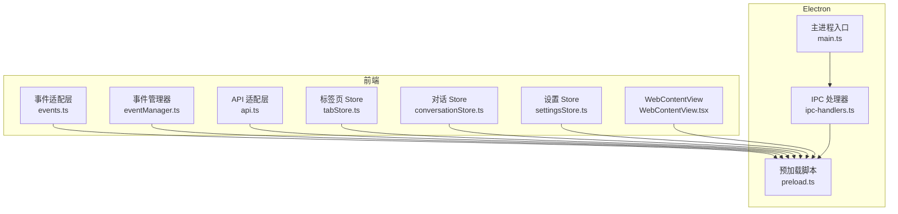
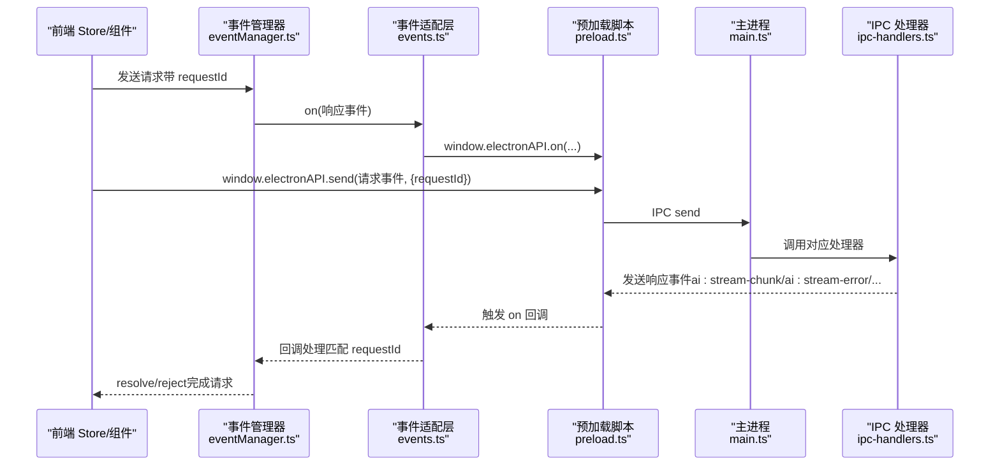
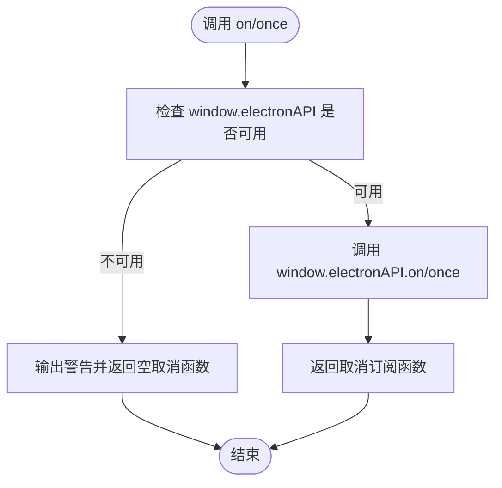
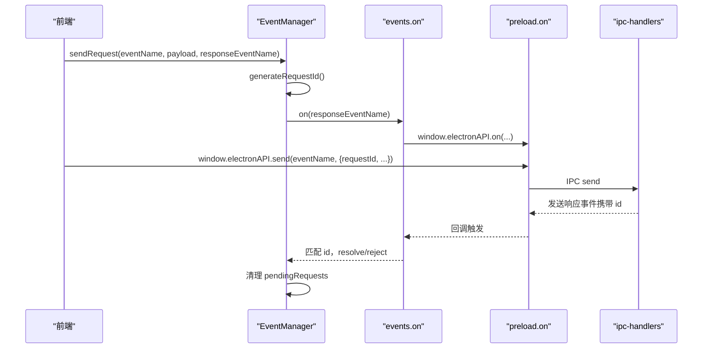
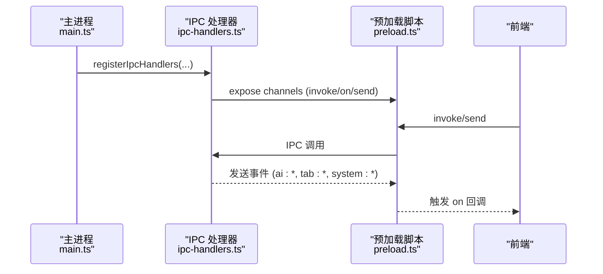
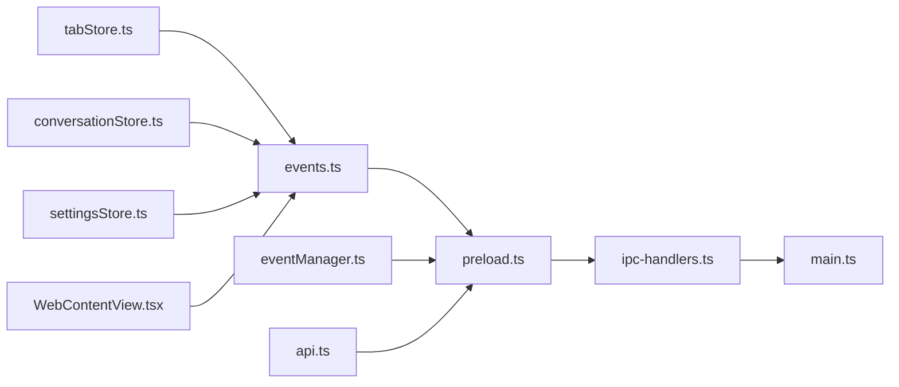

# 事件系统

<cite>
**本文档引用的文件**
- [eventManager.ts](file://src-web/src/lib/eventManager.ts)
- [events.ts](file://src-web/src/lib/events.ts)
- [api.ts](file://src-web/src/lib/api.ts)
- [tabStore.ts](file://src-web/src/stores/tabStore.ts)
- [conversationStore.ts](file://src-web/src/stores/conversationStore.ts)
- [settingsStore.ts](file://src-web/src/stores/settingsStore.ts)
- [WebContentView.tsx](file://src-web/src/components/layout/WebContentView.tsx)
- [main.ts](file://electron/main.ts)
- [ipc-handlers.ts](file://electron/ipc-handlers.ts)
- [preload.ts](file://electron/preload.ts)
</cite>

## 目录
1. [简介](#简介)
2. [项目结构](#项目结构)
3. [核心组件](#核心组件)
4. [架构总览](#架构总览)
5. [详细组件分析](#详细组件分析)
6. [依赖关系分析](#依赖关系分析)
7. [性能考虑](#性能考虑)
8. [故障排查指南](#故障排查指南)
9. [结论](#结论)
10. [附录](#附录)

## 简介
本文件系统性梳理 CoSurf 的事件系统，覆盖前端事件管理机制（发布订阅模式、事件总线）、事件传播与集成（与组件通信、状态管理、IPC 通信）、以及工程实践（性能优化、内存泄漏防护、调试工具）。文档基于仓库中的实际代码进行分析，并提供可视化图表帮助理解。

## 项目结构
CoSurf 的事件系统主要由以下层次构成：
- 前端事件适配层：统一 Electron IPC 与 Tauri 事件 API 差异，提供 on/once/off/removeAllListeners 等兼容接口。
- 前端事件管理器：封装请求-响应模式，支持带 requestId 的双向通信与超时控制。
- Store 层：Zustand 状态管理，结合事件监听实现 UI 与后端的状态同步。
- Electron 主进程：注册 IPC 处理器，向渲染进程发送事件（如 AI 流式事件、标签页事件、系统事件）。
- 预加载脚本：白名单控制，暴露安全的 electronAPI 给渲染进程。



**图表来源**
- [events.ts:1-83](file://src-web/src/lib/events.ts#L1-L83)
- [eventManager.ts:1-108](file://src-web/src/lib/eventManager.ts#L1-L108)
- [api.ts:1-445](file://src-web/src/lib/api.ts#L1-L445)
- [tabStore.ts:1-248](file://src-web/src/stores/tabStore.ts#L1-L248)
- [conversationStore.ts:1-365](file://src-web/src/stores/conversationStore.ts#L1-L365)
- [settingsStore.ts:1-201](file://src-web/src/stores/settingsStore.ts#L1-L201)
- [WebContentView.tsx:1-800](file://src-web/src/components/layout/WebContentView.tsx#L1-L800)
- [main.ts:1-232](file://electron/main.ts#L1-L232)
- [ipc-handlers.ts:1-740](file://electron/ipc-handlers.ts#L1-L740)
- [preload.ts:1-234](file://electron/preload.ts#L1-L234)

**章节来源**
- [events.ts:1-83](file://src-web/src/lib/events.ts#L1-L83)
- [eventManager.ts:1-108](file://src-web/src/lib/eventManager.ts#L1-L108)
- [api.ts:1-445](file://src-web/src/lib/api.ts#L1-L445)
- [tabStore.ts:1-248](file://src-web/src/stores/tabStore.ts#L1-L248)
- [conversationStore.ts:1-365](file://src-web/src/stores/conversationStore.ts#L1-L365)
- [settingsStore.ts:1-201](file://src-web/src/stores/settingsStore.ts#L1-L201)
- [WebContentView.tsx:1-800](file://src-web/src/components/layout/WebContentView.tsx#L1-L800)
- [main.ts:1-232](file://electron/main.ts#L1-L232)
- [ipc-handlers.ts:1-740](file://electron/ipc-handlers.ts#L1-L740)
- [preload.ts:1-234](file://electron/preload.ts#L1-L234)

## 核心组件
- 事件适配层（events.ts）：提供与 Tauri 兼容的 on/once/off/removeAllListeners 等 API，屏蔽 Electron preload 与 Tauri 的差异。
- 事件管理器（eventManager.ts）：实现请求-响应模式，支持带 requestId 的双向通信、超时控制、清理未完成请求。
- API 适配层（api.ts）：封装 invoke/send，统一调用 window.electronAPI，屏蔽底层差异。
- Store 层（tabStore.ts、conversationStore.ts、settingsStore.ts）：通过事件监听与后端交互，驱动 UI 状态变更。
- WebContentView（WebContentView.tsx）：监听后端事件，处理标签页导航、页面内容提取、元素选择等。
- Electron 主进程（main.ts）：创建窗口、注册 IPC 处理器、全局快捷键、网络拦截。
- IPC 处理器（ipc-handlers.ts）：桥接前端与 Rust 原生模块，向前端发送 AI 流式事件、标签页事件、系统事件。
- 预加载脚本（preload.ts）：白名单控制，暴露安全的 electronAPI 给渲染进程。

**章节来源**
- [events.ts:1-83](file://src-web/src/lib/events.ts#L1-L83)
- [eventManager.ts:1-108](file://src-web/src/lib/eventManager.ts#L1-L108)
- [api.ts:1-445](file://src-web/src/lib/api.ts#L1-L445)
- [tabStore.ts:1-248](file://src-web/src/stores/tabStore.ts#L1-L248)
- [conversationStore.ts:1-365](file://src-web/src/stores/conversationStore.ts#L1-L365)
- [settingsStore.ts:1-201](file://src-web/src/stores/settingsStore.ts#L1-L201)
- [WebContentView.tsx:1-800](file://src-web/src/components/layout/WebContentView.tsx#L1-L800)
- [main.ts:1-232](file://electron/main.ts#L1-L232)
- [ipc-handlers.ts:1-740](file://electron/ipc-handlers.ts#L1-L740)
- [preload.ts:1-234](file://electron/preload.ts#L1-L234)

## 架构总览
事件系统采用“前端事件适配层 + 事件管理器 + Store + Electron IPC”的分层架构：
- 前端通过 events.ts 提供统一的事件监听接口；eventManager.ts 实现请求-响应模式，确保与后端的双向通信可靠。
- api.ts 封装 invoke/send，统一调用 window.electronAPI，保证调用安全与一致性。
- Electron 主进程在 ipc-handlers.ts 中注册各类 IPC 处理器，向前端发送 AI 流式事件（ai:stream-chunk、ai:stream-error、ai:tool-call-start、ai:tool-call-result）以及标签页事件、系统事件等。
- 预加载脚本 preload.ts 通过白名单控制允许的 IPC 通道，确保安全。



**图表来源**
- [eventManager.ts:40-82](file://src-web/src/lib/eventManager.ts#L40-L82)
- [events.ts:51-79](file://src-web/src/lib/events.ts#L51-L79)
- [preload.ts:189-221](file://electron/preload.ts#L189-L221)
- [ipc-handlers.ts:231-315](file://electron/ipc-handlers.ts#L231-L315)

**章节来源**
- [eventManager.ts:1-108](file://src-web/src/lib/eventManager.ts#L1-L108)
- [events.ts:1-83](file://src-web/src/lib/events.ts#L1-L83)
- [preload.ts:1-234](file://electron/preload.ts#L1-L234)
- [ipc-handlers.ts:1-740](file://electron/ipc-handlers.ts#L1-L740)

## 详细组件分析

### 事件适配层（events.ts）
- 功能：提供与 Tauri 兼容的 on/once/off/removeAllListeners 等 API，屏蔽 Electron preload 与 Tauri 的差异。
- 事件常量：定义 AI 流式事件、标签页事件、系统事件等常量，便于集中管理。
- 安全性：在 window.electronAPI 不可用时输出警告，避免运行时崩溃。



**图表来源**
- [events.ts:51-79](file://src-web/src/lib/events.ts#L51-L79)

**章节来源**
- [events.ts:1-83](file://src-web/src/lib/events.ts#L1-L83)

### 事件管理器（eventManager.ts）
- 功能：实现请求-响应模式，支持带 requestId 的双向通信、超时控制、清理未完成请求。
- 请求流程：生成唯一 requestId，注册响应事件监听，发送请求事件，收到响应后匹配 requestId 并清理。
- 超时与清理：为每个请求设置超时定时器，支持全局 cleanup 清理。



**图表来源**
- [eventManager.ts:40-82](file://src-web/src/lib/eventManager.ts#L40-L82)
- [events.ts:51-79](file://src-web/src/lib/events.ts#L51-L79)
- [ipc-handlers.ts:231-315](file://electron/ipc-handlers.ts#L231-L315)

**章节来源**
- [eventManager.ts:1-108](file://src-web/src/lib/eventManager.ts#L1-L108)

### API 适配层（api.ts）
- 功能：封装 invoke/send，统一调用 window.electronAPI，屏蔽底层差异。
- JSON 解析：提供 parseJSON/parseJSONOrNull，处理 Rust N-API 返回的 JSON 字符串。
- 通道覆盖：涵盖数据库、AI、Agent、标签页、页面、截图、Skills、缓存、对话框、Shell、窗口控制、MCP 等通道。

**章节来源**
- [api.ts:1-445](file://src-web/src/lib/api.ts#L1-L445)

### Store 层与事件集成
- 标签页 Store（tabStore.ts）：维护标签页列表与活跃状态，通过 api 调用后端设置活跃标签页，并在 window 上暴露 activeTabId、navigateTo、updateTab，便于主进程桥接工具调用。
- 对话 Store（conversationStore.ts）：监听 AI 流式事件（ai:stream-chunk、ai:stream-error、ai:tool-call-start），将增量内容追加到消息列表，支持停止生成、完成流、自动更新标题。
- 设置 Store（settingsStore.ts）：加载模型配置、技能目录、IQS API Key 等，支持动态更新并持久化。

```mermaid
classDiagram
class TabStore {
+tabs : Tab[]
+activeTabId : string
+setActiveTab(id)
+addTab(url, title)
+closeTab(id)
+updateTab(id, updates)
+navigateTo(id, url)
+goBack(id)
+goForward(id)
}
class ConversationStore {
+conversations : Conversation[]
+activeConversationId : string
+messages : Message[]
+isStreaming : boolean
+sendMessage(content)
+stopStreaming()
+appendStreamDelta(delta, isThinking)
+finishStream()
+checkAndUpdateTitle()
}
class SettingsStore {
+settings : AppSettings
+models : ModelConfig[]
+activeModelId : string
+loadModels()
+setActiveModel(id)
+addModel(model)
+removeModel(id)
+updateModel(id, updates)
+loadSkillsDirectory()
+loadIqsApiKey()
}
TabStore --> "监听" Events : "tab : *"
ConversationStore --> "监听" Events : "ai : *"
SettingsStore --> "监听" Events : "db : *"
```

**图表来源**
- [tabStore.ts:1-248](file://src-web/src/stores/tabStore.ts#L1-L248)
- [conversationStore.ts:1-365](file://src-web/src/stores/conversationStore.ts#L1-L365)
- [settingsStore.ts:1-201](file://src-web/src/stores/settingsStore.ts#L1-L201)
- [events.ts:15-35](file://src-web/src/lib/events.ts#L15-L35)

**章节来源**
- [tabStore.ts:1-248](file://src-web/src/stores/tabStore.ts#L1-L248)
- [conversationStore.ts:1-365](file://src-web/src/stores/conversationStore.ts#L1-L365)
- [settingsStore.ts:1-201](file://src-web/src/stores/settingsStore.ts#L1-L201)

### WebContentView 与事件
- 监听后端事件：webview:get-tab-info、webview:get-tab-url、webview:navigating、webview:reload、webview:get-content、element-selected 等。
- 处理跨域限制：对同源网站注入链接拦截脚本，对跨域网站通过 postMessage 与父窗口通信。
- 安全处理：静默处理 iframe 中的 shell.open 错误，避免影响用户体验。

**章节来源**
- [WebContentView.tsx:1-800](file://src-web/src/components/layout/WebContentView.tsx#L1-L800)

### Electron 主进程与 IPC 处理器
- 主进程（main.ts）：创建窗口、配置 Webview Session、注册全局快捷键、初始化原生模块、注册 IPC 处理器。
- IPC 处理器（ipc-handlers.ts）：桥接前端与 Rust 原生模块，向前端发送 AI 流式事件、标签页事件、系统事件；处理需要主进程桥接的工具（如打开 URL、页面自动化、总结页面、导出 Markdown 等）。



**图表来源**
- [main.ts:177-208](file://electron/main.ts#L177-L208)
- [ipc-handlers.ts:48-539](file://electron/ipc-handlers.ts#L48-L539)
- [preload.ts:180-222](file://electron/preload.ts#L180-L222)

**章节来源**
- [main.ts:1-232](file://electron/main.ts#L1-L232)
- [ipc-handlers.ts:1-740](file://electron/ipc-handlers.ts#L1-L740)
- [preload.ts:1-234](file://electron/preload.ts#L1-L234)

## 依赖关系分析
- 低耦合高内聚：事件适配层与事件管理器相互独立，前者负责 API 兼容，后者负责请求-响应模式。
- 白名单安全：preload.ts 对 invoke/on/send 进行白名单控制，避免任意通道被滥用。
- 事件命名规范：统一使用冒号分隔的命名空间（如 ai:stream-chunk、tab:create），便于识别与管理。
- 生命周期管理：Store 中监听的事件在组件卸载时应取消订阅，避免内存泄漏。



**图表来源**
- [events.ts:1-83](file://src-web/src/lib/events.ts#L1-L83)
- [eventManager.ts:1-108](file://src-web/src/lib/eventManager.ts#L1-L108)
- [api.ts:1-445](file://src-web/src/lib/api.ts#L1-L445)
- [tabStore.ts:1-248](file://src-web/src/stores/tabStore.ts#L1-L248)
- [conversationStore.ts:1-365](file://src-web/src/stores/conversationStore.ts#L1-L365)
- [settingsStore.ts:1-201](file://src-web/src/stores/settingsStore.ts#L1-L201)
- [WebContentView.tsx:1-800](file://src-web/src/components/layout/WebContentView.tsx#L1-L800)
- [preload.ts:1-234](file://electron/preload.ts#L1-L234)
- [ipc-handlers.ts:1-740](file://electron/ipc-handlers.ts#L1-L740)
- [main.ts:1-232](file://electron/main.ts#L1-L232)

**章节来源**
- [events.ts:1-83](file://src-web/src/lib/events.ts#L1-L83)
- [eventManager.ts:1-108](file://src-web/src/lib/eventManager.ts#L1-L108)
- [api.ts:1-445](file://src-web/src/lib/api.ts#L1-L445)
- [tabStore.ts:1-248](file://src-web/src/stores/tabStore.ts#L1-L248)
- [conversationStore.ts:1-365](file://src-web/src/stores/conversationStore.ts#L1-L365)
- [settingsStore.ts:1-201](file://src-web/src/stores/settingsStore.ts#L1-L201)
- [WebContentView.tsx:1-800](file://src-web/src/components/layout/WebContentView.tsx#L1-L800)
- [preload.ts:1-234](file://electron/preload.ts#L1-L234)
- [ipc-handlers.ts:1-740](file://electron/ipc-handlers.ts#L1-L740)
- [main.ts:1-232](file://electron/main.ts#L1-L232)

## 性能考虑
- 事件监听去抖与节流：在高频事件（如滚动、窗口尺寸变化）场景下，建议在 Store 中进行节流/去抖处理，减少不必要的状态更新。
- 请求-响应超时：eventManager 默认超时时间可按需调整，避免长时间阻塞。
- 白名单控制：preload.ts 的白名单有效降低攻击面，同时避免误拦截合法通道。
- 跨域限制：WebContentView 对跨域网站的页面内容提取有限制，应通过后端代理或降级方案处理。
- Store 订阅粒度：尽量按需订阅，避免对整个状态树进行订阅，减少渲染压力。

[本节为通用指导，无需特定文件来源]

## 故障排查指南
- 事件未触发：检查事件名称是否正确、是否在白名单中、是否在正确的生命周期内注册。
- 请求超时：确认后端处理器是否正确发送响应事件、requestId 是否匹配、是否存在异常中断。
- 跨域问题：同源网站可注入脚本拦截链接，跨域网站需通过 postMessage 或后端代理。
- 内存泄漏：确保在组件卸载时调用 off/unlisten，释放事件监听器。
- 安全告警：若出现“Blocked invoke/on/send”，检查 preload.ts 白名单配置。

**章节来源**
- [events.ts:51-79](file://src-web/src/lib/events.ts#L51-L79)
- [eventManager.ts:40-82](file://src-web/src/lib/eventManager.ts#L40-L82)
- [WebContentView.tsx:136-180](file://src-web/src/components/layout/WebContentView.tsx#L136-L180)
- [preload.ts:180-222](file://electron/preload.ts#L180-L222)

## 结论
CoSurf 的事件系统通过“事件适配层 + 事件管理器 + Store + Electron IPC”的分层设计，实现了前后端的高效通信与状态同步。事件命名规范、白名单安全控制、请求-响应模式与 Store 集成，共同构成了稳定、可扩展的事件体系。建议在实际开发中遵循本文档的工程实践，持续优化性能与安全性。

[本节为总结，无需特定文件来源]

## 附录

### 事件分类与用途
- AI 流式事件：ai:stream-chunk、ai:stream-error、ai:tool-call-start、ai:tool-call-result
- 标签页事件：tab:create、tab:navigate、tab:title-updated、tab:loading、tab:loaded、tab:switched
- 系统事件：shortcut:screenshot、updater:update-available、webview:create-tab、cosurf:new-tab-response

**章节来源**
- [events.ts:15-35](file://src-web/src/lib/events.ts#L15-L35)

### 事件使用示例（路径指引）
- 发送请求并等待响应：参考 [eventManager.ts:40-82](file://src-web/src/lib/eventManager.ts#L40-L82)
- 监听 AI 流式事件：参考 [conversationStore.ts:172-216](file://src-web/src/stores/conversationStore.ts#L172-L216)
- 监听标签页事件：参考 [WebContentView.tsx:182-250](file://src-web/src/components/layout/WebContentView.tsx#L182-L250)
- 发送 IPC 请求：参考 [api.ts:13-19](file://src-web/src/lib/api.ts#L13-L19)

### 扩展开发指南
- 新增事件通道：在 events.ts 中定义事件常量，在 preload.ts 中加入白名单，在 ipc-handlers.ts 中注册处理器。
- 新增 Store 监听：在相应 Store 中使用 on/once 监听事件，注意在组件卸载时取消订阅。
- 请求-响应模式：使用 eventManager.sendRequest，确保 requestId 匹配与超时处理。

**章节来源**
- [events.ts:1-83](file://src-web/src/lib/events.ts#L1-L83)
- [eventManager.ts:1-108](file://src-web/src/lib/eventManager.ts#L1-L108)
- [ipc-handlers.ts:1-740](file://electron/ipc-handlers.ts#L1-L740)
- [preload.ts:1-234](file://electron/preload.ts#L1-L234)